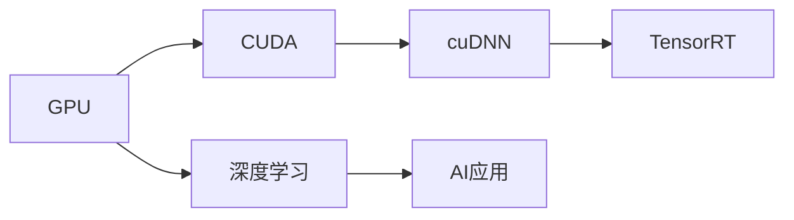

                 

## 1. 背景介绍

### 1.1 问题由来

近年来，人工智能（AI）算力的发展迅猛，尤其是GPU技术的进步，推动了深度学习和大数据技术的应用。其中，NVIDIA作为GPU领域的领导者，在推动AI算力发展方面发挥了关键作用。本文将探讨NVIDIA在AI算力推动上的关键技术和战略，以及其对NLP、自动驾驶、科学计算等领域的影响。

### 1.2 问题核心关键点

NVIDIA通过持续创新，推动AI算力快速发展，其关键技术包括：

- **GPU架构优化**：NVIDIA不断优化GPU架构，提升并行计算能力，支持高效的深度学习算法。
- **AI软件栈建设**：通过CUDA、cuDNN、TensorRT等软件栈的开发，提供一站式的AI计算平台。
- **合作伙伴生态**：与谷歌、微软、亚马逊等科技巨头合作，构建强大的AI生态系统。

NVIDIA通过这些技术手段，极大地提升了AI计算效率，推动了AI技术的广泛应用。本文将详细介绍这些技术，并探讨其对未来AI发展的可能影响。

## 2. 核心概念与联系

### 2.1 核心概念概述

- **GPU**：图形处理器，主要负责图形渲染，但也可以进行并行计算。
- **深度学习**：通过多层神经网络，从大量数据中学习模式，实现复杂的模式识别和预测任务。
- **CUDA**：NVIDIA开发的并行计算平台，用于加速GPU上的应用程序。
- **cuDNN**：NVIDIA提供的深度神经网络库，支持各种深度学习算法的加速。
- **TensorRT**：NVIDIA的优化推理引擎，用于加速深度学习模型的推理过程。

这些概念紧密相关，共同构成了NVIDIA推动AI算力的关键技术栈。通过GPU架构的不断优化，CUDA、cuDNN、TensorRT等软件的开发，NVIDIA构建了一个完整的AI计算生态系统，推动了AI技术在多个领域的广泛应用。

### 2.2 概念间的关系

NVIDIA通过GPU、CUDA、cuDNN、TensorRT等技术的不断优化和创新，推动了AI算力的快速发展。以下是这些核心概念之间的逻辑关系图：



该图展示了从GPU到深度学习，再到AI应用的整体流程。GPU提供了强大的计算能力，CUDA、cuDNN、TensorRT等技术进一步加速了深度学习模型的训练和推理，最终应用于AI应用的各个领域。

## 3. 核心算法原理 & 具体操作步骤

### 3.1 算法原理概述

NVIDIA通过GPU并行计算，显著提升了深度学习模型的训练和推理效率。其核心算法原理包括：

- **GPU并行计算**：利用GPU的并行计算能力，加速深度学习模型的训练和推理。
- **深度学习框架优化**：针对TensorFlow、PyTorch等深度学习框架进行优化，提升计算效率。
- **算法层级优化**：在算法层面上进行优化，如使用剪枝、量化、蒸馏等技术，减少模型参数，提高计算效率。

这些算法原理共同构成了NVIDIA推动AI算力的核心技术。

### 3.2 算法步骤详解

以下是NVIDIA推动AI算力的主要操作步骤：

1. **硬件优化**：
   - 设计高性能的GPU架构，如NVIDIA Ampere架构，提升计算密度和带宽。
   - 开发高效的CUDA和cuDNN库，支持多种深度学习算法的加速。

2. **软件优化**：
   - 针对TensorFlow、PyTorch等深度学习框架进行优化，减少计算开销。
   - 引入剪枝、量化、蒸馏等技术，减少模型参数，提高计算效率。

3. **生态系统建设**：
   - 构建完整的AI计算生态系统，包括GPU硬件、CUDA软件、cuDNN库、TensorRT引擎等。
   - 与谷歌、微软、亚马逊等科技巨头合作，构建强大的AI生态系统。

4. **应用推广**：
   - 推广AI技术在各个领域的应用，如自动驾驶、科学计算、NLP等。
   - 提供广泛的支持，包括培训、咨询、技术支持等。

### 3.3 算法优缺点

NVIDIA推动AI算力的主要优点包括：

- **计算效率高**：GPU并行计算能力强，能显著提升深度学习模型的训练和推理效率。
- **生态系统完善**：构建了从硬件到软件的完整生态系统，支持广泛的AI应用。
- **技术领先**：持续优化GPU架构和深度学习框架，保持技术领先地位。

其主要缺点包括：

- **能耗高**：GPU运行时能耗较高，需要大量的电力支持。
- **价格昂贵**：高端GPU价格昂贵，对中小企业和小型团队形成一定的门槛。

### 3.4 算法应用领域

NVIDIA推动AI算力的主要应用领域包括：

- **自动驾驶**：通过GPU加速深度学习模型，实现车辆感知、决策和控制。
- **科学计算**：支持大规模科学计算，加速物理模拟、材料科学等领域的研究。
- **NLP**：加速自然语言处理任务的训练和推理，提升语音识别、机器翻译等应用的性能。
- **医疗**：支持医疗影像分析、疾病预测等任务，提升医疗诊断和治疗效果。
- **金融**：支持高频交易、风险管理等金融应用，提升金融决策的准确性。

## 4. 数学模型和公式 & 详细讲解 & 举例说明

### 4.1 数学模型构建

NVIDIA推动AI算力的数学模型主要围绕深度学习模型的训练和推理进行构建。以下是一个简单的深度学习模型构建过程：

1. **输入层**：将原始数据转化为模型可处理的格式，如将图像数据转化为向量。
2. **隐藏层**：通过多层神经网络，学习数据中的模式和特征。
3. **输出层**：根据隐藏层的特征，输出预测结果。

### 4.2 公式推导过程

以下是一个简单的深度学习模型训练过程的公式推导：

1. **前向传播**：
   $$
   y = f(x; \theta)
   $$
   其中 $x$ 为输入数据，$\theta$ 为模型参数，$f$ 为激活函数。

2. **损失函数**：
   $$
   \mathcal{L}(\theta) = \frac{1}{N} \sum_{i=1}^N \ell(y_i, \hat{y}_i)
   $$
   其中 $\ell$ 为损失函数，$\hat{y}_i$ 为模型预测结果。

3. **梯度下降**：
   $$
   \theta_{t+1} = \theta_t - \eta \nabla_{\theta} \mathcal{L}(\theta_t)
   $$
   其中 $\eta$ 为学习率，$\nabla_{\theta} \mathcal{L}(\theta_t)$ 为损失函数对模型参数的梯度。

4. **反向传播**：
   $$
   \frac{\partial \mathcal{L}(\theta)}{\partial x} = \frac{\partial \mathcal{L}(\theta)}{\partial y} \frac{\partial y}{\partial x}
   $$
   其中 $\frac{\partial \mathcal{L}(\theta)}{\partial y}$ 为损失函数对输出层的梯度，$\frac{\partial y}{\partial x}$ 为激活函数的梯度。

### 4.3 案例分析与讲解

以NVIDIA推动自动驾驶AI算力为例，分析其关键技术的应用：

1. **传感器数据融合**：利用GPU并行计算，快速处理来自摄像头、雷达、激光雷达等传感器的数据，进行数据融合和预处理。

2. **深度学习模型训练**：使用GPU加速深度学习模型的训练，优化神经网络结构，提升模型性能。

3. **实时推理**：通过TensorRT引擎优化深度学习模型的推理，支持实时决策和控制。

4. **安全性和可靠性**：引入剪枝、量化等技术，减少模型参数，提高计算效率，同时确保模型的安全性和可靠性。

## 5. 项目实践：代码实例和详细解释说明

### 5.1 开发环境搭建

1. **安装NVIDIA GPU**：选择NVIDIA Ampere架构的GPU，安装最新驱动。
2. **安装CUDA**：从NVIDIA官网下载并安装最新版本的CUDA。
3. **安装cuDNN**：从NVIDIA官网下载并安装最新版本的cuDNN。
4. **安装TensorRT**：从NVIDIA官网下载并安装最新版本的TensorRT。

### 5.2 源代码详细实现

以下是一个使用TensorRT进行深度学习模型推理的代码实现：

```python
import tensorflow as tf
import cv2
import tensorrt as trt

# 加载模型
model = tf.keras.models.load_model('model.h5')

# 准备输入数据
input_shape = (224, 224, 3)
input_data = cv2.imread('image.jpg').reshape(1, input_shape[0], input_shape[1], input_shape[2])

# 创建TRT推理引擎
with trt.Builder() as builder, builder.create_network() as network, trt.IBuilderConfig() as config:
    config.max_workspace_size = 1 << 30
    network.add_input('input', shape=trt.dims(input_shape))
    network.add_output('output')
    builder.build(network, config)
    engine = builder.create_engine(network)

# 运行推理
context = engine.create_execution_context()
input_shape = (1, input_shape[0], input_shape[1], input_shape[2])
inputs = {'input': trt.dims(input_shape).convert()}
outputs = context.execute(inputs, inputs['input'])
print(outputs[0])
```

### 5.3 代码解读与分析

- **加载模型**：使用TensorFlow加载预训练的深度学习模型。
- **准备输入数据**：将输入图像数据转换为模型可处理的格式。
- **创建TRT推理引擎**：使用TensorRT创建深度学习模型的推理引擎。
- **运行推理**：使用TensorRT引擎进行深度学习模型的推理，输出预测结果。

## 6. 实际应用场景

### 6.1 智能交通系统

NVIDIA通过GPU并行计算和深度学习技术，推动了智能交通系统的发展。其应用场景包括：

- **交通流量预测**：通过深度学习模型，预测道路交通流量，优化交通信号控制。
- **车辆自动驾驶**：使用GPU加速深度学习模型，实现车辆感知、决策和控制，提升道路安全性。
- **智能交通管理**：利用GPU并行计算，快速处理大规模交通数据，优化交通管理和决策。

### 6.2 科学计算

NVIDIA的GPU技术支持大规模科学计算，其应用场景包括：

- **物理模拟**：使用GPU加速大规模物理模拟，提升研究效率和精度。
- **材料科学**：通过GPU并行计算，加速材料设计和分析，推动新材料的应用。
- **生物信息学**：使用GPU加速生物信息学计算，提升基因组学和蛋白质组学研究速度。

### 6.3 医疗影像分析

NVIDIA推动的AI算力在医疗影像分析中发挥了重要作用，其应用场景包括：

- **医学影像诊断**：通过深度学习模型，自动识别和分析医学影像，提升诊断效率和准确性。
- **手术辅助**：使用GPU加速深度学习模型，辅助医生进行手术决策和操作。
- **疾病预测**：通过深度学习模型，预测疾病发展趋势，提升医疗干预效果。

### 6.4 未来应用展望

未来，NVIDIA将进一步推动AI算力的发展，其展望如下：

1. **下一代GPU架构**：通过不断优化GPU架构，提升计算密度和带宽，推动AI算力发展。
2. **软件生态系统**：构建更加完善的AI软件生态系统，支持更广泛的AI应用。
3. **AI边缘计算**：推动AI边缘计算技术的发展，实现更高效、更灵活的AI应用。
4. **AI伦理和安全**：引入AI伦理和安全机制，确保AI技术的可靠性和安全性。

## 7. 工具和资源推荐

### 7.1 学习资源推荐

1. **NVIDIA官网**：提供最新的GPU、CUDA、cuDNN和TensorRT等技术文档和资源。
2. **TensorFlow官网**：提供深度学习框架的详细文档和教程。
3. **PyTorch官网**：提供深度学习框架的详细文档和教程。

### 7.2 开发工具推荐

1. **NVIDIA CUDA Toolkit**：提供GPU编程和优化工具。
2. **NVIDIA cuDNN**：提供深度神经网络库，加速深度学习算法的运行。
3. **NVIDIA TensorRT**：提供优化推理引擎，加速深度学习模型的推理。

### 7.3 相关论文推荐

1. "CUDA-Accelerated Deep Learning" by NVIDIA
2. "cuDNN: Speeding Up Deep Convolutional Neural Networks" by NVIDIA
3. "TensorRT Inference Engine" by NVIDIA

## 8. 总结：未来发展趋势与挑战

### 8.1 研究成果总结

NVIDIA通过GPU并行计算和深度学习技术，推动了AI算力的快速发展，其技术栈包括GPU架构优化、CUDA和cuDNN软件优化、TensorRT推理引擎等。NVIDIA的生态系统覆盖了深度学习模型训练、推理、应用推广等多个环节，推动了AI技术在各个领域的应用。

### 8.2 未来发展趋势

未来，NVIDIA将继续推动AI算力的发展，其趋势包括：

1. **下一代GPU架构**：通过不断优化GPU架构，提升计算密度和带宽，推动AI算力发展。
2. **软件生态系统**：构建更加完善的AI软件生态系统，支持更广泛的AI应用。
3. **AI边缘计算**：推动AI边缘计算技术的发展，实现更高效、更灵活的AI应用。
4. **AI伦理和安全**：引入AI伦理和安全机制，确保AI技术的可靠性和安全性。

### 8.3 面临的挑战

NVIDIA推动AI算力的发展面临以下挑战：

1. **能耗高**：GPU运行时能耗较高，需要大量的电力支持。
2. **价格昂贵**：高端GPU价格昂贵，对中小企业和小型团队形成一定的门槛。
3. **算法瓶颈**：深度学习算法的复杂性和计算开销较大，需要不断优化。

### 8.4 研究展望

未来，NVIDIA在推动AI算力发展方面的研究展望包括：

1. **算法优化**：通过剪枝、量化、蒸馏等技术，减少模型参数，提高计算效率。
2. **生态系统建设**：构建更加完善的AI计算生态系统，支持更广泛的AI应用。
3. **AI伦理和安全**：引入AI伦理和安全机制，确保AI技术的可靠性和安全性。

## 9. 附录：常见问题与解答

**Q1：如何理解NVIDIA推动AI算力发展的核心技术？**

A: NVIDIA通过GPU并行计算和深度学习技术，推动了AI算力的快速发展。其主要技术包括GPU架构优化、CUDA和cuDNN软件优化、TensorRT推理引擎等。这些技术共同构成了NVIDIA推动AI算力的核心技术栈。

**Q2：NVIDIA推动AI算力发展的主要优势是什么？**

A: NVIDIA推动AI算力发展的主要优势包括计算效率高、生态系统完善、技术领先等。通过GPU并行计算，NVIDIA显著提升了深度学习模型的训练和推理效率。其完整的AI计算生态系统支持广泛的AI应用，而持续的技术创新使其保持了技术领先地位。

**Q3：NVIDIA推动AI算力发展的主要应用领域有哪些？**

A: NVIDIA推动AI算力发展的主要应用领域包括自动驾驶、科学计算、NLP、医疗、金融等。这些领域对计算效率和模型性能有较高的要求，NVIDIA的GPU和深度学习技术提供了强大的支持。

**Q4：NVIDIA推动AI算力发展面临的主要挑战是什么？**

A: NVIDIA推动AI算力发展面临的主要挑战包括能耗高、价格昂贵、算法瓶颈等。虽然NVIDIA的技术优势显著，但在能耗和成本方面仍需不断优化。

**Q5：未来NVIDIA推动AI算力发展的方向是什么？**

A: 未来，NVIDIA将持续推动AI算力的发展，主要方向包括下一代GPU架构优化、AI软件生态系统建设、AI边缘计算、AI伦理和安全等。通过不断创新和优化，NVIDIA将继续推动AI技术在各个领域的应用。

---

作者：禅与计算机程序设计艺术 / Zen and the Art of Computer Programming

