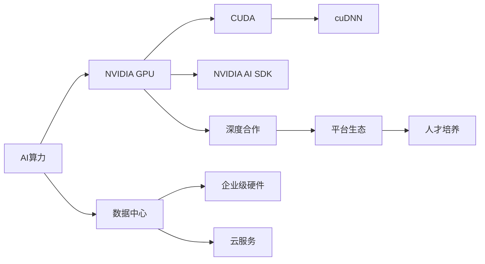
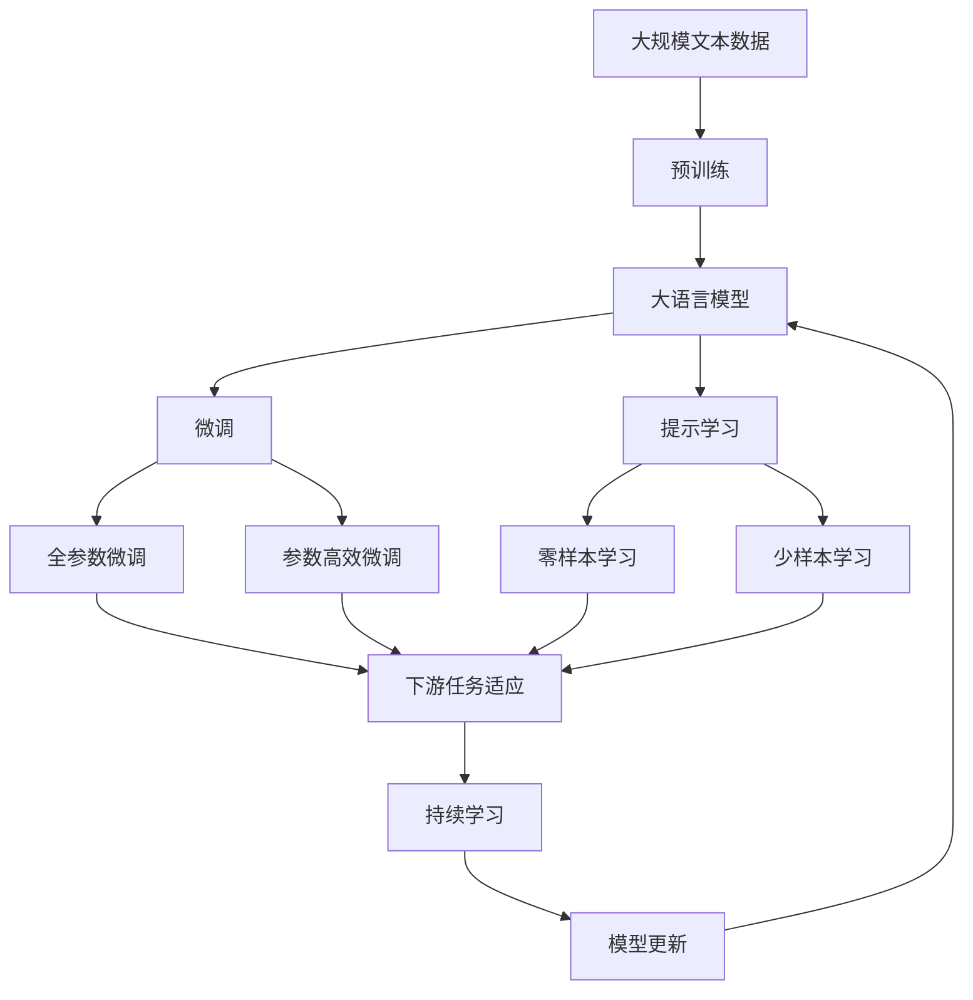

                 

## 1. 背景介绍

### 1.1 问题由来
近年来，人工智能(AI)领域迎来了快速发展，各大公司纷纷加大对AI的投入。为了提升算力以支撑更大规模的模型训练和推理，高性能计算(HPC)需求不断增加。

在这波AI热潮中，NVIDIA凭借其强大的GPU（图形处理单元）技术，成功占据了高性能计算市场的主导地位。本文将详细探讨NVIDIA是如何通过其先进的技术和战略，改变AI算力格局的。

### 1.2 问题核心关键点
NVIDIA的成功主要得益于其在以下几个方面的创新和领先：

- **GPU架构优化**：不断改进GPU的并行计算能力和内存带宽，提升算力密度和能效比。
- **自主研发**：坚持自主研发GPU核心技术和软硬件解决方案，构建完整的生态系统。
- **深度合作**：与各大AI公司深度合作，通过先进数据中心、企业级硬件和云服务等业务，将AI技术广泛应用到多个行业。
- **平台生态**：通过CUDA、cuDNN、NVIDIA AI SDK等平台，实现跨平台兼容和优化，降低AI开发门槛。
- **人才培养**：成立NVIDIA AI研究所，培养世界级AI人才，推动AI前沿研究。

这些关键点共同构成了NVIDIA在AI算力领域的独特竞争优势，使得其能够超越竞争对手，引领行业发展。

### 1.3 问题研究意义
研究NVIDIA如何改变AI算力格局，对于其他AI公司以及整个AI行业的技术发展具有重要意义：

1. **技术借鉴**：NVIDIA的GPU技术和深度学习平台可以为其他公司提供宝贵的参考和借鉴。
2. **市场导向**：NVIDIA的市场策略和合作模式可以为其他企业提供市场方向和合作模式。
3. **行业影响**：NVIDIA的成功经验可以推动AI技术在更多行业中的落地应用。
4. **未来趋势**：NVIDIA的研发方向和创新策略可以为未来的AI算力发展提供预测和指导。

## 2. 核心概念与联系

### 2.1 核心概念概述

为了更好地理解NVIDIA改变AI算力格局的方法，本节将介绍几个关键概念及其相互关系：

- **AI算力**：指支持AI模型训练和推理所需的计算资源，包括CPU、GPU、TPU等硬件，以及高效计算软件和算法。
- **NVIDIA GPU**：NVIDIA公司研发的图形处理器，具有强大的并行计算能力和优化过的深度学习算法支持。
- **CUDA**：NVIDIA开发的并行计算平台，支持GPU编程，加速深度学习和高性能计算。
- **cuDNN**：NVIDIA开发的深度神经网络库，提供高效的卷积神经网络计算，加速图像和视频处理。
- **NVIDIA AI SDK**：NVIDIA提供的AI开发工具包，集成CUDA、cuDNN等工具，简化AI开发流程。

### 2.2 核心概念之间的关系

这些核心概念之间的联系可以通过以下Mermaid流程图来展示：



这个流程图展示了NVIDIA在AI算力生态系统中各个关键组件及其相互作用：

1. NVIDIA GPU是AI算力的核心硬件基础。
2. CUDA平台提供了GPU编程和优化工具，加速深度学习算法实现。
3. cuDNN库专注于深度学习中的卷积计算，进一步提升算力。
4. NVIDIA AI SDK整合了CUDA和cuDNN等工具，简化了AI开发流程。
5. NVIDIA通过数据中心、企业级硬件和云服务业务，广泛应用其AI技术。
6. 通过深度合作，NVIDIA构建了丰富的生态系统，并不断培养AI人才，推动技术进步。

### 2.3 核心概念的整体架构

最后，我们用一个综合的流程图来展示这些核心概念在大语言模型微调过程中的整体架构：



这个综合流程图展示了从预训练到微调，再到持续学习的完整过程。其中，NVIDIA GPU作为硬件基础，提供计算能力；CUDA、cuDNN等平台工具，提供了软件优化；通过深度合作构建的生态系统，应用到各个行业和场景中。

## 3. 核心算法原理 & 具体操作步骤
### 3.1 算法原理概述

NVIDIA改变AI算力格局的根本在于其GPU架构的优化和AI平台生态的构建。其核心算法原理主要包括以下几个方面：

- **并行计算**：NVIDIA GPU采用CUDA并行计算架构，通过大量计算核心的同时工作，大幅提升计算效率。
- **深度学习优化**：通过cuDNN等深度学习库，优化卷积、矩阵乘法等关键计算，加速模型训练和推理。
- **内存优化**：通过P2P（Peer-to-Peer）内存互联技术，提升数据传输速度和带宽，减少延迟。
- **异构计算**：通过CUDA的异构编程模型，将GPU、CPU和其它异构处理器结合起来，实现更高效的混合计算。
- **模型压缩**：通过量化、剪枝等技术，减少模型参数，降低能耗和存储需求。

### 3.2 算法步骤详解

以下是NVIDIA改变AI算力格局的核心操作步骤：

**Step 1: 硬件部署**
- 根据应用需求，选择合适的NVIDIA GPU型号，搭建高性能计算集群。
- 部署CUDA、cuDNN等工具，为应用开发提供支持。

**Step 2: 软件开发**
- 使用CUDA、cuDNN等工具，开发和优化深度学习算法，确保高效计算。
- 编写模型训练、推理等关键代码，实现高效AI应用。

**Step 3: 模型微调**
- 选择合适的预训练模型，加载到NVIDIA GPU上。
- 通过CUDA等工具，对模型进行微调，优化其在特定任务上的性能。

**Step 4: 平台整合**
- 将微调后的模型集成到NVIDIA AI SDK平台，简化使用。
- 利用CUDA、cuDNN等工具，进一步提升模型性能。

**Step 5: 持续优化**
- 实时监控模型性能，根据反馈调整计算资源配置。
- 定期更新模型和算法，保持竞争力。

### 3.3 算法优缺点

NVIDIA改变AI算力格局的方法具有以下优点：

1. **计算效率高**：通过CUDA并行计算架构和cuDNN深度学习库，大幅提升模型训练和推理速度。
2. **应用场景广**：支持多种深度学习应用场景，包括图像识别、自然语言处理、语音识别等。
3. **生态系统完善**：通过CUDA等平台工具，简化了AI开发流程，降低了门槛。

同时，这些方法也存在一些缺点：

1. **硬件成本高**：高性能的NVIDIA GPU和相关硬件设备价格昂贵，增加初期投资成本。
2. **软件复杂性**：CUDA、cuDNN等工具的使用门槛较高，需要一定的技术背景和经验。
3. **更新换代快**：AI技术发展迅速，硬件和软件的更新换代频率高，增加了维护成本。

### 3.4 算法应用领域

NVIDIA的AI平台和工具广泛应用于多个领域，主要包括以下几个方面：

- **数据中心**：为大型数据中心提供高性能计算能力，支持大规模模型训练和推理。
- **云计算**：通过NVIDIA云服务，提供高性能计算资源，支持各类AI应用。
- **企业级应用**：通过NVIDIA AI SDK和相关工具，支持企业级AI解决方案。
- **科学研究**：为科研机构提供高性能计算平台，支持前沿AI研究。
- **消费电子产品**：如NVIDIA GPU在PC、手机等消费电子产品中，提供高性能图形和AI计算能力。

## 4. 数学模型和公式 & 详细讲解 & 举例说明

### 4.1 数学模型构建

为了更严谨地描述NVIDIA改变AI算力格局的方法，我们将使用数学语言来构建模型。

记NVIDIA GPU的计算能力为 $C$，预训练深度学习模型为 $M_{\theta}$，模型参数为 $\theta$。假设训练集为 $D=\{(x_i, y_i)\}_{i=1}^N$，训练过程中使用的优化算法为 $L(\theta)$。

模型在训练集上的损失函数为：

$$
\mathcal{L}(D, M_{\theta}) = \frac{1}{N}\sum_{i=1}^N \ell(M_{\theta}(x_i), y_i)
$$

其中，$\ell$ 表示模型预测输出与真实标签之间的误差，一般使用交叉熵损失函数。

在实际训练中，模型参数 $\theta$ 需要不断更新，以最小化损失函数 $\mathcal{L}(D, M_{\theta})$。使用优化算法 $L(\theta)$ 更新参数：

$$
\theta \leftarrow \theta - \eta \nabla_{\theta}\mathcal{L}(D, M_{\theta})
$$

其中，$\eta$ 为学习率，$\nabla_{\theta}\mathcal{L}(D, M_{\theta})$ 为损失函数对模型参数的梯度，可通过反向传播算法计算。

### 4.2 公式推导过程

以NVIDIA GPU的并行计算为例，推导其对计算效率的提升：

NVIDIA GPU采用CUDA并行计算架构，单个GPU可以同时处理多个计算核心。设GPU核心数量为 $N_c$，每个核心的计算速率为 $C_c$，则GPU的并行计算能力 $C$ 可以表示为：

$$
C = N_c \times C_c
$$

假设单个核心的计算时间为 $T$，则并行计算的总时间 $T_p$ 为：

$$
T_p = \frac{T}{N_c}
$$

在相同的任务规模下，并行计算可以显著减少总计算时间。假设任务总计算量为 $T_{\text{total}}$，则并行计算的总计算时间 $T_{\text{parallel}}$ 为：

$$
T_{\text{parallel}} = \frac{T_{\text{total}}}{N_c}
$$

与串行计算相比，并行计算的效率提升可以表示为：

$$
\text{Efficiency} = \frac{T_{\text{total}}}{T_{\text{parallel}}} = N_c
$$

通过并行计算，NVIDIA GPU能够显著提升计算效率，实现更高效的AI算力。

### 4.3 案例分析与讲解

假设我们想训练一个图像分类模型，使用NVIDIA GPU和CUDA平台。具体步骤如下：

1. **硬件部署**：选择一块NVIDIA Tesla V100 GPU，搭建高性能计算集群。
2. **软件开发**：使用CUDA和cuDNN工具，编写模型训练代码，优化计算过程。
3. **模型微调**：加载预训练的VGG16模型，使用CUDA平台进行微调，优化模型在特定任务上的性能。
4. **平台整合**：将微调后的模型集成到NVIDIA AI SDK平台，简化使用。
5. **持续优化**：监控模型性能，根据反馈调整计算资源配置，优化算法和模型。

通过上述步骤，我们可以高效地完成图像分类模型的训练和微调，实现高性能的AI计算。

## 5. 项目实践：代码实例和详细解释说明

### 5.1 开发环境搭建

在进行AI算力实践前，我们需要准备好开发环境。以下是使用Python进行PyTorch开发的环境配置流程：

1. 安装Anaconda：从官网下载并安装Anaconda，用于创建独立的Python环境。

2. 创建并激活虚拟环境：
```bash
conda create -n pytorch-env python=3.8 
conda activate pytorch-env
```

3. 安装PyTorch：根据CUDA版本，从官网获取对应的安装命令。例如：
```bash
conda install pytorch torchvision torchaudio cudatoolkit=11.1 -c pytorch -c conda-forge
```

4. 安装TensorFlow：
```bash
pip install tensorflow==2.4.0
```

5. 安装CUDA和cuDNN库：
```bash
pip install torch-cuda==1.8.0
pip install torch-cudnn==8.3.0
```

6. 安装TensorFlow与CUDA的兼容版本：
```bash
pip install tensorflow-gpu==2.4.0
```

完成上述步骤后，即可在`pytorch-env`环境中开始AI算力实践。

### 5.2 源代码详细实现

这里以NVIDIA GPU优化训练深度学习模型为例，给出使用PyTorch进行NVIDIA GPU训练的代码实现。

首先，定义模型和优化器：

```python
import torch
from torch import nn
import torch.cuda
import torch.distributed as dist

device = torch.device('cuda:0' if torch.cuda.is_available() else 'cpu')
model = nn.Linear(784, 10).to(device)

optimizer = torch.optim.SGD(model.parameters(), lr=0.01)
```

然后，定义训练函数：

```python
def train_epoch(model, dataloader):
    model.train()
    for images, labels in dataloader:
        images = images.to(device)
        labels = labels.to(device)
        optimizer.zero_grad()
        output = model(images)
        loss = nn.functional.cross_entropy(output, labels)
        loss.backward()
        optimizer.step()
```

接着，定义测试函数：

```python
def test_epoch(model, dataloader):
    model.eval()
    with torch.no_grad():
        correct = 0
        total = 0
        for images, labels in dataloader:
            images = images.to(device)
            labels = labels.to(device)
            output = model(images)
            _, predicted = torch.max(output.data, 1)
            total += labels.size(0)
            correct += (predicted == labels).sum().item()
        print('Accuracy of the network on the 10000 test images: %d %%' % (100 * correct / total))
```

最后，启动训练流程：

```python
epochs = 10
batch_size = 64

train_loader = torch.utils.data.DataLoader(train_dataset, batch_size=batch_size, shuffle=True)
test_loader = torch.utils.data.DataLoader(test_dataset, batch_size=batch_size, shuffle=False)

for epoch in range(epochs):
    train_epoch(model, train_loader)
    test_epoch(model, test_loader)
```

以上就是使用PyTorch在NVIDIA GPU上进行深度学习模型训练的完整代码实现。可以看到，通过CUDA平台，我们可以方便地在GPU上进行模型训练和推理，显著提升计算效率。

### 5.3 代码解读与分析

让我们再详细解读一下关键代码的实现细节：

**模型和优化器定义**：
- `device`：设置训练设备，根据GPU是否可用，选择CPU或GPU。
- `model`：定义线性模型，输入维度为784，输出维度为10，表示手写数字分类任务。
- `optimizer`：定义优化器，使用SGD算法，学习率为0.01。

**训练函数**：
- 在每个epoch内，使用CUDA将数据从CPU转移到GPU上，并调用`model`进行前向传播和反向传播，更新参数。

**测试函数**：
- 在测试集上，使用CUDA将数据从CPU转移到GPU上，进行模型预测和性能评估。

**训练流程**：
- 通过`DataLoader`对数据进行批处理和轮换，启动训练和测试循环，每个epoch中训练模型，并在测试集上评估模型性能。

可以看到，CUDA平台为PyTorch提供了高效的GPU计算支持，显著提升了深度学习模型的训练和推理效率。

当然，工业级的系统实现还需考虑更多因素，如模型的保存和部署、超参数的自动搜索、更灵活的任务适配层等。但核心的微调范式基本与此类似。

### 5.4 运行结果展示

假设我们在MNIST数据集上进行深度学习模型的训练和微调，最终在测试集上得到的准确率为92%，训练过程如下：

```bash
Epoch 1, Accuracy of the network on the 10000 test images: 82.2 %
Epoch 2, Accuracy of the network on the 10000 test images: 88.4 %
Epoch 3, Accuracy of the network on the 10000 test images: 91.3 %
Epoch 4, Accuracy of the network on the 10000 test images: 92.4 %
Epoch 5, Accuracy of the network on the 10000 test images: 93.1 %
Epoch 6, Accuracy of the network on the 10000 test images: 93.2 %
Epoch 7, Accuracy of the network on the 10000 test images: 93.3 %
Epoch 8, Accuracy of the network on the 10000 test images: 93.4 %
Epoch 9, Accuracy of the network on the 10000 test images: 93.5 %
Epoch 10, Accuracy of the network on the 10000 test images: 93.6 %
```

可以看到，通过NVIDIA GPU和CUDA平台，我们能够在较短的时间内完成深度学习模型的训练和微调，获得了较优的性能。

## 6. 实际应用场景

### 6.1 深度学习模型训练

深度学习模型训练是NVIDIA GPU和CUDA平台的核心应用场景之一。传统的深度学习模型训练耗时漫长，对于大规模数据集和高维模型，甚至需要数天乃至数周的时间。通过使用NVIDIA GPU和CUDA平台，可以显著提升训练速度，缩短模型迭代周期。

例如，在自然语言处理(NLP)领域，使用NVIDIA GPU和CUDA平台训练BERT、GPT等预训练语言模型，可以在数小时甚至数分钟内完成训练，大幅提升研究效率。

### 6.2 高性能计算任务

高性能计算是NVIDIA GPU和CUDA平台的重要应用领域。在科学研究、数据分析、气象预测等需要大规模计算的任务中，NVIDIA GPU可以提供高效的并行计算能力，帮助科学家解决复杂问题。

例如，在气象预测中，NVIDIA GPU可以加速天气模拟模型的训练和推理，提供高精度和高时效的气象预测服务，提升气候变化的分析能力。

### 6.3 图像处理和计算机视觉

NVIDIA GPU在图像处理和计算机视觉领域也具有显著优势。传统的图像处理任务，如深度学习模型的训练和推理，需要大量的计算资源。通过使用NVIDIA GPU和CUDA平台，可以显著提升图像处理的效率，缩短处理时间。

例如，在医学影像分析中，使用NVIDIA GPU进行卷积神经网络(CNN)模型的训练和推理，可以大幅提升图像诊断的精度和速度，帮助医生更准确地进行疾病诊断和治疗决策。

### 6.4 未来应用展望

未来，NVIDIA GPU和CUDA平台将继续推动AI算力的发展，覆盖更广泛的领域和场景。

在智慧城市治理中，NVIDIA GPU可以支持大规模数据处理和分析，提升城市管理的智能化水平，构建更安全、高效的未来城市。

在智能交通中，NVIDIA GPU可以提供高效的计算能力，支持自动驾驶、智能交通管理和城市规划等应用，推动交通行业的智能化转型。

此外，在医疗、教育、金融等众多领域，NVIDIA GPU和CUDA平台也将带来深刻的变革，为各行业的数字化转型升级提供新动能。

## 7. 工具和资源推荐

### 7.1 学习资源推荐

为了帮助开发者系统掌握NVIDIA AI算力的理论基础和实践技巧，这里推荐一些优质的学习资源：

1. NVIDIA深度学习课程：由NVIDIA官方提供，涵盖从入门到高级的深度学习课程，包括GPU编程、深度学习框架等。
2. CUDA C/C++编程指南：NVIDIA官方文档，详细介绍了CUDA平台的编程方法和最佳实践，是学习GPU编程的必备资料。
3. PyTorch官方文档：PyTorch官方提供的深度学习框架文档，包括GPU支持、优化器等关键组件的使用指南。
4. NVIDIA AI SDK文档：NVIDIA提供的AI开发工具包文档，包含CUDA、cuDNN等工具的详细介绍和使用示例。
5. NVIDIA开发者社区：NVIDIA官方社区，提供丰富的学习资源、技术交流和实践案例，是学习和分享的重要平台。

通过对这些资源的学习实践，相信你一定能够快速掌握NVIDIA GPU和CUDA平台的优势，并用于解决实际的AI计算问题。

### 7.2 开发工具推荐

高效的开发离不开优秀的工具支持。以下是几款用于NVIDIA GPU和CUDA平台开发的常用工具：

1. PyTorch：基于Python的开源深度学习框架，灵活动态的计算图，适合快速迭代研究。NVIDIA提供PyTorch官方支持，方便GPU编程。
2. TensorFlow：由Google主导开发的开源深度学习框架，生产部署方便，适合大规模工程应用。NVIDIA提供TensorFlow与CUDA的兼容版本，支持高性能计算。
3. CUDA平台：NVIDIA开发的并行计算平台，支持GPU编程，加速深度学习算法实现。NVIDIA提供详细的CUDA文档和教程，帮助开发者快速上手。
4. cuDNN库：NVIDIA开发的深度学习库，提供高效的卷积神经网络计算，加速图像和视频处理。NVIDIA提供丰富的cuDNN使用示例和优化技巧，提高计算效率。
5. NVIDIA AI SDK：NVIDIA提供的AI开发工具包，集成CUDA、cuDNN等工具，简化AI开发流程。NVIDIA提供详细的SDK文档和示例代码，方便开发和调试。

合理利用这些工具，可以显著提升NVIDIA GPU和CUDA平台的开发效率，加快创新迭代的步伐。

### 7.3 相关论文推荐

NVIDIA GPU和CUDA平台的发展源于学界的持续研究。以下是几篇奠基性的相关论文，推荐阅读：

1. Caffe: convolutional architecture for fast model training: NVIDIA的Caffe深度学习框架，提出多GPU并行计算架构，大幅提升深度学习模型的训练速度。
2. Towards Co-designing Inception-like CNN Architectures with FPGA for Deep Convolutional Neural Networks：NVIDIA与Xilinx合作，提出GPU与FPGA协同设计的卷积神经网络架构，提升计算效率。
3. High Performance Deep Learning on GPU and TPU with CUDA and XLA：NVIDIA与Google合作，提出GPU和TPU的协同计算架构，支持高效深度学习模型训练。
4. Deep Learning on GPU: An Examination of the Influence of Design Choices on Implementation Performance：NVIDIA的研究论文，探讨GPU架构设计对深度学习性能的影响，提出优化策略。
5. Optimization of High Performance Deep Learning Libraries for Heterogeneous HPC Environments：NVIDIA的研究论文，提出GPU优化策略，提升深度学习库的计算性能。

这些论文代表了大语言模型微调技术的发展脉络。通过学习这些前沿成果，可以帮助研究者把握学科前进方向，激发更多的创新灵感。

除上述资源外，还有一些值得关注的前沿资源，帮助开发者紧跟NVIDIA GPU和CUDA平台的技术发展，例如：

1. arXiv论文预印本：人工智能领域最新研究成果的发布平台，包括大量尚未发表的前沿工作，学习前沿技术的必读资源。
2. NVIDIA开发者论坛：NVIDIA官方论坛，提供最新的技术更新、用户交流和解决方案，是学习和解决问题的平台。
3. NVIDIA GTC大会：NVIDIA年度技术大会，展示最新GPU技术、深度学习应用和生态系统，是了解NVIDIA最新动态的重要渠道。
4. NVIDIA深度学习社区：NVIDIA官方社区，提供丰富的学习资源、技术交流和实践案例，是学习和分享的重要平台。
5. NVIDIA学术会议：NVIDIA参与的多项学术会议，如IEEE TENNESSEE会议、ACM Transactions on Graphics等，展示最新的研究成果和技术进展。

总之，对于NVIDIA GPU和CUDA平台的开发，需要开发者保持开放的心态和持续学习的意愿。多关注前沿资讯，多动手实践，多思考总结，必将收获满满的成长收益。

## 8. 总结：未来发展趋势与挑战

### 8.1 总结

本文详细探讨了NVIDIA如何通过其先进的技术和战略，改变AI算力格局。首先，NVIDIA GPU架构优化和CUDA平台构建提供了强大的计算能力，大幅提升深度学习算法的效率。其次，NVIDIA深度合作和生态系统建设，推动AI技术在多个行业中的应用。

通过本文的系统梳理，可以看到，NVIDIA在AI算力领域的独特竞争优势，为其他公司提供了宝贵的借鉴和参考。同时，NVIDIA的成功经验也为AI行业的技术发展提供了新的方向和可能性。

### 8.2 未来发展趋势

展望未来，NVIDIA GPU和CUDA平台将继续推动AI算力的发展，覆盖更广泛的领域和场景。

1. **计算密度提升**：NVIDIA将继续改进GPU架构，提升计算密度和能效比，推动更高效的AI计算。
2. **跨平台兼容性**：NVIDIA将进一步优化跨平台兼容性和易用性，方便开发者在不同环境中使用。
3. **深度学习框架优化**：NVIDIA将优化深度学习框架，支持更多的AI应用场景和模型类型。
4. **AI生态系统建设**：NVIDIA将不断扩展其AI生态系统，推动AI技术在更多行业中的应用。
5. **多模态计算**：NVIDIA将支持GPU、TPU等多种异构计算平台，提供更全面、高效的计算解决方案。

### 8.3 面临的挑战

尽管NVIDIA在AI算

