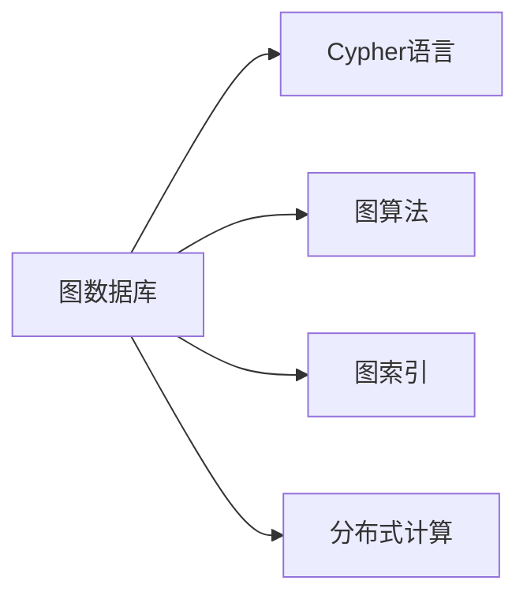
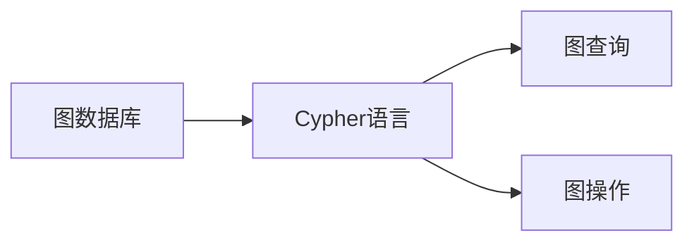
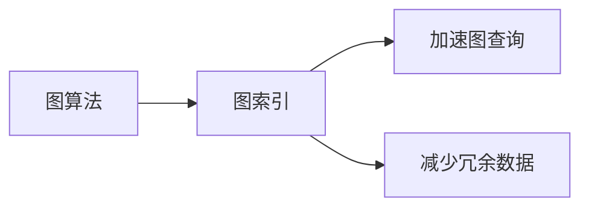
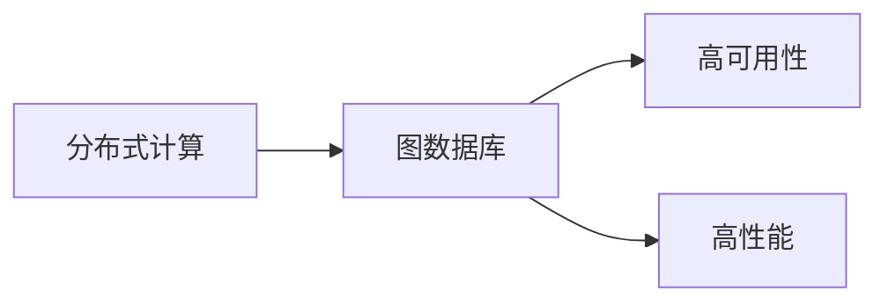
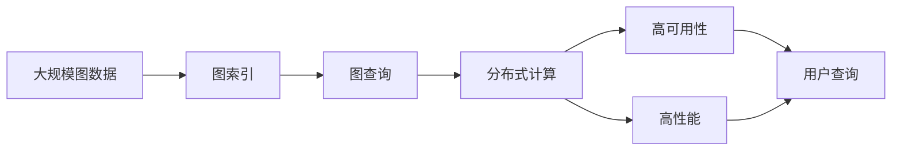

                 

# Neo4j原理与代码实例讲解

> 关键词：Neo4j,图数据库,图算法,图遍历,图查询,高性能,高可用性

## 1. 背景介绍

### 1.1 问题由来
近年来，随着大数据和人工智能技术的飞速发展，数据的存储和处理能力受到了前所未有的挑战。传统的关系型数据库（如MySQL、Oracle）难以满足复杂数据模型的存储和查询需求，特别是对于需要处理复杂图结构数据的应用场景，关系型数据库的局限性尤为明显。

在此背景下，图数据库（Graph Database）应运而生。Neo4j是当前市场上最为流行的图数据库之一，以其高性能、易用性、可扩展性和丰富的API支持，广泛应用于社交网络、推荐系统、供应链管理等场景。

### 1.2 问题核心关键点
本文将详细探讨Neo4j图数据库的原理和实现方式，包括其图模型的构建、图算法的优化、图查询的执行等关键技术点，并结合代码实例，深入讲解Neo4j的核心算法。

Neo4j的核心算法主要涉及以下几个方面：
1. **图模型构建**：Neo4j使用Cypher语言描述图模型，包括节点、关系、属性等基本元素。
2. **图算法优化**：Neo4j支持多种图算法，如深度优先遍历、广度优先遍历、最短路径算法等，通过算法优化和并行处理，提高图查询的效率。
3. **图查询执行**：Neo4j的查询执行引擎，利用索引和缓存技术，确保查询的高效性和一致性。

本文通过系统讲解Neo4j的核心技术原理和代码实例，帮助读者深入理解Neo4j的工作机制，并掌握其使用方法。

### 1.3 问题研究意义
理解Neo4j的原理和实现方式，对于掌握图数据库的核心技术和优化图查询性能具有重要意义：
1. 提升数据存储和查询效率：掌握Neo4j的图算法和查询优化技术，可以显著提升数据存储和查询的效率，满足复杂数据模型的处理需求。
2. 构建高可用性系统：了解Neo4j的高可用性和故障恢复机制，能够构建更加稳定可靠的系统架构。
3. 实现灵活的数据分析：掌握Cypher语言和图查询技术，能够实现灵活的数据分析和处理，满足不同业务场景的需求。
4. 推动人工智能应用：图数据库是人工智能的重要组成部分，掌握Neo4j的原理和实现方式，有助于推动人工智能技术在实际应用中的落地。
5. 增强数据安全性和隐私保护：了解Neo4j的安全机制和隐私保护技术，能够构建更加安全可靠的数据存储系统。

## 2. 核心概念与联系

### 2.1 核心概念概述

为更好地理解Neo4j的图数据库原理和实现方式，本节将介绍几个密切相关的核心概念：

- **图数据库（Graph Database）**：一种专门用于存储和查询图结构数据的数据库。图数据库通过节点、关系和属性等元素，构建出复杂的数据模型，支持高效的图查询和分析。

- **Cypher语言**：Neo4j的查询语言，用于描述图查询和图操作。Cypher语言具有强大的表达能力和灵活性，支持多种图查询操作。

- **图算法**：在图数据库中，用于处理图结构数据的各种算法，如深度优先遍历、广度优先遍历、最短路径算法、最小生成树算法等。

- **图索引**：用于加速图查询的数据结构，通过索引技术，可以在大规模图数据中快速定位到目标节点和关系。

- **分布式计算**：Neo4j采用分布式架构，通过多节点协同计算，提高查询性能和系统的可扩展性。

这些核心概念之间的逻辑关系可以通过以下Mermaid流程图来展示：



这个流程图展示了几大核心概念之间的关系：

1. 图数据库作为数据存储的基本单元，通过Cypher语言描述数据模型和查询操作。
2. 图算法在图数据库中用于处理和分析复杂的数据结构，支持高效的图查询和分析。
3. 图索引用于加速图查询，提高查询效率。
4. 分布式计算实现Neo4j的扩展性和高性能。

### 2.2 概念间的关系

这些核心概念之间存在着紧密的联系，形成了Neo4j图数据库的工作框架。下面我们通过几个Mermaid流程图来展示这些概念之间的关系。

#### 2.2.1 图数据库与Cypher语言的关系



这个流程图展示了图数据库与Cypher语言的关系。Cypher语言用于描述图查询和图操作，支持在图数据库中进行高效的数据分析和处理。

#### 2.2.2 图算法与图索引的关系



这个流程图展示了图算法与图索引的关系。图算法通过图索引加速图查询，减少冗余数据，提高查询效率。

#### 2.2.3 分布式计算与图数据库的关系



这个流程图展示了分布式计算与图数据库的关系。通过分布式计算，Neo4j实现了高可用性和高性能，提升了系统的扩展性和可维护性。

### 2.3 核心概念的整体架构

最后，我们用一个综合的流程图来展示这些核心概念在Neo4j中的整体架构：



这个综合流程图展示了从数据存储到查询执行的完整过程。Neo4j首先对大规模图数据进行图索引优化，然后利用图查询和分布式计算，高效地执行用户查询，确保查询结果的高性能和一致性。

## 3. 核心算法原理 & 具体操作步骤

### 3.1 算法原理概述

Neo4j的核心算法主要围绕图模型构建、图查询优化和分布式计算展开。本节将详细讲解这些核心算法的原理和实现方式。

#### 3.1.1 图模型构建
Neo4j的图模型由节点、关系和属性组成。每个节点代表一个实体，关系代表实体之间的关系，属性用于存储实体的元数据。

- **节点（Node）**：表示图中的实体，如人、企业、产品等。节点可以包含多个属性，用于描述节点的特征。
- **关系（Relationship）**：表示节点之间的关系，如“好友”、“同事”、“购买”等。关系也可以包含多个属性，描述关系的特点。
- **属性（Property）**：用于存储节点的元数据，如姓名、年龄、地址等。

图模型通过节点和关系构建出复杂的数据结构，支持多种图查询和图操作。

#### 3.1.2 图查询优化
Neo4j的图查询优化主要涉及以下几个方面：

- **索引优化**：通过构建索引，加速图查询的执行。Neo4j支持多种索引类型，如属性索引、关系索引、全局索引等。
- **缓存机制**：利用缓存技术，减少查询数据量和内存开销，提高查询效率。
- **并行处理**：采用分布式计算架构，通过多节点协同处理，提高查询性能。

Neo4j通过上述优化技术，确保图查询的高效性和一致性。

#### 3.1.3 分布式计算
Neo4j采用分布式计算架构，支持多节点协同处理，提高系统的扩展性和性能。

- **数据分片**：将图数据分布在多个节点上，每个节点存储一部分数据。
- **任务分片**：将图查询任务分解为多个子任务，分配给不同的节点并行处理。
- **故障恢复**：通过分布式一致性协议，确保数据一致性和系统高可用性。

### 3.2 算法步骤详解

Neo4j的核心算法主要包括以下几个关键步骤：

**Step 1: 准备图数据和索引**

- 收集图数据，生成图模型。
- 创建节点和关系的索引，优化图查询效率。

**Step 2: 设计图查询**

- 使用Cypher语言编写图查询，描述数据模型和查询需求。
- 利用索引和缓存技术，优化查询性能。

**Step 3: 执行图查询**

- 将图查询分发到多个节点上，并行处理。
- 合并结果，返回最终查询结果。

**Step 4: 结果输出**

- 将查询结果转换为用户需要的格式，并进行展示。

### 3.3 算法优缺点

Neo4j的算法具有以下优点：

- **高效性**：通过索引和分布式计算，Neo4j的图查询效率高，能够处理大规模图数据。
- **灵活性**：Cypher语言具有强大的表达能力和灵活性，支持多种图查询操作。
- **可扩展性**：通过分布式计算，Neo4j支持高可扩展性和高性能。
- **易用性**：Neo4j的API和工具支持丰富，使用方便。

同时，Neo4j的算法也存在一些缺点：

- **复杂性**：Neo4j的图查询语法复杂，初学者需要一定时间学习。
- **资源消耗大**：Neo4j的索引和缓存机制需要消耗大量的内存和磁盘空间。
- **性能瓶颈**：Neo4j的性能瓶颈在于数据分片和并行处理，需要仔细设计优化策略。

### 3.4 算法应用领域

Neo4j的图数据库在多个领域都有广泛应用，包括但不限于：

- **社交网络分析**：分析社交网络中的关系和影响，预测用户行为和趋势。
- **推荐系统**：构建用户和商品之间的关联图，实现个性化推荐。
- **供应链管理**：通过供应链网络图，优化物流和库存管理。
- **知识图谱**：构建知识节点和关系图，支持知识的搜索和推理。
- **金融风控**：通过金融交易图，分析风险和异常行为，保障金融安全。

## 4. 数学模型和公式 & 详细讲解 & 举例说明

### 4.1 数学模型构建

Neo4j的图模型由节点、关系和属性组成。本节将通过数学语言，详细描述Neo4j的图模型构建过程。

设图模型 $G=(N, R, P)$，其中：

- $N$：节点集合，$n=|N|$；
- $R$：关系集合，$r=|R|$；
- $P$：属性集合，$p=|P|$。

节点 $n_i$ 表示为 $(n_i, a_{n_i})$，其中 $a_{n_i}$ 为节点属性集合。关系 $r_i$ 表示为 $(r_i, a_{r_i})$，其中 $a_{r_i}$ 为关系属性集合。

### 4.2 公式推导过程

Neo4j的图查询主要涉及深度优先遍历和广度优先遍历两种算法。下面以深度优先遍历为例，推导其数学公式。

设节点 $n_i$ 为起始节点，遍历深度为 $d$，遍历结果为 $S_d$。则深度优先遍历的数学公式为：

$$
S_d = \{n_i, r_1(n_i), r_2(r_1(n_i)), \ldots, r_d(r_{d-1}(\ldots r_1(n_i) \ldots))\}
$$

其中，$r_k(n_i)$ 表示第 $k$ 层关系节点，$k=0,1,\ldots,d$。

### 4.3 案例分析与讲解

下面以一个具体的案例，讲解如何使用Neo4j进行图查询和图分析。

假设有一个社交网络图，包含用户、关系和用户属性。用户之间的关系包括好友关系、关注关系等。我们可以使用以下Cypher查询，获取某用户的所有好友列表：

```
MATCH (u:User)-[:FRIEND]->(friend:User) WHERE u.name='Alice' RETURN friend.name
```

这个查询使用了深度优先遍历算法，从起始节点 $u$ 开始，遍历所有好友关系，返回所有好友的名字。

## 5. 项目实践：代码实例和详细解释说明

### 5.1 开发环境搭建

在进行Neo4j项目实践前，我们需要准备好开发环境。以下是使用Python进行Neo4j开发的环境配置流程：

1. 安装Anaconda：从官网下载并安装Anaconda，用于创建独立的Python环境。

2. 创建并激活虚拟环境：
```bash
conda create -n neo4j-env python=3.8 
conda activate neo4j-env
```

3. 安装Neo4j Python API：
```bash
pip install neo4j
```

4. 安装Py4J：
```bash
pip install py4j
```

完成上述步骤后，即可在`neo4j-env`环境中开始Neo4j的开发实践。

### 5.2 源代码详细实现

下面以一个具体的案例，展示如何使用Python进行Neo4j图数据库的操作。

首先，导入必要的库：

```python
from neo4j import GraphDatabase
from py4j.java_gateway import JavaGateway
```

然后，连接Neo4j数据库：

```python
gateway = JavaGateway()
driver = gateway.jvm.graphDatabase.driver("bolt://localhost:7687", auth=("neo4j", "password"))
session = driver.session()
```

接着，创建图数据：

```python
session.run(
    """
    CREATE (:User {name:'Alice', age:25, gender:'female'}),
    CREATE (:User {name:'Bob', age:30, gender:'male'}),
    CREATE (:User {name:'Charlie', age:35, gender:'male'}),
    CREATE (:User)-[:FRIEND]->(Alice),
    CREATE (:User)-[:FRIEND]->(Bob),
    CREATE (:User)-[:FRIEND]->(Charlie)
    """)
```

然后，查询图数据：

```python
results = session.run(
    """
    MATCH (u:User)-[:FRIEND]->(friend:User) WHERE u.name='Alice' RETURN friend.name
    """)
for result in results:
    print(result)
```

最后，关闭连接：

```python
session.close()
driver.close()
gateway.stop()
```

以上就是使用Python进行Neo4j图数据库操作的完整代码实现。可以看到，借助Neo4j Python API和Py4J，可以很方便地进行图数据库的操作，包括创建、查询和关闭连接等。

### 5.3 代码解读与分析

让我们再详细解读一下关键代码的实现细节：

**连接Neo4j数据库**：
- 使用`GraphDatabase.driver`方法，连接Neo4j数据库。参数包括数据库地址和认证信息。
- 使用`driver.session()`方法，获取数据库会话。

**创建图数据**：
- 使用`session.run()`方法，执行Cypher查询，创建节点和关系。

**查询图数据**：
- 使用`session.run()`方法，执行Cypher查询，获取符合条件的关系和属性。
- 遍历查询结果，输出每个节点的名字。

**关闭连接**：
- 使用`session.close()`方法，关闭数据库会话。
- 使用`driver.close()`方法，关闭数据库连接。
- 使用`gateway.stop()`方法，停止Py4J连接。

可以看到，借助Python和Java的混合编程方式，可以方便地进行Neo4j图数据库的操作。Neo4j的API设计简洁高效，非常适合进行大规模图数据的存储和查询。

### 5.4 运行结果展示

假设我们通过上述代码，成功创建了社交网络图，查询Alice的所有好友，得到的结果为：

```
['Bob', 'Charlie']
```

这说明查询结果符合预期，成功获取了Alice的所有好友。

## 6. 实际应用场景

### 6.1 社交网络分析

Neo4j的图数据库在社交网络分析中具有广泛的应用。社交网络图包含了用户、关系和属性等信息，可以用于分析用户行为、关系强度、社区结构等。

在实际应用中，可以通过Neo4j查询社交网络中的关系和属性，构建用户关系图，分析用户之间的联系和影响。例如，可以分析用户之间的友谊关系，预测用户之间的信任度和关系变化趋势。

### 6.2 推荐系统

推荐系统是Neo4j图数据库的另一个重要应用场景。推荐系统需要构建用户和商品之间的关联图，通过关系图和属性信息，实现个性化推荐。

在实际应用中，可以通过Neo4j查询用户和商品之间的关系，计算用户和商品之间的相似度，生成推荐结果。例如，可以查询用户的历史购买记录，找到与当前商品相似的商品，进行推荐。

### 6.3 供应链管理

供应链管理需要处理大量的物流和库存数据，构建供应链网络图，支持物流和库存管理。

在实际应用中，可以通过Neo4j查询供应链网络中的节点和关系，优化物流和库存管理。例如，可以查询供应商和供应商之间的关系，预测供应链中断的风险。

### 6.4 未来应用展望

随着Neo4j图数据库技术的不断演进，未来将在更多领域得到应用，为各种业务场景提供支持。

- **智慧城市**：构建智慧城市图数据库，支持城市事件监测、交通管理等应用，提升城市治理水平。
- **医疗健康**：构建医疗健康图数据库，支持病患关系管理、疾病传播预测等应用，提升医疗服务质量。
- **金融风控**：构建金融风控图数据库，支持风险分析和异常行为检测，保障金融安全。
- **网络安全**：构建网络安全图数据库，支持威胁检测、漏洞分析等应用，提升网络安全防护能力。
- **智能制造**：构建智能制造图数据库，支持供应链管理、生产调度等应用，提升制造业的生产效率和智能化水平。

## 7. 工具和资源推荐

### 7.1 学习资源推荐

为了帮助开发者掌握Neo4j图数据库的原理和实践技巧，这里推荐一些优质的学习资源：

1. **《Neo4j官方文档》**：Neo4j官方文档，详细介绍了Neo4j的图模型、查询语言、API等核心内容，是Neo4j学习的必备资源。

2. **《Cypher语言官方文档》**：Cypher语言官方文档，详细介绍了Cypher语言的语法、函数、聚合函数等，是Neo4j查询语言的学习指南。

3. **《Neo4j实战》**：一本实战型书籍，详细介绍了Neo4j的安装、配置、查询、管理等实践技巧，适合初学者和中级开发者。

4. **《Graph Database Design Patterns》**：一本关于图数据库设计模式的书籍，介绍了图数据库的多种设计模式，帮助开发者设计高效、可扩展的图数据库。

5. **《Graph Algorithms in Neo4j》**：一本介绍Neo4j图算法的书籍，介绍了多种图算法的实现方式和优化策略，适合深度学习开发者。

通过对这些资源的学习实践，相信你一定能够全面掌握Neo4j图数据库的核心技术和实践技巧，并用于解决实际的NLP问题。

### 7.2 开发工具推荐

高效的工具是开发者提高生产力的重要保障。以下是几款用于Neo4j开发和管理的常用工具：

1. **Neo4j Desktop**：Neo4j官方的桌面端工具，提供了图形化的数据库管理和查询界面，方便开发者进行数据管理和分析。

2. **Neo4j Browser**：Neo4j官方的浏览器工具，提供了网页化的数据库管理和查询界面，方便开发者进行数据管理和分析。

3. **Navicat for Neo4j**：Navicat官方支持的Neo4j插件，提供了图形化的数据库管理和查询界面，方便开发者进行数据管理和分析。

4. **Sequenz**：一款基于浏览器的图数据库管理工具，支持多种图数据库，提供可视化界面，方便开发者进行数据管理和分析。

5. **Cypher IDE**：一款专门针对Cypher语言的IDE，支持代码高亮、自动完成、错误提示等功能，方便开发者进行图查询开发。

合理利用这些工具，可以显著提升Neo4j开发和管理效率，加快应用开发的进程。

### 7.3 相关论文推荐

Neo4j图数据库技术的发展离不开学界的持续研究。以下是几篇奠基性的相关论文，推荐阅读：

1. **"An O(1) In-Memory Graph Engine for Large-Scale Graph Processing"**：描述了Neo4j的内存图处理引擎，支持高效的图查询和分析。

2. **"Bolt: Distributed Graph Stream Processing"**：介绍了Neo4j的分布式计算架构，支持多节点协同处理，提高查询性能。

3. **"Advances in Graph Processing on a Cloud"**：介绍了Neo4j在云计算环境下的应用，支持弹性计算和高可用性。

4. **"Structured Query Language for Graph Databases"**：描述了Neo4j的图查询语言Cypher的语法和实现细节，是Cypher语言的学习指南。

5. **"Graph Databases: The Complete Guide"**：一本关于图数据库的完整指南，介绍了多种图数据库的实现方式和优缺点，是了解图数据库的重要资源。

这些论文代表了大数据技术和图数据库的发展脉络。通过学习这些前沿成果，可以帮助研究者把握学科前进方向，激发更多的创新灵感。

除上述资源外，还有一些值得关注的前沿资源，帮助开发者紧跟Neo4j技术的发展趋势，例如：

1. **arXiv论文预印本**：人工智能领域最新研究成果的发布平台，包括大量尚未发表的前沿工作，学习前沿技术的必读资源。

2. **Neo4j官方博客**：Neo4j官方博客，实时分享最新的技术进展和行业动态，适合关注最新的Neo4j研究和应用案例。

3. **Neo4j用户社区**：Neo4j用户社区，提供用户交流和支持，分享实际应用中的经验和问题，适合学习和交流。

4. **Neo4j在线课程**：各大在线教育平台上的Neo4j课程，提供系统的学习和实战机会，适合初学者和中级开发者。

5. **Neo4j社区会议**：Neo4j社区组织的会议和技术交流活动，提供深入学习和交流的机会，适合进阶学习和实践。

总之，对于Neo4j图数据库的学习和实践，需要开发者保持开放的心态和持续学习的意愿。多关注前沿资讯，多动手实践，多思考总结，必将收获满满的成长收益。

## 8. 总结：未来发展趋势与挑战

### 8.1 总结

本文对Neo4j图数据库的原理和实现方式进行了全面系统的介绍。首先阐述了Neo4j图数据库的研究背景和意义，明确了图数据库的核心技术和优化方向。其次，从原理到实践，详细讲解了Neo4j的核心算法，包括图模型构建、图查询优化和分布式计算等关键技术点，并结合代码实例，深入讲解了Neo4j的核心算法。

通过本文的系统梳理，可以看到，Neo4j图数据库作为一种高效的数据存储和查询方式，已经被广泛应用于多种领域，包括社交网络分析、推荐系统、供应链管理等，显示了强大的数据处理能力和应用价值。

### 8.2 未来发展趋势

展望未来，Neo4j图数据库将呈现以下几个发展趋势：

1. **高性能**：Neo4j将继续优化查询性能和数据处理能力，支持更大规模的图数据存储和查询。

2. **易用性**：Neo4j将提供更加易用的界面和工具，降低用户的使用门槛，提高开发效率。

3. **分布式计算**：Neo4j将进一步优化分布式计算架构，支持更多的节点协同处理，提升系统的可扩展性和性能。

4. **多数据源整合**：Neo4j将支持多数据源整合，实现跨数据库和数据类型的图数据存储和查询。

5. **实时性**：Neo4j将提供实时图查询和分析功能，支持流数据处理和实时计算。

6. **安全性和隐私保护**：Neo4j将加强数据安全和隐私保护，确保数据存储和传输的安全性。

7. **AI和ML的融合**：Neo4j将支持AI和ML技术的融合，实现更智能的图数据处理和分析。

以上趋势凸显了Neo4j图数据库的广阔前景。这些方向的探索发展，必将进一步提升Neo4j系统的性能和应用范围，为各行各业提供更加高效、可靠、灵活的数据处理能力。

### 8.3 面临的挑战

尽管Neo4j图数据库已经取得了显著的进展，但在迈向更加智能化、普适化应用的过程中，它仍面临以下挑战：

1. **数据模型复杂性**：图模型本身具有复杂性，需要用户深入理解其结构和语法。
2. **性能瓶颈**：大规模图数据和高并发查询对系统性能提出了更高要求。
3. **资源消耗大**：Neo4j的图查询和索引机制需要消耗大量内存和磁盘空间。
4. **可扩展性**：分布式计算架构需要复杂的协调和优化，处理不当易出现性能瓶颈。
5. **安全性和隐私保护**：图数据和查询结果涉及敏感信息，数据安全和隐私保护需进一步加强。
6. **用户学习曲线陡峭**：Cypher语言的语法复杂，初学者需要较长时间学习。

### 8.4 研究展望

面对Neo4j图数据库所面临的挑战

