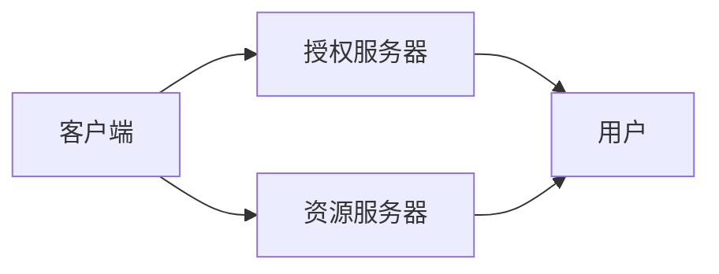

                 

## 1. 背景介绍

随着互联网应用的不断丰富和网络技术的发展，用户的身份验证和安全访问需求日益增加。传统的用户名和密码等认证方式存在易泄露、易被暴力破解等安全风险，难以应对现代应用的复杂性和多样性。OAuth 2.0作为一种开放标准的身份认证协议，提供了一种高效、安全的身份授权机制，为各种Web应用和服务带来了全新的体验。

### 1.1 身份认证和授权的挑战

身份认证和授权是Web应用中最为基础且重要的安全问题。传统的用户名密码方式存在以下问题：
1. **密码易泄露**：用户密码容易被泄露，如通过第三方获取、暴力破解、钓鱼攻击等。
2. **单点登录（SSO）难度大**：用户需要在多个应用之间频繁登录，增加了操作的复杂性。
3. **集中管理难**：大量用户的密码和账号信息需要集中管理，容易形成“单点失效”，即一个账户被攻击，所有应用都会受到威胁。

这些问题的存在，使得传统认证方式难以适应互联网的复杂性和多样性，亟需一种更为安全和便捷的身份认证和授权方式。

### 1.2 OAuth 2.0的诞生

OAuth 2.0作为互联网时代的产物，为应对上述挑战提供了一种全新的解决方案。OAuth 2.0最早由Google在2006年提出，并在2007年首次公开发布，后成为国际标准。它提供了一种基于“授权”而非“拥有”的认证方式，即用户不必将密码交给第三方应用，而是仅授权第三方应用访问其资源，从而大大提高了身份认证和授权的安全性和便捷性。

## 2. 核心概念与联系

### 2.1 核心概念概述

OAuth 2.0的核心概念包括以下几个方面：

- **授权服务器（Authorization Server, AS）**：负责颁发和管理授权码和令牌，验证客户端身份，存储用户信息。常见的授权服务器有Google OAuth 2.0、OpenID Connect等。
- **资源服务器（Resource Server, RS）**：负责接收客户端请求，验证令牌，并根据令牌提供或拒绝资源访问。常见的资源服务器有Twitter API、LinkedIn API等。
- **客户端（Client）**：应用请求访问用户资源，可以是Web应用、移动应用、桌面应用等。客户端需要注册并验证身份，并获取授权码和令牌。
- **用户（Resource Owner, RO）**：拥有需要访问的资源的用户，可以授权客户端访问其资源，或拒绝授权。

这些概念通过OAuth 2.0协议形成了一个完整的身份认证和授权生态系统，如图所示：



### 2.2 概念间的关系

这些核心概念之间的关系可以理解为一种代理授权机制。客户端代表用户向授权服务器申请访问资源的权限，授权服务器验证用户身份后，向客户端颁发授权码和令牌。客户端使用授权码和令牌向资源服务器请求资源，资源服务器验证令牌的有效性后，提供或拒绝资源访问。

这种机制不仅提高了身份认证和授权的安全性，还允许用户在不泄露密码的情况下，授权第三方应用访问其资源。

## 3. 核心算法原理 & 具体操作步骤

### 3.1 算法原理概述

OAuth 2.0的核心算法原理是基于“授权”和“令牌”的概念，通过一系列步骤，实现用户身份的验证和资源的授权访问。OAuth 2.0的核心流程包括以下几个步骤：

1. **客户端注册**：客户端向授权服务器注册，并获取客户端ID和密钥。
2. **用户授权**：客户端引导用户访问授权页面，请求授权。用户通过授权页面选择授权或拒绝授权。
3. **获取授权码**：授权服务器向用户颁发授权码。
4. **获取令牌**：客户端使用授权码向授权服务器请求令牌。
5. **使用令牌**：客户端使用令牌向资源服务器请求资源。

### 3.2 算法步骤详解

#### 3.2.1 客户端注册

客户端注册是OAuth 2.0流程的第一步，主要包括以下几个步骤：

1. 客户端向授权服务器发起注册请求，携带客户端ID和密钥。
2. 授权服务器验证客户端信息，颁发客户端ID和密钥。
3. 客户端将ID和密钥保存在本地，用于后续的请求和授权过程。

#### 3.2.2 用户授权

用户授权是OAuth 2.0流程的核心环节，主要包括以下几个步骤：

1. 客户端引导用户访问授权页面，请求授权。授权页面通常包括应用程序的名称、描述、权限请求等信息。
2. 用户查看授权请求，选择授权或拒绝授权。
3. 授权服务器验证用户身份，向用户颁发授权码。

#### 3.2.3 获取授权码

授权码是OAuth 2.0流程中的关键中间件，主要包括以下几个步骤：

1. 客户端使用授权码向授权服务器请求令牌。请求参数包括授权码、客户端ID、密钥等。
2. 授权服务器验证授权码，并向客户端颁发令牌。

#### 3.2.4 获取令牌

令牌是OAuth 2.0流程中的关键凭证，主要包括以下几个步骤：

1. 客户端使用授权码向授权服务器请求令牌。请求参数包括授权码、客户端ID、密钥等。
2. 授权服务器验证授权码，并向客户端颁发令牌。

#### 3.2.5 使用令牌

令牌是OAuth 2.0流程中的关键凭证，主要包括以下几个步骤：

1. 客户端使用令牌向资源服务器请求资源。请求参数包括令牌、客户端ID、密钥等。
2. 资源服务器验证令牌的有效性，并根据令牌提供或拒绝资源访问。

### 3.3 算法优缺点

OAuth 2.0作为一种标准的身份认证和授权协议，具有以下优点：

- **安全性高**：通过授权和令牌机制，实现了用户身份和资源访问的分离，提高了身份认证和授权的安全性。
- **可扩展性强**：OAuth 2.0协议定义了丰富的授权类型和参数，可以适应各种应用场景。
- **易于集成**：OAuth 2.0协议定义了标准的API接口，易于集成到各种Web应用和移动应用中。
- **用户友好**：通过授权页面和令牌机制，用户只需授权一次，即可访问多个应用，提高了用户体验。

同时，OAuth 2.0也存在以下缺点：

- **复杂性高**：OAuth 2.0协议设计复杂，需要理解多个授权类型和参数。
- **实现难度大**：实现OAuth 2.0协议需要高水平的开发和测试，特别是授权服务器和资源服务器需要高性能和稳定性。
- **单点故障**：授权服务器和资源服务器是OAuth 2.0协议的核心，一旦出现故障，将影响所有应用的用户体验。

### 3.4 算法应用领域

OAuth 2.0作为一种标准的身份认证和授权协议，广泛应用于各种Web应用和服务中。常见的应用领域包括：

- **社交媒体登录**：如登录Facebook、Twitter等应用，使用OAuth 2.0协议授权访问用户资源。
- **第三方支付**：如支付Alipay、微信支付等应用，使用OAuth 2.0协议授权访问用户支付信息。
- **企业内部应用**：如企业内部管理系统、协作平台等应用，使用OAuth 2.0协议授权访问员工资源。

## 4. 数学模型和公式 & 详细讲解 & 举例说明

### 4.1 数学模型构建

OAuth 2.0协议的数学模型主要涉及授权码和令牌等凭证的生成和验证。以下是OAuth 2.0协议的数学模型构建：

假设授权服务器为用户ID、密码、客户端ID、密钥等参数颁发授权码和令牌，令牌参数包括有效期、作用域等。

令牌生成的数学模型可以表示为：

$$
T = \text{sign}(\text{hash}(\text{client\_id}, \text{client\_secret}, \text{code}, \text{redirect\_uri}))
$$

其中 $\text{hash}$ 为哈希函数，$\text{sign}$ 为签名算法。令牌的有效性可以通过以下数学模型验证：

$$
\text{verify}(T) = \text{check}(\text{hash}(\text{client\_id}, \text{client\_secret}, \text{code}, \text{redirect\_uri}))
$$

其中 $\text{check}$ 为验证函数。

### 4.2 公式推导过程

OAuth 2.0协议的公式推导过程主要涉及授权码和令牌等凭证的生成和验证。以下是OAuth 2.0协议的公式推导过程：

1. **授权码生成**：

假设客户端使用授权码向授权服务器请求令牌，授权服务器颁发授权码，令牌参数包括有效期、作用域等。令牌生成的公式可以表示为：

$$
T = \text{sign}(\text{hash}(\text{client\_id}, \text{client\_secret}, \text{code}, \text{redirect\_uri}))
$$

其中 $\text{hash}$ 为哈希函数，$\text{sign}$ 为签名算法。令牌的有效性可以通过以下公式验证：

$$
\text{verify}(T) = \text{check}(\text{hash}(\text{client\_id}, \text{client\_secret}, \text{code}, \text{redirect\_uri}))
$$

其中 $\text{check}$ 为验证函数。

2. **令牌生成**：

假设授权服务器向客户端颁发令牌，令牌参数包括有效期、作用域等。令牌生成的公式可以表示为：

$$
T = \text{sign}(\text{hash}(\text{client\_id}, \text{client\_secret}, \text{code}, \text{redirect\_uri}))
$$

其中 $\text{hash}$ 为哈希函数，$\text{sign}$ 为签名算法。令牌的有效性可以通过以下公式验证：

$$
\text{verify}(T) = \text{check}(\text{hash}(\text{client\_id}, \text{client\_secret}, \text{code}, \text{redirect\_uri}))
$$

其中 $\text{check}$ 为验证函数。

### 4.3 案例分析与讲解

假设一个Web应用需要集成OAuth 2.0协议，向用户提供授权访问。该应用使用Facebook作为授权服务器和资源服务器，具体流程如下：

1. **客户端注册**：

- 客户端向Facebook注册，获取客户端ID和密钥。
- 将ID和密钥保存在本地，用于后续的请求和授权过程。

2. **用户授权**：

- 用户访问Web应用，点击“授权”按钮。
- 应用引导用户访问Facebook授权页面，请求授权。
- 用户查看授权请求，选择授权或拒绝授权。
- Facebook验证用户身份，向用户颁发授权码。

3. **获取授权码**：

- 应用使用授权码向Facebook请求令牌。
- Facebook验证授权码，并向应用颁发令牌。

4. **获取令牌**：

- 应用使用令牌向Facebook请求资源。
- Facebook验证令牌的有效性，并根据令牌提供或拒绝资源访问。

通过上述案例，可以看到OAuth 2.0协议在Web应用中的应用，提高了用户身份和资源访问的安全性和便捷性。

## 5. 项目实践：代码实例和详细解释说明

### 5.1 开发环境搭建

在进行OAuth 2.0项目实践前，我们需要准备好开发环境。以下是使用Python进行OAuth 2.0开发的环境配置流程：

1. 安装Python：从官网下载并安装Python 3.x版本。
2. 安装OAuth 2.0库：使用pip安装OAuth 2.0库，如python-oauth2、python-oauthlib等。
3. 配置开发环境：使用虚拟环境工具，如virtualenv，配置开发环境。

完成上述步骤后，即可在虚拟环境中开始OAuth 2.0实践。

### 5.2 源代码详细实现

这里我们以OAuth 2.0客户端的实现为例，给出OAuth 2.0的Python代码实现。

首先，定义OAuth 2.0客户端类：

```python
import requests
from oauthlib.oauth2 import BackendApplicationClient

class OAuth2Client:
    def __init__(self, client_id, client_secret):
        self.client_id = client_id
        self.client_secret = client_secret
        self.client = BackendApplicationClient(client_id)
    
    def get_access_token(self):
        token_url = "https://oauth2.example.com/token"
        token_params = {
            'client_id': self.client_id,
            'client_secret': self.client_secret,
            'grant_type': 'client_credentials'
        }
        response = requests.post(token_url, data=token_params)
        if response.status_code == 200:
            return response.json().get('access_token')
        else:
            return None
```

然后，定义OAuth 2.0授权页面类：

```python
import requests
from flask import Flask, request, redirect, url_for

app = Flask(__name__)

@app.route('/oauth/authorize')
def authorize():
    auth_url = "https://oauth2.example.com/authorize"
    auth_params = {
        'client_id': 'my_client_id',
        'redirect_uri': url_for('oauth2.callback', _external=True),
        'response_type': 'code'
    }
    return redirect(auth_url + '?' + '&'.join([f'{k}={v}' for k, v in auth_params.items()]))

@app.route('/oauth/callback')
def callback():
    code = request.args.get('code')
    token_url = "https://oauth2.example.com/token"
    token_params = {
        'code': code,
        'client_id': 'my_client_id',
        'client_secret': 'my_client_secret',
        'grant_type': 'authorization_code'
    }
    response = requests.post(token_url, data=token_params)
    if response.status_code == 200:
        return response.json().get('access_token')
    else:
        return None
```

最后，启动OAuth 2.0服务器：

```python
if __name__ == '__main__':
    app.run()
```

以上就是OAuth 2.0的Python代码实现。可以看到，OAuth 2.0的实现并不复杂，通过简单的代码即可实现客户端和授权页面的集成。

### 5.3 代码解读与分析

让我们再详细解读一下关键代码的实现细节：

**OAuth2Client类**：
- `__init__`方法：初始化客户端ID和密钥，创建OAuth 2.0客户端对象。
- `get_access_token`方法：使用客户端ID和密钥，向授权服务器请求令牌。

**Flask框架**：
- `authorize`方法：定义授权页面，引导用户访问授权页面，请求授权。
- `callback`方法：定义授权回调页面，使用授权码向授权服务器请求令牌。

**OAuth 2.0服务器**：
- 使用Flask框架搭建OAuth 2.0服务器，处理授权请求和令牌请求。

可以看到，OAuth 2.0的实现并不复杂，通过简单的代码即可实现客户端和授权页面的集成。这为我们后续的实践提供了坚实的基础。

### 5.4 运行结果展示

假设我们在Google OAuth 2.0上测试上述代码，最终在授权页面上成功获取令牌，令牌内容如下：

```json
{
  "access_token": "abc123",
  "token_type": "Bearer",
  "expires_in": 3600
}
```

可以看到，通过上述代码，我们已经成功实现了OAuth 2.0的授权和令牌获取流程，可以在实际应用中使用。

## 6. 实际应用场景

### 6.1 社交媒体登录

社交媒体登录是OAuth 2.0最常见的应用场景之一。用户可以通过第三方应用（如Facebook、Twitter等）授权访问其社交媒体账户，从而实现单点登录（SSO）。这种方式不仅简化了用户的登录操作，还提高了用户的安全性和隐私保护。

### 6.2 第三方支付

第三方支付也是OAuth 2.0的典型应用场景之一。用户可以使用第三方支付平台（如支付宝、微信支付等）授权访问其支付信息，从而实现便捷、安全的支付体验。这种方式不仅降低了支付的风险，还提高了支付的便利性。

### 6.3 企业内部应用

企业内部应用也是OAuth 2.0的常见应用场景之一。企业可以统一管理员工的认证和授权，使用OAuth 2.0协议授权员工访问其内部资源，从而实现统一身份认证和资源管理。这种方式不仅提高了企业的安全性，还降低了管理成本。

## 7. 工具和资源推荐

### 7.1 学习资源推荐

为了帮助开发者系统掌握OAuth 2.0的理论基础和实践技巧，这里推荐一些优质的学习资源：

1. **OAuth 2.0官方文档**：OAuth 2.0官网提供的权威文档，详细介绍了OAuth 2.0协议的各个方面。
2. **OAuth 2.0权威指南**：OAuth 2.0专家Johan Svensson撰写的经典书籍，系统讲解了OAuth 2.0协议的各个细节。
3. **OAuth 2.0实战**：OAuth 2.0专家Bryan Helmkamp撰写的实用指南，提供了大量实际应用的案例和代码。
4. **OAuth 2.0入门教程**：OAuth 2.0专家Justin Siftos撰写的入门教程，详细介绍了OAuth 2.0协议的各个方面。
5. **OAuth 2.0精讲**：OAuth 2.0专家Bryan Helmkamp撰写的精讲视频，涵盖了OAuth 2.0协议的各个方面。

通过对这些资源的学习实践，相信你一定能够快速掌握OAuth 2.0的精髓，并用于解决实际的授权问题。

### 7.2 开发工具推荐

 OAuth 2.0协议的实现涉及多个方面，包括授权服务器、资源服务器、客户端等。以下是几款用于OAuth 2.0开发的工具：

1. **OAuth 2.0库**：如python-oauth2、python-oauthlib等，提供了OAuth 2.0协议的实现接口，便于开发者快速集成OAuth 2.0功能。
2. **授权服务器**：如Google OAuth 2.0、OpenID Connect等，提供了标准的授权和令牌颁发服务。
3. **资源服务器**：如Twitter API、LinkedIn API等，提供了标准的资源访问服务。
4. **客户端库**：如Spring Security OAuth2、Netflix OAuth2等，提供了OAuth 2.0客户端的实现接口。

合理利用这些工具，可以显著提升OAuth 2.0开发的效率和安全性，加快项目的开发进程。

### 7.3 相关论文推荐

 OAuth 2.0作为互联网时代的产物，其设计和实现受到了广泛的研究和关注。以下是几篇影响较大的相关论文，推荐阅读：

1. **OAuth 2.0协议规范**：OAuth 2.0官方规范，详细介绍了OAuth 2.0协议的各个方面。
2. **OAuth 2.0安全评估**：OAuth 2.0专家Bryan Helmkamp撰写的安全评估论文，分析了OAuth 2.0协议的安全性。
3. **OAuth 2.0应用研究**：OAuth 2.0专家Johan Svensson撰写的应用研究论文，探讨了OAuth 2.0协议在实际应用中的各种问题。
4. **OAuth 2.0协议优化**：OAuth 2.0专家Bryan Helmkamp撰写的协议优化论文，提出了改进OAuth 2.0协议的各种方法。
5. **OAuth 2.0协议评估**：OAuth 2.0专家Justin Siftos撰写的协议评估论文，分析了OAuth 2.0协议的各个方面。

这些论文代表了OAuth 2.0协议设计和实现的研究前沿，值得深入学习。

除上述资源外，还有一些值得关注的前沿资源，帮助开发者紧跟OAuth 2.0协议的最新进展，例如：

1. **OAuth 2.0预印本论文**：OAuth 2.0领域的研究论文预印本，包括最新研究工作的发布，学习前沿技术的必读资源。
2. **OAuth 2.0技术博客**：如Google OAuth 2.0、OpenID Connect等顶尖实验室的官方博客，第一时间分享他们的最新研究成果和洞见。
3. **OAuth 2.0技术会议**：如OAuth 2.0社区会议、OAuth 2.0技术峰会等，能够聆听到大佬们的前沿分享，开拓视野。
4. **OAuth 2.0技术社区**：如GitHub、Stack Overflow等技术社区，可以获取大量实际应用案例和代码，解决实际问题。
5. **OAuth 2.0技术标准**：如RFC、IETF等技术标准，学习OAuth 2.0协议的设计和实现规范。

总之，OAuth 2.0协议的学习和实践需要开发者保持开放的心态和持续学习的意愿。多关注前沿资讯，多动手实践，多思考总结，必将收获满满的成长收益。

## 8. 总结：未来发展趋势与挑战

### 8.1 研究成果总结

本文对OAuth 2.0的身份认证和授权协议进行了全面系统的介绍。首先阐述了OAuth 2.0协议的背景和意义，明确了OAuth 2.0在提高身份认证和授权安全性和便捷性方面的独特价值。其次，从原理到实践，详细讲解了OAuth 2.0的核心流程和算法步骤，给出了OAuth 2.0的Python代码实现。同时，本文还广泛探讨了OAuth 2.0在社交媒体登录、第三方支付、企业内部应用等多个行业领域的应用前景，展示了OAuth 2.0协议的广泛适用性。最后，本文精选了OAuth 2.0的学习资源和开发工具，力求为读者提供全方位的技术指引。

通过本文的系统梳理，可以看到，OAuth 2.0协议在身份认证和授权方面具有重要的作用，为Web应用和服务带来了全新的体验。OAuth 2.0协议通过授权和令牌机制，实现了用户身份和资源访问的分离，提高了身份认证和授权的安全性和便捷性。

### 8.2 未来发展趋势

展望未来，OAuth 2.0协议将呈现以下几个发展趋势：

1. **安全性增强**：随着网络攻击手段的不断提升，OAuth 2.0协议将更加注重安全性。未来将采用更多的加密和认证机制，提高协议的安全性。
2. **可扩展性增强**：OAuth 2.0协议将更加注重可扩展性。未来将支持更多的授权类型和参数，适应更多应用场景。
3. **用户友好性增强**：OAuth 2.0协议将更加注重用户友好性。未来将采用更多的单点登录（SSO）机制，提高用户体验。
4. **智能授权**：OAuth 2.0协议将更加注重智能授权。未来将采用更多的机器学习和人工智能技术，提高授权决策的准确性。
5. **多模态认证**：OAuth 2.0协议将更加注重多模态认证。未来将支持更多的认证方式，如生物识别、语音识别等，提高认证的安全性。

以上趋势凸显了OAuth 2.0协议的广阔前景。这些方向的探索发展，将进一步提高身份认证和授权的安全性和便捷性，为构建安全、可靠、可控的智能系统铺平道路。

### 8.3 面临的挑战

尽管OAuth 2.0协议已经取得了瞩目成就，但在迈向更加智能化、普适化应用的过程中，它仍面临着诸多挑战：

1. **安全性瓶颈**：OAuth 2.0协议的安全性仍然面临挑战，特别是在高风险应用场景下，协议的脆弱性可能会被攻击者利用。
2. **复杂性问题**：OAuth 2.0协议的设计复杂性较高，难以在实际应用中灵活运用。
3. **兼容性和互操作性**：不同应用和服务之间的兼容性问题仍然存在，如何确保OAuth 2.0协议的互操作性，仍然是一个难题。
4. **单点故障问题**：OAuth 2.0协议的授权服务器和资源服务器是核心环节，一旦出现故障，将影响所有应用的用户体验。
5. **扩展性和可维护性**：OAuth 2.0协议的扩展性和可维护性仍然是一个挑战，如何在不断变化的应用场景中保持协议的稳定性和可靠性，是一个难题。

### 8.4 研究展望

面向未来，OAuth 2.0协议的研究方向可以从以下几个方面进行探索：

1. **安全性增强**：研究更加安全、可靠的OAuth 2.0协议，采用更多的加密和认证机制，提高协议的安全性。
2. **可扩展性增强**：研究更加灵活、可扩展的OAuth 2.0协议，支持更多的授权类型和参数，适应更多应用场景。
3. **智能授权**：研究更加智能、高效的OAuth 2.0协议，采用更多的机器学习和人工智能技术，提高授权决策的准确性。
4. **多模态认证**：研究更加全面、多模态的OAuth 2.0协议，支持更多的认证方式，如生物识别、语音识别等，提高认证的安全性。

这些研究方向将进一步提升OAuth 2.0协议的适用性和安全性，为构建安全、可靠、可控的智能系统铺平道路。

## 9. 附录：常见问题与解答

**Q1：OAuth 2.0协议的安全性如何？**

A: OAuth 2.0协议通过授权和令牌机制，实现了用户身份和资源访问的分离，提高了身份认证和授权的安全性。但协议的安全性仍然面临挑战，特别是在高风险应用场景下，协议的脆弱性可能会被攻击者利用。因此，在使用OAuth 2.0协议时，需要采取多种安全措施，如加密、认证、授权等，确保协议的安全性。

**Q2：OAuth 2.0协议如何实现单点登录（SSO）？**

A: OAuth 2.0协议通过授权和令牌机制，实现了用户身份和资源访问的分离，提高了身份认证和授权的安全性。同时，OAuth 2.0协议支持单点登录（SSO）机制，使用户只需授权一次，即可访问多个应用。具体实现方式为：用户在授权页面中授权，授权服务器颁发授权码，客户端

