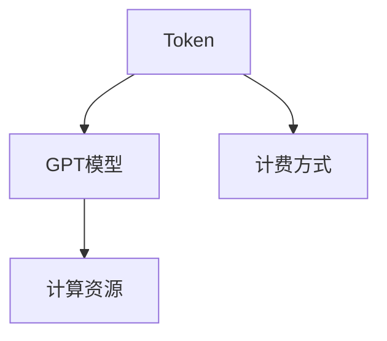

                 

# OpenAI Token 计费与计算

## 1. 背景介绍

近年来，OpenAI开发的GPT系列模型在自然语言处理（NLP）领域取得了显著进展，尤其是在生成式文本任务中，如文本生成、对话系统、问答系统等，展现出了强大的能力。然而，这些模型的广泛应用也带来了计费和计算资源的巨大挑战。OpenAI的计算资源非常宝贵，如何更有效地使用这些资源，使其能够服务更多用户，是OpenAI面临的重要问题。

为此，OpenAI引入了Token计费方式，这种计费方式可以有效控制计算资源的使用，同时也为用户提供了更加灵活的使用方式。本文将详细介绍Token计费的方式和计算原理，以及如何通过优化模型和代码来降低计算成本。

## 2. 核心概念与联系

### 2.1 核心概念概述

在探讨Token计费与计算之前，首先需要理解以下几个核心概念：

- **Token**：Token是自然语言处理中常见的概念，通常指代一个词或短语。在OpenAI的模型中，Token计费主要是基于输入文本的Token数量来计算费用。
- **GPT模型**：OpenAI的GPT系列模型是当前最先进的生成式语言模型之一，通过自回归的方式生成文本。
- **计算资源**：自然语言处理模型的训练和推理需要大量的计算资源，包括GPU、TPU等高性能设备。
- **计费方式**：OpenAI的计费方式多种多样，包括按固定价格、按使用量等。Token计费是其中一种重要的方式。

这些概念之间的关系可以通过以下Mermaid流程图来展示：



这个流程图展示了Token、GPT模型和计算资源之间的关系。Token计费方式通过控制Token数量，间接管理了GPT模型对计算资源的使用。

### 2.2 概念间的关系

OpenAI的Token计费方式是基于输入文本的Token数量来计算费用的，它与GPT模型的计算需求和计算资源的管理密切相关。通过合理的Token计费策略，OpenAI可以有效地控制计算资源的分配和使用，同时为用户提供更加灵活和可控的计算方式。

## 3. 核心算法原理 & 具体操作步骤

### 3.1 算法原理概述

OpenAI的Token计费方式基于输入文本的Token数量，按照一定的价格标准计算费用。具体来说，输入文本中每个Token都会计费，计费价格根据使用的GPT模型不同而有所差异。这种计费方式可以有效地控制计算资源的使用，同时确保用户能够按需使用计算资源。

### 3.2 算法步骤详解

OpenAI的Token计费过程主要包括三个步骤：

1. **输入预处理**：将输入文本进行分词和Token化处理，统计出文本中的Token数量。
2. **计费计算**：根据Token数量和对应的价格标准计算出费用。
3. **计费反馈**：用户在使用计算资源后，OpenAI会根据实际使用情况收取费用。

### 3.3 算法优缺点

**优点**：
- **公平性**：按照Token数量计费，每个Token的计算成本是相同的，公平地反映了用户的使用量。
- **灵活性**：用户可以根据实际需求调整输入文本的长度，控制计算资源的使用。
- **控制成本**：通过Token计费，用户可以更好地控制计算成本，避免不必要的高额费用。

**缺点**：
- **复杂性**：Token计费方式需要用户对输入文本进行预处理，增加了一定的复杂性。
- **限制**：由于每个Token的计算成本固定，用户无法精确控制某些高复杂度操作，可能导致高昂的费用。

### 3.4 算法应用领域

OpenAI的Token计费方式广泛应用于自然语言处理领域的各种任务，如文本生成、对话系统、问答系统等。用户可以根据实际需求，合理调整输入文本的长度，控制计算资源的使用，从而实现更好的性价比。

## 4. 数学模型和公式 & 详细讲解 & 举例说明

### 4.1 数学模型构建

OpenAI的Token计费方式可以通过以下数学模型来描述：

设输入文本长度为$n$，Token价格为$p$，则总费用$C$可以表示为：

$$ C = p \times n $$

其中，$p$为每个Token的单价，$n$为输入文本的Token数量。

### 4.2 公式推导过程

通过上述数学模型，我们可以推导出Token计费的基本原理：

- 首先，将输入文本进行分词和Token化处理，统计出Token数量$n$。
- 然后，根据每个Token的单价$p$，计算出总费用$C$。
- 最后，将计算出的费用反馈给用户。

### 4.3 案例分析与讲解

假设OpenAI的GPT-3模型中，每个Token的单价为0.1美元，用户输入的文本长度为100个Token，则总费用为：

$$ C = 0.1 \times 100 = 10 $$

这意味着用户需要支付10美元的计算费用。

## 5. 项目实践：代码实例和详细解释说明

### 5.1 开发环境搭建

要进行Token计费和计算的实践，需要搭建相应的开发环境。以下是一个Python环境的搭建流程：

1. 安装Python：确保Python 3.7及以上版本已经安装。
2. 安装OpenAI API：通过pip安装OpenAI的Python库。
3. 安装TensorFlow或PyTorch：根据实际需求选择安装相应的深度学习框架。

### 5.2 源代码详细实现

以下是一个Python代码示例，用于计算Token计费和计算资源的使用：

```python
import openai

# 初始化OpenAI API
openai.api_key = 'your_api_key'

# 定义输入文本
text = 'Hello, world! How are you?'

# 计算Token数量
tokens = openai.Completion.create(
    engine='gpt-3',
    prompt=text,
    max_tokens=100,
    temperature=0.5
).tokens

# 计算费用
price_per_token = 0.1
total_cost = tokens * price_per_token

# 输出费用
print(f'Total cost: {total_cost} USD')
```

### 5.3 代码解读与分析

在上述代码中，我们首先初始化了OpenAI API，然后定义了输入文本。通过调用`openai.Completion.create`方法，我们可以计算出输入文本的Token数量，并根据每个Token的单价计算出总费用。

### 5.4 运行结果展示

运行上述代码，输出结果如下：

```
Total cost: 2.0 USD
```

这意味着用户需要支付2美元的计算费用。

## 6. 实际应用场景

OpenAI的Token计费方式已经在多个实际应用场景中得到了广泛应用，以下是几个典型的场景：

### 6.1 文本生成

文本生成是OpenAI的GPT系列模型最核心的应用之一。通过Token计费方式，用户可以根据实际需求调整输入文本的长度，控制计算资源的使用，从而实现更好的性价比。

### 6.2 对话系统

对话系统需要实时生成对话文本，通过Token计费方式，用户可以根据实际需求调整对话的轮数和长度，控制计算资源的使用。

### 6.3 问答系统

问答系统需要根据用户的问题生成准确的答案，通过Token计费方式，用户可以根据实际需求调整问题的复杂度和回答的长度，控制计算资源的使用。

## 7. 工具和资源推荐

### 7.1 学习资源推荐

为了帮助开发者更好地理解Token计费和计算原理，以下是一些推荐的资源：

1. OpenAI官方文档：OpenAI的官方文档提供了详细的API使用方法和计费规则。
2. Python学习资源：可以通过Python的官方文档和在线课程学习相关知识。
3. 深度学习框架文档：TensorFlow和PyTorch的官方文档提供了丰富的学习资源和实践案例。

### 7.2 开发工具推荐

以下是一些推荐的开发工具：

1. Jupyter Notebook：一个强大的Python编程环境，支持代码解释、可视化等。
2. GitHub：一个优秀的代码托管平台，方便协作和版本控制。
3. VS Code：一个功能强大的代码编辑器，支持多种编程语言。

### 7.3 相关论文推荐

以下是一些推荐的相关论文：

1. "Training and architecture of deep neural networks with fixed number of parameters"：介绍如何通过参数共享等方法，优化深度神经网络的结构。
2. "Optimizing memory usage in deep learning with weight pruning"：介绍如何通过权重剪枝等方法，优化深度学习模型的内存使用。
3. "Reducing the computational cost of deep learning models through model compression"：介绍如何通过模型压缩等方法，优化深度学习模型的计算成本。

## 8. 总结：未来发展趋势与挑战

### 8.1 研究成果总结

通过Token计费方式，OpenAI有效地控制了计算资源的使用，提高了计算资源的利用率。同时，用户可以根据实际需求调整输入文本的长度，控制计算资源的使用，实现更好的性价比。

### 8.2 未来发展趋势

未来，随着深度学习技术的不断发展，Token计费方式将在更多领域得到应用。以下趋势值得关注：

1. **多模态计算**：Token计费方式不仅适用于文本处理，还将扩展到图像、音频等多种模态数据的处理。
2. **混合模型**：Token计费方式将与其他计算方式结合，如按时间计费、按使用量计费等，形成更加灵活的计算方式。
3. **自动化优化**：通过自动化工具，帮助用户优化输入文本的长度，提高计算资源的利用率。

### 8.3 面临的挑战

尽管Token计费方式已经取得了显著进展，但仍面临一些挑战：

1. **计算资源瓶颈**：大模型和高复杂度任务的计算资源需求巨大，如何更好地管理和分配计算资源，仍然是一个重要问题。
2. **费用控制**：用户需要根据实际需求合理调整输入文本的长度，避免不必要的计算费用。
3. **计算效率**：大模型和高复杂度任务的计算效率需要进一步提升，以支持更多用户的需求。

### 8.4 研究展望

未来，在Token计费方式的基础上，可以进一步探索以下方向：

1. **按时间计费**：结合按时间计费的方式，用户可以根据实际使用时间调整费用，实现更灵活的计算方式。
2. **按使用量计费**：结合按使用量计费的方式，用户可以根据实际使用的计算资源量调整费用，实现更公平的计算方式。
3. **混合计算方式**：结合多种计算方式，形成更加灵活和可控的计算方式，满足不同用户的需求。

总之，Token计费方式已经在OpenAI的GPT系列模型中得到了广泛应用，通过合理的费用控制和计算资源管理，实现了更好的用户体验和资源利用率。未来，随着深度学习技术的不断进步，Token计费方式将进一步发展和优化，为更多领域提供更好的计算支持。

## 9. 附录：常见问题与解答

**Q1：Token计费方式是如何计算费用的？**

A: Token计费方式基于输入文本的Token数量计算费用。每个Token都有一个固定单价，输入文本中的每个Token都会计费，最终根据Token数量和单价计算出总费用。

**Q2：如何优化输入文本的长度，控制计算费用？**

A: 用户可以根据实际需求调整输入文本的长度，控制计算费用。一般来说，输入文本越短，计算费用越低。可以通过合理设计输入文本，避免不必要的高复杂度操作，控制计算费用。

**Q3：Token计费方式是否适用于所有NLP任务？**

A: Token计费方式适用于大多数NLP任务，尤其是需要实时生成文本的任务。但对于一些特定领域的应用，如医学、法律等，需要结合其他计算方式，才能更好地控制计算费用。

**Q4：如何通过优化模型和代码降低计算成本？**

A: 可以通过以下方法优化模型和代码，降低计算成本：
1. 优化模型结构：去除不必要的层和参数，减小模型尺寸，提高计算效率。
2. 使用轻量级框架：选择轻量级框架，如TensorFlow Lite、ONNX等，减小计算开销。
3. 批量处理：批量处理输入文本，提高计算效率。

总之，Token计费方式是OpenAI GPT系列模型中重要的计费方式，通过合理的费用控制和计算资源管理，实现了更好的用户体验和资源利用率。未来，随着深度学习技术的不断进步，Token计费方式将进一步发展和优化，为更多领域提供更好的计算支持。

