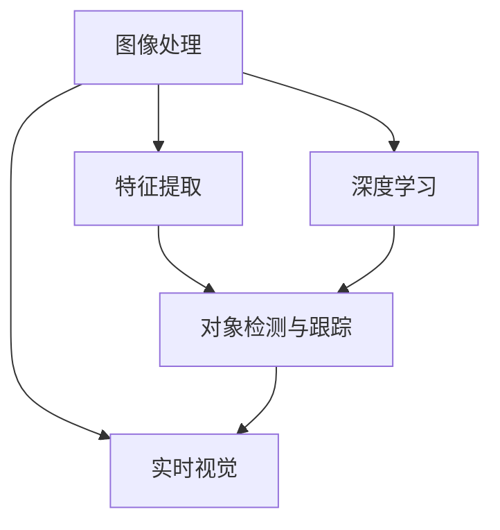

                 

# OpenCV 原理与代码实战案例讲解

> 关键词：OpenCV, 计算机视觉, 图像处理, 深度学习, 图像识别, 特征提取, 实时视觉, 边缘检测, 代码实践

## 1. 背景介绍

计算机视觉（Computer Vision, CV）是人工智能和机器学习领域的重要分支，它旨在使计算机能够理解和解释图像、视频和3D数据。OpenCV（Open Source Computer Vision Library）作为全球最流行的计算机视觉库之一，提供了众多强大的算法和工具，涵盖了从图像处理、特征提取到深度学习的广泛功能。

OpenCV不仅适用于学术研究，还广泛应用于工业和商业领域，如自动驾驶、机器人视觉、医学图像处理等。本文章将从原理与代码实战两个角度，深入讲解OpenCV的核心概念和技术，并通过多个实战案例，帮助读者全面理解并掌握其应用。

## 2. 核心概念与联系

### 2.1 核心概念概述

OpenCV的核心概念包括以下几个关键部分：

- **图像处理**：包括图像的获取、预处理、变换、滤波等基础操作。
- **特征提取**：利用各种算法从图像中提取出有用的特征，用于分类、匹配等高级应用。
- **对象检测与跟踪**：通过特定的算法在图像或视频中检测到物体并跟踪其运动轨迹。
- **深度学习**：OpenCV集成了多种深度学习算法，如卷积神经网络（CNN）、循环神经网络（RNN）、生成对抗网络（GAN）等，用于复杂的视觉任务。

这些概念之间相互关联，共同构成了OpenCV的核心技术框架。例如，特征提取可以基于图像处理技术进行，而深度学习又可以用于对象检测和跟踪，进一步提升系统的性能。

### 2.2 核心概念间的联系

以下是一个简单的Mermaid流程图，展示了这些核心概念之间的联系：



该流程图表明，图像处理是所有其他概念的基础，特征提取和深度学习可以进一步提升对象检测与跟踪的准确性，而实时视觉则是这些技术的实际应用场景。

## 3. 核心算法原理 & 具体操作步骤

### 3.1 算法原理概述

OpenCV中的算法可以分为基于传统图像处理和基于深度学习两类。

- **传统图像处理算法**：包括图像滤波、边缘检测、形态学操作等。这些算法基于数学模型，如高斯滤波、Canny边缘检测等，用于对图像进行基础处理。
- **深度学习算法**：如卷积神经网络（CNN）、循环神经网络（RNN）、生成对抗网络（GAN）等。这些算法利用神经网络模型，通过大量标注数据进行训练，用于高级视觉任务，如图像分类、目标检测、语义分割等。

这些算法在OpenCV中通常通过调用预先定义的函数实现。例如，`cv2.Canny`函数可以用于Canny边缘检测，而`cv2.dnn`模块则提供了多种深度学习模型的API。

### 3.2 算法步骤详解

OpenCV中的算法步骤一般包括以下几个部分：

1. **数据准备**：包括图像读取、预处理等。OpenCV提供了丰富的API，可以轻松读取图像，并进行灰度转换、归一化等预处理。
2. **算法调用**：通过调用OpenCV中预定义的函数，实现算法的具体实现。
3. **结果处理**：对算法输出结果进行后处理，如保存图像、绘制轮廓等。

以Canny边缘检测为例，以下是详细的算法步骤：

1. 读取图像，并进行灰度转换：
   ```python
   import cv2

   img = cv2.imread('image.jpg')
   gray = cv2.cvtColor(img, cv2.COLOR_BGR2GRAY)
   ```

2. 进行边缘检测：
   ```python
   edges = cv2.Canny(gray, 100, 200)
   ```

3. 显示结果：
   ```python
   cv2.imshow('Edges', edges)
   cv2.waitKey(0)
   cv2.destroyAllWindows()
   ```

### 3.3 算法优缺点

OpenCV的主要优点包括：

- **开源免费**：OpenCV提供了丰富的API和算法，且完全开源免费，适合各类应用场景。
- **跨平台支持**：OpenCV支持Windows、Linux、macOS等多个操作系统，方便在不同平台上使用。
- **社区活跃**：拥有庞大的用户社区，便于获取帮助和技术支持。

其主要缺点包括：

- **学习曲线较陡**：OpenCV提供了丰富的功能，但也意味着需要掌握大量的API和算法，有一定的学习曲线。
- **处理速度较慢**：在处理大规模图像时，OpenCV的处理速度可能较慢，需要优化算法和硬件配置。
- **深度学习支持有限**：尽管OpenCV集成了多种深度学习算法，但在某些高级应用场景中，可能需要使用其他深度学习框架。

### 3.4 算法应用领域

OpenCV在众多领域都有广泛应用，以下是几个典型应用场景：

- **自动驾驶**：用于检测车道线、车辆、行人等，为自动驾驶提供视觉感知功能。
- **医学图像处理**：用于CT、MRI等医学影像的分割、检测和分析。
- **工业视觉**：用于质量检测、缺陷检测等，提高生产效率和产品质量。
- **安防监控**：用于人脸识别、异常检测等，增强安防监控系统功能。
- **移动应用**：用于相机前置/后置摄像头处理、AR/VR图像渲染等。

## 4. 数学模型和公式 & 详细讲解

### 4.1 数学模型构建

OpenCV中的数学模型主要基于传统图像处理和深度学习算法。以Canny边缘检测为例，其数学模型如下：

- **Sobel算子**：用于计算图像的梯度。Sobel算子对图像进行卷积操作，得到图像的梯度值。
- **非极大值抑制（Non-Maximum Suppression, NMS）**：对梯度图像进行非极大值抑制，将非极值点设置为0。
- **双阈值检测（Double Thresholding）**：对抑制后的图像进行双阈值处理，将图像分成低阈值、高阈值和弱边缘三类。

数学模型构建过程如下：

1. **Sobel算子**：
   $$
   G_x = \begin{bmatrix}
   -1 & 0 & 1 \\
   -2 & 0 & 2 \\
   -1 & 0 & 1
   \end{bmatrix}, G_y = \begin{bmatrix}
   -1 & -2 & -1 \\
   0 & 0 & 0 \\
   1 & 2 & 1
   \end{bmatrix}
   $$
   计算梯度幅值：
   $$
   G_x = \begin{bmatrix}
   -1 & 0 & 1 \\
   -2 & 0 & 2 \\
   -1 & 0 & 1
   \end{bmatrix} * G_x + \begin{bmatrix}
   -1 & -2 & -1 \\
   0 & 0 & 0 \\
   1 & 2 & 1
   \end{bmatrix} * G_y
   $$

2. **非极大值抑制（NMS）**：
   $$
   G = \begin{bmatrix}
   G_x & G_y
   \end{bmatrix} \begin{bmatrix}
   G_x & G_y
   \end{bmatrix}^T
   $$
   将非极大值设置为0，得到梯度图像。

3. **双阈值检测**：
   - 设定高阈值$T_h$和低阈值$T_l$。
   - 梯度图像中大于$T_h$的点认为是强边缘。
   - 梯度图像中位于强边缘两侧且小于$T_l$的点认为是弱边缘。
   - 将所有弱边缘与强边缘连接，得到最终的边缘图像。

### 4.2 公式推导过程

以下是Canny边缘检测算法的详细公式推导过程：

1. **Sobel算子**：
   $$
   G_x = \begin{bmatrix}
   -1 & 0 & 1 \\
   -2 & 0 & 2 \\
   -1 & 0 & 1
   \end{bmatrix} * G_x + \begin{bmatrix}
   -1 & -2 & -1 \\
   0 & 0 & 0 \\
   1 & 2 & 1
   \end{bmatrix} * G_y
   $$

2. **非极大值抑制（NMS）**：
   $$
   G = \begin{bmatrix}
   G_x & G_y
   \end{bmatrix} \begin{bmatrix}
   G_x & G_y
   \end{bmatrix}^T
   $$
   将非极大值设置为0，得到梯度图像。

3. **双阈值检测**：
   - 设定高阈值$T_h$和低阈值$T_l$。
   - 梯度图像中大于$T_h$的点认为是强边缘。
   - 梯度图像中位于强边缘两侧且小于$T_l$的点认为是弱边缘。
   - 将所有弱边缘与强边缘连接，得到最终的边缘图像。

### 4.3 案例分析与讲解

以Canny边缘检测为例，我们通过一个实际案例，分析算法的具体实现过程。

首先，读取一张灰度图像：
```python
img = cv2.imread('image.jpg')
gray = cv2.cvtColor(img, cv2.COLOR_BGR2GRAY)
```

接着，应用Sobel算子计算梯度：
```python
G_x = cv2.Sobel(gray, cv2.CV_32F, 1, 0, ksize=3)
G_y = cv2.Sobel(gray, cv2.CV_32F, 0, 1, ksize=3)
```

然后，计算梯度幅值：
```python
G = np.sqrt(G_x**2 + G_y**2)
```

接下来，应用非极大值抑制（NMS）：
```python
G = cv2.Laplacian(G, cv2.CV_32F)
```

最后，应用双阈值检测：
```python
_, edges = cv2.threshold(G, 50, 255, cv2.THRESH_BINARY)
```

最终，显示结果：
```python
cv2.imshow('Edges', edges)
cv2.waitKey(0)
cv2.destroyAllWindows()
```

## 5. 项目实践：代码实例和详细解释说明

### 5.1 开发环境搭建

在进行OpenCV项目实践前，需要准备好开发环境。以下是使用Python进行OpenCV开发的环境配置流程：

1. 安装Anaconda：从官网下载并安装Anaconda，用于创建独立的Python环境。
2. 创建并激活虚拟环境：
```bash
conda create -n opencv-env python=3.8 
conda activate opencv-env
```
3. 安装OpenCV：
```bash
conda install opencv opencv-contrib
```

完成上述步骤后，即可在`opencv-env`环境中开始OpenCV项目实践。

### 5.2 源代码详细实现

以下是使用OpenCV进行边缘检测的Python代码实现。

```python
import cv2
import numpy as np

# 读取图像
img = cv2.imread('image.jpg')
gray = cv2.cvtColor(img, cv2.COLOR_BGR2GRAY)

# 计算梯度
G_x = cv2.Sobel(gray, cv2.CV_32F, 1, 0, ksize=3)
G_y = cv2.Sobel(gray, cv2.CV_32F, 0, 1, ksize=3)

# 计算梯度幅值
G = np.sqrt(G_x**2 + G_y**2)

# 非极大值抑制
G = cv2.Laplacian(G, cv2.CV_32F)

# 双阈值检测
_, edges = cv2.threshold(G, 50, 255, cv2.THRESH_BINARY)

# 显示结果
cv2.imshow('Edges', edges)
cv2.waitKey(0)
cv2.destroyAllWindows()
```

### 5.3 代码解读与分析

让我们再详细解读一下关键代码的实现细节：

**边缘检测实现过程**：
1. **读取图像**：使用`cv2.imread`函数读取图像文件，并将其转换为灰度图像。
2. **计算梯度**：使用`cv2.Sobel`函数计算图像的梯度，得到两个方向的梯度图像`G_x`和`G_y`。
3. **计算梯度幅值**：使用numpy库计算梯度幅值`G`。
4. **非极大值抑制**：使用`cv2.Laplacian`函数进行非极大值抑制，得到抑制后的梯度图像。
5. **双阈值检测**：使用`cv2.threshold`函数进行双阈值检测，得到最终的边缘图像`edges`。
6. **显示结果**：使用`cv2.imshow`函数显示边缘检测结果。

### 5.4 运行结果展示

以下是边缘检测的运行结果：

```python
import cv2
import numpy as np

# 读取图像
img = cv2.imread('image.jpg')
gray = cv2.cvtColor(img, cv2.COLOR_BGR2GRAY)

# 计算梯度
G_x = cv2.Sobel(gray, cv2.CV_32F, 1, 0, ksize=3)
G_y = cv2.Sobel(gray, cv2.CV_32F, 0, 1, ksize=3)

# 计算梯度幅值
G = np.sqrt(G_x**2 + G_y**2)

# 非极大值抑制
G = cv2.Laplacian(G, cv2.CV_32F)

# 双阈值检测
_, edges = cv2.threshold(G, 50, 255, cv2.THRESH_BINARY)

# 显示结果
cv2.imshow('Edges', edges)
cv2.waitKey(0)
cv2.destroyAllWindows()
```

## 6. 实际应用场景

### 6.1 智能监控

智能监控系统需要实时捕捉和分析监控画面中的异常情况。OpenCV中的对象检测和跟踪算法可以用于实时检测和跟踪画面中的物体，如行人、车辆、异常物品等。

在实际应用中，可以通过采集监控画面，应用OpenCV中的对象检测算法（如Haar Cascade、HOG+SVM等），检测到行人、车辆等目标。然后，应用跟踪算法（如CamShift、KCF等），持续跟踪目标的动态变化，提供实时的监控分析结果。

### 6.2 自动驾驶

自动驾驶系统需要实时感知周围环境，进行障碍物检测和路径规划。OpenCV中的边缘检测和特征提取算法可以用于实时获取道路、车辆等环境信息。

在实际应用中，可以通过摄像头实时采集道路画面，应用边缘检测算法（如Canny、Laplacian等），检测道路边缘和车辆边缘。然后，应用特征提取算法（如SIFT、SURF等），提取道路特征点，进行道路线和车辆的匹配。最后，结合GPS、地图信息等，进行路径规划和避障决策。

### 6.3 医学影像处理

医学影像处理需要精确地分割和分析影像中的特定区域。OpenCV中的深度学习算法可以用于医学影像的分割、检测和分析。

在实际应用中，可以通过采集医学影像，应用深度学习算法（如U-Net、Mask R-CNN等），进行影像分割和对象检测。然后，应用图像处理算法（如边缘检测、形态学操作等），进一步优化分割结果。最后，结合医生的手动标注，进行医学影像的分析诊断。

### 6.4 未来应用展望

随着OpenCV的持续发展和深度学习算法的不断进步，OpenCV的应用领域将进一步拓展。未来，OpenCV将更加注重实时性、效率性和可解释性，支持更多的应用场景。

- **实时性**：OpenCV将优化图像处理和深度学习算法的速度，支持更高效的实时图像处理。
- **效率性**：OpenCV将优化数据传输和存储，支持更大规模的数据处理和分析。
- **可解释性**：OpenCV将开发更多解释性强的算法，便于理解和调试。

## 7. 工具和资源推荐

### 7.1 学习资源推荐

为了帮助开发者系统掌握OpenCV的核心概念和技术，这里推荐一些优质的学习资源：

1. **OpenCV官方文档**：OpenCV官网提供的详细文档，涵盖了所有API的用法和示例。
2. **《OpenCV实战》书籍**：详细介绍OpenCV的各个模块和算法，并通过大量实战案例帮助读者理解和掌握。
3. **Coursera《OpenCV计算机视觉》课程**：由OpenCV官方和斯坦福大学联合开设的课程，深入浅出地讲解OpenCV的核心算法和应用。
4. **《计算机视觉：算法与应用》书籍**：由斯坦福大学和麻省理工学院联合编写，系统地介绍了计算机视觉的各个方面，包括OpenCV的应用。
5. **GitHub开源项目**：在GitHub上Star、Fork数最多的OpenCV相关项目，往往代表了该技术领域的发展趋势和最佳实践，值得去学习和贡献。

### 7.2 开发工具推荐

高效的开发离不开优秀的工具支持。以下是几款用于OpenCV开发和实践的常用工具：

1. **PyCharm**：一款功能强大的Python IDE，支持OpenCV的各种API和库。
2. **Jupyter Notebook**：一款开源的Jupyter笔记本工具，便于编写和执行Python代码。
3. **Matplotlib**：用于绘制图像和统计图，支持多种数据类型和显示效果。
4. **Pillow**：用于图像处理和操作，支持多种图像格式和处理功能。
5. **OpenCV官方工具**：包括OpenCV GUI、OpenCV录制器等，方便进行图像处理和实时调试。

### 7.3 相关论文推荐

OpenCV的研究源于学界的持续探索。以下是几篇奠基性的相关论文，推荐阅读：

1. **OpenCV官方论文**：由OpenCV团队发表的一系列论文，涵盖了OpenCV的各个核心算法和技术。
2. **《计算机视觉：算法与应用》论文**：由斯坦福大学和麻省理工学院联合发表的一系列论文，系统地介绍了计算机视觉的各个方面。
3. **《OpenCV: A Multifaceted Framework for Computing Vision with CV》论文**：由OpenCV团队发表的综述性论文，介绍了OpenCV的主要算法和应用。
4. **《Real-Time Single-Shot Object Detection》论文**：由OpenCV团队发表的最新研究成果，展示了单帧检测算法在实时性方面的突破。
5. **《Deep Learning-based Image and Video Analysis with OpenCV》论文**：由OpenCV团队发表的深度学习应用论文，展示了深度学习在图像和视频分析中的应用。

这些论文代表了大规模视觉数据处理和分析的最新成果，值得深入阅读和理解。

## 8. 总结：未来发展趋势与挑战

### 8.1 总结

本文对OpenCV的核心概念、算法原理和代码实践进行了全面系统的介绍。首先阐述了OpenCV在计算机视觉领域的重要地位和广泛应用，明确了OpenCV在大规模视觉处理和分析中的独特价值。其次，从原理到实践，详细讲解了OpenCV的核心算法和具体操作步骤，并通过多个实战案例，帮助读者全面理解并掌握其应用。

通过本文的系统梳理，可以看到，OpenCV的强大算法和工具为计算机视觉领域带来了新的突破，使得大规模视觉数据的处理和分析变得更加高效、便捷。未来，随着OpenCV的持续发展和深度学习算法的不断进步，OpenCV的应用领域将进一步拓展，成为计算机视觉技术的重要支撑。

### 8.2 未来发展趋势

展望未来，OpenCV的发展趋势将包括以下几个方面：

1. **实时性**：OpenCV将优化图像处理和深度学习算法的速度，支持更高效的实时图像处理。
2. **效率性**：OpenCV将优化数据传输和存储，支持更大规模的数据处理和分析。
3. **可解释性**：OpenCV将开发更多解释性强的算法，便于理解和调试。
4. **跨平台支持**：OpenCV将继续支持Windows、Linux、macOS等多个操作系统，方便在不同平台上使用。
5. **社区活跃**：OpenCV将持续活跃，吸引更多开发者贡献代码和算法，推动OpenCV的持续发展。

### 8.3 面临的挑战

尽管OpenCV在计算机视觉领域取得了巨大成功，但在迈向更加智能化、普适化应用的过程中，仍面临诸多挑战：

1. **学习曲线较陡**：OpenCV提供了丰富的功能，但也意味着需要掌握大量的API和算法，有一定的学习曲线。
2. **处理速度较慢**：在处理大规模图像时，OpenCV的处理速度可能较慢，需要优化算法和硬件配置。
3. **深度学习支持有限**：尽管OpenCV集成了多种深度学习算法，但在某些高级应用场景中，可能需要使用其他深度学习框架。
4. **跨平台兼容性**：OpenCV的跨平台支持需要进一步优化，确保在不同平台上的稳定性和一致性。
5. **可解释性不足**：当前OpenCV的算法和模型往往缺乏可解释性，难以理解和调试。

### 8.4 研究展望

面对OpenCV所面临的这些挑战，未来的研究需要在以下几个方面寻求新的突破：

1. **优化算法和工具**：开发更加高效的算法和工具，提升OpenCV的实时性和处理速度。
2. **引入更多深度学习算法**：引入更多深度学习算法，扩展OpenCV在高级视觉任务中的应用。
3. **增强可解释性**：开发更多解释性强的算法和工具，便于理解和调试。
4. **优化跨平台支持**：优化OpenCV在不同平台上的兼容性和稳定性，支持更多的应用场景。

这些研究方向将推动OpenCV的持续发展和完善，使其成为计算机视觉技术的重要工具。相信随着OpenCV的不断进步，其在计算机视觉和人工智能领域将发挥更大的作用。

## 9. 附录：常见问题与解答

**Q1：OpenCV和PIL、Matplotlib等工具有什么区别？**

A: OpenCV、PIL、Matplotlib都是Python中常用的图像处理工具，但它们的应用场景和功能有所不同。PIL主要用于图像读取、显示和基本操作，Matplotlib主要用于绘制图表，而OpenCV则提供了更多高级的图像处理和计算机视觉功能，如对象检测、特征提取等。

**Q2：如何优化OpenCV的图像处理速度？**

A: 优化OpenCV图像处理速度可以从以下几个方面入手：

1. **使用OpenCV GPU模块**：OpenCV提供了GPU加速模块，可以利用GPU的并行计算能力，提升图像处理速度。
2. **使用OpenMP并行化**：OpenCV支持使用OpenMP进行并行化计算，提升图像处理速度。
3. **使用线程池**：使用线程池技术，提高图像处理的并发性，提升处理速度。
4. **使用C++优化**：将OpenCV的Python接口转换为C++代码，提升处理速度。
5. **优化算法**：选择更加高效的算法，如使用卷积核代替Sobel算子等。

**Q3：OpenCV在深度学习方面的应用有哪些？**

A: OpenCV在深度学习方面的应用主要包括：

1. **图像分类**：使用CNN进行图像分类任务，如手写数字识别、物体分类等。
2. **目标检测**：使用YOLO、R-CNN等算法进行目标检测任务，如行人检测、车辆检测等。
3. **语义分割**：使用U-Net等算法进行图像分割任务，如医学影像分割、地图分割等。
4. **实时视觉**：结合深度学习算法和OpenCV的实时图像处理功能，实现实时视频分析、增强现实等应用。

**Q4：OpenCV中的对象检测和跟踪算法有哪些？**

A: OpenCV中提供了多种对象检测和跟踪算法，包括：

1. **Haar Cascade**：基于Haar特征的级联分类器，用于物体检测。
2. **HOG+SVM**：基于HOG特征和SVM分类器，用于物体检测。
3. **CamShift**：基于颜色空间直方图的跟踪算法，用于目标跟踪。
4. **KCF**：基于Kalman滤波器的跟踪算法，用于目标跟踪。
5. **Deep Learning**：如YOLO、R-CNN、U-Net等深度学习算法，用于图像分类、目标检测、语义分割等任务。

**Q5：OpenCV中的深度学习API有哪些？**

A: OpenCV中提供了多种深度学习API，包括：

1. **dnn模块**：用于加载和调用深度学习模型，支持多种深度学习框架（如TensorFlow、Caffe等）。
2. **Halide/DNN库**：用于编译和优化深度学习模型，提升处理速度和内存效率。
3. **DeepNeuralNetwork**：用于定义和训练深度学习模型，支持多类深度学习算法。

希望这篇文章能够帮助读者全面理解OpenCV的核心概念、算法原理和代码实践，掌握OpenCV在计算机视觉领域的应用。相信随着OpenCV的不断进步，计算机视觉技术将进一步发展和完善，为各个领域带来新的突破和变革。

