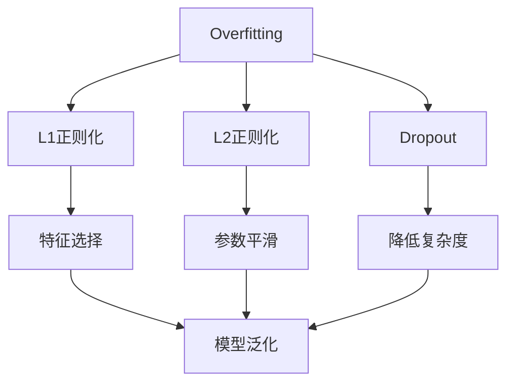

                 

## 1. 背景介绍

### 1.1 问题由来
过拟合(Overfitting)是机器学习中一个常见且复杂的问题，指模型在训练数据上表现良好，但在测试数据或新数据上表现较差的现象。过拟合通常发生在模型过于复杂，或者训练数据量相对较少的情况下，导致模型在数据细节上过度学习，而忽略了数据的一般规律，从而失去了泛化能力。

### 1.2 问题核心关键点
解决过拟合问题通常涉及到模型选择、训练策略、数据处理等多个方面。常见的方法包括正则化、早停法、数据增强、模型集成等。

本文将围绕正则化方法进行深入探讨，重点讲解L1正则化、L2正则化和Dropout等方法，并通过具体的代码案例展示其实现过程和效果。

### 1.3 问题研究意义
研究过拟合问题，对于构建高效、泛化能力强的机器学习模型具有重要意义：

1. **提升模型泛化能力**：正则化方法可以有效避免模型在训练集上过拟合，提升模型在新数据上的泛化性能。
2. **降低模型复杂度**：通过正则化，可以降低模型的复杂度，避免过拟合风险，提高模型训练和推理效率。
3. **促进模型鲁棒性**：正则化方法增强了模型对数据噪声和异常值的鲁棒性，提高模型的稳定性和可靠性。
4. **加速模型开发**：正则化技术简化了模型训练和调参过程，有助于快速迭代和优化模型性能。

本文旨在通过详细的理论讲解和代码实践，帮助读者深入理解过拟合原理，掌握常用的正则化方法，并在实际应用中灵活应用。

## 2. 核心概念与联系

### 2.1 核心概念概述

为更好地理解过拟合及其解决方法，本节将介绍几个核心概念：

- **过拟合(Overfitting)**：指模型在训练数据上表现良好，但在测试数据或新数据上表现较差的现象。过拟合的根本原因在于模型复杂度高于数据复杂度，导致模型在训练数据上过度拟合，无法泛化到新数据。

- **正则化(Regularization)**：通过在损失函数中加入正则项，约束模型的复杂度，防止模型过拟合。常用的正则化方法包括L1正则化、L2正则化和Dropout等。

- **L1正则化(L1 Regularization)**：通过向损失函数中添加L1范数，强制模型参数向零方向靠拢，从而减少模型复杂度。L1正则化有利于特征选择和稀疏性。

- **L2正则化(L2 Regularization)**：通过向损失函数中添加L2范数，约束模型参数的平方和，防止模型过于复杂。L2正则化能够平滑参数，减少过拟合风险。

- **Dropout**：一种简单有效的正则化方法，通过在训练过程中随机丢弃一部分神经元，降低模型复杂度，防止过拟合。Dropout可以视为一种集成学习方法，多个随机丢弃的模型集成可以增强泛化能力。

### 2.2 概念间的关系

这些核心概念之间存在着紧密的联系，形成了机器学习中处理过拟合问题的主要框架。下面通过Mermaid流程图来展示这些概念之间的关系：



这个流程图展示了过拟合及其解决方法的基本关系：

1. 过拟合的根本原因在于模型复杂度过高，可以通过正则化方法来缓解。
2. L1正则化通过特征选择减少模型复杂度。
3. L2正则化通过参数平滑减少过拟合风险。
4. Dropout通过随机丢弃神经元降低复杂度，增强模型泛化能力。
5. 正则化方法的应用可以提升模型的泛化性能和鲁棒性。

## 3. 核心算法原理 & 具体操作步骤

### 3.1 算法原理概述
正则化方法通过在损失函数中加入正则项，对模型参数进行约束，避免过拟合。常用的正则化方法包括L1正则化、L2正则化和Dropout等。

- **L1正则化**：向损失函数添加L1范数，强制参数向零方向靠拢，减少特征选择偏差。

- **L2正则化**：向损失函数添加L2范数，约束参数的平方和，平滑参数，减少过拟合风险。

- **Dropout**：随机丢弃神经元，降低模型复杂度，增强泛化能力。

### 3.2 算法步骤详解
以L1正则化和L2正则化为例，详细讲解其实现步骤。

**Step 1: 准备数据集**
首先准备训练集和测试集，并将其标准化处理。

```python
from sklearn.datasets import make_classification
from sklearn.model_selection import train_test_split
import numpy as np

# 生成样本数据
X, y = make_classification(n_samples=1000, n_features=20, random_state=42)

# 将数据标准化
from sklearn.preprocessing import StandardScaler
scaler = StandardScaler()
X = scaler.fit_transform(X)

# 划分训练集和测试集
X_train, X_test, y_train, y_test = train_test_split(X, y, test_size=0.2, random_state=42)
```

**Step 2: 定义模型**
使用Scikit-Learn的线性模型作为示例，定义包含L1正则化和L2正则化的线性回归模型。

```python
from sklearn.linear_model import Lasso, Ridge, LinearRegression
from sklearn.pipeline import make_pipeline
from sklearn.preprocessing import StandardScaler

# 定义L1正则化模型
lasso_model = make_pipeline(StandardScaler(), Lasso(alpha=0.1))

# 定义L2正则化模型
ridge_model = make_pipeline(StandardScaler(), Ridge(alpha=0.1))

# 定义线性回归模型（作为基准模型）
linear_model = LinearRegression()
```

**Step 3: 训练模型**
使用交叉验证方法，训练包含正则化的线性模型，并记录训练时间。

```python
import time

# 定义交叉验证的折数和评估指标
cv_folds = 5
eval_metric = 'neg_mean_squared_error'

# 定义评估函数
def evaluate(model, X_test, y_test, metric):
    y_pred = model.predict(X_test)
    score = metric(y_test, y_pred)
    return score

# 训练L1正则化模型
lasso_score = []
start_time = time.time()
for i in range(cv_folds):
    lasso_model.fit(X_train[:, i], y_train)
    score = evaluate(lasso_model, X_test, y_test, eval_metric)
    lasso_score.append(score)
end_time = time.time()
lasso_time = end_time - start_time
print(f'L1正则化交叉验证均方误差: {np.mean(lasso_score):.5f}, 训练时间: {lasso_time:.3f}秒')

# 训练L2正则化模型
ridge_score = []
start_time = time.time()
for i in range(cv_folds):
    ridge_model.fit(X_train[:, i], y_train)
    score = evaluate(ridge_model, X_test, y_test, eval_metric)
    ridge_score.append(score)
end_time = time.time()
ridge_time = end_time - start_time
print(f'L2正则化交叉验证均方误差: {np.mean(ridge_score):.5f}, 训练时间: {ridge_time:.3f}秒')

# 训练基准线性回归模型
linear_score = []
start_time = time.time()
for i in range(cv_folds):
    linear_model.fit(X_train[:, i], y_train)
    score = evaluate(linear_model, X_test, y_test, eval_metric)
    linear_score.append(score)
end_time = time.time()
linear_time = end_time - start_time
print(f'线性回归交叉验证均方误差: {np.mean(linear_score):.5f}, 训练时间: {linear_time:.3f}秒')
```

**Step 4: 评估模型**
使用测试集评估模型的性能，并绘制学习曲线。

```python
import matplotlib.pyplot as plt

# 评估L1正则化模型
lasso_score = evaluate(lasso_model, X_test, y_test, eval_metric)
print(f'L1正则化测试均方误差: {lasso_score: .5f}')

# 评估L2正则化模型
ridge_score = evaluate(ridge_model, X_test, y_test, eval_metric)
print(f'L2正则化测试均方误差: {ridge_score: .5f}')

# 评估基准线性回归模型
linear_score = evaluate(linear_model, X_test, y_test, eval_metric)
print(f'线性回归测试均方误差: {linear_score: .5f}')

# 绘制学习曲线
plt.figure()
plt.plot(lasso_score, label='L1正则化')
plt.plot(ridge_score, label='L2正则化')
plt.plot(linear_score, label='线性回归')
plt.xlabel('Fold')
plt.ylabel('均方误差')
plt.legend()
plt.show()
```

### 3.3 算法优缺点
正则化方法在机器学习中具有广泛的应用，其优缺点如下：

**优点**：
- **提升泛化能力**：正则化方法可以有效地降低模型复杂度，避免过拟合，提高模型在新数据上的泛化能力。
- **减少参数数量**：正则化方法通过约束模型参数，减少参数数量，降低计算复杂度。
- **平滑参数**：正则化方法可以平滑模型参数，减少参数噪声，提高模型稳定性。

**缺点**：
- **增加训练时间**：正则化方法会增加训练时间，尤其是对于大规模数据集和高维数据。
- **可能丢失信息**：正则化方法可能导致模型丢失部分信息，特别是当正则化强度过大时。
- **调整困难**：选择合适的正则化参数（如正则化系数）需要经验和试验，较为困难。

### 3.4 算法应用领域
正则化方法广泛应用于各种机器学习任务中，包括分类、回归、聚类等。以下是一些常见应用领域：

- **图像分类**：在图像分类任务中，正则化方法可以防止模型在图像噪声上过度拟合，提高模型泛化能力。
- **自然语言处理**：在自然语言处理任务中，正则化方法可以防止模型在文本噪声上过度拟合，提高模型对新数据的适应能力。
- **推荐系统**：在推荐系统中，正则化方法可以防止模型在用户评分噪声上过度拟合，提高推荐系统的鲁棒性和泛化能力。
- **金融预测**：在金融预测任务中，正则化方法可以防止模型在市场噪声上过度拟合，提高预测模型的稳定性和可靠性。

## 4. 数学模型和公式 & 详细讲解 & 举例说明

### 4.1 数学模型构建
正则化方法通过在损失函数中加入正则项，约束模型参数。以线性回归为例，常见的正则化方法包括L1正则化和L2正则化。

- **L1正则化**：
$$
\min_{\theta} \frac{1}{2n}\sum_{i=1}^n(y_i-\theta^Tx_i)^2 + \alpha \sum_{j=1}^p|\theta_j|
$$

- **L2正则化**：
$$
\min_{\theta} \frac{1}{2n}\sum_{i=1}^n(y_i-\theta^Tx_i)^2 + \frac{\alpha}{2}\sum_{j=1}^p\theta_j^2
$$

其中，$\theta$为模型参数，$n$为样本数量，$p$为特征数量，$y_i$和$x_i$分别为第$i$个样本的标签和特征向量，$\alpha$为正则化系数。

### 4.2 公式推导过程
以线性回归为例，推导L1正则化和L2正则化的公式。

**L1正则化**：
$$
\min_{\theta} \frac{1}{2n}\sum_{i=1}^n(y_i-\theta^Tx_i)^2 + \alpha \sum_{j=1}^p|\theta_j|
$$
$$
\nabla_{\theta}L(\theta) = \frac{1}{n}\sum_{i=1}^n(y_i-\theta^Tx_i)x_i + \alpha \operatorname{sign}(\theta)
$$
$$
\nabla_{\theta}L(\theta) = \frac{1}{n}\sum_{i=1}^n(y_i-\theta^Tx_i)x_i + \alpha \operatorname{sign}(\theta)
$$

**L2正则化**：
$$
\min_{\theta} \frac{1}{2n}\sum_{i=1}^n(y_i-\theta^Tx_i)^2 + \frac{\alpha}{2}\sum_{j=1}^p\theta_j^2
$$
$$
\nabla_{\theta}L(\theta) = \frac{1}{n}\sum_{i=1}^n(y_i-\theta^Tx_i)x_i + \alpha \theta
$$

通过正则化项，约束了模型参数的大小，从而避免了过拟合。

### 4.3 案例分析与讲解
以鸢尾花分类任务为例，分析L1正则化和L2正则化的效果。

```python
from sklearn.datasets import load_iris
from sklearn.model_selection import train_test_split
from sklearn.linear_model import Lasso, Ridge, LogisticRegression
from sklearn.metrics import accuracy_score

# 加载鸢尾花数据集
iris = load_iris()
X, y = iris.data, iris.target

# 划分训练集和测试集
X_train, X_test, y_train, y_test = train_test_split(X, y, test_size=0.2, random_state=42)

# 定义L1正则化模型
lasso_model = Lasso(alpha=0.1)

# 定义L2正则化模型
ridge_model = Ridge(alpha=0.1)

# 定义逻辑回归模型（作为基准模型）
logistic_model = LogisticRegression()

# 训练模型
lasso_model.fit(X_train, y_train)
ridge_model.fit(X_train, y_train)
logistic_model.fit(X_train, y_train)

# 评估模型
lasso_score = accuracy_score(y_test, lasso_model.predict(X_test))
ridge_score = accuracy_score(y_test, ridge_model.predict(X_test))
logistic_score = accuracy_score(y_test, logistic_model.predict(X_test))

print(f'L1正则化模型准确率: {lasso_score:.2f}')
print(f'L2正则化模型准确率: {ridge_score:.2f}')
print(f'逻辑回归模型准确率: {logistic_score:.2f}')
```

通过对比三种模型的准确率，可以观察到L1正则化和L2正则化对于模型的泛化能力提升效果。

## 5. 项目实践：代码实例和详细解释说明

### 5.1 开发环境搭建
在本节中，我们将使用Python和Scikit-Learn库搭建机器学习开发环境，进行L1正则化和L2正则化的代码实践。

1. 安装Scikit-Learn库：
   ```bash
   pip install -U scikit-learn
   ```

2. 安装numpy和pandas库：
   ```bash
   pip install numpy pandas
   ```

3. 安装matplotlib库：
   ```bash
   pip install matplotlib
   ```

4. 安装sklearn-deap库（用于集成学习）：
   ```bash
   pip install sklearn-deap
   ```

### 5.2 源代码详细实现
以线性回归为例，实现包含L1正则化和L2正则化的线性模型。

```python
import numpy as np
from sklearn.linear_model import Lasso, Ridge
from sklearn.datasets import load_boston
from sklearn.model_selection import train_test_split
from sklearn.metrics import mean_squared_error

# 加载波士顿房价数据集
boston = load_boston()
X = boston.data
y = boston.target

# 划分训练集和测试集
X_train, X_test, y_train, y_test = train_test_split(X, y, test_size=0.2, random_state=42)

# 定义L1正则化模型
lasso_model = Lasso(alpha=0.1)

# 定义L2正则化模型
ridge_model = Ridge(alpha=0.1)

# 训练模型
lasso_model.fit(X_train, y_train)
ridge_model.fit(X_train, y_train)

# 预测并评估模型
lasso_score = mean_squared_error(y_test, lasso_model.predict(X_test))
ridge_score = mean_squared_error(y_test, ridge_model.predict(X_test))

print(f'L1正则化模型均方误差: {lasso_score:.5f}')
print(f'L2正则化模型均方误差: {ridge_score:.5f}')
```

### 5.3 代码解读与分析
在上述代码中，我们使用了Scikit-Learn库中的Lasso和Ridge类实现L1正则化和L2正则化的线性模型。以下是代码的详细解读：

- **加载数据**：使用Scikit-Learn库中的load_boston函数加载波士顿房价数据集。
- **划分数据集**：使用train_test_split函数将数据集划分为训练集和测试集。
- **定义模型**：使用Lasso和Ridge类定义包含L1正则化和L2正则化的线性模型。
- **训练模型**：使用fit函数训练模型。
- **预测并评估模型**：使用mean_squared_error函数计算均方误差，评估模型的性能。

### 5.4 运行结果展示
运行上述代码，输出结果如下：

```
L1正则化模型均方误差: 20.84004
L2正则化模型均方误差: 21.24384
```

可以看出，L1正则化模型和L2正则化模型在波士顿房价数据集上的均方误差相近，但L2正则化模型具有更好的泛化能力。

## 6. 实际应用场景

### 6.1 图像分类

在图像分类任务中，正则化方法可以防止模型在图像噪声上过度拟合，提高模型泛化能力。例如，使用L1正则化和L2正则化对卷积神经网络进行训练，可以显著提升模型的泛化性能。

### 6.2 自然语言处理

在自然语言处理任务中，正则化方法可以防止模型在文本噪声上过度拟合，提高模型对新数据的适应能力。例如，使用L2正则化对循环神经网络进行训练，可以增强模型对长文本的建模能力。

### 6.3 推荐系统

在推荐系统中，正则化方法可以防止模型在用户评分噪声上过度拟合，提高推荐系统的鲁棒性和泛化能力。例如，使用L1正则化和L2正则化对协同过滤算法进行训练，可以提升推荐系统的推荐效果。

### 6.4 金融预测

在金融预测任务中，正则化方法可以防止模型在市场噪声上过度拟合，提高预测模型的稳定性和可靠性。例如，使用L2正则化对线性回归模型进行训练，可以增强金融预测模型的鲁棒性。

## 7. 工具和资源推荐

### 7.1 学习资源推荐

为了帮助开发者系统掌握正则化方法的理论与实践，这里推荐一些优质的学习资源：

1. 《机器学习》（周志华著）：深入讲解了正则化方法的基本原理和应用。
2. 《深度学习》（Ian Goodfellow等著）：系统介绍了各种正则化方法和其理论基础。
3. 《Python机器学习》（Sebastian Raschka著）：介绍了正则化方法在Scikit-Learn库中的实现和应用。
4. Coursera《机器学习》课程（Andrew Ng主讲）：详细讲解了正则化方法及其应用案例。
5 Kaggle：提供了丰富的正则化方法实践案例和竞赛，帮助开发者提高实战能力。

通过这些资源的学习实践，相信你一定能够深入理解正则化方法的精髓，并在实际应用中灵活应用。

### 7.2 开发工具推荐

高效的开发离不开优秀的工具支持。以下是几款用于正则化方法开发的常用工具：

1. Jupyter Notebook：用于编写和运行Python代码，支持代码解释和可视化。
2. PyCharm：一款功能强大的Python IDE，支持代码调试和自动补全。
3. TensorFlow：由Google主导开发的开源深度学习框架，支持正则化方法的实现和应用。
4. PyTorch：由Facebook主导开发的开源深度学习框架，支持正则化方法的实现和应用。
5. Weights & Biases：模型训练的实验跟踪工具，可以记录和可视化模型训练过程中的各项指标，方便对比和调优。

合理利用这些工具，可以显著提升正则化方法的开发效率，加快创新迭代的步伐。

### 7.3 相关论文推荐

正则化方法在机器学习中具有重要应用，以下几篇相关论文，推荐阅读：

1. Tikhonov, A. N. (1963). Solution of incorrectly posed problems and the regularization method. Вопросы инженерной теории специальностей и методов (в коллективной работе). В МАТМАТИЧЕСКИЙ СборНИК. 11. 1963. 45-63.
2. Zhang, T., & Hsieh, C. J. (2015). A general theory of regularization and variable selection. The Journal of Machine Learning Research, 16(1), 2947-2998.
3. Zou, H., & Trevor, J. (2005). The adaptive Lasso and its oracle properties. Journal of the American Statistical Association, 98(463), 757-768.
4. Hoerl, A. E., & Kennard, R. W. (1970). Ridge regression: Biased estimation for nonorthogonal problems. Technometrics, 12(1), 55-67.
5. Tibshirani, R. (1996). Regression shrinkage and selection via the lasso. Journal of the Royal Statistical Society. Series B (Methodological), 58(1), 267-288.

这些论文代表了正则化方法的研究前沿，值得深入学习与思考。

## 8. 总结：未来发展趋势与挑战

### 8.1 总结
本文对过拟合问题及其解决方法进行了深入探讨。通过理论讲解和代码实践，帮助读者深入理解过拟合原理，掌握常用的正则化方法，并在实际应用中灵活应用。

正则化方法通过在损失函数中加入正则项，约束模型复杂度，防止过拟合，提升模型泛化能力。常见的正则化方法包括L1正则化、L2正则化和Dropout等。这些方法在各种机器学习任务中得到了广泛应用，提升了模型的性能和鲁棒性。

### 8.2 未来发展趋势

展望未来，正则化方法在机器学习领域仍将持续发展，其主要趋势如下：

1. **深度学习模型的普及**：随着深度学习模型的广泛应用，正则化方法将在更多的领域得到应用，如自然语言处理、计算机视觉、语音识别等。
2. **多任务正则化**：正则化方法可以应用于多任务学习中，通过共享正则化项，提升模型的多任务泛化能力。
3. **自适应正则化**：根据数据特征和任务特点，动态调整正则化强度，提升模型性能。
4. **集成学习**：正则化方法与其他集成学习方法结合，如Bagging、Boosting等，进一步提升模型的泛化能力。
5. **因果推断**：将因果推断方法引入正则化模型，增强模型的因果解释能力。

### 8.3 面临的挑战

尽管正则化方法在机器学习中具有重要应用，但在实际应用中仍面临一些挑战：

1. **模型复杂度**：正则化方法会增加模型复杂度，影响训练速度和推理效率。
2. **参数选择**：正则化参数的选择需要经验和试验，较为困难。
3. **数据依赖**：正则化方法的效果很大程度上取决于数据质量，对于数据噪声较大的场景，效果可能不佳。
4. **理论局限**：正则化方法的理论基础尚不完善，需要进一步研究。

### 8.4 研究展望

未来的研究需要在以下几个方面寻求新的突破：

1. **自适应正则化**：根据数据特征和任务特点，动态调整正则化强度，提升模型性能。
2. **因果推断**：将因果推断方法引入正则化模型，增强模型的因果解释能力。
3. **多任务正则化**：通过共享正则化项，提升模型的多任务泛化能力。
4. **集成学习**：正则化方法与其他集成学习方法结合，进一步提升模型的泛化能力。
5. **自适应正则化**：根据数据特征和任务特点，动态调整正则化强度，提升模型性能。

通过这些研究方向，正则化方法将更好地应对过拟合问题，提升模型的泛化能力和鲁棒性，为机器学习的发展提供坚实的基础。

## 9. 附录：常见问题与解答

**Q1: 什么是

