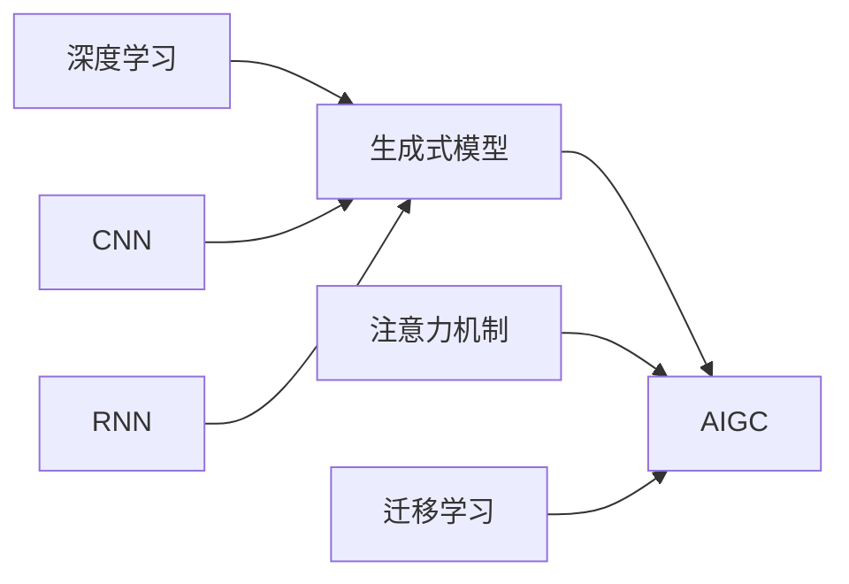

# AIGC从入门到实战：递进：人工智能时代的变化

作者：禅与计算机程序设计艺术

关键词：AIGC, 人工智能, 生成式AI, 深度学习, 机器学习, 计算机视觉, 自然语言处理

## 1. 背景介绍

### 1.1 问题的由来

人工智能生成内容(AIGC)技术的快速发展，正在深刻改变着我们的生活和工作方式。从自动生成的文章到逼真的合成图像和视频，AIGC正在重塑内容创作的未来。然而，对于许多人来说，AIGC仍然是一个相对陌生和令人生畏的概念。本文旨在为读者提供一个全面的AIGC入门指南，探讨其核心概念、关键技术、实际应用以及未来发展趋势。

### 1.2 研究现状

目前，AIGC技术已经在多个领域取得了显著进展。在自然语言处理方面，GPT-3、BERT等大型语言模型的出现，使得机器能够生成高质量的文本内容。在计算机视觉领域，GAN、VAE等生成模型的发展，使得机器能够生成逼真的图像和视频。此外，AIGC技术也在音频、3D建模等领域得到广泛应用。然而，当前AIGC技术仍面临着一些挑战，如生成内容的一致性、可控性和伦理问题等。

### 1.3 研究意义

AIGC技术的研究和应用具有重要意义。首先，AIGC可以极大地提高内容创作的效率，降低创作门槛，为更多人提供创作的机会。其次，AIGC技术可以用于生成个性化、定制化的内容，满足用户多样化的需求。此外，AIGC技术还可以应用于教育、医疗、娱乐等多个领域，为社会发展提供新的动力。深入研究AIGC技术，对于推动人工智能的发展和应用具有重要意义。

### 1.4 本文结构

本文将从以下几个方面对AIGC技术进行全面介绍和探讨：

1. 背景介绍：介绍AIGC技术的研究背景、现状和意义。
2. 核心概念与联系：阐述AIGC技术的核心概念及其之间的联系。
3. 核心算法原理与操作步骤：详细介绍AIGC的关键算法原理和具体实现步骤。
4. 数学模型和公式讲解：深入分析AIGC所涉及的数学模型和公式，并给出详细的推导过程和案例分析。
5. 项目实践：提供AIGC的代码实例，并对其进行详细的解释和分析。
6. 实际应用场景：探讨AIGC技术在各个领域的实际应用，并展望其未来发展前景。
7. 工具和资源推荐：推荐AIGC相关的学习资源、开发工具和研究论文。
8. 总结与展望：总结AIGC技术的研究现状和成果，分析其未来发展趋势和面临的挑战，并对AIGC的研究方向进行展望。
9. 附录：列出AIGC领域的常见问题，并给出详细的解答。

## 2. 核心概念与联系

AIGC是人工智能(AI)与生成式建模(Generative Modeling)相结合的产物。其核心思想是利用AI算法，特别是深度学习技术，来学习和模拟数据的分布，从而生成与原始数据相似的新样本。AIGC所涉及的核心概念包括：

- 生成式模型(Generative Models)：能够学习数据分布并生成新样本的模型，如GAN、VAE等。
- 深度学习(Deep Learning)：一种基于多层神经网络的机器学习方法，是实现AIGC的关键技术。
- 卷积神经网络(CNN)：一种常用于图像处理的深度学习模型，在AIGC的图像生成中发挥重要作用。
- 循环神经网络(RNN)：一种常用于序列数据处理的深度学习模型，在AIGC的文本、音频生成中得到广泛应用。
- 注意力机制(Attention Mechanism)：一种用于提高神经网络性能的技术，在AIGC的多个任务中得到应用。
- 迁移学习(Transfer Learning)：一种利用已训练好的模型来解决新任务的机器学习方法，可以提高AIGC的训练效率和性能。

这些核心概念之间存在着紧密的联系。深度学习是AIGC的理论基础和技术支撑，生成式模型是AIGC的核心框架。CNN、RNN等神经网络模型是构建生成式模型的重要组件，注意力机制和迁移学习则是提升AIGC性能的关键技术。下图展示了AIGC的核心概念之间的联系：



## 3. 核心算法原理 & 具体操作步骤

### 3.1 算法原理概述

AIGC的核心算法主要包括生成对抗网络(GAN)、变分自编码器(VAE)等生成式模型。这些模型的基本原理是通过学习数据的分布，从随机噪声中生成与原始数据相似的样本。以GAN为例，其由一个生成器(Generator)和一个判别器(Discriminator)组成。生成器试图生成尽可能逼真的样本，判别器则试图区分真实样本和生成样本。两者在训练过程中不断博弈，最终使生成器能够生成以假乱真的样本。

### 3.2 算法步骤详解

以GAN为例，其训练过程可分为以下步骤：

1. 初始化生成器和判别器的参数。
2. 从真实数据集中采样一批真实样本，从随机噪声中采样一批噪声样本。
3. 将噪声样本输入生成器，生成一批虚假样本。
4. 将真实样本和虚假样本分别输入判别器，计算其输出。
5. 根据判别器的输出，计算生成器和判别器的损失函数。
6. 通过反向传播算法，更新生成器和判别器的参数。
7. 重复步骤2-6，直到模型收敛或达到预设的训练轮数。

### 3.3 算法优缺点

GAN的优点包括：
- 生成效果逼真，能够生成高质量的图像、文本等样本。
- 模型灵活，适用于多种数据类型和任务。
- 训练过程直观，易于理解和实现。

GAN的缺点包括：
- 训练不稳定，容易出现模式崩溃等问题。
- 生成多样性不足，容易出现模式塌缩现象。
- 对训练数据和超参数敏感，调参难度大。

### 3.4 算法应用领域

GAN等生成式模型在AIGC中得到广泛应用，主要应用领域包括：
- 图像生成：如人脸生成、场景生成、风格迁移等。
- 文本生成：如诗歌生成、对话生成、文章生成等。
- 音频生成：如音乐生成、语音合成等。
- 视频生成：如动作生成、视频预测等。

## 4. 数学模型和公式 & 详细讲解 & 举例说明

### 4.1 数学模型构建

以GAN为例，其数学模型可以表示为一个最小最大博弈问题：

$$\min_G \max_D V(D,G) = \mathbb{E}_{x \sim p_{data}(x)}[\log D(x)] + \mathbb{E}_{z \sim p_z(z)}[\log (1 - D(G(z)))]$$

其中，$G$表示生成器，$D$表示判别器，$x$表示真实样本，$z$表示随机噪声，$p_{data}$表示真实数据的分布，$p_z$表示噪声的分布。生成器$G$试图最小化目标函数，判别器$D$试图最大化目标函数。

### 4.2 公式推导过程

GAN的目标函数可以推导如下：

判别器的目标是最大化以下期望：

$$\mathbb{E}_{x \sim p_{data}(x)}[\log D(x)] + \mathbb{E}_{z \sim p_z(z)}[\log (1 - D(G(z)))]$$

其中第一项表示对真实样本的正确分类，第二项表示对生成样本的正确分类。

生成器的目标是最小化以下期望：

$$\mathbb{E}_{z \sim p_z(z)}[\log (1 - D(G(z)))]$$

即最小化生成样本被判别器正确分类的概率。

结合生成器和判别器的目标，可以得到GAN的最终目标函数：

$$\min_G \max_D V(D,G) = \mathbb{E}_{x \sim p_{data}(x)}[\log D(x)] + \mathbb{E}_{z \sim p_z(z)}[\log (1 - D(G(z)))]$$

### 4.3 案例分析与讲解

以图像生成为例，假设我们要训练一个GAN模型来生成手写数字图像。真实样本$x$为MNIST数据集中的手写数字图像，噪声$z$为服从高斯分布的随机向量。

在训练过程中，生成器$G$将噪声$z$映射为一张生成图像$G(z)$，试图使其尽可能接近真实图像。判别器$D$则接收真实图像$x$和生成图像$G(z)$，输出一个0到1之间的概率值，表示输入图像为真实图像的概率。

通过不断调整生成器和判别器的参数，使得生成器能够生成越来越逼真的手写数字图像，判别器能够越来越准确地区分真实图像和生成图像。最终，生成器可以生成以假乱真的手写数字图像。

### 4.4 常见问题解答

1. GAN训练不稳定的原因是什么？

GAN训练不稳定的主要原因包括：
- 生成器和判别器的能力不平衡，导致训练难以收敛。
- 梯度消失或梯度爆炸，导致模型参数更新异常。
- 模式崩溃，即生成器只生成少数几种样本。

2. 如何评估GAN生成样本的质量？

评估GAN生成样本质量的常用指标包括：
- Inception Score (IS)：通过预训练的Inception网络评估生成样本的质量和多样性。
- Fréchet Inception Distance (FID)：计算生成样本和真实样本在Inception特征空间下的Fréchet距离。
- 人工评估：由人工对生成样本的质量进行主观评分。

3. GAN可以用于哪些具体的应用场景？

GAN可以用于以下应用场景：
- 图像生成：如人脸生成、场景生成、图像翻译等。
- 文本生成：如诗歌生成、对话生成、文章生成等。
- 音频生成：如音乐生成、语音合成等。
- 视频生成：如动作生成、视频预测等。
- 异常检测：通过学习正常样本的分布，检测异常样本。
- 数据增强：通过生成新样本，扩充训练数据集。

## 5. 项目实践：代码实例和详细解释说明

### 5.1 开发环境搭建

本项目使用Python语言和PyTorch深度学习框架进行开发。首先需要安装以下依赖库：

```
pip install torch torchvision numpy matplotlib
```

### 5.2 源代码详细实现

以下是一个简单的GAN模型，用于生成MNIST手写数字图像：

```python
import torch
import torch.nn as nn
import torch.optim as optim
import torchvision
import torchvision.transforms as transforms
import numpy as np
import matplotlib.pyplot as plt

# 定义生成器
class Generator(nn.Module):
    def __init__(self, latent_dim):
        super(Generator, self).__init__()
        self.latent_dim = latent_dim
        self.fc1 = nn.Linear(latent_dim, 256)
        self.fc2 = nn.Linear(256, 512)
        self.fc3 = nn.Linear(512, 1024)
        self.fc4 = nn.Linear(1024, 784)

    def forward(self, z):
        x = nn.functional.relu(self.fc1(z))
        x = nn.functional.relu(self.fc2(x))
        x = nn.functional.relu(self.fc3(x))
        x = torch.tanh(self.fc4(x))
        return x.view(-1, 1, 28, 28)

# 定义判别器
class Discriminator(nn.Module):
