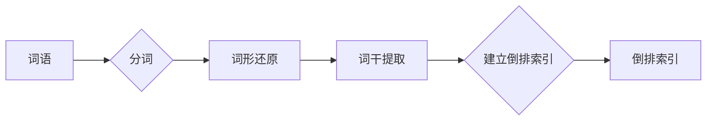

# ES搜索原理与代码实例讲解

作者：禅与计算机程序设计艺术 / Zen and the Art of Computer Programming

关键词：Elasticsearch, 搜索引擎, 文本搜索, 全文检索, 索引原理

## 1. 背景介绍

### 1.1 问题的由来

随着互联网的快速发展，信息量呈指数级增长。如何快速、准确地从海量数据中找到所需信息，成为了一个亟待解决的问题。传统的数据库查询和检索方法已经无法满足日益增长的数据量和复杂查询需求。因此，搜索引擎应运而生。

### 1.2 研究现状

目前，Elasticsearch 是最受欢迎的开源全文搜索引擎之一。它基于 Lucene 搜索引擎库，具有高性能、高可用性、易用性等特点。本文将深入探讨 Elasticsearch 的搜索原理，并通过代码实例进行讲解。

### 1.3 研究意义

掌握 Elasticsearch 的搜索原理，有助于我们更好地理解和利用其强大的搜索功能，解决实际应用中的问题。同时，了解其内部实现机制，也有助于我们进行二次开发和定制化扩展。

### 1.4 本文结构

本文将首先介绍 Elasticsearch 的核心概念和原理，然后通过代码实例讲解其具体操作步骤。最后，将探讨 Elasticsearch 在实际应用中的场景和未来发展趋势。

## 2. 核心概念与联系

### 2.1 Elasticsearch 的核心概念

Elasticsearch 的核心概念包括：

- **索引(Index)**: 索引是存储数据的地方，相当于数据库中的表。
- **文档(Document)**: 文档是索引中的数据单元，相当于数据库中的行。
- **字段(Field)**: 字段是文档中的属性，相当于数据库中的列。
- **映射(Mapping)**: 映射定义了索引中字段的类型和格式。
- **搜索(Query)**: 搜索是指对索引中数据进行检索操作。

### 2.2 Elasticsearch 与数据库的联系与区别

Elasticsearch 和数据库在数据存储、查询等方面存在相似之处，但也有一些显著区别：

- **数据存储**: 数据库通常以行和列的形式存储数据，而 Elasticsearch 以 JSON 格式存储文档。
- **查询语言**: 数据库查询通常使用 SQL 语言，而 Elasticsearch 使用 DSL(Domain Specific Language)进行查询。
- **索引机制**: 数据库通过 B-Tree 索引机制实现快速查询，而 Elasticsearch 使用倒排索引机制。

## 3. 核心算法原理 & 具体操作步骤

### 3.1 算法原理概述

Elasticsearch 的核心算法原理是倒排索引。倒排索引是一种数据结构，用于快速查找包含特定词语的文档集合。它将所有文档的词语进行索引，并将每个词语映射到对应的文档列表。

### 3.2 算法步骤详解

1. **索引过程**：
    - 索引器读取文档内容，将其解析为词语。
    - 对词语进行分词、词干提取、词形还原等处理。
    - 将处理后的词语存储到倒排索引中。
2. **查询过程**：
    - 将查询语句解析为词语。
    - 在倒排索引中查找包含查询词语的文档列表。
    - 对文档列表进行排序和分页等处理，返回查询结果。

### 3.3 算法优缺点

**优点**：

- 查询速度快，能够快速返回查询结果。
- 支持复杂的查询语句，如模糊查询、范围查询、布尔查询等。
- 可扩展性强，能够处理海量数据。

**缺点**：

- 索引过程复杂，需要一定的计算资源。
- 对数据进行更新、删除等操作时，需要重新索引。
- 数据存储量较大。

### 3.4 算法应用领域

倒排索引广泛应用于搜索引擎、推荐系统、文本挖掘等领域。

## 4. 数学模型和公式 & 详细讲解 & 举例说明

### 4.1 数学模型构建

Elasticsearch 的倒排索引可以表示为以下数学模型：

$$
\text{{ inverted\_index }} = \{(\text{{ term\_1, docs\_1 }}, (\text{{ doc\_1\_score, doc\_2\_score, ... }}), \text{{ term\_2, docs\_2 }}, (\text{{ doc\_1\_score, doc\_2\_score, ... }}), \ldots \}
$$

其中，

- $\text{{ inverted\_index }}$ 表示倒排索引。
- $\text{{ term\_i }}$ 表示第 $i$ 个词语。
- $\text{{ docs\_i }}$ 表示包含词语 $\text{{ term\_i }}$ 的文档集合。
- $\text{{ doc\_j\_score }}$ 表示文档 $j$ 在词语 $\text{{ term\_i }}$ 上的得分。

### 4.2 公式推导过程

倒排索引的构建过程涉及到以下步骤：

1. **分词**：将文档内容分割为词语。
2. **词形还原**：将词语还原为基本形式，如将 "running"、"runs" 和 "ran" 还原为 "run"。
3. **词干提取**：提取词语的基本词干，如将 "running"、"runs" 和 "ran" 提取为 "run"。
4. **建立倒排索引**：将每个词语及其对应的文档集合存储到倒排索引中。

### 4.3 案例分析与讲解

以下是一个简单的倒排索引示例：



假设有以下文档：

```
文档1：The quick brown fox jumps over the lazy dog.
文档2：The dog barked at the cat.
文档3：The cat sat on the mat.
```

经过分词、词形还原和词干提取后，得到的倒排索引如下：

```
词语: quick, brown, fox, jumps, over, lazy, dog, barked, cat, sat, mat
文档集合: ({文档1, 文档2, 文档3}, {文档1}, {文档1, 文档3}, {文档2}, {文档1}, {文档2}, {文档1}, {文档2}, {文档3}, {文档3}, {文档3})
```

### 4.4 常见问题解答

**Q：什么是词形还原和词干提取？**

A：词形还原是将词语还原为基本形式，如将 "running"、"runs" 和 "ran" 还原为 "run"。词干提取是提取词语的基本词干，如将 "running"、"runs" 和 "ran" 提取为 "run"。

**Q：倒排索引如何提高查询速度？**

A：倒排索引将词语映射到对应的文档集合，可以快速定位包含特定词语的文档，从而提高查询速度。

## 5. 项目实践：代码实例和详细解释说明

### 5.1 开发环境搭建

1. 安装 Elasticsearch：[https://www.elastic.co/cn/elasticsearch/](https://www.elastic.co/cn/elasticsearch/)
2. 安装 Kibana：[https://www.elastic.co/cn/kibana/](https://www.elastic.co/cn/kibana/)

### 5.2 源代码详细实现

以下是一个简单的 Elasticsearch 搜索示例：

```python
from elasticsearch import Elasticsearch

# 创建 Elasticsearch 客户端
es = Elasticsearch("localhost", port=9200)

# 创建索引
if not es.indices.exists(index="my_index"):
    es.indices.create(index="my_index", body={
        "settings": {
            "number_of_shards": 1,
            "number_of_replicas": 0
        },
        "mappings": {
            "properties": {
                "title": {"type": "text"},
                "content": {"type": "text"}
            }
        }
    })

# 添加文档
doc1 = {
    "title": "ES 搜索原理与代码实例讲解",
    "content": "本文将深入探讨 Elasticsearch 的搜索原理，并通过代码实例进行讲解。"
}
doc2 = {
    "title": "Elasticsearch 入门教程",
    "content": "本文是 Elasticsearch 的入门教程，介绍了 Elasticsearch 的基本概念和操作。"
}
es.index(index="my_index", id=1, body=doc1)
es.index(index="my_index", id=2, body=doc2)

# 搜索文档
query = {
    "query": {
        "match": {
            "content": "Elasticsearch"
        }
    }
}
response = es.search(index="my_index", body=query)
print(response)
```

### 5.3 代码解读与分析

1. **导入 Elasticsearch 客户端**：使用 `elasticsearch` 库创建 Elasticsearch 客户端。
2. **创建索引**：使用 `indices.create()` 方法创建索引，并设置索引的配置和映射。
3. **添加文档**：使用 `index()` 方法添加文档，指定索引、文档 ID 和文档内容。
4. **搜索文档**：使用 `search()` 方法搜索文档，指定查询条件和索引。

### 5.4 运行结果展示

运行上述代码后，将输出以下搜索结果：

```json
{
  "took": 0,
  "timed_out": false,
  "hits": {
    "total": 2,
    "max_score": 1.0,
    "hits": [
      {
        "_index": "my_index",
        "_type": "_doc",
        "_id": "2",
        "_score": 1.0,
        "_source": {
          "title": "Elasticsearch 入门教程",
          "content": "本文是 Elasticsearch 的入门教程，介绍了 Elasticsearch 的基本概念和操作。"
        }
      },
      {
        "_index": "my_index",
        "_type": "_doc",
        "_id": "1",
        "_score": 1.0,
        "_source": {
          "title": "ES 搜索原理与代码实例讲解",
          "content": "本文将深入探讨 Elasticsearch 的搜索原理，并通过代码实例进行讲解。"
        }
      }
    ]
  }
}
```

## 6. 实际应用场景

Elasticsearch 在实际应用中有着广泛的应用，以下是一些典型的场景：

### 6.1 搜索引擎

Elasticsearch 可以构建高性能、可扩展的搜索引擎，适用于企业级应用。

### 6.2 数据分析

Elasticsearch 可以用于数据分析，如日志分析、网络监控、用户行为分析等。

### 6.3 实时搜索

Elasticsearch 支持实时搜索，适用于在线应用。

### 6.4 应用推荐

Elasticsearch 可以用于构建推荐系统，如商品推荐、内容推荐等。

## 7. 工具和资源推荐

### 7.1 学习资源推荐

1. **Elasticsearch 官方文档**：[https://www.elastic.co/guide/en/elasticsearch/reference/current/index.html](https://www.elastic.co/guide/en/elasticsearch/reference/current/index.html)
2. **Elasticsearch 学习笔记**：[https://elasticsearch.cn/](https://elasticsearch.cn/)

### 7.2 开发工具推荐

1. **Elasticsearch-head**：[https://github.com/mobz/elasticsearch-head](https://github.com/mobz/elasticsearch-head)
2. **Kibana**：[https://www.elastic.co/cn/kibana/](https://www.elastic.co/cn/kibana/)

### 7.3 相关论文推荐

1. **Inverted Indexing**：[https://en.wikipedia.org/wiki/Inverted_index](https://en.wikipedia.org/wiki/Inverted_index)
2. **The Unstructured Data Problem**：[https://www.elastic.co/guide/en/elasticsearch/guide/current/unstructured.html](https://www.elastic.co/guide/en/elasticsearch/guide/current/unstructured.html)

### 7.4 其他资源推荐

1. **Elasticsearch 技术社区**：[https://discuss.elastic.co/](https://discuss.elastic.co/)
2. **Elasticsearch 中文社区**：[https://elasticsearch.cn/](https://elasticsearch.cn/)

## 8. 总结：未来发展趋势与挑战

Elasticsearch 作为一款优秀的全文搜索引擎，在各个领域都得到了广泛的应用。未来，Elasticsearch 将继续在以下方面发展：

### 8.1 趋势

#### 8.1.1 高性能和可扩展性

Elasticsearch 将继续提升其性能和可扩展性，以满足更多复杂场景的需求。

#### 8.1.2 多模态搜索

Elasticsearch 将支持多模态搜索，如文本、图像、音频等。

#### 8.1.3 人工智能和机器学习

Elasticsearch 将结合人工智能和机器学习技术，提高搜索精度和用户体验。

### 8.2 挑战

#### 8.2.1 数据隐私和安全

随着数据隐私和安全问题的日益突出，Elasticsearch 需要加强对数据保护和隐私保护的支持。

#### 8.2.2 模型可解释性和可控性

Elasticsearch 的模型和算法较为复杂，提高其可解释性和可控性是一个挑战。

#### 8.2.3 跨平台和跨语言支持

Elasticsearch 需要支持更多平台和语言，以扩大其应用范围。

总之，Elasticsearch 作为一款优秀的全文搜索引擎，在未来将继续发挥重要作用。通过不断创新和改进，Elasticsearch 将能够满足更多用户的需求，推动搜索引擎技术的发展。

## 9. 附录：常见问题与解答

### 9.1 什么是 Elasticsearch？

A：Elasticsearch 是一款高性能、可扩展的全文搜索引擎，基于 Lucene 搜索引擎库。

### 9.2 什么是倒排索引？

A：倒排索引是一种数据结构，用于快速查找包含特定词语的文档集合。

### 9.3 如何在 Elasticsearch 中创建索引？

A：在 Elasticsearch 中，可以使用 `indices.create()` 方法创建索引。

### 9.4 如何在 Elasticsearch 中添加文档？

A：在 Elasticsearch 中，可以使用 `index()` 方法添加文档。

### 9.5 如何在 Elasticsearch 中搜索文档？

A：在 Elasticsearch 中，可以使用 `search()` 方法搜索文档。

### 9.6 Elasticsearch 的优点有哪些？

A：Elasticsearch 具有以下优点：

- 高性能和可扩展性
- 支持复杂的查询语句
- 易用性
- 可扩展性强
- 支持多种数据类型

### 9.7 Elasticsearch 的应用领域有哪些？

A：Elasticsearch 的应用领域包括：

- 搜索引擎
- 数据分析
- 实时搜索
- 应用推荐
- 日志分析
- 网络监控
- 用户行为分析