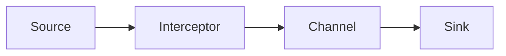

# Flume Interceptor原理与代码实例讲解

作者：禅与计算机程序设计艺术 / Zen and the Art of Computer Programming

关键词：Flume、Interceptor、数据采集、实时处理、可扩展、可靠、容错

## 1. 背景介绍

### 1.1 问题的由来

在大数据时代，数据采集和实时处理是一个巨大的挑战。企业需要从各种异构数据源收集海量数据，并对其进行实时处理和分析，以获得有价值的洞察力。然而，传统的数据采集方式难以应对如此庞大的数据量和复杂的数据处理需求。

### 1.2 研究现状

目前，已经有许多优秀的数据采集和处理框架，如Flume、Kafka、Storm等。其中，Flume以其灵活性、可靠性和可扩展性而备受青睐。Flume提供了一个分布式、可靠、高可用的服务，用于有效地收集、聚合和移动大量日志数据。

### 1.3 研究意义

深入研究Flume的核心组件Interceptor，对于理解和掌握Flume的工作原理、提高数据采集和处理效率具有重要意义。通过学习Interceptor的原理和实现，我们可以更好地利用Flume满足不同场景下的数据采集需求，并对数据进行个性化处理。

### 1.4 本文结构

本文将围绕Flume Interceptor展开，首先介绍Flume和Interceptor的核心概念，然后深入探讨Interceptor的工作原理和算法实现。接着，我们将通过数学模型和代码实例来详细说明Interceptor的使用方法。最后，总结Interceptor的应用场景和未来发展趋势。

## 2. 核心概念与联系

在深入探讨Interceptor之前，我们需要了解Flume的整体架构和几个核心概念：

- Event：Flume数据传输的基本单元，包含headers和body两部分。
- Source：数据收集组件，用于接收传入的数据。
- Channel：中转存储组件，用于临时存储传输中的数据。 
- Sink：数据发送组件，用于将事件传递到下一个Flume Agent或最终目标。
- Agent：一个独立的Flume进程，包含Source、Channel和Sink三个组件。

而Interceptor，则是在Source和Channel之间的一层处理组件。它可以对进入Channel的Event进行拦截和处理，实现数据的过滤、转换和增强等功能。

下图展示了Flume Agent的整体架构，以及Interceptor在其中的位置：



## 3. 核心算法原理 & 具体操作步骤

### 3.1 算法原理概述

Interceptor的核心原理是"拦截-处理-转发"。当Event从Source进入Channel时，会先经过Interceptor链。每个Interceptor可以对Event执行特定的操作，如过滤、转换、添加信息等。处理完成后，Event被传递给下一个Interceptor，直到整个链处理完毕，最终进入Channel。

### 3.2 算法步骤详解

1. Event从Source进入Interceptor链。
2. 链中的第一个Interceptor对Event进行处理。
   - 判断Event是否满足过滤条件，若不满足则丢弃，终止处理。
   - 对Event的内容进行转换或增强。
   - 将处理后的Event传递给下一个Interceptor。
3. 重复步骤2，直到Event被所有Interceptor处理完毕。
4. 将最终的Event放入Channel，等待Sink消费。

可以看出，Interceptor链采用了责任链模式，每个Interceptor只负责自己的处理逻辑，通过链式调用完成整个处理过程。

### 3.3 算法优缺点

优点：
- 解耦数据采集和处理逻辑，提高了灵活性和可维护性。
- 可以方便地添加、删除和修改Interceptor，满足不同的需求。
- 支持多个Interceptor协同工作，实现复杂的处理逻辑。

缺点：
- Interceptor链过长会影响数据传输的性能。
- 配置和管理Interceptor链相对复杂。

### 3.4 算法应用领域

Interceptor广泛应用于各种数据采集和处理场景，如日志采集、数据过滤、数据脱敏、数据增强等。通过定制Interceptor可以实现个性化的数据处理需求。

## 4. 数学模型和公式 & 详细讲解 & 举例说明

### 4.1 数学模型构建

我们可以使用集合论来描述Interceptor的数学模型。假设有一个Event集合 $E$，每个Interceptor可以看作是一个函数 $f_i$，它将Event集合映射到另一个Event集合：

$$f_i: E \rightarrow E$$

多个Interceptor链式调用，相当于函数的复合：

$$F = f_n \circ f_{n-1} \circ ... \circ f_2 \circ f_1$$

其中， $F$ 表示整个Interceptor链的处理效果。

### 4.2 公式推导过程

对于任意一个Event $e \in E$，经过Interceptor链处理后得到的结果为：

$$F(e) = f_n(...f_2(f_1(e))...)$$

如果某个Interceptor判断Event不满足条件，就相当于函数返回了空集 $\emptyset$，表示该Event被丢弃。

### 4.3 案例分析与讲解

举个例子，假设有一个日志采集场景，我们需要过滤掉某些不重要的日志，并对剩余日志添加时间戳和主机名。可以定义以下两个Interceptor：

- LogFilterInterceptor: 
$$f_1(e) = \begin{cases} 
e, & \text{if } e \text{ satisfies filter criteria} \
\emptyset, & \text{otherwise}
\end{cases}$$

- LogEnhancerInterceptor:
$$f_2(e) = \begin{cases}
e \cup \{timestamp, hostname\}, & \text{if } e \neq \emptyset \
\emptyset, & \text{if } e = \emptyset
\end{cases}$$

将它们组合成一个Interceptor链：

$$F = f_2 \circ f_1$$

对于任意一条日志 $e$，经过该Interceptor链处理后，要么被过滤掉（$F(e) = \emptyset$），要么被添加时间戳和主机名（$F(e) = e \cup \{timestamp, hostname\}$）。

### 4.4 常见问题解答

- 问：Interceptor的处理顺序是否可以调整？
  答：可以，Interceptor的处理顺序取决于它们在链中的位置，可以通过配置文件来调整顺序。

- 问：如果某个Interceptor抛出异常会怎样？
  答：如果Interceptor抛出异常，该Event将被丢弃，不会进入Channel。可以通过配置Flume的异常处理策略来定义异常情况下的行为。

## 5. 项目实践：代码实例和详细解释说明

### 5.1 开发环境搭建

要开发Flume Interceptor，需要准备以下开发环境：

- JDK 1.8+
- Maven 3.x
- Flume 1.9.0
- IDE (如Eclipse、IntelliJ IDEA)

### 5.2 源代码详细实现

下面是一个简单的Interceptor示例，实现了对Event body的过滤功能：

```java
public class EventFilterInterceptor implements Interceptor {
    
    private String excludePattern;
    
    @Override
    public void initialize() {
        // 从配置文件中读取过滤正则表达式
        excludePattern = Context.getString("exclude.pattern");
    }
    
    @Override
    public Event intercept(Event event) {
        // 获取Event的body
        String body = new String(event.getBody(), Charsets.UTF_8);
        
        // 判断body是否匹配过滤条件
        if (body.matches(excludePattern)) {
            // 如果匹配，返回null表示丢弃该Event
            return null;
        } else {
            // 否则返回原始Event
            return event;
        }
    }
    
    @Override
    public List<Event> intercept(List<Event> events) {
        List<Event> intercepted = new ArrayList<>();
        for (Event event : events) {
            Event interceptedEvent = intercept(event);
            if (interceptedEvent != null) {
                intercepted.add(interceptedEvent);
            }
        }
        return intercepted;
    }
    
    @Override
    public void close() {
        // 清理资源
    }
    
}
```

### 5.3 代码解读与分析

- initialize()方法：在Interceptor初始化时调用，用于读取配置参数。这里从配置文件中读取了一个正则表达式字符串excludePattern，用于过滤Event。
- intercept(Event event)方法：处理单个Event，判断其body是否匹配过滤条件，如果匹配则返回null表示丢弃，否则返回原始Event。
- intercept(List<Event> events)方法：批量处理Event列表，对每个Event调用intercept(Event event)方法，将未被丢弃的Event添加到结果列表中返回。
- close()方法：在Interceptor关闭时调用，用于清理资源。这里没有需要清理的资源，所以方法为空。

### 5.4 运行结果展示

在Flume的配置文件中，可以这样使用上述Interceptor：

```properties
agent.sources.src1.interceptors = filter
agent.sources.src1.interceptors.filter.type = com.example.EventFilterInterceptor
agent.sources.src1.interceptors.filter.exclude.pattern = ^.*error.*$
```

这个配置表示，为名为src1的Source添加了一个类型为EventFilterInterceptor的Interceptor，并将其命名为filter。通过exclude.pattern参数指定了过滤条件，这里表示过滤掉body中包含error的Event。

当Flume启动后，所有流经src1的Event都会被EventFilterInterceptor处理。如果Event的body包含error，就会被丢弃；否则将继续传递给Channel。

## 6. 实际应用场景

Flume Interceptor可以应用于各种数据采集和处理场景，如：

- 日志采集：过滤掉不重要的日志，降低数据量。
- 数据脱敏：对敏感字段进行掩码或加密处理，保护隐私。
- 数据富集：为Event添加时间戳、主机名、IP地址等元数据，方便后续分析。
- 数据分流：根据Event的特征将其路由到不同的Channel，实现数据的分类。

### 6.4 未来应用展望

随着大数据技术的发展，Flume Interceptor有望在更多领域发挥作用，如物联网数据采集、实时日志分析、流式数据处理等。结合机器学习和人工智能技术，Interceptor可以实现更加智能化的数据过滤和增强功能。

## 7. 工具和资源推荐

### 7.1 学习资源推荐
- 官方文档：Flume User Guide
- 书籍：《Hadoop: The Definitive Guide》
- 在线课程：Udemy上的"Apache Flume for BigData"

### 7.2 开发工具推荐
- IntelliJ IDEA
- Eclipse
- Maven

### 7.3 相关论文推荐
- 《Flume: A Reliable, Scalable, and Distributed Log Collection System》
- 《Efficient and Reliable Log Collection with Apache Flume》

### 7.4 其他资源推荐
- Flume官方网站：http://flume.apache.org/
- Flume Github仓库：https://github.com/apache/flume
- Flume邮件列表：dev@flume.apache.org

## 8. 总结：未来发展趋势与挑战

### 8.1 研究成果总结

本文深入探讨了Flume Interceptor的原理和实现，通过数学模型和代码实例详细说明了其工作方式。Interceptor以拦截-处理-转发的流程对Event进行个性化处理，可以方便地实现数据过滤、转换、增强等功能，极大地提高了Flume的灵活性和可扩展性。

### 8.2 未来发展趋势

未来，Flume Interceptor将向着更加智能化、轻量化的方向发展。

一方面，机器学习和人工智能技术的引入，可以让Interceptor具备自适应和自学习能力，根据数据特征自动优化处理逻辑，提高数据处理的效率和准确性。

另一方面，为了应对IoT等场景下的海量数据，Interceptor需要变得更加轻量化，降低资源占用，提高处理性能。

### 8.3 面临的挑战

智能化和轻量化带来的高效处理，同时也对Interceptor的设计和实现提出了新的挑战：

- 智能算法的选择和调优
- 轻量级框架的设计和优化
- 海量数据下的高可用性保证
- 与其他大数