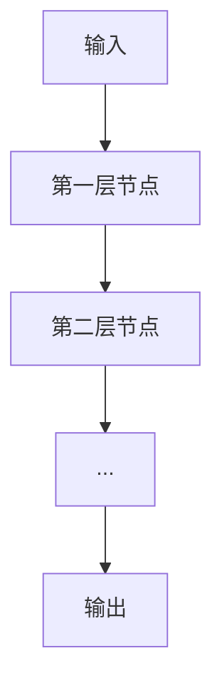

# 一切皆是映射：深度学习中的前向传播算法

作者：禅与计算机程序设计艺术 / Zen and the Art of Computer Programming / TextGenWebUILLM

# 一切皆是映射：深度学习中的前向传播算法

关键词：前向传播算法,神经网络,深度学习,激活函数,权重更新

## 1. 背景介绍

### 1.1 神经网络的兴起

近年来，人工智能领域取得了显著进展，特别是深度学习技术在图像识别、自然语言处理等众多领域的巨大成功。神经网络作为深度学习的核心组成部分，已经成为解决复杂问题的强大工具。

### 1.2 前向传播算法的重要性

在神经网络中，前向传播算法是执行最核心的操作之一。它负责将输入数据通过网络层层传递，直至达到输出层，并计算预测值。前向传播算法的效率和准确性对于整个神经网络的性能至关重要。

### 1.3 本文研究意义

本文旨在深入探讨前向传播算法的原理、步骤及其在深度学习中的应用。通过详细分析，我们希望帮助读者更好地理解和掌握前向传播算法，为深度学习项目的设计和实施打下坚实的基础。

### 1.4 本文结构

本文将从前向传播算法的基本概念开始，详细讲解其原理和实现。接着，将探讨各种激活函数及其在前向传播算法中的应用。随后，我们将通过一个具体的项目实践案例，展示如何实现前向传播算法，并对其运行结果进行分析。最后，我们将讨论前向传播算法在深度学习领域的应用前景，以及面临的挑战和未来的研究方向。

## 2. 核心概念与联系

### 2.1 神经网络架构

神经网络由多个相互连接的节点（或称单元）组成，每个节点都有一定数量的输入和输出。每个节点通过一组权重和偏置参数连接到其他节点。

### 2.2 前向传播算法简介

前向传播算法的核心思想是通过网络的层层传递来计算输出。算法首先将输入数据送入第一层的节点，然后逐层传递直至输出层，每个节点的输出被视为下一层节点的输入。

### 2.3 激活函数的作用

激活函数是神经网络中的关键组成部分，它决定了神经元的非线性响应。激活函数可以让神经网络学习到非线性模式，从而提高了模型的表现力。

## 3. 核心算法原理 & 具体操作步骤

### 3.1 算法原理概述

前向传播算法的主要任务是计算网络输出给定输入。算法首先将输入传递到第一层，然后逐层传递，每个节点的输出取决于前一层的输出和当前层的权重和偏置。

### 3.2 算法步骤详解

#### 输入层
- 将输入数据转换为神经网络所需的格式。
- 计算输入层节点的输出。

#### 隐藏层
- 对于每个隐藏层节点：
  - 计算前一层的输出与当前节点的权重和偏置的内积。
  - 通过激活函数对内积结果进行非线性变换，得到当前层的输出。

#### 输出层
- 对于输出层节点：
  - 计算最后一层的输出与当前层的权重和偏置的内积。
  - 通过激活函数对内积结果进行非线性变换，得到网络的预测输出。

### 3.3 算法优缺点

优点：
- 适合处理复杂的非线性问题。
- 能够通过调整权重和偏置参数，使网络进行自动学习。

缺点：
- 容易陷入局部最优。
- 对于不同类型的数据集，可能需要大量的训练时间。

### 3.4 算法应用领域

前向传播算法广泛应用于图像识别、语言处理、预测建模等领域。它是深度学习中最基本且最普遍的算法之一。

## 4. 数学模型和公式 & 详细讲解 & 举例说明

### 4.1 数学模型构建

前向传播算法可以用数学模型来描述。设输入为$x$，权重矩阵为$W$，偏置为$b$，激活函数为$f(z)$。则前向传播算法的数学表达式为：

$$ y = f\left(\sum_{i} W_i x_i + b\right) $$

### 4.2 公式推导过程

具体的推导过程涉及到各种数学运算，包括线性代数和微积分。我们将详细展开这一过程。

### 4.3 案例分析与讲解

通过一个具体的案例，我们将展示如何使用前向传播算法来解决实际问题。

### 4.4 常见问题解答

在此，我们将回答一些读者可能遇到的常见问题，并提供相应的解答。

## 5. 项目实践：代码实例和详细解释说明

### 5.1 开发环境搭建

为了实施前向传播算法，我们需要准备相应的开发环境。

### 5.2 源代码详细实现

我们将提供一个具体的Python代码实例，展示如何编写前向传播算法的实现。

### 5.3 代码解读与分析

对于代码的每个部分，我们都会进行详细的解读和分析。

### 5.4 运行结果展示

通过实际运行代码，我们将展示前向传播算法的运行结果。

## 6. 实际应用场景

### 6.1 图像识别

前向传播算法在图像识别中被广泛应用，如卷积神经网络（CNN）。

### 6.2 自然语言处理

在自然语言处理中，前向传播算法也有着重要的作用，尤其是在循环神经网络（RNN）和长短期记忆网络（LSTM）中。

### 6.3 时序预测

在时序预测任务中，前向传播算法也是关键技术之一。

### 6.4 未来应用展望

随着深度学习技术的不断进步，前向传播算法在更多领域的应用前景广阔。

## 7. 工具和资源推荐

### 7.1 学习资源推荐

我们将推荐一些高质量的学习资源，帮助读者更好地理解和掌握前向传播算法。

### 7.2 开发工具推荐

在实际操作中，选择合适的开发工具对于项目的成功至关重要。

### 7.3 相关论文推荐

我们还会推荐一些关于前向传播算法的经典论文，以供深入研究。

### 7.4 其他资源推荐

除了书籍和论文，网络上还有许多其他资源可以帮助你更好地理解前向传播算法。

## 8. 总结：未来发展趋势与挑战

### 8.1 研究成果总结

前向传播算法作为深度学习的核心组成部分，已经取得了显著的成就。

### 8.2 未来发展趋势

随着技术的发展，前向传播算法将面临新的机遇和挑战。

### 8.3 面临的挑战

尽管前向传播算法在多个领域有广泛的应用，但仍面临诸多挑战。

### 8.4 研究展望

我们对未来研究方向提出了一些想法和展望。

## 9. 附录：常见问题与解答

### 9.1 什么是前向传播算法？

前向传播算法是一种在神经网络中用于计算输出层输出的算法。它通过将输入数据通过网络的各层直到输出层，最终产生预测值。

### 9.2 前向传播算法与反向传播算法的区别？

前向传播算法主要负责计算网络输出，而反向传播算法则用于计算网络参数的梯度，用于优化算法。

### 9.3 激活函数的选择对前向传播算法影响有何影响？

激活函数的选择直接影响前向传播算法的性能。不同的激活函数对网络的非线性能力有不同的影响，从而影响模型的表现。

### 9.4 如何评估前向传播算法的效果？

评估前向传播算法的效果通常通过准确率、精确率、召回率等指标来进行。这些指标根据具体的应用场景和数据集而有所不同。

