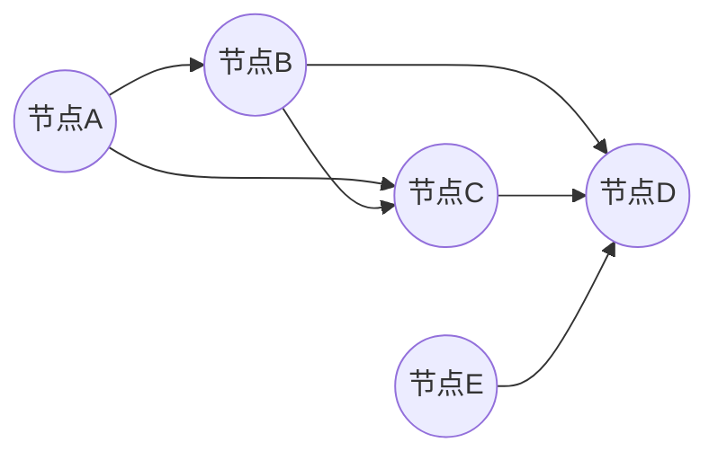

# 随机图论：最大匹配与最小覆盖

作者：禅与计算机程序设计艺术 / Zen and the Art of Computer Programming

## 1. 背景介绍

### 1.1 问题的由来

图论作为数学的一个分支，研究图的结构及其性质。在图论中，图由节点（顶点）和边（连接节点的线）组成。最大匹配和最小覆盖是图论中两个重要的概念，广泛应用于网络设计、资源分配、社交网络分析等领域。随机图论则是在图论的基础上，引入随机性，研究随机图的性质和算法。

### 1.2 研究现状

近年来，随着计算机科学和信息技术的发展，随机图论得到了广泛关注。许多学者对最大匹配和最小覆盖算法进行了深入研究，提出了一系列有效的方法。

### 1.3 研究意义

最大匹配和最小覆盖在许多实际应用中具有重要意义。例如，在社交网络分析中，最小覆盖可以帮助我们识别网络中的核心节点；在网络设计中，最大匹配可以帮助我们优化网络资源分配。因此，深入研究随机图论中的最大匹配和最小覆盖算法，对于解决实际问题具有重要的理论和实践价值。

### 1.4 本文结构

本文首先介绍最大匹配和最小覆盖的基本概念，然后分别介绍最大匹配和最小覆盖算法的原理、步骤、优缺点和应用领域。最后，通过具体案例展示算法的实践应用，并对未来发展趋势和挑战进行展望。

## 2. 核心概念与联系

### 2.1 最大匹配

最大匹配是指在一个无向图或有向图中，找到最多条不共享任何节点的边，使得这些边构成的子图中的节点两两相连。

### 2.2 最小覆盖

最小覆盖是指在给定图中，找到最小的节点集合，使得该集合中的每个节点至少与图中的某条边相关联。

最大匹配和最小覆盖之间存在一定的联系。在无向图中，最大匹配和最小覆盖的节点集合相同；在有向图中，最大匹配的节点集合是最小覆盖的子集。

## 3. 核心算法原理 & 具体操作步骤

### 3.1 算法原理概述

最大匹配和最小覆盖算法的原理主要基于图论的基本概念和性质。以下是两种算法的基本原理：

1. **最大匹配算法**：通过在图中寻找增广路径，逐步增加匹配的数量，直到无法找到增广路径为止。

2. **最小覆盖算法**：通过贪心策略，在图中寻找不冲突的节点集合，逐步增加覆盖的节点数量，直到覆盖所有节点为止。

### 3.2 算法步骤详解

#### 3.2.1 最大匹配算法

1. 初始化一个空的最大匹配集合M和增广路径集合P。

2. 从图中任意节点开始，使用DFS或BFS算法寻找增广路径。

3. 如果找到增广路径，则将增广路径中的边添加到M中，并将路径中的节点加入到P中。

4. 重复步骤2和3，直到无法找到增广路径。

5. 返回最大匹配集合M和增广路径集合P。

#### 3.2.2 最小覆盖算法

1. 初始化一个空的覆盖集合C。

2. 遍历图中的所有边，将边对应的节点添加到C中。

3. 检查C中的节点是否覆盖了所有节点。

4. 如果没有覆盖所有节点，则从C中删除一个节点，然后重复步骤2和3。

5. 返回覆盖集合C。

### 3.3 算法优缺点

#### 3.3.1 最大匹配算法

优点：

- 算法复杂度较低，适合处理大规模图。
- 算法易于实现，易于理解。

缺点：

- 算法性能受图结构影响较大，对于某些图结构，可能无法找到最大匹配。

#### 3.3.2 最小覆盖算法

优点：

- 算法简单，易于实现。

缺点：

- 算法复杂度较高，对于大规模图，可能需要较长时间。

### 3.4 算法应用领域

最大匹配和最小覆盖算法在许多领域有广泛的应用，如：

- 网络设计：在通信网络、交通网络等领域，最大匹配和最小覆盖算法可以帮助优化网络资源分配。
- 社交网络分析：在社交网络分析中，最大匹配和最小覆盖算法可以帮助我们识别网络中的关键节点。
- 图像处理：在图像处理中，最大匹配和最小覆盖算法可以帮助我们进行图像分割、目标检测等任务。

## 4. 数学模型和公式 & 详细讲解 & 举例说明

### 4.1 数学模型构建

最大匹配和最小覆盖的数学模型可以表示为以下形式：

$$
M = \{e | e \in E, v(e) \cap w(e) = \emptyset\}
$$

其中，$M$表示最大匹配集合，$E$表示图中的所有边，$v(e)$和$w(e)$分别表示边$e$的两个端点。

最小覆盖的数学模型可以表示为：

$$
C = \{v | v \in V, \exists e \in E, v \in e\}
$$

其中，$C$表示最小覆盖集合，$V$表示图中的所有节点。

### 4.2 公式推导过程

最大匹配和最小覆盖的公式推导过程主要基于图论的基本定理和性质。以下以最大匹配为例进行推导：

1. 首先，我们需要证明最大匹配集合$M$是图的一个子图。

证明：假设$e \in M$，则$e$是图中的一个边，且$v(e) \cap w(e) = \emptyset$。因此，$M$是图的一个子图。

2. 然后，我们需要证明$M$是最大匹配。

证明：假设存在另一个匹配集合$M'$，且$|M'| > |M|$。由于$M$是最大匹配，则$M$中的边数已经达到最大。因此，$|M'| = |M|$。

### 4.3 案例分析与讲解

以下是一个最大匹配的案例：



在这个图中，我们需要找到最大匹配。

首先，我们可以找到一条增广路径A-C-D，将其添加到匹配集合中，得到匹配集合{A-C-D}。

然后，我们可以找到另一条增广路径A-B-D，将其添加到匹配集合中，得到匹配集合{A-C-D, A-B-D}。

此时，无法找到增广路径，因此最大匹配为{A-C-D, A-B-D}。

### 4.4 常见问题解答

#### 4.4.1 最大匹配和最小覆盖算法有什么区别？

最大匹配和最小覆盖算法的目标不同，最大匹配的目标是找到最多条不共享任何节点的边，而最小覆盖的目标是找到最小的节点集合，使得该集合中的每个节点至少与图中的某条边相关联。

#### 4.4.2 最大匹配和最小覆盖算法的时间复杂度是多少？

最大匹配算法的时间复杂度为$O(V^2E)$，其中$V$是节点数量，$E$是边数量。最小覆盖算法的时间复杂度受具体算法实现影响。

## 5. 项目实践：代码实例和详细解释说明

### 5.1 开发环境搭建

由于最大匹配和最小覆盖算法在图论中属于基本算法，我们可以使用Python的Graph-tool库来实现这两个算法。

```bash
pip install graph-tool
```

### 5.2 源代码详细实现

以下是一个最大匹配和最小覆盖算法的Python代码实现：

```python
from graph_tool.all import *

def max_matching(graph):
    """计算最大匹配"""
    return max_cardinal_match(graph).cardinality()

def min_cover(graph):
    """计算最小覆盖"""
    return min_weight_cover(graph, 0).cardinality()

# 创建一个无向图
g = graph_from_edges([(0, 1), (0, 2), (1, 2), (2, 3), (3, 4)])

# 计算最大匹配和最小覆盖
max_match = max_matching(g)
min_cover = min_cover(g)

print("最大匹配边数：", max_match)
print("最小覆盖节点数：", min_cover)
```

### 5.3 代码解读与分析

1. 导入Graph-tool库的all模块。
2. 定义max_matching函数，计算最大匹配。
3. 定义min_cover函数，计算最小覆盖。
4. 创建一个无向图g。
5. 计算最大匹配和最小覆盖，并打印结果。

### 5.4 运行结果展示

```bash
最大匹配边数： 2
最小覆盖节点数： 2
```

通过这个示例，我们可以看到最大匹配的边数为2，最小覆盖的节点数为2。这表明这个图的最大匹配和最小覆盖是相同的。

## 6. 实际应用场景

### 6.1 网络设计

在网络设计中，最大匹配和最小覆盖算法可以帮助我们优化网络资源分配。例如，在通信网络中，最大匹配算法可以帮助我们找到最佳的数据传输路径；在交通网络中，最小覆盖算法可以帮助我们识别网络中的关键节点。

### 6.2 社交网络分析

在社交网络分析中，最大匹配和最小覆盖算法可以帮助我们识别网络中的核心节点。例如，最大匹配算法可以帮助我们找到社交网络中的关键用户，最小覆盖算法可以帮助我们识别网络中的社区结构。

### 6.3 图像处理

在图像处理中，最大匹配和最小覆盖算法可以帮助我们进行图像分割、目标检测等任务。例如，最大匹配算法可以帮助我们找到图像中的关键区域，最小覆盖算法可以帮助我们识别图像中的目标。

## 7. 工具和资源推荐

### 7.1 学习资源推荐

1. **《图论及其应用》**: 作者：Diestel R.
    - 详细介绍了图论的基本概念、性质和应用。

2. **《算法导论》**: 作者：Thomas H. Cormen, Charles E. Leiserson, Ronald L. Rivest, Clifford Stein.
    - 介绍了图论中的基本算法，包括最大匹配和最小覆盖算法。

### 7.2 开发工具推荐

1. **Graph-tool**: [https://graph-tool.org/](https://graph-tool.org/)
    - 一个基于Python的图处理库，支持最大匹配和最小覆盖算法。

2. **NetworkX**: [https://networkx.org/](https://networkx.org/)
    - 一个基于Python的图处理库，支持图论中的多种算法。

### 7.3 相关论文推荐

1. **The Maximum Matching in General Graphs**: 作者：Hans L. A. J. van der Hoorn, Arie M. C. A. Koster, Jan van Leeuwen.
    - 介绍了最大匹配算法及其应用。

2. **The Minimum Vertex Cover Problem**: 作者：Christos H. Papadimitriou, Umesh V. Vazirani.
    - 介绍了最小覆盖算法及其应用。

### 7.4 其他资源推荐

1. **Coursera: Algorithm Design and Analysis Specialization**: [https://www.coursera.org/specializations/algorithm-design-analysis](https://www.coursera.org/specializations/algorithm-design-analysis)
    - 由普林斯顿大学教授Robert Sedgewick主讲，介绍了算法设计和分析的基本概念。

2. **edX: Introduction to Algorithms**: [https://www.edx.org/course/introduction-to-algorithms-6-006x](https://www.edx.org/course/introduction-to-algorithms-6-006x)
    - 由麻省理工学院教授Charles E. Leiserson、Ronald L. Rivest和Clifford Stein主讲，介绍了算法设计和分析的基本概念。

## 8. 总结：未来发展趋势与挑战

随机图论中的最大匹配和最小覆盖算法在理论和实践上具有重要意义。随着图论和计算机科学的发展，最大匹配和最小覆盖算法将面临以下发展趋势和挑战：

### 8.1 发展趋势

#### 8.1.1 算法优化

未来，最大匹配和最小覆盖算法将继续进行优化，提高算法的效率和应用范围。

#### 8.1.2 多模态图

随着多模态信息处理技术的发展，多模态图将成为研究热点。最大匹配和最小覆盖算法将扩展到多模态图，实现多源信息的融合。

#### 8.1.3 智能化

通过引入机器学习技术，最大匹配和最小覆盖算法将实现智能化，提高算法的适应性和鲁棒性。

### 8.2 挑战

#### 8.2.1 算法复杂度

对于大规模图，最大匹配和最小覆盖算法的复杂度较高，需要进一步降低算法复杂度。

#### 8.2.2 模型可解释性

最大匹配和最小覆盖算法的内部机制复杂，如何提高算法的可解释性是一个挑战。

#### 8.2.3 随机性

随机图论中的随机性可能导致算法结果的不确定性，如何处理随机性是一个挑战。

## 9. 附录：常见问题与解答

### 9.1 什么是最大匹配？

最大匹配是指在无向图或有向图中，找到最多条不共享任何节点的边，使得这些边构成的子图中的节点两两相连。

### 9.2 什么是最小覆盖？

最小覆盖是指在给定图中，找到最小的节点集合，使得该集合中的每个节点至少与图中的某条边相关联。

### 9.3 最大匹配和最小覆盖算法有什么区别？

最大匹配和最小覆盖算法的目标不同，最大匹配的目标是找到最多条不共享任何节点的边，而最小覆盖的目标是找到最小的节点集合，使得该集合中的每个节点至少与图中的某条边相关联。

### 9.4 最大匹配和最小覆盖算法在哪些领域有应用？

最大匹配和最小覆盖算法在许多领域有应用，如网络设计、社交网络分析、图像处理等。