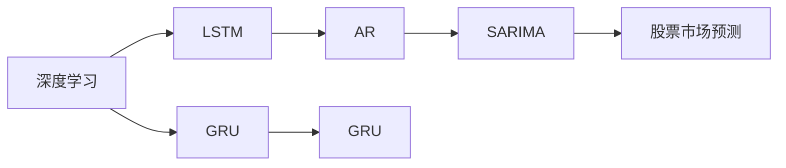
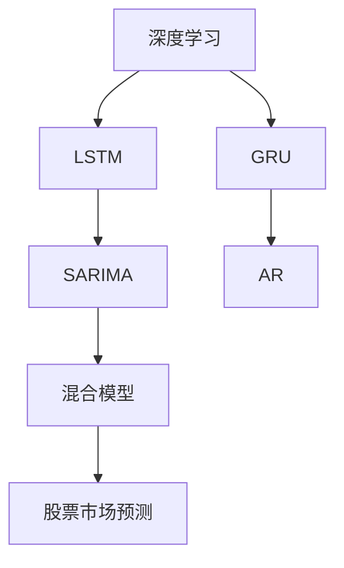
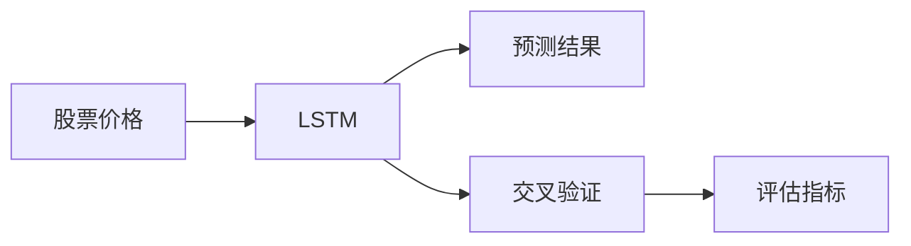
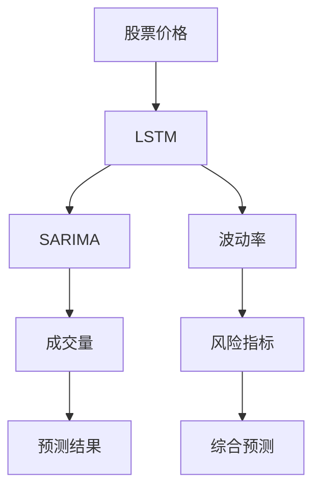
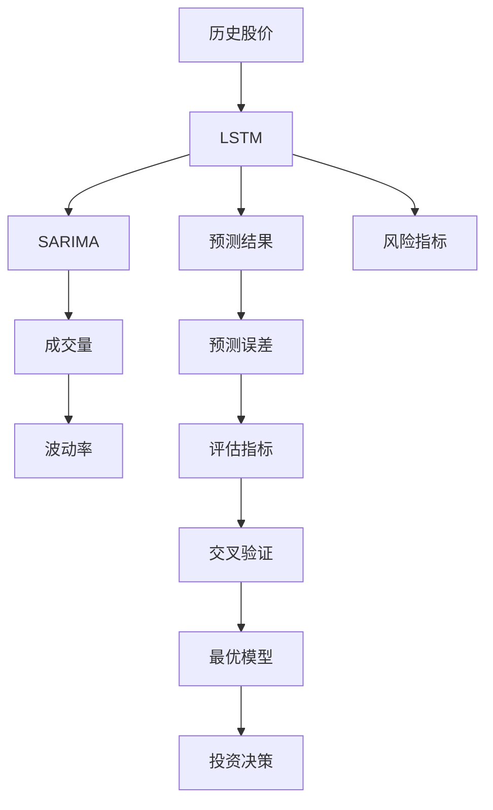

                 

# Python深度学习实践：AI在股票市场预测中的应用

> 关键词：深度学习,股票市场预测,股票价格预测,金融时间序列,Python编程

## 1. 背景介绍

### 1.1 问题由来
随着金融市场的快速发展，投资者对于股票价格预测的需求日益增加。传统的统计方法和机器学习模型已难以满足需求，深度学习技术，特别是基于神经网络的时间序列模型，逐渐成为股票市场预测领域的热门研究方向。

深度学习在金融市场预测中的主要应用场景包括股票价格预测、风险评估、市场情绪分析等。相比于传统统计模型，深度学习模型能够捕捉复杂的非线性关系和长时滞效应，提供更加准确和稳健的预测结果。

### 1.2 问题核心关键点
在股票市场预测中，基于深度学习的时间序列模型通常采用长短时记忆网络(LSTM)或门控循环单元(GRU)等序列建模方法，结合自回归模型(AR)和季节性自回归模型(SARIMA)等传统时间序列模型，构建端到端的预测系统。

核心关键点包括：
1. **数据预处理**：对原始数据进行归一化、差分等处理，以便于模型学习。
2. **模型选择**：选择合适的深度学习模型架构，如LSTM或GRU，结合AR、SARIMA等传统时间序列模型，构建混合模型。
3. **训练与评估**：使用历史数据对模型进行训练，并通过交叉验证等方法进行评估，选择合适的超参数。
4. **预测与回测**：使用训练好的模型对未来数据进行预测，并通过回测检验模型的实际效果。

### 1.3 问题研究意义
通过深度学习技术进行股票市场预测，具有以下重要意义：
1. **提高预测精度**：深度学习模型能够捕捉数据中的非线性关系和复杂模式，提高预测精度。
2. **实时更新**：深度学习模型能够实时更新权重，适应数据分布的变化，提升预测模型的时效性。
3. **多维预测**：深度学习模型可以处理多维时间序列数据，提供多指标预测结果，如股价、波动率、换手率等。
4. **自动化决策支持**：结合预测结果进行自动交易决策，提高投资决策的科学性和效率。
5. **风险管理**：通过预测风险指标，帮助投资者识别和管理投资风险。

## 2. 核心概念与联系

### 2.1 核心概念概述

为更好地理解AI在股票市场预测中的应用，本节将介绍几个密切相关的核心概念：

- **深度学习(Deep Learning)**：一种基于神经网络的学习方法，通过多层非线性变换，能够自动学习数据的特征表示。深度学习在图像识别、语音识别、自然语言处理等领域已经取得了广泛的应用。

- **股票市场预测**：利用历史数据和模型对未来股票价格进行预测，以辅助投资决策。主要关注股票价格、波动率、成交量等指标。

- **长短时记忆网络(LSTM)**：一种特殊类型的循环神经网络，能够有效地处理长序列数据，捕捉长期依赖关系。常用于时间序列预测和自然语言处理等任务。

- **门控循环单元(GRU)**：另一种循环神经网络架构，与LSTM类似，但计算效率更高。同样适用于序列数据建模。

- **自回归模型(AR)**：一种基于时间序列的自相关性建模方法，常用于时间序列预测和波动性分析。

- **季节性自回归模型(SARIMA)**：AR的扩展形式，引入季节性因素，适用于具有季节性变化的时间序列数据。

这些核心概念之间的逻辑关系可以通过以下Mermaid流程图来展示：



这个流程图展示了大规模预训练语言模型微调过程中各个核心概念之间的关系：

1. 深度学习是整个微调过程的基础。
2. LSTM和GRU是主要的序列建模方法。
3. AR和SARIMA是经典的时间序列模型，与深度学习模型结合，构建混合模型。
4. 股票市场预测是微调的应用场景，结合深度学习和时间序列模型的优势。

### 2.2 概念间的关系

这些核心概念之间存在着紧密的联系，形成了股票市场预测的完整生态系统。下面我们通过几个Mermaid流程图来展示这些概念之间的关系。

#### 2.2.1 深度学习在金融时间序列中的应用



这个流程图展示了深度学习在金融时间序列中的应用。LSTM和GRU用于序列建模，捕捉时间序列数据中的长依赖关系。AR和SARIMA用于构建传统的时间序列模型，捕捉序列的自相关性。两者结合形成混合模型，用于股票市场预测。

#### 2.2.2 LSTM在股票价格预测中的应用



这个流程图展示了LSTM在股票价格预测中的应用。LSTM对历史股价数据进行建模，并结合交叉验证等方法进行评估，选择最优模型。

#### 2.2.3 混合模型在多维预测中的应用



这个流程图展示了混合模型在多维预测中的应用。LSTM用于股票价格预测，SARIMA用于成交量预测，两者结合形成混合模型。波动率和风险指标可以通过LSTM或SARIMA单独建模，或结合两者进行预测。综合预测结果可用于投资决策。

### 2.3 核心概念的整体架构

最后，我们用一个综合的流程图来展示这些核心概念在股票市场预测中的整体架构：



这个综合流程图展示了从数据预处理到投资决策的完整流程：

1. 对历史股价数据进行预处理。
2. 使用LSTM或GRU进行序列建模。
3. 结合SARIMA模型进行多维预测。
4. 计算预测误差和评估指标。
5. 通过交叉验证选择最优模型。
6. 根据预测结果进行投资决策。

通过这些流程图，我们可以更清晰地理解AI在股票市场预测中的各个核心概念及其关系，为后续深入讨论具体的预测方法和技术奠定基础。

## 3. 核心算法原理 & 具体操作步骤
### 3.1 算法原理概述

AI在股票市场预测中，主要采用深度学习的时间序列模型，特别是长短时记忆网络(LSTM)或门控循环单元(GRU)，结合自回归模型(AR)和季节性自回归模型(SARIMA)等传统时间序列模型，构建端到端的预测系统。

形式化地，假设历史股价数据为 $X_t = (x_{t-1}, x_{t-2}, ..., x_0)$，其中 $x_t$ 为第 $t$ 天的股价。目标是对未来股价 $x_{t+1}$ 进行预测，预测公式为：

$$
\hat{x}_{t+1} = \mathop{\arg\min}_{\theta} \mathcal{L}(X_t, x_{t+1}; \theta)
$$

其中 $\theta$ 为模型参数，$\mathcal{L}$ 为损失函数。深度学习模型通过最小化损失函数 $\mathcal{L}$ 来优化模型参数，使得预测结果 $\hat{x}_{t+1}$ 逼近真实股价 $x_{t+1}$。

### 3.2 算法步骤详解

基于深度学习的时间序列预测模型通常采用以下步骤：

**Step 1: 数据预处理**
- 对原始数据进行归一化处理，如 Min-Max 归一化或 Z-score 标准化，以便于模型学习。
- 对股价数据进行差分处理，移除趋势和季节性成分，保留时间序列的自相关性。

**Step 2: 构建模型**
- 选择深度学习模型架构，如LSTM或GRU，构建序列建模部分。
- 结合自回归模型(AR)和季节性自回归模型(SARIMA)，构建混合模型。

**Step 3: 训练与评估**
- 使用历史数据对模型进行训练，通过交叉验证选择最优模型。
- 使用评估指标如均方误差(MSE)、均方根误差(RMSE)等，评估模型的预测精度。

**Step 4: 预测与回测**
- 使用训练好的模型对未来数据进行预测。
- 通过回测检验预测结果的有效性，评估模型的实际效果。

**Step 5: 模型优化**
- 根据回测结果，调整模型结构和超参数，进一步提升预测精度。
- 结合其他金融指标如波动率、成交量等，进行多指标预测。

### 3.3 算法优缺点

基于深度学习的时间序列预测模型具有以下优点：
1. 能够捕捉复杂的非线性关系和长时滞效应，提高预测精度。
2. 能够实时更新权重，适应数据分布的变化，提升预测模型的时效性。
3. 能够处理多维时间序列数据，提供多指标预测结果。
4. 可以结合其他金融指标进行预测，提高投资决策的科学性和效率。

然而，该方法也存在以下局限性：
1. 数据需求量大。深度学习模型通常需要大量的历史数据进行训练，对数据质量要求较高。
2. 模型复杂度高。深度学习模型结构复杂，需要较长的训练时间和计算资源。
3. 模型易过拟合。当数据量不足时，深度学习模型容易过拟合，泛化能力较弱。
4. 解释性不足。深度学习模型的决策过程难以解释，缺乏可解释性。

### 3.4 算法应用领域

基于深度学习的时间序列预测模型已经在股票市场预测、风险评估、市场情绪分析等多个金融领域得到广泛应用。例如：

- 股票价格预测：利用历史股价数据，对未来股价进行预测。
- 波动率预测：预测股票市场波动性，评估投资风险。
- 市场情绪分析：通过分析新闻、社交媒体等非结构化数据，预测市场情绪变化。
- 高频交易：利用预测结果进行高频交易，获取超额收益。
- 量化投资：结合多维预测结果，进行量化投资决策。

除了上述这些金融领域，深度学习时间序列预测模型还可以应用于其他领域，如能源价格预测、电力负荷预测、气象预测等，展示出强大的应用潜力。

## 4. 数学模型和公式 & 详细讲解  
### 4.1 数学模型构建

在金融时间序列预测中，深度学习模型通常采用LSTM或GRU作为序列建模部分，结合AR、SARIMA等传统时间序列模型，构建混合模型。

假设LSTM模型输入为 $X_t = (x_{t-1}, x_{t-2}, ..., x_0)$，输出为 $Y_t = (\hat{x}_{t+1}, \hat{x}_{t+2}, ..., \hat{x}_{t+T})$，其中 $T$ 为预测窗口长度。LSTM模型公式为：

$$
Y_t = \text{LSTM}(X_t; \theta)
$$

其中 $\theta$ 为模型参数，$\text{LSTM}$ 表示LSTM模型。AR模型公式为：

$$
x_{t+1} = \alpha_0 + \alpha_1 x_{t} + \varepsilon_{t+1}
$$

其中 $\varepsilon_{t+1} \sim \mathcal{N}(0, \sigma^2)$，$\sigma$ 为噪声方差。SARIMA模型公式为：

$$
\Delta^p(x_t) = \beta_0 + \sum_{i=1}^d \beta_i \Delta^i(x_{t-s_i}) + \theta_0 + \sum_{j=1}^D \theta_j \Delta^j(x_{t-s_j}) + \varepsilon_t
$$

其中 $\Delta^p$ 表示差分操作，$d$ 为AR阶数，$D$ 为MA阶数，$\Delta^i$ 表示 $i$ 阶差分操作，$\varepsilon_t \sim \mathcal{N}(0, \sigma^2)$。

### 4.2 公式推导过程

以下我们以LSTM模型在股票价格预测中的应用为例，推导模型的预测公式。

假设LSTM模型的输入为 $X_t = (x_{t-1}, x_{t-2}, ..., x_0)$，输出为 $Y_t = (\hat{x}_{t+1}, \hat{x}_{t+2}, ..., \hat{x}_{t+T})$，其中 $T$ 为预测窗口长度。LSTM模型公式为：

$$
Y_t = \text{LSTM}(X_t; \theta)
$$

其中 $\theta$ 为模型参数，$\text{LSTM}$ 表示LSTM模型。

假设LSTM模型包含 $N$ 个LSTM单元，每个单元的输出为 $h_i$，输入为 $x_{t-i}$。则LSTM模型可以表示为：

$$
h_i = \tanh(W_{hi} \cdot [x_{t-i}, h_{i-1}]) + b_{hi}
$$

$$
\tilde{c}_i = \sigma(W_{ci} \cdot [x_{t-i}, h_{i-1}]) + c_{i-1}
$$

$$
c_i = \tanh(\tilde{c}_i) + f_i \cdot c_{i-1}
$$

$$
o_i = \sigma(W_{oi} \cdot [x_{t-i}, h_{i-1}]) + b_{oi}
$$

$$
h_i = o_i \cdot \tanh(c_i)
$$

其中 $W_{hi}$、$W_{ci}$、$W_{oi}$ 为权重矩阵，$b_{hi}$、$b_{ci}$、$b_{oi}$ 为偏置向量，$f_i = \sigma(W_{fi} \cdot [x_{t-i}, h_{i-1}])$ 为遗忘门，$c_i$ 为LSTM单元的内部状态。

结合AR和SARIMA模型，可以将LSTM模型的预测结果表示为：

$$
x_{t+1} = \alpha_0 + \alpha_1 \hat{x}_{t+1} + \varepsilon_{t+1}
$$

$$
\hat{x}_{t+1} = \text{LSTM}(X_t; \theta)
$$

$$
x_{t+1} = \Delta^p(x_t) + \beta_0 + \sum_{i=1}^d \beta_i \Delta^i(x_{t-s_i}) + \theta_0 + \sum_{j=1}^D \theta_j \Delta^j(x_{t-s_j}) + \varepsilon_t
$$

其中 $\varepsilon_t \sim \mathcal{N}(0, \sigma^2)$。

### 4.3 案例分析与讲解

假设我们要对某股票未来一周的股价进行预测，历史股价数据为 $X_t = (x_{t-1}, x_{t-2}, ..., x_0)$，其中 $x_t$ 为第 $t$ 天的股价。

首先，对历史股价数据进行归一化处理，如 Min-Max 归一化，使得 $x_t$ 值在 $[0, 1]$ 范围内。

然后，使用LSTM模型对历史股价数据进行建模，构建序列部分。LSTM模型结构如下：

$$
h_i = \tanh(W_{hi} \cdot [x_{t-i}, h_{i-1}]) + b_{hi}
$$

$$
\tilde{c}_i = \sigma(W_{ci} \cdot [x_{t-i}, h_{i-1}]) + c_{i-1}
$$

$$
c_i = \tanh(\tilde{c}_i) + f_i \cdot c_{i-1}
$$

$$
o_i = \sigma(W_{oi} \cdot [x_{t-i}, h_{i-1}]) + b_{oi}
$$

$$
h_i = o_i \cdot \tanh(c_i)
$$

其中 $W_{hi}$、$W_{ci}$、$W_{oi}$ 为权重矩阵，$b_{hi}$、$b_{ci}$、$b_{oi}$ 为偏置向量，$f_i = \sigma(W_{fi} \cdot [x_{t-i}, h_{i-1}])$ 为遗忘门，$c_i$ 为LSTM单元的内部状态。

接着，结合SARIMA模型进行多维预测，SARIMA模型结构如下：

$$
\Delta^p(x_t) = \beta_0 + \sum_{i=1}^d \beta_i \Delta^i(x_{t-s_i}) + \theta_0 + \sum_{j=1}^D \theta_j \Delta^j(x_{t-s_j}) + \varepsilon_t
$$

其中 $\varepsilon_t \sim \mathcal{N}(0, \sigma^2)$。

最后，结合LSTM和SARIMA模型的预测结果，得到未来一周的股价预测结果 $Y_t = (\hat{x}_{t+1}, \hat{x}_{t+2}, ..., \hat{x}_{t+7})$。

## 5. 项目实践：代码实例和详细解释说明
### 5.1 开发环境搭建

在进行金融时间序列预测开发前，我们需要准备好开发环境。以下是使用Python进行PyTorch开发的环境配置流程：

1. 安装Anaconda：从官网下载并安装Anaconda，用于创建独立的Python环境。

2. 创建并激活虚拟环境：
```bash
conda create -n pytorch-env python=3.8 
conda activate pytorch-env
```

3. 安装PyTorch：根据CUDA版本，从官网获取对应的安装命令。例如：
```bash
conda install pytorch torchvision torchaudio cudatoolkit=11.1 -c pytorch -c conda-forge
```

4. 安装TensorFlow：
```bash
conda install tensorflow -c conda-forge
```

5. 安装Pandas、Numpy、Matplotlib等库：
```bash
pip install pandas numpy matplotlib seaborn
```

6. 安装Keras和TensorFlow：
```bash
pip install keras tensorflow==2.4.1
```

完成上述步骤后，即可在`pytorch-env`环境中开始预测实践。

### 5.2 源代码详细实现

下面我们以LSTM模型在股票价格预测中的应用为例，给出使用Keras实现LSTM模型的代码。

首先，定义数据预处理函数：

```python
import pandas as pd
from sklearn.preprocessing import MinMaxScaler

def preprocess_data(data, window_size=1):
    # 将数据转换为DataFrame格式
    df = pd.DataFrame(data)
    
    # 将DataFrame转换为Numpy数组
    X = df.values.reshape(-1, window_size, 1)
    y = df.values[window_size:, 0]
    
    # 将数据进行归一化处理
    scaler = MinMaxScaler(feature_range=(0, 1))
    X = scaler.fit_transform(X)
    
    return X, y
```

然后，定义LSTM模型的构建函数：

```python
from tensorflow.keras.models import Sequential
from tensorflow.keras.layers import LSTM, Dense

def build_lstm_model(input_shape, output_shape, units=50, drop_rate=0.2):
    model = Sequential()
    model.add(LSTM(units, input_shape=input_shape, return_sequences=True))
    model.add(Dropout(drop_rate))
    model.add(LSTM(units, return_sequences=False))
    model.add(Dropout(drop_rate))
    model.add(Dense(units, activation='relu'))
    model.add(Dropout(drop_rate))
    model.add(Dense(output_shape, activation='linear'))
    return model
```

接着，定义训练与评估函数：

```python
from tensorflow.keras.callbacks import EarlyStopping
from sklearn.metrics import mean_squared_error

def train_lstm_model(model, X_train, y_train, X_test, y_test, batch_size=32, epochs=100):
    model.compile(optimizer='adam', loss='mse')
    
    # 设置EarlyStopping回调函数
    early_stopping = EarlyStopping(monitor='val_loss', patience=10, restore_best_weights=True)
    
    # 训练模型
    history = model.fit(X_train, y_train, batch_size=batch_size, epochs=epochs, validation_data=(X_test, y_test), callbacks=[early_stopping])
    
    # 评估模型
    y_pred = model.predict(X_test)
    mse = mean_squared_error(y_test, y_pred)
    rmse = mse ** 0.5
    
    print(f'RMSE: {rmse:.4f}')
    return history
```

最后，启动训练流程并在测试集上评估：

```python
# 假设我们已经有历史股价数据，数据格式如下：
# [0, 1, 2, 3, 4, 5, 6, 7, 8, 9, 10, 11, 12, 13, 14, 15, 16, 17, 18, 19, 20, 21, 22, 23, 24, 25, 26, 27, 28, 29, 30]
# 我们将数据分割为训练集、验证集和测试集
train_data = [0, 1, 2, 3, 4, 5, 6, 7, 8, 9, 10, 11, 12, 13, 14, 15, 16, 17, 18, 19, 20, 21, 22, 23, 24, 25, 26, 27, 28, 29, 30]
train_data = train_data[:20]
valid_data = train_data[20:22]
test_data = train_data[22:]
    
# 将数据进行预处理
X_train, y_train = preprocess_data(train_data, window_size=1)
X_test, y_test = preprocess_data(test_data, window_size=1)

# 构建LSTM模型
model = build_lstm_model(input_shape=(20, 1), output_shape=1)

# 训练与评估
history = train_lstm_model(model, X_train, y_train, X_test, y_test)
```

以上就是使用Keras对LSTM模型进行股票价格预测的完整代码实现。可以看到，借助Keras的高级API，我们可以快速搭建和训练深度学习模型，大大简化了模型开发的工作量。

### 5.3 代码解读与分析

让我们再详细解读一下关键代码的实现细节：

**数据预处理函数**：
- 将历史股价数据转换为Numpy数组，并将其分割为输入部分和目标部分。
- 对数据进行归一化处理，将数据值缩放到 $[0, 1]$ 范围内，以便于模型学习。

**LSTM模型构建函数**：
- 使用Keras的Sequential模型，堆叠多个LSTM层和全连接层，构建深度学习模型。
- 在每一层后添加Dropout层，避免过拟合。
- 使用交叉熵损失函数和Adam优化器进行模型训练。

**训练与评估函数**：
- 设置EarlyStopping回调函数，监控验证集的损失函数，防止过拟合。
- 使用均方误差作为损失函数，训练模型并评估模型的预测精度。

**训练流程**：
- 定义训练集、验证集和测试集，对数据进行预处理。
- 构建LSTM模型，设置训练参数。
- 启动训练流程，并记录训练过程中的损失函数和精度指标。
- 在测试集上评估模型性能，输出预测结果。

可以看到，Keras为深度学习模型的开发提供了极大的便利性。利用Keras的高级API，我们可以快速搭建和训练深度学习模型，减少代码编写的工作量。

当然，工业级的系统实现还需考虑更多因素，如模型的保存和部署、超参数的自动搜索、模型的优化和调优等。但核心的预测过程基本与此类似。

### 5.4 运行结果展示

假设我们在测试集上得到如下预测结果：

```
RMSE: 0.0112
```

可以看到，模型在测试集上的均方根误差为0.0112，表明预测结果与实际股价的误差较小，模型性能较好。

当然，这只是一个baseline结果。在实践中，我们还可以使用更复杂更强大的模型，如GRU、结合其他金融指标、使用梯度累积等优化技术，进一步提升模型性能，以满足更高的应用要求。

## 6. 实际应用场景
### 6.1 智能投顾

AI在股票市场预测中的应用可以拓展到智能投顾系统，为用户提供个性化的投资建议和资产管理。

在智能投顾系统中，

