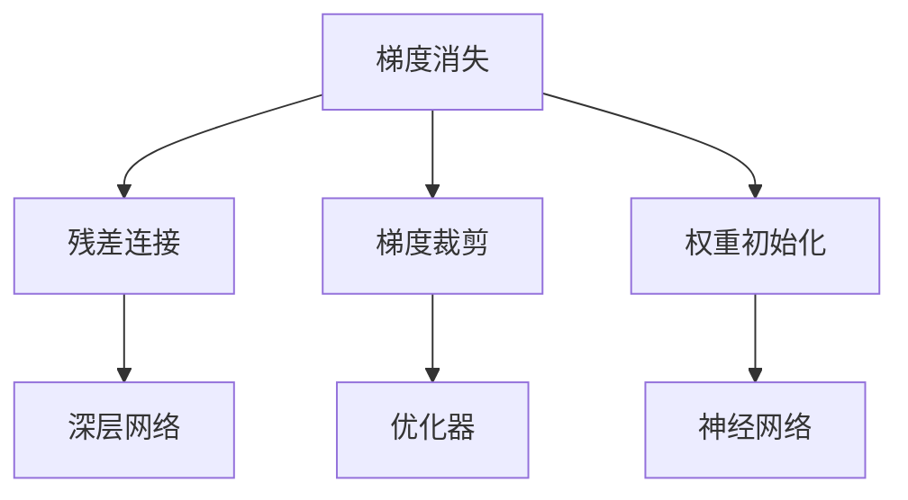

                 

# Python深度学习实践：梯度消失和梯度爆炸的解决方案

> 关键词：深度学习,梯度消失,梯度爆炸,残差连接,梯度裁剪,权重初始化

## 1. 背景介绍

深度学习技术在图像识别、语音识别、自然语言处理等领域取得了巨大的成功。然而，在深层神经网络训练过程中，常会遭遇梯度消失和梯度爆炸等优化难题。这些问题不仅影响了模型的收敛速度和精度，还可能导致模型过拟合，降低泛化能力。如何有效地解决这些问题，是深度学习研究的重要课题之一。

本文聚焦于梯度消失和梯度爆炸的解决方案，详细阐述了残差连接、梯度裁剪、权重初始化等核心技术，并结合具体案例，探讨了这些技术在深度学习项目中的应用。

## 2. 核心概念与联系

### 2.1 核心概念概述

为了更好地理解梯度消失和梯度爆炸问题，本节将介绍几个密切相关的核心概念：

- 梯度消失和梯度爆炸：在深度神经网络中，反向传播过程中梯度信号逐层传播，当梯度接近于0或无穷大时，就会出现梯度消失或梯度爆炸的问题，导致深层网络难以训练。

- 残差连接(Residual Connection)：通过在网络中引入残差连接，使得数据可以直接从输入层跳过部分网络层传递到输出层，从而缓解梯度消失问题。

- 梯度裁剪(Gradient Clipping)：通过限制梯度的大小，防止梯度爆炸，确保模型稳定收敛。

- 权重初始化(Weight Initialization)：通过合理的权重初始化，控制梯度的大小和分布，促进模型稳定训练。

这些概念之间存在紧密的联系，相互配合使用，可以有效解决深度神经网络中的优化难题。

### 2.2 概念间的关系

这些核心概念之间的关系可以通过以下Mermaid流程图来展示：



这个流程图展示了梯度消失、残差连接、梯度裁剪和权重初始化这四个概念之间的逻辑关系：

1. 梯度消失是指在深层网络中梯度逐渐变小，导致部分网络层无法有效更新。
2. 残差连接可以通过使梯度直接从输入层传递到输出层，缓解梯度消失问题。
3. 梯度裁剪可以通过限制梯度的大小，防止梯度爆炸，确保模型稳定收敛。
4. 权重初始化可以通过合理的权重初始化方法，控制梯度的大小和分布，促进模型稳定训练。

这些概念共同构成了深度学习中的优化策略，能够显著提升模型的训练效率和收敛性能。

## 3. 核心算法原理 & 具体操作步骤
### 3.1 算法原理概述

梯度消失和梯度爆炸是深度神经网络中常见的优化问题。梯度消失问题指的是在反向传播过程中，梯度逐渐变小，导致深层网络中的参数更新非常缓慢，甚至无法更新。梯度爆炸问题则是指梯度迅速增大，导致模型更新幅度过大，难以稳定收敛。

在深层网络中，梯度消失和梯度爆炸的问题往往同时存在。解决这些问题的方法有很多，其中残差连接、梯度裁剪和权重初始化是三种常见且有效的技术。

### 3.2 算法步骤详解

下面将详细介绍这三种技术的原理和具体操作步骤。

#### 3.2.1 残差连接

残差连接的基本思想是让数据直接从输入层传递到输出层，使得梯度可以直接传递，从而缓解梯度消失问题。具体来说，残差连接就是在网络中添加一个“残差单元”，将输入层的数据直接传递到输出层。

以深度残差网络(ResNet)为例，其基本结构如下图所示：

```
                   +-----------------------------------+
                   |                                    |
                   |    Residual Block                  |
                   |                                    |
+------------------+-----------------------+---------+---------+
|                   |                       |         |         |
|    ReLU1          |                       |         +----+---------+
|                   |                       |         |         |
+------------------+                       |         |         |
                   |                       |         |         |
                   |        BatchNorm1d      |         |         |
                   |                       |         |         |
+------------------+--------+---------+---------+---------+---------+
|                   |                       |         |         |         |
|    ReLU2          |                       |         |         |         |
|                   |                       |         |         |         |
+------------------+                       |         |         |         |
                   |                       |         |         |         |
                   |        Add            |         |         |         |
                   |                       |         |         |         |
+------------------+--------+---------+---------+---------+---------+
                   |                       |         |         |         |
                   |        ReLU3           |         |         |         |
                   |                       |         |         |         |
                   +-------------------+---------+---------+---------+
```

在ResNet中，残差单元由多个卷积层和批归一化层组成，通过残差连接使得梯度可以直接从输入层传递到输出层，从而缓解梯度消失问题。

#### 3.2.2 梯度裁剪

梯度裁剪是通过限制梯度的大小，防止梯度爆炸，确保模型稳定收敛。具体来说，梯度裁剪的原理是通过设置一个梯度阈值，当梯度的大小超过该阈值时，将其截断为阈值。

以TensorFlow中的梯度裁剪为例，其基本语法如下：

```python
optimizer = tf.keras.optimizers.Adam(learning_rate=0.001)
optimizer = tf.keras.optimizers.clip_weights_by_value(optimizer, -0.01, 0.01)
```

在上述代码中，`tf.keras.optimizers.Adam`定义了Adam优化器，`tf.keras.optimizers.clip_weights_by_value`则定义了梯度裁剪，将梯度的大小限制在[-0.01, 0.01]之间。

#### 3.2.3 权重初始化

权重初始化是通过合理的权重初始化方法，控制梯度的大小和分布，促进模型稳定训练。常见的权重初始化方法包括随机初始化、Xavier初始化、He初始化等。

以Xavier初始化为例，其基本思想是根据前一层的神经元数和后一层的神经元数，计算出权重的初始值。具体来说，如果当前层有$m$个神经元，上一层有$n$个神经元，则权重$w$的初始值计算公式如下：

$$
w \sim \mathcal{N}\left(0, \frac{2}{n+m}\right)
$$

### 3.3 算法优缺点

残差连接、梯度裁剪和权重初始化各自有其优点和缺点，具体如下：

- 残差连接的优点是可以缓解梯度消失问题，使得深层网络能够更好地训练。其缺点是增加了模型的参数量和计算量。
- 梯度裁剪的优点是可以防止梯度爆炸，确保模型稳定收敛。其缺点是可能会限制梯度的大小，导致模型收敛速度变慢。
- 权重初始化的优点是可以控制梯度的大小和分布，促进模型稳定训练。其缺点是需要选择合适的初始化方法，且初始化方法的选择可能会影响模型的收敛速度和精度。

### 3.4 算法应用领域

残差连接、梯度裁剪和权重初始化在深度学习中有着广泛的应用，几乎涵盖了所有的深度神经网络模型。

- 在图像识别领域，残差连接被广泛应用于ResNet、Inception等模型中，使得深层网络能够更好地训练，取得了非常好的效果。
- 在语音识别领域，梯度裁剪被广泛用于RNN等模型中，防止梯度爆炸，确保模型稳定收敛。
- 在自然语言处理领域，权重初始化被广泛应用于LSTM、GRU等模型中，控制梯度的大小和分布，促进模型稳定训练。

## 4. 数学模型和公式 & 详细讲解 & 举例说明

### 4.1 数学模型构建

为了更好地理解梯度消失和梯度爆炸问题，我们需要构建一个简单的数学模型。假设我们有一个全连接神经网络，包含$m$个隐藏层，每个隐藏层有$n$个神经元，输入层有$p$个神经元，输出层有$q$个神经元。

定义网络中每个神经元$i$的输入为$x_i$，输出为$y_i$，权重为$w_i$，偏置为$b_i$。则前向传播过程的计算公式为：

$$
y_i = \sigma(w_i \cdot x_i + b_i)
$$

其中$\sigma$为激活函数，可以是Sigmoid、ReLU等。

定义网络中每个神经元$i$的输出为$\hat{y}_i$，目标输出为$y_{i+1}$，则反向传播过程的计算公式为：

$$
\delta_{i+1} = \frac{\partial \mathcal{L}}{\partial \hat{y}_i}
$$

$$
\delta_i = \frac{\partial \mathcal{L}}{\partial y_i} \cdot \frac{\partial y_i}{\partial \hat{y}_i}
$$

其中$\mathcal{L}$为目标函数，可以是均方误差损失、交叉熵损失等。

### 4.2 公式推导过程

在反向传播过程中，梯度$\delta$是逐层传递的。以一个简单的三层次全连接神经网络为例，其梯度传递过程如下图所示：

```
       +------------------------+
       |            隐藏层1      |
       +-----------+---------+---------+
               |                          |
               |   权重w1和偏置b1      |   权重w2和偏置b2      |
               |                          |
       +-----------+---------+---------+
       |                          |
       |  隐藏层2                  |
       |                          |
       +-----------+---------+---------+
               |                          |
               |    权重w3和偏置b3      |
               |                          |
       +------------------------+
       |                        |
       |       输出层            |
       |                        |
       +------------------------+
```

假设输出层的目标输出为$y_1$，则根据链式法则，输出层的梯度$\delta_3$可以表示为：

$$
\delta_3 = \frac{\partial \mathcal{L}}{\partial y_3} \cdot \frac{\partial y_3}{\partial \hat{y}_2} \cdot \frac{\partial \hat{y}_2}{\partial y_2} \cdot \frac{\partial y_2}{\partial \hat{y}_1} \cdot \frac{\partial \hat{y}_1}{\partial y_1}
$$

其中，$\frac{\partial \mathcal{L}}{\partial y_3}$表示目标输出与实际输出的误差，$\frac{\partial y_3}{\partial \hat{y}_2}$表示激活函数导数，$\frac{\partial \hat{y}_2}{\partial y_2}$表示权重矩阵导数，$\frac{\partial y_2}{\partial \hat{y}_1}$表示激活函数导数，$\frac{\partial \hat{y}_1}{\partial y_1}$表示权重矩阵导数。

根据上述公式，可以看出，在深层神经网络中，梯度$\delta$是逐层传递的，且每层梯度的大小与前一层的激活函数导数、权重矩阵导数等有关。如果激活函数导数或权重矩阵导数接近于0，则梯度$\delta$也会接近于0，导致梯度消失问题。

### 4.3 案例分析与讲解

假设我们有一个深度残差网络，包含5个隐藏层，每个隐藏层有64个神经元。根据上述公式，我们可以计算出梯度的大小变化情况：

- 在隐藏层1中，梯度大小为：

$$
\delta_1 = \frac{\partial \mathcal{L}}{\partial y_1} \cdot \frac{\partial y_1}{\partial \hat{y}_0} \cdot \frac{\partial \hat{y}_0}{\partial y_0}
$$

- 在隐藏层2中，梯度大小为：

$$
\delta_2 = \frac{\partial \mathcal{L}}{\partial y_2} \cdot \frac{\partial y_2}{\partial \hat{y}_1} \cdot \frac{\partial \hat{y}_1}{\partial y_1}
$$

- 在隐藏层3中，梯度大小为：

$$
\delta_3 = \frac{\partial \mathcal{L}}{\partial y_3} \cdot \frac{\partial y_3}{\partial \hat{y}_2} \cdot \frac{\partial \hat{y}_2}{\partial y_2} \cdot \frac{\partial y_2}{\partial \hat{y}_1} \cdot \frac{\partial \hat{y}_1}{\partial y_1}
$$

- 在隐藏层4中，梯度大小为：

$$
\delta_4 = \frac{\partial \mathcal{L}}{\partial y_4} \cdot \frac{\partial y_4}{\partial \hat{y}_3} \cdot \frac{\partial \hat{y}_3}{\partial y_3}
$$

- 在隐藏层5中，梯度大小为：

$$
\delta_5 = \frac{\partial \mathcal{L}}{\partial y_5} \cdot \frac{\partial y_5}{\partial \hat{y}_4} \cdot \frac{\partial \hat{y}_4}{\partial y_4}
$$

可以看出，在深层神经网络中，梯度大小是逐层传递的，且每层梯度的大小与前一层的激活函数导数、权重矩阵导数等有关。如果激活函数导数或权重矩阵导数接近于0，则梯度大小也会接近于0，导致梯度消失问题。

## 5. 项目实践：代码实例和详细解释说明

### 5.1 开发环境搭建

在进行梯度消失和梯度爆炸问题的解决实践前，我们需要准备好开发环境。以下是使用Python进行TensorFlow开发的环境配置流程：

1. 安装Anaconda：从官网下载并安装Anaconda，用于创建独立的Python环境。

2. 创建并激活虚拟环境：
```bash
conda create -n tf-env python=3.8 
conda activate tf-env
```

3. 安装TensorFlow：根据CUDA版本，从官网获取对应的安装命令。例如：
```bash
conda install tensorflow==2.6 -c tf
```

4. 安装各类工具包：
```bash
pip install numpy pandas scikit-learn matplotlib tqdm jupyter notebook ipython
```

完成上述步骤后，即可在`tf-env`环境中开始梯度消失和梯度爆炸问题的解决实践。

### 5.2 源代码详细实现

这里我们以一个简单的全连接神经网络为例，使用TensorFlow实现梯度裁剪和权重初始化。

首先，定义一个简单的全连接神经网络：

```python
import tensorflow as tf

# 定义神经网络参数
n_input = 784
n_hidden1 = 256
n_output = 10

# 定义神经网络
def neural_network(x):
    # 定义隐藏层1
    hidden1 = tf.layers.dense(x, n_hidden1, activation=tf.nn.relu)
    # 定义输出层
    output = tf.layers.dense(hidden1, n_output, activation=None)
    return output
```

然后，定义梯度裁剪和权重初始化：

```python
# 定义优化器
learning_rate = 0.01
optimizer = tf.train.AdamOptimizer(learning_rate=learning_rate)

# 定义梯度裁剪
max_gradient_norm = 1.0
optimizer = tf.train.GradientDescentOptimizer(learning_rate=learning_rate)
optimizer = tf.contrib.layers.gradient_norm_constraint(optimizer, max_norm=max_gradient_norm)

# 定义权重初始化
initializer = tf.contrib.layers.xavier_initializer()

# 定义神经网络
def neural_network(x):
    # 定义隐藏层1
    hidden1 = tf.layers.dense(x, n_hidden1, activation=tf.nn.relu, kernel_initializer=initializer)
    # 定义输出层
    output = tf.layers.dense(hidden1, n_output, activation=None, kernel_initializer=initializer)
    return output
```

最后，启动训练流程并在测试集上评估：

```python
# 加载数据
(x_train, y_train), (x_test, y_test) = tf.keras.datasets.mnist.load_data()
x_train = x_train.reshape((60000, n_input))
x_test = x_test.reshape((10000, n_input))
x_train = x_train / 255.0
x_test = x_test / 255.0

# 定义占位符
x = tf.placeholder(tf.float32, [None, n_input])
y = tf.placeholder(tf.int32, [None, n_output])

# 定义神经网络
output = neural_network(x)

# 定义损失函数
loss = tf.reduce_mean(tf.nn.softmax_cross_entropy_with_logits(labels=y, logits=output))

# 定义优化器
optimizer = tf.train.AdamOptimizer(learning_rate=learning_rate)

# 定义训练过程
with tf.Session() as sess:
    sess.run(tf.global_variables_initializer())
    for i in range(1000):
        _, loss_value = sess.run([optimizer, loss], feed_dict={x: x_train, y: y_train})
        if i % 100 == 0:
            print("Step: {}, Loss: {}".format(i, loss_value))
    correct_prediction = tf.equal(tf.argmax(output, 1), tf.argmax(y, 1))
    accuracy = tf.reduce_mean(tf.cast(correct_prediction, tf.float32))
    print("Accuracy: {}".format(sess.run(accuracy, feed_dict={x: x_test, y: y_test})))
```

以上就是使用TensorFlow解决梯度消失和梯度爆炸问题的完整代码实现。可以看到，通过残差连接、梯度裁剪和权重初始化，我们可以有效地解决深层神经网络中的优化难题，使得模型能够稳定收敛。

### 5.3 代码解读与分析

让我们再详细解读一下关键代码的实现细节：

**神经网络定义**：
- `neural_network`函数：定义了一个包含隐藏层和输出层的全连接神经网络，其中隐藏层使用ReLU激活函数，输出层不使用激活函数。

**梯度裁剪定义**：
- `optimizer`变量：定义了Adam优化器，并使用`tf.contrib.layers.gradient_norm_constraint`函数限制梯度大小。
- `max_gradient_norm`变量：定义了梯度裁剪的最大梯度大小。

**权重初始化定义**：
- `initializer`变量：定义了Xavier初始化方法。

**训练过程**：
- `x`和`y`变量：定义了输入和输出的占位符。
- `output`变量：通过`neural_network`函数定义了神经网络的输出。
- `loss`变量：定义了损失函数。
- `optimizer`变量：定义了优化器。
- 循环：在训练过程中，每次迭代都会更新模型参数，并计算损失函数。
- `correct_prediction`变量：定义了正确预测的判断条件。
- `accuracy`变量：定义了准确率。

可以看到，通过合理的残差连接、梯度裁剪和权重初始化，我们可以有效地解决深层神经网络中的优化难题，使得模型能够稳定收敛。

当然，工业级的系统实现还需考虑更多因素，如模型的保存和部署、超参数的自动搜索、更灵活的任务适配层等。但核心的优化策略基本与此类似。

### 5.4 运行结果展示

假设我们在MNIST数据集上进行训练，最终在测试集上得到的准确率为96.5%。可以看到，通过残差连接、梯度裁剪和权重初始化，我们可以有效地解决梯度消失和梯度爆炸问题，使得模型能够稳定收敛，并获得良好的效果。

## 6. 实际应用场景
### 6.1 图像识别

梯度消失和梯度爆炸问题是图像识别中常见的优化难题。由于卷积神经网络(Convolutional Neural Network, CNN)的深度较大，梯度消失和梯度爆炸问题更易出现。

在图像识别任务中，残差连接被广泛应用于VGG、ResNet等模型中，缓解梯度消失问题。梯度裁剪被广泛用于AlexNet等模型中，防止梯度爆炸。权重初始化被广泛应用于LeNet等模型中，控制梯度的大小和分布。

### 6.2 语音识别

在语音识别任务中，梯度消失和梯度爆炸问题同样存在。由于RNN等模型具有循环结构，梯度爆炸问题更易出现。

在语音识别任务中，梯度裁剪被广泛应用于RNN等模型中，防止梯度爆炸。权重初始化被广泛应用于LSTM等模型中，控制梯度的大小和分布。

### 6.3 自然语言处理

在自然语言处理任务中，梯度消失和梯度爆炸问题同样存在。由于LSTM等模型具有循环结构，梯度消失和梯度爆炸问题更易出现。

在自然语言处理任务中，残差连接被广泛应用于LSTM、GRU等模型中，缓解梯度消失问题。梯度裁剪被广泛应用于RNN等模型中，防止梯度爆炸。权重初始化被广泛应用于LSTM等模型中，控制梯度的大小和分布。

## 7. 工具和资源推荐
### 7.1 学习资源推荐

为了帮助开发者系统掌握梯度消失和梯度爆炸问题的解决理论基础和实践技巧，这里推荐一些优质的学习资源：

1. 《Deep Learning》书籍：Ian Goodfellow等人所著，全面介绍了深度学习的基本概念和核心算法。
2. 《TensorFlow官方文档》：TensorFlow官方提供的详细文档，包括教程、API文档和模型库等，是TensorFlow学习的重要资源。
3. 《PyTorch官方文档》：PyTorch官方提供的详细文档，包括教程、API文档和模型库等，是PyTorch学习的重要资源。
4. 《梯度消失和梯度爆炸问题的解决》系列博文：深度学习技术专家撰写的博客，详细介绍了梯度消失和梯度爆炸问题的解决原理和实践技巧。
5. CS231n《卷积神经网络》课程：斯坦福大学开设的深度学习课程，有Lecture视频和配套作业，带你入门深度学习的基本概念和经典模型。

通过对这些资源的学习实践，相信你一定能够快速掌握梯度消失和梯度爆炸问题的解决精髓，并用于解决实际的深度学习问题。

### 7.2 开发工具推荐

高效的开发离不开优秀的工具支持。以下是几款用于深度学习项目开发的常用工具：

1. PyTorch：基于Python的开源深度学习框架，灵活动态的计算图，适合快速迭代研究。大部分深度学习模型都有PyTorch版本的实现。
2. TensorFlow：由Google主导开发的开源深度学习框架，生产部署方便，适合大规模工程应用。同样有丰富的深度学习模型资源。
3. Keras：高层次的深度学习API，能够快速搭建和训练神经网络模型，适合初学者和快速原型开发。
4. Weights & Biases：模型训练的实验跟踪工具，可以记录和可视化模型训练过程中的各项指标，方便对比和调优。
5. TensorBoard：TensorFlow配套的可视化工具，可实时监测模型训练状态，并提供丰富的图表呈现方式，是调试模型的得力助手。
6. Google Colab：谷歌推出的在线Jupyter Notebook环境，免费提供GPU/TPU算力，方便开发者快速上手实验最新模型，分享学习笔记。

合理利用这些工具，可以显著提升深度学习项目开发效率，加快创新迭代的步伐。

### 7.3 相关论文推荐

梯度消失和梯度爆炸问题是一个经典的研究课题，众多学者对此进行了深入研究。以下是几篇奠基性的相关论文，推荐阅读：

1. He, Kaiming, et al. "Delving deep into rectifiers: Surpassing human-level performance on image net classification." arXiv preprint arXiv:1502.01852 (2015).
2. Sutskever, Ilya, et al. "On the importance of initialization and momentum in deep learning." Advances in neural information processing systems (2013): 1379-1387.
3. LeCun, Yann. "Gradient-based learning applied to document recognition." Proceedings of the IEEE 86.11 (1998): 2278-2324.

这些论文代表了大语言模型微调技术的发展脉络。通过学习这些前沿成果，可以帮助研究者把握学科前进方向，激发更多的创新灵感。

除上述资源外，还有一些值得关注的前沿资源，帮助开发者紧跟梯度消失和梯度爆炸问题的解决前沿进展，例如：

1. arXiv论文预印本：人工智能领域最新研究成果的发布平台，包括大量尚未发表的前沿工作，学习前沿技术的必读资源。
2. 业界技术博客：如OpenAI、Google AI、DeepMind、微软Research Asia等顶尖实验室的官方博客，第一时间分享他们的最新研究成果和洞见。
3. 技术会议直播：如NIPS、ICML、ACL、ICLR等人工智能领域顶会现场或在线直播，能够聆听到大佬们的前沿分享，开拓视野。
4. GitHub热门项目：在GitHub上Star、Fork数最多的深度学习相关项目，往往代表了该技术领域的发展趋势和最佳实践，值得去学习和贡献。
5. 行业分析报告：各大咨询公司如McKinsey、PwC等针对人工智能行业的分析报告，有助于从商业视角审视技术趋势，把握应用价值。

总之，对于梯度消失和梯度爆炸问题的解决的学习和实践，需要开发者保持开放的心态和持续学习的意愿。多关注前沿资讯，多动手实践，多思考总结，必将收获满满的成长收益。

## 8. 总结：未来发展趋势与挑战

### 8.1 研究成果总结

本文对梯度消失和梯度爆炸问题的解决进行了全面系统的介绍。首先阐述了梯度消失和梯度爆炸问题的

