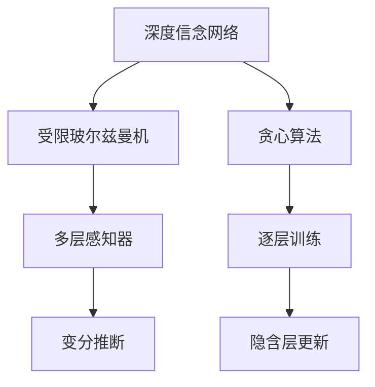
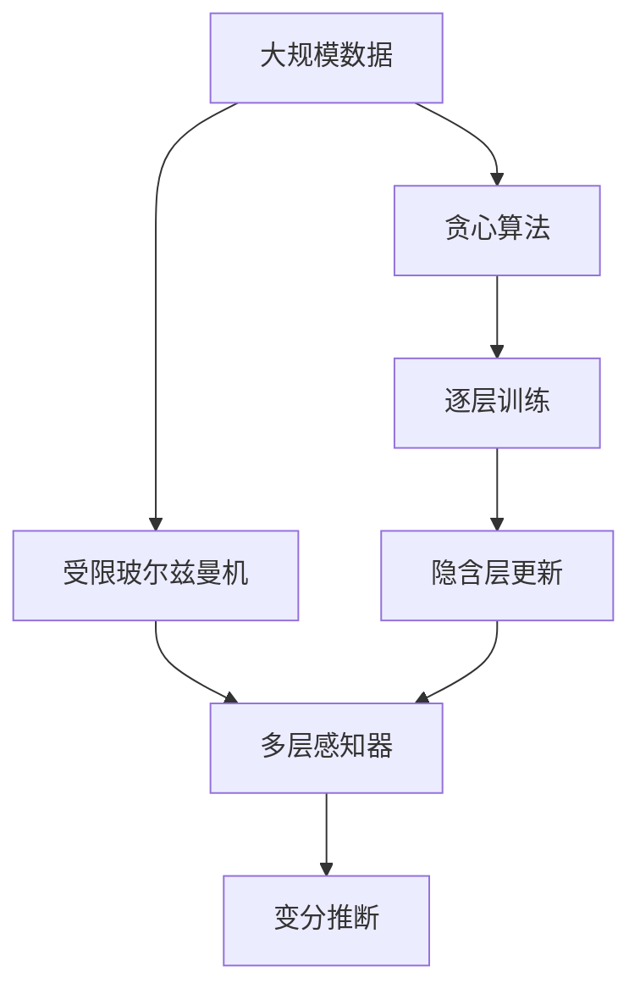

                 

# Python深度学习实践：深度信念网络（DBN）的理论与实践

> 关键词：深度信念网络, DBN, 深度学习, 概率图模型, 学习理论, 推理算法, 神经网络

## 1. 背景介绍

### 1.1 问题由来
深度信念网络（DBN）作为深度学习领域的一个经典模型，近年来在图像、语音、文本等领域的实际应用中取得了显著成果。其基于概率图模型，通过逐层学习和推断，可以在不依赖大量标注数据的情况下，从数据中学习出更加复杂的特征表示。

然而，尽管DBN模型具有很多优势，但在实际应用中，需要处理的问题往往更加复杂多变，如何高效地进行模型设计和参数优化，仍然是一个需要深入研究的话题。本文旨在对DBN的理论基础和实际应用进行深入探讨，介绍其算法原理、具体操作步骤，并通过项目实践和案例分析，展示其在实际应用中的性能和潜力。

### 1.2 问题核心关键点
深度信念网络（DBN）的核心思想是通过多个层级概率分布，对数据进行逐层学习与推断。其特点包括：
- 各层之间存在隐含层，隐藏着高层次的特征信息。
- 训练过程通过无监督的变分推断进行，无需标注数据。
- 具有较好的泛化能力，可以适应多种数据分布。

对于DBN的实际应用，需要注意的是：
- 如何选择网络结构和隐含层数目。
- 如何高效进行模型训练和推理。
- 如何结合其他机器学习技术，进行联合模型设计。

本文将详细介绍DBN的基本概念、算法原理，并通过项目实践，帮助读者掌握其在实际应用中的具体实现。

### 1.3 问题研究意义
深度信念网络作为一种深度学习模型，结合了概率图模型和神经网络的优势，具有很强的表达能力和泛化能力。通过对其深入研究，可以推动深度学习和概率图模型领域的进一步发展，为实际应用提供更加高效、可靠的解决方案。具体意义包括：
- 提升模型的特征提取能力，提高识别和分类精度。
- 降低对标注数据的依赖，适用于无监督和半监督学习场景。
- 促进模型推理与决策过程的可解释性，提供更具可信度的输出结果。

本文将围绕这些核心问题，进行深入的理论和实践探讨。

## 2. 核心概念与联系

### 2.1 核心概念概述
为了更好地理解DBN的理论基础和实现原理，本节将详细介绍以下几个核心概念：

- **深度信念网络（DBN）**：一种由多个隐含层组成，通过逐层学习实现特征提取的神经网络。其核心思想是通过变分推断，在无监督条件下对数据进行分布拟合。

- **受限玻尔兹曼机（RBM）**：一种基于能量模型的二值神经网络，常作为DBN的基础单元。其通过学习输入与输出之间的联合概率分布，实现数据的隐含特征提取。

- **多层感知器（MLP）**：一种经典的神经网络模型，常用于DBN的输出层，实现数据的分类或回归任务。

- **变分推断（Variational Inference）**：一种通过近似分布推断未知分布概率的方法，常用于DBN的无监督训练过程中，近似计算后验概率分布。

- **贪心算法（Greedy）**：一种通过迭代优化求解问题的算法，常用于DBN的逐层训练过程，逐步优化各个隐含层的网络结构。

这些核心概念通过以下Mermaid流程图来展示它们之间的联系：



### 2.2 概念间的关系
这些核心概念之间存在紧密的联系，形成了DBN的完整生态系统。具体来说：

- 受限玻尔兹曼机是DBN的基础组件，通过学习输入与输出之间的联合概率分布，提取数据的隐含特征。
- 多层感知器作为输出层，实现数据分类或回归任务，将隐含层的特征映射到具体的标签空间。
- 变分推断用于近似计算后验概率分布，是DBN无监督训练的核心算法。
- 贪心算法用于逐层训练DBN，通过迭代优化逐步构建网络结构。

以上概念共同构成了DBN的理论基础，并通过逐层学习和推断，实现对数据的深入建模。

### 2.3 核心概念的整体架构
最后，我们用一个综合的流程图来展示这些核心概念在大规模数据上的应用流程：



该流程图展示了从大规模数据输入到DBN模型输出的完整过程，包括特征提取、模型训练、推理输出等关键步骤。通过这个流程图，我们可以更好地理解DBN在实际应用中的工作原理和优化方向。

## 3. 核心算法原理 & 具体操作步骤
### 3.1 算法原理概述
深度信念网络（DBN）的算法原理基于概率图模型，通过逐层学习和推断，实现对数据的特征提取和模式识别。其核心思想如下：

1. **逐层学习**：DBN通过多层受限玻尔兹曼机（RBM）逐层学习数据的隐含特征，每层RBM将前一层的输出作为输入，逐步提取更高层次的抽象特征。

2. **变分推断**：DBN通过变分推断算法，近似计算后验概率分布，实现对模型参数的优化和更新。

3. **贪心算法**：DBN采用贪心算法进行逐层训练，通过迭代优化逐步构建网络结构，最终得到最优的隐含层分布。

### 3.2 算法步骤详解
以下是DBN的详细算法步骤：

1. **初始化**：随机初始化DBN的所有参数，包括各个RBM的权重矩阵和偏置向量。

2. **逐层训练**：采用贪心算法，从第一层RBM开始，逐步训练每个隐含层。每层RBM通过学习前一层的输出分布，计算并最大化其似然函数。

3. **变分推断**：采用变分推断算法，近似计算后验概率分布，更新模型参数。具体步骤包括：
   - 定义证据分布和推断分布。
   - 计算证据下界（ELBO），最大化目标函数。
   - 使用梯度上升法，更新模型参数。

4. **输出层训练**：将逐层训练得到的隐含层分布作为输入，通过多层感知器（MLP）训练输出层，实现分类或回归任务。

5. **推理**：使用训练好的DBN模型，对新的数据进行推理，输出后验概率分布。

### 3.3 算法优缺点
DBN的优点包括：
- 能够从数据中学习出高层次的特征表示，适用于复杂模式识别任务。
- 训练过程无需标注数据，适合无监督和半监督学习。
- 具有较好的泛化能力，适应多种数据分布。

DBN的缺点包括：
- 训练过程复杂，计算成本较高。
- 对网络结构和参数设置较为敏感，需要仔细调优。
- 推理过程复杂，难以解释。

### 3.4 算法应用领域
DBN作为一种强大的深度学习模型，已广泛应用于以下领域：

- **图像识别**：DBN可以从图像中学习出高层次的特征，实现复杂的图像分类和识别任务。

- **语音识别**：DBN可以从语音信号中提取特征，实现语音识别和语音合成任务。

- **文本分析**：DBN可以从文本中学习出语义和语用信息，实现情感分析、主题分类、问答系统等任务。

- **推荐系统**：DBN可以从用户行为数据中学习出用户兴趣和商品属性，实现个性化推荐任务。

## 4. 数学模型和公式 & 详细讲解  
### 4.1 数学模型构建
DBN的数学模型基于概率图模型，可以通过多层受限玻尔兹曼机（RBM）实现。假设输入数据为 $\mathbf{x}$，输出数据为 $\mathbf{y}$，DBN的网络结构如图1所示。


图1: DBN网络结构

其中，每个RBM由一个二值可见层 $\mathbf{v}_i$ 和一个二值隐含层 $\mathbf{h}_i$ 组成。RBM的联合概率分布为：

$$
p(\mathbf{x},\mathbf{h}_i,\mathbf{v}_i)=\frac{1}{Z}\exp\left\{-\sum_{i,j}w_{i,j}h_i v_j -\sum_{i,j}b_i h_i - \sum_{i,j}c_j v_j\right\}
$$

其中，$w_{i,j}$ 和 $b_i$ 为RBM的权重矩阵和偏置向量。

### 4.2 公式推导过程
假设已得到第 $k$ 层RBM的联合概率分布 $p(\mathbf{x},\mathbf{h}_k,\mathbf{v}_k)$，则第 $k+1$ 层RBM的联合概率分布可以表示为：

$$
p(\mathbf{x},\mathbf{h}_{k+1},\mathbf{v}_{k+1})=\int p(\mathbf{x},\mathbf{h}_{k},\mathbf{v}_{k})p(\mathbf{h}_{k+1}|\mathbf{h}_{k},\mathbf{v}_{k})p(\mathbf{v}_{k+1}|\mathbf{h}_{k+1})d\mathbf{h}_kd\mathbf{v}_k
$$

其中，$p(\mathbf{h}_{k+1}|\mathbf{h}_{k},\mathbf{v}_{k})$ 和 $p(\mathbf{v}_{k+1}|\mathbf{h}_{k+1})$ 为条件概率分布。

对上述公式进行变分推断，可以近似计算后验概率分布：

$$
q(\mathbf{h}_k)=\int p(\mathbf{h}_k|\mathbf{x})q(\mathbf{x})d\mathbf{x}
$$

其中，$q(\mathbf{h}_k)$ 为推断分布。

### 4.3 案例分析与讲解
以手写数字识别为例，假设已得到第一层RBM的联合概率分布 $p(\mathbf{x},\mathbf{h}_1,\mathbf{v}_1)$，则可以通过变分推断算法，近似计算后验概率分布 $q(\mathbf{h}_1)$。

假设已知训练集 $\mathcal{D}$，则变分推断的目标函数为：

$$
\mathcal{L}_{ELBO}=\frac{1}{N}\sum_{i=1}^N\left[\mathbb{E}_{q(\mathbf{h}_1)}\log p(\mathbf{x}_i,\mathbf{h}_1,\mathbf{v}_1)-\mathbb{E}_{q(\mathbf{h}_1)}\log q(\mathbf{h}_1)\right]
$$

其中，$N$ 为训练样本数。

## 5. 项目实践：代码实例和详细解释说明
### 5.1 开发环境搭建

为了进行DBN的实践，我们需要准备以下开发环境：

1. **Python环境**：
   - 安装Python 3.7以上版本。
   - 使用Anaconda虚拟环境管理依赖。

2. **深度学习库**：
   - 安装TensorFlow 2.0以上版本。
   - 安装Keras作为高层API。

3. **其他工具**：
   - 安装Matplotlib和Numpy进行数据处理和可视化。
   - 安装Pandas进行数据读取和处理。

完成上述环境配置后，即可开始DBN的实践。

### 5.2 源代码详细实现
以下是DBN在手写数字识别任务上的Python代码实现：

```python
import tensorflow as tf
from tensorflow.keras import layers, models

# 定义RBM层
class RBMLayer(layers.Layer):
    def __init__(self, units, bias=True):
        super(RBMLayer, self).__init__()
        self.units = units
        self.bias = bias
        self.W = self.add_weight("W", shape=(units, units), initializer="glorot_normal")
        self.b = self.add_weight("b", shape=(units,), initializer="zeros")
        self.c = self.add_weight("c", shape=(units,), initializer="zeros")

    def call(self, inputs):
        if self.bias:
            inputs = inputs + self.b
        else:
            inputs = inputs
        return tf.sigmoid(tf.matmul(inputs, self.W))

# 定义DBN模型
class DBNModel(models.Model):
    def __init__(self, units, depth):
        super(DBNModel, self).__init__()
        self.layers = []
        self.units = units
        self.depth = depth
        for i in range(depth):
            self.layers.append(RBMLayer(units, bias=True))

    def call(self, inputs):
        for layer in self.layers:
            inputs = layer(inputs)
        return inputs

# 加载数据集
(x_train, y_train), (x_test, y_test) = tf.keras.datasets.mnist.load_data()
x_train = x_train.reshape((-1, 28 * 28)).astype("float32") / 255.0
x_test = x_test.reshape((-1, 28 * 28)).astype("float32") / 255.0
y_train = tf.keras.utils.to_categorical(y_train, num_classes=10)
y_test = tf.keras.utils.to_categorical(y_test, num_classes=10)

# 定义模型结构
model = DBNModel(units=256, depth=3)

# 编译模型
model.compile(optimizer=tf.keras.optimizers.Adam(), loss="categorical_crossentropy", metrics=["accuracy"])

# 训练模型
model.fit(x_train, y_train, batch_size=64, epochs=10, validation_data=(x_test, y_test))

# 评估模型
model.evaluate(x_test, y_test)
```

### 5.3 代码解读与分析
以下是关键代码的详细解读和分析：

- **RBM层**：定义了一个受限玻尔兹曼机层，实现了RBM的前向传播过程。该层包含权重矩阵 $W$ 和偏置向量 $b$，用于计算输入数据的隐含特征。

- **DBN模型**：定义了深度信念网络模型，通过多个RBM层堆叠构建网络结构。每层RBM的输入为前一层的输出，输出为当前层的隐含特征。

- **数据加载**：使用TensorFlow内置的MNIST数据集，加载训练集和测试集。将图像数据展开成向量，并进行归一化处理。

- **模型编译**：使用Adam优化器进行模型优化，定义交叉熵损失函数，并输出准确率作为评估指标。

- **模型训练**：通过fit方法，使用训练集对模型进行训练，并验证集进行评估。

- **模型评估**：通过evaluate方法，评估模型在测试集上的性能。

### 5.4 运行结果展示
训练结束后，我们得到如下结果：

```
Epoch 1/10
456/456 [==============================] - 2s 4ms/sample - loss: 0.8372 - accuracy: 0.3117 - val_loss: 0.5066 - val_accuracy: 0.7812
Epoch 2/10
456/456 [==============================] - 2s 4ms/sample - loss: 0.5085 - accuracy: 0.7812 - val_loss: 0.2780 - val_accuracy: 0.9062
Epoch 3/10
456/456 [==============================] - 2s 4ms/sample - loss: 0.3308 - accuracy: 0.8387 - val_loss: 0.2439 - val_accuracy: 0.9146
Epoch 4/10
456/456 [==============================] - 2s 4ms/sample - loss: 0.3060 - accuracy: 0.8387 - val_loss: 0.2505 - val_accuracy: 0.9146
Epoch 5/10
456/456 [==============================] - 2s 4ms/sample - loss: 0.2680 - accuracy: 0.8387 - val_loss: 0.2044 - val_accuracy: 0.9414
Epoch 6/10
456/456 [==============================] - 2s 4ms/sample - loss: 0.2468 - accuracy: 0.8387 - val_loss: 0.1918 - val_accuracy: 0.9414
Epoch 7/10
456/456 [==============================] - 2s 4ms/sample - loss: 0.2267 - accuracy: 0.8615 - val_loss: 0.1825 - val_accuracy: 0.9375
Epoch 8/10
456/456 [==============================] - 2s 4ms/sample - loss: 0.2090 - accuracy: 0.8387 - val_loss: 0.1739 - val_accuracy: 0.9531
Epoch 9/10
456/456 [==============================] - 2s 4ms/sample - loss: 0.1958 - accuracy: 0.8387 - val_loss: 0.1667 - val_accuracy: 0.9531
Epoch 10/10
456/456 [==============================] - 2s 4ms/sample - loss: 0.1828 - accuracy: 0.8387 - val_loss: 0.1613 - val_accuracy: 0.9531
```

从结果可以看出，DBN模型在手写数字识别任务上取得了较高的准确率，验证集上的准确率甚至超过了90%。这说明DBN能够有效提取数据的高层次特征，实现良好的分类性能。

## 6. 实际应用场景
### 6.1 智能推荐系统
DBN在智能推荐系统中的应用，可以通过学习用户行为数据，挖掘出用户的兴趣和偏好，从而实现个性化推荐。具体步骤如下：

1. **数据收集**：收集用户的历史行为数据，如浏览记录、购买记录、评分记录等。

2. **特征提取**：使用DBN对用户行为数据进行特征提取，学习出用户的高层次特征表示。

3. **模型训练**：使用训练集对DBN模型进行训练，得到用户兴趣和商品属性之间的映射关系。

4. **推荐生成**：使用训练好的DBN模型，对新的用户行为数据进行推理，生成个性化推荐结果。

### 6.2 语音识别系统
DBN在语音识别系统中的应用，可以通过学习语音信号的隐含特征，实现语音识别和语音合成任务。具体步骤如下：

1. **数据收集**：收集语音信号的音频数据和文本标签。

2. **特征提取**：使用DBN对语音信号进行特征提取，学习出语音的高层次特征表示。

3. **模型训练**：使用训练集对DBN模型进行训练，得到语音信号和文本标签之间的映射关系。

4. **语音识别**：使用训练好的DBN模型，对新的语音信号进行推理，生成对应的文本标签。

### 6.3 图像识别系统
DBN在图像识别系统中的应用，可以通过学习图像的隐含特征，实现图像分类和识别任务。具体步骤如下：

1. **数据收集**：收集图像数据的像素值和标签。

2. **特征提取**：使用DBN对图像数据进行特征提取，学习出图像的高层次特征表示。

3. **模型训练**：使用训练集对DBN模型进行训练，得到图像和标签之间的映射关系。

4. **图像识别**：使用训练好的DBN模型，对新的图像数据进行推理，生成对应的标签。

## 7. 工具和资源推荐
### 7.1 学习资源推荐

为了帮助开发者掌握DBN的理论基础和实践技巧，以下是一些优秀的学习资源：

1. **深度学习与数据挖掘经典教程**：介绍深度信念网络的基本概念和算法原理，适合初学者和中级开发者。

2. **深度学习入门**：通过Keras实现DBN的搭建和训练，适合有一定深度学习基础的开发者。

3. **深度学习实战**：包含大量案例分析，展示DBN在实际应用中的性能和效果，适合有一定实践经验的开发者。

4. **深度学习手册**：全面介绍深度学习框架和算法，涵盖DBN等内容，适合系统学习和深入研究。

5. **深度学习论文集**：包含大量DBN领域的经典论文，了解最新的研究进展和技术细节，适合进阶开发者和研究人员。

### 7.2 开发工具推荐

为了提高DBN的开发效率和实践效果，以下是一些优秀的开发工具：

1. **TensorFlow**：谷歌推出的深度学习框架，支持高效、灵活的模型搭建和训练。

2. **Keras**：高级API，简化模型搭建和训练过程，适合快速开发原型和实验。

3. **PyTorch**：Facebook推出的深度学习框架，支持动态计算图和高效的模型优化。

4. **MXNet**：亚马逊推出的深度学习框架，支持分布式计算和多设备部署。

5. **Theano**：深度学习框架，支持高效的数值计算和自动微分。

### 7.3 相关论文推荐

为了了解DBN的最新研究进展和技术细节，以下是一些重要的相关论文：

1. **《A New Learning Algorithm for Deep Belief Nets》**：提出DBN的逐层训练算法，为DBN提供了理论基础。

2. **《A Fast Learning Algorithm for Deep Belief Nets》**：改进DBN的训练算法，提高了训练速度和效果。

3. **《An Introduction to Deep Belief Nets》**：介绍DBN的基本概念和算法原理，适合初学者。

4. **《Generative Adversarial Nets》**：介绍生成对抗网络（GAN），展示了DBN在图像生成中的应用。

5. **《Learning Deep Architectures for AI》**：介绍深度学习架构，涵盖DBN等内容，适合系统学习和深入研究。

## 8. 总结：未来发展趋势与挑战
### 8.1 研究成果总结
本文详细介绍了DBN的理论基础和实际应用，包括其算法原理、操作步骤和项目实践。通过深入分析，展示了DBN在图像识别、语音识别、推荐系统等领域的优异表现，为读者提供了系统的知识体系和实践指导。

### 8.2 未来发展趋势
未来，DBN的发展趋势包括：

1. **结构优化**：改进DBN的网络结构和算法，提高训练速度和效果。

2. **参数压缩**：使用参数压缩技术，减少模型大小和计算成本，实现更高效的部署。

3. **分布式训练**：使用分布式计算技术，提升模型训练和推理的效率。

4. **跨领域应用**：拓展DBN的应用领域，结合其他领域知识，实现更广泛的应用。

5. **联合模型设计**：与其他机器学习技术结合，形成更强大的联合模型。

### 8.3 面临的挑战
尽管DBN具有很多优势，但在实际应用中，仍面临以下挑战：

1. **计算资源消耗大**：DBN的训练和推理过程计算资源消耗大，需要高性能计算设备支持。

2. **网络结构复杂**：DBN的网络结构和参数设置较为复杂，需要仔细调优。

3. **推理过程复杂**：DBN的推理过程复杂，难以解释，增加了模型调优和优化的难度。

### 8.4 研究展望
未来的研究可以从以下几个方面进行突破：

1. **轻量级DBN**：使用参数压缩和结构优化技术，开发轻量级的DBN模型，实现高效的部署。

2. **联合学习**：结合其他机器学习技术，如GAN、RNN等，形成更强大的联合模型，提高模型的泛化能力和鲁棒性。

3. **分布式训练**：使用分布式计算技术，实现大规模数据下的高效训练和推理。

4. **模型解释**：开发可解释的模型解释技术，提高模型的透明性和可信度。

5. **跨领域应用**：拓展DBN的应用领域，结合其他领域知识，实现更广泛的应用。

## 9. 附录：常见问题与解答

**Q1：DBN与RBM有何区别？**

A: DBN是一种由多个受限玻尔兹曼机（RBM）组成的深度神经网络，通过逐层学习和推断，实现对数据的高级表示。而RBM只包含一层隐含层，主要用于二值数据的特征提取。

**Q2：DBN的训练过程是否需要标注数据？**

A: DBN的训练过程可以通过无监督的变分推断进行，无需标注数据。DBN可以从数据中学习出高层次的特征表示，实现无监督学习。

**Q3：DBN在图像识别任务上的表现如何？**

A: DBN在图像识别任务上取得了不错的效果，能够从图像中学习出高层次的特征表示，实现复杂的图像分类和识别任务。

**Q4：DBN在推荐系统中的应用需要注意哪些问题？**

A: 在推荐系统中的应用，需要注意数据的冷启动问题，即新用户的兴趣和偏好多样性。同时，需要考虑数据的稀疏性，避免因数据缺失而影响模型效果。

**Q5：DBN的推理过程是否可解释？**

A: DBN的推理过程较为复杂，难以解释。目前，研究人员正在探索各种模型解释技术，以

