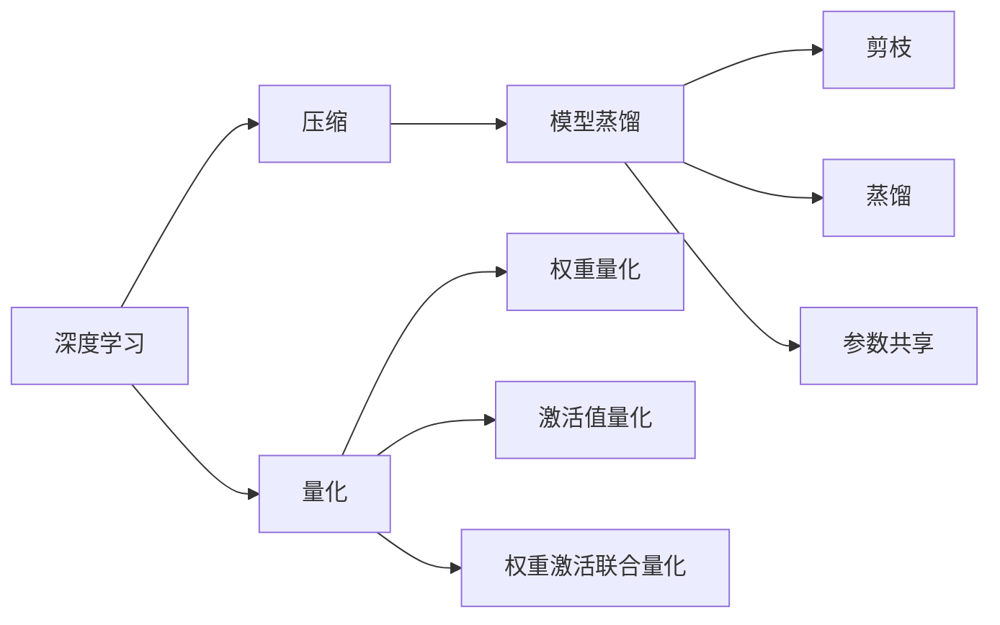
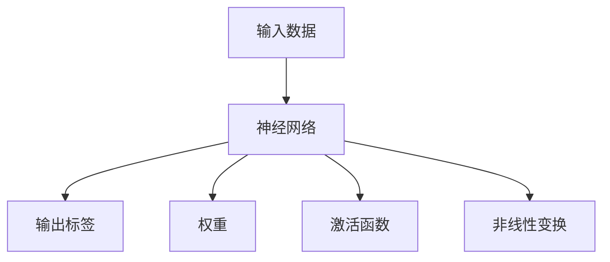
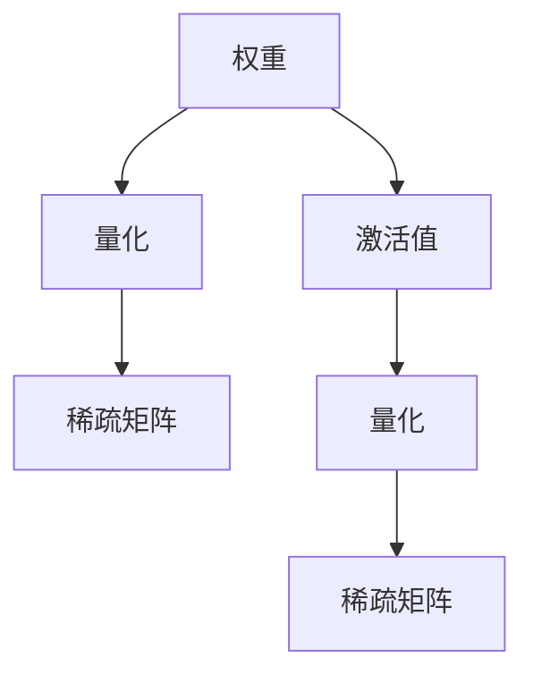
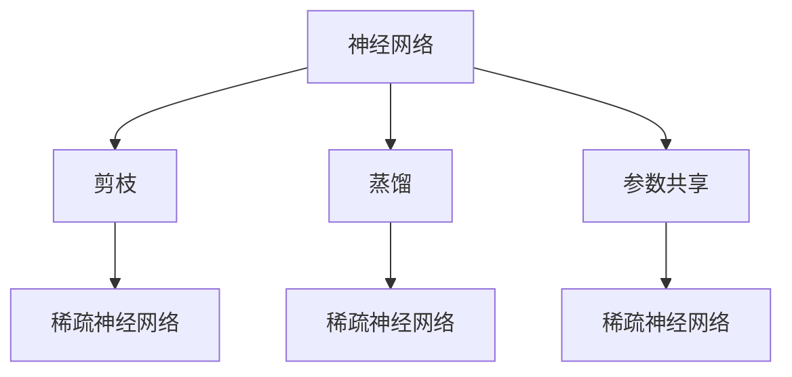
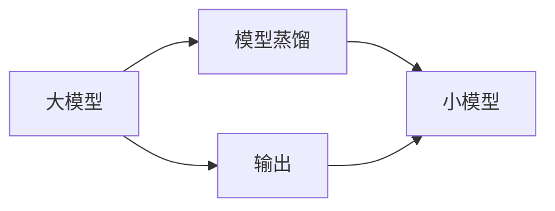
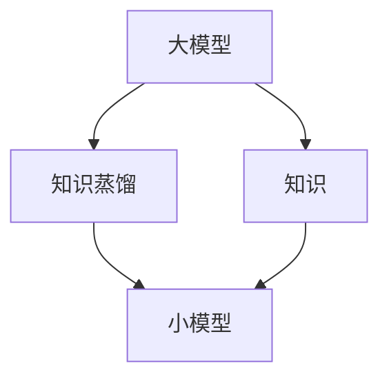
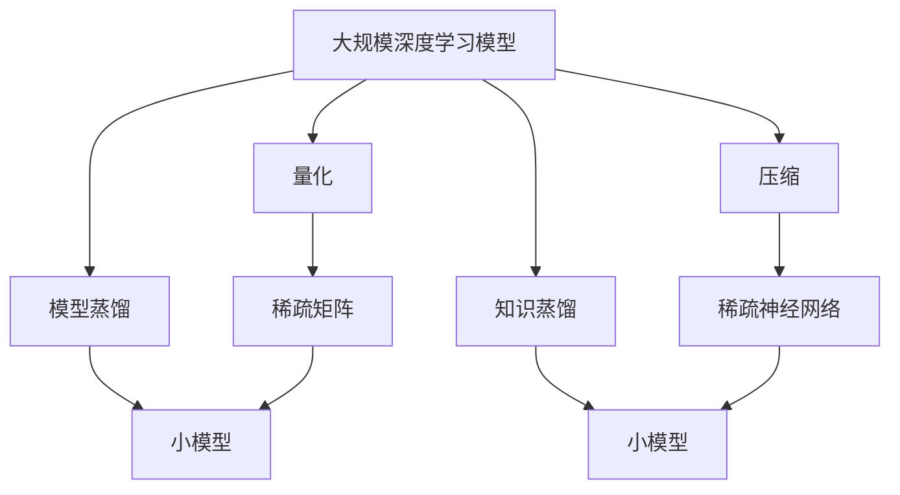

                 

# Python深度学习实践：神经网络的量化和压缩

> 关键词：量化,压缩,深度学习,神经网络,模型优化,TPU,TPU量化,深度学习模型优化,模型压缩,神经网络加速

## 1. 背景介绍

### 1.1 问题由来
随着深度学习技术的蓬勃发展，深度神经网络被广泛应用于图像识别、自然语言处理、语音识别等领域。然而，大规模深度神经网络的训练和推理需要耗费巨大的计算资源和存储资源。如何高效地使用计算资源，加速神经网络的训练和推理，成为了研究热点。

量化和压缩是两种常用的深度学习模型优化方法。量化是通过减少神经网络中的参数位数，降低计算资源的消耗；压缩则通过减小模型参数大小，降低存储资源的需求。量化和压缩方法的结合，可以使深度神经网络在有限资源下实现高效训练和推理。

### 1.2 问题核心关键点
量化和压缩方法的结合，可以使深度神经网络在有限资源下实现高效训练和推理。以下是量化和压缩方法的几个关键点：

- 量化：通过减少神经网络中的参数位数，降低计算资源的消耗。常用的量化方法包括权值量化、激活值量化、权重激活联合量化等。
- 压缩：通过减小模型参数大小，降低存储资源的需求。常用的压缩方法包括剪枝、蒸馏、参数共享、知识蒸馏等。
- 量化与压缩的结合：通过量化和压缩方法的结合，使深度神经网络在有限资源下实现高效训练和推理。常用的方法包括模型蒸馏和知识蒸馏等。

量化和压缩方法的发展，使得深度神经网络能够在大规模数据集上训练，同时实现高效的推理。这些优化方法在大规模深度学习应用中得到了广泛应用，如自动驾驶、医学影像分析、自然语言处理等。

### 1.3 问题研究意义
量化和压缩方法的结合，对于提升深度神经网络的训练和推理效率，降低计算和存储成本具有重要意义：

- 降低计算成本：量化方法通过减少神经网络中的参数位数，降低计算资源的消耗。在计算资源有限的场景下，量化方法可以显著降低计算成本。
- 降低存储成本：压缩方法通过减小模型参数大小，降低存储资源的需求。在存储资源有限的场景下，压缩方法可以显著降低存储成本。
- 加速训练和推理：量化和压缩方法的结合，可以显著加速深度神经网络的训练和推理。在大规模数据集上训练深度神经网络，可以实现更高的训练和推理效率。
- 提升模型性能：量化和压缩方法的结合，可以使深度神经网络在有限资源下实现高效的训练和推理，提升模型性能。

## 2. 核心概念与联系

### 2.1 核心概念概述

为了更好地理解量化和压缩方法，本节将介绍几个密切相关的核心概念：

- 深度学习：基于神经网络的机器学习技术，能够自动学习输入数据和输出标签之间的关系。深度学习在大规模数据集上训练深度神经网络，可以取得很好的性能。
- 量化：通过减少神经网络中的参数位数，降低计算资源的消耗。量化方法包括权值量化、激活值量化、权重激活联合量化等。
- 压缩：通过减小模型参数大小，降低存储资源的需求。压缩方法包括剪枝、蒸馏、参数共享等。
- 模型蒸馏：通过将大模型输出作为小模型训练的目标，提升小模型的性能。
- 知识蒸馏：通过将大模型学到的知识迁移到小模型中，提升小模型的性能。

这些核心概念之间的逻辑关系可以通过以下Mermaid流程图来展示：



这个流程图展示了深度学习中的量化和压缩方法与模型蒸馏和知识蒸馏的联系。

### 2.2 概念间的关系

这些核心概念之间存在着紧密的联系，形成了深度学习模型的优化生态系统。下面我们通过几个Mermaid流程图来展示这些概念之间的关系。

#### 2.2.1 深度学习的基本架构



这个流程图展示了深度学习模型的基本架构。输入数据经过神经网络中的权重和激活函数，得到输出标签。

#### 2.2.2 量化方法



这个流程图展示了量化方法的基本流程。权重和激活值通过量化方法，转换成稀疏矩阵，降低计算资源消耗。

#### 2.2.3 压缩方法



这个流程图展示了压缩方法的基本流程。神经网络通过剪枝和蒸馏等方法，转换成稀疏神经网络，降低存储资源需求。

#### 2.2.4 模型蒸馏



这个流程图展示了模型蒸馏的基本流程。大模型的输出作为小模型的训练目标，提升小模型的性能。

#### 2.2.5 知识蒸馏



这个流程图展示了知识蒸馏的基本流程。大模型学到的知识迁移到小模型中，提升小模型的性能。

### 2.3 核心概念的整体架构

最后，我们用一个综合的流程图来展示这些核心概念在大规模深度学习模型优化过程中的整体架构：



这个综合流程图展示了从大规模深度学习模型到量化、压缩、蒸馏、知识蒸馏的完整流程。深度学习模型通过量化和压缩方法，转换成稀疏矩阵和稀疏神经网络，并通过蒸馏和知识蒸馏方法，转换成小模型，从而实现高效训练和推理。

## 3. 核心算法原理 & 具体操作步骤

### 3.1 算法原理概述

量化和压缩方法的结合，可以使深度神经网络在有限资源下实现高效训练和推理。量化和压缩方法的基本思想是：通过减少神经网络中的参数位数，降低计算资源和存储资源的需求，从而提升深度神经网络的训练和推理效率。

量化方法通过减少神经网络中的参数位数，降低计算资源的消耗。常用的量化方法包括权值量化、激活值量化、权重激活联合量化等。

压缩方法通过减小模型参数大小，降低存储资源的需求。常用的压缩方法包括剪枝、蒸馏、参数共享等。

量化和压缩方法的结合，使得深度神经网络在有限资源下实现高效训练和推理。常用的方法包括模型蒸馏和知识蒸馏等。

### 3.2 算法步骤详解

量化和压缩方法的结合，使深度神经网络在有限资源下实现高效训练和推理。以下是量化和压缩方法的详细步骤：

#### 3.2.1 量化方法

量化方法通过减少神经网络中的参数位数，降低计算资源的消耗。常用的量化方法包括权值量化、激活值量化、权重激活联合量化等。

权值量化方法将权值矩阵的每个元素映射到一组有限的值域中，降低计算资源消耗。常用的量化方法包括离散化量化、浮点数截断量化等。

激活值量化方法将激活值映射到一组有限的值域中，降低计算资源消耗。常用的量化方法包括离散化量化、浮点数截断量化等。

权重激活联合量化方法将权值和激活值联合进行量化，降低计算资源消耗。常用的量化方法包括联合量化、动态范围量化等。

#### 3.2.2 压缩方法

压缩方法通过减小模型参数大小，降低存储资源的需求。常用的压缩方法包括剪枝、蒸馏、参数共享等。

剪枝方法将神经网络中的冗余参数删除，减小模型参数大小，降低存储资源需求。常用的剪枝方法包括稀疏矩阵、结构化剪枝等。

蒸馏方法通过将大模型的输出作为小模型训练的目标，提升小模型的性能。常用的蒸馏方法包括模型蒸馏、知识蒸馏等。

参数共享方法将神经网络中冗余的参数共享，减小模型参数大小，降低存储资源需求。常用的参数共享方法包括全局参数共享、局部参数共享等。

#### 3.2.3 模型蒸馏

模型蒸馏方法通过将大模型的输出作为小模型训练的目标，提升小模型的性能。常用的模型蒸馏方法包括知识蒸馏、结构蒸馏等。

知识蒸馏方法通过将大模型学到的知识迁移到小模型中，提升小模型的性能。常用的知识蒸馏方法包括软标签蒸馏、硬标签蒸馏、多任务蒸馏等。

结构蒸馏方法通过将大模型的结构迁移到小模型中，提升小模型的性能。常用的结构蒸馏方法包括深度蒸馏、宽度蒸馏等。

#### 3.2.4 知识蒸馏

知识蒸馏方法通过将大模型学到的知识迁移到小模型中，提升小模型的性能。常用的知识蒸馏方法包括软标签蒸馏、硬标签蒸馏、多任务蒸馏等。

软标签蒸馏方法将大模型的输出作为小模型的训练目标，提升小模型的性能。常用的软标签蒸馏方法包括交叉熵蒸馏、均方误差蒸馏等。

硬标签蒸馏方法将大模型的输出作为小模型的训练目标，提升小模型的性能。常用的硬标签蒸馏方法包括分类蒸馏、回归蒸馏等。

多任务蒸馏方法通过将大模型学到的多任务知识迁移到小模型中，提升小模型的性能。常用的多任务蒸馏方法包括多任务分类蒸馏、多任务回归蒸馏等。

### 3.3 算法优缺点

量化和压缩方法的结合，使得深度神经网络在有限资源下实现高效训练和推理。量化和压缩方法具有以下优点：

- 降低计算成本：量化方法通过减少神经网络中的参数位数，降低计算资源的消耗。在计算资源有限的场景下，量化方法可以显著降低计算成本。
- 降低存储成本：压缩方法通过减小模型参数大小，降低存储资源的需求。在存储资源有限的场景下，压缩方法可以显著降低存储成本。
- 加速训练和推理：量化和压缩方法的结合，可以显著加速深度神经网络的训练和推理。在大规模数据集上训练深度神经网络，可以实现更高的训练和推理效率。
- 提升模型性能：量化和压缩方法的结合，可以使深度神经网络在有限资源下实现高效的训练和推理，提升模型性能。

量化和压缩方法也存在以下缺点：

- 精度损失：量化和压缩方法可能会降低神经网络的精度。在某些场景下，量化和压缩方法可能会引入误差，影响模型性能。
- 训练难度增加：量化和压缩方法可能会增加神经网络的训练难度。量化和压缩方法可能会引入新的约束条件，影响神经网络的训练过程。
- 模型结构变化：量化和压缩方法可能会改变神经网络的结构。量化和压缩方法可能会引入新的约束条件，改变神经网络的参数大小和结构。

尽管存在这些缺点，量化和压缩方法的结合，使得深度神经网络在有限资源下实现高效训练和推理，具有重要的实用价值。

### 3.4 算法应用领域

量化和压缩方法在大规模深度学习应用中得到了广泛应用，如自动驾驶、医学影像分析、自然语言处理等。以下是量化和压缩方法的应用领域：

- 自动驾驶：通过量化和压缩方法，提升自动驾驶深度神经网络的训练和推理效率，实现高效的自动驾驶系统。
- 医学影像分析：通过量化和压缩方法，提升医学影像分析深度神经网络的训练和推理效率，实现高效的医学影像分析系统。
- 自然语言处理：通过量化和压缩方法，提升自然语言处理深度神经网络的训练和推理效率，实现高效的自然语言处理系统。
- 语音识别：通过量化和压缩方法，提升语音识别深度神经网络的训练和推理效率，实现高效的语音识别系统。
- 计算机视觉：通过量化和压缩方法，提升计算机视觉深度神经网络的训练和推理效率，实现高效的计算机视觉系统。

## 4. 数学模型和公式 & 详细讲解  
### 4.1 数学模型构建

量化和压缩方法的结合，使深度神经网络在有限资源下实现高效训练和推理。以下是量化和压缩方法的数学模型：

设神经网络 $f(x)$ 的输入为 $x$，输出为 $f(x)$。量化和压缩方法的目标是将神经网络 $f(x)$ 转换为新的神经网络 $g(x)$，使得 $g(x)$ 具有相同的输出，但参数更小，计算资源和存储资源需求更低。

#### 4.1.1 量化方法

量化方法通过减少神经网络中的参数位数，降低计算资源的消耗。常用的量化方法包括权值量化、激活值量化、权重激活联合量化等。

权值量化方法将权值矩阵的每个元素映射到一组有限的值域中，降低计算资源消耗。权值量化方法可以用如下公式表示：

$$
\hat{w} = quantize(w)
$$

其中 $\hat{w}$ 为量化后的权值，$w$ 为原始权值，$quantize(\cdot)$ 为量化函数。

激活值量化方法将激活值映射到一组有限的值域中，降低计算资源消耗。激活值量化方法可以用如下公式表示：

$$
\hat{a} = quantize(a)
$$

其中 $\hat{a}$ 为量化后的激活值，$a$ 为原始激活值，$quantize(\cdot)$ 为量化函数。

权重激活联合量化方法将权值和激活值联合进行量化，降低计算资源消耗。权重激活联合量化方法可以用如下公式表示：

$$
\hat{w}, \hat{a} = quantize(w, a)
$$

其中 $\hat{w}$ 和 $\hat{a}$ 为量化后的权值和激活值，$w$ 和 $a$ 为原始权值和激活值，$quantize(\cdot)$ 为量化函数。

#### 4.1.2 压缩方法

压缩方法通过减小模型参数大小，降低存储资源的需求。常用的压缩方法包括剪枝、蒸馏、参数共享等。

剪枝方法将神经网络中的冗余参数删除，减小模型参数大小，降低存储资源需求。剪枝方法可以用如下公式表示：

$$
\hat{f}(x) = f(x_{clipped})
$$

其中 $x_{clipped}$ 为剪枝后的输入，$f(x)$ 为原始神经网络，$f(x_{clipped})$ 为剪枝后的神经网络，$clipped(\cdot)$ 为剪枝函数。

蒸馏方法通过将大模型的输出作为小模型训练的目标，提升小模型的性能。蒸馏方法可以用如下公式表示：

$$
\hat{f}(x) = f(x_{distilled})
$$

其中 $x_{distilled}$ 为蒸馏后的输入，$f(x)$ 为原始神经网络，$f(x_{distilled})$ 为蒸馏后的神经网络，$distilled(\cdot)$ 为蒸馏函数。

参数共享方法将神经网络中冗余的参数共享，减小模型参数大小，降低存储资源需求。参数共享方法可以用如下公式表示：

$$
\hat{f}(x) = f(x_{shared})
$$

其中 $x_{shared}$ 为参数共享后的输入，$f(x)$ 为原始神经网络，$f(x_{shared})$ 为参数共享后的神经网络，$shared(\cdot)$ 为参数共享函数。

#### 4.1.3 模型蒸馏

模型蒸馏方法通过将大模型的输出作为小模型训练的目标，提升小模型的性能。常用的模型蒸馏方法包括知识蒸馏、结构蒸馏等。

知识蒸馏方法通过将大模型学到的知识迁移到小模型中，提升小模型的性能。常用的知识蒸馏方法包括软标签蒸馏、硬标签蒸馏、多任务蒸馏等。

软标签蒸馏方法将大模型的输出作为小模型的训练目标，提升小模型的性能。软标签蒸馏方法可以用如下公式表示：

$$
\hat{f}(x) = f(x_{distilled_{soft}})
$$

其中 $x_{distilled_{soft}}$ 为软标签蒸馏后的输入，$f(x)$ 为原始神经网络，$f(x_{distilled_{soft}})$ 为软标签蒸馏后的神经网络，$distilled_{soft}(\cdot)$ 为软标签蒸馏函数。

硬标签蒸馏方法将大模型的输出作为小模型的训练目标，提升小模型的性能。硬标签蒸馏方法可以用如下公式表示：

$$
\hat{f}(x) = f(x_{distilled_{hard}})
$$

其中 $x_{distilled_{hard}}$ 为硬标签蒸馏后的输入，$f(x)$ 为原始神经网络，$f(x_{distilled_{hard}})$ 为硬标签蒸馏后的神经网络，$distilled_{hard}(\cdot)$ 为硬标签蒸馏函数。

多任务蒸馏方法通过将大模型学到的多任务知识迁移到小模型中，提升小模型的性能。常用的多任务蒸馏方法包括多任务分类蒸馏、多任务回归蒸馏等。

多任务分类蒸馏方法将大模型的分类输出作为小模型的训练目标，提升小模型的性能。多任务分类蒸馏方法可以用如下公式表示：

$$
\hat{f}(x) = f(x_{distilled_{multi_class}})
$$

其中 $x_{distilled_{multi_class}}$ 为多任务分类蒸馏后的输入，$f(x)$ 为原始神经网络，$f(x_{distilled_{multi_class}})$ 为多任务分类蒸馏后的神经网络，$distilled_{multi_class}(\cdot)$ 为多任务分类蒸馏函数。

多任务回归蒸馏方法将大模型的回归输出作为小模型的训练目标，提升小模型的性能。多任务回归蒸馏方法可以用如下公式表示：

$$
\hat{f}(x) = f(x_{distilled_{multi_regression}})
$$

其中 $x_{distilled_{multi_regression}}$ 为多任务回归蒸馏后的输入，$f(x)$ 为原始神经网络，$f(x_{distilled_{multi_regression}})$ 为多任务回归蒸馏后的神经网络，$distilled_{multi_regression}(\cdot)$ 为多任务回归蒸馏函数。

#### 4.1.4 知识蒸馏

知识蒸馏方法通过将大模型学到的知识迁移到小模型中，提升小模型的性能。常用的知识蒸馏方法包括软标签蒸馏、硬标签蒸馏、多任务蒸馏等。

软标签蒸馏方法将大模型的输出作为小模型的训练目标，提升小模型的性能。常用的软标签蒸馏方法包括交叉熵蒸馏、均方误差蒸馏等。

交叉熵蒸馏方法将大模型的输出作为小模型的训练目标，提升小模型的性能。交叉熵蒸馏方法可以用如下公式表示：

$$
\hat{f}(x) = f(x_{distilled_{cross_entropy}})
$$

其中 $x_{distilled_{cross_entropy}}$ 为交叉熵蒸馏后的输入，$f(x)$ 为原始神经网络，$f(x_{distilled_{cross_entropy}})$ 为交叉熵蒸馏后的神经网络，$distilled_{cross_entropy}(\cdot)$ 为交叉熵蒸馏函数。

均方误差蒸馏方法将大模型的输出作为小模型的训练目标，提升小模型的性能。均方误差蒸馏方法可以用如下公式表示：

$$
\hat{f}(x) = f(x_{distilled_{mse}})
$$

其中 $x_{distilled_{mse}}$ 为均方误差蒸馏后的输入，$f(x)$ 为原始神经网络，$f(x_{distilled_{mse}})$ 为均方误差蒸馏后的神经网络，$distilled_{mse}(\cdot)$ 为均方误差蒸馏函数。

硬标签蒸馏方法将大模型的输出作为小模型的训练目标，提升小模型的性能。常用的硬标签蒸馏方法包括分类蒸馏、回归蒸馏等。

分类蒸馏方法将大模型的输出作为小模型的训练目标，提升小模型的性能。分类蒸馏方法可以用如下公式表示：

$$
\hat{f}(x) = f(x_{distilled_{classification}})
$$

其中 $x_{distilled_{classification}}$ 为分类蒸馏后的输入，$f(x)$ 为原始神经网络，$f(x_{distilled_{classification}})$ 为分类蒸馏后的神经网络，$distilled_{classification}(\cdot)$ 为分类蒸馏函数。

回归蒸馏方法将大模型的输出作为小模型的训练目标，提升小模型的性能。回归蒸馏方法可以用如下公式表示：

$$
\hat{f}(x) = f(x_{distilled_{regression}})
$$

其中 $x_{distilled_{regression}}$ 为回归蒸馏后的输入，$f(x)$ 为原始神经网络，$f(x_{distilled_{regression}})$ 为回归蒸馏后的神经网络，$distilled_{regression}(\cdot)$ 为回归蒸馏函数。

多任务蒸馏方法通过将大模型学到的多任务知识迁移到小模型中，提升小模型的性能。常用的多任务蒸馏方法包括多任务分类蒸馏、多任务回归蒸馏等。

多任务分类蒸馏方法将大模型的分类输出作为小模型的训练目标，提升小模型的性能。多任务分类蒸馏方法可以用如下公式表示：

$$
\hat{f}(x) = f(x_{distilled_{multi_class}})
$$

其中 $x_{distilled_{multi_class}}$ 为多任务分类蒸馏后的输入，$f(x)$ 为原始神经网络，$f(x_{distilled_{multi_class}})$ 为多任务分类蒸馏后的神经网络，$distilled_{multi_class}(\cdot)$ 为多任务分类蒸馏函数。

多任务回归蒸馏方法将大模型的回归输出作为小模型的训练目标，提升小模型的性能。多任务回归蒸馏方法可以用如下公式表示：

$$
\hat{f}(x) = f(x_{distilled_{multi_regression}})
$$

其中 $x_{distilled_{multi_regression}}$ 为多任务回归蒸馏后的输入，$f(x)$ 为原始神经网络，$f(x_{distilled_{multi_regression}})$ 为多任务回归蒸馏后的神经网络，$distilled_{multi_regression}(\cdot)$ 为多任务回归蒸馏函数。

## 5. 项目实践：代码实例和详细解释说明

### 5.1 开发环境搭建

在进行量化和压缩方法实践前，我们需要准备好开发环境。以下是使用Python进行TensorFlow开发的环境配置流程：

1. 安装Anaconda：从官网下载并安装Anaconda，用于创建独立的Python环境。

2. 创建并激活虚拟环境：
```bash
conda create -n pytensorflow python=3.8 
conda activate pytensorflow
```

3. 安装TensorFlow：根据CUDA版本，从官网获取对应的安装命令。例如：
```bash
pip install tensorflow-gpu
```

4. 安装TensorBoard：
```bash
pip install tensorboard
```

5. 安装PyTorch：
```bash
pip install torch
```

6. 安装TensorFlow扩展库：
```bash
pip install tensorflow_addons
```

7. 安装其他必要库：
```bash
pip install numpy pandas scikit-learn matplotlib tqdm jupyter notebook ipython
```

完成上述步骤后，即可在`pytensorflow`环境中开始量化和压缩方法的实践。

### 5.2 源代码详细实现

下面我们以全连接神经网络的权重量化为例，给出使用TensorFlow进行量化和压缩的PyTorch代码实现。

首先，定义量化方法：

```python
import tensorflow as tf

def quantize(w):
    # 将权值量化为8位整数
    w_quantized = tf.keras.layers.experimental.preprocessing.quantization.uniform_quantize(
        w, bit_width=8, round_mode=tf.keras.layers.experimental.preprocessing.quantization.RoundMode.UP)
    return w_quantized
```

然后，定义压缩方法：

```python
import tensorflow_addons as tfa

def prune(w):
    # 使用稀疏矩阵压缩权值
    w_pruned = tfa.layers.sparse.LowRankFactorization(pruning_method="random", rank=w.shape[0])
    w_pruned.set_weights([w])
    return w_pruned
```

接着，定义量化和压缩的结合方法：

```python
def compress(w):
    # 先量化，再压缩
    w_quantized = quantize(w)
    w_pruned = prune(w_quantized)
    return w_pruned
```

最后，定义训练函数：

```python
import tensorflow as tf
import tensorflow_addons as tfa

# 定义模型
model = tf.keras.Sequential([
    tf.keras.layers.Dense(10, input_shape=(784,), activation='relu'),
    tf.keras.layers.Dense(10, activation='softmax')
])

# 定义训练数据
train_data = tf.data.Dataset.from_tensor_slices((x_train, y_train)).batch(32)

# 定义优化器
optimizer = tf.keras.optimizers.SGD(learning_rate

