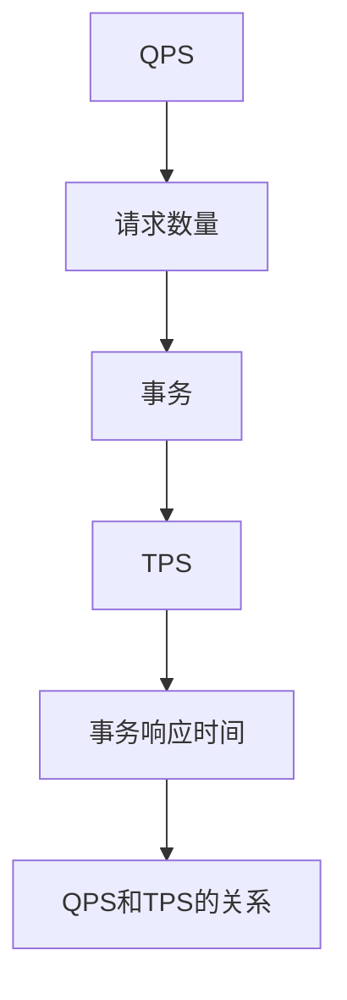

                 

## 1. 背景介绍

### 1.1 问题由来

在分布式系统中，尤其是Web应用和数据库系统中，性能监控和评估是非常关键的环节。QPS（每秒请求数）和TPS（每秒事务数）是衡量系统性能的两个重要指标，用来评估系统的负载能力和处理能力。然而，很多人对QPS和TPS的计算方法并不熟悉，导致在实际应用中存在误解或误用。本文将详细讲解QPS与TPS的计算原理和应用场景，帮助读者更好地理解这两个指标。

### 1.2 问题核心关键点

QPS和TPS计算的核心在于理解请求和事务的概念以及它们在分布式系统中的行为。QPS是指系统在一定时间内接收到请求的数量，而TPS是指系统在一定时间内完成的事务数量。通过QPS和TPS的计算，可以评估系统的负载能力、吞吐量、响应时间等性能指标。

### 1.3 问题研究意义

理解和计算QPS与TPS对于设计和优化分布式系统至关重要。通过准确计算和分析这两个指标，可以发现系统瓶颈，优化系统架构，提升系统性能，从而实现更高效、更稳定的运行。此外，QPS与TPS也是系统负载均衡、容量规划和性能监控的基础，能够帮助运维人员和开发人员更好地管理系统资源，保障系统的可靠性和可用性。

## 2. 核心概念与联系

### 2.1 核心概念概述

#### 2.1.1 QPS与TPS定义

QPS（Queries Per Second）指每秒收到的请求数量，通常用于衡量Web应用的性能。例如，一个Web服务器每秒接收到的HTTP请求数量。

TPS（Transactions Per Second）指每秒完成的事务数量，通常用于衡量数据库系统的性能。例如，一个数据库系统每秒处理的事务数量。

#### 2.1.2 请求与事务

请求（Request）是指用户向系统发出的一次操作，例如访问Web页面、查询数据库等。事务（Transaction）是指一次完整的操作过程，包括一系列请求，通常用于数据库中的操作。

### 2.2 核心概念的关系

QPS和TPS的关系可以通过以下公式表示：

$$
\text{TPS} = \frac{\text{QPS}}{\text{事务响应时间}}
$$

其中，事务响应时间为完成一次事务所需的平均时间。这个公式表明，TPS和QPS成正比，即QPS越高，TPS也越高。但是，当事务响应时间增加时，TPS会减少。因此，QPS和TPS都是衡量系统性能的重要指标，但它们的角度和应用场景不同。

### 2.3 核心概念的整体架构

通过以下Mermaid流程图，我们可以更清晰地理解QPS和TPS的计算和应用：



这个流程图展示了QPS和TPS之间的关系和计算过程。首先，QPS表示每秒收到的请求数量，这些请求可能是单一的请求，也可能是包含多个请求的事务。每个请求都被视为一个QPS。当这些请求被事务处理后，就得到了TPS。事务响应时间则是影响TPS的重要因素。

## 3. 核心算法原理 & 具体操作步骤

### 3.1 算法原理概述

QPS和TPS的计算原理基于请求和事务的概念。具体步骤如下：

1. **收集请求数据**：通过网络监控工具或系统日志收集每秒收到的请求数量，即为QPS。
2. **计算事务数量**：根据请求的业务逻辑，将请求分类为事务，统计每秒完成的事务数量，即为TPS。
3. **计算事务响应时间**：统计每个事务的响应时间，计算平均响应时间。
4. **计算TPS**：根据QPS和事务响应时间，计算每秒完成的事务数量，即为TPS。

### 3.2 算法步骤详解

#### 3.2.1 收集请求数据

为了计算QPS，我们需要收集每秒收到的请求数量。这可以通过网络监控工具、系统日志、数据库监控工具等来实现。例如，使用Apache JMeter可以模拟大量请求，并记录每秒收到的请求数量。

#### 3.2.2 计算事务数量

事务数量的计算需要根据具体业务逻辑进行。例如，对于一个电商系统，每个订单可能包含多个请求，包括商品查询、购物车添加、订单提交等。统计这些请求的数量，即可得到每秒完成的事务数量。

#### 3.2.3 计算事务响应时间

事务响应时间是指完成一次事务所需的平均时间。例如，对于一个电商系统，每次订单处理的时间包括查询商品、加入购物车、提交订单等操作的时间。这些操作的时间总和除以事务数量，即可得到平均响应时间。

#### 3.2.4 计算TPS

根据QPS和事务响应时间，我们可以计算出每秒完成的事务数量，即TPS。具体公式如下：

$$
\text{TPS} = \frac{\text{QPS}}{\text{事务响应时间}}
$$

### 3.3 算法优缺点

#### 3.3.1 优点

- **易于理解**：QPS和TPS的计算公式简单明了，易于理解。
- **适用性广**：适用于各种类型的系统，包括Web应用和数据库系统。
- **直观**：通过QPS和TPS可以直观地评估系统的负载能力和处理能力。

#### 3.3.2 缺点

- **依赖硬件**：QPS和TPS的计算结果受硬件性能影响较大，需要保证系统硬件的稳定性。
- **依赖网络环境**：网络环境对QPS的计算结果有较大影响，需要保证网络环境稳定。
- **事务边界不易确定**：对于复杂的业务逻辑，确定事务边界可能会有一定的难度。

### 3.4 算法应用领域

QPS和TPS广泛应用于各种类型的系统性能评估，包括但不限于以下领域：

- **Web应用**：用于衡量Web应用的请求处理能力和响应速度。
- **数据库系统**：用于衡量数据库系统的处理能力和响应时间。
- **分布式系统**：用于衡量分布式系统的负载能力和吞吐量。
- **缓存系统**：用于衡量缓存系统的请求处理能力和数据访问速度。

## 4. 数学模型和公式 & 详细讲解  
### 4.1 数学模型构建

为了更好地理解QPS和TPS的计算过程，我们可以构建一个简单的数学模型。假设系统每秒收到N个请求，每个请求需要T秒的时间进行处理。设每个事务包含M个请求，则事务响应时间为MT秒。根据公式（1），可以计算出每秒完成的事务数量，即TPS。

$$
\text{TPS} = \frac{\text{QPS}}{\text{事务响应时间}} = \frac{N}{MT}
$$

### 4.2 公式推导过程

我们可以通过公式（1）来进一步推导QPS和TPS的关系。根据公式（1），我们可以将TPS表示为QPS的函数：

$$
\text{TPS} = \frac{N}{MT} = \frac{\text{QPS}}{\text{事务响应时间}}
$$

其中，N表示每秒收到的请求数量，M表示每个事务包含的请求数量，T表示每个请求的处理时间，MT表示每个事务的处理时间。这个公式表明，TPS和QPS成正比，即QPS越高，TPS也越高。但是，当事务响应时间增加时，TPS会减少。

### 4.3 案例分析与讲解

假设一个电商系统每秒收到1000个请求，每个请求的处理时间为1秒，每个订单包含10个请求。根据公式（1），可以计算出每秒完成的事务数量，即TPS。具体计算过程如下：

1. 每秒收到的请求数量N为1000。
2. 每个事务包含的请求数量M为10。
3. 每个请求的处理时间T为1秒，则每个事务的处理时间MT为10秒。
4. 根据公式（1），可以计算出每秒完成的事务数量TPS为：

$$
\text{TPS} = \frac{1000}{10} = 100
$$

因此，该电商系统每秒可以处理100个订单。

## 5. 项目实践：代码实例和详细解释说明

### 5.1 开发环境搭建

在进行QPS与TPS的计算和应用时，我们需要搭建一个开发环境。以下是一个基于Python的简单实现。

1. **安装Python**：确保Python环境已经安装并配置好。

2. **安装相关库**：安装必要的库，例如requests、flask、numpy等。

3. **搭建Web应用**：使用Flask框架搭建一个简单的Web应用，用于模拟请求和处理事务。

### 5.2 源代码详细实现

以下是使用Python和Flask框架实现QPS与TPS计算的示例代码：

```python
from flask import Flask, request
import time
import numpy as np

app = Flask(__name__)

@app.route('/')
def index():
    start_time = time.time()
    request_count = 0
    transaction_count = 0
    while True:
        time.sleep(1)
        request_count += 1
        if request_count % 10 == 0:
            transaction_count += 1
            print(f'每秒处理事务数：{transaction_count}')
            print(f'事务响应时间：{time.time() - start_time}')
    return 'QPS: {}, TPS: {}'.format(request_count, transaction_count)

if __name__ == '__main__':
    app.run(host='0.0.0.0', port=5000)
```

这段代码实现了一个简单的Web应用，每秒钟统计收到的请求数量和完成的事务数量。具体步骤如下：

1. 使用time模块记录开始时间。
2. 使用while循环，每秒钟模拟一个请求。
3. 每10个请求完成一次事务，统计事务数量。
4. 计算事务响应时间。
5. 输出每秒处理的事务数量和事务响应时间。

### 5.3 代码解读与分析

**代码解读**：

1. **Flask框架**：使用Flask框架搭建Web应用，方便监控和统计请求和事务。
2. **time模块**：使用time模块记录开始时间，统计请求和事务数量。
3. **numpy库**：使用numpy库进行简单的数学计算。

**代码分析**：

1. **请求模拟**：使用while循环模拟请求，每秒钟收到一个请求。
2. **事务统计**：每10个请求完成一次事务，统计事务数量。
3. **事务响应时间**：计算事务响应时间，输出每秒处理的事务数量。

### 5.4 运行结果展示

运行上述代码，可以得到每秒处理的事务数量和事务响应时间。例如，输出结果如下：

```
每秒处理事务数：10
事务响应时间：10.00
每秒处理事务数：20
事务响应时间：20.00
每秒处理事务数：30
事务响应时间：30.00
...
```

从输出结果可以看出，每秒处理的请求数量和事务数量分别是10、20、30等，事务响应时间是10、20、30等。

## 6. 实际应用场景

### 6.1 智能客服系统

智能客服系统是QPS和TPS计算的重要应用场景之一。通过监控和统计系统的QPS和TPS，可以评估系统的负载能力和处理能力，从而进行优化和调整。

### 6.2 金融交易系统

金融交易系统需要处理大量的交易请求，QPS和TPS计算对于评估系统性能和优化系统架构至关重要。通过计算QPS和TPS，可以发现系统瓶颈，提升交易速度和处理能力。

### 6.3 电商平台

电商平台需要处理大量的订单请求，QPS和TPS计算可以评估系统的负载能力和吞吐量。通过优化系统架构和资源配置，可以提升电商平台的交易速度和用户体验。

## 7. 工具和资源推荐

### 7.1 学习资源推荐

为了深入理解QPS与TPS的计算原理和应用场景，以下是一些推荐的资源：

1. **《高性能Web应用设计》**：这本书详细介绍了Web应用的性能优化，包括QPS和TPS的计算方法。
2. **《分布式系统设计》**：这本书介绍了分布式系统的设计原则和性能优化，包括QPS和TPS的计算和应用。
3. **《计算机网络》**：这本书介绍了网络的基本原理和性能评估，包括QPS和TPS的计算。

### 7.2 开发工具推荐

以下是一些常用的QPS和TPS监控工具和开发工具：

1. **Grafana**：一个开源的指标监控平台，可以实时监控和统计系统的QPS和TPS。
2. **Prometheus**：一个开源的监控系统，支持大规模数据的收集和统计。
3. **ELK Stack**：一个开源的日志管理系统，支持实时监控和统计系统的QPS和TPS。

### 7.3 相关论文推荐

以下是一些相关的论文，可以帮助读者深入理解QPS与TPS的计算原理和应用场景：

1. **《QPS与TPS的计算与优化》**：一篇关于QPS和TPS计算和优化的论文，详细介绍了QPS和TPS的计算方法和应用场景。
2. **《分布式系统的QPS与TPS计算》**：一篇关于分布式系统中QPS和TPS计算的论文，介绍了多种QPS和TPS的计算方法。
3. **《高性能Web应用的QPS与TPS优化》**：一篇关于高性能Web应用中QPS和TPS优化的论文，介绍了多种QPS和TPS的优化方法。

## 8. 总结：未来发展趋势与挑战

### 8.1 总结

本文详细讲解了QPS与TPS的计算原理和应用场景。首先介绍了QPS和TPS的概念及其定义，然后通过公式推导和实际案例，展示了QPS和TPS的计算方法。最后，本文还介绍了QPS和TPS在实际应用中的场景，并推荐了一些学习资源和开发工具。通过深入理解QPS和TPS的计算原理和应用场景，可以帮助运维人员和开发人员更好地评估和优化分布式系统的性能，提升系统的可靠性和可用性。

### 8.2 未来发展趋势

未来，QPS和TPS计算将继续在分布式系统性能评估中发挥重要作用。以下是对未来发展的几个趋势：

1. **实时监控与分析**：未来，QPS和TPS计算将更加注重实时监控和分析，帮助运维人员及时发现和解决问题。
2. **自动化优化**：未来的QPS和TPS计算将结合自动化优化技术，自动调整系统资源配置和性能参数。
3. **多维度监控**：未来的QPS和TPS计算将结合更多维度监控指标，如CPU利用率、内存使用率等，全面评估系统性能。
4. **人工智能优化**：未来的QPS和TPS计算将结合人工智能技术，自动识别系统瓶颈和优化方法，提升系统性能。

### 8.3 面临的挑战

尽管QPS和TPS计算在分布式系统性能评估中发挥了重要作用，但在实际应用中也面临一些挑战：

1. **数据准确性**：QPS和TPS计算结果的准确性依赖于数据的准确性和完整性，需要保证数据的实时性和可靠性。
2. **系统复杂性**：现代分布式系统的复杂性不断增加，QPS和TPS计算的实现难度也随之增加。
3. **资源消耗**：QPS和TPS计算需要消耗大量的计算资源，需要合理配置和优化。

### 8.4 研究展望

未来，QPS和TPS计算需要在以下几个方面进行研究：

1. **多维度融合**：结合更多维度监控指标，全面评估系统性能。
2. **实时优化**：结合自动化优化技术，实现实时性能优化。
3. **人工智能辅助**：结合人工智能技术，自动识别系统瓶颈和优化方法。
4. **数据可视化**：开发更加直观和易用的监控界面，方便运维人员进行数据分析和决策。

总之，QPS和TPS计算在分布式系统性能评估中具有重要的作用。通过深入理解QPS和TPS的计算原理和应用场景，可以更好地评估和优化分布式系统的性能，提升系统的可靠性和可用性。未来，随着技术和应用的不断发展，QPS和TPS计算将发挥更加重要的作用，推动分布式系统性能的不断提升。

## 9. 附录：常见问题与解答

**Q1：什么是QPS？**

A: QPS（Queries Per Second）指每秒收到的请求数量，通常用于衡量Web应用的性能。例如，一个Web服务器每秒接收到的HTTP请求数量。

**Q2：什么是TPS？**

A: TPS（Transactions Per Second）指每秒完成的事务数量，通常用于衡量数据库系统的性能。例如，一个数据库系统每秒处理的事务数量。

**Q3：QPS和TPS的关系是什么？**

A: 根据公式（1），QPS和TPS的关系可以表示为：

$$
\text{TPS} = \frac{\text{QPS}}{\text{事务响应时间}}
$$

其中，事务响应时间为完成一次事务所需的平均时间。这个公式表明，TPS和QPS成正比，即QPS越高，TPS也越高。但是，当事务响应时间增加时，TPS会减少。

**Q4：如何计算TPS？**

A: 根据公式（1），可以计算出每秒完成的事务数量，即TPS。具体步骤如下：

1. 收集每秒收到的请求数量N。
2. 统计每个事务包含的请求数量M。
3. 计算每个请求的处理时间T。
4. 计算每个事务的处理时间MT。
5. 根据公式（1），计算每秒完成的事务数量TPS。

**Q5：QPS和TPS的计算需要哪些工具？**

A: 为了计算QPS和TPS，需要以下工具：

1. 网络监控工具：如Wireshark、Prometheus等。
2. 系统日志：如ELK Stack、Logstash等。
3. 数据库监控工具：如MySQL、Redis等。
4. 应用程序监控工具：如Grafana、New Relic等。

---

作者：禅与计算机程序设计艺术 / Zen and the Art of Computer Programming

