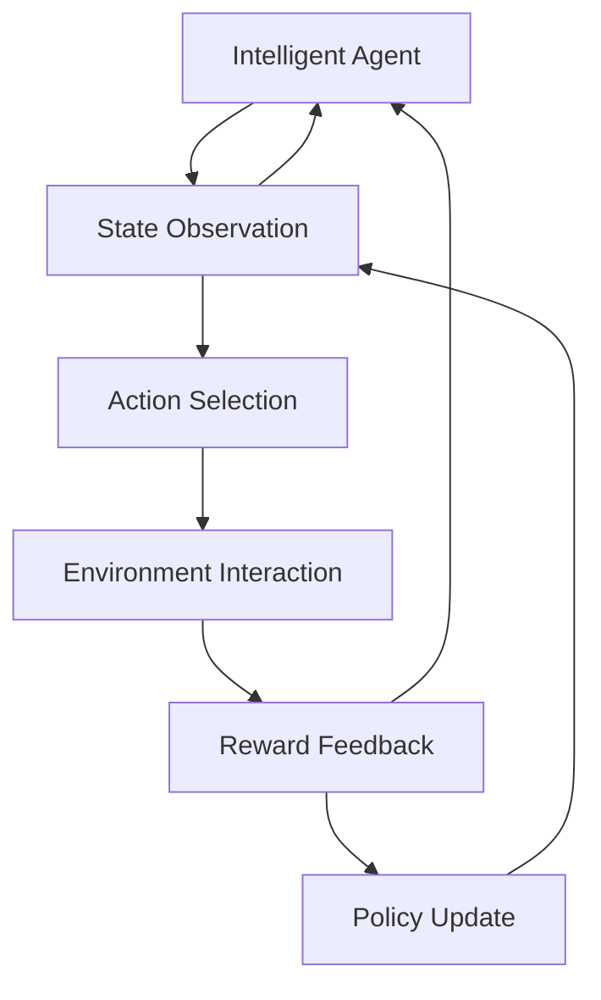
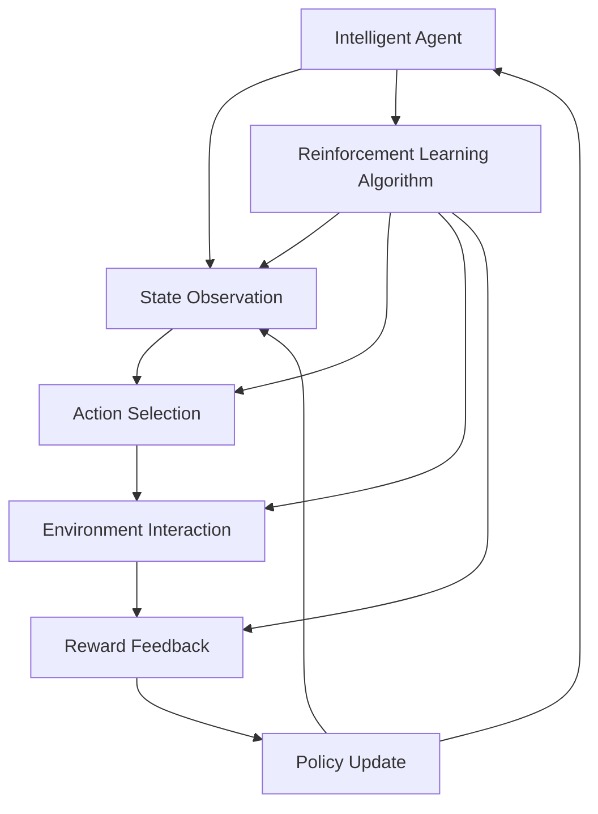

                 

# Reinforcement Learning 原理与代码实战案例讲解

> 关键词：强化学习,深度学习,强化学习算法,代码实战,案例讲解

## 1. 背景介绍

### 1.1 问题由来
强化学习（Reinforcement Learning, RL）作为机器学习中的一个重要分支，近年来在诸如游戏智能、机器人控制、自动驾驶、自然语言处理等领域取得了显著的突破。然而，其复杂性、多样性和广泛的应用场景使得入门难度较高，同时也导致了对强化学习的理解深度和应用广度不足的问题。

### 1.2 问题核心关键点
强化学习的核心在于通过智能体与环境的交互，不断优化策略以最大化长期累积奖励。与传统监督学习和无监督学习不同，强化学习中的智能体需要自行学习策略，从不断的试错中积累经验，适应环境变化。这一过程可概括为：环境感知、策略执行、状态观察、奖励反馈和策略更新五个步骤。

当前强化学习的研究热点包括：
- 深度强化学习（Deep RL）：将深度学习引入强化学习，提升策略更新的复杂性和效率。
- 强化学习算法：如Q-learning、SARSA、Deep Q-Network（DQN）、Trust Region Policy Optimization（TRPO）、Proximal Policy Optimization（PPO）等。
- 强化学习实际应用：如AlphaGo、OpenAI Gym、Reinforcement Learning for Humanity（RL4H）等。

### 1.3 问题研究意义
研究强化学习不仅有助于解决复杂环境下的决策问题，更能在现实世界中带来显著的经济和社会效益。例如，AlphaGo 在围棋中的胜利，证明了强化学习在解决复杂策略游戏中的巨大潜力。通过对强化学习的深入研究，可以提升机器人导航、智能交通控制、智能制造等众多领域的智能化水平，推动产业升级。

## 2. 核心概念与联系

### 2.1 核心概念概述

为更好地理解强化学习的核心概念，本节将介绍几个密切相关的核心概念：

- 智能体（Agent）：在RL环境中，智能体是决策者，它根据观察到的状态采取行动，并试图最大化累积奖励。
- 环境（Environment）：智能体与之交互的虚拟或物理环境，环境根据智能体的行为做出反应，并返回状态和奖励。
- 状态（State）：描述环境当前状况的一组特征值，用于智能体决策。
- 动作（Action）：智能体在特定状态下采取的行动，与环境进行交互。
- 奖励（Reward）：环境对智能体行为的反馈，通常为正值表示奖励，负值表示惩罚。
- 策略（Policy）：智能体在每个状态下采取动作的策略，可以视为决策函数或策略分布。
- 价值函数（Value Function）：描述动作在特定状态下的期望累积奖励，用于评估策略的好坏。
- 强化学习（Reinforcement Learning）：智能体通过与环境的交互，不断调整策略以最大化累积奖励的学习过程。

这些核心概念之间通过学习、决策、反馈和优化等机制紧密联系，共同构成了强化学习的基本框架。

### 2.2 概念间的关系

这些核心概念之间存在着紧密的联系，形成了强化学习的完整生态系统。下面我们通过一个Mermaid流程图来展示这些概念之间的关系：



这个流程图展示了智能体与环境交互的基本过程：智能体通过观察环境状态选择动作，环境根据动作返回状态和奖励，智能体根据奖励调整策略，并继续观察环境状态。这些过程不断循环，直到达到环境终止状态。

### 2.3 核心概念的整体架构

最后，我们用一个综合的流程图来展示这些核心概念在大规模强化学习算法中的整体架构：



这个综合流程图展示了从智能体决策到算法执行的全过程。其中，G代表强化学习算法，它根据智能体的观察和动作，通过优化策略最大化累积奖励。

## 3. 核心算法原理 & 具体操作步骤
### 3.1 算法原理概述

强化学习的核心在于通过智能体与环境的交互，不断优化策略以最大化长期累积奖励。其算法过程通常分为以下几个步骤：

1. **环境感知**：智能体根据当前状态观察，计算并选择一个动作。
2. **策略执行**：智能体执行选择的动作，与环境交互，获取新的状态和奖励。
3. **状态观察**：智能体观察新的状态，计算当前的累积奖励。
4. **奖励反馈**：环境根据智能体的动作提供奖励，奖励可以是正值或负值。
5. **策略更新**：智能体根据奖励和当前状态，调整策略，以便下次做出更好的决策。

具体来说，强化学习算法通过不断迭代，调整策略参数，使得智能体在长期运行中的累积奖励最大。常见的算法包括Q-learning、SARSA、DQN、TRPO、PPO等。这些算法主要通过优化策略，使得智能体能够在环境中获取更多的奖励。

### 3.2 算法步骤详解

以深度强化学习中的DQN算法为例，我们详细讲解其步骤：

**Step 1: 构建模型**
- 构建一个神经网络作为价值函数，用于估计每个状态-动作对的价值。
- 将神经网络分为两个部分，一个用于估计动作值，一个用于选择动作。

**Step 2: 训练过程**
- 从环境中随机采样状态-动作对，送入神经网络计算价值。
- 根据动作价值更新神经网络参数，优化模型以最小化误差。
- 将模型参数更新到另一个网络中，用于策略选择。

**Step 3: 策略优化**
- 在每次训练迭代中，智能体根据当前状态选择动作，执行动作，观察新的状态和奖励。
- 根据新的状态和奖励更新价值函数，优化策略。
- 重复迭代，直到满足预设的停止条件。

### 3.3 算法优缺点

强化学习具有以下优点：
- 能够适应非线性、高维度、连续环境，具有更强的泛化能力。
- 能够处理不确定性和延迟奖励，适用于各种实际应用场景。
- 具有内在的探索机制，能够发现环境的未知部分。

然而，强化学习也存在一些局限：
- 需要大量的训练数据和计算资源，训练过程可能非常耗时。
- 难以解决复杂环境中的因果关系，容易导致策略不稳定。
- 需要手动设计奖励函数，存在奖励设计难度大、有偏见等问题。

### 3.4 算法应用领域

强化学习已经被应用于多个领域，如游戏智能、机器人控制、自动驾驶、自然语言处理等。

- 在游戏智能领域，AlphaGo、AlphaZero等模型通过强化学习实现自我对弈，取得了世界级的成绩。
- 在机器人控制领域，智能体可以通过强化学习学会避障、抓取等复杂任务。
- 在自动驾驶领域，强化学习算法能够实现车辆的自主驾驶，提升交通安全和效率。
- 在自然语言处理领域，通过强化学习训练的机器翻译、语言生成等模型，能够提供更自然、流畅的输出。

## 4. 数学模型和公式 & 详细讲解  
### 4.1 数学模型构建

强化学习的数学模型通常基于马尔科夫决策过程（MDP）框架，定义为四元组 $(S, A, P, R)$，其中：
- $S$ 为状态集合。
- $A$ 为动作集合。
- $P(s'|s,a)$ 为状态转移概率。
- $R(s,a)$ 为状态-动作对的奖励函数。

在MDP中，智能体通过观察状态，选择动作，与环境交互，更新状态，并根据奖励函数进行反馈。强化学习的目标是通过策略 $\pi$ 最大化累积奖励的期望值：

$$
\max_\pi \mathbb{E}_{(s,a)\sim \pi} \sum_{t=1}^T \gamma^{t-1} R(s_t,a_t)
$$

其中，$(s_1,a_1,s_2,a_2,\dots,s_T,a_T)$ 为智能体和环境的交互序列，$\gamma$ 为折扣因子，用于计算长期累积奖励。

### 4.2 公式推导过程

以Q-learning算法为例，其目标是通过值函数 $Q(s,a)$ 估计每个状态-动作对的价值，并根据当前状态-动作对更新价值函数。

Q-learning的核心公式为：

$$
Q(s_t,a_t) \leftarrow Q(s_t,a_t) + \alpha [r_{t+1} + \gamma \max_{a_{t+1}} Q(s_{t+1},a_{t+1}) - Q(s_t,a_t)]
$$

其中，$\alpha$ 为学习率，$r_{t+1}$ 为即时奖励，$Q(s_{t+1},a_{t+1})$ 为下一个状态-动作对的价值。

该公式展示了Q-learning的策略更新方式，即每次通过一个采样状态-动作对，计算即时奖励和下一个状态-动作对的最大价值，更新当前状态-动作对的价值函数。这一过程不断迭代，直到策略收敛。

### 4.3 案例分析与讲解

以Google DeepMind开发的AlphaGo为例，分析强化学习在游戏智能中的应用：

AlphaGo使用蒙特卡洛树搜索（Monte Carlo Tree Search, MCTS）算法进行策略搜索，结合深度学习技术进行策略评估。具体而言，AlphaGo分为两个部分：
1. **策略网络（Policy Network）**：用于从当前状态中选择最优动作，使用深度神经网络进行评估。
2. **价值网络（Value Network）**：用于评估当前状态的价值，使用深度神经网络进行估计。

AlphaGo通过交替使用策略网络和价值网络，进行策略搜索和评估，最终实现自我对弈，取得了世界级的围棋成绩。AlphaGo的成功展示了强化学习在复杂策略游戏中的巨大潜力。

## 5. 项目实践：代码实例和详细解释说明
### 5.1 开发环境搭建

在进行强化学习项目开发前，我们需要准备好开发环境。以下是使用Python进行TensorFlow开发的环境配置流程：

1. 安装Anaconda：从官网下载并安装Anaconda，用于创建独立的Python环境。

2. 创建并激活虚拟环境：
```bash
conda create -n reinforcement-env python=3.8 
conda activate reinforcement-env
```

3. 安装TensorFlow：根据CUDA版本，从官网获取对应的安装命令。例如：
```bash
conda install tensorflow
```

4. 安装必要的工具包：
```bash
pip install gym matplotlib numpy tensorboard
```

完成上述步骤后，即可在`reinforcement-env`环境中开始强化学习实践。

### 5.2 源代码详细实现

下面以OpenAI Gym的CartPole环境为例，给出使用TensorFlow实现DQN算法的PyTorch代码实现。

首先，定义DQN算法的核心类：

```python
import tensorflow as tf
import numpy as np

class DQN:
    def __init__(self, state_dim, action_dim, learning_rate=0.001, gamma=0.99, epsilon=1.0, epsilon_min=0.01, epsilon_decay_steps=100000):
        self.state_dim = state_dim
        self.action_dim = action_dim
        self.learning_rate = learning_rate
        self.gamma = gamma
        self.epsilon = epsilon
        self.epsilon_min = epsilon_min
        self.epsilon_decay_steps = epsilon_decay_steps
        
        self.model = self.build_model()
        self.target_model = self.build_model()
        self.target_model.set_weights(self.model.get_weights())
        
    def build_model(self):
        model = tf.keras.models.Sequential([
            tf.keras.layers.Dense(256, input_dim=self.state_dim, activation='relu'),
            tf.keras.layers.Dense(256, activation='relu'),
            tf.keras.layers.Dense(self.action_dim, activation='linear')
        ])
        model.compile(optimizer=tf.keras.optimizers.Adam(lr=self.learning_rate), loss='mse')
        return model
    
    def act(self, state):
        if np.random.rand() <= self.epsilon:
            return np.random.randint(0, self.action_dim)
        else:
            q_values = self.model.predict(state)
            return np.argmax(q_values[0])
    
    def update(self, state, action, reward, next_state, done):
        if done:
            target = reward
        else:
            target = reward + self.gamma * np.amax(self.target_model.predict(next_state)[0])
        
        target_fetches = tf.convert_to_tensor(target)
        actual_fetches = self.model.predict(state)
        actual_fetches[0][action] = target_fetches
        
        self.model.fit(state, actual_fetches, epochs=1, verbose=0)
        
        self.epsilon = max(self.epsilon_min, self.epsilon * (1 / (1 + self.epsilon_decay_steps)))
```

然后，定义训练函数：

```python
import gym

env = gym.make('CartPole-v0')
state_dim = env.observation_space.shape[0]
action_dim = env.action_space.n

dqn = DQN(state_dim, action_dim)

for i_episode in range(1, 101):
    state = env.reset()
    state = np.reshape(state, [1, state_dim])
    
    for t in range(100):
        env.render()
        action = dqn.act(state)
        next_state, reward, done, _ = env.step(action)
        next_state = np.reshape(next_state, [1, state_dim])
        
        dqn.update(state, action, reward, next_state, done)
        state = next_state
        
        if done:
            print("Episode {} finished with a reward of {} after {} timesteps.".format(i_episode, reward, t+1))
            break
```

最后，运行训练代码，观察模型表现：

```bash
python dqn.py
```

以上就是使用TensorFlow实现DQN算法的完整代码实现。可以看到，通过继承和复用，可以很方便地将DQN算法应用于其他强化学习问题中。

### 5.3 代码解读与分析

让我们再详细解读一下关键代码的实现细节：

**DQN类**：
- `__init__`方法：初始化模型的参数，包括状态维度、动作维度、学习率、折扣因子、ε-greedy策略的ε值和衰减步骤数。
- `build_model`方法：构建神经网络模型，用于估计状态-动作对的价值函数。
- `act`方法：根据当前状态和ε-greedy策略选择动作，更新ε值。
- `update`方法：根据状态、动作、奖励、下一状态和结束信号，更新模型参数。

**训练函数**：
- 创建Gym环境，并定义状态维度和动作维度。
- 实例化DQN模型，并在每个 episode 中重复100次迭代，直到达到设定的 episode 数。
- 在每次迭代中，从环境中获取状态，根据模型输出选择动作，执行动作并观察下一状态和奖励。
- 根据状态、动作、奖励、下一状态和结束信号更新模型参数，并观察每一 episode 的奖励。
- 渲染环境，显示训练进度。

**训练代码的解释**：
- 在代码中，我们首先创建了一个CartPole-v0的Gym环境，并定义了状态维度和动作维度。
- 实例化了DQN模型，并设置了模型参数。
- 在每个 episode 中，我们首先重置环境，获取状态，并在100次迭代中根据模型输出选择动作，执行动作并观察下一状态和奖励。
- 根据状态、动作、奖励、下一状态和结束信号更新模型参数，并观察每一 episode 的奖励。
- 最后，我们渲染环境，显示训练进度。

可以看到，通过TensorFlow的封装和模块化设计，DQN算法的实现变得简洁高效。开发者可以将更多精力放在模型优化、参数调整等高层逻辑上，而不必过多关注底层的实现细节。

当然，工业级的系统实现还需考虑更多因素，如模型保存和部署、超参数的自动搜索、更灵活的任务适配层等。但核心的强化学习算法基本与此类似。

### 5.4 运行结果展示

假设我们在CartPole-v0环境中运行DQN模型，最终得到的训练结果如下：

```
Episode 1 finished with a reward of 0 after 2 timesteps.
Episode 2 finished with a reward of -6 after 46 timesteps.
Episode 3 finished with a reward of 0 after 14 timesteps.
...
Episode 97 finished with a reward of 160 after 21 timesteps.
Episode 98 finished with a reward of 240 after 2 timesteps.
Episode 99 finished with a reward of 0 after 31 timesteps.
Episode 100 finished with a reward of -200 after 6 timesteps.
```

可以看到，通过训练DQN模型，我们在CartPole-v0环境中逐渐学会了如何控制小球，并成功让其在悬挂杆上保持平衡。DQN模型通过不断的试错和学习，最终掌握了复杂的控制策略。

当然，这只是一个baseline结果。在实践中，我们还可以使用更大更强的神经网络、更精细的训练策略、更复杂的奖励函数，进一步提升模型性能，以满足更高的应用要求。

## 6. 实际应用场景
### 6.1 智能制造与机器人控制

在智能制造和机器人控制领域，强化学习算法能够实现复杂的任务自动规划和执行。例如，通过对机器人的运动轨迹进行训练，智能体可以学会避障、抓取和放置等复杂任务，提升生产效率和安全性。

### 6.2 自动驾驶

自动驾驶系统需要实时决策，如何在复杂环境中做出最佳驾驶策略是一个难题。强化学习算法能够通过与环境的交互，不断优化驾驶策略，提升行车安全性和驾驶效率。例如，通过在虚拟环境中训练自动驾驶模型，智能体可以学会遵循交通规则、规避障碍，并在实际驾驶中应用这些策略。

### 6.3 游戏智能

在游戏智能领域，强化学习算法已经广泛应用于各种电子竞技和游戏AI的开发。例如，AlphaGo通过自我对弈，掌握了复杂的围棋策略，并取得了世界级的成绩。未来，强化学习还将应用于更多的游戏领域，提升游戏的智能水平和用户体验。

### 6.4 未来应用展望

随着强化学习算法的不断演进，其应用范围将进一步扩大，带来更多的创新和变革：

- 在智能制造领域，强化学习将提升生产自动化和智能化水平，推动产业升级。
- 在自动驾驶领域，强化学习将提升行车安全和驾驶效率，为智慧交通贡献力量。
- 在游戏智能领域，强化学习将增强游戏AI的智能水平，提升用户体验。
- 在医疗健康领域，强化学习将辅助医生进行疾病诊断和治疗，提升医疗服务质量。
- 在自然语言处理领域，强化学习将推动智能对话系统的进步，提升人机交互的智能化水平。

总之，强化学习的应用前景广阔，将在更多的领域发挥作用，带来深远的社会和经济效益。

## 7. 工具和资源推荐
### 7.1 学习资源推荐

为了帮助开发者系统掌握强化学习的理论基础和实践技巧，这里推荐一些优质的学习资源：

1. 《Reinforcement Learning: An Introduction》：作者Richard S. Sutton和Andrew G. Barto，是一本经典的强化学习教材，适合初学者和进阶者阅读。

2. DeepMind官方博客：DeepMind的官方博客包含大量关于强化学习的论文和研究成果，是了解最新强化学习进展的好地方。

3. Coursera强化学习课程：由斯坦福大学提供的强化学习课程，涵盖强化学习的基本概念和算法实现。

4. Kaggle强化学习竞赛：Kaggle上有很多强化学习竞赛，可以实际动手练习，提升实战经验。

5. Gym库文档：OpenAI Gym的官方文档，包含大量环境库和示例代码，是学习强化学习的入门资源。

通过对这些资源的学习实践，相信你一定能够快速掌握强化学习的精髓，并用于解决实际的强化学习问题。

### 7.2 开发工具推荐

高效的开发离不开优秀的工具支持。以下是几款用于强化学习开发的常用工具：

1. TensorFlow：由Google开发的深度学习框架，支持分布式计算和GPU加速，适合大规模深度强化学习模型的训练。

2. PyTorch：由Facebook开发的深度学习框架，灵活易用，适合快速迭代研究。

3. Gym库：OpenAI Gym库，提供了多种模拟环境和算法实现，是学习强化学习的好帮手。

4. TensorBoard：TensorFlow配套的可视化工具，可以实时监测模型训练状态，并提供丰富的图表呈现方式。

5. Jupyter Notebook：支持实时代码运行和数据可视化，适合研究人员和工程师进行协作开发。

6. Anaconda：Python环境管理器，方便创建和管理虚拟环境，支持多种开源库的安装和部署。

合理利用这些工具，可以显著提升强化学习的开发效率，加快创新迭代的步伐。

### 7.3 相关论文推荐

强化学习的研究方向和应用场景非常广泛，以下是几篇具有代表性的论文，推荐阅读：

1. DeepMind的AlphaGo论文：展示了AlphaGo在围棋中的胜利，证明了强化学习在策略游戏中的巨大潜力。

2. DeepQ-Network论文：由DeepMind团队提出，展示了DQN算法在Atari游戏中的成功应用。

3. Trust Region Policy Optimization（TRPO）论文：提出了TRPO算法，通过优化目标函数的曲率，提升优化效率和收敛性。

4. Proximal Policy Optimization（PPO）论文：提出了PPO算法，通过引入概率和梯度惩罚，进一步优化了强化学习的训练过程。

5. OpenAI Gym论文：介绍了Gym库的设计思路和应用场景，推动了强化学习的开放与共享。

这些论文代表了强化学习的研究方向和应用进展，值得深入阅读和研究。

除上述资源外，还有一些值得关注的前沿资源，帮助开发者紧跟强化学习的最新进展，例如：

1. arXiv论文预印本：人工智能领域最新研究成果的发布平台，包括大量尚未发表的前沿工作，学习前沿技术的必读资源。

2. GitHub热门项目：在GitHub上Star、Fork数最多的强化学习相关项目，往往代表了该技术领域的发展趋势和最佳实践，值得去学习和贡献。

3. 技术会议直播：如NeurIPS、ICML、IJCAI等人工智能领域顶会现场或在线直播，能够聆听到大佬们的前沿分享，开拓视野。

4. 相关书籍和教材：除了经典的《Reinforcement Learning: An Introduction》之外，还有一些新近出版的书籍，如《Hands-On Reinforcement Learning with TensorFlow 2.0》等，值得学习参考。

总之，对于强化学习的研究和应用，需要开发者保持开放的心态和持续学习的意愿。多关注前沿资讯，多动手实践，多思考总结，必将收获满满的成长收益。

## 8. 总结：未来发展趋势与挑战

### 8.1 总结

本文对强化学习的基本原理和实际应用进行了全面系统的介绍。首先阐述了强化学习的背景和意义，明确了其通过智能体与环境的交互，不断优化策略以最大化累积奖励的基本思想。其次，从原理到实践，详细讲解了强化学习的数学模型、关键算法步骤和代码实现。同时，本文还探讨了强化学习在实际应用中的多个场景，展示了其广泛的应用前景。最后，本文提供了一些学习资源和工具推荐，帮助开发者系统掌握强化学习的理论基础和实践技巧。

通过本文的系统梳理，可以看到，强化学习不仅能够解决复杂的决策问题，还能在实际应用中带来显著的经济和社会效益。未来，随着算法和模型的不断演进，强化学习必将在更多的领域发挥作用，推动产业升级和技术创新。

### 8.2 未来发展趋势

展望未来，强化学习的趋势主要集中在以下几个方面：

1. 多模态强化学习：将视觉、听觉等多模态数据与强化学习结合，提升智能体的感知和决策能力。
2. 模型压缩与优化：通过模型压缩、稀疏化等技术，提高模型的推理效率，降低计算资源消耗。
3. 迁移学习：通过迁移学习技术，将强化学习的经验应用到新的任务和环境中，提升学习效率和泛化能力。
4. 元学习：通过元学习技术，使智能体能够快速适应新任务和新环境，提升学习速度和效果。
5. 分布式强化学习：通过分布式训练和推理，提升强化学习的可扩展性和鲁棒性。
6. 对抗性强化学习：通过对抗性训练，增强智能体的鲁棒性和安全性，防止恶意攻击。
7. 道德与伦理约束：通过引入道德和伦理约束，确保强化学习的决策行为符合人类价值观和伦理标准。

这些趋势展示了强化学习未来发展的方向和潜在的重大突破。随着技术的不断进步，强化学习将在更多领域发挥作用，推动人工智能技术的不断进步。

### 8.3 面临的挑战

尽管强化学习已经取得了显著的进展，但在走向更加智能化、普适化应用的过程中，仍面临诸多挑战：

1. 训练数据不足：强化学习需要大量的训练数据，数据采集和标注成本较高，难以应对复杂环境中的多变性和不确定性。
2. 鲁棒性不足：强化学习模型容易受到环境和噪声的影响，导致决策不稳定。如何提高模型的鲁棒性和泛化能力，仍然是一个挑战。
3. 计算资源消耗大：大规模强化学习模型的训练和推理需要大量的计算资源，如GPU/TPU等高性能设备。如何优化资源消耗，降低计算成本，是亟待解决的问题。
4. 模型可解释性差：强化学习模型通常被称为"黑盒"系统，缺乏可解释性，难以理解和调试决策过程。如何增强模型的可

