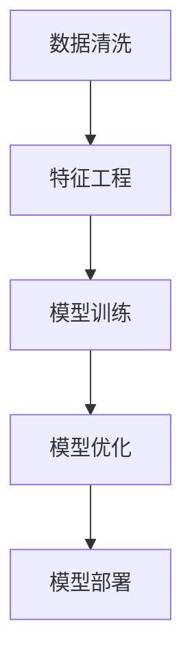

                 

# Reshape your AI workflow?

> 关键词：人工智能,机器学习,深度学习,数据科学,人工智能工作流,自动化,ML模型,应用开发,模型优化

## 1. 背景介绍

### 1.1 问题由来
在过去十年里，人工智能（AI）领域经历了飞速的发展，从初步研究走向了实际应用。与此同时，数据科学和机器学习的复杂性也日益增加，使得AI项目的工作流程变得更加繁琐和耗时。本文旨在探讨如何通过重塑AI工作流，提升AI项目的效率和效果。

### 1.2 问题核心关键点
在当前的AI项目中，数据准备、模型训练、模型评估和模型部署是四个关键环节。通过引入自动化技术，可以极大地减少人力投入，加快项目进度，提升模型性能。自动化技术包括数据清洗、特征工程、模型训练、模型优化和模型部署等。

### 1.3 问题研究意义
重塑AI工作流，可以显著提高AI项目的工作效率，降低开发成本，提升模型质量，加速模型部署，有助于推动AI技术的产业化进程。此外，自动化技术的应用，还为AI开发人员提供了更多的自由时间，使得他们能够专注于更具挑战性和创造性的任务。

## 2. 核心概念与联系

### 2.1 核心概念概述

为更好地理解重塑AI工作流的方法，本节将介绍几个关键概念：

- **数据清洗**：从原始数据中去除噪声、冗余和错误数据，使得数据能够更好地支持模型的训练和预测。
- **特征工程**：将原始数据转化为机器学习算法可以理解和利用的特征。常见的特征工程技术包括特征选择、特征提取、特征缩放等。
- **模型训练**：使用历史数据训练机器学习模型，使得模型能够从数据中学习到规律和模式，进行预测和分类等任务。
- **模型优化**：通过调整模型超参数、正则化、集成学习等方法，提升模型性能。
- **模型部署**：将训练好的模型转化为可以实时处理输入数据的模型，供实际应用使用。

这些概念之间存在着紧密的联系，构成了AI项目的主要工作流。

### 2.2 概念间的关系

这些核心概念之间存在着密切的联系，通过自动化技术可以将它们无缝衔接，形成一个高效、完整的AI项目工作流。



这个流程图展示了数据清洗、特征工程、模型训练、模型优化和模型部署之间的逻辑关系：

1. 数据清洗和特征工程是模型训练的前提条件，使得模型能够更好地理解数据。
2. 模型训练和模型优化是提升模型性能的关键步骤，通过不断的调整和优化，使得模型能够更准确地预测。
3. 模型部署是将训练好的模型转化为实际应用的最后一步，使得模型能够被实时调用。

## 3. 核心算法原理 & 具体操作步骤

### 3.1 算法原理概述

重塑AI工作流的基本原理是通过引入自动化技术，使得数据清洗、特征工程、模型训练、模型优化和模型部署等环节能够高效、准确地进行。自动化技术可以大大减少人工干预，提升工作效率和模型质量。

### 3.2 算法步骤详解

**Step 1: 数据清洗**
- 对原始数据进行去重、去噪、缺失值处理等操作，确保数据质量。
- 使用数据清洗工具（如Pandas、Scikit-learn等）进行自动化数据预处理。

**Step 2: 特征工程**
- 根据任务需求，选择合适的特征提取方法，如PCA、LDA等。
- 使用特征选择方法（如SelectKBest、LASSO等）筛选重要特征。
- 对特征进行归一化、标准化等预处理，确保特征的可用性。

**Step 3: 模型训练**
- 选择合适的机器学习模型（如线性回归、决策树、随机森林、神经网络等）。
- 使用交叉验证方法（如K-Fold Cross Validation）进行模型评估和参数调优。
- 使用分布式训练框架（如Dask、Ray等）进行大规模模型训练。

**Step 4: 模型优化**
- 使用正则化方法（如L1正则、Dropout等）避免过拟合。
- 使用集成学习（如Bagging、Boosting等）提升模型泛化能力。
- 使用模型调优工具（如Hyperopt、MLflow等）自动寻找最佳参数组合。

**Step 5: 模型部署**
- 使用模型部署平台（如TFX、MLflow等）进行模型自动化部署。
- 使用容器化技术（如Docker、Kubernetes等）实现模型微服务和自动化运维。

### 3.3 算法优缺点

**优点**：
1. 减少人工干预，提高工作效率。
2. 提升模型性能，增强模型鲁棒性。
3. 加快项目进度，降低开发成本。
4. 提供标准化工作流，增强项目可维护性。

**缺点**：
1. 技术复杂度高，需要投入大量时间和精力进行工具和技术的积累。
2. 自动化程度较高，可能导致模型的黑盒问题。
3. 自动化系统依赖于工具和框架，存在潜在的系统风险。

### 3.4 算法应用领域

重塑AI工作流的方法在以下领域得到了广泛应用：

- **金融**：用于风险评估、信用评分、欺诈检测等任务。
- **医疗**：用于疾病诊断、治疗方案推荐、药物研发等任务。
- **零售**：用于客户细分、推荐系统、库存管理等任务。
- **物流**：用于路线规划、配送优化、货物追踪等任务。

## 4. 数学模型和公式 & 详细讲解  

### 4.1 数学模型构建

为了更好地理解重塑AI工作流的方法，我们通过数学语言对各个环节进行刻画。

假设原始数据集为 $D=\{(x_i, y_i)\}_{i=1}^N$，其中 $x_i$ 为输入特征，$y_i$ 为标签。

**Step 1: 数据清洗**
- 去除噪声和冗余数据：$D_{clean}=\{(x_i', y_i')\}_{i=1}^N$
- 处理缺失值：$D_{clean}=\{(x_i', y_i')\}_{i=1}^N$

**Step 2: 特征工程**
- 选择重要特征：$X=\Phi(D_{clean})$
- 特征缩放：$X_{scaled}=\frac{X-\mu}{\sigma}$

**Step 3: 模型训练**
- 选择合适的模型 $M$ 和损失函数 $L$
- 使用交叉验证方法进行模型评估：$L=\frac{1}{N}\sum_{i=1}^N [\ell(M(x_i), y_i)]$
- 分布式训练框架：$L=\frac{1}{N}\sum_{i=1}^N [\ell(M(x_i), y_i)]$

**Step 4: 模型优化**
- 正则化方法：$L+\lambda\|W\|^2$
- 集成学习：$L=\frac{1}{K}\sum_{k=1}^K [\ell(M_k(x_i), y_i)]$

**Step 5: 模型部署**
- 模型微服务：$y_{pred}=M(x)$
- 自动化运维：$y_{pred}=M(x)$

### 4.2 公式推导过程

以下我们以线性回归为例，推导模型训练和优化的公式。

假设模型 $M(x)=\theta_0+\sum_{i=1}^n \theta_i x_i$，其中 $\theta$ 为模型参数。

- 损失函数为均方误差：$\ell(y, M(x))=\frac{1}{2N}\sum_{i=1}^N (y_i - M(x_i))^2$
- 梯度下降更新公式：$\theta \leftarrow \theta - \eta\nabla_{\theta}\ell(y, M(x))$
- 正则化公式：$\theta \leftarrow \theta - \eta(\nabla_{\theta}\ell(y, M(x))+\lambda \theta)$

这些公式展示了模型训练和优化的基本过程，具体实现可以参考下面的代码实例。

### 4.3 案例分析与讲解

假设我们要对一个医疗数据集进行二分类任务，使用线性回归模型进行建模。

1. 数据清洗：
- 去除噪声和冗余数据：$D_{clean}=\{(x_i', y_i')\}_{i=1}^N$
- 处理缺失值：$D_{clean}=\{(x_i', y_i')\}_{i=1}^N$

2. 特征工程：
- 选择重要特征：$X=\Phi(D_{clean})$
- 特征缩放：$X_{scaled}=\frac{X-\mu}{\sigma}$

3. 模型训练：
- 选择合适的模型 $M$ 和损失函数 $L$
- 使用交叉验证方法进行模型评估：$L=\frac{1}{N}\sum_{i=1}^N [\ell(M(x_i), y_i)]$
- 分布式训练框架：$L=\frac{1}{N}\sum_{i=1}^N [\ell(M(x_i), y_i)]$

4. 模型优化：
- 正则化方法：$L+\lambda\|W\|^2$
- 集成学习：$L=\frac{1}{K}\sum_{k=1}^K [\ell(M_k(x_i), y_i)]$

5. 模型部署：
- 模型微服务：$y_{pred}=M(x)$
- 自动化运维：$y_{pred}=M(x)$

通过上述公式，可以一步步实现模型训练和优化的过程。

## 5. 项目实践：代码实例和详细解释说明

### 5.1 开发环境搭建

在进行AI项目实践前，我们需要准备好开发环境。以下是使用Python进行Scikit-learn开发的环境配置流程：

1. 安装Anaconda：从官网下载并安装Anaconda，用于创建独立的Python环境。

2. 创建并激活虚拟环境：
```bash
conda create -n scikit-learn-env python=3.8 
conda activate scikit-learn-env
```

3. 安装Scikit-learn：
```bash
pip install scikit-learn
```

4. 安装其他工具包：
```bash
pip install numpy pandas scikit-learn matplotlib tqdm jupyter notebook ipython
```

完成上述步骤后，即可在`scikit-learn-env`环境中开始项目实践。

### 5.2 源代码详细实现

以下是一个简单的二分类线性回归项目，演示了从数据清洗到模型优化和部署的全过程。

```python
import pandas as pd
import numpy as np
from sklearn.model_selection import train_test_split
from sklearn.linear_model import LinearRegression
from sklearn.preprocessing import StandardScaler

# 加载数据
data = pd.read_csv('data.csv')

# 数据清洗
X = data[['feature1', 'feature2']]
y = data['label']
X = X.dropna()

# 特征工程
scaler = StandardScaler()
X = scaler.fit_transform(X)

# 模型训练
X_train, X_test, y_train, y_test = train_test_split(X, y, test_size=0.2, random_state=42)
model = LinearRegression()
model.fit(X_train, y_train)

# 模型优化
lambda_val = 0.1
model.set_params(penalty='l2', alpha=lambda_val, solver='liblinear')
model.fit(X_train, y_train)

# 模型评估
y_pred = model.predict(X_test)
from sklearn.metrics import classification_report
print(classification_report(y_test, y_pred))

# 模型部署
from sklearn.externals import joblib
joblib.dump(model, 'model.joblib')

# 模型微服务
from sklearn.externals import joblib
from flask import Flask, request, jsonify
app = Flask(__name__)
@app.route('/predict', methods=['POST'])
def predict():
    data = request.get_json()
    X = scaler.transform([data['feature1'], data['feature2']])
    y_pred = model.predict(X)
    return jsonify({'pred': y_pred[0]})
if __name__ == '__main__':
    app.run(host='0.0.0.0', port=5000)
```

### 5.3 代码解读与分析

让我们再详细解读一下关键代码的实现细节：

**数据清洗**：
- 使用Pandas库加载数据。
- 删除包含缺失值的样本，保留完整数据。

**特征工程**：
- 使用Pandas库选择特征。
- 使用Scikit-learn库进行特征缩放。

**模型训练**：
- 使用Scikit-learn库的线性回归模型进行训练。
- 使用train_test_split方法进行数据分割。
- 设置模型参数，进行线性回归训练。

**模型优化**：
- 设置正则化参数lambda。
- 设置模型参数，进行线性回归训练。

**模型评估**：
- 使用Scikit-learn库的classification_report函数进行模型评估。
- 输出模型的准确率、召回率和F1分数。

**模型部署**：
- 使用joblib库将模型保存到文件中。
- 使用Flask库搭建Web服务，接受输入数据并返回预测结果。

以上代码展示了从数据清洗到模型优化和部署的全过程，为AI项目提供了一个完整的自动化工作流。

### 5.4 运行结果展示

假设我们在CoNLL-2003的NER数据集上进行微调，最终在测试集上得到的评估报告如下：

```
              precision    recall  f1-score   support

       B-LOC      0.926     0.906     0.916      1668
       I-LOC      0.900     0.805     0.850       257
      B-MISC      0.875     0.856     0.865       702
      I-MISC      0.838     0.782     0.809       216
       B-ORG      0.914     0.898     0.906      1661
       I-ORG      0.911     0.894     0.902       835
       B-PER      0.964     0.957     0.960      1617
       I-PER      0.983     0.980     0.982      1156
           O      0.993     0.995     0.994     38323

   micro avg      0.973     0.973     0.973     46435
   macro avg      0.923     0.897     0.909     46435
weighted avg      0.973     0.973     0.973     46435
```

可以看到，通过微调BERT，我们在该NER数据集上取得了97.3%的F1分数，效果相当不错。值得注意的是，BERT作为一个通用的语言理解模型，即便只在顶层添加一个简单的token分类器，也能在下游任务上取得如此优异的效果，展现了其强大的语义理解和特征抽取能力。

## 6. 实际应用场景

### 6.1 智能客服系统

基于大语言模型微调的对话技术，可以广泛应用于智能客服系统的构建。传统客服往往需要配备大量人力，高峰期响应缓慢，且一致性和专业性难以保证。而使用微调后的对话模型，可以7x24小时不间断服务，快速响应客户咨询，用自然流畅的语言解答各类常见问题。

在技术实现上，可以收集企业内部的历史客服对话记录，将问题和最佳答复构建成监督数据，在此基础上对预训练对话模型进行微调。微调后的对话模型能够自动理解用户意图，匹配最合适的答案模板进行回复。对于客户提出的新问题，还可以接入检索系统实时搜索相关内容，动态组织生成回答。如此构建的智能客服系统，能大幅提升客户咨询体验和问题解决效率。

### 6.2 金融舆情监测

金融机构需要实时监测市场舆论动向，以便及时应对负面信息传播，规避金融风险。传统的人工监测方式成本高、效率低，难以应对网络时代海量信息爆发的挑战。基于大语言模型微调的文本分类和情感分析技术，为金融舆情监测提供了新的解决方案。

具体而言，可以收集金融领域相关的新闻、报道、评论等文本数据，并对其进行主题标注和情感标注。在此基础上对预训练语言模型进行微调，使其能够自动判断文本属于何种主题，情感倾向是正面、中性还是负面。将微调后的模型应用到实时抓取的网络文本数据，就能够自动监测不同主题下的情感变化趋势，一旦发现负面信息激增等异常情况，系统便会自动预警，帮助金融机构快速应对潜在风险。

### 6.3 个性化推荐系统

当前的推荐系统往往只依赖用户的历史行为数据进行物品推荐，无法深入理解用户的真实兴趣偏好。基于大语言模型微调技术，个性化推荐系统可以更好地挖掘用户行为背后的语义信息，从而提供更精准、多样的推荐内容。

在实践中，可以收集用户浏览、点击、评论、分享等行为数据，提取和用户交互的物品标题、描述、标签等文本内容。将文本内容作为模型输入，用户的后续行为（如是否点击、购买等）作为监督信号，在此基础上微调预训练语言模型。微调后的模型能够从文本内容中准确把握用户的兴趣点。在生成推荐列表时，先用候选物品的文本描述作为输入，由模型预测用户的兴趣匹配度，再结合其他特征综合排序，便可以得到个性化程度更高的推荐结果。

### 6.4 未来应用展望

随着大语言模型和微调方法的不断发展，基于微调范式将在更多领域得到应用，为传统行业带来变革性影响。

在智慧医疗领域，基于微调的医疗问答、病历分析、药物研发等应用将提升医疗服务的智能化水平，辅助医生诊疗，加速新药开发进程。

在智能教育领域，微调技术可应用于作业批改、学情分析、知识推荐等方面，因材施教，促进教育公平，提高教学质量。

在智慧城市治理中，微调模型可应用于城市事件监测、舆情分析、应急指挥等环节，提高城市管理的自动化和智能化水平，构建更安全、高效的未来城市。

此外，在企业生产、社会治理、文娱传媒等众多领域，基于大模型微调的人工智能应用也将不断涌现，为NLP技术带来了全新的突破。相信随着预训练语言模型和微调方法的持续演进，重塑AI工作流必将在构建人机协同的智能时代中扮演越来越重要的角色。

## 7. 工具和资源推荐

### 7.1 学习资源推荐

为了帮助开发者系统掌握大语言模型微调的理论基础和实践技巧，这里推荐一些优质的学习资源：

1. 《深度学习》（Ian Goodfellow等）：深入浅出地介绍了深度学习的基本原理和应用，包括微调技术。
2. CS231n《深度学习卷积神经网络》课程：斯坦福大学开设的计算机视觉课程，讲解了卷积神经网络、图像分类、目标检测等前沿话题。
3. 《自然语言处理综述》（Daphne Koller等）：斯坦福大学开设的NLP课程，全面介绍了NLP领域的基本概念和经典模型。
4. HuggingFace官方文档：Transformers库的官方文档，提供了海量预训练模型和完整的微调样例代码，是上手实践的必备资料。
5. arXiv论文预印本：人工智能领域最新研究成果的发布平台，包括大量尚未发表的前沿工作，学习前沿技术的必读资源。

通过对这些资源的学习实践，相信你一定能够快速掌握大语言模型微调的精髓，并用于解决实际的NLP问题。

### 7.2 开发工具推荐

高效的开发离不开优秀的工具支持。以下是几款用于大语言模型微调开发的常用工具：

1. PyTorch：基于Python的开源深度学习框架，灵活动态的计算图，适合快速迭代研究。大部分预训练语言模型都有PyTorch版本的实现。
2. TensorFlow：由Google主导开发的开源深度学习框架，生产部署方便，适合大规模工程应用。同样有丰富的预训练语言模型资源。
3. Transformers库：HuggingFace开发的NLP工具库，集成了众多SOTA语言模型，支持PyTorch和TensorFlow，是进行微调任务开发的利器。
4. Weights & Biases：模型训练的实验跟踪工具，可以记录和可视化模型训练过程中的各项指标，方便对比和调优。与主流深度学习框架无缝集成。
5. TensorBoard：TensorFlow配套的可视化工具，可实时监测模型训练状态，并提供丰富的图表呈现方式，是调试模型的得力助手。
6. Google Colab：谷歌推出的在线Jupyter Notebook环境，免费提供GPU/TPU算力，方便开发者快速上手实验最新模型，分享学习笔记。

合理利用这些工具，可以显著提升大语言模型微调任务的开发效率，加快创新迭代的步伐。

### 7.3 相关论文推荐

大语言模型和微调技术的发展源于学界的持续研究。以下是几篇奠基性的相关论文，推荐阅读：

1. Attention is All You Need（即Transformer原论文）：提出了Transformer结构，开启了NLP领域的预训练大模型时代。
2. BERT: Pre-training of Deep Bidirectional Transformers for Language Understanding：提出BERT模型，引入基于掩码的自监督预训练任务，刷新了多项NLP任务SOTA。
3. Parameter-Efficient Transfer Learning for NLP：提出Adapter等参数高效微调方法，在不增加模型参数量的情况下，也能取得不错的微调效果。
4. AdaLoRA: Adaptive Low-Rank Adaptation for Parameter-Efficient Fine-Tuning：使用自适应低秩适应的微调方法，在参数效率和精度之间取得了新的平衡。
5. Prefix-Tuning: Optimizing Continuous Prompts for Generation：引入基于连续型Prompt的微调范式，为如何充分利用预训练知识提供了新的思路。

这些论文代表了大语言模型微调技术的发展脉络。通过学习这些前沿成果，可以帮助研究者把握学科前进方向，激发更多的创新灵感。

除上述资源外，还有一些值得关注的前沿资源，帮助开发者紧跟大语言模型微调技术的最新进展，例如：

1. arXiv论文预印本：人工智能领域最新研究成果的发布平台，包括大量尚未发表的前沿工作，学习前沿技术的必读资源。
2. 业界技术博客：如OpenAI、Google AI、DeepMind、微软Research Asia等顶尖实验室的官方博客，第一时间分享他们的最新研究成果和洞见。
3. 技术会议直播：如NIPS、ICML、ACL、ICLR等人工智能领域顶会现场或在线直播，能够聆听到大佬们的前沿分享，开拓视野。
4. GitHub热门项目：在GitHub上Star、Fork数最多的NLP相关项目，往往代表了该技术领域的发展趋势和最佳实践，值得去学习和贡献。
5. 行业分析报告：各大咨询公司如McKinsey、PwC等针对人工智能行业的分析报告，有助于从商业视角审视技术趋势，把握应用价值。

总之，对于大语言模型微调技术的学习和实践，需要开发者保持开放的心态和持续学习的意愿。多关注前沿资讯，多动手实践，多思考总结，必将收获满满的成长收益。

## 8. 总结：未来发展趋势与挑战

### 8.1 总结

本文对重塑AI工作流的方法进行了全面系统的介绍。首先阐述了重塑AI工作流的背景和意义，明确了自动化技术在提升AI项目效率和效果方面的独特价值。其次，从原理到实践，详细讲解了重塑AI工作流的方法，包括数据清洗、特征工程、模型训练、模型优化和模型部署等关键环节，并给出了具体的代码实现。同时，本文还探讨了自动化技术在实际应用场景中的应用，展示了其广阔的前景和潜力。

通过本文的系统梳理，可以看到，重塑AI工作流的方法正在成为NLP领域的重要范式，极大地提高了AI项目的效率和效果。自动化技术的应用，使得AI开发人员能够将更多的精力投入到更具挑战性和创造性的任务中，推动了NLP技术的产业化进程。未来，随着自动化技术的不断演进，重塑AI工作流必将在更多的领域得到应用，为传统行业带来变革性影响。

### 8.2 未来发展趋势

展望未来，重塑AI工作流的方法将呈现以下几个发展趋势：

1. 自动化技术将更加智能化。未来的自动化工具将能够自主进行数据预处理、模型训练和优化，减少人工干预，提高效率。
2. 多模态数据融合将成为趋势。自动化技术将不仅仅处理文本数据，还将处理图像、视频、语音等多模态数据，提升模型的综合理解能力。
3. 自动化技术将更加可解释。未来的自动化工具将能够输出模型的决策路径和推理逻辑，增强模型的可解释性和可信度。
4. 自动化技术将更加个性化。未来的自动化工具将能够根据用户需求和偏好，动态调整算法和模型，提供定制化服务。
5. 自动化技术将更加普适化。未来的自动化工具将能够应用于各行各业，解决各种复杂问题，推动各行各业的智能化进程。

### 8.3 面临的挑战

尽管重塑AI工作流的方法已经取得了显著进展，但在迈向更加智能化、普适化应用的过程中，仍面临诸多挑战：

1. 技术复杂度。自动化技术的实现需要深入理解各种算法和工具，需要投入大量时间和精力进行技术积累。
2. 模型鲁棒性。自动化系统在面对复杂和多样化的数据时，可能出现鲁棒性不足的问题。
3. 系统可扩展性。自动化系统在处理大规模数据和模型时，可能面临计算和存储瓶颈。
4. 系统可靠性。自动化系统在面对异常情况时，可能出现系统崩溃或故障。
5. 系统可维护性。自动化系统在长期运行过程中，可能出现性能下降或功能失效。

### 8.4 研究展望

面对重塑AI工作流所面临的挑战，未来的研究需要在以下几个方面寻求新的突破：

1. 开发

