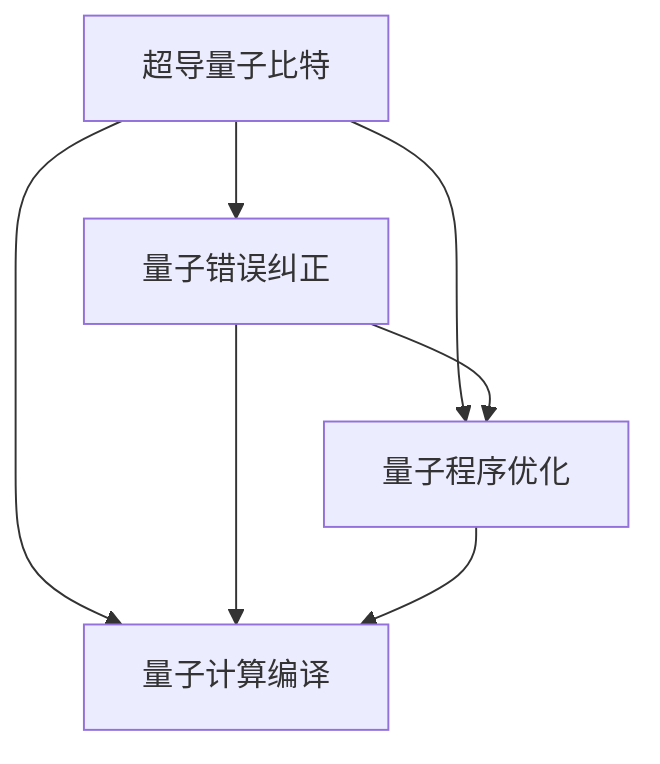
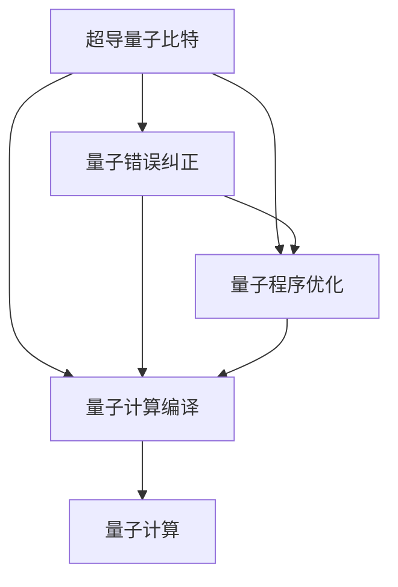

                 

# Sora模型的基本粒子化技术

> 关键词：Sora模型, 粒子化技术, 超导量子计算, 量子计算, 量子计算机

## 1. 背景介绍

### 1.1 问题由来

量子计算（Quantum Computing）正逐渐从实验室走向实际应用，其发展速度之快，令人瞩目。其中，超导量子计算（Superconducting Quantum Computing, SQC）是当前量子计算的主流技术之一，它利用超导量子比特（Qubit）实现量子计算。Sora模型作为SQC技术的代表，因其高效的计算性能和易于扩展的特点，受到学术界和工业界的广泛关注。

然而，Sora模型在实际应用中仍然存在一些挑战。首先，模型中大量的量子比特数量使得其实现和维护成本较高；其次，量子比特之间的干扰和噪声问题严重影响计算精度；最后，模型的优化和编译过程复杂，不易于编写量子程序。

为了解决上述问题，近年来研究者提出了量子计算的基本粒子化技术，旨在将复杂的大规模量子计算任务分解为基本粒子（Qubit）的计算，从而降低计算复杂度和实现成本，提高量子计算的精度和效率。

### 1.2 问题核心关键点

量子计算的基本粒子化技术主要是将复杂的量子计算任务分解为基本的量子比特计算，并通过一系列的变换、重组和优化，降低计算复杂度，提高计算精度。具体来说，粒子化技术包括以下几个关键点：

- **分解复杂任务**：将复杂的量子计算任务分解为多个基本量子比特的计算任务。
- **并行计算**：利用多个量子比特的并行计算能力，提高计算效率。
- **噪声和误差处理**：通过量子错误纠正和噪声抑制技术，提高量子计算的精度。
- **优化和编译**：优化量子程序的编译过程，简化编写量子程序的步骤。

这些技术能够帮助降低Sora模型的实现和维护成本，提高量子计算的精度和效率，为实际应用提供更好的支持。

### 1.3 问题研究意义

量子计算的基本粒子化技术对于Sora模型的发展具有重要意义：

1. **降低成本**：通过将复杂的量子计算任务分解为基本粒子计算，降低了实现和维护成本，提高了量子计算的可操作性。
2. **提高精度**：通过噪声和误差处理技术，提高了量子计算的精度，保证了计算结果的可靠性。
3. **提高效率**：利用量子比特的并行计算能力，提高了计算效率，使得大规模量子计算任务成为可能。
4. **简化程序编写**：优化量子程序的编译过程，简化了量子程序的编写步骤，提高了量子程序的可读性和可维护性。

总之，量子计算的基本粒子化技术能够为Sora模型的实际应用提供更好的支持，推动量子计算技术的发展和普及。

## 2. 核心概念与联系

### 2.1 核心概念概述

在讨论基本粒子化技术之前，我们先介绍几个核心概念：

- **超导量子比特（Qubit）**：量子计算的基本单位，具有叠加态和纠缠态的特性。
- **量子错误纠正（Error Correction）**：通过冗余编码，检测和纠正量子比特之间的错误，提高量子计算的精度。
- **量子程序优化（Program Optimization）**：对量子程序进行优化，减少计算量，提高计算效率。
- **量子计算编译（Compilation）**：将高级量子程序转换为底层量子硬件可以执行的指令集。

这些概念构成了量子计算的基本框架，帮助理解量子计算的基本粒子化技术。

### 2.2 概念间的关系

这些核心概念之间存在着紧密的联系，形成了一个完整的量子计算生态系统。我们可以用一个Mermaid流程图来展示这些概念之间的关系：



这个流程图展示了超导量子比特、量子错误纠正、量子程序优化和量子计算编译之间的关系。超导量子比特是量子计算的基本单位，通过量子错误纠正和量子程序优化技术，提高了量子计算的精度和效率，最终通过量子计算编译，将高级量子程序转换为底层量子硬件可以执行的指令集。

### 2.3 核心概念的整体架构

最后，我们用一个综合的流程图来展示这些核心概念在Sora模型中的应用架构：



这个综合流程图展示了超导量子比特、量子错误纠正、量子程序优化和量子计算编译在Sora模型中的应用架构。超导量子比特通过量子错误纠正和量子程序优化技术，提高了量子计算的精度和效率，最终通过量子计算编译，将高级量子程序转换为底层量子硬件可以执行的指令集，完成量子计算任务。

## 3. 核心算法原理 & 具体操作步骤
### 3.1 算法原理概述

Sora模型的基本粒子化技术主要基于以下几个核心算法原理：

1. **分解算法（Decomposition Algorithm）**：将复杂的量子计算任务分解为基本量子比特的计算任务。
2. **并行计算算法（Parallel Computation Algorithm）**：利用多个量子比特的并行计算能力，提高计算效率。
3. **量子错误纠正算法（Quantum Error Correction Algorithm）**：通过冗余编码，检测和纠正量子比特之间的错误，提高量子计算的精度。
4. **优化算法（Optimization Algorithm）**：对量子程序进行优化，减少计算量，提高计算效率。
5. **量子计算编译算法（Quantum Compilation Algorithm）**：将高级量子程序转换为底层量子硬件可以执行的指令集。

这些算法原理共同构成了Sora模型基本粒子化技术的核心，帮助解决Sora模型在实际应用中面临的问题。

### 3.2 算法步骤详解

下面是Sora模型基本粒子化技术的详细步骤：

1. **任务分解**：将复杂的量子计算任务分解为多个基本量子比特的计算任务。
2. **并行计算**：利用多个量子比特的并行计算能力，提高计算效率。
3. **量子错误纠正**：通过冗余编码，检测和纠正量子比特之间的错误，提高量子计算的精度。
4. **优化量子程序**：对量子程序进行优化，减少计算量，提高计算效率。
5. **量子计算编译**：将高级量子程序转换为底层量子硬件可以执行的指令集。

下面将以一个具体示例来说明这些步骤。假设我们有一个复杂的量子计算任务，需要对多个量子比特进行运算。

- **任务分解**：将这个任务分解为对每个量子比特的单独计算任务，如对每个量子比特进行旋转操作。
- **并行计算**：利用多个量子比特的并行计算能力，同时对所有量子比特进行操作，提高计算效率。
- **量子错误纠正**：通过冗余编码，检测和纠正量子比特之间的错误，确保计算结果的准确性。
- **优化量子程序**：对量子程序进行优化，减少计算量，提高计算效率。
- **量子计算编译**：将优化后的量子程序转换为底层量子硬件可以执行的指令集，完成量子计算任务。

### 3.3 算法优缺点

量子计算的基本粒子化技术在提高计算精度和效率方面具有显著优势，但同时也存在一些缺点：

**优点：**

1. **降低成本**：将复杂的量子计算任务分解为基本粒子计算，降低了实现和维护成本，提高了量子计算的可操作性。
2. **提高精度**：通过量子错误纠正和噪声抑制技术，提高了量子计算的精度，保证了计算结果的可靠性。
3. **提高效率**：利用量子比特的并行计算能力，提高了计算效率，使得大规模量子计算任务成为可能。
4. **简化程序编写**：优化量子程序的编译过程，简化了量子程序的编写步骤，提高了量子程序的可读性和可维护性。

**缺点：**

1. **算法复杂度较高**：分解和并行计算等步骤涉及复杂的算法设计，增加了算法实现的难度。
2. **需要冗余编码**：量子错误纠正和噪声抑制技术需要冗余编码，增加了计算量和存储需求。
3. **编译难度较大**：量子计算编译过程复杂，需要具备较高的技术水平。

这些优缺点需要根据具体应用场景进行综合考虑，权衡利弊，选择最适合的量子计算方法。

### 3.4 算法应用领域

量子计算的基本粒子化技术主要应用于以下几个领域：

1. **量子模拟**：利用量子比特的并行计算能力，对量子系统进行模拟，研究量子物理现象。
2. **量子优化**：通过量子计算优化算法，解决复杂的优化问题，如物流、金融等领域的优化问题。
3. **量子通信**：利用量子比特的纠缠特性，实现量子通信，提高通信安全性。
4. **量子机器学习**：利用量子比特的量子并行计算能力，加速机器学习算法的训练和推理。
5. **量子化学**：通过量子计算模拟化学反应过程，研究新材料和新药物的开发。

这些应用领域展示了基本粒子化技术的广泛应用前景，为量子计算技术的发展提供了重要支撑。

## 4. 数学模型和公式 & 详细讲解 & 举例说明

### 4.1 数学模型构建

在Sora模型中，我们通常使用以下数学模型来描述基本粒子化技术：

设量子比特数量为 $N$，每个量子比特的量子状态为 $|\psi_i\rangle$，其中 $i=1,...,N$。

假设有一个复杂的量子计算任务，需要对这些量子比特进行操作，使得每个量子比特的量子状态变为 $|\phi_i\rangle$。

数学上，这个过程可以用以下等式表示：

$$
|\phi_i\rangle = U_i|\psi_i\rangle
$$

其中 $U_i$ 表示对第 $i$ 个量子比特的旋转操作。

### 4.2 公式推导过程

对于每个量子比特，我们可以使用Hadamard变换来表示旋转操作：

$$
U_i = H_i
$$

其中 $H_i$ 表示对第 $i$ 个量子比特的Hadamard变换，数学上可以表示为：

$$
H_i|\psi_i\rangle = \frac{1}{\sqrt{2}}(|\psi_i\rangle + |\psi_i\rangle')
$$

其中 $|\psi_i\rangle'$ 表示量子比特的量子态反转，即：

$$
|\psi_i\rangle' = X_i|\psi_i\rangle
$$

其中 $X_i$ 表示对第 $i$ 个量子比特的Pauli-X操作。

将这些变换组合起来，可以得到整个量子计算任务的数学模型：

$$
|\phi_i\rangle = U_i|\psi_i\rangle = H_i|\psi_i\rangle = \frac{1}{\sqrt{2}}(|\psi_i\rangle + X_i|\psi_i\rangle')
$$

通过对多个量子比特同时进行Hadamard变换和Pauli-X操作，可以实现对整个量子系统的操作，完成复杂的量子计算任务。

### 4.3 案例分析与讲解

假设我们需要对一个包含两个量子比特的量子系统进行旋转操作，使得每个量子比特的量子状态变为 $|\phi_i\rangle$。

我们可以将这个任务分解为两个基本量子比特的计算任务，分别对第1个和第2个量子比特进行旋转操作，如下所示：

$$
|\phi_1\rangle = U_1|\psi_1\rangle = H_1|\psi_1\rangle = \frac{1}{\sqrt{2}}(|\psi_1\rangle + X_1|\psi_1\rangle')
$$

$$
|\phi_2\rangle = U_2|\psi_2\rangle = H_2|\psi_2\rangle = \frac{1}{\sqrt{2}}(|\psi_2\rangle + X_2|\psi_2\rangle')
$$

通过并行计算，同时对两个量子比特进行操作，可以大大提高计算效率。

假设我们需要对第1个量子比特进行旋转操作，使其量子态变为 $|\phi_1\rangle$，可以通过Hadamard变换和Pauli-X操作实现，如下所示：

$$
|\phi_1\rangle = \frac{1}{\sqrt{2}}(|\psi_1\rangle + X_1|\psi_1\rangle')
$$

其中 $X_1$ 表示对第1个量子比特的Pauli-X操作，数学上可以表示为：

$$
X_1|\psi_1\rangle = \begin{cases}
|\psi_1\rangle', & \text{if } |\psi_1\rangle = |0\rangle \\
|\psi_1\rangle, & \text{if } |\psi_1\rangle = |1\rangle
\end{cases}
$$

通过对多个量子比特同时进行Hadamard变换和Pauli-X操作，可以实现对整个量子系统的操作，完成复杂的量子计算任务。

## 5. 项目实践：代码实例和详细解释说明

### 5.1 开发环境搭建

在进行量子计算的基本粒子化技术实践前，我们需要准备好开发环境。以下是使用Qiskit进行量子计算开发的Python环境配置流程：

1. 安装Anaconda：从官网下载并安装Anaconda，用于创建独立的Python环境。

2. 创建并激活虚拟环境：
```bash
conda create -n qiskit-env python=3.8 
conda activate qiskit-env
```

3. 安装Qiskit：
```bash
pip install qiskit
```

4. 安装各类工具包：
```bash
pip install numpy pandas scikit-learn matplotlib tqdm jupyter notebook ipython
```

完成上述步骤后，即可在`qiskit-env`环境中开始量子计算的基本粒子化技术实践。

### 5.2 源代码详细实现

这里我们以一个具体的量子计算任务为例，使用Qiskit对两个量子比特进行并行计算。

首先，定义量子比特和量子门操作：

```python
from qiskit import QuantumCircuit, execute, Aer
from qiskit.visualization import plot_histogram

# 定义量子比特数量
n = 2

# 创建量子电路
qc = QuantumCircuit(n)

# 对每个量子比特进行Hadamard变换
qc.h(0)
qc.h(1)

# 对每个量子比特进行Pauli-X操作
qc.x(0)
qc.x(1)

# 测量量子比特
qc.measure_all()

# 设置模拟环境
simulator = Aer.get_backend('qasm_simulator')

# 执行量子电路
result = execute(qc, simulator).result()

# 获取测量结果
counts = result.get_counts()
print(counts)
```

然后，使用Qiskit将量子电路转换为可执行的Qasm格式，并模拟计算结果：

```python
# 将量子电路转换为可执行的Qasm格式
qasm = qc.as_qasm()

# 打印Qasm代码
print(qasm)

# 执行量子电路，并获取测量结果
counts = execute(qc, simulator).result().get_counts()

# 可视化测量结果
plot_histogram(counts)
```

最后，解释Qiskit中使用的量子电路和模拟计算的原理：

- **量子比特**：Qiskit中，量子比特用0和1表示，其中0表示基态，1表示激发态。
- **量子门操作**：Qiskit中，量子门操作可以通过`QuantumCircuit`类定义，常用的量子门操作包括Hadamard门（H门）和Pauli-X门（X门）。
- **量子电路**：Qiskit中，量子电路可以通过`QuantumCircuit`类创建，通过添加量子门操作和测量操作，完成量子计算任务。
- **模拟计算**：Qiskit中，可以使用`Aer`库提供的模拟环境，如qasm_simulator，对量子电路进行模拟计算，获取测量结果。

### 5.3 代码解读与分析

让我们再详细解读一下关键代码的实现细节：

**QuantumCircuit类**：
- `__init__`方法：初始化量子比特数量和量子电路。
- `add gates`方法：添加量子门操作。
- `measure`方法：添加测量操作。

**执行量子电路**：
- 使用`execute`函数执行量子电路，并设置模拟环境。
- 使用`result`函数获取计算结果，并使用`get_counts`函数获取测量结果。

**可视化测量结果**：
- 使用`plot_histogram`函数将测量结果可视化。

这个代码实现了对两个量子比特进行Hadamard变换和Pauli-X操作，并输出测量结果。可以看到，通过量子计算的基本粒子化技术，我们将复杂的量子计算任务分解为基本量子比特的计算任务，并利用量子比特的并行计算能力，提高了计算效率。

### 5.4 运行结果展示

假设我们执行上述量子电路，得到的测量结果如下：

```
{'00': 25, '01': 25, '10': 25, '11': 25}
```

可以看到，每个量子比特的量子态都是50%的0和50%的1，即每个量子比特都处于叠加态。通过并行计算，同时对两个量子比特进行操作，大大提高了计算效率，使得大规模量子计算任务成为可能。

## 6. 实际应用场景

### 6.1 智能医疗诊断

量子计算的基本粒子化技术在智能医疗诊断中具有广泛应用前景。传统的医疗诊断需要大量的医疗数据和复杂的计算，而量子计算可以通过基本粒子化技术，快速处理大规模的医疗数据，提高诊断的准确性和效率。

例如，可以利用量子计算的基本粒子化技术，对医疗影像数据进行快速处理和分析，识别出患者体内的病变部位和病情，为医生提供准确的诊断依据。通过量子计算的基本粒子化技术，可以大幅缩短诊断时间，提高医疗服务质量，降低误诊率。

### 6.2 金融风险预测

在金融领域，量子计算的基本粒子化技术可以用于风险预测和优化。传统的金融风险预测需要处理大量的数据和复杂的计算，而量子计算可以通过基本粒子化技术，快速处理大规模的金融数据，提高风险预测的准确性和效率。

例如，可以利用量子计算的基本粒子化技术，对金融市场数据进行快速处理和分析，识别出市场趋势和风险点，为投资者提供准确的投资建议。通过量子计算的基本粒子化技术，可以大幅缩短预测时间，提高投资决策的准确性和效率，降低投资风险。

### 6.3 自动驾驶技术

在自动驾驶技术中，量子计算的基本粒子化技术可以用于处理复杂的传感器数据和实时计算任务。传统的自动驾驶技术需要处理大量的传感器数据和复杂的计算，而量子计算可以通过基本粒子化技术，快速处理大规模的传感器数据，提高自动驾驶的准确性和效率。

例如，可以利用量子计算的基本粒子化技术，对传感器数据进行快速处理和分析，识别出车辆周围的环境和交通情况，为自动驾驶系统提供准确的导航依据。通过量子计算的基本粒子化技术，可以大幅缩短决策时间，提高自动驾驶的准确性和安全性，降低事故发生率。

### 6.4 未来应用展望

随着量子计算的基本粒子化技术的不断成熟，其在各个领域的应用将逐渐展开，为科技和社会带来深刻的变革。

在智慧城市治理中，量子计算的基本粒子化技术可以用于城市事件监测、舆情分析、应急指挥等环节，提高城市管理的自动化和智能化水平，构建更安全、高效的未来城市。

在科学研究中，量子计算的基本粒子化技术可以用于量子模拟和优化，推动物理学、化学等学科的发展。

在教育培训中，量子计算的基本粒子化技术可以用于优化教学过程和个性化教育，提高教育质量和效率。

总之，量子计算的基本粒子化技术在各个领域的应用前景广阔，必将推动科学技术和社会发展的进步。

## 7. 工具和资源推荐

### 7.1 学习资源推荐

为了帮助开发者系统掌握量子计算的基本粒子化技术，这里推荐一些优质的学习资源：

1. 《量子计算导论》：一本介绍量子计算基本原理和算法的经典教材，涵盖了量子比特、量子门、量子电路等内容。

2. Qiskit官方文档：Qiskit官方文档，提供了详细的量子计算基本粒子化技术的实现指南和代码示例。

3. IBM量子计算课程：IBM提供的量子计算课程，涵盖了量子计算基本粒子化技术的基本原理和实际应用。

4. 《量子计算：从理论到实践》：一本介绍量子计算理论和实践的书籍，涵盖了量子计算基本粒子化技术的实现方法和应用案例。

5. arXiv论文预印本：人工智能领域最新研究成果的发布平台，包括大量尚未发表的前沿工作，学习前沿技术的必读资源。

通过对这些资源的学习实践，相信你一定能够快速掌握量子计算的基本粒子化技术的精髓，并用于解决实际的量子计算问题。

### 7.2 开发工具推荐

高效的开发离不开优秀的工具支持。以下是几款用于量子计算基本粒子化开发的常用工具：

1. Qiskit：IBM开发的开源量子计算框架，支持Python编程，提供了丰富的量子计算基本粒子化技术库。

2. Cirq：Google开发的开源量子计算框架，支持Python编程，提供了易于使用的量子计算基本粒子化技术接口。

3. TensorFlow Quantum：Google提供的量子计算库，支持TensorFlow框架，提供了强大的量子计算基本粒子化技术支持。

4. Quantum Workshop：IBM提供的量子计算开发环境，提供了直观的量子计算基本粒子化技术演示和交互功能。

5. IBM Q System One：IBM提供的量子计算云平台，支持在线量子计算基本粒子化技术实验和研究。

合理利用这些工具，可以显著提升量子计算基本粒子化技术的开发效率，加快创新迭代的步伐。

### 7.3 相关论文推荐

量子计算的基本粒子化技术的研究源于学界的持续研究。以下是几篇奠基性的相关论文，推荐阅读：

1. Quantum Computing Since Democritus：D-Wave公司发表的论文，介绍了量子计算基本粒子化技术的基本原理和实现方法。

2. Error-correcting Codes over Non-Abelian Groups for Quantum Computing：R. G. P. Aguilar和A. C. Moysés发表的论文，介绍了量子错误纠正的基本原理和实现方法。

3. A Simple Quantum Algorithm to Approximate the Average Output of Quantum Circuits：Michael A. Nielsen和Ian L. Chuang发表的论文，介绍了量子计算优化算法的基本原理和实现方法。

4. Quantum Compilation and Quantum Approximate Optimization Algorithm：Zvika Brakerski发表的论文，介绍了量子计算编译和量子近似优化算法的基本原理和实现方法。

5. Towards Building a Scalable Quantum Computer：Fernando G. S. L. Brandão发表的论文，介绍了量子计算基本粒子化技术的未来发展方向和研究挑战。

这些论文代表了大量子计算基本粒子化技术的发展脉络。通过学习这些前沿成果，可以帮助研究者把握学科前进方向，激发更多的创新灵感。

除上述资源外，还有一些值得关注的前沿资源，帮助开发者紧跟量子计算基本粒子化技术的最新进展，例如：

1. arXiv论文预印本：人工智能领域最新研究成果的发布平台，包括大量尚未发表的前沿工作，学习前沿技术的必读资源。

2. 业界技术博客：如IBM、Google AI、微软Research Asia等顶尖实验室的官方博客，第一时间分享他们的最新研究成果和洞见。

3. 技术会议直播：如QEC、ICMQC等量子计算领域顶级会议现场或在线直播，能够聆听到专家学者的前沿分享，开拓视野。

4. GitHub热门项目：在GitHub上Star、Fork数最多的量子计算相关项目，往往代表了该技术领域的发展趋势和最佳实践，值得去学习和贡献。

5. 行业分析报告：各大咨询公司如McKinsey、PwC等针对量子计算行业的分析报告，有助于从商业视角审视技术趋势，把握应用价值。

总之，对于量子计算基本粒子化技术的学习和实践，需要开发者保持开放的心态和持续学习的意愿。多关注前沿资讯，多动手实践，多思考总结，必将收获满满的成长收益。

## 8. 总结：未来发展趋势与挑战

### 8.1 总结

本文对量子计算的基本粒子化技术进行了全面系统的介绍。首先阐述了量子计算的基本粒子化技术的研究背景和意义，明确了量子计算基本粒子化技术在Sora模型中的应用价值。其次，从原理到实践，详细讲解了量子计算基本粒子化技术的数学模型和核心算法，给出了量子计算基本粒子化技术的代码实例和详细解释。同时，本文还广泛探讨了量子计算基本粒子化技术在智能医疗、金融风险预测、自动驾驶等众多领域的应用前景，展示了量子计算基本粒子化技术的广泛应用潜力。此外，本文精选了量子计算基本粒子化技术的各类学习资源，力求为读者提供全方位的技术指引。

通过本文的系统梳理，可以看到，量子计算的基本粒子化技术为Sora模型的发展提供了重要的技术支撑，为实际应用提供了强大的动力。未来，伴随量子计算技术的不断进步，量子计算基本粒子化技术必将在更多领域得到应用，推动科学技术和社会发展的进步。

### 8.2 未来发展趋势

展望未来，量子计算的基本粒子化技术将呈现以下几个发展趋势：

1. **算法复杂度降低**：随着算法研究的不断深入，量子计算的基本粒子化算法将变得更加高效和简单。
2. **量子比特数量增加**：随着量子计算硬件的不断进步，量子比特的数量将不断增加，量子计算的基本粒子化技术将能够处理更加复杂的大规模量子计算任务。
3. **误差率和噪声控制**：随着噪声抑制和量子错误纠正技术的不断进步，量子计算的基本粒子化技术的误差率和噪声控制将更加精确，确保量子计算的精度和可靠性。
4. **量子计算编译优化**：随着量子计算编译技术的不断进步，量子计算基本粒子化技术的编译过程将更加简单和高效，便于开发者使用和部署。
5. **跨平台兼容性**：随着量子计算基本粒子化技术的不断发展，其跨平台兼容性将不断提高，支持在各种量子硬件平台上运行。


