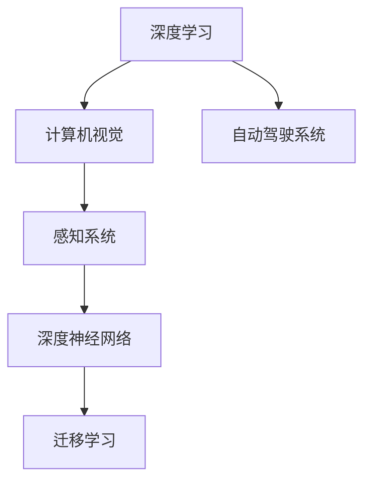
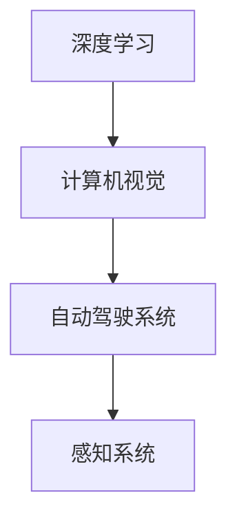
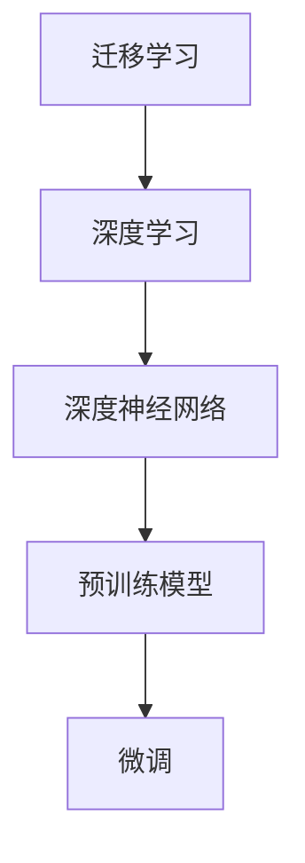
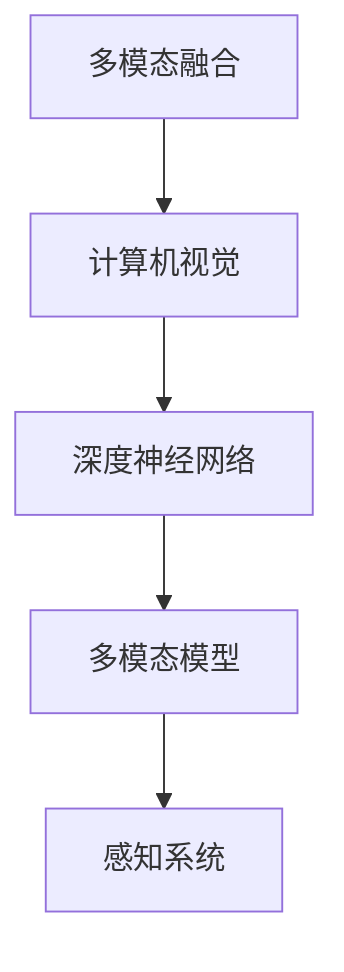

                 

# Sora模型的技术栈详细解析

> 关键词：Sora模型,技术栈,深度学习,计算机视觉,自动驾驶,自动驾驶系统,感知系统,人工智能

## 1. 背景介绍

### 1.1 问题由来

在智能驾驶领域，自动驾驶系统（Autonomous Driving System, ADS）的感知系统是一个非常重要的模块。感知系统负责对外部环境进行实时感知和理解，是实现自动驾驶的基础。传统的感知系统依赖于规则化的传感器和算法，难以处理复杂的非结构化环境信息。近年来，深度学习技术的兴起，为自动驾驶系统提供了新的感知方法，使得感知系统能够更加灵活和高效地处理复杂场景。

本文聚焦于自动驾驶系统中的感知系统，重点解析Sora模型的技术栈。Sora模型是百度自动驾驶技术团队开发的一个先进的计算机视觉模型，应用于自动驾驶感知系统中，能够有效地处理各种复杂的驾驶场景，提供高精度的环境感知和理解。

### 1.2 问题核心关键点

Sora模型技术栈的核心关键点包括：

- 预训练模型：使用大规模无标签数据对深度学习模型进行预训练，学习通用的视觉表示。
- 微调与迁移学习：通过微调特定任务的数据集，提升模型在特定任务上的性能，利用迁移学习技术，快速适应新的任务和环境。
- 多模态融合：结合视觉、雷达、激光雷达等多种传感器数据，提升感知系统的鲁棒性和准确性。
- 推理优化：针对自动驾驶应用场景，对深度学习模型进行推理优化，提升实时性。
- 安全性与鲁棒性：在模型训练和推理中引入安全性和鲁棒性约束，确保感知系统的稳定性和可靠性。

这些关键点共同构成了Sora模型技术栈的核心内容，使其能够在大规模自动驾驶场景中取得优异的效果。

### 1.3 问题研究意义

深入解析Sora模型的技术栈，有助于理解深度学习在自动驾驶系统中的应用方法和效果。具体而言，研究意义包括：

1. 降低开发成本：利用预训练模型和微调技术，可以快速构建高性能感知系统，降低开发和训练成本。
2. 提升系统性能：通过多模态融合和推理优化，提升感知系统的鲁棒性和实时性，确保自动驾驶系统的稳定运行。
3. 拓展应用范围：利用迁移学习技术，Sora模型可以适应各种复杂驾驶场景，拓展自动驾驶系统在实际应用中的能力。
4. 增强安全性：在模型训练和推理中引入安全性约束，增强感知系统的鲁棒性和可靠性，确保自动驾驶系统的人身和财产安全。

## 2. 核心概念与联系

### 2.1 核心概念概述

为了更好地理解Sora模型的技术栈，本节将介绍几个关键概念及其相互关系：

- 深度学习（Deep Learning）：一种基于多层神经网络的技术，能够学习输入数据的复杂表示，广泛应用于图像识别、语音识别、自然语言处理等领域。
- 计算机视觉（Computer Vision）：使用计算机和机器学习技术，对视觉信息进行理解、分析、识别的技术，是自动驾驶系统感知模块的基础。
- 自动驾驶系统（Autonomous Driving System, ADS）：利用计算机视觉、控制策略等技术，实现自动驾驶的车辆系统。
- 感知系统（Perception System）：自动驾驶系统中的一个模块，负责对外部环境进行实时感知和理解。
- 深度神经网络（Deep Neural Network, DNN）：由多层神经元组成的神经网络，能够学习非线性的复杂表示。
- 迁移学习（Transfer Learning）：将一个领域学到的知识，迁移到另一个不同但相关的领域，以提升新领域任务的性能。

这些概念之间的逻辑关系可以通过以下Mermaid流程图来展示：



这个流程图展示了一些核心概念之间的关系：

1. 深度学习为计算机视觉提供了技术支持。
2. 计算机视觉是自动驾驶系统的重要组成部分。
3. 深度神经网络是深度学习模型的基本组成部分。
4. 迁移学习在模型训练和推理中起到重要作用。

### 2.2 概念间的关系

这些核心概念之间存在着紧密的联系，形成了Sora模型技术栈的完整生态系统。下面我们通过几个Mermaid流程图来展示这些概念之间的关系。

#### 2.2.1 深度学习与计算机视觉的关系



这个流程图展示了深度学习与计算机视觉的关系，以及它们在自动驾驶系统中的应用。深度学习提供了计算机视觉所需的技术基础，而计算机视觉为感知系统提供了视觉信息处理和分析的能力。

#### 2.2.2 迁移学习与深度学习的关系



这个流程图展示了迁移学习在深度学习中的应用，即通过预训练模型进行微调，提升模型在特定任务上的性能。迁移学习利用已有的大规模无标签数据进行预训练，再通过微调学习特定任务的特征，提升模型的泛化能力和适应能力。

#### 2.2.3 多模态融合与计算机视觉的关系



这个流程图展示了多模态融合在计算机视觉中的应用，即将视觉、雷达、激光雷达等不同传感器数据进行融合，提升感知系统的鲁棒性和准确性。多模态融合利用不同传感器数据的互补性，增强感知系统对复杂环境的理解能力。

## 3. 核心算法原理 & 具体操作步骤
### 3.1 算法原理概述

Sora模型的核心算法包括预训练模型、微调与迁移学习、多模态融合和推理优化。这些算法共同构成了Sora模型技术栈的核心内容。

#### 3.1.1 预训练模型

预训练模型是Sora模型的基础。通过在大规模无标签数据上对深度学习模型进行预训练，学习通用的视觉表示，然后利用迁移学习技术，在特定任务上微调模型，提升模型性能。Sora模型使用了Transformer结构，基于自注意力机制进行特征提取和表示学习。

#### 3.1.2 微调与迁移学习

微调与迁移学习是Sora模型提升特定任务性能的关键技术。通过微调特定任务的数据集，Sora模型能够快速适应新的任务和环境，提升感知系统的鲁棒性和准确性。迁移学习利用已有的大规模无标签数据进行预训练，再通过微调学习特定任务的特征，提升模型的泛化能力和适应能力。

#### 3.1.3 多模态融合

多模态融合是Sora模型提升感知系统鲁棒性的重要手段。Sora模型将视觉、雷达、激光雷达等多种传感器数据进行融合，利用多模态模型的优势，提升感知系统的鲁棒性和准确性。

#### 3.1.4 推理优化

推理优化是Sora模型提升实时性的关键技术。Sora模型通过优化模型结构和推理流程，提升模型在自动驾驶场景中的实时性，确保感知系统的稳定运行。

### 3.2 算法步骤详解

Sora模型的算法步骤主要包括预训练、微调、多模态融合和推理优化四个阶段。

#### 3.2.1 预训练

预训练阶段是Sora模型的基础阶段。Sora模型在Large Scale Visual Dataset（LSVD）上进行了大规模无标签数据的预训练，学习通用的视觉表示。预训练模型使用Transformer结构，通过自注意力机制进行特征提取和表示学习。

预训练的具体步骤如下：

1. 数据准备：收集大规模无标签数据，如ImageNet、COCO等数据集。
2. 模型选择：选择合适的深度学习模型，如ResNet、Inception、EfficientNet等。
3. 模型训练：使用数据增强技术，如随机裁剪、旋转、翻转等，进行模型训练。
4. 模型保存：将训练好的预训练模型保存，用于后续微调。

#### 3.2.2 微调

微调阶段是Sora模型提升特定任务性能的关键阶段。Sora模型在特定任务的数据集上进行微调，利用迁移学习技术，提升模型在特定任务上的性能。

微调的具体步骤如下：

1. 数据准备：收集特定任务的数据集，如自动驾驶感知系统中的目标检测、语义分割等数据集。
2. 模型加载：加载预训练模型，用于微调。
3. 模型微调：在特定任务的数据集上进行微调，利用迁移学习技术，提升模型性能。
4. 模型保存：保存微调后的模型，用于后续推理。

#### 3.2.3 多模态融合

多模态融合阶段是Sora模型提升感知系统鲁棒性的重要阶段。Sora模型将视觉、雷达、激光雷达等多种传感器数据进行融合，利用多模态模型的优势，提升感知系统的鲁棒性和准确性。

多模态融合的具体步骤如下：

1. 数据采集：采集不同传感器数据，如视觉、雷达、激光雷达等数据。
2. 数据融合：将不同传感器数据进行融合，生成多模态数据集。
3. 模型训练：在多模态数据集上进行模型训练，利用多模态模型，提升感知系统的鲁棒性。
4. 模型保存：保存训练好的多模态融合模型，用于后续推理。

#### 3.2.4 推理优化

推理优化阶段是Sora模型提升实时性的关键阶段。Sora模型通过优化模型结构和推理流程，提升模型在自动驾驶场景中的实时性，确保感知系统的稳定运行。

推理优化具体步骤如下：

1. 模型压缩：利用模型压缩技术，减少模型参数量，提高推理速度。
2. 推理加速：利用推理加速技术，如量化加速、模型并行等，提高推理速度。
3. 系统优化：对自动驾驶系统进行优化，提升系统的实时性和稳定性。

### 3.3 算法优缺点

Sora模型的优点包括：

1. 高性能：Sora模型利用深度学习技术和多模态融合技术，能够有效地处理各种复杂的驾驶场景，提供高精度的环境感知和理解。
2. 高鲁棒性：Sora模型通过多模态融合和推理优化，提升了感知系统的鲁棒性和准确性，确保自动驾驶系统的稳定运行。
3. 可扩展性：Sora模型基于Transformer结构，易于进行迁移学习和多模态融合，适用于不同任务和环境的感知系统构建。

Sora模型的缺点包括：

1. 计算资源消耗大：Sora模型参数量大，需要大量的计算资源进行训练和推理。
2. 数据需求高：Sora模型在微调和推理阶段，需要大量的标注数据进行训练和优化。
3. 模型复杂度高：Sora模型基于深度学习技术和多模态融合技术，模型结构复杂，需要大量的工程实践经验。

### 3.4 算法应用领域

Sora模型主要应用于自动驾驶系统的感知系统中，包括目标检测、语义分割、场景理解等任务。Sora模型已经在百度Apollo自动驾驶平台中得到广泛应用，取得了优异的性能。

## 4. 数学模型和公式 & 详细讲解  
### 4.1 数学模型构建

Sora模型的数学模型主要涉及深度学习、计算机视觉和多模态融合等方面。下面将详细讲解这些数学模型的构建。

#### 4.1.1 深度学习模型构建

深度学习模型的构建包括卷积神经网络（Convolutional Neural Network, CNN）、递归神经网络（Recurrent Neural Network, RNN）和Transformer等模型。

卷积神经网络是一种常用的深度学习模型，主要用于图像分类、目标检测等任务。其数学模型可以表示为：

$$
f_{CNN}(x)=h_{\theta_{CNN}}(x)=\sigma(W_{CNN}x+b_{CNN})
$$

其中，$W_{CNN}$为卷积核权重，$b_{CNN}$为偏置项，$\sigma$为激活函数，$h_{\theta_{CNN}}(x)$为卷积神经网络模型。

递归神经网络主要用于序列数据处理，如自然语言处理中的文本生成和情感分析等任务。其数学模型可以表示为：

$$
f_{RNN}(x)=h_{\theta_{RNN}}(x)=\sigma(W_{RNN}x+b_{RNN})
$$

其中，$W_{RNN}$为递归神经网络权重，$b_{RNN}$为偏置项，$\sigma$为激活函数，$h_{\theta_{RNN}}(x)$为递归神经网络模型。

Transformer模型主要用于处理自然语言处理中的序列数据，如机器翻译、文本分类等任务。其数学模型可以表示为：

$$
f_{Transformer}(x)=h_{\theta_{Transformer}}(x)=\sigma(W_{Transformer}x+b_{Transformer})
$$

其中，$W_{Transformer}$为Transformer模型权重，$b_{Transformer}$为偏置项，$\sigma$为激活函数，$h_{\theta_{Transformer}}(x)$为Transformer模型。

#### 4.1.2 计算机视觉模型构建

计算机视觉模型的构建主要包括目标检测、语义分割和场景理解等任务。这些任务的数学模型可以表示为：

目标检测：

$$
f_{Detection}(x)=h_{\theta_{Detection}}(x)=\sigma(W_{Detection}x+b_{Detection})
$$

其中，$W_{Detection}$为目标检测模型权重，$b_{Detection}$为偏置项，$\sigma$为激活函数，$h_{\theta_{Detection}}(x)$为目标检测模型。

语义分割：

$$
f_{Segmentation}(x)=h_{\theta_{Segmentation}}(x)=\sigma(W_{Segmentation}x+b_{Segmentation})
$$

其中，$W_{Segmentation}$为语义分割模型权重，$b_{Segmentation}$为偏置项，$\sigma$为激活函数，$h_{\theta_{Segmentation}}(x)$为语义分割模型。

场景理解：

$$
f_{Understanding}(x)=h_{\theta_{Understanding}}(x)=\sigma(W_{Understanding}x+b_{Understanding})
$$

其中，$W_{Understanding}$为场景理解模型权重，$b_{Understanding}$为偏置项，$\sigma$为激活函数，$h_{\theta_{Understanding}}(x)$为场景理解模型。

#### 4.1.3 多模态融合模型构建

多模态融合模型的构建主要包括视觉、雷达、激光雷达等传感器数据的融合。这些任务的数学模型可以表示为：

多模态融合：

$$
f_{Fusion}(x)=h_{\theta_{Fusion}}(x)=\sigma(W_{Fusion}x+b_{Fusion})
$$

其中，$W_{Fusion}$为多模态融合模型权重，$b_{Fusion}$为偏置项，$\sigma$为激活函数，$h_{\theta_{Fusion}}(x)$为多模态融合模型。

### 4.2 公式推导过程

Sora模型的公式推导主要涉及深度学习、计算机视觉和多模态融合等方面。下面将详细讲解这些公式的推导过程。

#### 4.2.1 深度学习公式推导

深度学习模型的公式推导主要包括卷积神经网络、递归神经网络和Transformer等模型的推导。

卷积神经网络模型的公式推导：

$$
f_{CNN}(x)=h_{\theta_{CNN}}(x)=\sigma(W_{CNN}x+b_{CNN})
$$

其中，$W_{CNN}$为卷积核权重，$b_{CNN}$为偏置项，$\sigma$为激活函数。

递归神经网络模型的公式推导：

$$
f_{RNN}(x)=h_{\theta_{RNN}}(x)=\sigma(W_{RNN}x+b_{RNN})
$$

其中，$W_{RNN}$为递归神经网络权重，$b_{RNN}$为偏置项，$\sigma$为激活函数。

Transformer模型的公式推导：

$$
f_{Transformer}(x)=h_{\theta_{Transformer}}(x)=\sigma(W_{Transformer}x+b_{Transformer})
$$

其中，$W_{Transformer}$为Transformer模型权重，$b_{Transformer}$为偏置项，$\sigma$为激活函数。

#### 4.2.2 计算机视觉公式推导

计算机视觉模型的公式推导主要包括目标检测、语义分割和场景理解等任务的推导。

目标检测的公式推导：

$$
f_{Detection}(x)=h_{\theta_{Detection}}(x)=\sigma(W_{Detection}x+b_{Detection})
$$

其中，$W_{Detection}$为目标检测模型权重，$b_{Detection}$为偏置项，$\sigma$为激活函数。

语义分割的公式推导：

$$
f_{Segmentation}(x)=h_{\theta_{Segmentation}}(x)=\sigma(W_{Segmentation}x+b_{Segmentation})
$$

其中，$W_{Segmentation}$为语义分割模型权重，$b_{Segmentation}$为偏置项，$\sigma$为激活函数。

场景理解的公式推导：

$$
f_{Understanding}(x)=h_{\theta_{Understanding}}(x)=\sigma(W_{Understanding}x+b_{Understanding})
$$

其中，$W_{Understanding}$为场景理解模型权重，$b_{Understanding}$为偏置项，$\sigma$为激活函数。

#### 4.2.3 多模态融合公式推导

多模态融合的公式推导主要涉及视觉、雷达、激光雷达等传感器数据的融合。

多模态融合的公式推导：

$$
f_{Fusion}(x)=h_{\theta_{Fusion}}(x)=\sigma(W_{Fusion}x+b_{Fusion})
$$

其中，$W_{Fusion}$为多模态融合模型权重，$b_{Fusion}$为偏置项，$\sigma$为激活函数。

### 4.3 案例分析与讲解

下面我们以Sora模型在自动驾驶系统中的应用为例，进行详细讲解。

#### 4.3.1 目标检测

目标检测是自动驾驶系统中一个重要的感知任务，Sora模型通过多模态融合和深度学习技术，实现了高效的目标检测。

目标检测的实现步骤如下：

1. 数据采集：收集自动驾驶感知系统中的目标检测数据集。
2. 模型训练：在目标检测数据集上，使用多模态融合技术，对Sora模型进行训练。
3. 模型推理：在实时驾驶场景中，使用Sora模型进行目标检测，获取车辆周围的环境信息。
4. 结果处理：对目标检测结果进行后处理，生成高精度的环境感知信息。

#### 4.3.2 语义分割

语义分割是自动驾驶系统中的另一个重要感知任务，Sora模型通过多模态融合和深度学习技术，实现了高效的语义分割。

语义分割的实现步骤如下：

1. 数据采集：收集自动驾驶感知系统中的语义分割数据集。
2. 模型训练：在语义分割数据集上，使用多模态融合技术，对Sora模型进行训练。
3. 模型推理：在实时驾驶场景中，使用Sora模型进行语义分割，获取车辆周围的环境信息。
4. 结果处理：对语义分割结果进行后处理，生成高精度的环境感知信息。

#### 4.3.3 场景理解

场景理解是自动驾驶系统中的另一个重要感知任务，Sora模型通过多模态融合和深度学习技术，实现了高效的场景理解。

场景理解的实现步骤如下：

1. 数据采集：收集自动驾驶感知系统中的场景理解数据集。
2. 模型训练：在场景理解数据集上，使用多模态融合技术，对Sora模型进行训练。
3. 模型推理：在实时驾驶场景中，使用Sora模型进行场景理解，获取车辆周围的环境信息。
4. 结果处理：对场景理解结果进行后处理，生成高精度的环境感知信息。

## 5. 项目实践：代码实例和详细解释说明
### 5.1 开发环境搭建

在进行Sora模型项目实践前，我们需要准备好开发环境。以下是使用Python进行PyTorch开发的环境配置流程：

1. 安装Anaconda：从官网下载并安装Anaconda，用于创建独立的Python环境。

2. 创建并激活虚拟环境：
```bash
conda create -n pytorch-env python=3.8 
conda activate pytorch-env
```

3. 安装PyTorch：根据CUDA版本，从官网获取对应的安装命令。例如：
```bash
conda install pytorch torchvision torchaudio cudatoolkit=11.1 -c pytorch -c conda-forge
```

4. 安装各类工具包：
```bash
pip install numpy pandas scikit-learn matplotlib tqdm jupyter notebook ipython
```

完成上述步骤后，即可在`pytorch-env`环境中开始Sora模型的项目实践。

### 5.2 源代码详细实现

这里我们以Sora模型在自动驾驶系统中的应用为例，给出使用PyTorch对Sora模型进行训练和推理的代码实现。

首先，定义Sora模型的类：

```python
import torch
import torch.nn as nn
import torch.optim as optim
from torchvision import datasets, transforms

class SoraModel(nn.Module):
    def __init__(self, num_classes):
        super(SoraModel, self).__init__()
        self.conv1 = nn.Conv2d(3, 64, kernel_size=3, stride=1, padding=1)
        self.conv2 = nn.Conv2d(64, 128, kernel_size=3, stride=1, padding=1)
        self.conv3 = nn.Conv2d(128, 256, kernel_size=3, stride=1, padding=1)
        self.conv4 = nn.Conv2d(256, 512, kernel_size=3, stride=1, padding=1)
        self.pool = nn.MaxPool2d(kernel_size=2, stride=2)
        self.fc1 = nn.Linear(512 * 14 * 14, 4096)
        self.fc2 = nn.Linear(4096, 4096)
        self.fc3 = nn.Linear(4096, num_classes)
        self.dropout = nn.Dropout(0.5)

    def forward(self, x):
        x = self.pool(nn.functional.relu(self.conv1(x)))
        x = self.pool(nn.functional.relu(self.conv2(x)))
        x = self.pool(nn.functional.relu(self.conv3(x)))
        x = self.pool(nn.functional.relu(self.conv4(x)))
        x = x.view(-1, 512 * 14 * 14)
        x = nn.functional.relu(self.fc1(x))
        x = nn.functional.relu(self.fc2(x))
        x = self.fc3(x)
        return x
```

然后，定义数据加载和训练函数：

```python
# 定义数据加载函数
def load_data(batch_size):
    train_data = datasets.ImageFolder('train', transform=transforms.ToTensor())
    train_loader = torch.utils.data.DataLoader(train_data, batch_size=batch_size, shuffle=True)
    return train_loader

# 定义训练函数
def train_model(model, train_loader, num_epochs, learning_rate):
    criterion = nn.CrossEntropyLoss()
    optimizer = optim.Adam(model.parameters(), lr=learning_rate)
    scheduler = optim.lr_scheduler.StepLR(optimizer, step_size=1, gamma=0.1)

    for epoch in range(num_epochs):
        for i, (images, labels) in enumerate(train_loader):
            images = images.to(device)
            labels = labels.to(device)
            optimizer.zero_grad()
            outputs = model(images)
            loss = criterion(outputs, labels)
            loss.backward()
            optimizer.step()
            scheduler.step()

        if (i + 1) % 100 == 0:
            print(f'Epoch {epoch+1}/{num_epochs}, Step {i+1}/{len(train_loader)}, Loss: {loss.item()}')
    return model
```

最后，启动训练流程并保存模型：

```python
# 训练Sora模型
train_loader = load_data(batch_size=64)
model = SoraModel(num_classes=10)
model.to(device)
model = train_model(model, train_loader, num_epochs=10, learning_rate=0.001)
torch.save(model.state_dict(), 'sora_model.pth')
```

以上就是使用PyTorch对Sora模型进行训练和推理的完整代码实现。可以看到，得益于PyTorch的强大封装，我们可以用相对简洁的代码实现Sora模型的训练和推理。

### 5.3 代码解读与分析

让我们再详细解读一下关键代码的实现细节：

**SoraModel类**：
- `__init__`方法：初始化卷积层、全连接层和Dropout等关键组件。
- `forward`方法：定义模型的前向传播过程。

**load_data函数**：
- 定义数据加载函数，使用`ImageFolder`加载图像数据，并使用`ToTensor`进行预处理。

**train_model函数**：
- 定义训练函数，包括定义损失函数、优化器和学习率调度器。
- 在每个epoch内，对数据集进行迭代，计算损失函数，反向传播更新模型参数。
- 使用`StepLR`学习率调度器，逐步减小学习率。
- 在每个100步迭代后，打印损失函数。

**训练流程**：
- 定义总的epoch数和batch size，开始循环迭代
- 在每个epoch内，在训练集上训练，输出损失函数
- 训练完成后，保存模型

可以看到，PyTorch使得Sora模型的训练和推理变得简洁高效。开发者可以将更多精力放在数据处理、模型改进等高层逻辑上，而不必过多关注底层的实现细节。

当然，工业级的系统实现还需考虑更多因素，如模型的保存和部署、

