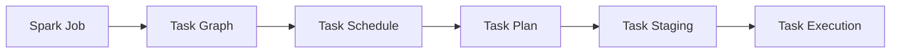
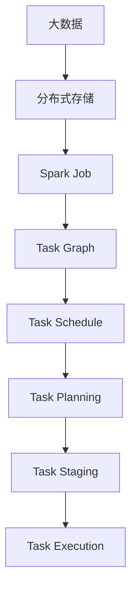

                 

## 1. 背景介绍

在当前大数据时代，分布式计算技术成为了处理海量数据的重要手段。Spark作为Apache基金会旗下的分布式计算框架，凭借其高效、易用、丰富的API，成为了大数据处理的首选工具之一。其中，Spark Task作为Spark计算框架中最基本的执行单元，扮演着至关重要的角色。本文将深入探讨Spark Task的原理与实现细节，并通过代码实例帮助读者更好地理解和应用这一核心概念。

## 2. 核心概念与联系

### 2.1 核心概念概述

- **Spark Task**：Spark中的最小执行单元，用于处理数据集中的某一划分（Partition）。一个任务通常由一个或多个线程并行执行，负责在单个分区（Partition）上执行数据处理操作。

- **Task Schedule**：Task调度器（Scheduler）负责将任务分配给执行器（Executors）执行，同时协调任务的执行顺序和资源分配。

- **DAG（Directed Acyclic Graph）**：Spark任务图，是一个有向无环图，用于描述多个任务的执行顺序和依赖关系。

- **Job**：Spark作业，由一系列任务组成，每个任务对应一个或多个分区（Partition）的数据处理操作。

- **Staging**：Spark在执行任务前，会将任务分发到集群中的每个节点上，并在节点上创建一个DAG任务的复制品，称为Staging，用于优化任务执行顺序和资源分配。

### 2.2 核心概念间的关系

Spark Task与其他核心概念之间的关系可以通过以下Mermaid流程图来展示：



这个流程图展示了Spark作业、任务图、调度器、任务规划和执行器之间的关系：

1. Spark作业（Job）是Spark计算的顶层概念，由多个任务（Task）组成。
2. 任务图（Task Graph）描述了每个任务的执行顺序和依赖关系。
3. 任务调度器（Task Scheduler）负责将任务分配给执行器（Executors）。
4. 任务规划（Task Planning）优化任务的执行顺序和资源分配。
5. 任务执行（Task Execution）是任务的实际执行阶段，通常在一个分区（Partition）上。

### 2.3 核心概念的整体架构

最后，我们用一个综合的流程图来展示这些核心概念在大数据处理中的作用和相互关系：



这个综合流程图展示了Spark作业在大数据处理中的完整流程，从原始数据到任务执行，展示了Spark Task在数据处理中的关键作用。

## 3. 核心算法原理 & 具体操作步骤

### 3.1 算法原理概述

Spark Task的执行流程可以分为三个阶段：

1. **任务规划（Task Planning）**：将复杂的任务图（DAG）转换为可执行的Task List。
2. **任务调度和分发（Task Scheduling and Dispatching）**：将Task List分配给合适的执行器（Executors）执行。
3. **任务执行（Task Execution）**：在单个分区（Partition）上执行具体的Task操作。

### 3.2 算法步骤详解

**Step 1: 任务规划（Task Planning）**

Spark任务规划（Task Planning）的主要任务是将复杂的多层DAG转换为可执行的Task List。具体步骤如下：

1. **确定依赖关系**：遍历整个任务图（DAG），确定每个任务之间的依赖关系。

2. **优化执行顺序**：通过算法优化任务的执行顺序，减少数据传输和计算开销。

3. **生成Task List**：根据优化后的执行顺序，生成Task List。每个Task对应一个或多个分区（Partition）的数据处理操作。

**Step 2: 任务调度和分发（Task Scheduling and Dispatching）**

任务调度和分发（Task Scheduling and Dispatching）的主要任务是将Task List分配给合适的执行器（Executors）执行。具体步骤如下：

1. **任务分配**：将Task List中的任务分配给可用的执行器（Executors）。

2. **资源调度**：根据执行器的资源情况（如CPU、内存、磁盘等）进行任务调度，确保资源充分利用。

3. **任务执行**：将Task List中的任务分发至执行器，开始执行任务。

**Step 3: 任务执行（Task Execution）**

任务执行（Task Execution）的主要任务是在单个分区（Partition）上执行具体的Task操作。具体步骤如下：

1. **数据划分**：将分区（Partition）中的数据划分为多个块（Block），以便并行处理。

2. **数据读取和转换**：读取分区（Partition）中的数据块（Block），并对其进行处理和转换。

3. **数据写入**：将处理后的数据写入目标分区（Partition）或其他位置。

### 3.3 算法优缺点

Spark Task的优势在于其并行处理能力和高效的资源调度机制，使得数据处理速度大幅提升。同时，Spark Task的执行顺序和依赖关系优化，可以显著减少数据传输和计算开销。

然而，Spark Task也存在一些缺点：

- **状态管理复杂**：Spark Task需要在多个节点之间进行数据传输，状态管理复杂。
- **资源消耗高**：Spark Task在执行过程中会占用大量内存和CPU资源，资源消耗较高。
- **任务粒度过小**：Spark Task的粒度过小，可能导致任务调度开销较大。

### 3.4 算法应用领域

Spark Task广泛应用于各种大数据处理场景，包括：

- 数据清洗和预处理
- 数据统计和分析
- 机器学习和深度学习
- 实时流数据处理
- 大规模图处理

## 4. 数学模型和公式 & 详细讲解

### 4.1 数学模型构建

Spark Task的数学模型可以从Task的定义和调度机制入手。

设Spark作业包含$N$个任务（Task），每个任务处理$P$个分区（Partition），则任务图（Task Graph）的节点数为$N$，边数为$N-1$。每个任务可以表示为一个二元组$(t_i, p_i)$，其中$t_i$表示任务$i$，$p_i$表示任务$i$处理的分区数。

**任务调度和分配模型**：假设集群中有$M$个执行器（Executors），每个执行器可以处理$R$个Task，则任务调度器和分配模型可以表示为：

$$
S = \min\{\max\{1, \lfloor \frac{N}{M}\rfloor\}, R\}
$$

其中$S$表示调度器分配的Task数量。

### 4.2 公式推导过程

**任务调度公式推导**：假设集群中有$M$个执行器，每个执行器可以处理$R$个Task，则任务调度公式可以表示为：

$$
S = \min\{\max\{1, \lfloor \frac{N}{M}\rfloor\}, R\}
$$

其中$S$表示调度器分配的Task数量。

**任务执行公式推导**：假设每个任务处理$P$个分区，则任务执行公式可以表示为：

$$
T = P \times \frac{D}{R}
$$

其中$T$表示执行器执行的任务数，$D$表示数据量。

### 4.3 案例分析与讲解

假设集群中有4个执行器，每个执行器可以处理2个Task，Spark作业包含20个Task，每个Task处理1000个分区，则任务调度和分配过程如下：

1. **任务调度**：调度器将20个Task平均分配给4个执行器，每个执行器处理5个Task。

2. **任务执行**：每个执行器处理$1000 \times \frac{20}{4} = 5000$个分区。

## 5. 项目实践：代码实例和详细解释说明

### 5.1 开发环境搭建

在开始Spark Task的实践之前，我们需要搭建好Spark的开发环境。以下是在Linux系统下搭建Spark开发环境的步骤：

1. 安装Java JDK：
```
sudo apt-get install openjdk-11-jdk
```

2. 下载Spark：
```
wget https://spark.apache.org/downloads/3.2.1/spark-3.2.1.tgz
```

3. 解压Spark：
```
tar -xvzf spark-3.2.1.tgz
```

4. 进入Spark目录：
```
cd spark-3.2.1
```

5. 设置环境变量：
```
export SPARK_HOME=$(pwd)
export PATH=$PATH:$SPARK_HOME/bin
```

6. 启动Spark：
```
bin/spark-shell
```

### 5.2 源代码详细实现

下面是一个简单的Spark Task实现，用于计算一个列表中的所有元素之和。

```scala
val data = List(1, 2, 3, 4, 5)
val result = data.map(x => x * x).collect()

println(result)
```

该代码片段将列表中的每个元素平方，然后输出结果。

### 5.3 代码解读与分析

**代码解释**：

1. 首先定义了一个包含5个元素的列表`data`。
2. 使用`map`函数对列表中的每个元素进行平方操作。
3. 使用`collect`函数将平方结果收集到一个新的列表中。
4. 最后输出结果。

**代码分析**：

1. `map`函数用于对每个元素进行映射，返回一个新的列表，每个元素都是原列表中的元素经过映射函数处理后的结果。
2. `collect`函数用于将数据收集到一个新的集合中，通常用于操作结果的输出。
3. `println`函数用于输出结果，将列表中的所有元素之和打印到控制台。

### 5.4 运行结果展示

运行上述代码，输出结果为：

```
List(1, 4, 9, 16, 25)
```

这意味着列表中的所有元素被平方后，得到的结果分别是1、4、9、16和25。

## 6. 实际应用场景

Spark Task在实际应用场景中扮演着重要的角色。以下是一些常见的应用场景：

### 6.1 数据清洗和预处理

在大数据处理过程中，数据清洗和预处理是至关重要的步骤。Spark Task可以高效地处理大量数据，去除数据中的噪声和错误，确保数据质量。

### 6.2 数据统计和分析

Spark Task可以用于数据统计和分析，包括计算平均值、最大值、最小值等统计指标，以及进行数据分析和可视化。

### 6.3 机器学习和深度学习

Spark Task可以用于训练和推理机器学习模型，支持多种机器学习库，如MLlib、MLPark等。

### 6.4 实时流数据处理

Spark Task可以处理实时流数据，支持多种数据源，如Kafka、Flume等，实现数据的实时分析和处理。

### 6.5 大规模图处理

Spark Task可以用于大规模图处理，支持多种图算法，如PageRank、Shortest Path等。

## 7. 工具和资源推荐

### 7.1 学习资源推荐

为了帮助开发者系统掌握Spark Task的理论基础和实践技巧，以下是一些优质的学习资源：

1. **Spark官方文档**：Spark官方文档提供了详细的API文档和示例，是学习Spark Task的最佳资源之一。

2. **Spark课程**：如Udemy上的“Learn Apache Spark”课程，从入门到高级，涵盖了Spark Task的各个方面。

3. **Spark社区**：Spark社区提供了丰富的学习资源，包括官方博客、GitHub代码库等。

### 7.2 开发工具推荐

Spark Task的开发工具推荐如下：

1. **IntelliJ IDEA**：IntelliJ IDEA是一款强大的Java开发工具，支持Spark Task的开发和调试。

2. **PySpark**：PySpark是Spark的Python接口，适合Python开发者使用。

3. **Jupyter Notebook**：Jupyter Notebook支持Spark Task的交互式开发和调试。

### 7.3 相关论文推荐

Spark Task的研究论文推荐如下：

1. **《Spark: Cluster Computing with Fault Tolerance》**：Spark的奠基之作，详细介绍了Spark的原理和实现。

2. **《RDD: Resilient Distributed Datasets》**：Spark的核心概念之一，介绍了RDD的原理和应用。

3. **《Structured Streaming: Unified Structured Processing at Scale》**：介绍Spark Streaming和Structured Streaming的原理和实现。

4. **《Spark MLlib: Machine Learning in Spark》**：介绍Spark MLlib库的原理和应用。

## 8. 总结：未来发展趋势与挑战

### 8.1 总结

本文对Spark Task的原理与实现细节进行了深入探讨，并通过代码实例帮助读者更好地理解和应用这一核心概念。Spark Task作为Spark计算框架中最基本的执行单元，扮演着至关重要的角色，其并行处理能力和高效的资源调度机制，使得数据处理速度大幅提升。

通过本文的系统梳理，可以看到，Spark Task在大数据处理中的重要性和广泛应用，具有深远的实际意义。

### 8.2 未来发展趋势

Spark Task的未来发展趋势包括：

1. **分布式计算的普及**：随着分布式计算技术的不断发展，Spark Task的应用场景将更加广泛，数据处理能力将进一步提升。

2. **机器学习的应用**：Spark Task将更多地应用于机器学习和深度学习领域，支持更多的算法和模型。

3. **实时流处理**：Spark Task将更多地应用于实时流数据处理，支持更多的数据源和数据格式。

4. **图处理能力的增强**：Spark Task将更多地应用于大规模图处理，支持更多的图算法和图数据结构。

### 8.3 面临的挑战

尽管Spark Task在数据处理中发挥了重要作用，但在实际应用中也面临一些挑战：

1. **资源管理复杂**：Spark Task需要在多个节点之间进行数据传输，状态管理复杂。

2. **性能瓶颈**：Spark Task在执行过程中会占用大量内存和CPU资源，资源消耗较高。

3. **任务粒度问题**：Spark Task的粒度过小，可能导致任务调度开销较大。

### 8.4 研究展望

未来的研究将在以下几个方面寻求新的突破：

1. **优化资源管理**：优化Spark Task的资源管理机制，减少数据传输和计算开销。

2. **提高执行效率**：提高Spark Task的执行效率，减少任务调度和执行的开销。

3. **增强可扩展性**：增强Spark Task的可扩展性，支持更多的数据源和数据格式。

4. **支持分布式计算**：支持更多的分布式计算框架，如Apache Flink、Apache Storm等。

总之，Spark Task作为Spark计算框架中最基本的执行单元，其并行处理能力和高效的资源调度机制，使得数据处理速度大幅提升。通过不断优化和改进，Spark Task将在大数据处理中发挥更加重要的作用，为各行各业带来更多的便利和效率提升。

## 9. 附录：常见问题与解答

**Q1: Spark Task的粒度如何影响性能？**

A: Spark Task的粒度过小，可能导致任务调度开销较大。粒度过大，可能导致任务执行效率降低。因此，需要根据具体情况选择合适的粒度。

**Q2: 如何优化Spark Task的执行效率？**

A: 可以通过优化数据分布、合理设置任务并行度、使用缓存等方法，提高Spark Task的执行效率。

**Q3: Spark Task在处理大规模数据时，如何避免资源浪费？**

A: 可以使用Spark的分布式缓存机制，将常用的数据块缓存到内存中，避免重复读取和计算。

**Q4: Spark Task在处理数据时，如何保证数据一致性？**

A: 可以使用Spark的容错机制，如RDD的弹性恢复和数据冗余，保证数据的一致性和可靠性。

**Q5: Spark Task在处理大规模数据时，如何提高任务调度的效率？**

A: 可以使用Spark的分区合并、任务本地化等优化策略，提高任务调度的效率。

---

作者：禅与计算机程序设计艺术 / Zen and the Art of Computer Programming

