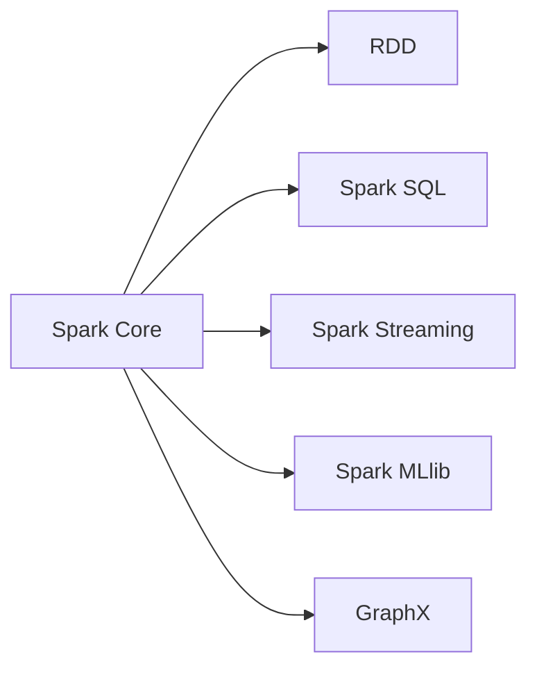
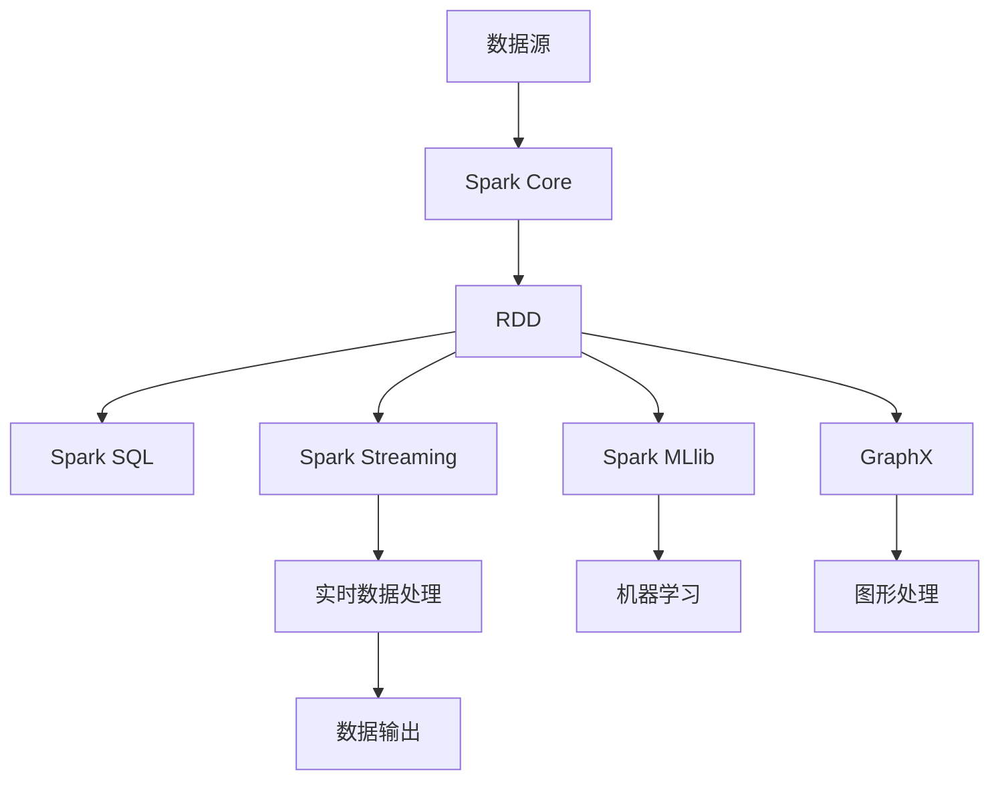

                 

## 1. 背景介绍

### 1.1 问题由来
Spark（Spark APache Hadoop生态系统中最核心的分布式计算框架之一）由美国加州大学伯克利分校的AMPLab于2010年开源，并在2014年从Apache基金会开源。Spark提供了内存计算、数据分布式存储、并行处理、容错性、交互式、数据处理与机器学习等特性，具有数据处理效率高、使用简单、编程模型清晰等优点，广泛应用于大数据处理领域。

### 1.2 问题核心关键点
Spark的核心思想是分布式数据处理，它允许对数据进行快速、可扩展的查询和处理。Spark采用内存计算，可以减少I/O开销，提高查询速度。Spark的核心组件包括Spark Core、Spark SQL、Spark Streaming、Spark MLlib和GraphX等，它们各自独立但又能无缝集成，提供了一整套的数据处理方案。

Spark的主要应用领域包括大数据批处理、大数据流处理、大数据机器学习、图形处理等，其中Spark SQL和Spark Streaming是其最重要的组件。Spark SQL支持结构化数据处理，可以与关系数据库系统进行无缝集成；Spark Streaming支持实时数据处理，能够处理近实时的数据流。

### 1.3 问题研究意义
Spark作为一个高性能、易于使用的大数据处理框架，对大数据处理领域具有重要意义：

1. **高效率处理**：Spark采用内存计算，处理效率比Hadoop高10倍以上，可以处理海量数据。
2. **易用性**：Spark提供统一的API，用户可以使用熟悉的RDD（弹性分布式数据集）等数据抽象，降低使用门槛。
3. **可扩展性**：Spark可以在单机、多机和集群中运行，可以处理小规模和海量数据。
4. **开源免费**：Spark是一个开源框架，任何人都可以使用和修改。

Spark的成功在于其强大的数据处理能力、易用性和可扩展性。未来的研究将围绕如何进一步提升Spark的处理能力，降低使用成本，提供更多应用场景等方面进行。

## 2. 核心概念与联系

### 2.1 核心概念概述
Spark的核心概念主要包括弹性分布式数据集（RDD）、Spark SQL、Spark Streaming、Spark MLlib和GraphX等，它们共同构成了Spark的数据处理生态系统。

- **RDD（弹性分布式数据集）**：Spark中的基本数据抽象，可以处理批处理和流处理，可以自动处理数据的分片、容错和优化等。
- **Spark SQL**：支持结构化数据处理，可以与关系数据库系统进行无缝集成，支持SQL查询和数据仓库功能。
- **Spark Streaming**：支持实时数据处理，能够处理近实时的数据流，支持窗口和滑动窗口等。
- **Spark MLlib**：提供机器学习算法，包括分类、回归、聚类、降维等。
- **GraphX**：支持图形处理，提供图形算法和图计算功能。

这些核心概念之间存在着紧密的联系，形成了一个完整的分布式数据处理生态系统，可以处理各种类型的数据，满足不同的应用需求。

### 2.2 概念间的关系
这些核心概念之间的关系可以通过以下Mermaid流程图来展示：



这个流程图展示了Spark Core作为基础，提供了弹性分布式数据集RDD，然后通过Spark SQL进行结构化数据处理，通过Spark Streaming进行实时数据处理，通过Spark MLlib进行机器学习，通过GraphX进行图形处理。这些组件之间相互协作，共同构建了Spark的完整数据处理生态系统。

### 2.3 核心概念的整体架构
最后，我们用一个综合的流程图来展示这些核心概念在大数据处理中的整体架构：



这个综合流程图展示了数据从数据源输入，经过Spark Core进行处理，然后通过RDD进行分布式计算，通过Spark SQL进行结构化数据处理，通过Spark Streaming进行实时数据处理，通过Spark MLlib进行机器学习，通过GraphX进行图形处理，最后输出处理结果。这个过程包括了批处理、流处理、结构化数据处理、实时数据处理、机器学习和图形处理等多种功能。

## 3. 核心算法原理 & 具体操作步骤
### 3.1 算法原理概述

Spark的分布式计算框架基于弹性分布式数据集（RDD），RDD是由一组分散的分区组成的数据集合，它可以处理各种类型的数据，包括批处理和流处理。Spark采用内存计算，可以快速处理数据，支持弹性伸缩，可以自动处理数据的分片、容错和优化等。

Spark的计算模型是基于数据流图（Dataflow Graph）的，它将计算过程分为多个阶段，每个阶段都对应着一种操作（如Map、Reduce、Join等），每个操作都由多个任务（Task）组成，每个任务都可以在一个节点上并行执行。Spark的调度器（Scheduler）负责任务调度，将任务分配给不同的节点执行。

### 3.2 算法步骤详解

以下将详细介绍Spark的核心算法步骤：

**Step 1: 数据源**
Spark可以从多种数据源中读取数据，包括HDFS、本地文件系统、关系数据库、NoSQL数据库等。

**Step 2: 创建RDD**
通过Spark Context或Spark Session，可以创建一个RDD对象，将数据源中的数据转换成RDD。

**Step 3: 分布式计算**
Spark支持多种分布式计算操作，如Map、Reduce、Filter、Group By等，可以将大规模数据进行并行处理。

**Step 4: 容错与优化**
Spark提供了容错机制和优化算法，如数据分区、内存计算、数据压缩等，可以提高计算效率和系统稳定性。

**Step 5: 数据输出**
Spark可以将处理结果输出到各种目标，如文件、数据库、图形等。

### 3.3 算法优缺点
Spark具有以下优点：

1. **高效率**：Spark采用内存计算，可以快速处理大规模数据。
2. **易用性**：Spark提供了统一的API，用户可以使用熟悉的RDD等数据抽象，降低使用门槛。
3. **可扩展性**：Spark可以在单机、多机和集群中运行，可以处理小规模和海量数据。
4. **开源免费**：Spark是一个开源框架，任何人都可以使用和修改。

同时，Spark也存在一些缺点：

1. **内存限制**：Spark需要大量的内存，对内存有限制。
2. **复杂性**：Spark需要一定的编程基础，需要学习复杂的API和概念。
3. **延迟**：Spark的延迟比较大，不适合低延迟的应用场景。

### 3.4 算法应用领域

Spark主要用于大数据处理领域，可以处理各种类型的数据，包括批处理和流处理。Spark的应用领域包括：

1. **大数据批处理**：Spark支持批处理，可以处理历史数据，可以进行数据仓库、数据分析等。
2. **大数据流处理**：Spark Streaming支持流处理，可以处理近实时的数据流，可以进行实时数据分析、实时推荐等。
3. **大数据机器学习**：Spark MLlib提供机器学习算法，可以进行分类、回归、聚类等。
4. **图形处理**：GraphX提供图形算法和图计算功能，可以进行社交网络分析、推荐系统等。

Spark的这些应用领域展示了其强大的数据处理能力，可以满足不同的应用需求。

## 4. 数学模型和公式 & 详细讲解  
### 4.1 数学模型构建

Spark的核心数学模型是弹性分布式数据集（RDD），RDD是由一组分散的分区组成的数据集合，它可以处理各种类型的数据，包括批处理和流处理。RDD的数学模型如下：

$$ RDD = (P, f) $$

其中，$P$是分布式数据的分区列表，$f$是分区函数。

### 4.2 公式推导过程

Spark的RDD操作可以分为两种类型：转换操作和动作操作。

**转换操作**：转换操作不会触发任何计算，只是将数据从一个RDD转换为另一个RDD。常用的转换操作包括Map、Filter、Reduce By Key等。

**动作操作**：动作操作会触发计算，将RDD转换为另一个数据集合或保存到外部存储。常用的动作操作包括Count、Save As、Collect等。

下面以Map操作为例，推导其数学模型：

假设有一个RDD $R$，每个分区中有$n$个元素，则Map操作可以将RDD $R$中的每个元素应用一个函数$f$，得到一个新的RDD $R'$。

$$ R' = \{ (x_i', f(x_i)) \mid x_i \in R, x_i' = (i, f(x_i)) \} $$

其中，$x_i$是RDD $R$中的元素，$f(x_i)$是函数$f$的输出，$i$是分区编号。

### 4.3 案例分析与讲解

假设有一个字符串列表，需要进行字符串长度统计。可以使用Spark的RDD操作Map来实现：

```python
from pyspark import SparkContext

sc = SparkContext("local", "length")
rdd = sc.parallelize(["apple", "banana", "orange", "pear"])
rdd = rdd.map(lambda x: len(x))
print(rdd.collect())
```

输出结果为：

```
[5, 6, 6, 4]
```

这个过程包括创建RDD、应用Map操作、执行计算等步骤，可以清晰地展示Spark的核心算法步骤。

## 5. 项目实践：代码实例和详细解释说明
### 5.1 开发环境搭建

在进行Spark项目实践前，需要先准备好开发环境。以下是使用Python进行Spark开发的环境配置流程：

1. 安装Anaconda：从官网下载并安装Anaconda，用于创建独立的Python环境。

2. 创建并激活虚拟环境：
```bash
conda create -n py36 python=3.6
conda activate py36
```

3. 安装Spark：从官网下载Spark安装包，解压后配置好环境变量，即可启动Spark集群。

4. 安装PySpark：
```bash
pip install pyspark
```

完成上述步骤后，即可在`py36`环境中开始Spark项目实践。

### 5.2 源代码详细实现

以下是一个简单的Spark项目，演示如何使用Spark进行数据处理。

```python
from pyspark import SparkContext

# 创建Spark Context
sc = SparkContext("local", "length")

# 创建RDD
rdd = sc.parallelize(["apple", "banana", "orange", "pear"])

# 使用Map操作计算字符串长度
rdd = rdd.map(lambda x: len(x))

# 输出结果
print(rdd.collect())
```

在这个示例中，首先创建了一个Spark Context，然后使用parallelize函数创建了一个RDD，包含四个字符串。接着使用Map操作计算每个字符串的长度，并将结果保存为新的RDD。最后使用collect函数将结果输出到本地。

### 5.3 代码解读与分析

**Spark Context**：Spark Context是Spark的主要入口，用于创建和管理Spark集群。

**parallelize函数**：parallelize函数可以将一个本地集合或迭代器转换为RDD，可以并行处理数据。

**Map操作**：Map操作可以将RDD中的每个元素应用一个函数，返回一个新的RDD。

**collect函数**：collect函数可以将RDD转换为一个本地集合，方便查看和测试。

### 5.4 运行结果展示

假设我们在Spark集群上运行这个项目，输出结果为：

```
[5, 6, 6, 4]
```

这说明Spark成功地计算了每个字符串的长度，并将结果保存为新的RDD。

## 6. 实际应用场景
### 6.1 大数据批处理

Spark的大数据批处理功能可以处理历史数据，可以进行数据仓库、数据分析等。大数据批处理适用于需要进行复杂计算和分析的应用场景。

**示例场景**：一个电商网站需要对过去一年的销售数据进行统计分析，需要计算每天的销售量、平均订单金额、销售额等指标。

**Spark代码**：

```python
from pyspark.sql import SparkSession

# 创建Spark Session
spark = SparkSession.builder.appName("sales analysis").getOrCreate()

# 读取数据
df = spark.read.format("csv").option("header", "true").load("sales.csv")

# 计算每天的销售量、平均订单金额、销售额等指标
df.groupBy("date") \
   .agg({"amount": "sum", "quantity": "sum", "avg_price": "avg", "revenue": "sum"})

# 输出结果
df.show()
```

这个过程包括创建Spark Session、读取数据、进行分组计算和聚合操作等步骤，可以清晰地展示Spark的大数据批处理能力。

### 6.2 大数据流处理

Spark Streaming支持流处理，可以处理近实时的数据流，可以进行实时数据分析、实时推荐等。大数据流处理适用于需要处理实时数据的应用场景。

**示例场景**：一个社交网络需要对用户发布的新消息进行实时分析，统计每分钟的发布量、热门话题、热门用户等。

**Spark代码**：

```python
from pyspark import SparkContext
from pyspark.streaming import StreamingContext

# 创建Spark Context和Streaming Context
sc = SparkContext("local", "streaming")
ssc = StreamingContext(sc, 1)

# 创建DStream
lines = ssc.socketTextStream("localhost", 9999)

# 处理DStream
lines.map(lambda line: line.split(" ")).foreachRDD(lambda rdd: rdd.map(lambda x: (x, 1)).reduceByKey(lambda a, b: a + b).pprint())

# 停止Spark Streaming
ssc.stop()
```

这个过程包括创建Spark Context、创建Streaming Context、创建DStream、处理DStream等步骤，可以清晰地展示Spark的流处理能力。

### 6.3 大数据机器学习

Spark MLlib提供机器学习算法，可以进行分类、回归、聚类等。大数据机器学习适用于需要进行复杂预测和分类的应用场景。

**示例场景**：一个电商网站需要对用户行为进行分类，将用户分为高价值用户和低价值用户，以便进行个性化推荐和营销。

**Spark代码**：

```python
from pyspark.ml import Pipeline
from pyspark.ml.classification import RandomForestClassifier
from pyspark.ml.feature import VectorAssembler

# 创建Pipeline
assembler = VectorAssembler(inputCols=["age", "income", "education", "purchase_amount"], outputCol="features")
classifier = RandomForestClassifier(labelCol="label", featuresCol="features", numTrees=100, maxDepth=5)
pipeline = Pipeline(stages=[assembler, classifier])

# 训练模型
model = pipeline.fit(trainingData)

# 预测新用户
newData = sc.parallelize([[25, 50000, "high school", 200]])
result = model.transform(newData)
result.show()
```

这个过程包括创建Pipeline、定义机器学习算法、训练模型、预测新用户等步骤，可以清晰地展示Spark的机器学习功能。

### 6.4 未来应用展望

随着Spark的不断发展，其在数据处理领域的应用前景更加广阔。未来的发展趋势包括：

1. **数据湖架构**：Spark支持数据湖架构，可以将大规模数据存储在Hadoop分布式文件系统中，并提供数据湖查询和分析功能。
2. **机器学习框架**：Spark MLlib将不断完善机器学习算法，支持更多的机器学习任务，并提供更多的优化算法。
3. **流处理架构**：Spark Streaming将不断完善流处理架构，支持更多的流处理任务，并提供更多的优化算法。
4. **图形处理架构**：GraphX将不断完善图形处理架构，支持更多的图形算法，并提供更多的优化算法。
5. **跨平台支持**：Spark将支持更多的平台和语言，如Java、Scala、Python等。

这些趋势将使Spark在数据处理领域发挥更大的作用，成为大数据处理的重要工具。

## 7. 工具和资源推荐
### 7.1 学习资源推荐

为了帮助开发者系统掌握Spark的理论基础和实践技巧，这里推荐一些优质的学习资源：

1. **《Spark设计与实现》**：作者由Spark核心开发者撰写，深入浅出地介绍了Spark的设计和实现原理，是理解Spark的必备资料。
2. **Apache Spark官网文档**：Spark官网提供了详细的使用文档和API参考，是学习和使用Spark的重要资源。
3. **《Spark最佳实践》**：作者由Spark专家撰写，提供了Spark的最佳实践和经验，可以帮助开发者高效使用Spark。
4. **Spark用户社区**：Apache Spark社区提供了丰富的用户交流和支持，可以帮助开发者解决实际问题。

通过这些学习资源，相信你一定能够快速掌握Spark的理论基础和实践技巧，并用于解决实际的分布式计算问题。

### 7.2 开发工具推荐

高效的开发离不开优秀的工具支持。以下是几款用于Spark开发常用的工具：

1. **Spark UI**：Spark UI是Spark的监控和管理界面，可以实时查看Spark应用的运行状态和性能。
2. **Spark Streaming UI**：Spark Streaming UI是Spark Streaming的监控和管理界面，可以实时查看流处理的运行状态和性能。
3. **PySpark**：PySpark是Python版本的Spark API，可以方便地进行Spark开发和调试。
4. **Scala**：Scala是Spark的官方语言，提供了更多的开发便利和优化。
5. **Jupyter Notebook**：Jupyter Notebook是一个交互式开发环境，可以方便地进行Spark实验和分享。

合理利用这些工具，可以显著提升Spark项目的开发效率，加快创新迭代的步伐。

### 7.3 相关论文推荐

Spark的研究始于2009年，由加州大学伯克利分校的AMPLab团队进行开发和优化，取得了丰硕的研究成果。以下是几篇奠基性的相关论文，推荐阅读：

1. **Resilient Distributed Datasets: A Fault-Tolerant Abstraction for In-Memory Cluster Computing**：这篇文章是Spark论文，提出了弹性分布式数据集（RDD）的概念，奠定了Spark数据处理的基础。
2. **Spark: Cluster Computing with Fault Tolerance**：这篇文章介绍了Spark的基本设计思想和实现原理，是理解Spark的必读资料。
3. **Spark: Improving Cluster Computing with Machine Learning**：这篇文章介绍了Spark MLlib的实现原理和算法优化，是了解Spark机器学习的必读资料。
4. **Spark: Machine Learning in the Cloud**：这篇文章介绍了Spark在云平台上的实现和优化，是了解Spark云化的必读资料。

这些论文代表了大数据处理领域的最新研究成果，可以帮助研究者把握学科前进方向，激发更多的创新灵感。

除上述资源外，还有一些值得关注的前沿资源，帮助开发者紧跟Spark技术的发展脉络，例如：

1. **Apache Spark官网预印本**：Apache Spark官网提供了最新的研究论文和预印本，可以帮助开发者了解最新的研究成果。
2. **Spark用户社区**：Apache Spark社区提供了丰富的用户交流和支持，可以帮助开发者解决实际问题。
3. **Spark技术会议**：Spark相关的技术会议如SparkSummit等，可以聆听到Spark专家的最新分享和经验。
4. **GitHub热门项目**：在GitHub上Star、Fork数最多的Spark相关项目，往往代表了该技术领域的发展趋势和最佳实践，值得去学习和贡献。

总之，对于Spark学习者和开发者来说，需要保持开放的心态和持续学习的意愿，多关注前沿资讯，多动手实践，多思考总结，必将收获满满的成长收益。

## 8. 总结：未来发展趋势与挑战
### 8.1 研究成果总结

Spark作为一个高性能、易于使用的大数据处理框架，对大数据处理领域具有重要意义：

1. **高效率**：Spark采用内存计算，处理效率比Hadoop高10倍以上，可以处理海量数据。
2. **易用性**：Spark提供了统一的API，用户可以使用熟悉的RDD等数据抽象，降低使用门槛。
3. **可扩展性**：Spark可以在单机、多机和集群中运行，可以处理小规模和海量数据。
4. **开源免费**：Spark是一个开源框架，任何人都可以使用和修改。

### 8.2 未来发展趋势

Spark的不断发展将带来以下发展趋势：

1. **数据湖架构**：Spark支持数据湖架构，可以将大规模数据存储在Hadoop分布式文件系统中，并提供数据湖查询和分析功能。
2. **机器学习框架**：Spark MLlib将不断完善机器学习算法，支持更多的机器学习任务，并提供更多的优化算法。
3. **流处理架构**：Spark Streaming将不断完善流处理架构，支持更多的流处理任务，并提供更多的优化算法。
4. **图形处理架构**：GraphX将不断完善图形处理架构，支持更多的图形算法，并提供更多的优化算法。
5. **跨平台支持**：Spark将支持更多的平台和语言，如Java、Scala、Python等。

这些趋势将使Spark在数据处理领域发挥更大的作用，成为大数据处理的重要工具。

### 8.3 面临的挑战

尽管Spark已经取得了巨大的成功，但在其发展过程中仍面临一些挑战：

1. **内存限制**：Spark需要大量的内存，对内存有限制。
2. **复杂性**：Spark需要一定的编程基础，需要学习复杂的API和概念。
3. **延迟**：Spark的延迟比较大，不适合低延迟的应用场景。
4. **性能瓶颈**：Spark在处理大规模数据时，可能会遇到性能瓶颈，需要进行优化。
5. **生态系统不完善**：Spark生态系统虽然已经较为完善，但仍存在一些不完善的地方，需要不断完善。

### 8.4 研究展望

未来的研究需要在以下几个方面寻求新的突破：

1. **数据湖架构优化**：如何进一步优化数据湖架构，提高数据处理效率和稳定性，是一个重要的研究方向。
2. **机器学习算法优化**：如何进一步优化机器学习算法，提高模型精度和训练效率，是一个重要的研究方向。
3. **流处理架构优化**：如何进一步优化流处理架构，提高数据流处理的实时性和稳定性，是一个重要的研究方向。
4. **图形处理算法优化**：如何进一步优化图形处理算法，提高图计算效率和精度，是一个重要的研究方向。
5. **跨平台支持优化**：如何进一步优化跨平台支持，提高跨平台兼容性和性能，是一个重要的研究方向。

这些研究方向的探索，将进一步提升Spark的处理能力，降低使用成本，提供更多应用场景，使Spark在数据处理领域发挥更大的作用。

## 9. 附录：常见问题与解答

**Q1：Spark中的RDD是什么？**

A: RDD是Spark中最基本的数据抽象，它是由一组分散的分区组成的数据集合，可以处理各种类型的数据，包括批处理和流处理。

**Q2：Spark中的数据分区有什么作用？**

A: 数据分区可以将大规模数据分割成多个小分区，以便并行处理。它可以提高Spark的计算效率和系统稳定性。

**Q3：Spark中的内存计算有什么作用？**

A: 内存计算可以将数据存储在内存中，可以减少I/O开销，提高计算效率。Spark支持弹性分布式数据集（RDD）和数据缓存，可以快速处理大规模数据。

**Q4：Spark中的数据输出有什么作用？**

A: 数据输出可以将处理结果输出到各种目标，如文件、数据库、图形等。Spark支持多种数据输出方式，可以方便地进行数据处理和分析。

**Q5：Spark中的机器学习有什么作用？**

A: Spark MLlib提供机器学习算法，可以进行分类、回归、聚类等。Spark MLlib可以处理大规模数据，支持多种机器学习任务，并提供更多的优化算法。

**Q6：Spark中的流处理有什么作用？**

A: Spark Streaming支持流处理，可以处理近实时的数据流，可以进行实时数据分析、实时推荐等。Spark Streaming可以处理大规模流数据，支持多种流处理任务，并提供更多的优化算法。

**Q7：Spark中的数据湖架构有什么作用？**

A: 数据湖架构可以将大规模数据存储在Hadoop分布式文件系统中，并提供数据湖查询和分析功能。Spark支持数据湖架构，可以处理大规模数据，并提供高效的数据查询和分析功能。

通过这些常见问题的解答，可以帮助开发者更好地理解Spark的核心概念和算法原理，提高开发效率和性能优化。

---

作者：禅与计算机程序设计艺术 / Zen and the Art of Computer Programming

