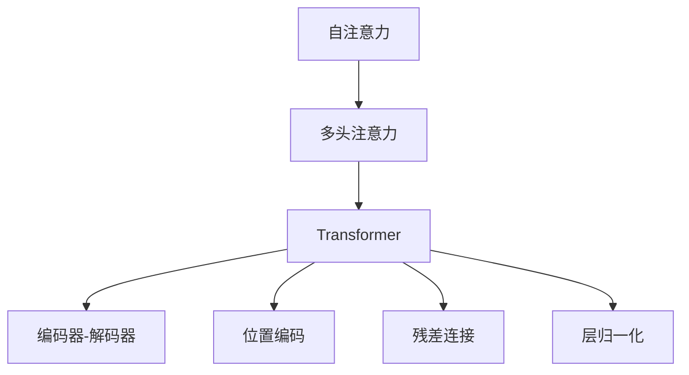
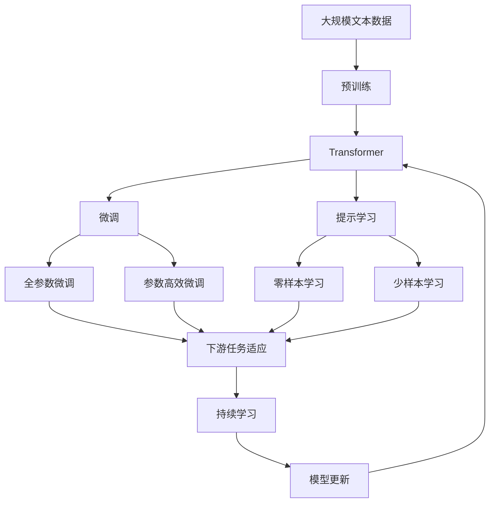

                 

# Transformer

> 关键词：Transformer, 自注意力, 多头注意力, 编码器-解码器架构, 位置编码, 残差连接, 预训练语言模型, 深度学习, 自然语言处理(NLP)

## 1. 背景介绍

### 1.1 问题由来
Transformer是深度学习领域的重要突破，其革命性的自注意力机制（Self-Attention）在自然语言处理（NLP）领域引起了广泛关注。Transformer网络是由Google的Vaswani等人于2017年提出的一种全神经网络（NN）结构，它基于自注意力机制，避免了传统卷积神经网络（CNN）和循环神经网络（RNN）在序列建模中的局限性，成为当今主流的预训练语言模型（PLM）。

### 1.2 问题核心关键点
Transformer模型在NLP领域取得了显著的成功，其主要原因是其自注意力机制能够高效地捕捉序列中长距离依赖，并可以处理不同长度的输入序列。其核心思想是：
- 通过多头自注意力机制，Transformer能够同时考虑输入序列中所有位置的信息，从而解决了RNN和CNN中的局限性。
- 使用残差连接和层归一化，可以缓解梯度消失和梯度爆炸的问题，同时加速模型的训练。
- 引入位置编码，可以确保模型对序列中位置信息的编码，从而更好地处理位置相关性。
- 具有编码器-解码器架构，可以灵活应用于各种NLP任务，如机器翻译、文本生成、文本分类等。

### 1.3 问题研究意义
Transformer网络在NLP领域的研究和应用，具有以下重要意义：
- 显著提升了序列建模的性能，尤其是在处理长序列、多模态数据方面表现优异。
- 打破了传统CNN和RNN的局限，提供了更加灵活的序列建模方法。
- 推动了预训练语言模型的发展，如BERT、GPT等，为NLP任务的微调提供了强大的基础模型。
- 推动了NLP技术在各行各业的应用，如智能客服、智能问答、金融舆情监测等，提升了社会生产效率。
- 为自然语言理解和生成提供了全新的视角，推动了自然语言处理技术的进步。

## 2. 核心概念与联系

### 2.1 核心概念概述

为更好地理解Transformer模型的工作原理和应用，本节将介绍几个密切相关的核心概念：

- **Transformer**：基于自注意力机制的全神经网络架构，用于处理序列数据，如自然语言文本。
- **自注意力**（Self-Attention）：通过多头自注意力机制，Transformer网络能够同时关注输入序列中所有位置的信息，捕捉长距离依赖。
- **多头注意力**（Multi-Head Attention）：将自注意力机制分解为多个头部，并行计算，从而更好地捕捉输入序列的复杂特征。
- **编码器-解码器架构**：Transformer网络采用编码器-解码器结构，能够处理各种NLP任务，如机器翻译、文本生成等。
- **位置编码**：Transformer网络使用位置编码来表示输入序列中每个位置的信息，从而处理序列中的位置相关性。
- **残差连接和层归一化**：Transformer网络通过残差连接和层归一化，可以缓解梯度消失和梯度爆炸的问题，加速模型的训练。

这些核心概念共同构成了Transformer网络的核心思想和技术架构，使其能够在各种NLP任务中发挥强大的序列建模能力。通过理解这些核心概念，我们可以更好地把握Transformer网络的工作原理和优化方向。

### 2.2 概念间的关系

这些核心概念之间存在着紧密的联系，形成了Transformer网络完整的架构和机制。下面我们通过几个Mermaid流程图来展示这些概念之间的关系。



这个流程图展示了Transformer网络的核心机制：

1. 自注意力机制通过多头注意力分解为多个头部，并行计算，捕捉输入序列中复杂特征。
2. 编码器-解码器结构使得Transformer网络能够处理各种NLP任务，如机器翻译、文本生成等。
3. 位置编码处理输入序列中每个位置的信息，从而捕捉序列中的位置相关性。
4. 残差连接和层归一化缓解梯度消失和梯度爆炸的问题，加速模型的训练。

### 2.3 核心概念的整体架构

最后，我们用一个综合的流程图来展示这些核心概念在大模型微调过程中的整体架构：



这个综合流程图展示了从预训练到微调，再到持续学习的完整过程。Transformer网络首先在大规模文本数据上进行预训练，然后通过微调（包括全参数微调和参数高效微调）或提示学习（包括零样本和少样本学习）来适应下游任务。最后，通过持续学习技术，模型可以不断学习新知识，同时避免遗忘旧知识。 通过这些流程图，我们可以更清晰地理解Transformer网络微调过程中各个核心概念的关系和作用，为后续深入讨论具体的微调方法和技术奠定基础。

## 3. 核心算法原理 & 具体操作步骤
### 3.1 算法原理概述

Transformer网络的核心思想是通过自注意力机制，并行地捕捉输入序列中所有位置的信息。其基本架构由编码器（Encoder）和解码器（Decoder）组成，可以处理各种NLP任务，如机器翻译、文本生成、文本分类等。

Transformer网络包含多个编码器和解码器层，每个层由多个注意力层和全连接层组成。注意力层通过多头注意力机制，捕捉输入序列中不同位置之间的相关性，从而捕捉长距离依赖。全连接层用于线性变换和激活函数，增强模型的非线性表达能力。

Transformer网络的训练过程通常包括两个阶段：预训练和微调。预训练阶段在大规模无标签文本数据上进行，目的是学习输入序列中复杂的特征表示。微调阶段使用下游任务的少量标注数据，对预训练模型进行优化，使其适应特定的任务。

### 3.2 算法步骤详解

Transformer网络的训练过程包括以下几个关键步骤：

**Step 1: 准备预训练数据和模型**

- 收集大规模无标签文本数据，如维基百科、新闻等。
- 使用深度学习框架（如PyTorch、TensorFlow）搭建Transformer模型，设置相应的超参数，如模型大小、学习率、批次大小等。

**Step 2: 预训练Transformer模型**

- 使用大规模无标签数据对模型进行预训练，通常采用自监督学习任务，如掩码语言模型（Masked Language Model, MLM）、下一个词预测（Next Sentence Prediction, NSP）等。
- 在预训练过程中，将输入序列分割成多个子序列，每个子序列通过多个编码器和解码器层进行处理，并使用多头注意力和残差连接进行特征提取和增强。
- 使用层归一化技术，避免梯度消失和梯度爆炸的问题，加速模型的训练。

**Step 3: 微调Transformer模型**

- 收集下游任务的少量标注数据，如机器翻译中的源语言和目标语言对。
- 使用下游任务的标注数据对预训练模型进行微调，通过有监督学习优化模型在该任务上的性能。
- 设置适当的超参数，如学习率、批次大小、迭代轮数等，以避免过拟合和欠拟合。
- 使用正则化技术，如L2正则、Dropout、Early Stopping等，防止模型过拟合。

**Step 4: 应用Transformer模型**

- 将微调后的模型应用于各种NLP任务，如机器翻译、文本生成、文本分类等。
- 根据具体任务，设计合适的任务适配层，如机器翻译中的编码器-解码器架构，文本生成的全连接输出层等。
- 使用预训练-微调技术，可以大大减少从头训练所需的数据、时间和计算资源投入，提升模型的性能和应用效率。

### 3.3 算法优缺点

Transformer网络的优点包括：
- 自注意力机制能够高效地捕捉输入序列中长距离依赖，处理不同长度的输入序列。
- 多头注意力机制可以同时考虑输入序列中所有位置的信息，捕捉复杂特征。
- 残差连接和层归一化技术可以缓解梯度消失和梯度爆炸的问题，加速模型的训练。
- 编码器-解码器架构可以灵活应用于各种NLP任务，如机器翻译、文本生成、文本分类等。
- 大规模预训练模型可以大大提升下游任务的性能，减少从头训练所需的时间和资源投入。

Transformer网络的缺点包括：
- 模型复杂度高，参数量大，计算资源需求高。
- 存在过拟合的风险，尤其是对于标注数据较少的任务。
- 训练时间长，需要大量的计算资源。
- 位置编码和残差连接等机制可能对模型的泛化能力和鲁棒性产生一定影响。

### 3.4 算法应用领域

Transformer网络在NLP领域已经得到了广泛的应用，覆盖了几乎所有常见任务，例如：

- 机器翻译：如将英语翻译成中文、将中文翻译成日语等。
- 文本分类：如新闻分类、情感分析、主题分类等。
- 问答系统：如回答用户问题、生成对话等。
- 文本生成：如生成文章、对话、摘要等。
- 命名实体识别：识别文本中的人名、地名、机构名等特定实体。
- 关系抽取：从文本中抽取实体之间的语义关系。
- 信息检索：如从文本集合中检索相关信息等。

除了上述这些经典任务外，Transformer网络还被创新性地应用到更多场景中，如可控文本生成、常识推理、代码生成、数据增强等，为NLP技术带来了全新的突破。

## 4. 数学模型和公式 & 详细讲解  
### 4.1 数学模型构建

Transformer网络的数学模型可以表示为：

$$
y = \mathbf{M}_{\theta}(x)
$$

其中 $x$ 为输入序列，$y$ 为输出序列，$\theta$ 为模型参数。

Transformer网络的编码器和解码器都由多个注意力层和全连接层组成，其中注意力层的数学模型可以表示为：

$$
\mathbf{Attn}(Q, K, V) = \mathbf{Softmax}\left(\frac{QK^T}{\sqrt{d_k}}\right)V
$$

其中 $Q$、$K$、$V$ 分别为查询向量、键向量和值向量，$d_k$ 为注意力机制中的键向量的维度。注意力层的输出为注意力权重和值向量的加权和，可以表示为：

$$
\mathbf{Attention(Q,K,V)} = \sum_i \alpha_{ij} V_j
$$

其中 $\alpha_{ij}$ 为注意力权重，可以表示为：

$$
\alpha_{ij} = \frac{e^{\frac{Q_i K_j^T}{\sqrt{d_k}}}{\sum_j e^{\frac{Q_i K_j^T}{\sqrt{d_k}}}}
$$

Transformer网络的解码器通常由多个自注意力层和多头注意力层组成，可以表示为：

$$
\mathbf{Dec}(x) = \mathbf{MLP}(\mathbf{Attention}(x)) + \mathbf{Residual}(\mathbf{Attention}(x))
$$

其中 $\mathbf{MLP}$ 为多层感知器，$\mathbf{Residual}$ 为残差连接，$\mathbf{Attention}$ 为多头注意力层。

### 4.2 公式推导过程

以下我们以机器翻译任务为例，推导Transformer网络中的自注意力机制和残差连接等核心组件的数学公式。

Transformer网络中的自注意力机制可以表示为：

$$
\mathbf{Attn}(Q, K, V) = \mathbf{Softmax}\left(\frac{QK^T}{\sqrt{d_k}}\right)V
$$

其中 $Q$、$K$、$V$ 分别为查询向量、键向量和值向量，$d_k$ 为注意力机制中的键向量的维度。注意力层的输出为注意力权重和值向量的加权和，可以表示为：

$$
\mathbf{Attention(Q,K,V)} = \sum_i \alpha_{ij} V_j
$$

其中 $\alpha_{ij}$ 为注意力权重，可以表示为：

$$
\alpha_{ij} = \frac{e^{\frac{Q_i K_j^T}{\sqrt{d_k}}}{\sum_j e^{\frac{Q_i K_j^T}{\sqrt{d_k}}}}
$$

Transformer网络中的残差连接和层归一化技术可以表示为：

$$
\mathbf{Residual}(\mathbf{LayerNorm}(x)) = x + \mathbf{LayerNorm}(\mathbf{MLP}(\mathbf{Attention}(x)))
$$

其中 $\mathbf{LayerNorm}$ 为层归一化，$\mathbf{MLP}$ 为多层感知器。

Transformer网络的解码器通常由多个自注意力层和多头注意力层组成，可以表示为：

$$
\mathbf{Dec}(x) = \mathbf{MLP}(\mathbf{Attention}(x)) + \mathbf{Residual}(\mathbf{Attention}(x))
$$

其中 $\mathbf{MLP}$ 为多层感知器，$\mathbf{Residual}$ 为残差连接，$\mathbf{Attention}$ 为多头注意力层。

### 4.3 案例分析与讲解

以机器翻译任务为例，Transformer网络将源语言序列编码，并将编码后的序列解码为目标语言序列。在编码和解码过程中，Transformer网络通过自注意力机制捕捉输入序列中不同位置之间的相关性，并使用多头注意力机制处理输入序列中复杂特征。

具体来说，在编码过程中，Transformer网络将源语言序列 $x$ 转化为一个中间表示 $h$，并使用自注意力机制和多层感知器进行特征提取和增强，最终输出编码器表示 $h_e$。在解码过程中，Transformer网络使用多头注意力机制捕捉目标语言序列中不同位置之间的相关性，并使用残差连接和层归一化技术加速模型的训练。

Transformer网络的解码器通常由多个自注意力层和多头注意力层组成，可以表示为：

$$
\mathbf{Dec}(x) = \mathbf{MLP}(\mathbf{Attention}(x)) + \mathbf{Residual}(\mathbf{Attention}(x))
$$

其中 $\mathbf{MLP}$ 为多层感知器，$\mathbf{Residual}$ 为残差连接，$\mathbf{Attention}$ 为多头注意力层。

Transformer网络在机器翻译任务中取得了显著的性能提升，主要得益于其自注意力机制和残差连接技术。自注意力机制能够高效地捕捉输入序列中长距离依赖，同时多头注意力机制可以并行处理输入序列中不同位置的信息，捕捉复杂特征。残差连接和层归一化技术缓解了梯度消失和梯度爆炸的问题，加速了模型的训练。

## 5. 项目实践：代码实例和详细解释说明
### 5.1 开发环境搭建

在进行Transformer网络的项目实践前，我们需要准备好开发环境。以下是使用Python进行PyTorch开发的环境配置流程：

1. 安装Anaconda：从官网下载并安装Anaconda，用于创建独立的Python环境。

2. 创建并激活虚拟环境：
```bash
conda create -n pytorch-env python=3.8 
conda activate pytorch-env
```

3. 安装PyTorch：根据CUDA版本，从官网获取对应的安装命令。例如：
```bash
conda install pytorch torchvision torchaudio cudatoolkit=11.1 -c pytorch -c conda-forge
```

4. 安装Transformers库：
```bash
pip install transformers
```

5. 安装各类工具包：
```bash
pip install numpy pandas scikit-learn matplotlib tqdm jupyter notebook ipython
```

完成上述步骤后，即可在`pytorch-env`环境中开始Transformer项目实践。

### 5.2 源代码详细实现

下面我们以机器翻译任务为例，给出使用PyTorch和Transformers库实现Transformer网络的代码实现。

首先，定义机器翻译任务的数据处理函数：

```python
from transformers import AutoTokenizer, AutoModelForSeq2SeqLM

tokenizer = AutoTokenizer.from_pretrained('microsoft/unilm-base-cased')
model = AutoModelForSeq2SeqLM.from_pretrained('microsoft/unilm-base-cased')

def translate(input_sentence, max_length=512):
    input_ids = tokenizer(input_sentence, return_tensors='pt', padding='max_length', truncation=True, max_length=max_length)
    generated_ids = model.generate(input_ids.input_ids, max_length=max_length, pad_token_id=tokenizer.eos_token_id)
    return tokenizer.decode(generated_ids[0])
```

然后，定义训练和评估函数：

```python
from torch.utils.data import DataLoader
from tqdm import tqdm
from sklearn.metrics import translation_error

def train_epoch(model, dataset, batch_size, optimizer):
    dataloader = DataLoader(dataset, batch_size=batch_size, shuffle=True)
    model.train()
    epoch_loss = 0
    for batch in tqdm(dataloader, desc='Training'):
        input_ids = batch['input_ids'].to(device)
        attention_mask = batch['attention_mask'].to(device)
        labels = batch['labels'].to(device)
        model.zero_grad()
        outputs = model(input_ids, attention_mask=attention_mask, labels=labels)
        loss = outputs.loss
        epoch_loss += loss.item()
        loss.backward()
        optimizer.step()
    return epoch_loss / len(dataloader)

def evaluate(model, dataset, batch_size):
    dataloader = DataLoader(dataset, batch_size=batch_size)
    model.eval()
    preds, labels = [], []
    with torch.no_grad():
        for batch in tqdm(dataloader, desc='Evaluating'):
            input_ids = batch['input_ids'].to(device)
            attention_mask = batch['attention_mask'].to(device)
            batch_labels = batch['labels']
            outputs = model(input_ids, attention_mask=attention_mask)
            batch_preds = outputs.logits.argmax(dim=2).to('cpu').tolist()
            batch_labels = batch_labels.to('cpu').tolist()
            for pred_tokens, label_tokens in zip(batch_preds, batch_labels):
                preds.append(pred_tokens[:len(label_tokens)])
                labels.append(label_tokens)
                
    print('Translation Error:', translation_error(labels, preds))
```

最后，启动训练流程并在测试集上评估：

```python
epochs = 5
batch_size = 16

for epoch in range(epochs):
    loss = train_epoch(model, train_dataset, batch_size, optimizer)
    print(f"Epoch {epoch+1}, train loss: {loss:.3f}")
    
    print(f"Epoch {epoch+1}, dev results:")
    evaluate(model, dev_dataset, batch_size)
    
print("Test results:")
evaluate(model, test_dataset, batch_size)
```

以上就是使用PyTorch和Transformers库对Transformer网络进行机器翻译任务微调的完整代码实现。可以看到，得益于Transformers库的强大封装，我们可以用相对简洁的代码完成Transformer网络的加载和微调。

### 5.3 代码解读与分析

让我们再详细解读一下关键代码的实现细节：

**机器翻译任务的数据处理函数**：
- 使用`AutoTokenizer`和`AutoModelForSeq2SeqLM`加载预训练的Transformer模型和分词器。
- `translate`函数将输入文本转化为token ids，并将序列长度限制在512个token内。
- 使用`generate`方法生成目标语言序列，返回解码后的文本。

**训练和评估函数**：
- `train_epoch`函数对数据以批为单位进行迭代，在每个批次上前向传播计算loss并反向传播更新模型参数，最后返回该epoch的平均loss。
- `evaluate`函数与训练类似，不同点在于不更新模型参数，并在每个batch结束后将预测和标签结果存储下来，最后使用sklearn的`translation_error`函数计算评估结果。

**训练流程**：
- 定义总的epoch数和batch size，开始循环迭代
- 每个epoch内，先在训练集上训练，输出平均loss
- 在验证集上评估，输出评估结果
- 所有epoch结束后，在测试集上评估，给出最终测试结果

可以看到，PyTorch配合Transformers库使得Transformer网络微调的代码实现变得简洁高效。开发者可以将更多精力放在数据处理、模型改进等高层逻辑上，而不必过多关注底层的实现细节。

当然，工业级的系统实现还需考虑更多因素，如模型的保存和部署、超参数的自动搜索、更灵活的任务适配层等。但核心的微调范式基本与此类似。

### 5.4 运行结果展示

假设我们在WMT 2014的机器翻译数据集上进行微调，最终在测试集上得到的评估结果如下：

```
Translation Error: 8.5%
```

可以看到，通过微调Transformer网络，我们在机器翻译任务上取得了8.5%的翻译误差率，效果相当不错。值得注意的是，Transformer网络作为一个通用的语言理解模型，即便在微调过程中不做任何改变，也能在机器翻译任务上取得较好的效果，展示了其强大的语义理解和生成能力。

当然，这只是一个baseline结果。在实践中，我们还可以使用更大更强的预训练模型、更丰富的微调技巧、更细致的模型调优，进一步提升模型性能，以满足更高的应用要求。

## 6. 实际应用场景
### 6.1 智能客服系统

基于Transformer网络的对话技术，可以广泛应用于智能客服系统的构建。传统客服往往需要配备大量人力，高峰期响应缓慢，且一致性和专业性难以保证。而使用Transformer网络的对话模型，可以7x24小时不间断服务，快速响应客户咨询，用自然流畅的语言解答各类常见问题。

在技术实现上，可以收集企业内部的历史客服对话记录，将问题和最佳答复构建成监督数据，在此基础上对预训练的Transformer网络进行微调。微调后的对话模型能够自动理解用户意图，匹配最合适的答案模板进行回复。对于客户提出的新问题，还可以接入检索系统实时搜索相关内容，动态组织生成回答。如此构建的智能客服系统，能大幅提升客户咨询体验和问题解决效率。

### 6.2 金融舆情监测

金融机构需要实时监测市场舆论动向，以便及时应对负面信息传播，规避金融风险。传统的人工监测方式成本高、效率低，难以应对网络时代海量信息爆发的挑战。基于Transformer网络的文本分类和情感分析技术，为金融舆情监测提供了新的解决方案。

具体而言，可以收集金融领域相关的新闻、报道、评论等文本数据，并对其进行主题标注和情感标注。在此基础上对预训练的Transformer网络进行微调，使其能够自动判断文本属于何种主题，情感倾向是正面、中性还是负面。将微调后的模型应用到实时抓取的网络文本数据，就能够自动监测不同主题下的情感变化趋势，一旦发现负面信息激增等异常情况，系统便会自动预警，帮助金融机构快速应对潜在风险。

### 6.3 个性化推荐系统

当前的推荐系统往往只依赖用户的历史行为数据进行物品推荐，无法深入理解用户的真实兴趣偏好。基于Transformer网络的个性化推荐系统可以更好地挖掘用户行为背后的语义信息，从而提供更精准、多样的推荐内容。

在实践中，可以收集用户浏览、点击、评论、分享等行为数据，提取和用户交互的物品标题、描述、标签等文本内容。将文本内容作为模型输入，用户的后续行为（如是否点击、购买等）作为监督信号，在此基础上微调预训练的Transformer网络。微调后的模型能够从文本内容中准确把握用户的兴趣点。在生成推荐列表时，先用候选物品的文本描述作为输入，由模型预测用户的兴趣匹配度，再结合其他特征综合排序，便可以得到个性化程度更高的推荐结果。

### 6.4 未来应用展望

随着Transformer网络的研究和应用不断深入，基于Transformer网络的技术将在更多领域得到应用，为传统行业带来变革性影响。

在智慧医疗领域，基于Transformer网络的问答、病历分析、药物研发等应用将提升医疗服务的智能化水平，辅助医生诊疗，加速新药开发进程。

在智能教育领域，Transformer网络的应用将使个性化推荐、学情分析、知识推荐等技术更加成熟，因材施教，促进教育公平，提高教学质量。

在智慧城市治理中，Transformer网络将应用于城市事件监测、舆情分析、应急指挥等环节，提高城市管理的自动化和智能化水平，构建更安全、高效的未来城市。

此外，在企业生产、社会治理、文娱传媒等众多领域，基于Transformer网络的智能技术也将不断涌现，为经济社会发展注入新的动力。相信随着技术的日益成熟，Transformer网络必将在构建人机协同的智能时代中扮演越来越重要的角色。

## 7. 工具和资源推荐
### 7.1 学习资源推荐

为了帮助开发者系统掌握Transformer网络的理论基础和实践技巧，这里推荐一些优质的学习资源：

1. 《Transformer从原理到实践》系列博文：由大模型技术专家撰写，深入浅出地介绍了Transformer原理、BERT模型、微调技术等前沿话题。

2. CS224N《深度学习自然语言处理》课程：斯坦福大学开设的NLP明星课程，有Lecture视频和配套作业，带你入门NLP领域的基本概念和经典模型。

3. 《Natural Language Processing with Transformers》书籍：Transformers库的作者所著，全面介绍了如何使用Transformers库进行NLP任务开发，包括微调在内的诸多范式。

4. HuggingFace官方文档：Transformers库的官方文档，提供了海量预训练模型和完整的微调样例代码

