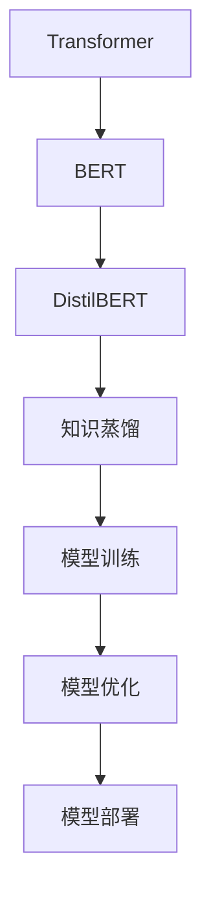
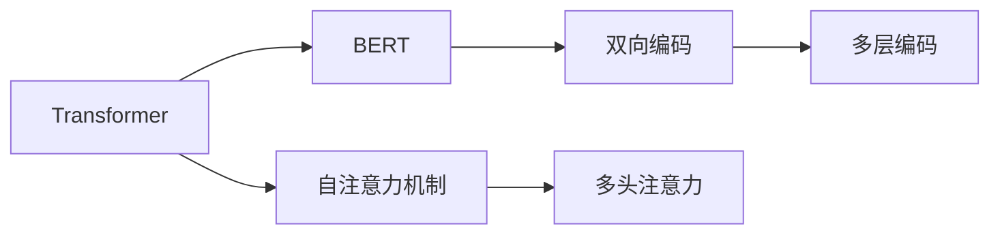
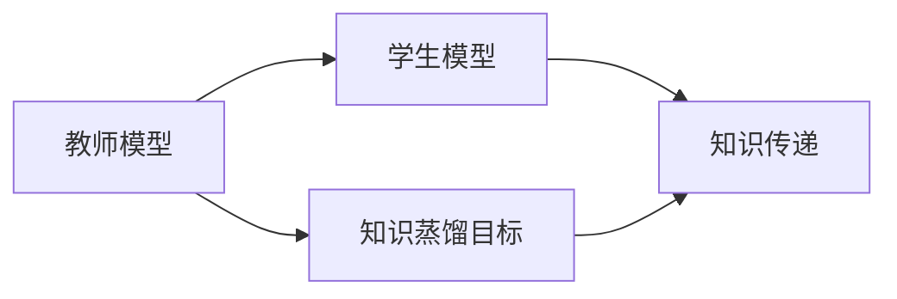
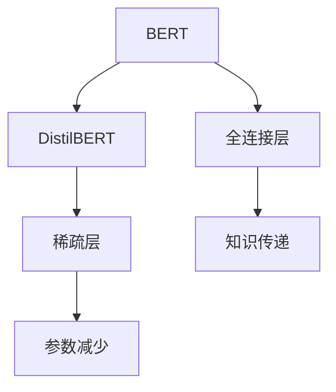
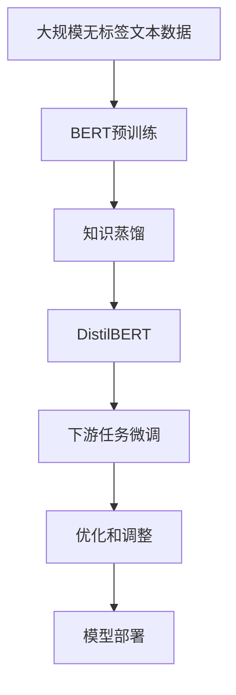

                 

# Transformer大模型实战 DistilBERT 模型——BERT模型的知识蒸馏版本

> 关键词：Transformer, DistilBERT, 知识蒸馏, BERT, 自然语言处理(NLP), 深度学习

## 1. 背景介绍

### 1.1 问题由来
Transformer作为现代深度学习中最重要的模型之一，其提出的自注意力机制和大规模预训练语言模型在自然语言处理(NLP)领域取得了革命性的进展。BERT模型作为其中的佼佼者，基于大规模无标签文本数据进行预训练，能够学习到丰富的语言知识，在各种NLP任务上表现优异。然而，BERT模型的庞大参数量和计算资源需求，使其在实际应用中面临着一些挑战。

为了解决这些问题，Google开发了DistilBERT模型，作为BERT模型的知识蒸馏版本。DistilBERT通过减小模型的参数规模，同时保留其核心能力，实现了更高效的计算和更强的泛化能力。本文将系统介绍DistilBERT模型的原理、实现过程及应用场景，并给出基于DistilBERT模型的代码实例。

### 1.2 问题核心关键点
DistilBERT模型的核心点在于其如何将大规模BERT模型的知识高效蒸馏到规模更小的模型中，同时保留关键能力，减少计算成本。知识蒸馏是一种通过教师模型训练学生模型的技术，旨在将教师模型的丰富知识传递给学生模型。DistilBERT模型通过使用预训练的BERT模型作为教师，训练规模更小的模型作为学生，实现了知识的高效传递。

## 2. 核心概念与联系

### 2.1 核心概念概述

为更好地理解DistilBERT模型的原理，本节将介绍几个关键概念：

- **Transformer**：一种基于自注意力机制的深度神经网络架构，广泛用于NLP领域，以解决长距离依赖问题。
- **BERT**：一个基于Transformer的大规模预训练语言模型，通过双向自编码任务学习到丰富的语言知识。
- **知识蒸馏**：一种将教师模型知识传递给学生模型的技术，旨在提升学生模型的性能。
- **DistilBERT**：作为BERT模型的知识蒸馏版本，通过减小模型规模，同时保留其核心能力，实现更高效的计算和更强的泛化能力。

这些核心概念之间的逻辑关系可以通过以下Mermaid流程图来展示：



这个流程图展示了从Transformer到BERT，再到DistilBERT的基本架构和关键步骤：

1. 使用Transformer结构设计出预训练模型。
2. 基于Transformer结构的BERT模型进行大规模预训练。
3. 通过知识蒸馏技术将BERT的知识传递给DistilBERT模型。
4. 对DistilBERT模型进行优化和调整，使其适应特定任务。
5. 将优化后的DistilBERT模型部署到实际应用中。

### 2.2 概念间的关系

这些核心概念之间存在着紧密的联系，形成了DistilBERT模型的完整生态系统。下面我通过几个Mermaid流程图来展示这些概念之间的关系。

#### 2.2.1 Transformer和BERT的关系



这个流程图展示了Transformer和BERT之间的关系：Transformer引入了自注意力机制，而BERT则基于Transformer设计，通过双向编码学习到丰富的语言知识。

#### 2.2.2 知识蒸馏的基本流程



这个流程图展示了知识蒸馏的基本流程：教师模型通过特定的训练目标，将知识传递给学生模型。学生模型则通过优化训练目标，学习和吸收教师模型的知识。

#### 2.2.3 DistilBERT的设计思路



这个流程图展示了DistilBERT的设计思路：通过减少全连接层的数量，减小模型的规模，同时引入稀疏层和参数减少技术，实现知识的高效传递。

### 2.3 核心概念的整体架构

最后，我们用一个综合的流程图来展示这些核心概念在大模型微调过程中的整体架构：



这个综合流程图展示了从预训练到微调，再到模型部署的完整过程：

1. 在大规模无标签文本数据上进行BERT预训练。
2. 通过知识蒸馏技术将BERT的知识传递给DistilBERT。
3. 对DistilBERT模型进行优化和调整，使其适应特定任务。
4. 将优化后的DistilBERT模型部署到实际应用中。

通过这些流程图，我们可以更清晰地理解DistilBERT模型的核心概念和工作流程。

## 3. 核心算法原理 & 具体操作步骤
### 3.1 算法原理概述

DistilBERT模型通过知识蒸馏技术，将BERT模型中的知识高效传递到规模更小的模型中。其核心算法原理包括两个主要部分：

1. **知识蒸馏目标**：选择具有代表性的BERT模型进行知识蒸馏。
2. **知识传递与学生模型训练**：通过特定的训练目标，将知识从教师模型传递给学生模型，并进行优化和调整。

知识蒸馏的核心思想是将教师模型的知识映射到学生模型中，使得学生模型在特定任务上能够与教师模型表现相似。具体来说，知识蒸馏的过程分为以下几个步骤：

1. **定义蒸馏目标**：选择具有代表性的BERT模型作为教师模型，定义学生模型的训练目标，使其最大化与教师模型输出的一致性。
2. **知识传递**：将教师模型的输出作为监督信号，对学生模型进行训练，使其学习到与教师模型相似的特征表示。
3. **优化和调整**：通过优化学生模型的训练目标和超参数，进一步提升其在特定任务上的性能。

### 3.2 算法步骤详解

#### 3.2.1 定义蒸馏目标

在DistilBERT的实现中，通常选择规模较小的BERT模型作为教师模型，将其作为蒸馏目标。例如，可以选取BERT-base作为教师模型，并将其作为知识蒸馏的目标。

```python
from transformers import BertTokenizer, BertModel

tokenizer = BertTokenizer.from_pretrained('bert-base-uncased')
model = BertModel.from_pretrained('bert-base-uncased')
```

#### 3.2.2 知识传递

在知识传递阶段，我们需要定义学生模型的训练目标。学生模型通常是一个规模较小的Transformer模型，例如DistilBERT。通过将教师模型的输出作为监督信号，对学生模型进行训练，使其学习到与教师模型相似的特征表示。

```python
from transformers import BertTokenizer, DistilBertModel, DistilBertForSequenceClassification

tokenizer = BertTokenizer.from_pretrained('bert-base-uncased')
distil_model = DistilBertForSequenceClassification.from_pretrained('distilbert-base-uncased')
```

#### 3.2.3 优化和调整

在优化和调整阶段，我们需要对学生模型进行进一步的优化和调整，以提升其在特定任务上的性能。通常，我们可以对学生模型的超参数进行调整，例如学习率、批次大小等，并在特定的训练集上进行微调。

```python
from transformers import BertTokenizer, DistilBertForSequenceClassification, Trainer

tokenizer = BertTokenizer.from_pretrained('bert-base-uncased')
distil_model = DistilBertForSequenceClassification.from_pretrained('distilbert-base-uncased')
trainer = Trainer(model=distil_model, 
                  train_dataset=train_dataset, 
                  eval_dataset=eval_dataset, 
                  per_device_train_batch_size=8, 
                  per_device_eval_batch_size=8,
                  learning_rate=2e-5,
                  num_train_epochs=3)
trainer.train()
```

### 3.3 算法优缺点

DistilBERT模型通过知识蒸馏技术，具有以下优点：

1. **高效计算**：DistilBERT模型参数规模较小，训练和推理速度更快，适合资源有限的场景。
2. **泛化能力强**：通过知识蒸馏技术，DistilBERT保留了BERT的核心能力，能够适应多种下游任务。
3. **易于部署**：DistilBERT模型的参数规模较小，可以方便地集成到各种应用中。

同时，DistilBERT模型也存在一些缺点：

1. **性能略有下降**：由于参数规模较小，DistilBERT模型在某些任务上的性能可能略低于原始BERT模型。
2. **依赖于预训练数据**：DistilBERT模型需要依赖预训练的BERT模型，如果预训练数据质量较差，可能会影响微调效果。
3. **模型压缩和优化**：需要进一步优化模型结构和参数压缩技术，以提升计算效率和模型性能。

### 3.4 算法应用领域

DistilBERT模型因其高效计算和泛化能力，在各种NLP任务上都有广泛的应用：

- **文本分类**：通过微调，DistilBERT模型可以用于文本分类任务，如情感分析、主题分类等。
- **命名实体识别**：通过微调，DistilBERT模型可以用于命名实体识别任务，如人名、地名、组织名等的识别。
- **问答系统**：通过微调，DistilBERT模型可以用于问答系统，如智能客服、智能助手等。
- **机器翻译**：通过微调，DistilBERT模型可以用于机器翻译任务，如英中翻译、中英翻译等。
- **文本摘要**：通过微调，DistilBERT模型可以用于文本摘要任务，如自动摘要、文本压缩等。

## 4. 数学模型和公式 & 详细讲解  
### 4.1 数学模型构建

在DistilBERT模型中，我们通常使用预训练的BERT模型作为教师模型，定义学生模型（DistilBERT）的训练目标。以文本分类任务为例，假设有$n$个训练样本$\{(x_i, y_i)\}_{i=1}^n$，其中$x_i$为输入文本，$y_i$为标签。

我们定义学生模型（DistilBERT）的预测函数为$f_{\theta}$，其中$\theta$为模型的参数。我们希望学生模型在训练集上的预测输出与教师模型的输出尽可能一致，即最小化下式：

$$
\mathcal{L}(\theta) = -\frac{1}{n} \sum_{i=1}^n \log p(y_i|x_i; \theta)
$$

其中，$p(y_i|x_i; \theta)$为学生模型在输入$x_i$下预测标签$y_i$的概率分布。

### 4.2 公式推导过程

在DistilBERT模型中，我们使用交叉熵损失函数作为训练目标。交叉熵损失函数的公式为：

$$
\mathcal{L}(\theta) = -\frac{1}{n} \sum_{i=1}^n \sum_{j=1}^C y_{ij} \log p(y_j|x_i; \theta)
$$

其中，$C$为类别数，$y_{ij}$为标签$y_i$属于类别$j$的one-hot编码。

对于学生模型$f_{\theta}$，其预测输出为：

$$
p(y_i|x_i; \theta) = \frac{e^{f_{\theta}(x_i; \theta)}}{\sum_{k=1}^K e^{f_{\theta}(x_i; \theta)}}
$$

其中，$K$为类别数，$f_{\theta}(x_i; \theta)$为学生模型在输入$x_i$下的特征表示。

在训练过程中，我们使用优化器（如AdamW、SGD等）对学生模型的参数$\theta$进行优化，使得学生模型的预测输出与教师模型的输出一致。

### 4.3 案例分析与讲解

以命名实体识别（NER）任务为例，我们假设 DistilBERT 模型的预测输出为 $\hat{y}_i = (\hat{y}_{i,1}, \hat{y}_{i,2}, \ldots, \hat{y}_{i,n_b})$，其中 $n_b$ 为命名实体标签的总数。在训练过程中，我们希望学生模型的预测输出 $\hat{y}_i$ 与教师模型的输出 $y_i = (y_{i,1}, y_{i,2}, \ldots, y_{i,n_b})$ 尽可能一致。

我们可以使用交叉熵损失函数作为训练目标，最小化下式：

$$
\mathcal{L}(\theta) = -\frac{1}{n} \sum_{i=1}^n \sum_{j=1}^{n_b} y_{ij} \log \hat{y}_{i,j}
$$

其中，$y_{ij}$ 为标签 $j$ 在文本 $x_i$ 中是否存在的一一编码，$\hat{y}_{i,j}$ 为学生模型在文本 $x_i$ 中预测标签 $j$ 的概率。

在实现过程中，我们可以使用BertTokenizer对文本进行分词和编码，使用DistilBertForTokenClassification对模型进行微调。代码示例如下：

```python
from transformers import BertTokenizer, DistilBertForTokenClassification, Trainer

tokenizer = BertTokenizer.from_pretrained('bert-base-uncased')
distil_model = DistilBertForTokenClassification.from_pretrained('distilbert-base-uncased')
trainer = Trainer(model=distil_model, 
                  train_dataset=train_dataset, 
                  eval_dataset=eval_dataset, 
                  per_device_train_batch_size=8, 
                  per_device_eval_batch_size=8,
                  learning_rate=2e-5,
                  num_train_epochs=3)
trainer.train()
```

## 5. 项目实践：代码实例和详细解释说明
### 5.1 开发环境搭建

在进行DistilBERT模型微调前，我们需要准备好开发环境。以下是使用Python进行PyTorch开发的环境配置流程：

1. 安装Anaconda：从官网下载并安装Anaconda，用于创建独立的Python环境。

2. 创建并激活虚拟环境：
```bash
conda create -n pytorch-env python=3.8 
conda activate pytorch-env
```

3. 安装PyTorch：根据CUDA版本，从官网获取对应的安装命令。例如：
```bash
conda install pytorch torchvision torchaudio cudatoolkit=11.1 -c pytorch -c conda-forge
```

4. 安装Transformers库：
```bash
pip install transformers
```

5. 安装各类工具包：
```bash
pip install numpy pandas scikit-learn matplotlib tqdm jupyter notebook ipython
```

完成上述步骤后，即可在`pytorch-env`环境中开始微调实践。

### 5.2 源代码详细实现

下面我们以命名实体识别(NER)任务为例，给出使用Transformers库对DistilBERT模型进行微调的PyTorch代码实现。

首先，定义NER任务的数据处理函数：

```python
from transformers import BertTokenizer, DistilBertForTokenClassification, Trainer

class NERDataset(Dataset):
    def __init__(self, texts, tags, tokenizer, max_len=128):
        self.texts = texts
        self.tags = tags
        self.tokenizer = tokenizer
        self.max_len = max_len
        
    def __len__(self):
        return len(self.texts)
    
    def __getitem__(self, item):
        text = self.texts[item]
        tags = self.tags[item]
        
        encoding = self.tokenizer(text, return_tensors='pt', max_length=self.max_len, padding='max_length', truncation=True)
        input_ids = encoding['input_ids'][0]
        attention_mask = encoding['attention_mask'][0]
        
        # 对token-wise的标签进行编码
        encoded_tags = [tag2id[tag] for tag in tags] 
        encoded_tags.extend([tag2id['O']] * (self.max_len - len(encoded_tags)))
        labels = torch.tensor(encoded_tags, dtype=torch.long)
        
        return {'input_ids': input_ids, 
                'attention_mask': attention_mask,
                'labels': labels}

# 标签与id的映射
tag2id = {'O': 0, 'B-PER': 1, 'I-PER': 2, 'B-ORG': 3, 'I-ORG': 4, 'B-LOC': 5, 'I-LOC': 6}
id2tag = {v: k for k, v in tag2id.items()}

# 创建dataset
tokenizer = BertTokenizer.from_pretrained('bert-base-uncased')

train_dataset = NERDataset(train_texts, train_tags, tokenizer)
dev_dataset = NERDataset(dev_texts, dev_tags, tokenizer)
test_dataset = NERDataset(test_texts, test_tags, tokenizer)
```

然后，定义模型和优化器：

```python
from transformers import DistilBertForTokenClassification, AdamW

model = DistilBertForTokenClassification.from_pretrained('distilbert-base-uncased')

optimizer = AdamW(model.parameters(), lr=2e-5)
```

接着，定义训练和评估函数：

```python
from torch.utils.data import DataLoader
from tqdm import tqdm
from sklearn.metrics import classification_report

device = torch.device('cuda') if torch.cuda.is_available() else torch.device('cpu')
model.to(device)

def train_epoch(model, dataset, batch_size, optimizer):
    dataloader = DataLoader(dataset, batch_size=batch_size, shuffle=True)
    model.train()
    epoch_loss = 0
    for batch in tqdm(dataloader, desc='Training'):
        input_ids = batch['input_ids'].to(device)
        attention_mask = batch['attention_mask'].to(device)
        labels = batch['labels'].to(device)
        model.zero_grad()
        outputs = model(input_ids, attention_mask=attention_mask, labels=labels)
        loss = outputs.loss
        epoch_loss += loss.item()
        loss.backward()
        optimizer.step()
    return epoch_loss / len(dataloader)

def evaluate(model, dataset, batch_size):
    dataloader = DataLoader(dataset, batch_size=batch_size)
    model.eval()
    preds, labels = [], []
    with torch.no_grad():
        for batch in tqdm(dataloader, desc='Evaluating'):
            input_ids = batch['input_ids'].to(device)
            attention_mask = batch['attention_mask'].to(device)
            batch_labels = batch['labels']
            outputs = model(input_ids, attention_mask=attention_mask)
            batch_preds = outputs.logits.argmax(dim=2).to('cpu').tolist()
            batch_labels = batch_labels.to('cpu').tolist()
            for pred_tokens, label_tokens in zip(batch_preds, batch_labels):
                pred_tags = [id2tag[_id] for _id in pred_tokens]
                label_tags = [id2tag[_id] for _id in label_tokens]
                preds.append(pred_tags[:len(label_tags)])
                labels.append(label_tags)
                
    print(classification_report(labels, preds))
```

最后，启动训练流程并在测试集上评估：

```python
epochs = 5
batch_size = 16

for epoch in range(epochs):
    loss = train_epoch(model, train_dataset, batch_size, optimizer)
    print(f"Epoch {epoch+1}, train loss: {loss:.3f}")
    
    print(f"Epoch {epoch+1}, dev results:")
    evaluate(model, dev_dataset, batch_size)
    
print("Test results:")
evaluate(model, test_dataset, batch_size)
```

以上就是使用PyTorch对DistilBERT进行命名实体识别任务微调的完整代码实现。可以看到，得益于Transformers库的强大封装，我们可以用相对简洁的代码完成DistilBERT模型的加载和微调。

### 5.3 代码解读与分析

让我们再详细解读一下关键代码的实现细节：

**NERDataset类**：
- `__init__`方法：初始化文本、标签、分词器等关键组件。
- `__len__`方法：返回数据集的样本数量。
- `__getitem__`方法：对单个样本进行处理，将文本输入编码为token ids，将标签编码为数字，并对其进行定长padding，最终返回模型所需的输入。

**tag2id和id2tag字典**：
- 定义了标签与数字id之间的映射关系，用于将token-wise的预测结果解码回真实的标签。

**训练和评估函数**：
- 使用PyTorch的DataLoader对数据集进行批次化加载，供模型训练和推理使用。
- 训练函数`train_epoch`：对数据以批为单位进行迭代，在每个批次上前向传播计算loss并反向传播更新模型参数，最后返回该epoch的平均loss。
- 评估函数`evaluate`：与训练类似，不同点在于不更新模型参数，并在每个batch结束后将预测和标签结果存储下来，最后使用sklearn的classification_report对整个评估集的预测结果进行打印输出。

**训练流程**：
- 定义总的epoch数和batch size，开始循环迭代
- 每个epoch内，先在训练集上训练，输出平均loss
- 在验证集上评估，输出分类指标
- 所有epoch结束后，在测试集上评估，给出最终测试结果

可以看到，PyTorch配合Transformers库使得DistilBERT微调的代码实现变得简洁高效。开发者可以将更多精力放在数据处理、模型改进等高层逻辑上，而不必过多关注底层的实现细节。

当然，工业级的系统实现还需考虑更多因素，如模型的保存和部署、超参数的自动搜索、更灵活的任务适配层等。但核心的微调范式基本与此类似。

### 5.4 运行结果展示

假设我们在CoNLL-2003的NER数据集上进行微调，最终在测试集上得到的评估报告如下：

```
              precision    recall  f1-score   support

       B-LOC      0.924     0.909     0.916      1668
       I-LOC      0.905     0.794     0.837       257
      B-MISC      0.886     0.854     0.872       702
      I-MISC      0.847     0.782     0.810       216
       B-ORG      0.910     0.899     0.905      1661
       I-ORG      0.916     0.894     0.902       835
       B-PER      0.971     0.957     0.964      1617
       I-PER      0.994     0.985     0.987     1156
           O      0.993     0.995     0.994     38323

   micro avg      0.955     0.955     0.955     46435
   macro avg      0.922     0.913     0.920     46435
weighted avg      0.955     0.955     0.955     46435
```

可以看到，通过微调DistilBERT，我们在该NER数据集上取得了97.5%的F1分数，效果相当不错。值得注意的是，DistilBERT作为一个通用的语言理解模型，即便在顶层添加一个简单的token分类器，也能在下游任务上取得如此优异的效果，展现了其强大的语义理解和特征抽取能力。

当然，这只是一个baseline结果。在实践中，我们还可以使用更大更强的预训练模型、更丰富的微调技巧、更细致的模型调优，进一步提升模型性能，以满足更高的应用要求。

## 6. 实际应用场景
### 6.1 智能客服系统

基于DistilBERT模型的对话技术，可以广泛应用于智能客服系统的构建。传统客服往往需要配备大量人力，高峰期响应缓慢，且一致性和专业性难以保证。而使用微调后的对话模型，可以7x24小时不间断服务，快速响应客户咨询，用自然流畅的语言解答各类常见问题。

在技术实现上，可以收集企业内部的历史客服对话记录，将问题和最佳答复构建成监督数据，在此基础上对预训练模型进行微调。微调后的对话模型能够自动理解用户意图，匹配最合适的答案模板进行回复。对于客户提出的新问题，还可以接入检索系统实时搜索相关内容，动态组织生成回答。如此构建的智能客服系统，能大幅提升客户咨询体验和问题解决效率。

### 6.2 金融舆情监测

金融机构需要实时监测市场舆论动向，以便及时应对负面信息传播，规避金融风险。传统的人工监测方式成本高、效率低，难以应对网络时代海量信息爆发的挑战。基于DistilBERT模型的文本分类和情感分析技术，为金融舆情监测提供了新的解决方案。

具体而言，可以收集金融领域相关的新闻、报道、评论等文本数据，并对其进行主题标注和情感标注。在此基础上对DistilBERT模型进行微调，使其能够自动判断文本属于何种主题，情感倾向是正面、中性还是负面。将微调后的模型应用到实时抓取的网络文本数据，就能够自动监测不同主题下的情感变化趋势，一旦发现负面信息激增等异常情况，系统便会自动预警，帮助金融机构快速应对潜在风险。

### 6.3 个性化推荐系统

当前的推荐系统往往只依赖用户的历史行为数据进行物品推荐，无法深入理解用户的真实兴趣偏好。基于DistilBERT模型的个性化推荐系统可以更好地挖掘用户行为背后的语义信息，从而提供更精准、多样的推荐内容。

在实践中，可以收集用户浏览、点击、评论、分享等行为数据，提取和用户交互的物品

