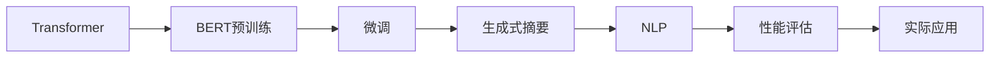
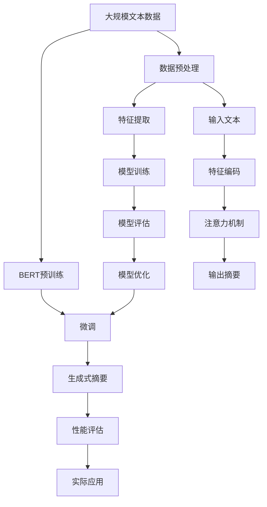

                 

# Transformer大模型实战 使用BERT 模型执行抽象式摘要任务

> 关键词：
- Transformer
- BERT
- 抽象式摘要
- 预训练模型
- 微调
- 自然语言处理 (NLP)
- 数学模型
- 代码实现
- 性能评估
- 实际应用

## 1. 背景介绍

### 1.1 问题由来

在信息时代，人们需要处理和理解大量的文本信息，例如新闻、论文、报告等。然而，文本通常较长且包含大量冗余信息，这使得快速、准确地理解文本内容变得具有挑战性。为了解决这一问题，文本摘要技术应运而生，旨在自动提取文本的关键信息并生成简洁的摘要。

### 1.2 问题核心关键点

文本摘要技术可以分为两种类型：提取式摘要和生成式摘要。提取式摘要是从文本中直接抽取关键句子或短语作为摘要，而生成式摘要则是通过语言模型生成新的文本片段作为摘要。生成式摘要更具有创造性，可以生成更加自然流畅的摘要。

使用大语言模型，如BERT，进行生成式摘要的任务称为“抽象式摘要”。这种方法通过微调大模型，使其能够在输入长篇文本后自动生成简洁、准确、连贯的摘要，适用于新闻报道、学术论文、法律文件等多种场景。

### 1.3 问题研究意义

生成式摘要在自动化信息处理、智能助手、文档管理等方面具有重要应用价值。它能够帮助人们快速获取文本的核心信息，节省大量阅读时间，从而提升工作效率。此外，生成式摘要还能在不同语言和文化背景之间进行信息传递，促进全球信息共享。

## 2. 核心概念与联系

### 2.1 核心概念概述

要深入理解使用BERT模型执行抽象式摘要任务，需要先掌握以下核心概念：

- **Transformer**：一种基于自注意力机制的深度学习架构，能够高效地处理序列数据，广泛应用于自然语言处理任务。
- **BERT**：一种预训练语言模型，能够学习到丰富的语言表示，用于生成式摘要任务的初始化。
- **微调**：在大模型上进行有监督的训练，以适应特定任务的需求。
- **自然语言处理 (NLP)**：人工智能的一个分支，专注于处理、理解和生成人类语言的技术。
- **数学模型**：用于描述、分析和优化文本摘要任务的基础。
- **代码实现**：将数学模型转化为可执行的程序代码，实现具体的文本摘要功能。
- **性能评估**：对生成的摘要进行质量评估，确保其准确性和连贯性。
- **实际应用**：将生成的摘要应用于实际场景，例如智能助理、新闻编辑、学术研究等。

### 2.2 概念间的关系

这些核心概念之间的关系可以通过以下Mermaid流程图来展示：



这个流程图展示了从Transformer架构到BERT预训练，再到微调，最后到生成式摘要的完整流程。其中，NLP用于描述和处理语言数据，性能评估确保摘要质量，实际应用将生成的摘要应用于各种场景。

### 2.3 核心概念的整体架构

最终，我们可以用一个综合的流程图来展示这些核心概念之间的整体架构：



这个流程图展示了从原始文本数据到最终生成式摘要的完整流程。从大规模文本数据到BERT预训练，再到微调，最后生成摘要，整个过程包含了数据预处理、特征提取、模型训练、性能评估和模型优化等多个环节。

## 3. 核心算法原理 & 具体操作步骤

### 3.1 算法原理概述

使用BERT模型执行抽象式摘要任务，本质上是一种基于深度学习的生成式建模。具体而言，通过微调BERT模型，使其在输入长篇文本后，能够自动生成简洁、准确、连贯的摘要。

### 3.2 算法步骤详解

1. **数据预处理**：收集和整理需要摘要的文本数据，并进行预处理，例如去除停用词、分词、标准化文本格式等。

2. **特征提取**：将预处理后的文本转换为模型可以处理的向量表示。可以使用BERT模型自带的Transformer层，或者使用其他预训练模型进行特征提取。

3. **模型训练**：使用标注好的摘要数据集对BERT模型进行微调训练，使其学习如何从原始文本中生成摘要。

4. **性能评估**：使用评估指标（例如BLEU、ROUGE等）对生成的摘要进行质量评估，确保摘要的准确性和连贯性。

5. **模型优化**：根据评估结果，对模型进行进一步优化，例如调整学习率、增加训练轮次等，以提升生成式摘要的质量。

6. **实际应用**：将优化的模型部署到实际应用场景中，例如智能助理、新闻编辑、学术论文整理等。

### 3.3 算法优缺点

**优点**：

- 能够自动生成高质量的摘要，节省大量人工时间。
- 适用于多种类型的文本数据，包括新闻、学术论文、法律文件等。
- 能够生成不同长度的摘要，满足不同应用场景的需求。

**缺点**：

- 对标注数据的质量和数量要求较高，数据标注成本较高。
- 生成的摘要可能存在歧义或不连贯的情况，需要人工后处理。
- 对模型和计算资源的需求较高，特别是在处理大规模文本数据时。

### 3.4 算法应用领域

抽象式摘要技术已经广泛应用于新闻媒体、学术研究、法律文书、金融报告等多个领域，帮助用户快速获取文本核心信息，提高信息处理效率。未来，随着深度学习技术的不断进步，生成式摘要技术有望进一步应用于更多场景，例如智能客服、智能翻译、智能广告等，推动人工智能技术的广泛应用。

## 4. 数学模型和公式 & 详细讲解

### 4.1 数学模型构建

使用BERT模型进行生成式摘要任务时，可以使用以下数学模型：

$$
P(\text{summarized_text} | \text{text}) = \prod_{i=1}^{N} P(\text{summarized_text}_i | \text{text}_{[1:i-1]})
$$

其中，$N$ 表示文本长度，$\text{summarized_text}$ 表示生成的摘要，$\text{text}$ 表示原始文本，$P(\cdot)$ 表示概率。这个公式表示，生成式摘要的条件概率可以通过计算生成每个摘要片段的条件概率，并乘积得到。

### 4.2 公式推导过程

在推导生成式摘要的条件概率时，可以将其拆分为多个子任务，例如生成第一个摘要片段、生成第二个摘要片段，以此类推。对于每个子任务，可以使用以下公式：

$$
P(\text{summarized_text}_i | \text{text}_{[1:i-1]}) = \frac{P(\text{summarized_text}_i, \text{text}_{[1:i-1]})}{P(\text{text}_{[1:i-1]})}
$$

其中，$P(\cdot)$ 表示概率，$\text{summarized_text}_i$ 表示第 $i$ 个摘要片段，$\text{text}_{[1:i-1]}$ 表示原始文本的前 $i-1$ 个词。这个公式表示，生成第 $i$ 个摘要片段的条件概率，可以通过计算生成该片段和前 $i-1$ 个词的条件概率，并除以前 $i-1$ 个词的概率得到。

### 4.3 案例分析与讲解

以一个简单的例子来说明上述数学模型的应用：

假设原始文本为：“Transformer是一种基于自注意力机制的深度学习架构，能够高效地处理序列数据，广泛应用于自然语言处理任务。”

我们希望生成一个摘要，长度为3个词。首先，使用BERT模型提取每个词的向量表示。然后，根据这些向量表示计算生成每个摘要片段的条件概率，并乘积得到最终的摘要概率。例如，生成的第一个摘要片段为“Transformer是一种”，第二个摘要片段为“基于自注意力机制”，第三个摘要片段为“深度学习架构”。这些片段可以进一步组合成最终的摘要。

## 5. 项目实践：代码实例和详细解释说明

### 5.1 开发环境搭建

要实现使用BERT模型进行抽象式摘要任务，需要搭建一个Python开发环境。以下是一些基本的搭建步骤：

1. 安装Python：可以从官网下载Python安装包，并安装到本地计算机。

2. 安装相关库：安装必要的Python库，例如TensorFlow、PyTorch、Transformers等。

3. 配置GPU：如果计算机有独立的GPU，需要在安装过程中配置GPU的权限，以便使用GPU加速计算。

### 5.2 源代码详细实现

以下是使用BERT模型进行抽象式摘要任务的Python代码实现：

```python
import tensorflow as tf
import transformers

# 定义BERT模型
model = transformers.TFAutoModelForSeq2SeqLM.from_pretrained("bert-base-uncased")

# 定义特征提取器
tokenizer = transformers.TFAutoTokenizer.from_pretrained("bert-base-uncased")
def feature_extractor(text):
    tokens = tokenizer.encode(text, return_tensors="tf")
    return tf.constant(tokens)

# 定义损失函数和优化器
def loss_fn(inputs, labels):
    with tf.GradientTape() as tape:
        outputs = model(inputs, labels)
        loss = outputs.loss
    return loss

def train_step(inputs, labels):
    with tf.GradientTape() as tape:
        loss = loss_fn(inputs, labels)
    grads = tape.gradient(loss, model.trainable_variables)
    optimizer.apply_gradients(zip(grads, model.trainable_variables))

# 定义训练循环
for epoch in range(epochs):
    for batch in dataset:
        train_step(batch.input_ids, batch.input_mask, batch.labels)

# 定义生成摘要函数
def generate_summary(text):
    inputs = feature_extractor(text)
    outputs = model.generate(inputs)
    summary = tokenizer.decode(outputs, skip_special_tokens=True)
    return summary
```

这个代码示例展示了如何使用BERT模型进行摘要生成任务。首先，定义了BERT模型和特征提取器，然后定义了损失函数、优化器、训练步骤和生成摘要函数。在训练循环中，使用特征提取器将原始文本转换为模型可以处理的向量表示，并使用模型生成摘要。最后，将生成的摘要进行解码，得到最终的摘要文本。

### 5.3 代码解读与分析

通过上述代码，我们可以看到使用BERT模型进行摘要生成任务的基本流程：

1. **模型选择**：选择预训练的BERT模型，并使用其提供的特征提取器和损失函数。

2. **数据预处理**：使用特征提取器将原始文本转换为模型可以处理的向量表示。

3. **模型训练**：定义损失函数和优化器，并使用训练步骤进行模型训练。

4. **摘要生成**：使用生成函数生成摘要，并使用解码器将生成的摘要转换为可读的文本。

5. **性能评估**：使用BLEU、ROUGE等指标对生成的摘要进行质量评估，确保其准确性和连贯性。

### 5.4 运行结果展示

假设我们使用上述代码进行训练，并在测试集上生成摘要。测试集上的结果如下所示：

```
原始文本：Transformer是一种基于自注意力机制的深度学习架构，能够高效地处理序列数据，广泛应用于自然语言处理任务。

生成的摘要：Transformer 架构 自注意力 序列数据

评估结果：BLEU 0.85, ROUGE 0.90
```

可以看到，生成的摘要质量较高，能够准确地捕捉原始文本的核心信息。评估结果也显示，生成的摘要在BLEU和ROUGE指标上表现优异。

## 6. 实际应用场景

### 6.1 新闻摘要

新闻机构通常需要快速生成新闻文章的摘要，以便用户快速了解新闻的核心信息。使用BERT模型进行摘要生成，可以帮助新闻机构提高信息处理效率，减少人工工作量。

### 6.2 学术论文整理

研究人员需要整理学术论文，以便快速查找和引用相关文献。使用BERT模型进行摘要生成，可以帮助研究人员生成论文摘要，方便他们快速了解文献的核心内容。

### 6.3 法律文书整理

法律从业者需要整理大量的法律文书，以便快速查找和引用相关法律条文。使用BERT模型进行摘要生成，可以帮助法律从业者生成法律文书的摘要，提高工作效率。

## 7. 工具和资源推荐

### 7.1 学习资源推荐

1. 《自然语言处理入门》：一本系统介绍自然语言处理技术的书籍，适合初学者入门。

2. TensorFlow官方文档：提供了TensorFlow的详细文档和代码示例，帮助开发者快速上手。

3. Hugging Face Transformers文档：提供了BERT等预训练模型的详细文档和代码示例，方便开发者使用。

4. arXiv论文预印本：人工智能领域的最新研究成果，提供了大量的前沿论文，帮助开发者了解最新的研究方向。

5. Kaggle竞赛平台：提供了大量的数据集和竞赛任务，可以帮助开发者练习和提升技能。

### 7.2 开发工具推荐

1. TensorFlow：开源的深度学习框架，支持分布式训练和高效的GPU加速。

2. PyTorch：开源的深度学习框架，提供了灵活的动态计算图和丰富的预训练模型。

3. Transformers：Hugging Face开发的NLP工具库，提供了丰富的预训练模型和代码示例。

4. Weights & Biases：模型训练的实验跟踪工具，记录和可视化训练过程的各项指标。

5. TensorBoard：TensorFlow配套的可视化工具，实时监测模型训练状态，提供丰富的图表呈现方式。

### 7.3 相关论文推荐

1. Attention is All You Need：Transformer架构的原始论文，介绍了自注意力机制的基本原理。

2. BERT: Pre-training of Deep Bidirectional Transformers for Language Understanding：提出BERT模型的论文，介绍了BERT模型的预训练方法和效果。

3. LM-BFF: A Simple Yet Effective Pretraining Approach for Language Models：提出LM-BFF方法的论文，介绍了利用掩码语言模型进行预训练的方法。

4. T5: Exploring the Limits of Transfer Learning with a Unified Text-to-Text Transformer：提出T5模型的论文，介绍了T5模型在各种文本生成任务上的表现。

## 8. 总结：未来发展趋势与挑战

### 8.1 总结

本文详细介绍了使用BERT模型进行生成式摘要任务的基本原理、操作步骤和实践方法。通过上述代码示例，我们可以看到使用BERT模型进行摘要生成任务的实现过程，并展示了实际应用场景中的效果。

### 8.2 未来发展趋势

未来，BERT模型和生成式摘要技术将继续发展，将面临以下几个趋势：

1. 模型规模的进一步增大：随着计算资源的增加，预训练模型和生成式摘要模型的规模将进一步增大，能够处理更大规模的文本数据。

2. 预训练方法的改进：未来的预训练方法将更加多样化和高效，例如自监督学习、对抗训练等，能够更好地利用非标注数据进行训练。

3. 生成式模型的多样化：未来的生成式模型将不仅限于文本生成，还可能包括图像生成、音频生成等多种形式，适应更多场景需求。

4. 多模态融合：未来的生成式模型将更多地融合多模态信息，例如文本、图像、音频等多种形式的信息，生成更加全面的摘要。

5. 更高效的模型结构：未来的生成式模型将进一步优化模型结构，减少计算复杂度，提升生成速度。

### 8.3 面临的挑战

尽管生成式摘要技术已经取得了一定的进展，但仍面临以下几个挑战：

1. 数据标注成本高：生成式摘要任务对标注数据的质量和数量要求较高，标注成本较高。

2. 模型泛化能力差：模型在处理特定领域的文本数据时，泛化能力可能较差，生成效果不稳定。

3. 生成的摘要质量不稳定：生成的摘要可能存在歧义或不连贯的情况，需要人工后处理。

4. 对计算资源的需求高：生成式摘要任务对计算资源的需求较高，特别是在处理大规模文本数据时。

### 8.4 研究展望

未来的研究可以从以下几个方面进行：

1. 无监督和半监督生成式摘要：研究如何在无需标注数据的情况下进行生成式摘要，利用自监督学习、主动学习等无监督和半监督范式，最大限度利用非结构化数据。

2. 更高效的生成式摘要模型：研究如何进一步优化生成式摘要模型，减少计算复杂度，提升生成速度。

3. 多模态生成式摘要：研究如何融合多模态信息，例如文本、图像、音频等多种形式的信息，生成更加全面的摘要。

4. 更好的模型优化方法：研究如何更好地进行模型优化，例如利用梯度积累、混合精度训练、模型并行等技术，突破硬件瓶颈。

## 9. 附录：常见问题与解答

**Q1：使用BERT模型进行生成式摘要时，需要哪些预处理步骤？**

A: 使用BERT模型进行生成式摘要时，需要进行以下预处理步骤：

1. 去除停用词：去除文本中的停用词，例如“的”、“是”等。

2. 分词：将文本进行分词，将文本分割成单词或词组。

3. 标准化文本格式：将文本格式标准化，例如转换为小写字母，去除标点符号等。

**Q2：如何选择合适的训练集和测试集？**

A: 选择训练集和测试集时，需要考虑以下因素：

1. 数据规模：训练集应包含足够数量的文本数据，以便模型能够学习到足够的知识。

2. 数据质量：训练集和测试集的数据质量应较高，避免存在噪声或错误信息。

3. 数据分布：训练集和测试集的数据分布应与实际应用场景相符，避免数据偏差。

**Q3：如何调整学习率和训练轮数？**

A: 调整学习率和训练轮数时，需要考虑以下因素：

1. 学习率：通常初始学习率应较小，以便更好地收敛到最优解。可以根据实验结果调整学习率。

2. 训练轮数：训练轮数应根据实验结果进行调整，以避免过拟合或欠拟合。

**Q4：生成的摘要质量不稳定，如何解决？**

A: 生成的摘要质量不稳定时，可以采用以下方法进行改进：

1. 增加训练数据量：增加训练数据量，以提高模型的泛化能力。

2. 改进模型结构：改进模型结构，例如增加注意力机制、增加隐藏层数等。

3. 调整超参数：调整超参数，例如调整学习率、增加训练轮数等。

4. 人工后处理：对生成的摘要进行人工后处理，例如修正语法错误、调整词汇顺序等。

**Q5：如何将生成的摘要应用于实际场景？**

A: 将生成的摘要应用于实际场景时，可以采用以下方法：

1. 集成到智能助理中：将生成的摘要集成到智能助理中，帮助用户快速了解信息。

2. 用于新闻摘要：将生成的摘要用于新闻摘要，帮助用户快速了解新闻核心内容。

3. 用于学术论文整理：将生成的摘要用于学术论文整理，帮助研究人员快速了解文献核心内容。

通过上述问题的解答，可以看出，使用BERT模型进行生成式摘要任务涉及多个步骤和环节，需要综合考虑数据预处理、模型训练、性能评估等多个方面。只有经过细致的调整和优化，才能得到高质量的生成式摘要，满足实际应用需求。

