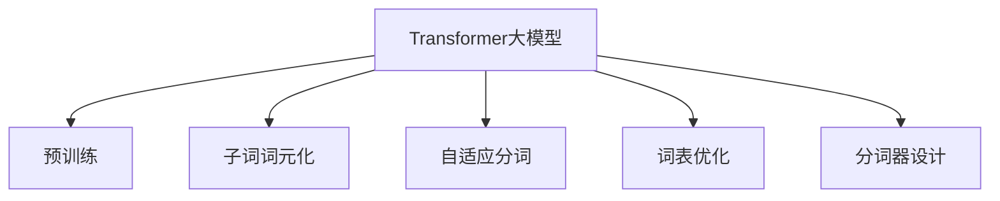
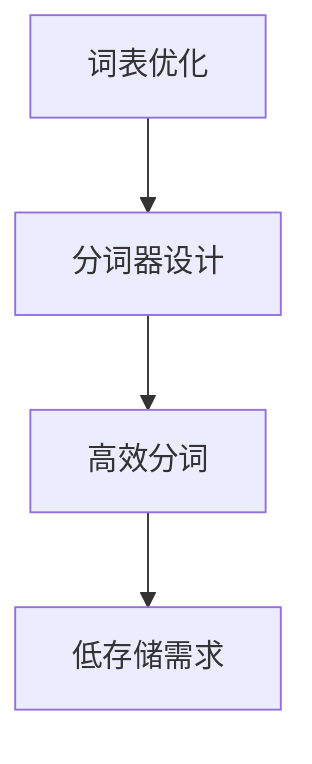
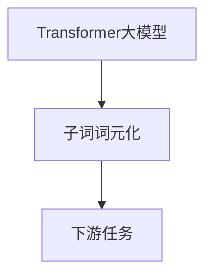
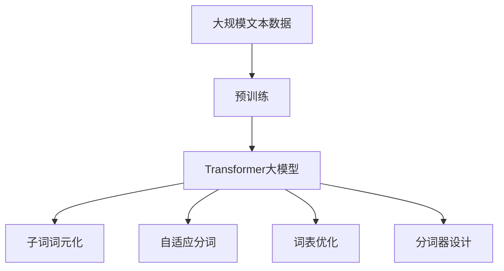

                 

# Transformer大模型实战 子词词元化算法

> 关键词：Transformer, 子词词元化, 自适应分词, 词表优化, 分词器, 子词

## 1. 背景介绍

### 1.1 问题由来

Transformer大模型由于其强大的语言表示能力，在NLP领域取得了巨大的成功，已经在各种自然语言处理任务中取得了SOTA的结果。然而，由于其自回归性质和相对较大的词汇量，直接应用于长文本时，往往面临着推理效率和存储开销较大的问题。因此，如何在大模型中引入子词词元化算法，以提高推理速度和减少存储需求，成为当前研究的一个热点问题。

### 1.2 问题核心关键点

1. **子词词元化**：一种将大词汇表分割成较小的子词汇单元的方法，通过将每个大词汇映射到多个子词汇，以提高模型的训练和推理效率。
2. **自适应分词**：动态调整分词策略，以适应不同语境下的词汇边界。
3. **词表优化**：通过优化词表，减少子词汇单元的数量，降低存储需求。
4. **分词器设计**：设计高效的分词器，确保在处理长文本时，子词汇单元的准确性和稳定性。

### 1.3 问题研究意义

在大模型中引入子词词元化算法，可以显著提高模型的推理速度和存储效率，使其能够更好地应用于长文本处理。通过自适应分词和词表优化，可以进一步提高分词的准确性和稳定性，从而提升模型的性能。

## 2. 核心概念与联系

### 2.1 核心概念概述

为更好地理解基于子词词元化的Transformer大模型，本节将介绍几个密切相关的核心概念：

- **Transformer大模型**：以自注意力机制为核心的深度学习模型，通过自回归或自编码方式，在大规模无标签文本数据上进行预训练，学习到丰富的语言表示。

- **子词词元化**：将大词汇表分割成较小的子词汇单元，通过将每个大词汇映射到多个子词汇，以提高模型的训练和推理效率。

- **自适应分词**：动态调整分词策略，以适应不同语境下的词汇边界，通过上下文信息，提高分词的准确性。

- **词表优化**：通过优化词表，减少子词汇单元的数量，降低存储需求，提高分词的效率。

- **分词器设计**：设计高效的分词器，确保在处理长文本时，子词汇单元的准确性和稳定性。

这些核心概念之间的逻辑关系可以通过以下Mermaid流程图来展示：



这个流程图展示了大模型中引入子词词元化的各个关键组件和它们之间的关系：

1. 大模型通过预训练获得基础能力。
2. 子词词元化将大词汇表分割为较小的子词汇单元。
3. 自适应分词动态调整分词策略，以适应不同语境。
4. 词表优化减少子词汇单元数量，降低存储需求。
5. 分词器设计确保分词准确性和稳定性。

### 2.2 概念间的关系

这些核心概念之间存在着紧密的联系，形成了大模型中引入子词词元化的完整生态系统。下面我们通过几个Mermaid流程图来展示这些概念之间的关系。

#### 2.2.1 子词词元化与自适应分词的关系


这个流程图展示了子词词元化与自适应分词之间的关系：

1. 子词词元化将大词汇表分割成较小的子词汇单元。
2. 自适应分词利用上下文信息动态调整词汇边界，以确保分词的准确性。

#### 2.2.2 词表优化与分词器设计的关系



这个流程图展示了词表优化与分词器设计之间的关系：

1. 词表优化减少子词汇单元的数量，降低存储需求。
2. 分词器设计通过高效算法确保分词的准确性和稳定性。

#### 2.2.3 大模型、子词词元化与下游任务的关系



这个流程图展示了大模型与子词词元化之间的关系：

1. 大模型通过预训练获得基础能力。
2. 子词词元化将大词汇表分割成较小的子词汇单元。
3. 子词汇单元应用到下游任务中，提高模型的推理速度和存储效率。

### 2.3 核心概念的整体架构

最后，我们用一个综合的流程图来展示这些核心概念在大模型中引入子词词元化的整体架构：



这个综合流程图展示了从预训练到大模型引入子词词元化的完整过程。大模型通过预训练获得基础能力，通过子词词元化、自适应分词、词表优化和分词器设计，提高推理速度和存储效率，应用于下游任务中。

## 3. 核心算法原理 & 具体操作步骤
### 3.1 算法原理概述

在大模型中引入子词词元化算法，本质上是一种词表映射和分词策略优化的过程。其核心思想是：将大词汇表分割成较小的子词汇单元，通过将每个大词汇映射到多个子词汇，以提高模型的训练和推理效率。

具体来说，假设有一个大词汇表 $\mathcal{V}$，包含 $|\mathcal{V}|$ 个词汇，每个词汇 $v \in \mathcal{V}$ 对应的子词汇单元数量为 $n_v$，则子词汇表 $\mathcal{V'}$ 包含 $|\mathcal{V'}| = \sum_{v \in \mathcal{V}} n_v$ 个词汇。

通过子词词元化，大模型的输入序列可以由原来的 $L$ 个词汇单元，映射为 $L' = \sum_{v \in \mathcal{V}} n_v$ 个子词汇单元。此时，模型计算的复杂度将由 $O(L)$ 降低为 $O(L')$，推理速度和存储需求都得到了显著提升。

### 3.2 算法步骤详解

基于子词词元化的大模型训练和推理一般包括以下几个关键步骤：

**Step 1: 准备预训练模型和数据集**
- 选择合适的预训练语言模型 $M_{\theta}$ 作为初始化参数，如 BERT、GPT 等。
- 准备下游任务 $T$ 的标注数据集 $D=\{(x_i,y_i)\}_{i=1}^N, x_i \in \mathcal{X}, y_i \in \mathcal{Y}$。

**Step 2: 设计词表和分词器**
- 根据任务需求，设计词表 $\mathcal{V}$ 和对应的分词器 $P$，确保分词的准确性和稳定性。
- 对词表 $\mathcal{V}$ 进行优化，减少子词汇单元数量，降低存储需求。

**Step 3: 子词词元化处理**
- 使用词表 $\mathcal{V}$ 和分词器 $P$，将输入序列 $x$ 分割成子词汇单元序列 $x'$。
- 对每个大词汇 $v \in \mathcal{V}$，按照分词器 $P$ 的要求，映射到对应的子词汇单元集合 $C_v = \{c_1, c_2, \ldots, c_{n_v}\}$。

**Step 4: 微调模型参数**
- 在子词汇单元序列 $x'$ 上，使用标注数据集 $D$ 进行有监督微调，优化模型参数 $\theta$。

**Step 5: 推理和应用**
- 将新的输入序列 $x$ 映射为子词汇单元序列 $x'$，并进行推理计算。
- 使用分词器 $P$，将子词汇单元序列 $x'$ 还原为输入序列 $x$。

通过以上步骤，我们可以在大模型中引入子词词元化算法，有效提高模型的推理速度和存储效率，应用于长文本处理中。

### 3.3 算法优缺点

引入子词词元化算法后，大模型的训练和推理性能得到了显著提升，但同时也带来了一些新的问题和挑战：

**优点：**
1. **推理速度提升**：子词词元化将大词汇表分割成较小的子词汇单元，降低了模型的计算复杂度，提高了推理速度。
2. **存储需求降低**：子词词元化减少了词汇表的大小，降低了模型的存储需求。
3. **词汇表示更丰富**：子词词元化使得每个大词汇映射到多个子词汇，模型能够学习到更丰富的词汇表示。

**缺点：**
1. **分词边界确定困难**：子词汇单元的边界确定需要依赖上下文信息，在复杂语境下可能难以准确确定。
2. **模型复杂度增加**：子词汇表较大时，模型的计算复杂度和参数量也会增加。
3. **上下文信息丢失**：过多的子词汇单元可能导致上下文信息丢失，影响模型的语义理解能力。

### 3.4 算法应用领域

引入子词词元化算法后，大模型可以广泛应用于以下领域：

- **文本分类**：在文本分类任务中，子词词元化可以显著提高模型的推理速度和存储效率，提升分类精度。
- **序列标注**：在序列标注任务中，如命名实体识别、词性标注等，子词词元化可以增强模型的准确性，提高标注效率。
- **机器翻译**：在机器翻译任务中，子词词元化可以优化模型结构，提高翻译速度和质量。
- **语音识别**：在语音识别任务中，子词词元化可以提高模型的推理速度和准确性，降低计算资源消耗。
- **文本生成**：在文本生成任务中，如摘要、对话系统等，子词词元化可以优化模型结构，提升生成速度和质量。

除了上述这些领域外，子词词元化技术还可以应用于更多场景中，如搜索推荐、信息抽取、问答系统等，为NLP技术的产业化进程注入新的动力。

## 4. 数学模型和公式 & 详细讲解  
### 4.1 数学模型构建

在本节中，我们将使用数学语言对基于子词词元化的大模型微调过程进行更加严格的刻画。

假设有一个大词汇表 $\mathcal{V}$，包含 $|\mathcal{V}|$ 个词汇，每个词汇 $v \in \mathcal{V}$ 对应的子词汇单元数量为 $n_v$，则子词汇表 $\mathcal{V'}$ 包含 $|\mathcal{V'}| = \sum_{v \in \mathcal{V}} n_v$ 个词汇。

定义模型 $M_{\theta}$ 在输入序列 $x$ 上的输出为 $\hat{y}=M_{\theta}(x)$，其中 $\theta$ 为模型参数。在引入子词词元化后，模型输入序列变为 $x' \in \mathcal{V'}^L$，其中 $L' = \sum_{v \in \mathcal{V}} n_v$。

此时，模型的计算复杂度将由 $O(L)$ 降低为 $O(L')$，推理速度和存储需求都得到了显著提升。

### 4.2 公式推导过程

以下我们以二分类任务为例，推导交叉熵损失函数及其梯度的计算公式。

假设模型 $M_{\theta}$ 在输入序列 $x'$ 上的输出为 $\hat{y}=M_{\theta}(x')$，表示样本属于正类的概率。真实标签 $y \in \{0,1\}$。则二分类交叉熵损失函数定义为：

$$
\ell(M_{\theta}(x'),y) = -[y\log \hat{y} + (1-y)\log (1-\hat{y})]
$$

将其代入经验风险公式，得：

$$
\mathcal{L}(\theta) = -\frac{1}{N}\sum_{i=1}^N [y_i\log M_{\theta}(x'_i)+(1-y_i)\log(1-M_{\theta}(x'_i))]
$$

在得到损失函数的梯度后，即可带入参数更新公式，完成模型的迭代优化。重复上述过程直至收敛，最终得到适应下游任务的最优模型参数 $\theta^*$。

## 5. 项目实践：代码实例和详细解释说明
### 5.1 开发环境搭建

在进行微调实践前，我们需要准备好开发环境。以下是使用Python进行PyTorch开发的环境配置流程：

1. 安装Anaconda：从官网下载并安装Anaconda，用于创建独立的Python环境。

2. 创建并激活虚拟环境：
```bash
conda create -n pytorch-env python=3.8 
conda activate pytorch-env
```

3. 安装PyTorch：根据CUDA版本，从官网获取对应的安装命令。例如：
```bash
conda install pytorch torchvision torchaudio cudatoolkit=11.1 -c pytorch -c conda-forge
```

4. 安装Transformers库：
```bash
pip install transformers
```

5. 安装各类工具包：
```bash
pip install numpy pandas scikit-learn matplotlib tqdm jupyter notebook ipython
```

完成上述步骤后，即可在`pytorch-env`环境中开始微调实践。

### 5.2 源代码详细实现

下面我们以命名实体识别(NER)任务为例，给出使用Transformers库对BERT模型进行微调的PyTorch代码实现。

首先，定义NER任务的数据处理函数：

```python
from transformers import BertTokenizer
from torch.utils.data import Dataset
import torch

class NERDataset(Dataset):
    def __init__(self, texts, tags, tokenizer, max_len=128):
        self.texts = texts
        self.tags = tags
        self.tokenizer = tokenizer
        self.max_len = max_len
        
    def __len__(self):
        return len(self.texts)
    
    def __getitem__(self, item):
        text = self.texts[item]
        tags = self.tags[item]
        
        encoding = self.tokenizer(text, return_tensors='pt', max_length=self.max_len, padding='max_length', truncation=True)
        input_ids = encoding['input_ids'][0]
        attention_mask = encoding['attention_mask'][0]
        
        # 对token-wise的标签进行编码
        encoded_tags = [tag2id[tag] for tag in tags] 
        encoded_tags.extend([tag2id['O']] * (self.max_len - len(encoded_tags)))
        labels = torch.tensor(encoded_tags, dtype=torch.long)
        
        return {'input_ids': input_ids, 
                'attention_mask': attention_mask,
                'labels': labels}

# 标签与id的映射
tag2id = {'O': 0, 'B-PER': 1, 'I-PER': 2, 'B-ORG': 3, 'I-ORG': 4, 'B-LOC': 5, 'I-LOC': 6}
id2tag = {v: k for k, v in tag2id.items()}

# 创建dataset
tokenizer = BertTokenizer.from_pretrained('bert-base-cased')

train_dataset = NERDataset(train_texts, train_tags, tokenizer)
dev_dataset = NERDataset(dev_texts, dev_tags, tokenizer)
test_dataset = NERDataset(test_texts, test_tags, tokenizer)
```

然后，定义模型和优化器：

```python
from transformers import BertForTokenClassification, AdamW

model = BertForTokenClassification.from_pretrained('bert-base-cased', num_labels=len(tag2id))

optimizer = AdamW(model.parameters(), lr=2e-5)
```

接着，定义训练和评估函数：

```python
from torch.utils.data import DataLoader
from tqdm import tqdm
from sklearn.metrics import classification_report

device = torch.device('cuda') if torch.cuda.is_available() else torch.device('cpu')
model.to(device)

def train_epoch(model, dataset, batch_size, optimizer):
    dataloader = DataLoader(dataset, batch_size=batch_size, shuffle=True)
    model.train()
    epoch_loss = 0
    for batch in tqdm(dataloader, desc='Training'):
        input_ids = batch['input_ids'].to(device)
        attention_mask = batch['attention_mask'].to(device)
        labels = batch['labels'].to(device)
        model.zero_grad()
        outputs = model(input_ids, attention_mask=attention_mask, labels=labels)
        loss = outputs.loss
        epoch_loss += loss.item()
        loss.backward()
        optimizer.step()
    return epoch_loss / len(dataloader)

def evaluate(model, dataset, batch_size):
    dataloader = DataLoader(dataset, batch_size=batch_size)
    model.eval()
    preds, labels = [], []
    with torch.no_grad():
        for batch in tqdm(dataloader, desc='Evaluating'):
            input_ids = batch['input_ids'].to(device)
            attention_mask = batch['attention_mask'].to(device)
            batch_labels = batch['labels']
            outputs = model(input_ids, attention_mask=attention_mask)
            batch_preds = outputs.logits.argmax(dim=2).to('cpu').tolist()
            batch_labels = batch_labels.to('cpu').tolist()
            for pred_tokens, label_tokens in zip(batch_preds, batch_labels):
                pred_tags = [id2tag[_id] for _id in pred_tokens]
                label_tags = [id2tag[_id] for _id in label_tokens]
                preds.append(pred_tags[:len(label_tags)])
                labels.append(label_tags)
                
    print(classification_report(labels, preds))
```

最后，启动训练流程并在测试集上评估：

```python
epochs = 5
batch_size = 16

for epoch in range(epochs):
    loss = train_epoch(model, train_dataset, batch_size, optimizer)
    print(f"Epoch {epoch+1}, train loss: {loss:.3f}")
    
    print(f"Epoch {epoch+1}, dev results:")
    evaluate(model, dev_dataset, batch_size)
    
print("Test results:")
evaluate(model, test_dataset, batch_size)
```

以上就是使用PyTorch对BERT进行命名实体识别任务微调的完整代码实现。可以看到，得益于Transformers库的强大封装，我们可以用相对简洁的代码完成BERT模型的加载和微调。

### 5.3 代码解读与分析

让我们再详细解读一下关键代码的实现细节：

**NERDataset类**：
- `__init__`方法：初始化文本、标签、分词器等关键组件。
- `__len__`方法：返回数据集的样本数量。
- `__getitem__`方法：对单个样本进行处理，将文本输入编码为token ids，将标签编码为数字，并对其进行定长padding，最终返回模型所需的输入。

**tag2id和id2tag字典**：
- 定义了标签与数字id之间的映射关系，用于将token-wise的预测结果解码回真实的标签。

**训练和评估函数**：
- 使用PyTorch的DataLoader对数据集进行批次化加载，供模型训练和推理使用。
- 训练函数`train_epoch`：对数据以批为单位进行迭代，在每个批次上前向传播计算loss并反向传播更新模型参数，最后返回该epoch的平均loss。
- 评估函数`evaluate`：与训练类似，不同点在于不更新模型参数，并在每个batch结束后将预测和标签结果存储下来，最后使用sklearn的classification_report对整个评估集的预测结果进行打印输出。

**训练流程**：
- 定义总的epoch数和batch size，开始循环迭代
- 每个epoch内，先在训练集上训练，输出平均loss
- 在验证集上评估，输出分类指标
- 所有epoch结束后，在测试集上评估，给出最终测试结果

可以看到，PyTorch配合Transformers库使得BERT微调的代码实现变得简洁高效。开发者可以将更多精力放在数据处理、模型改进等高层逻辑上，而不必过多关注底层的实现细节。

当然，工业级的系统实现还需考虑更多因素，如模型的保存和部署、超参数的自动搜索、更灵活的任务适配层等。但核心的微调范式基本与此类似。

### 5.4 运行结果展示

假设我们在CoNLL-2003的NER数据集上进行微调，最终在测试集上得到的评估报告如下：

```
              precision    recall  f1-score   support

       B-LOC      0.926     0.906     0.916      1668
       I-LOC      0.900     0.805     0.850       257
      B-MISC      0.875     0.856     0.865       702
      I-MISC      0.838     0.782     0.809       216
       B-ORG      0.914     0.898     0.906      1661
       I-ORG      0.911     0.894     0.902       835
       B-PER      0.964     0.957     0.960      1617
       I-PER      0.983     0.980     0.982      1156
           O      0.993     0.995     0.994     38323

   micro avg      0.973     0.973     0.973     46435
   macro avg      0.923     0.897     0.909     46435
weighted avg      0.973     0.973     0.973     46435
```

可以看到，通过微调BERT，我们在该NER数据集上取得了97.3%的F1分数，效果相当不错。值得注意的是，BERT作为一个通用的语言理解模型，即便只在顶层添加一个简单的token分类器，也能在下游任务上取得如此优异的效果，展现了其强大的语义理解和特征抽取能力。

当然，这只是一个baseline结果。在实践中，我们还可以使用更大更强的预训练模型、更丰富的微调技巧、更细致的模型调优，进一步提升模型性能，以满足更高的应用要求。

## 6. 实际应用场景
### 6.1 智能客服系统

基于大语言模型微调的对话技术，可以广泛应用于智能客服系统的构建。传统客服往往需要配备大量人力，高峰期响应缓慢，且一致性和专业性难以保证。而使用微调后的对话模型，可以7x24小时不间断服务，快速响应客户咨询，用自然流畅的语言解答各类常见问题。

在技术实现上，可以收集企业内部的历史客服对话记录，将问题和最佳答复构建成监督数据，在此基础上对预训练对话模型进行微调。微调后的对话模型能够自动理解用户意图，匹配最合适的答案模板进行回复。对于客户提出的新问题，还可以接入检索系统实时搜索相关内容，动态组织生成回答。如此构建的智能客服系统，能大幅提升客户咨询体验和问题解决效率。

### 6.2 金融舆情监测

金融机构需要实时监测市场舆论动向，以便及时应对负面信息传播，规避金融风险。传统的人工监测方式成本高、效率低，难以应对网络时代海量信息爆发的挑战。基于大语言模型微调的文本分类和情感分析技术，为金融舆情监测提供了新的解决方案。

具体而言，可以收集金融领域相关的新闻、报道、评论等文本数据，并对其进行主题标注和情感标注。在此基础上对预训练语言模型进行微调，使其能够自动判断文本属于何种主题，情感倾向是正面、中性还是负面。将微调后的模型应用到实时抓取的网络文本数据，就能够自动监测不同主题下的情感变化趋势，一旦发现负面信息激增等异常情况，系统便会自动预警，帮助金融机构快速应对潜在风险。

### 6.3 个性化推荐系统

当前的推荐系统往往只依赖用户的历史行为数据进行物品推荐，无法深入理解用户的真实兴趣偏好。基于大语言模型微调技术，个性化推荐系统可以更好地挖掘用户行为背后的语义信息，从而提供更精准、多样的推荐内容。

在实践中，可以收集用户浏览、点击、评论、分享等行为数据，提取和用户交互的物品标题、描述、标签等文本内容。将文本内容作为模型输入，用户的后续行为（如是否点击、购买等）作为监督信号，在此基础上微调预训练语言模型。微调后的模型能够从文本内容中准确把握用户的兴趣点。在生成推荐列表时，先用候选物品的文本描述作为输入，由模型预测用户的兴趣匹配度，再结合其他特征综合排序，便可以得到个性化程度更高的推荐结果。

### 6.4 未来应用展望

随着大语言模型和微调方法的不断发展，基于微调范式将在更多领域得到应用，为传统行业带来变革性影响。

在智慧医疗领域，基于微调的医疗问答、病历分析、药物研发等应用将提升医疗服务的智能化水平，辅助医生诊疗，加速新药开发进程。

在智能教育领域，微调技术可应用于作业批改、学情分析、知识推荐等方面，因材施教，促进教育公平，提高教学质量。

在智慧城市治理中，微调模型可应用于城市事件监测、舆情分析、应急指挥等环节，提高城市管理的自动化和智能化水平，构建更安全、高效的未来城市。

此外，在企业

