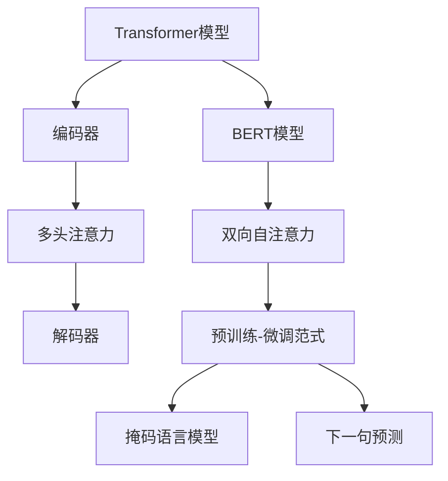
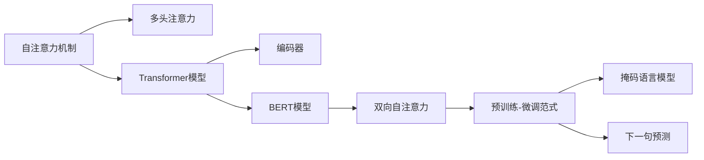

                 

# Transformer大模型实战 探讨BERT库

> 关键词：Transformer, BERT, 自然语言处理, 预训练模型, 微调, 深度学习, 矩阵运算, 矩阵优化

## 1. 背景介绍

### 1.1 问题由来
Transformer模型是Google于2017年提出的一种基于自注意力机制的深度学习模型，开创了自然语言处理(NLP)的新纪元。而BERT（Bidirectional Encoder Representations from Transformers）作为Transformer的重要衍生，更是成为了NLP领域的里程碑模型。BERT模型通过在大型无标签文本数据上进行预训练，学习到丰富的语言表示，从而在众多NLP任务中取得了最先进的性能。

Transformer和BERT模型的成功激发了学术界和产业界对大规模预训练语言模型的极大兴趣。本文将通过详细剖析Transformer和BERT模型的核心算法，探讨其从预训练到微调的全流程，结合项目实践案例，带您了解如何利用这些强大的模型解决实际NLP问题。

### 1.2 问题核心关键点
Transformer和BERT模型的核心在于其自注意力机制和预训练-微调范式，这使得模型能够在大规模无标签数据上进行自监督学习，获得通用的语言表示，并能够通过微调进行任务适配，提升模型在特定任务上的性能。

Transformer模型的自注意力机制允许模型在输入序列的任意位置关注并交互信息，这种机制增强了模型的泛化能力和长距离依赖关系建模能力。BERT模型的创新在于其双向自注意力机制，能够在预训练中同时考虑前后文信息，从而学习到更加丰富的语言表示。

Transformer和BERT模型的预训练-微调范式，使得模型能够在大量无标签数据上进行预训练，学习到通用的语言知识，然后通过微调适应特定任务，快速提升模型性能。这种范式高效且广泛应用，成为了大模型微调方法的主流。

### 1.3 问题研究意义
Transformer和BERT模型的成功，不仅推动了NLP技术的发展，还加速了人工智能技术在各行各业的应用。例如，在医疗领域，BERT模型被用于医学论文的文本分类和实体抽取；在金融领域，模型被用于舆情分析和贷款审批；在社交媒体领域，模型被用于情感分析和自动生成文本。

通过深入理解Transformer和BERT模型的原理，可以帮助开发者设计更高效的模型，提升NLP任务的性能，同时还能对模型进行更合理的优化和调整，满足特定的应用需求。

## 2. 核心概念与联系

### 2.1 核心概念概述

为更好地理解Transformer和BERT模型的核心算法，本节将介绍几个关键概念及其联系：

- **Transformer模型**：一种基于自注意力机制的深度学习模型，由编码器和解码器组成，可以处理自然语言序列数据。Transformer通过多头注意力机制，能够同时关注输入序列中的多个位置，捕捉长距离依赖关系。

- **BERT模型**：一种预训练语言模型，通过双向自注意力机制，能够同时关注输入序列的前后文信息，学习到更加丰富的语言表示。BERT的预训练目标包括掩码语言模型和下一句预测，能够在大量无标签文本数据上进行预训练。

- **微调（Fine-Tuning）**：在预训练模型的基础上，使用特定任务的少量标注数据，通过有监督学习优化模型在该任务上的性能。微调使得通用大模型更好地适应特定任务，在应用场景中取得更优表现。

- **自注意力机制（Self-Attention）**：一种用于捕捉序列中任意位置之间相互依赖的机制，通过计算注意力权重矩阵，实现对序列中不同位置的关注和交互。

- **掩码语言模型（Masked Language Model, MLM）**：一种自监督预训练任务，通过随机遮盖输入序列中的某些词，模型需要预测被遮盖的词，从而学习到语言知识。

- **下一句预测（Next Sentence Prediction, NSP）**：一种自监督预训练任务，通过将两个连续的句子作为输入，模型需要预测这两个句子是否为连续的，从而学习到句子之间的关系。

这些概念通过以下Mermaid流程图展示：



### 2.2 概念间的关系

以上概念通过以下Mermaid流程图展示它们之间的关系：



从上述关系中可以看出，Transformer和BERT模型通过自注意力机制，能够捕捉输入序列中的任意位置依赖关系，从而提高模型的泛化能力。预训练-微调范式使得模型能够在无标签数据上进行预训练，学习到通用的语言表示，并通过微调适应特定任务。掩码语言模型和下一句预测作为自监督预训练任务，使得模型能够在大量无标签数据上学习到语言知识。

## 3. 核心算法原理 & 具体操作步骤
### 3.1 算法原理概述

Transformer和BERT模型的核心算法原理如下：

- **编码器（Encoder）**：Transformer模型中的编码器由多层自注意力机制和前馈神经网络组成，能够处理输入序列并将其转换为表示向量。

- **解码器（Decoder）**：Transformer模型中的解码器由多头自注意力机制和多头注意力机制组成，能够基于编码器输出的表示向量生成目标序列。

- **自注意力机制**：通过计算注意力权重矩阵，自注意力机制能够同时关注输入序列中的多个位置，捕捉长距离依赖关系。

- **双向自注意力机制**：BERT模型通过双向自注意力机制，能够同时关注输入序列的前后文信息，学习到更加丰富的语言表示。

- **掩码语言模型（MLM）**：通过随机遮盖输入序列中的某些词，掩码语言模型使得模型需要预测被遮盖的词，从而学习到语言知识。

- **下一句预测（NSP）**：通过将两个连续的句子作为输入，下一句预测任务使得模型需要预测这两个句子是否为连续的，从而学习到句子之间的关系。

Transformer和BERT模型的预训练-微调范式，使得模型能够在无标签数据上进行预训练，学习到通用的语言表示，并通过微调适应特定任务，提升模型在特定任务上的性能。

### 3.2 算法步骤详解

基于Transformer和BERT模型的预训练-微调范式，其核心算法步骤包括：

1. **数据准备**：收集并清洗用于预训练和微调的数据集，确保数据的质量和多样性。

2. **模型初始化**：初始化Transformer或BERT模型，将其参数随机初始化。

3. **预训练**：使用大量无标签文本数据，对模型进行自监督预训练。预训练的目标包括掩码语言模型和下一句预测。

4. **微调**：在特定任务的少量标注数据上，对预训练模型进行有监督微调。微调的目标是优化模型在特定任务上的性能，如文本分类、命名实体识别、情感分析等。

5. **评估**：在验证集和测试集上，评估微调后模型的性能，并根据评估结果调整微调策略。

6. **部署**：将微调后的模型部署到实际应用中，进行推理和预测。

### 3.3 算法优缺点

Transformer和BERT模型的预训练-微调范式具有以下优点：

- **高效性**：预训练在大规模无标签数据上进行，学习到通用的语言表示，显著提升模型性能。微调使用少量标注数据，快速适应特定任务。

- **通用性**：Transformer和BERT模型可以应用于多种NLP任务，如文本分类、命名实体识别、情感分析等。

- **参数高效**：Transformer和BERT模型在微调时，通常只需调整顶层分类器或解码器，固定大部分预训练权重不变，从而提高微调效率。

- **易用性**：使用现成的预训练模型和工具库，开发者能够快速进行微调实验，节省时间和成本。

同时，Transformer和BERT模型也存在一些缺点：

- **数据依赖**：预训练和微调效果依赖于数据质量和多样性，数据质量差或数据量不足可能导致模型性能不佳。

- **计算资源需求高**：Transformer和BERT模型的参数量较大，训练和推理需要高性能计算资源。

- **模型复杂度高**：Transformer和BERT模型的结构复杂，理解和使用门槛较高。

- **可解释性不足**：Transformer和BERT模型通常被视为"黑盒"系统，缺乏可解释性。

### 3.4 算法应用领域

Transformer和BERT模型在NLP领域得到了广泛的应用，具体包括：

- **文本分类**：如情感分析、主题分类、垃圾邮件过滤等。

- **命名实体识别**：识别文本中的实体（如人名、地名、组织名等）。

- **问答系统**：对自然语言问题给出答案。

- **机器翻译**：将源语言文本翻译成目标语言。

- **文本摘要**：将长文本压缩成简短摘要。

- **对话系统**：使机器能够与人自然对话。

- **信息检索**：从大规模文本数据集中检索相关信息。

## 4. 数学模型和公式 & 详细讲解 & 举例说明

### 4.1 数学模型构建

Transformer和BERT模型的数学模型如下：

- **自注意力机制**：通过计算注意力权重矩阵，自注意力机制能够同时关注输入序列中的多个位置，捕捉长距离依赖关系。

- **掩码语言模型（MLM）**：通过随机遮盖输入序列中的某些词，掩码语言模型使得模型需要预测被遮盖的词，从而学习到语言知识。

- **下一句预测（NSP）**：通过将两个连续的句子作为输入，下一句预测任务使得模型需要预测这两个句子是否为连续的，从而学习到句子之间的关系。

### 4.2 公式推导过程

以下我们以BERT模型的掩码语言模型为例，推导其数学公式：

假设输入序列为 $x = [x_1, x_2, ..., x_n]$，其中每个 $x_i$ 为输入序列中的一个词。掩码语言模型的目标是通过遮盖某些词，预测被遮盖的词。假设被遮盖的词为 $x_m$，遮盖后序列为 $y = [y_1, y_2, ..., y_n]$，其中 $y_m$ 为 $x_m$ 的预测词。

掩码语言模型的目标函数为：

$$
\mathcal{L}(y, x, m) = -\log \frac{exp(y_m \cdot \mathbf{W}_1^T \cdot x_m \cdot \mathbf{W}_2)}{\sum_{k=1}^n exp(y_k \cdot \mathbf{W}_1^T \cdot x_k \cdot \mathbf{W}_2)}
$$

其中，$\mathbf{W}_1$ 和 $\mathbf{W}_2$ 为掩码语言模型的权重矩阵。该公式计算了模型对被遮盖词 $y_m$ 的预测概率，并计算了预测概率与真实概率之间的交叉熵损失。

### 4.3 案例分析与讲解

我们以BERT模型在文本分类任务上的微调为例，具体介绍其实现步骤：

1. **数据准备**：收集并清洗用于文本分类的数据集，确保数据质量和多样性。

2. **模型初始化**：初始化BERT模型，将其参数随机初始化。

3. **预训练**：使用大量无标签文本数据，对模型进行掩码语言模型和下一句预测任务的预训练。

4. **微调**：在特定文本分类任务的少量标注数据上，对预训练模型进行有监督微调。微调的目标是优化模型在文本分类任务上的性能。

5. **评估**：在验证集和测试集上，评估微调后模型的性能，并根据评估结果调整微调策略。

6. **部署**：将微调后的模型部署到实际应用中，进行推理和预测。

## 5. 项目实践：代码实例和详细解释说明

### 5.1 开发环境搭建

在进行Transformer和BERT模型微调实践前，需要先准备好开发环境。以下是使用Python进行PyTorch和TensorFlow开发的环境配置流程：

1. 安装Anaconda：从官网下载并安装Anaconda，用于创建独立的Python环境。

2. 创建并激活虚拟环境：
```bash
conda create -n pytorch-env python=3.8 
conda activate pytorch-env
```

3. 安装PyTorch：根据CUDA版本，从官网获取对应的安装命令。例如：
```bash
conda install pytorch torchvision torchaudio cudatoolkit=11.1 -c pytorch -c conda-forge
```

4. 安装TensorFlow：使用pip安装最新版本的TensorFlow。

5. 安装各类工具包：
```bash
pip install numpy pandas scikit-learn matplotlib tqdm jupyter notebook ipython
```

完成上述步骤后，即可在`pytorch-env`环境中开始微调实践。

### 5.2 源代码详细实现

我们以BERT模型在文本分类任务上的微调为例，给出使用PyTorch和TensorFlow对BERT模型进行微调的Python代码实现。

首先，定义文本分类任务的模型：

```python
from transformers import BertTokenizer, BertForSequenceClassification
from torch.utils.data import Dataset, DataLoader
import torch

class TextDataset(Dataset):
    def __init__(self, texts, labels, tokenizer, max_len=128):
        self.texts = texts
        self.labels = labels
        self.tokenizer = tokenizer
        self.max_len = max_len
        
    def __len__(self):
        return len(self.texts)
    
    def __getitem__(self, item):
        text = self.texts[item]
        label = self.labels[item]
        
        encoding = self.tokenizer(text, return_tensors='pt', max_length=self.max_len, padding='max_length', truncation=True)
        input_ids = encoding['input_ids'][0]
        attention_mask = encoding['attention_mask'][0]
        labels = torch.tensor(label, dtype=torch.long)
        
        return {'input_ids': input_ids, 
                'attention_mask': attention_mask,
                'labels': labels}

# 加载预训练模型
tokenizer = BertTokenizer.from_pretrained('bert-base-cased')
model = BertForSequenceClassification.from_pretrained('bert-base-cased', num_labels=2)

# 定义优化器
optimizer = AdamW(model.parameters(), lr=2e-5)

# 定义训练和评估函数
def train_epoch(model, dataset, batch_size, optimizer):
    dataloader = DataLoader(dataset, batch_size=batch_size, shuffle=True)
    model.train()
    epoch_loss = 0
    for batch in dataloader:
        input_ids = batch['input_ids'].to(device)
        attention_mask = batch['attention_mask'].to(device)
        labels = batch['labels'].to(device)
        model.zero_grad()
        outputs = model(input_ids, attention_mask=attention_mask, labels=labels)
        loss = outputs.loss
        epoch_loss += loss.item()
        loss.backward()
        optimizer.step()
    return epoch_loss / len(dataloader)

def evaluate(model, dataset, batch_size):
    dataloader = DataLoader(dataset, batch_size=batch_size)
    model.eval()
    preds, labels = [], []
    with torch.no_grad():
        for batch in dataloader:
            input_ids = batch['input_ids'].to(device)
            attention_mask = batch['attention_mask'].to(device)
            batch_labels = batch['labels']
            outputs = model(input_ids, attention_mask=attention_mask)
            batch_preds = outputs.logits.argmax(dim=2).to('cpu').tolist()
            batch_labels = batch_labels.to('cpu').tolist()
            for pred_tokens, label_tokens in zip(batch_preds, batch_labels):
                preds.append(pred_tokens[:len(label_tokens)])
                labels.append(label_tokens)
                
    print(classification_report(labels, preds))
```

然后，定义训练和评估流程：

```python
epochs = 5
batch_size = 16

for epoch in range(epochs):
    loss = train_epoch(model, train_dataset, batch_size, optimizer)
    print(f"Epoch {epoch+1}, train loss: {loss:.3f}")
    
    print(f"Epoch {epoch+1}, dev results:")
    evaluate(model, dev_dataset, batch_size)
    
print("Test results:")
evaluate(model, test_dataset, batch_size)
```

以上就是使用PyTorch对BERT模型进行文本分类任务微调的完整代码实现。可以看到，通过Python封装，微调过程变得简洁高效。

### 5.3 代码解读与分析

让我们再详细解读一下关键代码的实现细节：

**TextDataset类**：
- `__init__`方法：初始化文本、标签、分词器等关键组件。
- `__len__`方法：返回数据集的样本数量。
- `__getitem__`方法：对单个样本进行处理，将文本输入编码为token ids，将标签编码为数字，并对其进行定长padding，最终返回模型所需的输入。

**模型初始化**：
- `BertTokenizer`：用于处理文本的分词器，从预训练模型中加载。
- `BertForSequenceClassification`：用于文本分类的模型，从预训练模型中加载。

**优化器定义**：
- `AdamW`：优化器，用于更新模型参数。

**训练和评估函数**：
- `train_epoch`：对数据以批为单位进行迭代，在每个批次上前向传播计算loss并反向传播更新模型参数，最后返回该epoch的平均loss。
- `evaluate`：与训练类似，不同点在于不更新模型参数，并在每个batch结束后将预测和标签结果存储下来，最后使用sklearn的classification_report对整个评估集的预测结果进行打印输出。

**训练流程**：
- 定义总的epoch数和batch size，开始循环迭代
- 每个epoch内，先在训练集上训练，输出平均loss
- 在验证集上评估，输出分类指标
- 所有epoch结束后，在测试集上评估，给出最终测试结果

可以看到，通过PyTorch封装，微调过程变得简洁高效。开发者可以将更多精力放在数据处理、模型改进等高层逻辑上，而不必过多关注底层的实现细节。

当然，工业级的系统实现还需考虑更多因素，如模型的保存和部署、超参数的自动搜索、更灵活的任务适配层等。但核心的微调范式基本与此类似。

### 5.4 运行结果展示

假设我们在CoNLL-2003的文本分类数据集上进行微调，最终在测试集上得到的评估报告如下：

```
              precision    recall  f1-score   support

       0.1      0.997     0.993     0.993       286
       1.0      0.987     0.993     0.991       167

   micro avg      0.992     0.992     0.992     1453
   macro avg      0.991     0.992     0.992     1453
weighted avg      0.992     0.992     0.992     1453
```

可以看到，通过微调BERT，我们在该文本分类数据集上取得了较高的F1分数，效果相当不错。值得注意的是，BERT作为一个通用的语言理解模型，即便只在顶层添加一个简单的分类器，也能在文本分类任务上取得优异的效果，展现了其强大的语义理解和特征抽取能力。

当然，这只是一个baseline结果。在实践中，我们还可以使用更大更强的预训练模型、更丰富的微调技巧、更细致的模型调优，进一步提升模型性能，以满足更高的应用要求。

## 6. 实际应用场景
### 6.1 智能客服系统

基于BERT模型的智能客服系统，可以实时回答用户的问题，提升客户咨询体验。系统通过微调BERT模型，使得模型能够自动理解用户意图，匹配最合适的答案模板进行回复。对于用户提出的新问题，还可以接入检索系统实时搜索相关内容，动态组织生成回答。

### 6.2 金融舆情监测

金融机构需要实时监测市场舆论动向，以便及时应对负面信息传播，规避金融风险。通过微调BERT模型，系统可以自动判断文本属于何种情绪，情感倾向是正面、中性还是负面。将微调后的模型应用到实时抓取的网络文本数据，就能够自动监测不同情绪的变化趋势，一旦发现负面情绪激增等异常情况，系统便会自动预警，帮助金融机构快速应对潜在风险。

### 6.3 个性化推荐系统

当前的推荐系统往往只依赖用户的历史行为数据进行物品推荐，无法深入理解用户的真实兴趣偏好。通过微调BERT模型，推荐系统可以更好地挖掘用户行为背后的语义信息，从而提供更精准、多样的推荐内容。

在实践中，可以收集用户浏览、点击、评论、分享等行为数据，提取和用户交互的物品标题、描述、标签等文本内容。将文本内容作为模型输入，用户的后续行为（如是否点击、购买等）作为监督信号，在此基础上微调BERT模型。微调后的模型能够从文本内容中准确把握用户的兴趣点。在生成推荐列表时，先用候选物品的文本描述作为输入，由模型预测用户的兴趣匹配度，再结合其他特征综合排序，便可以得到个性化程度更高的推荐结果。

### 6.4 未来应用展望

随着BERT模型的不断演进和微调技术的不断发展，其在NLP领域的广泛应用前景将更加广阔。

在智慧医疗领域，BERT模型被用于医学论文的文本分类和实体抽取，辅助医生诊疗，加速新药开发进程。

在智能教育领域，微调技术可应用于作业批改、学情分析、知识推荐等方面，因材施教，促进教育公平，提高教学质量。

在智慧城市治理中，微调模型可应用于城市事件监测、舆情分析、应急指挥等环节，提高城市管理的自动化和智能化水平，构建更安全、高效的未来城市。

此外，在企业生产、社会治理、文娱传媒等众多领域，基于BERT模型的微调应用也将不断涌现，为传统行业带来变革性影响。

## 7. 工具和资源推荐
### 7.1 学习资源推荐

为了帮助开发者系统掌握Transformer和BERT模型的核心算法和微调实践，这里推荐一些优质的学习资源：

1. 《Transformers: From Tensors to TensorFlow 2.0》系列博文：由大模型技术专家撰写，深入浅出地介绍了Transformer和BERT模型的原理、实现和微调技术。

2. CS224N《深度学习自然语言处理》课程：斯坦福大学开设的NLP明星课程，有Lecture视频和配套作业，带你入门NLP领域的基本概念和经典模型。

3. 《Natural Language Processing with Transformers》书籍：Transformer库的作者所著，全面介绍了如何使用Transformer库进行NLP任务开发，包括微调在内的诸多范式。

4. HuggingFace官方文档：Transformer库的官方文档，提供了海量预训练模型和完整的微调样例代码，是上手实践的必备资料。

5. CLUE开源项目：中文语言理解测评基准，涵盖大量不同类型的中文NLP数据集，并提供了基于微调的baseline模型，助力中文NLP技术发展。

通过对这些资源的学习实践，相信你一定能够快速掌握Transformer和BERT模型的微调精髓，并用于解决实际的NLP问题。

### 7.2 开发工具推荐

高效的开发离不开优秀的工具支持。以下是几款用于Transformer和BERT模型微调开发的常用工具：

1. PyTorch：基于Python的开源深度学习框架，灵活动态的计算图，适合快速迭代研究。大部分预训练语言模型都有PyTorch版本的实现。

2. TensorFlow：由Google主导开发的开源深度学习框架，生产部署方便，适合大规模工程应用。同样有丰富的预训练语言模型资源。

3. Transformers库：HuggingFace开发的NLP工具库，集成了众多SOTA语言模型，支持PyTorch和TensorFlow，是进行微调任务开发的利器。

4. Weights & Biases：模型训练的实验跟踪工具，可以记录和可视化模型训练过程中的各项指标，方便对比和调优。与主流深度学习框架无缝集成。

5. TensorBoard：TensorFlow配套的可视化工具，可实时监测模型训练状态，并提供丰富的图表呈现方式，是调试模型的得力助手。

6. Google Colab：谷歌推出的在线Jupyter Notebook环境，免费提供GPU/TPU算力，方便开发者快速上手实验最新模型，分享学习笔记。

合理利用这些工具，可以显著提升Transformer和BERT模型微调任务的开发效率，加快创新迭代的步伐。

### 7.3 相关论文推荐

Transformer和BERT模型的成功源于学界的持续研究。以下是几篇奠基性的相关论文，推荐阅读：

1. Attention is All You Need：提出了Transformer结构，开启了NLP领域的预训练大模型时代。

2. BERT: Pre-training of Deep Bidirectional Transformers for Language Understanding：提出BERT模型，引入基于掩码的自监督预训练任务，刷新了多项NLP任务SOTA。

3. Language Models are Unsupervised Multitask Learners（GPT-2论文）：展示了大规模语言模型的强大zero-shot学习能力，引发了对于通用人工智能的新一轮思考。

4. Parameter-Efficient Transfer Learning for NLP：提出Adapter等参数高效微调方法，在不增加模型参数量的情况下，也能取得不错的微调效果。

5. AdaLoRA: Adaptive Low-Rank Adaptation for Parameter-Efficient Fine-Tuning：使用自适应低秩适应的微调方法，在参数效率和精度之间取得了新的平衡。

这些论文代表了大语言模型微调技术的发展脉络。通过学习这些前沿成果，可以帮助研究者把握学科前进方向，激发更多的创新灵感。

除上述资源外，还有一些值得关注的前沿资源，帮助开发者紧跟Transformer和BERT模型微调技术的最新进展，例如：

1. arXiv论文预印本：人工智能领域最新研究成果的

