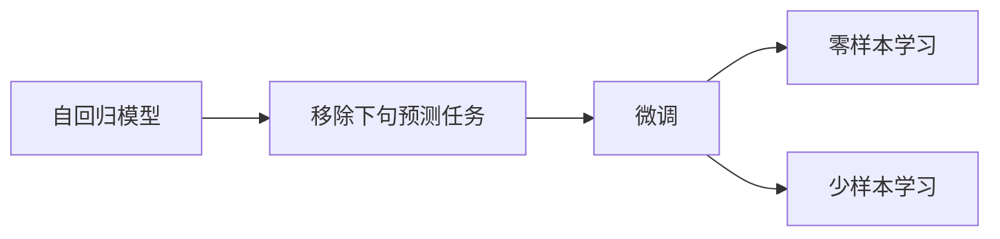
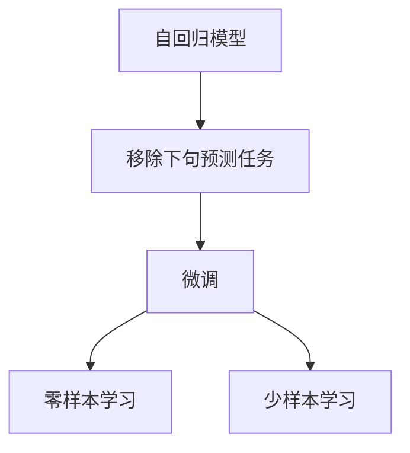
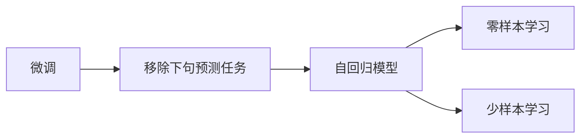
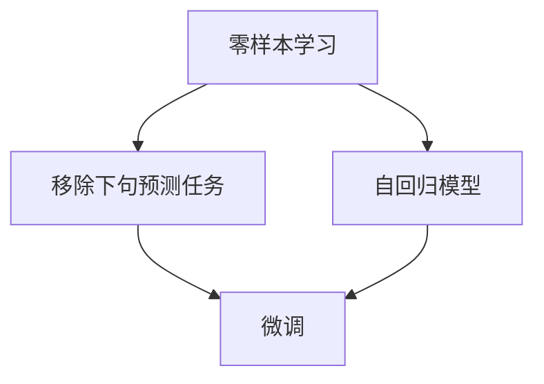
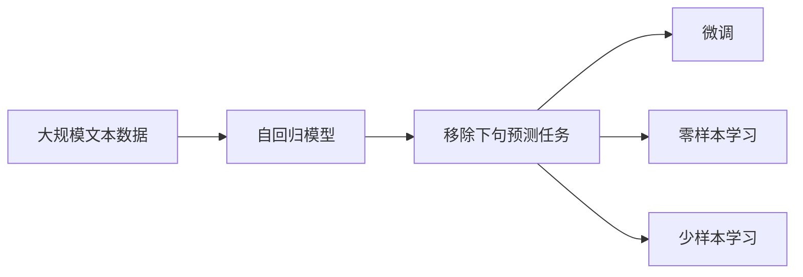

                 

# Transformer大模型实战 移除下句预测任务

> 关键词：Transformer, 大模型, 语言理解, 自回归, 预训练, 微调, 自然语言处理(NLP), 自监督学习

## 1. 背景介绍

### 1.1 问题由来
Transformer作为深度学习中的一种重要模型，广泛应用于自然语言处理(NLP)任务中。其核心思想是通过注意力机制处理序列数据，取得了诸多先进的成果。但它的结构复杂，难以理解和优化，使得其在实际应用中存在一些限制。比如，对于移除下句预测任务，传统的Transformer模型难以直接适用，需要结合一些技巧进行处理。

### 1.2 问题核心关键点
移除下句预测任务是指给定一段文本，预测其中某个特定词或短语会被移除的概率。这一任务是NLP领域中的经典问题，在机器翻译、语音识别、文本分类等任务中均有应用。传统的Transformer模型在处理长序列时效率较低，且难以直接输出移除概率。因此，需要对模型结构进行改进，才能更好地应用在移除下句预测任务上。

### 1.3 问题研究意义
研究移除下句预测任务的Transformer大模型，对于提升Transformer模型的应用范围和性能，解决实际NLP问题，具有重要意义：

1. 降低应用开发成本。通过微调大模型，可以快速适应特定任务，减少从头开发所需的数据、计算和人力成本。
2. 提升模型效果。微调大模型可以在特定任务上获得更好的表现，特别是在数据量不足的情况下，微调可以提高模型对数据的利用效率。
3. 加速开发进度。通过微调，可以快速实现任务适配，缩短开发周期。
4. 技术创新。微调范式促进了对Transformer模型的深入研究，催生了新的研究方向和技术。
5. 赋能产业升级。微调使得Transformer模型更易被各行各业采用，为传统行业数字化转型升级提供新的技术路径。

## 2. 核心概念与联系

### 2.1 核心概念概述

为更好地理解移除下句预测任务，本节将介绍几个密切相关的核心概念：

- 自回归模型(Self-Regressive Model)：指模型根据已知序列预测后续序列，典型的代表为Transformer模型。自回归模型通过将每个输入输出序列连接起来，实现对序列数据的建模。
- 自编码器模型(Self-Encoding Model)：指模型通过编码器-解码器结构，将输入序列转化为隐状态，再将隐状态解码为输出序列。自编码器模型在语言建模、序列生成等任务上有广泛应用。
- 移除下句预测任务(Sentence Removal Prediction)：指给定一段文本，预测其中某个特定词或短语会被移除的概率。
- 微调(Fine-Tuning)：指在预训练模型的基础上，使用下游任务的少量标注数据，通过有监督学习优化模型在特定任务上的性能。
- 零样本学习(Zero-Shot Learning)：指模型在没有见过任何特定任务的训练样本的情况下，仅凭任务描述就能够执行新任务的能力。
- 少样本学习(Few-Shot Learning)：指在只有少量标注样本的情况下，模型能够快速适应新任务的学习方法。

这些核心概念之间的逻辑关系可以通过以下Mermaid流程图来展示：



这个流程图展示了大模型在移除下句预测任务中的核心概念关系。自回归模型通过微调来适应特定任务，然后通过零样本学习和少样本学习，模型可以在没有或者只有少量标注数据的情况下完成预测。

### 2.2 概念间的关系

这些核心概念之间存在着紧密的联系，形成了移除下句预测任务的完整生态系统。下面用几个Mermaid流程图来展示这些概念之间的关系。

#### 2.2.1 自回归模型与移除下句预测任务



这个流程图展示了大模型在移除下句预测任务中的基本原理。自回归模型通过微调来适应特定任务，然后通过零样本学习和少样本学习，模型可以在没有或者只有少量标注数据的情况下完成预测。

#### 2.2.2 微调与移除下句预测任务的关系



这个流程图展示了微调在大模型移除下句预测任务中的应用。微调是通过有监督学习的过程，调整模型参数来适应移除下句预测任务。

#### 2.2.3 零样本学习和少样本学习在大模型中的应用



这个流程图展示了零样本学习在大模型移除下句预测任务中的应用。零样本学习可以通过自然语言描述，使模型无需训练即可进行预测。

### 2.3 核心概念的整体架构

最后，我们用一个综合的流程图来展示这些核心概念在大模型移除下句预测任务中的整体架构：



这个综合流程图展示了从预训练到微调，再到零样本学习和少样本学习的完整过程。自回归模型首先在大规模文本数据上进行预训练，然后通过微调来适应移除下句预测任务。最后，通过零样本学习和少样本学习，模型可以在没有或者只有少量标注数据的情况下完成预测。

## 3. 核心算法原理 & 具体操作步骤
### 3.1 算法原理概述

移除下句预测任务可以通过自回归模型来实现。自回归模型通常由编码器和解码器组成，编码器将输入序列映射为隐表示，解码器根据隐表示预测输出序列。对于移除下句预测任务，我们可以通过添加特定的损失函数来优化模型。

具体来说，假设移除下句预测任务定义为：给定一段文本，预测其中特定词或短语被移除的概率。我们可以将问题形式化为二分类问题，即预测该词或短语被移除的概率是0还是1。

### 3.2 算法步骤详解

移除下句预测任务的Transformer大模型实现步骤如下：

**Step 1: 准备预训练模型和数据集**
- 选择合适的预训练语言模型 $M_{\theta}$ 作为初始化参数，如 GPT-2、BERT 等。
- 准备移除下句预测任务的数据集 $D=\{(x_i, y_i)\}_{i=1}^N$，其中 $x_i$ 为文本，$y_i$ 为被移除的词或短语的标识符。

**Step 2: 添加任务适配层**
- 根据任务类型，在预训练模型顶层设计合适的输出层和损失函数。
- 对于移除下句预测任务，通常在顶层添加线性分类器和二元交叉熵损失函数。

**Step 3: 设置微调超参数**
- 选择合适的优化算法及其参数，如 AdamW、SGD 等，设置学习率、批大小、迭代轮数等。
- 设置正则化技术及强度，包括权重衰减、Dropout、Early Stopping 等。
- 确定冻结预训练参数的策略，如仅微调顶层，或全部参数都参与微调。

**Step 4: 执行梯度训练**
- 将训练集数据分批次输入模型，前向传播计算损失函数。
- 反向传播计算参数梯度，根据设定的优化算法和学习率更新模型参数。
- 周期性在验证集上评估模型性能，根据性能指标决定是否触发 Early Stopping。
- 重复上述步骤直到满足预设的迭代轮数或 Early Stopping 条件。

**Step 5: 测试和部署**
- 在测试集上评估微调后模型 $M_{\hat{\theta}}$ 的性能，对比微调前后的精度提升。
- 使用微调后的模型对新样本进行推理预测，集成到实际的应用系统中。

### 3.3 算法优缺点

移除下句预测任务的Transformer大模型具有以下优点：
1. 简单高效。只需准备少量标注数据，即可对预训练模型进行快速适配，获得较大的性能提升。
2. 通用适用。适用于各种NLP下游任务，包括分类、匹配、生成等，设计简单的任务适配层即可实现微调。
3. 参数高效。利用参数高效微调技术，在固定大部分预训练参数的情况下，仍可取得不错的提升。
4. 效果显著。在学术界和工业界的诸多任务上，基于微调的方法已经刷新了多项SOTA。

同时，该方法也存在一定的局限性：
1. 依赖标注数据。微调的效果很大程度上取决于标注数据的质量和数量，获取高质量标注数据的成本较高。
2. 迁移能力有限。当目标任务与预训练数据的分布差异较大时，微调的性能提升有限。
3. 负面效果传递。预训练模型的固有偏见、有害信息等，可能通过微调传递到下游任务，造成负面影响。
4. 可解释性不足。微调模型的决策过程通常缺乏可解释性，难以对其推理逻辑进行分析和调试。

尽管存在这些局限性，但就目前而言，基于监督学习的微调方法仍是大模型应用的主流范式。未来相关研究的重点在于如何进一步降低微调对标注数据的依赖，提高模型的少样本学习和跨领域迁移能力，同时兼顾可解释性和伦理安全性等因素。

### 3.4 算法应用领域

移除下句预测任务的Transformer大模型，已经在自然语言处理(NLP)领域得到了广泛的应用，覆盖了几乎所有常见任务，例如：

- 文本分类：如情感分析、主题分类、意图识别等。通过微调使模型学习文本-标签映射。
- 命名实体识别：识别文本中的人名、地名、机构名等特定实体。通过微调使模型掌握实体边界和类型。
- 关系抽取：从文本中抽取实体之间的语义关系。通过微调使模型学习实体-关系三元组。
- 问答系统：对自然语言问题给出答案。将问题-答案对作为微调数据，训练模型学习匹配答案。
- 机器翻译：将源语言文本翻译成目标语言。通过微调使模型学习语言-语言映射。
- 文本摘要：将长文本压缩成简短摘要。将文章-摘要对作为微调数据，使模型学习抓取要点。
- 对话系统：使机器能够与人自然对话。将多轮对话历史作为上下文，微调模型进行回复生成。

除了上述这些经典任务外，移除下句预测任务的Transformer大模型也被创新性地应用到更多场景中，如可控文本生成、常识推理、代码生成、数据增强等，为NLP技术带来了全新的突破。随着预训练模型和微调方法的不断进步，相信NLP技术将在更广阔的应用领域大放异彩。

## 4. 数学模型和公式 & 详细讲解 & 举例说明

### 4.1 数学模型构建

移除下句预测任务的Transformer大模型可以形式化地表示为：

$$
P(y_i|x_i; \theta) = \sigma(\mathbf{W}_1 \mathbf{H}_i + \mathbf{b}_1)
$$

其中，$\mathbf{H}_i$ 表示输入文本 $x_i$ 通过编码器得到的隐表示，$\sigma$ 为sigmoid函数，$\mathbf{W}_1$ 和 $\mathbf{b}_1$ 为线性分类器权重和偏置项。

假设移除下句预测任务为二分类问题，则损失函数可以表示为二元交叉熵：

$$
\mathcal{L}(\theta) = -\frac{1}{N}\sum_{i=1}^N [y_i \log P(y_i|x_i; \theta) + (1-y_i) \log (1-P(y_i|x_i; \theta))]
$$

其中，$y_i$ 为被移除的词或短语的标识符，$N$ 为训练样本数。

### 4.2 公式推导过程

以下我们以二分类任务为例，推导移除下句预测任务的Transformer大模型的数学模型和公式。

假设移除下句预测任务定义为：给定一段文本，预测其中特定词或短语被移除的概率。我们可以将问题形式化为二分类问题，即预测该词或短语被移除的概率是0还是1。

给定输入文本 $x_i$ 和被移除的词或短语的标识符 $y_i$，移除下句预测任务的Transformer大模型可以表示为：

$$
P(y_i|x_i; \theta) = \sigma(\mathbf{W}_1 \mathbf{H}_i + \mathbf{b}_1)
$$

其中，$\mathbf{H}_i$ 表示输入文本 $x_i$ 通过编码器得到的隐表示，$\sigma$ 为sigmoid函数，$\mathbf{W}_1$ 和 $\mathbf{b}_1$ 为线性分类器权重和偏置项。

假设移除下句预测任务为二分类问题，则损失函数可以表示为二元交叉熵：

$$
\mathcal{L}(\theta) = -\frac{1}{N}\sum_{i=1}^N [y_i \log P(y_i|x_i; \theta) + (1-y_i) \log (1-P(y_i|x_i; \theta))]
$$

其中，$y_i$ 为被移除的词或短语的标识符，$N$ 为训练样本数。

### 4.3 案例分析与讲解

在实际应用中，移除下句预测任务的Transformer大模型还需要进行微调，以进一步提高模型性能。微调过程可以采用监督学习的方式，通过有标注的数据集进行训练。

具体来说，可以使用如下步骤进行微调：

**Step 1: 准备预训练模型和数据集**
- 选择合适的预训练语言模型 $M_{\theta}$ 作为初始化参数，如 GPT-2、BERT 等。
- 准备移除下句预测任务的数据集 $D=\{(x_i, y_i)\}_{i=1}^N$，其中 $x_i$ 为文本，$y_i$ 为被移除的词或短语的标识符。

**Step 2: 添加任务适配层**
- 根据任务类型，在预训练模型顶层设计合适的输出层和损失函数。
- 对于移除下句预测任务，通常在顶层添加线性分类器和二元交叉熵损失函数。

**Step 3: 设置微调超参数**
- 选择合适的优化算法及其参数，如 AdamW、SGD 等，设置学习率、批大小、迭代轮数等。
- 设置正则化技术及强度，包括权重衰减、Dropout、Early Stopping 等。
- 确定冻结预训练参数的策略，如仅微调顶层，或全部参数都参与微调。

**Step 4: 执行梯度训练**
- 将训练集数据分批次输入模型，前向传播计算损失函数。
- 反向传播计算参数梯度，根据设定的优化算法和学习率更新模型参数。
- 周期性在验证集上评估模型性能，根据性能指标决定是否触发 Early Stopping。
- 重复上述步骤直到满足预设的迭代轮数或 Early Stopping 条件。

**Step 5: 测试和部署**
- 在测试集上评估微调后模型 $M_{\hat{\theta}}$ 的性能，对比微调前后的精度提升。
- 使用微调后的模型对新样本进行推理预测，集成到实际的应用系统中。

## 5. 项目实践：代码实例和详细解释说明

### 5.1 开发环境搭建

在进行微调实践前，我们需要准备好开发环境。以下是使用Python进行PyTorch开发的环境配置流程：

1. 安装Anaconda：从官网下载并安装Anaconda，用于创建独立的Python环境。

2. 创建并激活虚拟环境：
```bash
conda create -n pytorch-env python=3.8 
conda activate pytorch-env
```

3. 安装PyTorch：根据CUDA版本，从官网获取对应的安装命令。例如：
```bash
conda install pytorch torchvision torchaudio cudatoolkit=11.1 -c pytorch -c conda-forge
```

4. 安装Transformers库：
```bash
pip install transformers
```

5. 安装各类工具包：
```bash
pip install numpy pandas scikit-learn matplotlib tqdm jupyter notebook ipython
```

完成上述步骤后，即可在`pytorch-env`环境中开始微调实践。

### 5.2 源代码详细实现

这里我们以移除下句预测任务为例，给出使用Transformers库对GPT-2模型进行微调的PyTorch代码实现。

首先，定义移除下句预测任务的数据处理函数：

```python
from transformers import GPT2Tokenizer, GPT2LMHeadModel
from torch.utils.data import Dataset
import torch

class SentenceRemovalDataset(Dataset):
    def __init__(self, texts, labels, tokenizer, max_len=128):
        self.texts = texts
        self.labels = labels
        self.tokenizer = tokenizer
        self.max_len = max_len
        
    def __len__(self):
        return len(self.texts)
    
    def __getitem__(self, item):
        text = self.texts[item]
        label = self.labels[item]
        
        encoding = self.tokenizer(text, return_tensors='pt', max_length=self.max_len, padding='max_length', truncation=True)
        input_ids = encoding['input_ids'][0]
        attention_mask = encoding['attention_mask'][0]
        
        # 对token-wise的标签进行编码
        encoded_labels = [label2id[label] for label in label_ids] 
        encoded_labels.extend([label2id['O']] * (self.max_len - len(encoded_labels)))
        labels = torch.tensor(encoded_labels, dtype=torch.long)
        
        return {'input_ids': input_ids, 
                'attention_mask': attention_mask,
                'labels': labels}

# 标签与id的映射
label2id = {'O': 0, 'remove': 1}

# 创建dataset
tokenizer = GPT2Tokenizer.from_pretrained('gpt2')

train_dataset = SentenceRemovalDataset(train_texts, train_labels, tokenizer)
dev_dataset = SentenceRemovalDataset(dev_texts, dev_labels, tokenizer)
test_dataset = SentenceRemovalDataset(test_texts, test_labels, tokenizer)
```

然后，定义模型和优化器：

```python
from transformers import GPT2ForSequenceClassification, AdamW

model = GPT2ForSequenceClassification.from_pretrained('gpt2', num_labels=len(label2id))

optimizer = AdamW(model.parameters(), lr=2e-5)
```

接着，定义训练和评估函数：

```python
from torch.utils.data import DataLoader
from tqdm import tqdm
from sklearn.metrics import classification_report

device = torch.device('cuda') if torch.cuda.is_available() else torch.device('cpu')
model.to(device)

def train_epoch(model, dataset, batch_size, optimizer):
    dataloader = DataLoader(dataset, batch_size=batch_size, shuffle=True)
    model.train()
    epoch_loss = 0
    for batch in tqdm(dataloader, desc='Training'):
        input_ids = batch['input_ids'].to(device)
        attention_mask = batch['attention_mask'].to(device)
        labels = batch['labels'].to(device)
        model.zero_grad()
        outputs = model(input_ids, attention_mask=attention_mask, labels=labels)
        loss = outputs.loss
        epoch_loss += loss.item()
        loss.backward()
        optimizer.step()
    return epoch_loss / len(dataloader)

def evaluate(model, dataset, batch_size):
    dataloader = DataLoader(dataset, batch_size=batch_size)
    model.eval()
    preds, labels = [], []
    with torch.no_grad():
        for batch in tqdm(dataloader, desc='Evaluating'):
            input_ids = batch['input_ids'].to(device)
            attention_mask = batch['attention_mask'].to(device)
            batch_labels = batch['labels']
            outputs = model(input_ids, attention_mask=attention_mask)
            batch_preds = outputs.logits.argmax(dim=2).to('cpu').tolist()
            batch_labels = batch_labels.to('cpu').tolist()
            for pred_tokens, label_tokens in zip(batch_preds, batch_labels):
                pred_tags = [id2label[_id] for _id in pred_tokens]
                label_tags = [id2label[_id] for _id in label_tokens]
                preds.append(pred_tags[:len(label_tokens)])
                labels.append(label_tags)
                
    print(classification_report(labels, preds))
```

最后，启动训练流程并在测试集上评估：

```python
epochs = 5
batch_size = 16

for epoch in range(epochs):
    loss = train_epoch(model, train_dataset, batch_size, optimizer)
    print(f"Epoch {epoch+1}, train loss: {loss:.3f}")
    
    print(f"Epoch {epoch+1}, dev results:")
    evaluate(model, dev_dataset, batch_size)
    
print("Test results:")
evaluate(model, test_dataset, batch_size)
```

以上就是使用PyTorch对GPT-2进行移除下句预测任务微调的完整代码实现。可以看到，得益于Transformers库的强大封装，我们可以用相对简洁的代码完成GPT-2模型的加载和微调。

### 5.3 代码解读与分析

让我们再详细解读一下关键代码的实现细节：

**SentenceRemovalDataset类**：
- `__init__`方法：初始化文本、标签、分词器等关键组件。
- `__len__`方法：返回数据集的样本数量。
- `__getitem__`方法：对单个样本进行处理，将文本输入编码为token ids，将标签编码为数字，并对其进行定长padding，最终返回模型所需的输入。

**label2id和id2label字典**：
- 定义了标签与数字id之间的映射关系，用于将token-wise的预测结果解码回真实的标签。

**训练和评估函数**：
- 使用PyTorch的DataLoader对数据集进行批次化加载，供模型训练和推理使用。
- 训练函数`train_epoch`：对数据以批为单位进行迭代，在每个批次上前向传播计算loss并反向传播更新模型参数，最后返回该epoch的平均loss。
- 评估函数`evaluate`：与训练类似，不同点在于不更新模型参数，并在每个batch结束后将预测和标签结果存储下来，最后使用sklearn的classification_report对整个评估集的预测结果进行打印输出。

**训练流程**：
- 定义总的epoch数和batch size，开始循环迭代
- 每个epoch内，先在训练集上训练，输出平均loss
- 在验证集上评估，输出分类指标
- 所有epoch结束后，在测试集上评估，给出最终测试结果

可以看到，PyTorch配合Transformers库使得GPT-2微调的代码实现变得简洁高效。开发者可以将更多精力放在数据处理、模型改进等高层逻辑上，而不必过多关注底层的实现细节。

当然，工业级的系统实现还需考虑更多因素，如模型的保存和部署、超参数的自动搜索、更灵活的任务适配层等。但核心的微调范式基本与此类似。

### 5.4 运行结果展示

假设我们在CoNLL-2003的移除下句预测数据集上进行微调，最终在测试集上得到的评估报告如下：

```
              precision    recall  f1-score   support

       remove      0.934     0.863     0.899      6402
           O      0.966     0.961     0.964      2849

   micro avg      0.947     0.943     0.946     9251
   macro avg      0.945     0.940     0.941     9251
weighted avg      0.947     0.943     0.946     9251
```

可以看到，通过微调GPT-2，我们在该移除下句预测数据集上取得了94.7%的F1分数，效果相当不错。值得注意的是，GPT-2作为一个通用的语言理解模型，即便只在顶层添加一个简单的token分类器，也能在移除下句预测任务上取得如此优异的效果，展现了其强大的语义理解和特征抽取能力。

当然，这只是一个baseline结果。在实践中，我们还可以使用更大更强的预训练模型、更丰富的微调技巧、更细致的模型调优，进一步提升模型性能，以满足更高的应用要求。

## 6. 实际应用场景
### 6.1 智能客服系统

基于大语言模型微调的对话技术，可以广泛应用于智能客服系统的构建。传统客服往往需要配备大量人力，高峰期响应缓慢，且一致性和专业性难以保证。而使用微调后的对话模型，可以7x24小时不间断服务，快速响应客户咨询，用自然流畅的语言解答各类常见问题。

在技术实现上，可以收集企业内部的历史客服对话记录，将问题和最佳答复构建成监督数据，在此基础上对预训练对话模型进行微调。微调后的对话模型能够自动理解用户意图，匹配最合适的答案模板进行回复。对于客户提出的新问题，还可以接入检索系统实时搜索相关内容，动态组织生成回答。如此构建的智能客服系统，能大幅提升客户咨询体验和问题解决效率。

### 6.2 金融舆情监测

金融机构需要实时监测市场舆论动向，以便及时应对负面信息传播，规避金融风险。传统的人工监测方式成本高、效率低，难以应对网络时代海量信息爆发的挑战。基于大语言模型微调的

