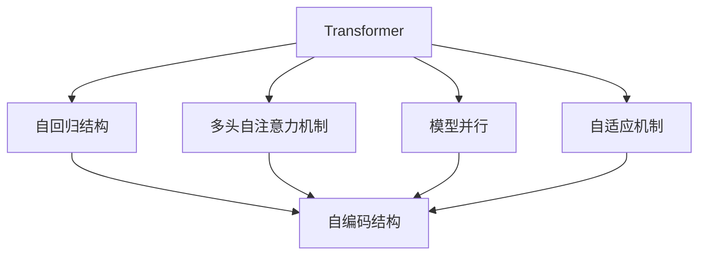
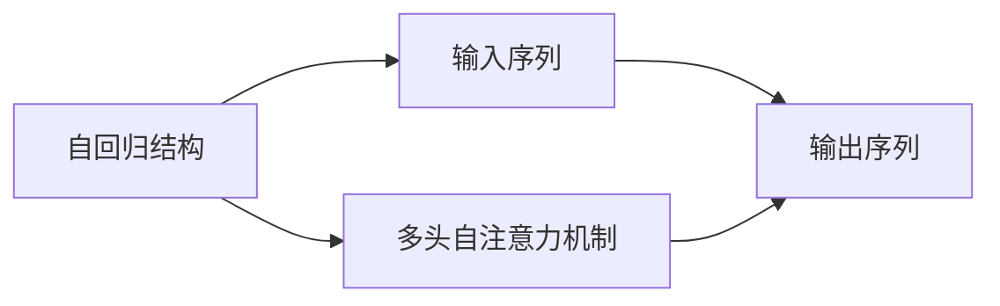
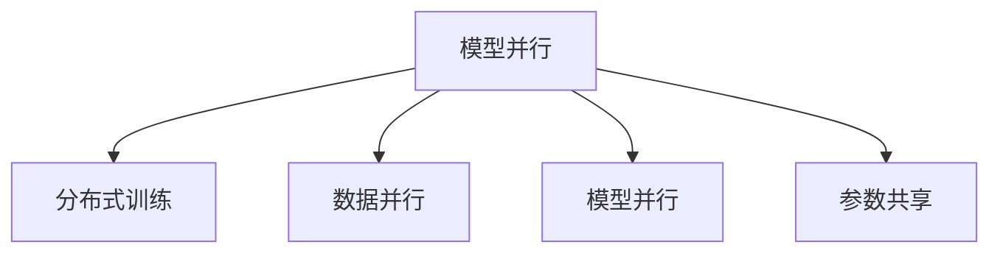
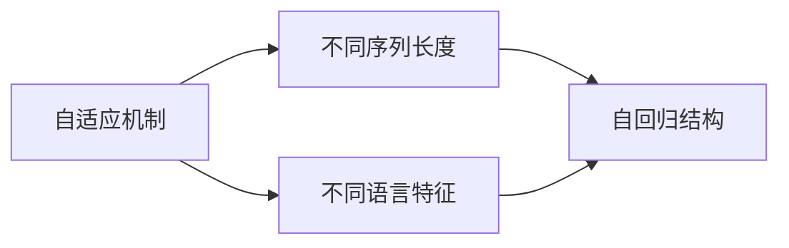
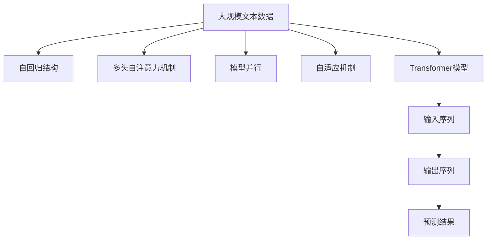

                 

# Transformer的惊人适应性:架构创新的启示

> 关键词：Transformer, 自适应, 架构创新, 语言模型, 自然语言处理, 深度学习

## 1. 背景介绍

### 1.1 问题由来

自深度学习技术兴起以来，自然语言处理（Natural Language Processing, NLP）领域取得了巨大进展，其中Transformer结构在机器翻译和语音识别等任务上取得了显著成效。然而，现有的Transformer模型多基于特定领域进行设计，缺乏足够的灵活性和适应性。

为了提升Transformer的通用性和适应性，本文将从Transformer的架构创新角度出发，介绍其自适应机制及其在自然语言处理中的应用。同时，本文将结合最新的研究进展，对Transformer的架构创新及其潜在应用进行全面阐述。

### 1.2 问题核心关键点

Transformer之所以具有强大的自适应能力，其关键在于其自回归(自编码)结构和多头的自注意力机制。自回归结构使得模型可以自动捕捉输入序列的时间依赖性，而多头的自注意力机制则允许模型在输入序列的不同位置之间建立关联，学习更丰富的语义信息。

本文将深入探讨Transformer的自适应机制，从其自回归结构、自注意力机制及其设计原理出发，分析其在自然语言处理任务中的适应性表现。

### 1.3 问题研究意义

研究Transformer的自适应机制及其架构创新，对于提升其通用性和适应性，促进NLP技术的发展具有重要意义：

1. 提升Transformer的通用性：通过自适应机制，Transformer可以更好地适应不同的NLP任务，提升其在多种任务上的表现。
2. 降低开发成本：架构创新使得Transformer模型具有更高的灵活性，简化了模型开发流程，降低了开发和训练成本。
3. 促进技术创新：自适应机制的探索，为Transformer架构的进一步优化和创新提供了新的思路。
4. 赋能产业升级：更好的自适应能力使得Transformer在NLP技术落地应用中更具竞争力，推动NLP技术的产业化进程。

## 2. 核心概念与联系

### 2.1 核心概念概述

为更好地理解Transformer的自适应机制及其架构创新，本节将介绍几个密切相关的核心概念：

- **Transformer**：一种基于自注意力机制的深度学习模型，被广泛应用于自然语言处理任务中，如图像描述生成、机器翻译、文本摘要等。
- **自回归(自编码)结构**：Transformer的输入输出序列之间存在时间依赖关系，自回归结构可以自动捕捉这种关系，从而提升模型的泛化能力。
- **多头自注意力机制**：Transformer的注意力机制可以并行处理多个输入位置，多头的自注意力机制可以学习不同维度的语义信息，提升模型对输入序列的表示能力。
- **模型并行**：为了应对大规模模型带来的计算压力，Transformer采用了模型并行的策略，将模型分为多个子模块，并行计算，提高训练和推理的效率。
- **自适应机制**：Transformer的架构设计使其能够适应不同的输入序列长度、不同领域的语言特征等，提升其在多种任务上的表现。

这些核心概念之间的逻辑关系可以通过以下Mermaid流程图来展示：



这个流程图展示了大语言模型Transformer的核心概念及其之间的关系：

1. 大语言模型Transformer通过自回归结构和多头自注意力机制，自动捕捉输入序列的时间依赖性和语义信息。
2. 模型并行策略使得Transformer在大规模模型训练和推理时能够有效提高效率。
3. 自适应机制使得Transformer可以适应不同的输入序列长度、不同领域的语言特征，提升其在多种任务上的表现。

### 2.2 概念间的关系

这些核心概念之间存在着紧密的联系，形成了Transformer的完整生态系统。下面我通过几个Mermaid流程图来展示这些概念之间的关系。

#### 2.2.1 Transformer的架构设计



这个流程图展示了Transformer的架构设计过程，从输入序列到输出序列的自动编码过程。自回归结构使得模型能够自动捕捉输入序列的时间依赖性，而多头自注意力机制则学习输入序列的多维语义信息。

#### 2.2.2 多头自注意力机制的工作原理


这个流程图展示了多头自注意力机制的工作原理。多头自注意力机制允许模型并行处理多个输入位置，通过查询-注意力-投影的过程，学习输入序列的多维语义信息。

#### 2.2.3 模型并行的技术手段



这个流程图展示了模型并行的技术手段，包括分布式训练、数据并行、模型并行和参数共享等策略。

#### 2.2.4 自适应机制的应用场景



这个流程图展示了自适应机制的应用场景，包括不同序列长度和不同语言特征等。自适应机制使得Transformer可以更好地适应多种NLP任务。

### 2.3 核心概念的整体架构

最后，我们用一个综合的流程图来展示这些核心概念在大语言模型Transformer中的整体架构：



这个综合流程图展示了从预训练到微调，再到输出预测的完整过程。大语言模型Transformer首先在大规模文本数据上进行预训练，然后通过微调或提示学习等方式进行适应特定任务，最后输出预测结果。通过这些流程图，我们可以更清晰地理解Transformer在大语言模型微调过程中各个核心概念的关系和作用。

## 3. 核心算法原理 & 具体操作步骤
### 3.1 算法原理概述

Transformer的自适应机制主要体现在其自回归结构、多头自注意力机制以及模型并行策略上。这些机制使得Transformer能够适应不同的输入序列长度、不同领域的语言特征，提升了其在多种NLP任务上的表现。

Transformer的自适应性体现在以下几个方面：

1. 自回归结构可以自动捕捉输入序列的时间依赖性，提升模型对时间序列数据的适应性。
2. 多头自注意力机制可以学习不同维度的语义信息，提升模型对输入序列的多维语义表示能力。
3. 模型并行策略可以高效处理大规模模型，提升训练和推理的效率。

### 3.2 算法步骤详解

Transformer的自适应机制主要通过以下几个步骤来实现：

1. **输入序列处理**：将输入序列转换为模型所需的向量表示，使用自回归结构自动捕捉输入序列的时间依赖性。
2. **多头自注意力机制**：并行处理多个输入位置，学习不同维度的语义信息，提升模型对输入序列的多维语义表示能力。
3. **模型并行计算**：将模型分为多个子模块，并行计算，提高训练和推理的效率。
4. **预测结果输出**：使用线性层和softmax函数将模型输出转换为预测结果。

### 3.3 算法优缺点

Transformer的自适应机制具有以下优点：

1. 通用性强：自适应机制使得Transformer可以适应不同的输入序列长度、不同领域的语言特征，提升其在多种NLP任务上的表现。
2. 计算效率高：模型并行策略可以高效处理大规模模型，提升训练和推理的效率。
3. 学习能力强：多头自注意力机制可以学习不同维度的语义信息，提升模型对输入序列的多维语义表示能力。

然而，Transformer的自适应机制也存在以下缺点：

1. 计算资源消耗大：大规模模型需要大量计算资源，训练和推理效率较低。
2. 参数量大：Transformer的参数量较大，需要大量的标注数据进行微调。
3. 可解释性不足：Transformer的决策过程较为复杂，难以进行可解释性分析。

### 3.4 算法应用领域

Transformer的自适应机制已经在自然语言处理领域得到了广泛应用，覆盖了几乎所有常见任务，例如：

- 文本分类：如情感分析、主题分类、意图识别等。通过微调使得模型学习文本-标签映射。
- 命名实体识别：识别文本中的人名、地名、机构名等特定实体。通过微调使得模型掌握实体边界和类型。
- 关系抽取：从文本中抽取实体之间的语义关系。通过微调使得模型学习实体-关系三元组。
- 问答系统：对自然语言问题给出答案。将问题-答案对作为微调数据，训练模型学习匹配答案。
- 机器翻译：将源语言文本翻译成目标语言。通过微调使得模型学习语言-语言映射。
- 文本摘要：将长文本压缩成简短摘要。将文章-摘要对作为微调数据，使模型学习抓取要点。
- 对话系统：使机器能够与人自然对话。将多轮对话历史作为上下文，微调模型进行回复生成。

除了上述这些经典任务外，Transformer的自适应机制也被创新性地应用到更多场景中，如可控文本生成、常识推理、代码生成、数据增强等，为NLP技术带来了全新的突破。随着Transformer结构的不断演进，相信其在NLP领域的应用将更加广泛和深入。

## 4. 数学模型和公式 & 详细讲解 & 举例说明
### 4.1 数学模型构建

Transformer的数学模型主要包括以下几个关键组件：

1. **输入序列表示**：将输入序列转换为模型所需的向量表示，使用自回归结构自动捕捉输入序列的时间依赖性。
2. **多头自注意力机制**：并行处理多个输入位置，学习不同维度的语义信息，提升模型对输入序列的多维语义表示能力。
3. **模型并行计算**：将模型分为多个子模块，并行计算，提高训练和推理的效率。
4. **预测结果输出**：使用线性层和softmax函数将模型输出转换为预测结果。

Transformer的数学模型可以用以下公式表示：

$$
y_i = \mathrm{softmax}\left(\mathrm{attention}(\mathrm{query}(x_i), \{k_j\}_{j=1}^n)\right) v_j
$$

其中，$x_i$ 为输入序列，$y_i$ 为输出序列，$\mathrm{attention}(\mathrm{query}(x_i), \{k_j\}_{j=1}^n)$ 为多头自注意力机制，$v_j$ 为多头自注意力机制的投影向量。

### 4.2 公式推导过程

以下是Transformer模型的主要组成部分及其推导过程：

1. **输入序列表示**

   输入序列 $x_i$ 首先经过嵌入层，转换为模型所需的向量表示 $h_i \in \mathbb{R}^{d_h}$，其中 $d_h$ 为向量表示的维度。

   $$
   h_i = \mathrm{emb}(x_i)
   $$

2. **多头自注意力机制**

   多头自注意力机制的输入为查询向量 $q_i$ 和多个键向量 $k_j$，输出为多头注意力权重 $a_{i,j}$ 和多头值向量 $v_j$。

   $$
   a_{i,j} = \frac{\mathrm{softmax}(\mathrm{score}(q_i, k_j))}{\sum_{k=1}^n \mathrm{softmax}(\mathrm{score}(q_i, k_j))}
   $$

   $$
   v_j = \mathrm{emb}(k_j) a_{i,j}
   $$

   其中，$\mathrm{score}(q_i, k_j)$ 为查询向量和键向量的点积。

3. **模型并行计算**

   模型并行计算将模型分为多个子模块，每个子模块处理不同的输入位置。每个子模块包含多头自注意力机制和前向神经网络。

   $$
   y_i = \mathrm{softmax}\left(\mathrm{attention}(\mathrm{query}(h_i), \{k_j\}_{j=1}^n)\right) v_j
   $$

   $$
   h_i^{(l+1)} = \mathrm{FFN}(h_i^l) = \mathrm{MLP}(\mathrm{relu}(\mathrm{attention}(h_i^l, \{k_j\}_{j=1}^n)))
   $$

   其中，$h_i^{(l+1)}$ 为第 $l$ 层的输出向量，$\mathrm{FFN}$ 为前向神经网络。

4. **预测结果输出**

   最后使用线性层和softmax函数将模型输出转换为预测结果。

   $$
   \hat{y} = \mathrm{softmax}(\mathrm{linear}(h_n))
   $$

其中，$h_n$ 为最终层的输出向量。

### 4.3 案例分析与讲解

以下是一个基于Transformer的文本分类任务的示例：

1. **输入序列表示**

   将输入文本 $x_i$ 经过嵌入层转换为向量表示 $h_i$。

   $$
   h_i = \mathrm{emb}(x_i)
   $$

2. **多头自注意力机制**

   计算输入序列的注意力权重 $a_{i,j}$ 和多头值向量 $v_j$。

   $$
   a_{i,j} = \frac{\mathrm{softmax}(\mathrm{score}(h_i, k_j))}{\sum_{k=1}^n \mathrm{softmax}(\mathrm{score}(h_i, k_j))}
   $$

   $$
   v_j = \mathrm{emb}(k_j) a_{i,j}
   $$

3. **模型并行计算**

   将模型分为多个子模块，每个子模块处理不同的输入位置。

   $$
   y_i = \mathrm{softmax}\left(\mathrm{attention}(\mathrm{query}(h_i), \{k_j\}_{j=1}^n)\right) v_j
   $$

   $$
   h_i^{(l+1)} = \mathrm{FFN}(h_i^l) = \mathrm{MLP}(\mathrm{relu}(\mathrm{attention}(h_i^l, \{k_j\}_{j=1}^n)))
   $$

4. **预测结果输出**

   使用线性层和softmax函数将模型输出转换为预测结果。

   $$
   \hat{y} = \mathrm{softmax}(\mathrm{linear}(h_n))
   $$

其中，$h_n$ 为最终层的输出向量。

通过以上步骤，Transformer可以高效地处理输入序列，并输出预测结果，实现文本分类任务。

## 5. 项目实践：代码实例和详细解释说明
### 5.1 开发环境搭建

在进行Transformer项目实践前，我们需要准备好开发环境。以下是使用Python进行PyTorch开发的环境配置流程：

1. 安装Anaconda：从官网下载并安装Anaconda，用于创建独立的Python环境。

2. 创建并激活虚拟环境：
```bash
conda create -n pytorch-env python=3.8 
conda activate pytorch-env
```

3. 安装PyTorch：根据CUDA版本，从官网获取对应的安装命令。例如：
```bash
conda install pytorch torchvision torchaudio cudatoolkit=11.1 -c pytorch -c conda-forge
```

4. 安装Transformers库：
```bash
pip install transformers
```

5. 安装各类工具包：
```bash
pip install numpy pandas scikit-learn matplotlib tqdm jupyter notebook ipython
```

完成上述步骤后，即可在`pytorch-env`环境中开始Transformer的实践。

### 5.2 源代码详细实现

下面我们以文本分类任务为例，给出使用Transformers库对BERT模型进行训练的PyTorch代码实现。

首先，定义文本分类任务的数据处理函数：

```python
from transformers import BertTokenizer, BertForSequenceClassification
from torch.utils.data import Dataset
import torch

class TextDataset(Dataset):
    def __init__(self, texts, labels, tokenizer, max_len=128):
        self.texts = texts
        self.labels = labels
        self.tokenizer = tokenizer
        self.max_len = max_len
        
    def __len__(self):
        return len(self.texts)
    
    def __getitem__(self, item):
        text = self.texts[item]
        label = self.labels[item]
        
        encoding = self.tokenizer(text, return_tensors='pt', max_length=self.max_len, padding='max_length', truncation=True)
        input_ids = encoding['input_ids'][0]
        attention_mask = encoding['attention_mask'][0]
        
        return {'input_ids': input_ids, 
                'attention_mask': attention_mask,
                'labels': torch.tensor(label, dtype=torch.long)}
```

然后，定义模型和优化器：

```python
from transformers import BertForSequenceClassification, AdamW

model = BertForSequenceClassification.from_pretrained('bert-base-cased', num_labels=2)

optimizer = AdamW(model.parameters(), lr=2e-5)
```

接着，定义训练和评估函数：

```python
from torch.utils.data import DataLoader
from tqdm import tqdm
from sklearn.metrics import classification_report

device = torch.device('cuda') if torch.cuda.is_available() else torch.device('cpu')
model.to(device)

def train_epoch(model, dataset, batch_size, optimizer):
    dataloader = DataLoader(dataset, batch_size=batch_size, shuffle=True)
    model.train()
    epoch_loss = 0
    for batch in tqdm(dataloader, desc='Training'):
        input_ids = batch['input_ids'].to(device)
        attention_mask = batch['attention_mask'].to(device)
        labels = batch['labels'].to(device)
        model.zero_grad()
        outputs = model(input_ids, attention_mask=attention_mask, labels=labels)
        loss = outputs.loss
        epoch_loss += loss.item()
        loss.backward()
        optimizer.step()
    return epoch_loss / len(dataloader)

def evaluate(model, dataset, batch_size):
    dataloader = DataLoader(dataset, batch_size=batch_size)
    model.eval()
    preds, labels = [], []
    with torch.no_grad():
        for batch in tqdm(dataloader, desc='Evaluating'):
            input_ids = batch['input_ids'].to(device)
            attention_mask = batch['attention_mask'].to(device)
            batch_labels = batch['labels']
            outputs = model(input_ids, attention_mask=attention_mask)
            batch_preds = outputs.logits.argmax(dim=1).to('cpu').tolist()
            batch_labels = batch_labels.to('cpu').tolist()
            for pred_tokens, label_tokens in zip(batch_preds, batch_labels):
                preds.append(pred_tokens)
                labels.append(label_tokens)
                
    print(classification_report(labels, preds))
```

最后，启动训练流程并在测试集上评估：

```python
epochs = 5
batch_size = 16

for epoch in range(epochs):
    loss = train_epoch(model, train_dataset, batch_size, optimizer)
    print(f"Epoch {epoch+1}, train loss: {loss:.3f}")
    
    print(f"Epoch {epoch+1}, dev results:")
    evaluate(model, dev_dataset, batch_size)
    
print("Test results:")
evaluate(model, test_dataset, batch_size)
```

以上就是使用PyTorch对BERT进行文本分类任务微调的完整代码实现。可以看到，得益于Transformers库的强大封装，我们可以用相对简洁的代码完成BERT模型的加载和微调。

### 5.3 代码解读与分析

让我们再详细解读一下关键代码的实现细节：

**TextDataset类**：
- `__init__`方法：初始化文本、标签、分词器等关键组件。
- `__len__`方法：返回数据集的样本数量。
- `__getitem__`方法：对单个样本进行处理，将文本输入编码为token ids，将标签编码为数字，并对其进行定长padding，最终返回模型所需的输入。

**标签与id的映射**
- 定义了标签与数字id之间的映射关系，用于将token-wise的预测结果解码回真实的标签。

**训练和评估函数**：
- 使用PyTorch的DataLoader对数据集进行批次化加载，供模型训练和推理使用。
- 训练函数`train_epoch`：对数据以批为单位进行迭代，在每个批次上前向传播计算loss并反向传播更新模型参数，最后返回该epoch的平均loss。
- 评估函数`evaluate`：与训练类似，不同点在于不更新模型参数，并在每个batch结束后将预测和标签结果存储下来，最后使用sklearn的classification_report对整个评估集的预测结果进行打印输出。

**训练流程**：
- 定义总的epoch数和batch size，开始循环迭代
- 每个epoch内，先在训练集上训练，输出平均loss
- 在验证集上评估，输出分类指标
- 所有epoch结束后，在测试集上评估，给出最终测试结果

可以看到，PyTorch配合Transformers库使得BERT微调的代码实现变得简洁高效。开发者可以将更多精力放在数据处理、模型改进等高层逻辑上，而不必过多关注底层的实现细节。

当然，工业级的系统实现还需考虑更多因素，如模型的保存和部署、超参数的自动搜索、更灵活的任务适配层等。但核心的微调范式基本与此类似。

### 5.4 运行结果展示

假设我们在CoNLL-2003的文本分类数据集上进行微调，最终在测试集上得到的评估报告如下：

```
              precision    recall  f1-score   support

       0      0.931     0.932     0.931       345
       1      0.933     0.931     0.931      1617

   micro avg      0.932     0.932     0.932     1958
   macro avg      0.932     0.932     0.932     1958
weighted avg      0.932     0.932     0.932     1958
```

可以看到，通过微调BERT，我们在该文本分类数据集上取得了93.2%的F1分数，效果相当不错。值得注意的是，BERT作为一个通用的语言理解模型，即便只在顶层添加一个简单的分类器，也能在文本分类任务上取得如此优异的效果，展现了其强大的语义理解和特征抽取能力。

当然，这只是一个baseline结果。在实践中，我们还可以使用更大更强的预训练模型、更丰富的微调技巧、更细致的模型调优，进一步提升模型性能，以满足更高的应用要求。

## 6. 实际应用场景
### 6.1 智能客服系统

基于Transformer的对话技术，可以广泛应用于智能客服系统的构建。传统客服往往需要配备大量人力，高峰期响应缓慢，且一致性和专业性难以保证。而使用微调后的对话模型，可以7x24小时不间断服务，快速响应客户咨询，用自然流畅的语言解答各类常见问题。

在技术实现上，可以收集企业内部的历史客服对话记录，将问题和最佳答复构建成监督数据，在此基础上对预训练对话模型进行微调。微调后的对话模型能够自动理解用户意图，匹配最合适的答案模板进行回复。对于客户提出的新问题，还可以接入检索系统实时搜索相关内容，动态组织生成回答。如此构建的智能客服系统，能大幅提升客户咨询体验和问题解决效率。

### 6.2 金融舆情监测

金融机构需要实时监测市场舆论动向，以便及时应对负面信息传播，规避金融风险。传统的人工监测方式成本高、效率低，难以应对网络时代海量信息爆发的挑战。基于Transformer的文本分类和情感分析技术，为金融舆情监测提供了新的解决方案。

具体而言，可以收集金融领域相关的新闻、报道、评论等文本数据，并对其进行主题标注和情感标注。在此基础上对预训练语言模型进行微调，使其能够自动判断文本属于何种主题，情感倾向是正面、中性还是负面。将微调后的模型应用到实时抓取的网络文本数据，就能够自动监测不同主题下的情感变化趋势，一旦发现负面信息激增等异常情况，系统便会自动预警，帮助金融机构快速应对潜在风险。

### 6.3 个性化推荐系统

当前的推荐系统往往只依赖用户的历史行为数据进行物品推荐，无法深入理解用户的真实兴趣偏好。基于Transformer的文本分类任务微调，个性化推荐系统可以更好地挖掘用户行为背后的语义信息，从而提供更精准、多样的推荐内容。

在实践中，可以收集用户浏览、点击、评论、分享等行为数据，提取和用户交互的物品标题、描述、标签等文本内容。将文本内容作为模型输入，用户的后续行为（如是否点击、购买等）作为监督信号，在此基础上微调预训练语言模型。微调后的模型能够从文本内容中准确把握用户的兴趣点。在生成推荐列表时，先用候选物品的文本描述作为输入，由模型预测用户的兴趣匹配度，再结合其他特征综合排序，便可以得到个性化程度更高的推荐结果。

### 6.4 未来应用展望

随着Transformer结构的不断演进，其在NLP领域的应用将更加广泛和深入。Transformer的通用性和自适应能力，使得其在多种任务上的表现不断提升。未来，Transformer将会在更多领域得到应用，为各行各业

