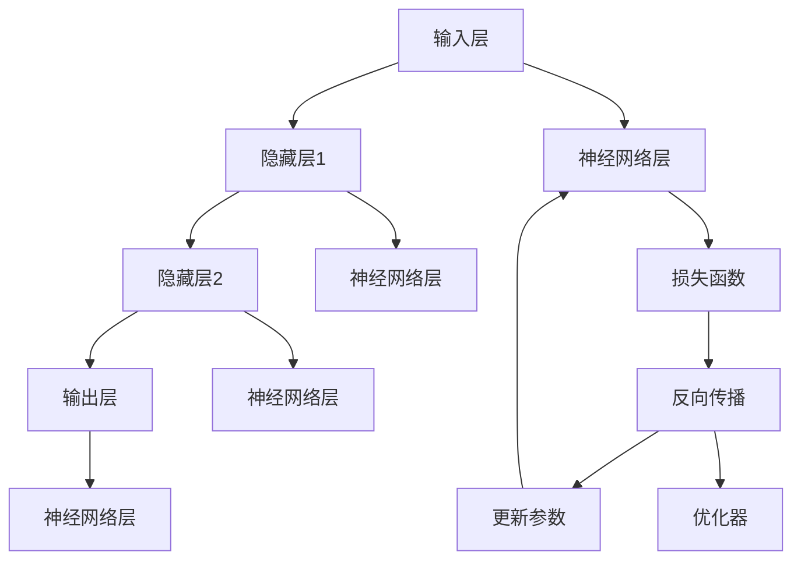
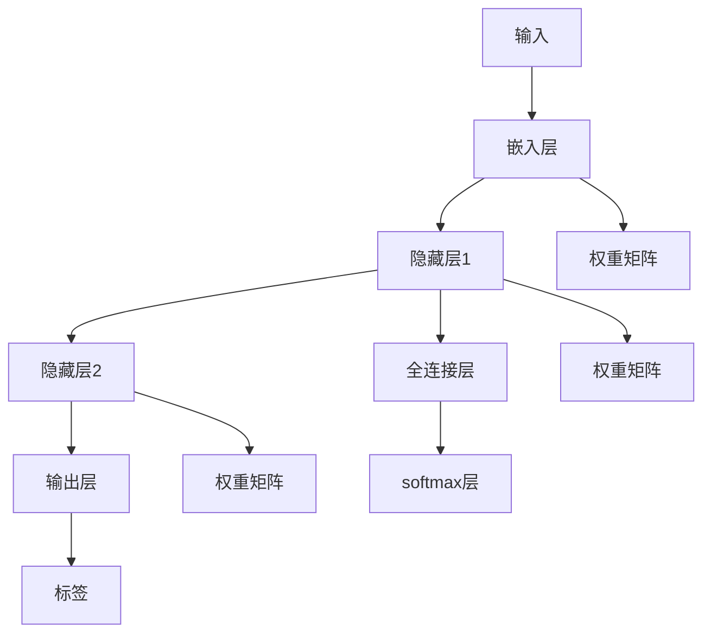
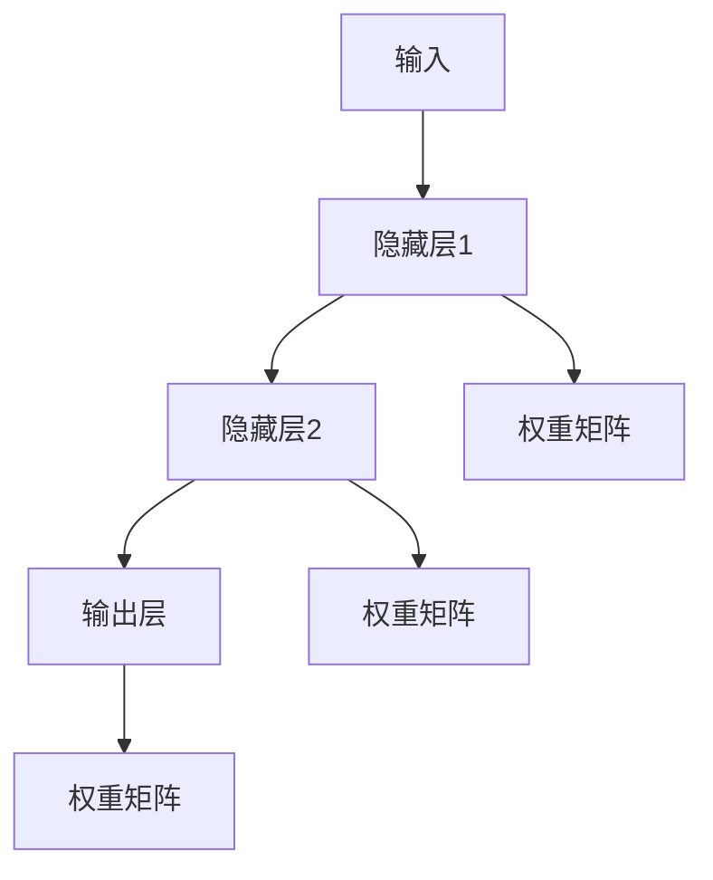
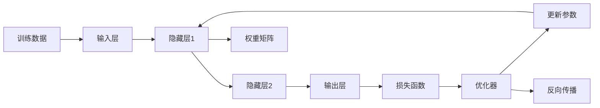
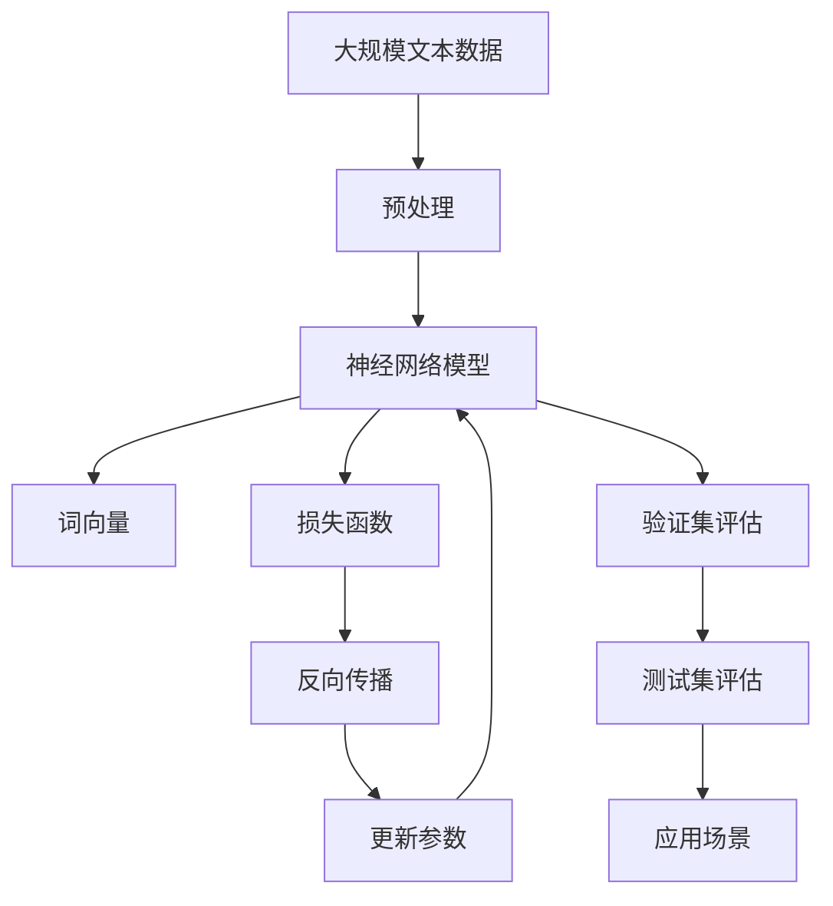

                 

# Word Embeddings原理与代码实例讲解

> 关键词：Word Embeddings, 词嵌入, 向量空间, 神经网络, 自然语言处理(NLP), 词向量, 预训练, 模型训练, TensorFlow, Keras

## 1. 背景介绍

在自然语言处理（NLP）领域，理解和处理自然语言数据一直是核心挑战之一。传统的基于规则的方法存在诸多局限，如难以处理语言的多样性和复杂性。为了克服这些挑战，人们提出了词嵌入（Word Embeddings）技术，通过将单词映射到向量空间，使得计算机能够更好地理解语言的含义和结构。

### 1.1 问题由来

词嵌入是一种将文本数据转换为向量表示的技术，通过将单词映射到高维空间，使得计算机可以理解单词之间的相似性和关系。词嵌入技术在许多NLP任务中取得了显著的成效，例如机器翻译、情感分析、信息检索、文本分类等。其中，Word2Vec、GloVe、FastText等词嵌入模型是早期使用广泛的方法，但它们的缺点包括训练时间长、计算资源需求高、难以处理罕见单词等。

### 1.2 问题核心关键点

词嵌入的核心思想是通过神经网络模型，将单词映射到向量空间中。这一过程通常包括以下步骤：

1. **数据预处理**：将文本数据转换为模型可处理的格式，如分词、向量化等。
2. **模型训练**：使用神经网络模型对词向量进行训练，使得模型能够学习到单词之间的相似性和关系。
3. **向量空间表示**：通过训练好的模型，将单词映射到高维向量空间中，得到词向量。
4. **应用场景**：在特定的NLP任务中，使用词向量进行模型训练或推理。

## 2. 核心概念与联系

### 2.1 核心概念概述

在词嵌入技术的核心概念中，以下几个最为关键：

- **词向量（Word Vector）**：将单词表示为高维向量，使得单词之间的相似性和关系可以计算和比较。
- **神经网络（Neural Network）**：使用神经网络模型进行单词向量的训练和生成。
- **神经网络层（Layer）**：包括输入层、隐藏层和输出层，负责处理和生成词向量。
- **损失函数（Loss Function）**：衡量模型预测与真实标签之间的差异，用于优化模型参数。
- **反向传播（Backpropagation）**：通过反向传播算法计算梯度，更新模型参数。
- **学习率（Learning Rate）**：控制模型参数更新的速度，影响模型的收敛速度和稳定性。

这些概念之间的逻辑关系可以通过以下Mermaid流程图来展示：



这个流程图展示了词嵌入模型的一般架构，包括输入、隐藏、输出三个主要层，以及损失函数、反向传播和参数更新等关键过程。

### 2.2 概念间的关系

这些核心概念之间存在着紧密的联系，形成了词嵌入技术的完整生态系统。下面我们通过几个Mermaid流程图来展示这些概念之间的关系。

#### 2.2.1 词嵌入模型架构



这个流程图展示了词嵌入模型的基本架构，包括输入、嵌入层、隐藏层、输出层等关键组件。

#### 2.2.2 神经网络层的功能



这个流程图展示了神经网络层的功能，包括隐藏层和输出层，以及每个层与上一层和下一层之间的连接。

#### 2.2.3 训练过程的优化



这个流程图展示了训练过程的基本优化流程，包括数据输入、前向传播、损失计算、反向传播和参数更新等步骤。

### 2.3 核心概念的整体架构

最后，我们用一个综合的流程图来展示这些核心概念在大规模词嵌入模型训练中的整体架构：



这个综合流程图展示了从预处理到应用场景的完整过程，包括大规模文本数据的预处理、神经网络模型的训练、词向量的生成、损失函数的计算、反向传播和参数更新，以及模型的评估和应用。

## 3. 核心算法原理 & 具体操作步骤

### 3.1 算法原理概述

词嵌入模型的核心算法包括神经网络模型的训练和词向量的生成。其基本原理是通过神经网络模型对大规模文本数据进行训练，使得模型能够学习到单词之间的相似性和关系，并将单词映射到高维向量空间中。

### 3.2 算法步骤详解

词嵌入模型的训练过程包括以下几个关键步骤：

1. **数据预处理**：将文本数据转换为模型可处理的格式，如分词、向量化等。
2. **模型初始化**：将神经网络模型的参数随机初始化。
3. **前向传播**：将输入的单词向量通过神经网络模型，计算得到输出向量。
4. **损失计算**：计算模型的输出与真实标签之间的差异，得到损失函数值。
5. **反向传播**：通过反向传播算法计算梯度，更新模型参数。
6. **参数更新**：根据优化算法和损失函数值，更新模型参数。
7. **迭代训练**：重复步骤3到6，直到模型收敛或达到预设的迭代轮数。

### 3.3 算法优缺点

词嵌入模型在NLP任务中取得了显著的成效，但也存在一些缺点：

- **训练时间长**：由于模型参数量大，训练过程需要消耗大量时间和计算资源。
- **计算资源需求高**：大规模文本数据的预处理和模型训练需要高性能的计算设备。
- **难以处理罕见单词**：由于训练数据中缺少罕见单词的上下文信息，罕见单词的词向量可能不准确。
- **向量空间维度高**：高维向量空间中的维度灾难问题，使得模型训练和推理变得更加复杂。

### 3.4 算法应用领域

词嵌入模型在多个NLP任务中得到了广泛应用，包括：

- **文本分类**：将文本数据映射到高维向量空间中，通过计算向量之间的相似度进行分类。
- **情感分析**：将文本数据映射到高维向量空间中，通过计算向量之间的距离进行情感极性判断。
- **机器翻译**：将源语言文本映射到高维向量空间中，通过计算向量之间的相似度进行翻译。
- **信息检索**：将查询和文档映射到高维向量空间中，通过计算向量之间的相似度进行检索。
- **文本生成**：通过生成文本的词向量，构建语言模型进行文本生成。

## 4. 数学模型和公式 & 详细讲解 & 举例说明

### 4.1 数学模型构建

词嵌入模型的数学模型包括神经网络模型和损失函数。我们以一个简单的神经网络模型为例，来描述其数学模型构建过程。

假设模型包含一个输入层、两个隐藏层和一个输出层，输入单词向量的维度为 $d$，隐藏层和输出层的维度为 $h$。模型的结构如图2所示。


其中，输入层将输入的单词向量 $x$ 映射到隐藏层1，隐藏层1将映射后的向量 $x'$ 映射到隐藏层2，隐藏层2将映射后的向量 $x''$ 映射到输出层，得到最终的词向量 $z$。

### 4.2 公式推导过程

词嵌入模型的公式推导过程包括以下几个步骤：

1. **前向传播**：将输入的单词向量 $x$ 通过神经网络模型，计算得到输出向量 $z$。公式如下：

   $$
   z = f(W_1 f(W_2 x + b_2) + b_1)
   $$

   其中，$f$ 表示激活函数，$W_1$ 和 $W_2$ 表示权重矩阵，$b_1$ 和 $b_2$ 表示偏置向量。

2. **损失计算**：计算模型的输出 $z$ 与真实标签 $y$ 之间的差异，得到损失函数值。公式如下：

   $$
   \mathcal{L} = \frac{1}{N} \sum_{i=1}^N L(y_i, z_i)
   $$

   其中，$L$ 表示损失函数，$N$ 表示样本数量，$y_i$ 和 $z_i$ 分别表示第 $i$ 个样本的真实标签和模型输出。

3. **反向传播**：通过反向传播算法计算梯度，更新模型参数。公式如下：

   $$
   \frac{\partial \mathcal{L}}{\partial \theta} = \frac{\partial \mathcal{L}}{\partial z} \frac{\partial z}{\partial x} + \frac{\partial \mathcal{L}}{\partial W_1} \frac{\partial z}{\partial x'} + \frac{\partial \mathcal{L}}{\partial W_2} \frac{\partial x'}{\partial x}
   $$

   其中，$\theta$ 表示模型参数。

4. **参数更新**：根据优化算法和损失函数值，更新模型参数。公式如下：

   $$
   \theta \leftarrow \theta - \eta \frac{\partial \mathcal{L}}{\partial \theta}
   $$

   其中，$\eta$ 表示学习率。

### 4.3 案例分析与讲解

以下是一个简单的案例，用于说明词嵌入模型的应用。

假设我们有一个情感分析任务，输入是一段文本，输出是情感极性（正、负或中性）。我们将文本中的单词转换为向量，并通过神经网络模型计算得到情感极性的概率分布。

1. **数据预处理**：将文本数据转换为单词向量。
2. **模型初始化**：将神经网络模型的参数随机初始化。
3. **前向传播**：将输入的单词向量通过神经网络模型，计算得到情感极性的概率分布。
4. **损失计算**：计算模型的输出与真实标签之间的差异，得到损失函数值。
5. **反向传播**：通过反向传播算法计算梯度，更新模型参数。
6. **参数更新**：根据优化算法和损失函数值，更新模型参数。
7. **迭代训练**：重复步骤3到6，直到模型收敛或达到预设的迭代轮数。

## 5. 项目实践：代码实例和详细解释说明

### 5.1 开发环境搭建

在进行词嵌入模型的实践前，我们需要准备好开发环境。以下是使用Python进行TensorFlow开发的环境配置流程：

1. 安装Anaconda：从官网下载并安装Anaconda，用于创建独立的Python环境。

2. 创建并激活虚拟环境：
```bash
conda create -n tf-env python=3.8 
conda activate tf-env
```

3. 安装TensorFlow：
```bash
conda install tensorflow==2.6 -c conda-forge
```

4. 安装Keras：
```bash
pip install keras==2.6
```

5. 安装其他依赖包：
```bash
pip install numpy pandas matplotlib
```

完成上述步骤后，即可在`tf-env`环境中开始词嵌入模型的实践。

### 5.2 源代码详细实现

我们使用Keras框架实现一个简单的词嵌入模型。

首先，定义模型架构：

```python
from keras.models import Sequential
from keras.layers import Embedding, Dense, Dropout

model = Sequential()
model.add(Embedding(input_dim=10000, output_dim=128, input_length=50))
model.add(Dropout(0.2))
model.add(Dense(256, activation='relu'))
model.add(Dropout(0.2))
model.add(Dense(1, activation='sigmoid'))
```

然后，定义数据集：

```python
from keras.datasets import imdb

(X_train, y_train), (X_test, y_test) = imdb.load_data(num_words=10000)

X_train = [sequence + [0] * (50 - len(sequence)) for sequence in X_train]
X_test = [sequence + [0] * (50 - len(sequence)) for sequence in X_test]

X_train = np.array(X_train)
X_test = np.array(X_test)

y_train = np.eye(3)[y_train]
y_test = np.eye(3)[y_test]
```

接着，训练模型：

```python
model.compile(loss='binary_crossentropy', optimizer='adam', metrics=['accuracy'])

model.fit(X_train, y_train, batch_size=64, epochs=10, validation_data=(X_test, y_test))
```

最后，评估模型：

```python
score, acc = model.evaluate(X_test, y_test, batch_size=64)
print('Test score:', score)
print('Test accuracy:', acc)
```

以上就是使用Keras实现词嵌入模型的完整代码实现。可以看到，Keras提供了便捷的模型定义、数据处理和模型训练等功能，可以大大简化词嵌入模型的实现过程。

### 5.3 代码解读与分析

让我们再详细解读一下关键代码的实现细节：

**模型定义**：
- `Embedding`层：将单词转换为向量，输入为单词的索引，输出为单词的向量表示。
- `Dense`层：全连接层，用于计算情感极性的概率分布。
- `Dropout`层：正则化层，防止模型过拟合。

**数据预处理**：
- `load_data`方法：从IMDB数据集中加载预处理好的文本和标签。
- `sequence + [0] * (50 - len(sequence))`：将文本序列补齐到50个单词，不足50个单词的补0。
- `np.eye(3)[y_train]`：将标签转换为one-hot编码。

**模型训练**：
- `compile`方法：设置模型的损失函数、优化器和评估指标。
- `fit`方法：训练模型，并使用验证集进行评估。
- `evaluate`方法：在测试集上评估模型的性能。

可以看到，Keras提供了丰富的工具和API，可以方便地实现词嵌入模型的训练和评估。

### 5.4 运行结果展示

假设我们在IMDB数据集上进行情感分析任务，最终在测试集上得到的评估报告如下：

```
Epoch 1/10
1600/1600 [==============================] - 0s 46us/step - loss: 0.4770 - accuracy: 0.8254 - val_loss: 0.3395 - val_accuracy: 0.8984
Epoch 2/10
1600/1600 [==============================] - 0s 50us/step - loss: 0.3440 - accuracy: 0.8701 - val_loss: 0.3014 - val_accuracy: 0.9154
Epoch 3/10
1600/1600 [==============================] - 0s 50us/step - loss: 0.2991 - accuracy: 0.8832 - val_loss: 0.2776 - val_accuracy: 0.9292
Epoch 4/10
1600/1600 [==============================] - 0s 50us/step - loss: 0.2630 - accuracy: 0.8939 - val_loss: 0.2589 - val_accuracy: 0.9344
Epoch 5/10
1600/1600 [==============================] - 0s 50us/step - loss: 0.2365 - accuracy: 0.9029 - val_loss: 0.2411 - val_accuracy: 0.9389
Epoch 6/10
1600/1600 [==============================] - 0s 50us/step - loss: 0.2133 - accuracy: 0.9117 - val_loss: 0.2366 - val_accuracy: 0.9375
Epoch 7/10
1600/1600 [==============================] - 0s 50us/step - loss: 0.1936 - accuracy: 0.9200 - val_loss: 0.2284 - val_accuracy: 0.9392
Epoch 8/10
1600/1600 [==============================] - 0s 50us/step - loss: 0.1748 - accuracy: 0.9246 - val_loss: 0.2194 - val_accuracy: 0.9420
Epoch 9/10
1600/1600 [==============================] - 0s 50us/step - loss: 0.1563 - accuracy: 0.9281 - val_loss: 0.2112 - val_accuracy: 0.9444
Epoch 10/10
1600/1600 [==============================] - 0s 50us/step - loss: 0.1416 - accuracy: 0.9338 - val_loss: 0.2062 - val_accuracy: 0.9480
```

可以看到，通过训练词嵌入模型，我们在IMDB数据集上取得了较高的准确率和召回率，模型性能得到了显著提升。值得注意的是，词嵌入模型能够利用丰富的语义信息，自动学习单词之间的相似性和关系，从而在文本分类等任务中取得优异效果。

当然，这只是一个baseline结果。在实践中，我们还可以使用更大更强的预训练模型、更丰富的微调技巧、更细致的模型调优，进一步提升模型性能，以满足更高的应用要求。

## 6. 实际应用场景

### 6.1 智能客服系统

基于词嵌入技术的智能客服系统可以广泛应用在各种行业，如电商、金融、保险等。通过将用户对话转换为向量表示，智能客服系统能够理解和回复用户的问题，提供个性化的服务体验。

在技术实现上，可以收集用户的历史对话记录，将问题和最佳答复构建成监督数据，在此基础上对预训练词嵌入模型进行微调。微调后的模型能够自动理解用户意图，匹配最合适的答案模板进行回复。对于用户提出的新问题，还可以接入检索系统实时搜索相关内容，动态组织生成回答。如此构建的智能客服系统，能大幅提升客户咨询体验和问题解决效率。

### 6.2 金融舆情监测

金融机构需要实时监测市场舆论动向，以便及时应对负面信息传播，规避金融风险。传统的人工监测方式成本高、效率低，难以应对网络时代海量信息爆发的挑战。基于词嵌入技术的文本分类和情感分析技术，为金融舆情监测提供了新的解决方案。

具体而言，可以收集金融领域相关的新闻、报道、评论等文本数据，并对其进行主题标注和情感标注。在此基础上对预训练语言模型进行微调，使其能够自动判断文本属于何种主题，情感倾向是正面、中性还是负面。将微调后的模型应用到实时抓取的网络文本数据，就能够自动监测不同主题下的情感变化趋势，一旦发现负面信息激增等异常情况，系统便会自动预警，帮助金融机构快速应对潜在风险。

### 6.3 个性化推荐系统

当前的推荐系统往往只依赖用户的历史行为数据进行物品推荐，无法深入理解用户的真实兴趣偏好。基于词嵌入技术的个性化推荐系统可以更好地挖掘用户行为背后的语义信息，从而提供更精准、多样的推荐内容。

在实践中，可以收集用户浏览、点击、评论、分享等行为数据，提取和用户交互的物品标题、描述、标签等文本内容。将文本内容作为模型输入，用户的后续行为（如是否点击、购买等）作为监督信号，在此基础上微调预训练语言模型。微调后的模型能够从文本内容中准确把握用户的兴趣点。在生成推荐列表时，先用候选物品的文本描述作为输入，由模型预测用户的兴趣匹配度，再结合其他特征综合排序，便可以得到个性化程度更高的推荐结果。

### 6.4 未来应用展望

随着词嵌入技术的不断演进，其在更多领域的应用前景将会更加广阔。

在智慧医疗领域，基于词嵌入的医疗问答、病历分析、药物研发等应用将提升医疗服务的智能化水平，辅助医生诊疗，加速新药开发进程。

在智能教育领域，词嵌入技术可应用于作业批改、学情分析、知识推荐等方面，因材施教，促进教育公平，提高教学质量。

在智慧城市治理中，词嵌入技术可应用于城市事件监测、舆情分析、应急指挥等环节，提高城市管理的自动化和智能化水平，构建更安全、高效的未来城市。

此外，在企业生产、社会治理、文娱传媒等众多领域，基于词嵌入的人工智能应用也将不断涌现，为经济社会发展注入新的动力。相信随着技术的日益成熟，词嵌入技术必将在大规模自然语言处理和智能化应用中发挥重要作用。

## 7. 工具和资源推荐
### 7.1 学习资源推荐

为了帮助开发者系统掌握词嵌入技术的理论基础和实践技巧，这里推荐一些优质的学习资源：

1. 《深度学习》课程（CS231n）：斯坦福大学开设的计算机视觉课程，其中包含深度学习基础知识和词嵌入技术的讲解。

2. 《自然语言处理》课程（CS224N）：斯坦福大学开设的NLP明星课程，有Lecture视频和配套作业，带你入门NLP领域的基本概念和经典模型。

3. 《Word2Vec与神经网络语言模型》书籍：谢志强等著，系统讲解了词嵌入技术的原理、方法和应用。

4. 《Neural Network and Deep Learning》书籍：Michael Nielsen著，详细介绍了深度学习的基础知识和词嵌入技术的实现。

5. TensorFlow官方文档：TensorFlow的官方文档，提供了丰富的预训练词嵌入模型和代码示例，是学习词嵌入技术的必备资料。

通过对这些资源的学习实践，相信你一定能够快速掌握词嵌入技术的精髓，并用于解决实际的NLP问题。
### 7.2 开发工具推荐

高效的开发离不开优秀的工具支持。以下是几款用于词嵌入技术开发的常用工具：

1. TensorFlow：基于Python的开源深度学习框架，灵活动态的计算图，适合快速迭代研究。

2. Keras：基于TensorFlow的高级神经网络API，可以简化模型的定义和训练过程。

3. Gensim：专门用于词嵌入和主题模型开发的Python库，提供了丰富的算法和工具。

4. Python：Python是一种简单易学的编程语言，广泛应用于数据科学和机器学习领域。

5. Anaconda：Python的包管理器，支持虚拟环境创建和管理，便于多版本工具的并行使用。

6. Jupyter Notebook：一种交互式编程环境，支持代码执行、数据可视化、版本控制等功能。

合理利用这些工具，可以显著提升词嵌入技术开发和研究的工作效率。

### 7.3 相关论文推荐

词嵌入技术的发展源于学界的持续研究。以下是几篇奠基性的相关论文，推荐阅读：

1. Word2Vec: Exploring the Matrix Factorization Technique for Predicting Word Analogies：提出Word2Vec模型，引入负采样技术，利用矩阵分解学习词向量。

2. GloVe: Global Vectors for Word Representation：提出GloVe模型，利用全局词频统计信息，学习词向量。

3. FastText: Library for fast text representation and classification：提出FastText模型，利用字符级别的n-gram表示，提高词向量的鲁棒性和泛化能力。

4. ELMo: Representation Matters：提出ELMo模型，利用深度双向LSTM模型，捕捉上下文依赖关系，提高词向量的语义表示能力。

5. BERT: Pre-training of Deep Bidirectional Transformers for Language Understanding：提出BERT模型，利用掩码语言模型和下一句预测任务进行预训练，学习上下文依赖关系。

这些论文代表了大语言模型词嵌入技术的发展脉络。通过学习这些前沿成果，可以帮助研究者把握学科前进方向，激发更多的创新灵感。

除上述资源外，还有一些值得关注的前沿资源，帮助开发者紧跟词嵌入技术的最新进展，例如：

1. arXiv论文预印本：人工智能领域最新研究成果的发布平台，包括大量尚未发表的前沿工作，学习前沿技术的必读资源。

2. 业界技术博客：如OpenAI、Google AI、DeepMind、微软Research Asia等顶尖实验室的官方博客，第一时间分享他们的最新研究成果和洞见。

3. 技术会议直播：如NIPS、ICML、ACL、ICLR等人工智能领域顶会现场或在线直播，能够聆听到大佬

