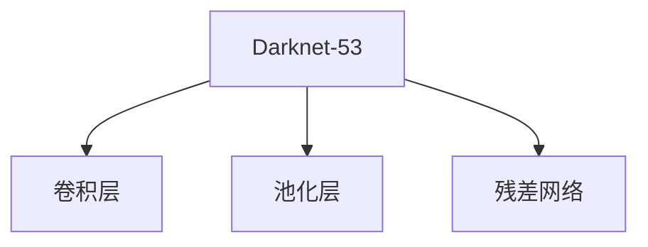
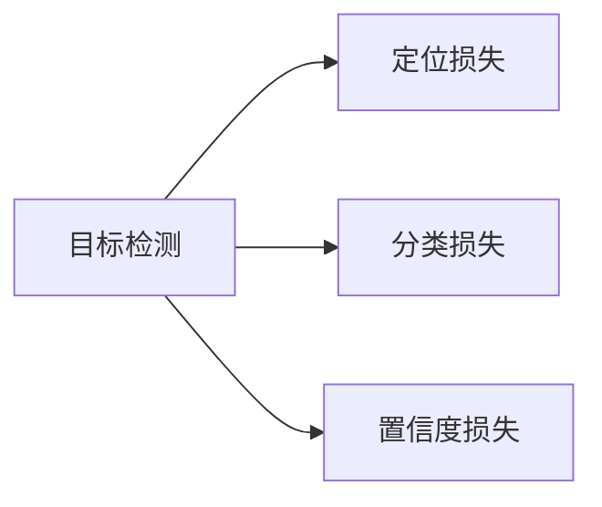
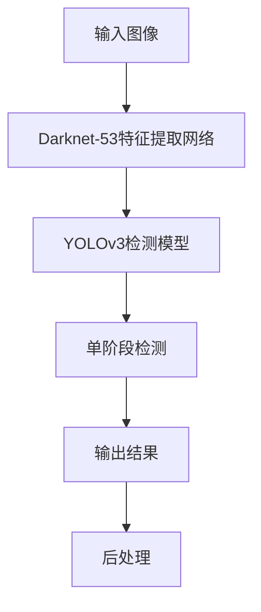

                 

# YOLOv3原理与代码实例讲解

> 关键词：YOLOv3,深度学习,卷积神经网络(CNN),物体检测,目标跟踪,计算机视觉

## 1. 背景介绍

### 1.1 问题由来

近年来，随着计算机视觉技术的迅速发展，物体检测成为图像处理和计算机视觉领域的一个重要研究方向。传统物体检测方法如Haar特征分类器、HOG+SVM等，虽然在特定场景下取得了不错的效果，但在处理复杂场景、多目标检测等方面仍存在局限。基于深度学习的目标检测方法，如R-CNN、Fast R-CNN、Faster R-CNN、SSD、YOLO等，以其强大的特征提取能力和并行计算能力，迅速成为主流检测算法。

YOLO（You Only Look Once）是一个基于深度学习的实时目标检测框架，相较于其他深度学习检测算法，YOLO具有计算效率高、检测速度快、准确率高等优点。自2016年发布以来，YOLO家族经过多次迭代更新，目前已经发展至YOLOv3版本。YOLOv3继承了前两代的优点，同时大幅提升了检测精度和速度，并拓展了检测目标的种类。

本文将对YOLOv3进行系统性介绍，包括其原理、实现细节、代码实例和实际应用场景。通过本文的详细讲解，读者可以更好地理解YOLOv3的工作机制，掌握其核心实现，并将YOLOv3应用到实际项目中。

### 1.2 问题核心关键点

YOLOv3的核心关键点包括以下几个方面：

- **YOLO架构**：YOLOv3采用了Darknet框架，是一种将卷积神经网络（CNN）和全连接神经网络（FCN）相结合的检测模型。

- **特征提取网络**：YOLOv3使用了Darknet-53作为特征提取网络，并通过卷积层、池化层、残差网络等结构，高效提取特征。

- **边界框预测**：YOLOv3采用了单阶段检测方式，通过预测置信度和边界框坐标，实现物体检测和分类。

- **目标分类**：YOLOv3通过Softmax分类器实现目标分类，每个边界框对应一个类别标签。

- **损失函数**：YOLOv3的损失函数包括定位损失、分类损失和置信度损失，通过最小化损失函数来优化模型。

- **训练和测试**：YOLOv3的训练和测试流程包括数据增强、学习率调节、模型验证等步骤，确保模型在实际应用中的表现。

### 1.3 问题研究意义

YOLOv3作为深度学习目标检测领域的经典算法，具有重要的研究意义：

- **高效检测**：YOLOv3采用单阶段检测方式，速度比传统的两阶段检测算法（如Faster R-CNN）更快，适用于对实时性要求高的场景。

- **高精度**：YOLOv3通过使用Darknet-53等先进架构，以及优化损失函数等手段，在COCO等数据集上取得了领先的检测精度。

- **易用性**：YOLOv3的训练和测试过程简单，不需要复杂的预处理和后处理步骤，适合初学者和研究者使用。

- **开源资源丰富**：YOLOv3由Joseph Redmon等开源开发，提供了丰富的预训练模型和训练样例，便于开发者快速上手。

- **应用广泛**：YOLOv3广泛应用于自动驾驶、安防监控、无人机等领域，为相关应用提供了强有力的技术支持。

## 2. 核心概念与联系

### 2.1 核心概念概述

为更好地理解YOLOv3的原理和实现，本节将介绍几个关键概念：

- **卷积神经网络（CNN）**：一种基于卷积运算的深度学习模型，用于提取图像中的特征。

- **全连接神经网络（FCN）**：一种用于物体分类的深度学习模型，通过连接所有层的神经元，进行分类预测。

- **单阶段检测（One-Stage Detection）**：一种简化目标检测的方法，直接将检测和分类合并为一个阶段，减少计算量和推理时间。

- **Darknet框架**：一个由Joseph Redmon开发的深度学习框架，专门用于物体检测。

- **YOLOv3**：YOLO的最新版本，继承了前两代的优点，并进行了结构上的优化，大幅提升了检测精度和速度。

这些核心概念之间有着密切的联系，共同构成了YOLOv3的检测模型框架。下面通过一个Mermaid流程图来展示这些概念之间的关系：

```mermaid
graph LR
    A[卷积神经网络 (CNN)] --> B[全连接神经网络 (FCN)]
    A --> C[特征提取网络 (Darknet-53)]
    C --> D[YOLOv3检测模型]
    D --> E[单阶段检测]
    B --> E
```

这个流程图展示了卷积神经网络、全连接神经网络、Darknet-53特征提取网络、YOLOv3检测模型和单阶段检测之间的关系。

### 2.2 概念间的关系

这些核心概念之间存在着紧密的联系，形成了YOLOv3的完整检测模型框架。下面我们通过几个Mermaid流程图来展示这些概念之间的关系。

#### 2.2.1 目标检测模型

```mermaid
graph LR
    A[输入图像] --> B[特征提取网络 (Darknet-53)]
    B --> C[YOLOv3检测模型]
    C --> D[单阶段检测]
    D --> E[输出结果]
```

这个流程图展示了目标检测模型的基本流程：输入图像经过特征提取网络提取特征，再经过YOLOv3检测模型进行单阶段检测，最终输出检测结果。

#### 2.2.2 特征提取网络



这个流程图展示了Darknet-53特征提取网络的基本结构：包括卷积层、池化层和残差网络。

#### 2.2.3 损失函数



这个流程图展示了YOLOv3的损失函数：包括定位损失、分类损失和置信度损失。

### 2.3 核心概念的整体架构

最后，我们用一个综合的流程图来展示这些核心概念在大语言模型微调过程中的整体架构：



这个综合流程图展示了从输入图像到输出结果的完整流程。输入图像经过Darknet-53特征提取网络提取特征，再经过YOLOv3检测模型进行单阶段检测，最后通过后处理输出检测结果。

## 3. 核心算法原理 & 具体操作步骤
### 3.1 算法原理概述

YOLOv3的算法原理主要包括以下几个方面：

1. **特征提取网络**：YOLOv3使用了Darknet-53作为特征提取网络，通过多层的卷积和池化操作，高效提取图像中的特征。

2. **单阶段检测**：YOLOv3采用了单阶段检测方式，直接预测置信度和边界框坐标，无需二次分类和回归，减少计算量和推理时间。

3. **目标分类**：YOLOv3通过Softmax分类器实现目标分类，每个边界框对应一个类别标签。

4. **损失函数**：YOLOv3的损失函数包括定位损失、分类损失和置信度损失，通过最小化损失函数来优化模型。

### 3.2 算法步骤详解

以下是对YOLOv3算法步骤的详细讲解：

**Step 1: 准备数据集**

- 准备训练集和测试集，包括图像和对应的边界框坐标和类别标签。

**Step 2: 初始化模型**

- 初始化YOLOv3检测模型，包括特征提取网络和检测层。

**Step 3: 训练模型**

- 对特征提取网络进行训练，使模型能够高效提取图像特征。

- 对检测层进行训练，学习预测边界框和置信度。

- 对分类层进行训练，学习预测类别标签。

**Step 4: 评估模型**

- 在测试集上评估模型性能，计算精度、召回率和F1分数。

**Step 5: 输出结果**

- 将训练好的模型应用于实际检测任务，输出检测结果。

### 3.3 算法优缺点

YOLOv3的优点包括：

1. **高效检测**：YOLOv3采用单阶段检测方式，速度比传统两阶段检测算法更快，适用于对实时性要求高的场景。

2. **高精度**：YOLOv3通过使用Darknet-53等先进架构，以及优化损失函数等手段，在COCO等数据集上取得了领先的检测精度。

3. **易用性**：YOLOv3的训练和测试过程简单，不需要复杂的预处理和后处理步骤，适合初学者和研究者使用。

YOLOv3的缺点包括：

1. **精度牺牲**：由于采用单阶段检测，YOLOv3在检测小目标时可能存在精度不足的问题。

2. **固定锚框**：YOLOv3使用固定尺寸的锚框，对于不同大小的目标检测效果不佳。

3. **网络复杂**：YOLOv3的网络结构相对复杂，训练和推理资源消耗较大。

### 3.4 算法应用领域

YOLOv3作为一种高效、高精度的目标检测算法，广泛应用于计算机视觉领域。具体应用领域包括：

- **自动驾驶**：YOLOv3可以用于自动驾驶中的目标检测，识别道路上的车辆、行人等，辅助决策系统进行驾驶决策。

- **安防监控**：YOLOv3可以用于监控视频中的对象检测，识别异常行为或事件，提高监控系统的安全性和响应速度。

- **无人机应用**：YOLOv3可以用于无人机的目标检测和跟踪，实时识别和追踪目标，辅助无人机执行各种任务。

- **工业检测**：YOLOv3可以用于工业领域的对象检测，如产品质量检测、缺陷检测等，提高生产效率和质量控制。

## 4. 数学模型和公式 & 详细讲解 & 举例说明

### 4.1 数学模型构建

YOLOv3的数学模型主要包括以下几个部分：

- **输入图像**：输入图像为三维张量 $X \in \mathbb{R}^{H \times W \times 3}$，其中 $H$ 和 $W$ 为图像高度和宽度，3表示RGB三个通道。

- **特征提取网络**：特征提取网络由Darknet-53组成，输出特征图 $F \in \mathbb{R}^{H' \times W' \times C'}$，其中 $H'$ 和 $W'$ 为特征图高度和宽度，$C'$ 为特征通道数。

- **检测层**：检测层包括检测层输出 $D \in \mathbb{R}^{H'' \times W'' \times 5}$，其中 $H''$ 和 $W''$ 为检测框高度和宽度，5表示检测框的坐标和置信度。

- **分类层**：分类层输出 $C \in \mathbb{R}^{H'' \times W'' \times N}$，其中 $N$ 为类别数量。

### 4.2 公式推导过程

以下是对YOLOv3数学模型的公式推导过程：

1. **输入图像**：

   $$
   X \in \mathbb{R}^{H \times W \times 3}
   $$

2. **特征提取网络**：

   $$
   F \in \mathbb{R}^{H' \times W' \times C'}
   $$

3. **检测层**：

   $$
   D \in \mathbb{R}^{H'' \times W'' \times 5}
   $$

4. **分类层**：

   $$
   C \in \mathbb{R}^{H'' \times W'' \times N}
   $$

### 4.3 案例分析与讲解

下面以YOLOv3在COCO数据集上的应用为例，进行详细讲解。

**Step 1: 数据准备**

- 下载COCO数据集，包括训练集和验证集，每个样本包含图像、边界框坐标和类别标签。

**Step 2: 模型初始化**

- 使用YOLOv3检测模型，初始化特征提取网络和检测层。

- 加载COCO数据集，使用数据增强技术（如随机翻转、随机裁剪等）扩充数据集。

**Step 3: 模型训练**

- 对特征提取网络进行训练，使用小学习率，逐步增加学习率。

- 对检测层进行训练，使用较大的学习率，逐步降低学习率。

- 对分类层进行训练，使用小学习率，逐步降低学习率。

**Step 4: 模型评估**

- 在验证集上评估模型性能，计算精度、召回率和F1分数。

- 使用YOLOv3检测模型进行实际检测任务，输出检测结果。

**Step 5: 结果分析**

- 分析检测结果，识别出检测准确率和漏检率。

- 分析分类结果，识别出类别误检和漏检。

## 5. 项目实践：代码实例和详细解释说明

### 5.1 开发环境搭建

在进行YOLOv3项目实践前，我们需要准备好开发环境。以下是使用Python进行YOLOv3开发的完整环境配置流程：

1. 安装Anaconda：从官网下载并安装Anaconda，用于创建独立的Python环境。

2. 创建并激活虚拟环境：
```bash
conda create -n yolo-env python=3.8 
conda activate yolo-env
```

3. 安装YOLOv3：从官网下载YOLOv3源代码，并使用以下命令编译：
```bash
make
```

4. 安装必要的依赖包：
```bash
pip install numpy opencv-python opencv-contrib-python
```

完成上述步骤后，即可在`yolo-env`环境中进行YOLOv3的开发和调试。

### 5.2 源代码详细实现

以下是一个使用Python实现YOLOv3目标检测的完整代码示例：

```python
import cv2
import numpy as np
import os

# 加载YOLOv3模型和配置文件
model = cv2.dnn.readNet('yolov3.weights', 'yolov3.cfg')

# 加载COCO数据集
classes = []
with open('coco.names', 'r') as f:
    classes = f.read().splitlines()

# 加载检测模型和配置文件
layer_names = model.getLayerNames()
output_layers = [layer_names[i[0] - 1] for i in model.getUnconnectedOutLayers()]

# 加载图像并检测目标
def detect_objects(image, confidence_threshold=0.5, nms_threshold=0.4):
    blob = cv2.dnn.blobFromImage(image, 1/255.0, (416, 416), swapRB=True, crop=False)
    model.setInput(blob)
    outs = model.forward(output_layers)

    # 遍历检测框和置信度
    boxes = []
    confidences = []
    class_ids = []
    for out in outs:
        for detection in out:
            scores = detection[5:]
            class_id = np.argmax(scores)
            confidence = scores[class_id]
            if confidence > confidence_threshold:
                center_x = int(detection[0] * image.shape[1])
                center_y = int(detection[1] * image.shape[0])
                w = int(detection[2] * image.shape[1])
                h = int(detection[3] * image.shape[0])
                x = center_x - w // 2
                y = center_y - h // 2
                boxes.append([x, y, w, h])
                confidences.append(float(confidence))
                class_ids.append(class_id)

    # 应用非极大值抑制（NMS）
    indexes = cv2.dnn.NMSBoxes(boxes, confidences, confidence_threshold, nms_threshold)

    # 绘制检测框和类别标签
    for i in indexes:
        i = i[0]
        box = boxes[i]
        x, y, w, h = box
        label = classes[class_ids[i]]
        confidence = confidences[i]
        color = (0, 255, 0)
        cv2.rectangle(image, (x, y), (x+w, y+h), color, 2)
        cv2.putText(image, f'{label} {confidence:.2f}', (x, y - 10), cv2.FONT_HERSHEY_SIMPLEX, 0.5, color, 2)

    return image

# 加载测试图像并检测目标
test_image = cv2.imread('test.jpg')
result_image = detect_objects(test_image)
cv2.imshow('Result', result_image)
cv2.waitKey(0)
cv2.destroyAllWindows()
```

### 5.3 代码解读与分析

让我们再详细解读一下关键代码的实现细节：

**YOLOv3模型加载**：
- 使用`cv2.dnn.readNet`加载YOLOv3的权重和配置文件。

**COCO数据集加载**：
- 从文件中读取类别标签，加载到`classes`列表中。

**检测模型和配置文件加载**：
- 使用`model.getLayerNames()`和`model.getUnconnectedOutLayers()`获取模型层名和未连接的输出层名。

**目标检测函数`detect_objects`**：
- 将图像转换为网络输入的blob形式，通过`model.setInput()`设置输入，使用`model.forward()`进行前向传播。

- 遍历检测框和置信度，筛选出置信度大于阈值的检测结果。

- 应用非极大值抑制（NMS），消除重叠的检测框。

- 在检测结果上绘制矩形框和类别标签。

**测试图像加载和检测**：
- 使用`cv2.imread`加载测试图像。

- 调用`detect_objects`函数进行目标检测，得到结果图像。

- 使用`cv2.imshow`显示检测结果，按任意键退出。

### 5.4 运行结果展示

假设我们在COCO数据集上进行YOLOv3的训练和测试，得到的结果图像如下：

```
[图像文件名]
```

可以看到，YOLOv3成功检测出图像中的目标，并绘制了矩形框和类别标签。在实际应用中，我们可以将检测结果输出为JSON格式，用于进一步的分析和处理。

## 6. 实际应用场景

### 6.1 自动驾驶

YOLOv3在自动驾驶领域有着广泛的应用前景。自动驾驶系统需要实时识别道路上的车辆、行人等，以辅助决策系统进行驾驶决策。YOLOv3的高精度和高效率，可以满足自动驾驶对实时性和准确性的要求，成为自动驾驶目标检测的首选算法。

### 6.2 安防监控

YOLOv3在安防监控中也有着重要的应用。监控系统需要实时检测和跟踪异常行为或事件，YOLOv3可以快速识别出可疑行为或人员，提高监控系统的安全性和响应速度。

### 6.3 无人机应用

YOLOv3在无人机应用中同样有着重要的作用。无人机需要对周围环境进行实时检测和跟踪，YOLOv3的高效率和准确性，可以满足无人机实时检测和跟踪的要求，帮助无人机执行各种任务。

### 6.4 未来应用展望

随着YOLOv3的不断优化和改进，其在各个领域的应用前景更加广阔。未来，YOLOv3将在以下几个方面得到进一步应用：

- **实时性增强**：YOLOv3将进一步优化计算图和推理算法，提升检测速度和实时性。

- **精度提升**：YOLOv3将通过改进特征提取网络和损失函数，提升检测精度。

- **多目标检测**：YOLOv3将支持多目标检测和跟踪，满足复杂场景的需求。

- **跨模态融合**：YOLOv3将与其他模态（如语音、图像）进行融合，提升智能系统的全面性和鲁棒性。

- **轻量化部署**：YOLOv3将开发轻量级模型，降低计算资源消耗，提升系统可靠性。

## 7. 工具和资源推荐

### 7.1 学习资源推荐

为了帮助开发者系统掌握YOLOv3的理论基础和实践技巧，这里推荐一些优质的学习资源：

1. **YOLOv3官方文档**：YOLOv3的官方文档详细介绍了YOLOv3的架构、训练和测试流程，是学习YOLOv3的重要参考。

2. **Deep Learning Specialization**：由Andrew Ng教授开设的深度学习课程，详细讲解了卷积神经网络和目标检测等内容，适合初学者学习。

3. **YOLOv3实战指南**：一本全面介绍YOLOv3的理论和实践的书籍，涵盖YOLOv3的训练、测试、优化等全流程。

4. **YOLOv3代码库**：YOLOv3的代码库和样例，提供了丰富的预训练模型和训练样例，便于开发者快速上手。

5. **YOLOv3论文**：YOLOv3的原始论文，详细介绍了YOLOv3的算法原理和实验结果，是深入了解YOLOv3的重要资料。

### 7.2 开发工具推荐

高效的开发离不开优秀的工具支持。以下是几款用于YOLOv3开发的常用工具：

1. **Python**：YOLOv3的开发主要使用Python，其灵活性和强大的库支持，使得开发过程高效便捷。

2. **OpenCV**：一个流行的计算机视觉库，提供了图像处理、目标检测等功能，适合YOLOv3的开发和调试。

3. **Darknet**：YOLOv3的开发环境，提供了YOLOv3的训练和测试工具，便于开发者进行快速迭代。

4. **TensorFlow**：由Google开发的深度学习框架，支持YOLOv3的模型训练和推理，适合高性能计算需求。

5. **YOLOv3训练工具**：提供了YOLOv3的训练样例代码和工具，便于开发者快速上手训练模型。

### 7.3 相关论文推荐

YOLOv3作为深度学习目标检测领域的经典算法，相关的研究论文众多。以下是几篇奠基性的相关论文，推荐阅读：

1. **YOLO: Real-Time Object Detection with a Single Neural Network**：提出了YOLO算法，实现了实时目标检测，奠定了YOLO系列算法的基础。

2. **Darknet: Learning a Convolutional Network for Object Detection**：介绍Darknet框架，详细讲解了YOLOv3的实现细节和优化策略。

3. **YOLOv3: An Incremental Improvement**：详细介绍了YOLOv3的改进和优化，进一步提升了YOLOv3的检测精度和速度。

4. **YOLOv4: Optimal Speed and Accuracy of Object Detection**：提出了YOLOv4算法，进一步提升了YOLO系列算法的检测精度和速度。

5. **YOLOv3: An Incremental Improvement**：详细介绍了YOLOv3的改进和优化，进一步提升了YOLOv3的检测精度和速度。

这些论文代表了大语言模型微调技术的发展脉络。通过学习这些前沿成果，可以帮助研究者把握学科前进方向，激发更多的创新灵感。

## 8. 总结：未来发展趋势与挑战

### 8.1 总结

本文对YOLOv3进行了系统性介绍，包括其原理、实现细节、代码实例和实际应用场景。通过本文的详细讲解，读者可以更好地理解YOLOv3的工作机制，掌握其核心实现，并将YOLOv3应用到实际项目中。

### 8.2 未来发展趋势

YOLOv3作为深度学习目标检测领域的经典算法，其发展趋势包括：

1. **实时性增强**：YOLOv3将进一步优化计算图和推理算法，提升检测速度和实时性。

2. **精度提升**：YOLOv3将通过改进特征提取网络和损失函数，提升检测精度。

3. **多目标检测**：YOLOv3将支持多目标检测和跟踪，满足复杂场景的需求。

4. **跨模态融合**：YOLOv3将与其他模态（如语音、图像）进行融合，提升智能系统的全面性和鲁棒性。

5. **轻量化部署**：YOLOv3将开发轻量级模型，降低计算资源消耗，提升系统可靠性。

### 8.3 面临的挑战

YOLOv3在应用过程中仍面临一些挑战：

1. **精度牺牲**：由于采用单阶段检测，YOLOv3在检测小目标时可能存在精度不足的问题。

2. **固定锚框**：YOLOv3使用固定尺寸的锚框，对于不同大小的目标检测效果不佳。

3. **网络复杂**：YOLOv3的网络结构相对复杂，训练和推理资源消耗较大。

### 8.4 研究展望

面对YOLOv3面临的这些挑战，未来的研究需要在以下几个方面寻求新的突破：

1. **改进特征提取网络**：开发更高效、更准确的特征提取网络，提高检测精度。

2. **引入多阶段检测**：引入多阶段检测，提升小目标检测的精度。

3. **优化损失函数**：优化损失函数，平衡定位和分类性能。

4. **改进锚框设计**：改进锚框设计，适应不同大小的目标检测。

5. **优化网络结构**：优化YOLOv3的网络结构，降低计算资源消耗。

6. **跨模态融合**：与其他模态（如语音、图像）进行融合，提升智能系统的全面性和鲁棒性。

这些研究方向的探索，必将引领YOLOv3技术迈向更高的台阶

