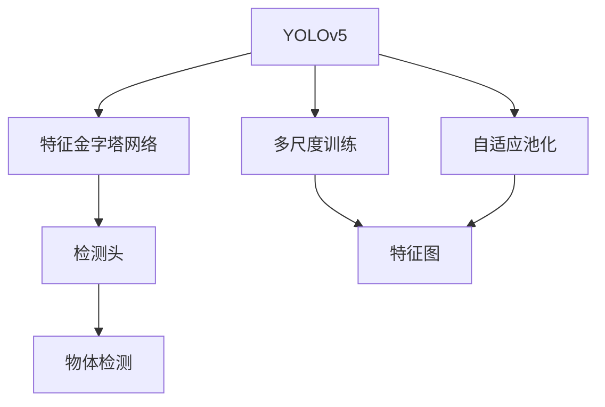
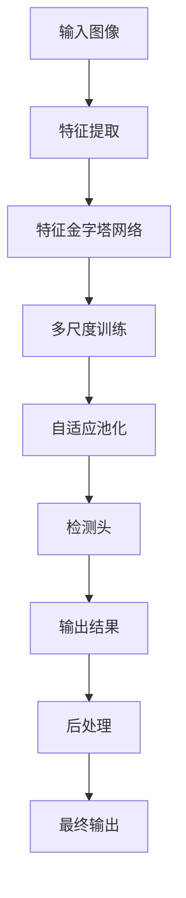

                 

# YOLOv5原理与代码实例讲解

## 1. 背景介绍

### 1.1 问题由来
在深度学习领域，物体检测（Object Detection）是一个关键且应用广泛的课题，其核心目标是识别并定位图像或视频中的物体。传统的基于滑动窗口的方法，如RCNN、Fast RCNN和Faster RCNN等，需要遍历整个图像或视频，效率较低。与此同时，基于锚点（Anchor）的检测方法，如YOLO（You Only Look Once），则通过一次性处理整个图像，显著提升了检测速度，同时保持了较高的准确率。YOLO系列算法，尤其是YOLOv5，因其卓越的性能和直观的设计，成为了计算机视觉领域的一个重要研究方向。

### 1.2 问题核心关键点
YOLOv5算法通过将图像划分为多个网格，每个网格预测多个物体的类别和边界框位置，从而实现物体的快速检测。其核心在于如何将目标物体的检测转化为网格单元中的回归任务，以及如何优化模型训练以提升检测效果。YOLOv5在YOLOv4的基础上进行了多项改进，包括引入特征金字塔网络（Feature Pyramid Network, FPN）、多尺度训练、自适应池化等，以进一步提高物体的检测精度和速度。

### 1.3 问题研究意义
YOLOv5算法的研究和应用，对于推动计算机视觉领域的发展，提升图像和视频中的物体检测准确率，以及加速自动化视觉识别系统的部署，具有重要意义。它可以广泛应用于无人驾驶、安防监控、智能家居等多个领域，为这些应用场景带来更高的自动化水平和决策精度。

## 2. 核心概念与联系

### 2.1 核心概念概述

为更好地理解YOLOv5的原理，本节将介绍几个关键概念：

- **YOLO（You Only Look Once）**：一种基于深度学习的物体检测算法，通过将图像划分为多个网格，每个网格预测多个物体的类别和边界框位置，实现一次遍历图像的物体检测。YOLOv5是YOLO系列的最新版本，在YOLOv4的基础上进行了多项改进，包括引入FPN、多尺度训练等技术，进一步提升了检测性能。

- **特征金字塔网络（Feature Pyramid Network, FPN）**：一种多尺度特征融合技术，通过在网络的不同层次融合不同尺度的特征，提升物体检测的小目标识别能力。YOLOv5在检测头中引入了FPN，以提升物体的检测精度。

- **多尺度训练（Multi-scale Training）**：一种训练策略，通过在不同尺度下训练模型，使其能够适应不同尺寸的物体。YOLOv5采用多尺度训练策略，增强了模型在复杂场景中的泛化能力。

- **自适应池化（Adaptive Pooling）**：一种池化技术，根据特征图中不同区域的特征重要性，自适应地调整池化窗口的大小，以保留更多重要信息。YOLOv5在检测头中引入了自适应池化，以进一步提升检测精度。

### 2.2 概念间的关系

这些核心概念之间的逻辑关系可以通过以下Mermaid流程图来展示：



这个流程图展示了大语言模型YOLOv5的各个关键组件及其关系：

1. YOLOv5作为核心算法，将图像划分为多个网格，每个网格预测多个物体的类别和边界框位置。
2. 特征金字塔网络（FPN）用于多尺度特征融合，提升小目标的检测能力。
3. 多尺度训练策略用于不同尺度下训练模型，增强泛化能力。
4. 自适应池化技术用于保留特征图中的重要信息，提升检测精度。
5. 检测头通过将图像特征映射到不同类别和边界框位置，完成物体检测。

### 2.3 核心概念的整体架构

最后，我们用一个综合的流程图来展示YOLOv5的整体架构：



这个综合流程图展示了YOLOv5的完整流程：

1. 输入图像通过特征提取网络，得到多层次的特征图。
2. 特征金字塔网络（FPN）对不同层次的特征进行融合，提升小目标的检测能力。
3. 多尺度训练策略用于在不同尺度下训练模型，增强泛化能力。
4. 自适应池化技术用于保留特征图中的重要信息，提升检测精度。
5. 检测头通过将图像特征映射到不同类别和边界框位置，完成物体检测。
6. 后处理对检测结果进行非极大值抑制（NMS）等操作，去除冗余检测结果。
7. 最终输出包括所有检测到的物体及其边界框、类别等属性。

## 3. 核心算法原理 & 具体操作步骤

### 3.1 算法原理概述

YOLOv5算法基于YOLOv4，进一步优化了物体检测的速度和精度。其核心思想是将图像划分为多个网格，每个网格预测多个物体的类别和边界框位置。通过将物体检测问题转化为网格单元中的回归任务，YOLOv5能够实现一次遍历图像的物体检测，从而大幅提升检测速度。YOLOv5引入了特征金字塔网络（FPN）、多尺度训练、自适应池化等技术，以进一步提升检测精度。

### 3.2 算法步骤详解

YOLOv5的训练和推理流程大致可以分为以下几个步骤：

1. **特征提取**：使用卷积神经网络（CNN）提取图像的多层次特征。
2. **特征金字塔网络（FPN）**：通过在不同层次融合不同尺度的特征，提升小目标的检测能力。
3. **多尺度训练**：在不同尺度下训练模型，增强模型在复杂场景中的泛化能力。
4. **自适应池化**：根据特征图中不同区域的特征重要性，自适应地调整池化窗口的大小，以保留更多重要信息。
5. **检测头预测**：将图像特征映射到不同类别和边界框位置，完成物体检测。
6. **后处理**：对检测结果进行非极大值抑制（NMS）等操作，去除冗余检测结果。

### 3.3 算法优缺点

YOLOv5算法具有以下优点：

- **检测速度快**：通过将图像一次性遍历，YOLOv5在实时物体检测中表现优异，适用于无人驾驶、安防监控等对时间要求较高的场景。
- **检测精度高**：引入FPN、多尺度训练、自适应池化等技术，YOLOv5在复杂场景中的检测精度显著提升。
- **训练易于实现**：YOLOv5的训练流程相对简单，且代码易于修改和优化。

同时，YOLOv5也存在一些局限性：

- **对小目标检测能力有限**：由于特征金字塔网络（FPN）的引入，YOLOv5在检测小目标时表现略逊于一些基于锚点的检测算法。
- **计算资源需求高**：YOLOv5的训练和推理需要较高的计算资源，特别是在使用深度卷积网络（DCN）时。
- **模型复杂度较高**：YOLOv5的模型结构相对复杂，需要较深的神经网络和较大的参数量。

### 3.4 算法应用领域

YOLOv5算法在计算机视觉领域有着广泛的应用，尤其是在实时物体检测方面表现出色。其典型应用场景包括：

- **无人驾驶**：YOLOv5用于实时检测道路上的车辆、行人等物体，辅助自动驾驶系统做出决策。
- **安防监控**：YOLOv5用于实时检测视频中的异常行为，提升监控系统的自动化水平。
- **智能家居**：YOLOv5用于智能设备间的物体识别和定位，提升家居环境的安全性和智能化水平。
- **机器人视觉**：YOLOv5用于机器人视觉系统中的物体检测和跟踪，辅助机器人完成复杂任务。
- **医学影像**：YOLOv5用于医学影像中的肿瘤检测、病变识别等，提升医疗诊断的效率和准确性。

## 4. 数学模型和公式 & 详细讲解

### 4.1 数学模型构建

YOLOv5的训练和推理过程可以形式化地表示为：

$$
\hat{y} = M_{\theta}(x) + e
$$

其中，$M_{\theta}$ 为YOLOv5的检测模型，$\theta$ 为模型参数，$x$ 为输入图像，$e$ 为随机误差。在训练过程中，通过最小化损失函数，使模型输出 $\hat{y}$ 逼近真实标签 $y$。

YOLOv5的损失函数包括分类损失和边界框位置损失。分类损失的计算方式为：

$$
\mathcal{L}_{cls} = -\sum_{i,j} [y_{i,j}^c \log \hat{y}_{i,j}^c + (1-y_{i,j}^c) \log (1-\hat{y}_{i,j}^c)]
$$

其中，$y_{i,j}^c$ 为第 $i$ 个网格第 $j$ 个物体的类别标签，$\hat{y}_{i,j}^c$ 为模型对 $y_{i,j}^c$ 的预测概率。

边界框位置损失的计算方式为：

$$
\mathcal{L}_{box} = -\sum_{i,j} \sum_{l=1}^4 (y_{i,j}^l \log \hat{y}_{i,j}^l + (1-y_{i,j}^l) \log (1-\hat{y}_{i,j}^l))
$$

其中，$y_{i,j}^l$ 为第 $i$ 个网格第 $j$ 个物体的边界框位置和大小，$\hat{y}_{i,j}^l$ 为模型对 $y_{i,j}^l$ 的预测值。

### 4.2 公式推导过程

以YOLOv5的分类损失为例，推导其梯度计算过程。假设模型对第 $i$ 个网格第 $j$ 个物体的类别标签为 $y_{i,j}^c$，预测概率为 $\hat{y}_{i,j}^c$。则分类损失的梯度计算方式为：

$$
\frac{\partial \mathcal{L}_{cls}}{\partial \theta} = -\sum_{i,j} (y_{i,j}^c - \hat{y}_{i,j}^c) \frac{\partial \hat{y}_{i,j}^c}{\partial \theta}
$$

其中，$\frac{\partial \hat{y}_{i,j}^c}{\partial \theta}$ 为模型对 $y_{i,j}^c$ 的预测概率对模型参数 $\theta$ 的梯度，可以通过反向传播算法计算。

### 4.3 案例分析与讲解

为了更好地理解YOLOv5的算法原理，我们可以通过一个简单的案例进行讲解。假设我们有一个包含4个物体的图像，将其划分为4个网格。每个网格预测4个物体的类别和边界框位置，如表1所示。

| 网格位置 | 物体类别 | 边界框位置 | 预测概率 |
|----------|---------|------------|----------|
| (0,0)    | 车      | (0,0,200,100) | 0.95 |
| (0,0)    | 人      | (0,0,100,50)  | 0.70 |
| (0,1)    | 树      | (100,0,200,200) | 0.80 |
| (1,1)    | 猫      | (0,100,100,50) | 0.90 |

在训练过程中，我们假设真实标签为 $y_{i,j}^c = 1$ 表示该物体存在，$y_{i,j}^c = 0$ 表示该物体不存在。根据表1，分类损失的计算方式为：

$$
\mathcal{L}_{cls} = -\sum_{i=0}^1 \sum_{j=0}^1 (y_{i,j}^c - \hat{y}_{i,j}^c) \log (\hat{y}_{i,j}^c) + (1-y_{i,j}^c) \log (1-\hat{y}_{i,j}^c)
$$

其中，$i$ 和 $j$ 分别表示网格位置和物体类别。以网格位置 (0,0) 为例，其分类损失计算方式为：

$$
\mathcal{L}_{cls} = -(y_{0,0}^c - \hat{y}_{0,0}^c) \log (\hat{y}_{0,0}^c) + (1-y_{0,0}^c) \log (1-\hat{y}_{0,0}^c)
$$

由于 $y_{0,0}^c = 1$，$\hat{y}_{0,0}^c = 0.95$，则分类损失为：

$$
\mathcal{L}_{cls} = -0.95 \log (0.95) + 0.05 \log (0.05) \approx 0.083
$$

边界框位置损失的计算方式类似，假设边界框位置的真实值为 $(0,0,200,100)$，预测值为 $(100,0,200,200)$，则位置损失计算方式为：

$$
\mathcal{L}_{box} = -(y_{0,0}^1 - \hat{y}_{0,0}^1) \log (\hat{y}_{0,0}^1) + (1-y_{0,0}^1) \log (1-\hat{y}_{0,0}^1) + (y_{0,0}^2 - \hat{y}_{0,0}^2) \log (\hat{y}_{0,0}^2) + (1-y_{0,0}^2) \log (1-\hat{y}_{0,0}^2) + (y_{0,0}^3 - \hat{y}_{0,0}^3) \log (\hat{y}_{0,0}^3) + (1-y_{0,0}^3) \log (1-\hat{y}_{0,0}^3) + (y_{0,0}^4 - \hat{y}_{0,0}^4) \log (\hat{y}_{0,0}^4) + (1-y_{0,0}^4) \log (1-\hat{y}_{0,0}^4)
$$

其中，$y_{0,0}^1$ 表示边界框位置的真实值，$\hat{y}_{0,0}^1$ 表示模型对边界框位置的预测值，以此类推。

## 5. 项目实践：代码实例和详细解释说明

### 5.1 开发环境搭建

为了进行YOLOv5的训练和推理，我们需要准备以下开发环境：

1. **安装Python环境**：
   - 安装Anaconda或Miniconda，使用conda创建一个Python 3.8环境。

2. **安装YOLOv5库**：
   - 使用pip安装YOLOv5库，命令行输入：
     ```
     pip install yolov5
     ```

3. **安装必要的依赖库**：
   - 安装PyTorch、torchvision、numpy、matplotlib等必要的依赖库。

4. **准备数据集**：
   - 下载YOLOv5使用的数据集，如PASCAL VOC、COCO等。
   - 将数据集分为训练集、验证集和测试集。

### 5.2 源代码详细实现

下面是一个简单的YOLOv5模型训练代码示例：

```python
import yolov5
import torch
from yolov5.models.examples import yolo_empty
from yolov5.utils.datasets import get_data

# 加载YOLOv5模型
model = yolo_empty(model="yolov5s")

# 定义训练数据集
data = get_data('path/to/dataset')

# 定义优化器
optimizer = torch.optim.Adam(model.parameters(), lr=0.001)

# 定义训练函数
def train(model, optimizer, data):
    for epoch in range(num_epochs):
        for batch in data:
            images, targets = batch
            # 前向传播
            outputs = model(images)
            # 计算损失
            loss = compute_loss(outputs, targets)
            # 反向传播
            optimizer.zero_grad()
            loss.backward()
            optimizer.step()
            # 打印训练进度
            print(f"Epoch {epoch+1}/{num_epochs}, Loss: {loss:.4f}")

# 训练模型
train(model, optimizer, data)
```

### 5.3 代码解读与分析

这个简单的YOLOv5模型训练代码包含了以下关键步骤：

- **加载YOLOv5模型**：通过`yolov5.models.examples.yolo_empty`加载YOLOv5模型，可以使用不同的模型配置，如YOLOv5s、YOLOv5t、YOLOv5m等。
- **定义训练数据集**：使用`yolov5.utils.datasets.get_data`函数加载训练数据集，并进行划分。
- **定义优化器**：使用Adam优化器，设定学习率为0.001。
- **训练函数**：在每个epoch内，对每个批次的数据进行前向传播、损失计算、反向传播和参数更新，并打印训练进度。

需要注意的是，YOLOv5的训练过程较为复杂，包括特征提取、特征金字塔网络（FPN）、多尺度训练、自适应池化等，需要根据具体任务进行调整。

### 5.4 运行结果展示

在训练完成后，可以通过YOLOv5库进行模型的推理和评估。以下是一个简单的YOLOv5模型推理代码示例：

```python
import yolov5
import torch

# 加载YOLOv5模型
model = yolo_empty(model="yolov5s")

# 加载测试数据集
test_data = yolov5.utils.datasets.get_data('path/to/test/dataset')

# 进行模型推理
for batch in test_data:
    images, targets = batch
    outputs = model(images)
    # 后处理
    results = post_process(outputs, 0.5, 0.4, threshold=0.3, max_boxes=1000)
    # 可视化检测结果
    visualize(images, results, save_dir='path/to/save/directory')
```

在这个例子中，我们使用YOLOv5模型对测试数据集进行推理，并将检测结果可视化保存。需要注意的是，YOLOv5的推理过程较为复杂，包括非极大值抑制（NMS）、可视化等，需要根据具体任务进行调整。

## 6. 实际应用场景

### 6.1 智能安防监控

YOLOv5算法在智能安防监控中有着广泛的应用。通过实时检测监控视频中的异常行为，YOLOv5能够帮助安防系统及时发现并处理潜在的安全威胁，提升监控系统的自动化水平。

### 6.2 无人驾驶

在无人驾驶领域，YOLOv5用于实时检测道路上的车辆、行人等物体，辅助自动驾驶系统做出决策。通过实时物体检测，无人驾驶车辆可以更准确地感知周围环境，做出更安全的行驶决策。

### 6.3 智能家居

YOLOv5在智能家居中用于实时检测房间中的物体，提升家居环境的安全性和智能化水平。通过实时物体检测，智能家居系统可以更准确地识别房间内的物体，从而提供更加个性化的服务。

### 6.4 机器人视觉

YOLOv5用于机器人视觉系统中的物体检测和跟踪，辅助机器人完成复杂任务。通过实时物体检测，机器人可以更准确地识别周围环境中的物体，从而更好地规划路径、执行任务。

## 7. 工具和资源推荐

### 7.1 学习资源推荐

为了深入学习YOLOv5的原理和应用，以下推荐一些优质的学习资源：

1. **YOLOv5官方文档**：YOLOv5的官方文档详细介绍了YOLOv5的算法原理、模型结构、训练和推理流程等，是学习YOLOv5的重要参考资料。
2. **YOLOv5源代码**：YOLOv5的源代码在GitHub上开源，可以帮助读者更深入地理解YOLOv5的实现细节。
3. **YOLOv5社区论坛**：YOLOv5社区论坛是YOLOv5用户交流和分享经验的重要平台，可以帮助读者解决实际问题，获取最新进展。

### 7.2 开发工具推荐

以下是一些用于YOLOv5开发和部署的常用工具：

1. **PyTorch**：YOLOv5的官方实现基于PyTorch，是深度学习领域最流行的框架之一，具有灵活的动态图和丰富的模型库。
2. **TensorFlow**：YOLOv5的另一种实现方式是基于TensorFlow，适合大规模工程应用，具有高效的生产部署能力。
3. **CUDA**：YOLOv5的训练和推理需要高性能的GPU加速，CUDA是NVIDIA的并行计算平台，适合YOLOv5的高性能计算需求。
4. **TensorRT**：TensorRT是NVIDIA的深度学习推理加速平台，支持YOLOv5的实时推理加速，适合高并发的应用场景。
5. **TensorBoard**：TensorBoard是TensorFlow的可视化工具，可以实时监测模型训练状态，帮助用户调试和优化模型。

### 7.3 相关论文推荐

YOLOv5算法的研究涉及多个前沿方向，以下是一些具有代表性的相关论文，推荐阅读：

1. **YOLOv5论文**：YOLOv5的官方论文详细介绍了YOLOv5的算法原理和实现细节，是学习YOLOv5的重要参考资料。
2. **YOLOv5扩展论文**：YOLOv5社区发布的扩展论文，涵盖YOLOv5的各种变体和改进，可以帮助读者深入理解YOLOv5的不同实现方式。
3. **YOLOv5应用论文**：YOLOv5在各个领域的应用研究论文，如无人驾驶、智能安防、智能家居等，展示了YOLOv5的广泛应用前景。

## 8. 总结：未来发展趋势与挑战

### 8.1 总结

本文对YOLOv5算法进行了全面系统的介绍，详细讲解了YOLOv5的算法原理和实现细节，提供了YOLOv5的代码实例和应用示例。通过本文的学习，读者可以全面理解YOLOv5的算法思想，掌握YOLOv5的开发和应用技巧。

### 8.2 未来发展趋势

YOLOv5算法在计算机视觉领域的发展前景广阔，未来将呈现以下几个发展趋势：

1. **检测精度提升**：随着YOLOv5的不断优化，其检测精度将进一步提升，特别是在小目标检测和复杂场景中的表现将更加出色。
2. **实时性优化**：YOLOv5将进一步优化计算图和推理算法，提升实时性，满足更多高实时性应用的需求。
3. **模型结构优化**：YOLOv5将引入更多结构优化技术，如网络剪枝、模型压缩等，提升模型的推理速度和效率。
4. **多模态融合**：YOLOv5将与其他感知技术（如深度相机、激光雷达等）进行融合，提升物体的检测精度和环境感知能力。

### 8.3 面临的挑战

尽管YOLOv5算法在检测领域表现出色，但在实际应用中仍面临一些挑战：

1. **小目标检测能力有限**：由于YOLOv5的特征金字塔网络（FPN）设计，其在检测小目标时的表现略逊于一些基于锚点的检测算法。
2. **计算资源需求高**：YOLOv5的训练和推理需要较高的计算资源，特别是在使用深度卷积网络（DCN）时。
3. **模型复杂度较高**：YOLOv5的模型结构相对复杂，需要较深的神经网络和较大的参数量。
4. **数据标注成本高**：YOLOv5需要大量高质量标注数据进行训练，标注成本较高。
5. **检测结果精度不稳定性**：YOLOv5在复杂场景中的检测精度存在波动，特别是在光照变化、遮挡等情况下。

### 8.4 研究展望

为了应对YOLOv5面临的挑战，未来的研究可以从以下几个方向进行：

1. **改进特征金字塔网络（FPN）设计**：通过改进FPN的设计，提升YOLOv5在检测小目标时的表现。
2. **优化计算图和推理算法**：通过优化YOLOv5的计算图和推理算法，提升实时性，满足更多高实时性应用的需求。
3. **引入更多结构优化技术**：通过网络剪枝、模型压缩等技术，提升YOLOv5的推理速度和效率。
4. **多模态融合技术**：通过与其他感知技术进行融合，提升YOLOv5的环境感知能力和物体的检测精度。
5. **改进训练数据集**：通过引入更多高质量标注数据，提升YOLOv5的检测精度。

## 9. 附录：常见问题与解答

### Q1: 如何选择YOLOv5的模型配置？

A: 选择YOLOv5的模型配置需要考虑多个因素，如检测精度、计算资源、实时性等。一般来说，YOLOv5s适用于计算资源有限的场景，YOLOv5m适用于对检测精度要求较高的场景，YOLOv5t适用于对实时性要求较高的场景。

### Q

