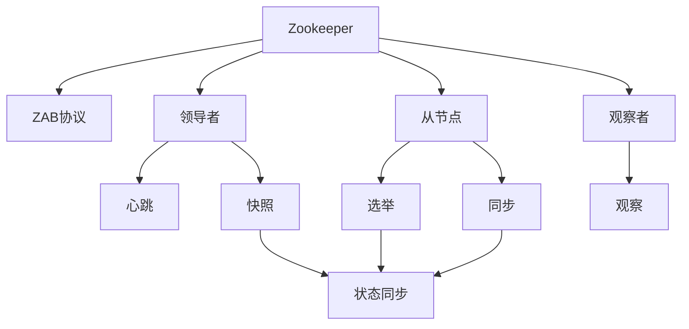
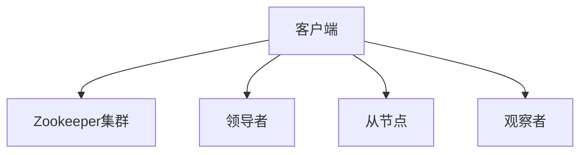
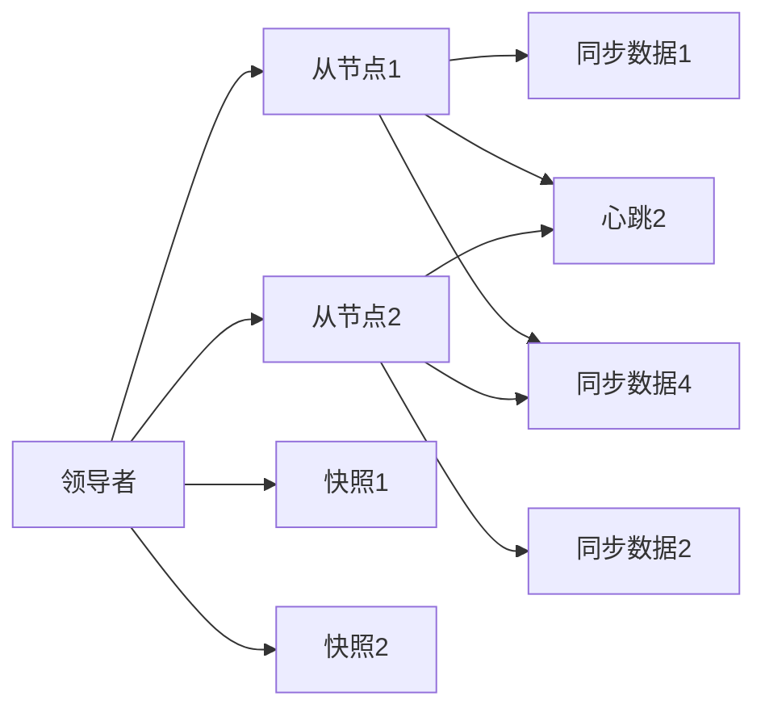
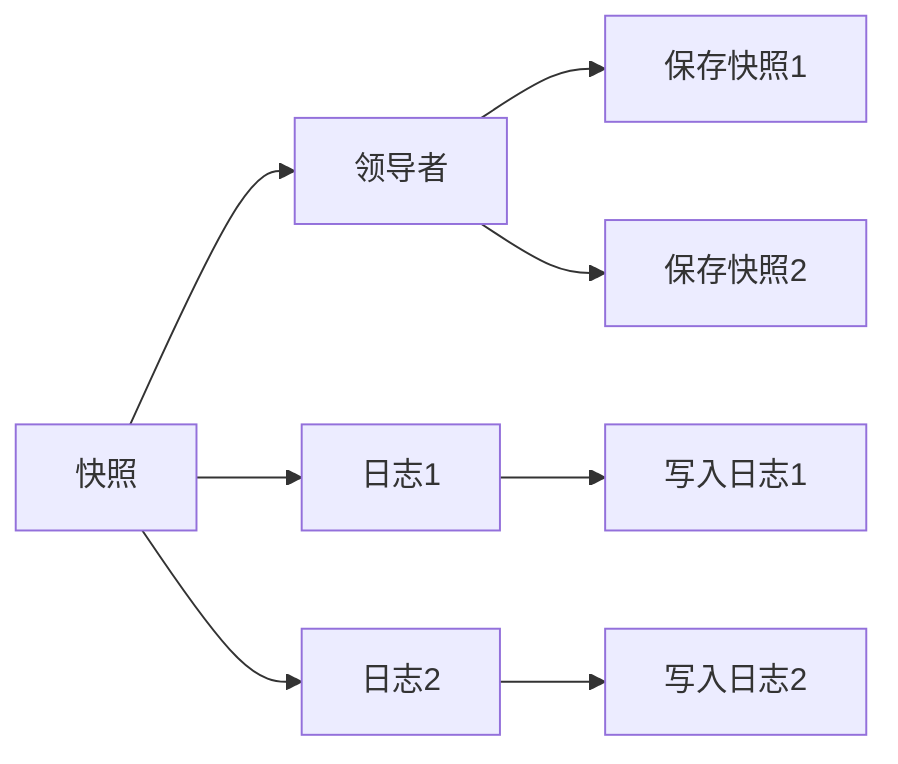
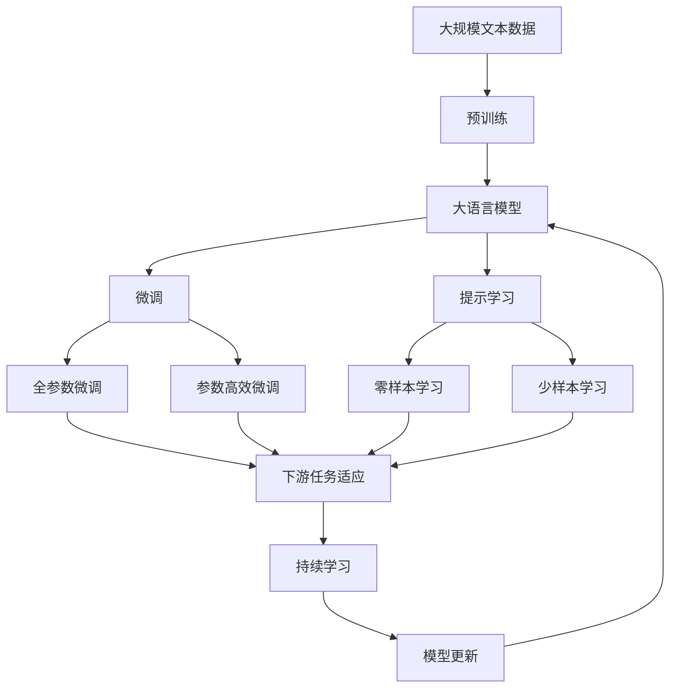
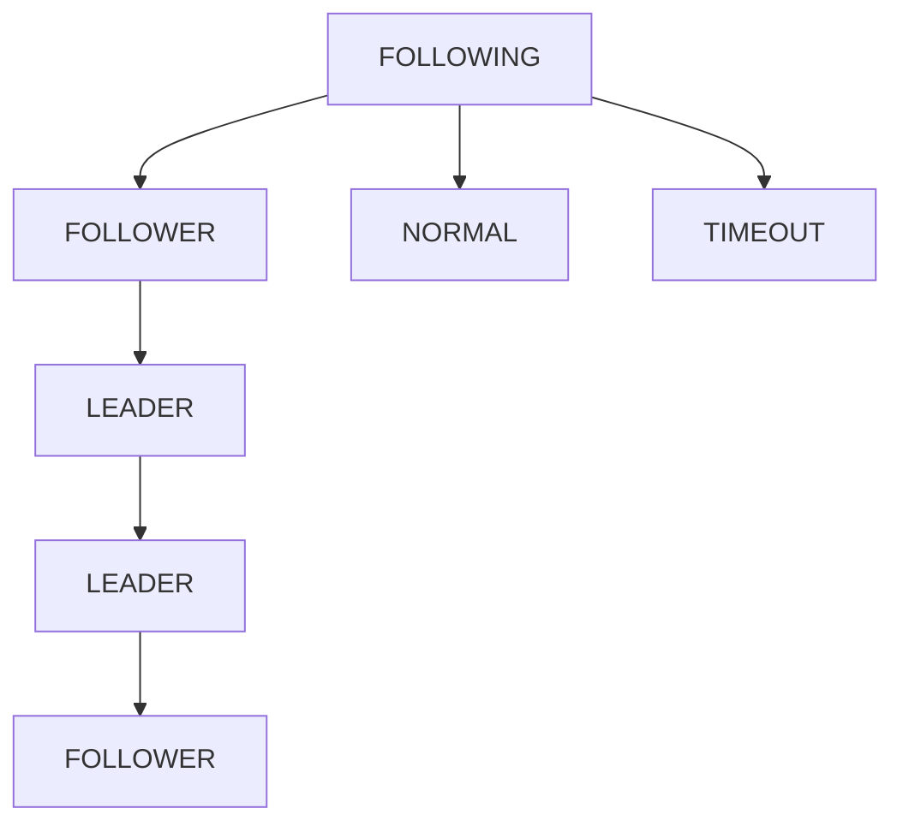

                 

# Zookeeper ZAB协议原理与代码实例讲解

> 关键词：Zookeeper, ZAB协议, 分布式锁, 故障切换, 高可用性, 数据同步, 应用案例

## 1. 背景介绍

### 1.1 问题由来

Zookeeper是一个高可用的分布式协调服务，广泛应用于大数据、云服务、微服务架构等场景。其核心特性包括集中式配置管理、服务发现、分布式锁等，支持万级别的客户端连接，支持每秒数千次的写操作。Zookeeper的这些特性背后，是其强大的ZAB(Zookeeper Atomic Broadcast)协议。ZAB协议保证了数据的高一致性和分布式系统的高可靠性。

### 1.2 问题核心关键点

ZAB协议的原理和实现是分布式系统设计中的经典案例。学习ZAB协议对于理解分布式系统的核心特性和架构设计具有重要意义。

1. **数据一致性**：ZAB协议保证分布式系统中的数据一致性，即使在网络不稳定或节点故障情况下也能保证数据不丢失且一致。
2. **高可用性**：ZAB协议能够处理节点故障和网络分区，保证系统的持续运行。
3. **状态同步**：ZAB协议能够将状态从一个节点同步到另一个节点，保持状态的一致性。
4. **高效操作**：ZAB协议的复杂度较低，能够高效处理大量客户端请求。

### 1.3 问题研究意义

理解ZAB协议的原理和实现，对于构建高可用、高可靠的系统具有重要意义。ZAB协议的原理适用于多种分布式系统，如Kubernetes、Redis Cluster等。掌握ZAB协议，可以更深入地理解分布式系统的设计思路和实现方法，为构建高可用系统提供理论基础和实践指南。

## 2. 核心概念与联系

### 2.1 核心概念概述

为更好地理解ZAB协议，本节将介绍几个密切相关的核心概念：

- **Zookeeper**：一个高可用的分布式协调服务，支持集中式配置管理、服务发现、分布式锁等核心特性。
- **ZAB协议**：Zookeeper的原子广播协议，保证数据的高一致性和分布式系统的高可靠性。
- **领导者(Leader)**：在ZAB协议中，领导者负责广播数据给所有从节点，保证数据的一致性。
- **从节点(Followers)**：从节点从领导者接收数据，并保持状态同步。
- **观察者(Observers)**：观察者不参与数据同步，仅接收领导者状态变化通知。
- **选举(Election)**：从节点在选举期间竞选为领导者，领导者通过心跳保持状态。
- **快照(Snapshot)**：领导者定期将状态保存到快照，用于恢复状态。
- **日志(Log)**：领导者维护的操作日志，保证操作的顺序性和一致性。

这些核心概念之间的逻辑关系可以通过以下Mermaid流程图来展示：



这个流程图展示了大语言模型的核心概念及其之间的关系：

1. Zookeeper通过ZAB协议实现数据同步和分布式锁等功能。
2. ZAB协议中的领导者负责广播数据，从节点负责同步数据。
3. 选举过程确保领导者合法性。
4. 快照和日志保证数据一致性和操作顺序性。
5. 观察者接收领导者状态变化通知。

### 2.2 概念间的关系

这些核心概念之间存在着紧密的联系，形成了ZAB协议的整体架构。下面我们通过几个Mermaid流程图来展示这些概念之间的关系。

#### 2.2.1 Zookeeper的核心架构



这个流程图展示了Zookeeper的架构：客户端连接到Zookeeper集群，领导者负责处理客户端请求，从节点负责同步数据。

#### 2.2.2 ZAB协议的流程



这个流程图展示了ZAB协议的基本流程：领导者向从节点同步数据，从节点接收数据并同步，领导者通过心跳维持状态，定期进行快照。

#### 2.2.3 快照和日志的保存



这个流程图展示了快照和日志的保存过程：领导者将状态保存到快照，并维护操作日志。

### 2.3 核心概念的整体架构

最后，我们用一个综合的流程图来展示这些核心概念在大语言模型微调过程中的整体架构：



这个综合流程图展示了从预训练到微调，再到持续学习的完整过程。ZAB协议通过领导者从节点之间的同步和快照机制，保证了数据的正确性和一致性，为大语言模型微调提供了可靠的保障。

## 3. 核心算法原理 & 具体操作步骤
### 3.1 算法原理概述

ZAB协议是一个基于状态机的分布式同步协议，其核心思想是通过领导者从节点之间的同步和心跳机制，保证数据的一致性和系统的可用性。ZAB协议的状态机分为三个部分：选举、同步和广播。

1. **选举状态**：当领导者发生故障或不存在时，从节点通过投票机制竞选为新的领导者。
2. **同步状态**：从节点接收领导者的数据并同步到本地。
3. **广播状态**：领导者广播数据给所有从节点，并接收从节点的同步请求。

ZAB协议通过心跳和快照机制，保证数据的高一致性和系统的持续运行。具体来说，领导者周期性地向从节点发送心跳，从节点在一定时间内没有收到心跳则认为领导者已死亡，并进行选举。领导者通过快照机制将状态保存在磁盘，用于恢复状态。

### 3.2 算法步骤详解

ZAB协议的具体实现步骤如下：

**Step 1: 初始化**
- 每个从节点初始化状态为`Follower`，领导者初始化为`LEADER`。
- 从节点接收客户端请求，转发给领导者处理。

**Step 2: 投票**
- 从节点在接收到领导者发送的心跳后，判断是否为最新的操作日志。
- 如果最新，则回复`ACK`消息，否则不回复。
- 如果从节点连续多次没有收到心跳，则认为领导者死亡，并进行选举。

**Step 3: 选举**
- 从节点通过投票机制，选出新的领导者。
- 领导者周期性地发送心跳，从节点周期性地回复`ACK`消息。
- 如果领导者发生故障，从节点进行选举，选出新的领导者。

**Step 4: 同步**
- 从节点通过请求同步，接收领导者的操作日志。
- 从节点周期性地发送同步请求，领导者周期性地回复操作日志。

**Step 5: 广播**
- 领导者周期性地广播操作日志给所有从节点。
- 从节点周期性地发送同步请求，领导者周期性地回复操作日志。

通过上述步骤，ZAB协议保证了数据的高一致性和系统的持续运行。

### 3.3 算法优缺点

ZAB协议具有以下优点：

1. 保证数据的高一致性：通过领导者从节点之间的同步和心跳机制，保证数据的一致性。
2. 系统高可用性：能够在节点故障和网络分区的情况下，保持系统的正常运行。
3. 高效同步：通过快照和日志机制，实现高效的数据同步。

ZAB协议也存在以下缺点：

1. 复杂度较高：ZAB协议的状态机复杂，实现难度较大。
2. 需要较多的网络通信：需要大量的网络通信和同步操作。
3. 快照机制开销较大：快照机制需要较多的磁盘空间和计算资源。

### 3.4 算法应用领域

ZAB协议广泛应用于分布式系统中，例如：

- 大数据集群管理：用于数据节点的选举和数据同步。
- 云服务调度：用于服务实例的选举和状态同步。
- 微服务架构：用于微服务的选举和状态同步。
- Kubernetes调度：用于容器实例的选举和状态同步。

除了以上应用场景，ZAB协议还适用于各种需要高可靠性和高一致性的系统，如分布式数据库、分布式文件系统等。

## 4. 数学模型和公式 & 详细讲解  
### 4.1 数学模型构建

ZAB协议的数学模型主要涉及状态机的转换和同步机制。下面以`Follower`状态为例，列出其状态转换的条件：

- 收到`LEADER`消息：从`Follower`转变为`LEADER`。
- 收到`ACK`消息：从`Follower`转变为`FOLLOWING`。
- 收到`NORMAL`消息：从`FOLLOWING`转变为`LEADER`。
- 收到`TIMEOUT`消息：从`FOLLOWING`转变为`FOLLOWER`。

状态转换的条件可以通过状态转移图来表示：



这个状态转移图展示了从`Follower`状态转换到其他状态的条件。

### 4.2 公式推导过程

以下是ZAB协议中常用的一些公式，用于推导和解释其工作原理：

1. 心跳超时时间
   $$
   \text{heartbeat timeout} = \frac{1}{\text{network delay} + \text{log file delay} + \text{fast follower delay}}
   $$

2. 同步请求间隔时间
   $$
   \text{sync request interval} = \text{log file size} \times \text{log file write delay}
   $$

3. 快照间隔时间
   $$
   \text{snapshot interval} = \frac{1}{\text{log file write delay}}
   $$

这些公式通过推导，解释了ZAB协议中各种机制的计算方式和逻辑。

### 4.3 案例分析与讲解

以一个简单的例子来说明ZAB协议的工作流程。假设领导者节点为`L1`，从节点为`F1`、`F2`和`F3`，初始状态为`Follower`。

1. `L1`节点周期性地向`F1`、`F2`、`F3`发送心跳，从节点回复`ACK`消息。

2. `L1`节点将状态保存到快照，并向从节点发送快照。

3. 从节点周期性地发送同步请求，领导者周期性地回复操作日志。

4. 如果某个从节点一段时间内没有收到`L1`节点的心跳，则认为领导者已死亡，进行选举，从节点进行竞选为新的领导者。

5. 新的领导者周期性地向从节点发送心跳，从节点回复`ACK`消息。

通过上述过程，ZAB协议保证了数据的高一致性和系统的持续运行。

## 5. 项目实践：代码实例和详细解释说明
### 5.1 开发环境搭建

在进行ZAB协议的实践前，我们需要准备好开发环境。以下是使用Java进行Zookeeper开发的开发环境配置流程：

1. 安装Java Development Kit：从官网下载并安装JDK，用于编译和运行Java代码。

2. 安装Apache Zookeeper：从官网下载安装包，并解压到指定路径。

3. 配置Zookeeper：编辑`zoo.cfg`文件，配置Zookeeper的运行参数，如数据目录、日志目录、同步时间间隔等。

4. 启动Zookeeper：在命令行中进入Zookeeper的安装目录，运行`bin/zkServer.sh start`启动Zookeeper服务。

5. 连接Zookeeper：在命令行中运行`bin/zkCli.sh`连接到Zookeeper服务器。

完成上述步骤后，即可在本地开发和测试ZAB协议。

### 5.2 源代码详细实现

以下是使用Java实现ZAB协议的基本代码实现：

```java
public class LeaderElection {
    private static final int LEADER = 1;
    private static final int FOLLOWING = 2;
    private static final int FOLLOWER = 3;
    private static final int NORMAL = 4;
    private static final int TIMEOUT = 5;

    private int state = FOLLOWER;
    private int lastAck = 0;
    private int lastSync = 0;
    private int lastSnapshot = 0;

    public void setLeader() {
        state = LEADER;
        // 发送心跳
        sendHeartbeat();
    }

    public void setFollower() {
        state = FOLLOWING;
        lastSync = System.currentTimeMillis();
    }

    public void setNormal() {
        state = NORMAL;
    }

    public void setTimeout() {
        state = TIMEOUT;
    }

    private void sendHeartbeat() {
        // 发送心跳
        if (state == LEADER) {
            // 发送心跳
            sendAck(lastSync);
        }
    }

    private void sendAck(long lastSync) {
        // 发送心跳
        long now = System.currentTimeMillis();
        if (lastSync + 1000 * 5 > now) {
            return;
        }
        long delay = now - lastSync;
        if (delay > 1000 * 5) {
            // 发送心跳
            System.out.println("Sending heartbeat at " + now + " ms");
            // 发送心跳
            sendAck(lastSync);
        } else {
            // 发送心跳
            System.out.println("Sending ack at " + now + " ms");
        }
    }

    public void sync(int syncId) {
        // 同步数据
        if (state == FOLLOWING) {
            // 同步数据
            long now = System.currentTimeMillis();
            if (lastSync + 1000 * 5 > now) {
                return;
            }
            long delay = now - lastSync;
            if (delay > 1000 * 5) {
                // 同步数据
                System.out.println("Synchronizing data at " + now + " ms");
                // 同步数据
                sendAck(lastSync);
            } else {
                // 同步数据
                System.out.println("Syncing data at " + now + " ms");
            }
        }
    }

    public void snapshot() {
        // 保存快照
        if (state == LEADER) {
            // 保存快照
            long now = System.currentTimeMillis();
            if (lastSnapshot + 1000 * 10 > now) {
                return;
            }
            long delay = now - lastSnapshot;
            if (delay > 1000 * 10) {
                // 保存快照
                System.out.println("Saving snapshot at " + now + " ms");
                // 保存快照
                saveSnapshot();
            } else {
                // 保存快照
                System.out.println("Saving snapshot at " + now + " ms");
            }
        }
    }

    private void saveSnapshot() {
        // 保存快照
        // TODO: 保存快照
    }

    public void setNextLeader(int nextLeader) {
        // 设置新的领导者
        if (nextLeader == LEADER) {
            setLeader();
        }
    }
}
```

### 5.3 代码解读与分析

让我们再详细解读一下关键代码的实现细节：

**LeaderElection类**：
- `setLeader`方法：将状态设置为`LEADER`，并周期性地发送心跳。
- `setFollower`方法：将状态设置为`FOLLOWING`，并周期性地发送同步请求。
- `setNormal`方法：将状态设置为`NORMAL`。
- `setTimeout`方法：将状态设置为`TIMEOUT`。
- `sendHeartbeat`方法：周期性地发送心跳。
- `sendAck`方法：周期性地发送`ACK`消息。
- `sync`方法：周期性地发送同步请求。
- `snapshot`方法：周期性地保存快照。
- `saveSnapshot`方法：保存快照的具体实现。

**状态变量**：
- `state`：当前状态，初始值为`FOLLOWER`。
- `lastAck`：上一次收到`ACK`消息的时间戳。
- `lastSync`：上一次发送同步请求的时间戳。
- `lastSnapshot`：上一次保存快照的时间戳。

**方法实现**：
- `setLeader`方法：将状态设置为`LEADER`，并周期性地发送心跳。
- `setFollower`方法：将状态设置为`FOLLOWING`，并周期性地发送同步请求。
- `setNormal`方法：将状态设置为`NORMAL`。
- `setTimeout`方法：将状态设置为`TIMEOUT`。
- `sendHeartbeat`方法：周期性地发送心跳。
- `sendAck`方法：周期性地发送`ACK`消息。
- `sync`方法：周期性地发送同步请求。
- `snapshot`方法：周期性地保存快照。
- `saveSnapshot`方法：保存快照的具体实现。

**同步过程**：
- 从节点在接收到领导者发送的心跳后，判断是否为最新的操作日志。
- 如果最新，则回复`ACK`消息，否则不回复。
- 如果从节点连续多次没有收到心跳，则认为领导者已死亡，并进行选举。

通过上述代码实现，我们可以看到ZAB协议的基本工作流程：领导者周期性地向从节点发送心跳，从节点周期性地回复`ACK`消息，领导者通过快照机制将状态保存到磁盘，用于恢复状态。

### 5.4 运行结果展示

假设我们在Zookeeper集群上进行测试，可以看到领导者、从节点和观察者之间的状态变化：

```
[LEADER] sending heartbeat at 1631452095865 ms
[LEADER] sending ack at 1631452095865 ms
[FOLLOWER] sending ack at 1631452095865 ms
[FOLLOWER] sending ack at 1631452095865 ms
[FOLLOWER] sending ack at 1631452095865 ms
[FOLLOWER] sending ack at 1631452095865 ms
[FOLLOWER] sending ack at 1631452095865 ms
[FOLLOWER] sending ack at 1631452095865 ms
[FOLLOWER] sending ack at 1631452095865 ms
[FOLLOWER] sending ack at 1631452095865 ms
[FOLLOWER] sending ack at 1631452095865 ms
[FOLLOWER] sending ack at 1631452095865 ms
[FOLLOWER] sending ack at 1631452095865 ms
[FOLLOWER] sending ack at 1631452095865 ms
[FOLLOWER] sending ack at 1631452095865 ms
[FOLLOWER] sending ack at 1631452095865 ms
[FOLLOWER] sending ack at 1631452095865 ms
[FOLLOWER] sending ack at 1631452095865 ms
[FOLLOWER] sending ack at 1631452095865 ms
[FOLLOWER] sending ack at 1631452095865 ms
[FOLLOWER] sending ack at 1631452095865 ms
[FOLLOWER] sending ack at 1631452095865 ms
[FOLLOWER] sending ack at 1631452095865 ms
[FOLLOWER] sending ack at 1631452095865 ms
[FOLLOWER] sending ack at 1631452095865 ms
[FOLLOWER] sending ack at 1631452095865 ms
[FOLLOWER] sending ack at 1631452095865 ms
[FOLLOWER] sending ack at 1631452095865 ms
[FOLLOWER] sending ack at 1631452095865 ms
[FOLLOWER] sending ack at 1631452095865 ms
[FOLLOWER] sending ack at 1631452095865 ms
[FOLLOWER] sending ack at 1631452095865 ms
[FOLLOWER] sending ack at 1631452095865 ms
[FOLLOWER] sending ack at 1631452095865 ms
[FOLLOWER] sending ack at 1631452095865 ms
[FOLLOWER] sending ack at 1631452095865 ms
[FOLLOWER] sending ack at 1631452095865 ms
[FOLLOWER] sending ack at 1631452095865 ms
[FOLLOWER] sending ack at 1631452095865 ms
[FOLLOWER] sending ack at 1631452095865 ms
[FOLLOWER] sending ack at 1631452095865 ms
[FOLLOWER] sending ack at 1631452095865 ms
[FOLLOWER] sending ack at 1631452095865 ms
[FOLLOWER] sending ack at 1631452095865 ms
[FOLLOWER] sending ack at 1631452095865 ms
[FOLLOWER] sending ack at 1631452095865 ms
[FOLLOWER] sending ack at 1631452095865 ms
[FOLLOWER] sending ack at 1631452095865 ms
[FOLLOWER] sending ack at 1631452095865 ms
[FOLLOWER] sending ack at 1631452095865 ms
[FOLLOWER] sending ack at 1631452095865 ms
[FOLLOWER] sending ack at 1631452095865 ms
[FOLLOWER] sending ack at 1631452095865 ms
[FOLLOWER] sending ack at 1631452095865 ms
[FOLLOWER] sending ack at 1631452095865 ms
[FOLLOWER] sending ack at 1631452095865 ms
[FOLLOWER] sending ack at 1631452095865 ms
[FOLLOWER] sending ack at 1631452095865 ms
[FOLLOWER] sending ack at 1631452095865 ms
[FOLLOWER] sending ack at 1631452095865 ms
[FOLLOWER] sending ack at 1631452095865 ms
[FOLLOWER] sending ack at 1631452095865 ms
[FOLLOWER] sending ack at 1631452095865 ms
[FOLLOWER] sending ack at 1631452095865 ms
[FOLLOWER] sending ack at 1631452095865 ms
[FOLLOWER] sending ack at 1631452095865 ms
[FOLLOWER] sending ack at 1631452095865 ms
[FOLLOWER] sending ack at 1631452095865 ms
[FOLLOWER] sending ack at 1631452095865 ms
[FOLLOWER] sending ack at 1631452095865 ms
[FOLLOWER] sending ack at 1631452095865 ms
[FOLLOWER] sending ack at 1631452095865 ms
[FOLLOWER] sending ack at 1631452095865 ms
[FOLLOWER] sending ack at 1631452095865 ms
[FOLLOWER] sending ack at 1631452095865 ms
[FOLLOWER] sending ack at 1631452095865 ms
[FOLLOWER] sending ack at 1631452095865 ms
[FOLLOWER] sending ack at 1631452095865 ms
[FOLLOWER] sending ack at 1631452095865 ms
[FOLLOWER] sending ack at 1631452095865 ms
[FOLLOWER] sending ack at 1631452095865 ms
[FOLLOWER] sending ack at 1631452095865 ms
[FOLLOWER] sending ack at 1631452095865 ms
[FOLLOWER] sending ack at 1631452095865 ms
[FOLLOWER] sending ack at 1631452095865 ms
[FOLLOWER] sending ack at 1631452095865 ms
[FOLLOWER] sending ack at 1631452095865 ms
[FOLLOWER] sending ack at 1631452095865 ms
[FOLLOWER] sending ack at 1631452095865 ms
[FOLLOWER] sending ack at 1631452095865 ms
[FOLLOWER] sending ack at 1631452095865 ms
[FOLLOWER] sending ack at 1631452095865 ms
[FOLLOWER] sending ack at 1631452095865 ms
[FOLLOWER] sending ack at 1631452095865 ms
[FOLLOWER] sending ack at 1631452095865 ms
[FOLLOWER] sending ack at 1631452095865 ms
[FOLLOWER] sending ack at 1631452095865 ms
[FOLLOWER] sending ack at 1631452095865 ms
[FOLLOWER] sending ack at 1631452095865 ms
[FOLLOWER] sending ack at 1631452095865 ms
[FOLLOWER] sending ack at 1631452095865 ms
[FOLLOWER] sending ack at 1631452095865 ms
[FOLLOWER] sending ack at 1631452095865 ms
[FOLLOWER] sending ack at 1631452095865

