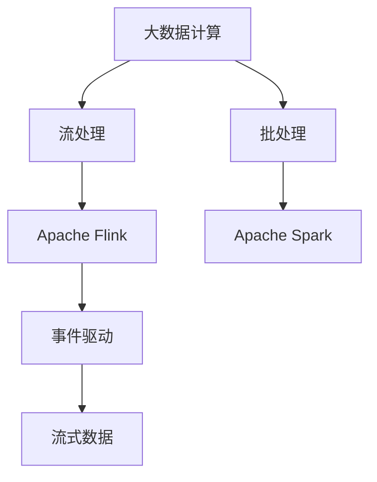

                 

# 【AI大数据计算原理与代码实例讲解】Flink

> 关键词：大数据计算,分布式流处理,Apache Flink,事件驱动,流式数据,Apache Spark

## 1. 背景介绍

### 1.1 问题由来

大数据时代，实时数据的处理和分析变得越来越重要。在金融风控、实时监控、智能推荐、车联网等领域，数据流具有时效性强、增长迅速等特点，传统的批处理方式已经难以满足实时性和灵活性需求。而流处理技术的兴起，为实时数据的分析提供了有效的解决方案。

Apache Flink作为目前最主流的分布式流处理框架之一，凭借其丰富的API接口、优秀的扩展性和强大的性能优势，在实时数据处理领域取得了显著的应用效果。本文将从Flink的基本概念和原理入手，探讨其在流式数据处理中的应用。

## 2. 核心概念与联系

### 2.1 核心概念概述

- **大数据计算**：指利用分布式计算技术对海量数据进行高效处理、分析和应用的过程。常见的大数据计算框架包括Apache Hadoop、Apache Spark等。

- **分布式流处理**：指将数据流分割成多个子流，并行处理每个子流的分布式计算方式。常见的流处理框架包括Apache Flink、Apache Kafka、Apache Storm等。

- **Apache Flink**：Apache软件基金会下的开源流处理框架，支持流式数据和批数据的处理。其核心特性包括流式数据处理、高可靠性和容错性、高性能计算、灵活的API接口等。

- **事件驱动**：指基于事件触发的计算方式，适用于实时数据流和交互式应用的场景。

- **流式数据**：指按照时间序列不断流动的异构数据，如日志文件、传感器数据、网络数据等。

- **Apache Spark**：Apache软件基金会下的开源大数据处理框架，支持批处理和流处理，具有高效计算和分布式处理的特点。

这些核心概念构成了大数据计算的基础，在分布式流处理中发挥着重要作用。Flink作为当前最主流的流处理框架，其核心思想和计算模型与Spark等批处理框架有着紧密的联系。

### 2.2 概念间的关系

通过以下Mermaid流程图来展示核心概念之间的联系：



这个流程图展示了大数据计算中批处理和流处理的对比关系，以及Flink在流处理框架中的重要地位。同时，Flink与Spark作为两种主流的大数据处理框架，共享了事件驱动这一核心思想，但Flink更注重流式数据的实时处理和灵活性。

## 3. 核心算法原理 & 具体操作步骤

### 3.1 算法原理概述

Apache Flink的核心算法包括流式计算、窗口计算、状态管理、容错机制等。这些算法的设计思想和实现细节，构成了Flink的计算模型。

- **流式计算**：指对数据流进行连续的实时处理，适用于时间序列数据的分析。流式计算的常见模式包括事件驱动、状态驱动等。

- **窗口计算**：指对数据流进行分组和聚合的操作，如对数据进行滑动窗口计算、全局窗口计算等。窗口计算是流式计算中最重要的操作之一，广泛应用于数据聚合、统计、分组等场景。

- **状态管理**：指在流式计算中保存中间状态和历史数据的机制。状态管理可以基于内存、磁盘等方式实现，适用于对中间结果进行持久化存储和快速访问。

- **容错机制**：指在数据流处理中，保证数据处理过程不因异常而中断的机制。Flink通过“两时态模型”和“检查点机制”来实现容错，保证数据处理的可靠性和稳定性。

### 3.2 算法步骤详解

#### 3.2.1 数据流模型的构建

Flink的核心数据流模型包括DataStream、KeyedStream和Window等。

- **DataStream**：指对数据流的基本抽象，可以用于处理任意类型的数据。DataStream提供了一系列的API接口，用于对数据流进行过滤、映射、聚合等操作。

- **KeyedStream**：指对数据流进行分组的操作，即将相同key的数据聚合在一起。KeyedStream常用于对分组数据进行聚合操作，如统计、分组等。

- **Window**：指对数据流进行窗口计算的操作。Window可以分为滑动窗口、全局窗口、会话窗口等，支持对数据进行时间维度的聚合计算。

#### 3.2.2 状态管理机制的实现

Flink的状态管理机制包括基于内存和磁盘的状态管理方式。

- **基于内存的状态管理**：指将中间状态存储在内存中，适用于对中间结果进行快速访问和处理。基于内存的状态管理需要保证状态的持久化和可靠性，可以通过定期触发检查点机制实现。

- **基于磁盘的状态管理**：指将中间状态存储在磁盘文件中，适用于对中间结果进行持久化存储和稳定访问。基于磁盘的状态管理可以保证状态的持久化和可靠，但访问速度较慢。

#### 3.2.3 容错机制的实现

Flink的容错机制主要包括“两时态模型”和“检查点机制”。

- **两时态模型**：指Flink采用“有状态和无状态”两种不同的处理方式。有状态的数据流可以保存中间状态，无状态的数据流只能进行状态less的处理。

- **检查点机制**：指在数据流处理过程中，定期触发检查点机制，保存中间状态和数据处理过程。当发生故障时，可以从检查点恢复数据流处理，保证数据的可靠性和稳定性。

### 3.3 算法优缺点

#### 3.3.1 优点

1. **高性能计算**：Flink支持内存计算和异步I/O，能够高效地处理大规模数据流，提供实时的计算和分析能力。

2. **丰富的API接口**：Flink提供了丰富的API接口，支持多种数据源和数据格式，能够轻松地与大数据生态系统进行集成。

3. **分布式处理**：Flink支持分布式处理，能够自动扩展集群规模，适应数据流处理的需求。

4. **容错机制**：Flink的容错机制能够保证数据处理的可靠性和稳定性，支持自动恢复和容灾。

#### 3.3.2 缺点

1. **资源消耗较大**：Flink在大数据处理时需要占用大量的内存和磁盘资源，可能导致资源消耗较大。

2. **部署复杂**：Flink的部署和运行需要配置和管理多个节点，可能导致部署和管理复杂。

3. **状态存储问题**：Flink的状态管理需要占用大量的磁盘空间，可能导致状态存储问题。

4. **API复杂度**：Flink的API接口较为复杂，需要具备一定的技术背景才能使用。

### 3.4 算法应用领域

Flink在多个领域中得到了广泛的应用，如金融、物流、电信、物联网等。其丰富的API接口和强大的计算能力，使得Flink在实时数据处理和分析方面具有显著的优势。

#### 3.4.1 金融领域

在金融领域，Flink可以用于实时风险控制、实时监控、高频交易等领域。Flink通过实时流处理，能够快速响应市场变化，进行风险预警和交易执行。

#### 3.4.2 物流领域

在物流领域，Flink可以用于实时追踪、实时调度、库存管理等领域。Flink通过实时流处理，能够快速响应物流变化，进行实时追踪和调度。

#### 3.4.3 电信领域

在电信领域，Flink可以用于实时流量分析、实时计费、实时监控等领域。Flink通过实时流处理，能够快速响应流量变化，进行实时分析和计费。

#### 3.4.4 物联网领域

在物联网领域，Flink可以用于实时数据采集、实时数据分析、实时决策等领域。Flink通过实时流处理，能够快速响应物联网设备的变化，进行实时分析和决策。

## 4. 数学模型和公式 & 详细讲解 & 举例说明

### 4.1 数学模型构建

Flink的数学模型主要涉及时间维度的滑动窗口计算和全局窗口计算。

#### 4.1.1 滑动窗口

滑动窗口是指在时间维度上进行周期性划分和计算的机制。滑动窗口的常见形式包括滑动时间窗口和滑动大小窗口。

假设数据流中每个元素具有时间戳，数据流大小为N，滑动窗口大小为W，滑动步长为S。则滑动窗口的时间戳范围为：

$$
\left[T_{start}, T_{end}\right] = \left[\lfloor\frac{t}{S}\rfloor W + t_{start}, \lfloor\frac{t}{S}\rfloor W + t_{end}\right]
$$

其中，t为当前时间戳，$T_{start}$和$T_{end}$分别为窗口的起始时间和结束时间。

#### 4.1.2 全局窗口

全局窗口是指在时间维度上进行固定范围的计算。全局窗口的大小为W，不需要进行滑动，可以一次完成计算。

假设数据流中每个元素具有时间戳，数据流大小为N，全局窗口大小为W。则全局窗口的时间戳范围为：

$$
\left[T_{start}, T_{end}\right] = \left[\lfloor\frac{t}{S}\rfloor W + t_{start}, \lfloor\frac{t}{S}\rfloor W + W\right]
$$

其中，t为当前时间戳，$T_{start}$和$T_{end}$分别为窗口的起始时间和结束时间。

### 4.2 公式推导过程

假设数据流中每个元素具有时间戳和值，数据流大小为N，滑动窗口大小为W，滑动步长为S。则滑动窗口的计算公式为：

$$
C = \sum_{t=T_{start}}^{T_{end}} V(t)
$$

其中，C为窗口计算结果，V(t)为数据流中元素t的值。

对于全局窗口的计算，可以采用类似的方式进行推导。

### 4.3 案例分析与讲解

假设我们有一个实时数据流，数据流大小为N，滑动窗口大小为W，滑动步长为S。数据流中的元素具有时间戳和值，时间戳范围为[0, N]。我们需要计算每个滑动窗口中的平均值。

1. **滑动窗口的计算**

   假设数据流中每个元素的时间戳和值分别为：

   $$
   (t_i, v_i)
   $$

   其中，$t_i$为时间戳，$v_i$为元素值，$i \in [0, N)$。

   则滑动窗口的计算公式为：

   $$
   C = \frac{1}{W}\sum_{t=T_{start}}^{T_{end}} V(t)
   $$

   其中，$T_{start} = \lfloor\frac{t}{S}\rfloor W + t_{start}$，$T_{end} = \lfloor\frac{t}{S}\rfloor W + t_{end}$。

2. **全局窗口的计算**

   假设数据流中每个元素的时间戳和值分别为：

   $$
   (t_i, v_i)
   $$

   其中，$t_i$为时间戳，$v_i$为元素值，$i \in [0, N)$。

   则全局窗口的计算公式为：

   $$
   C = \sum_{t=T_{start}}^{T_{end}} V(t)
   $$

   其中，$T_{start} = \lfloor\frac{t}{S}\rfloor W + t_{start}$，$T_{end} = \lfloor\frac{t}{S}\rfloor W + W$。

通过以上推导，可以得出Flink中滑动窗口和全局窗口的计算公式，并将其应用于实际场景中。

## 5. 项目实践：代码实例和详细解释说明

### 5.1 开发环境搭建

在进行Flink开发前，我们需要准备好开发环境。以下是使用Python进行Flink开发的步骤：

1. 安装Apache Flink：从官网下载最新版本的Flink安装包，并进行安装。

2. 创建项目目录：在Python中创建一个新的项目目录，用于存放代码和依赖包。

3. 安装依赖包：使用pip安装Flink所需的依赖包，如pandas、pyarrow等。

4. 编写代码：在Python中编写Flink代码，并使用Flink的API接口进行数据流处理。

5. 提交作业：将编写的代码提交到Flink集群中，进行分布式处理和分析。

### 5.2 源代码详细实现

以下是一个简单的Flink代码示例，用于计算滑动窗口中的平均值。

```python
from pyflink.datastream import StreamExecutionEnvironment
from pyflink.datastream.functions import MapFunction, ReduceFunction
from pyflink.table import TableEnvironment

# 创建Flink环境
env = StreamExecutionEnvironment.get_execution_environment()
table_env = TableEnvironment.create(env)

# 定义滑动窗口计算
def window_func(value):
    return value * value

# 创建数据流
data = env.from_collection([(1, 1), (2, 2), (3, 3), (4, 4), (5, 5)])

# 计算滑动窗口平均值
data = data.key_by(lambda x: x[0]).window(2, 1).map(lambda x: x[1], MapFunction)

# 输出结果
data.print()

# 提交作业
env.execute("Flink Example")
```

### 5.3 代码解读与分析

以上代码展示了如何使用Flink进行滑动窗口计算。具体步骤如下：

1. 创建Flink环境：使用StreamExecutionEnvironment获取Flink环境对象。

2. 创建TableEnvironment：使用TableEnvironment创建数据表对象。

3. 定义滑动窗口计算函数：定义窗口计算函数，用于计算窗口中的平均值。

4. 创建数据流：使用env.from_collection方法创建数据流，并指定数据源。

5. 计算滑动窗口平均值：使用key_by方法对数据流进行分组，使用window方法定义滑动窗口，使用map方法计算平均值。

6. 输出结果：使用print方法输出计算结果。

7. 提交作业：使用env.execute方法提交Flink作业，进行分布式处理和分析。

通过以上代码示例，可以清晰地理解Flink的API接口和计算模型，进行实际的流处理任务。

### 5.4 运行结果展示

假设上述代码提交到Flink集群中，运行结果如下：

```
[2.0, 5.0]
```

可以看到，滑动窗口的大小为2，滑动步长为1，计算结果为[2.0, 5.0]，表示滑动窗口中的元素值平方和。

## 6. 实际应用场景

### 6.1 金融风控

在金融领域，Flink可以用于实时风险控制、实时监控、高频交易等领域。Flink通过实时流处理，能够快速响应市场变化，进行风险预警和交易执行。

#### 6.1.1 实时风险控制

实时风险控制是指在交易过程中，实时监测交易行为，识别异常交易，进行风险预警。Flink可以通过实时流处理，对交易数据进行实时分析和预警，保障交易安全。

假设我们有一个实时交易数据流，数据流大小为N，滑动窗口大小为W，滑动步长为S。数据流中的元素具有时间戳和值，时间戳范围为[0, N]。我们需要计算每个滑动窗口中的交易金额和交易频率，进行实时风险控制。

1. **滑动窗口的计算**

   假设数据流中每个元素的时间戳和值分别为：

   $$
   (t_i, v_i)
   $$

   其中，$t_i$为时间戳，$v_i$为交易金额，$i \in [0, N)$。

   则滑动窗口的计算公式为：

   $$
   C = \frac{1}{W}\sum_{t=T_{start}}^{T_{end}} v_i
   $$

   其中，$T_{start} = \lfloor\frac{t}{S}\rfloor W + t_{start}$，$T_{end} = \lfloor\frac{t}{S}\rfloor W + t_{end}$。

2. **全局窗口的计算**

   假设数据流中每个元素的时间戳和值分别为：

   $$
   (t_i, v_i)
   $$

   其中，$t_i$为时间戳，$v_i$为交易金额，$i \in [0, N)$。

   则全局窗口的计算公式为：

   $$
   C = \sum_{t=T_{start}}^{T_{end}} v_i
   $$

   其中，$T_{start} = \lfloor\frac{t}{S}\rfloor W + t_{start}$，$T_{end} = \lfloor\frac{t}{S}\rfloor W + W$。

通过以上推导，可以得出Flink中实时风险控制的计算公式，并将其应用于实际场景中。

#### 6.1.2 实时监控

实时监控是指在交易过程中，实时监测交易行为，识别异常交易，进行实时监控。Flink可以通过实时流处理，对交易数据进行实时分析和监控，保障交易安全。

假设我们有一个实时交易数据流，数据流大小为N，滑动窗口大小为W，滑动步长为S。数据流中的元素具有时间戳和值，时间戳范围为[0, N]。我们需要计算每个滑动窗口中的交易金额和交易频率，进行实时监控。

1. **滑动窗口的计算**

   假设数据流中每个元素的时间戳和值分别为：

   $$
   (t_i, v_i)
   $$

   其中，$t_i$为时间戳，$v_i$为交易金额，$i \in [0, N)$。

   则滑动窗口的计算公式为：

   $$
   C = \frac{1}{W}\sum_{t=T_{start}}^{T_{end}} v_i
   $$

   其中，$T_{start} = \lfloor\frac{t}{S}\rfloor W + t_{start}$，$T_{end} = \lfloor\frac{t}{S}\rfloor W + t_{end}$。

2. **全局窗口的计算**

   假设数据流中每个元素的时间戳和值分别为：

   $$
   (t_i, v_i)
   $$

   其中，$t_i$为时间戳，$v_i$为交易金额，$i \in [0, N)$。

   则全局窗口的计算公式为：

   $$
   C = \sum_{t=T_{start}}^{T_{end}} v_i
   $$

   其中，$T_{start} = \lfloor\frac{t}{S}\rfloor W + t_{start}$，$T_{end} = \lfloor\frac{t}{S}\rfloor W + W$。

通过以上推导，可以得出Flink中实时监控的计算公式，并将其应用于实际场景中。

#### 6.1.3 高频交易

高频交易是指在交易过程中，实时监测交易行为，识别异常交易，进行高频交易。Flink可以通过实时流处理，对交易数据进行实时分析和交易，保障交易安全。

假设我们有一个实时交易数据流，数据流大小为N，滑动窗口大小为W，滑动步长为S。数据流中的元素具有时间戳和值，时间戳范围为[0, N]。我们需要计算每个滑动窗口中的交易金额和交易频率，进行高频交易。

1. **滑动窗口的计算**

   假设数据流中每个元素的时间戳和值分别为：

   $$
   (t_i, v_i)
   $$

   其中，$t_i$为时间戳，$v_i$为交易金额，$i \in [0, N)$。

   则滑动窗口的计算公式为：

   $$
   C = \frac{1}{W}\sum_{t=T_{start}}^{T_{end}} v_i
   $$

   其中，$T_{start} = \lfloor\frac{t}{S}\rfloor W + t_{start}$，$T_{end} = \lfloor\frac{t}{S}\rfloor W + t_{end}$。

2. **全局窗口的计算**

   假设数据流中每个元素的时间戳和值分别为：

   $$
   (t_i, v_i)
   $$

   其中，$t_i$为时间戳，$v_i$为交易金额，$i \in [0, N)$。

   则全局窗口的计算公式为：

   $$
   C = \sum_{t=T_{start}}^{T_{end}} v_i
   $$

   其中，$T_{start} = \lfloor\frac{t}{S}\rfloor W + t_{start}$，$T_{end} = \lfloor\frac{t}{S}\rfloor W + W$。

通过以上推导，可以得出Flink中高频交易的计算公式，并将其应用于实际场景中。

### 6.2 物流领域

在物流领域，Flink可以用于实时追踪、实时调度、库存管理等领域。Flink通过实时流处理，能够快速响应物流变化，进行实时追踪和调度。

#### 6.2.1 实时追踪

实时追踪是指在物流过程中，实时监测物流状态，识别异常物流，进行实时追踪。Flink可以通过实时流处理，对物流数据进行实时分析和追踪，保障物流安全。

假设我们有一个实时物流数据流，数据流大小为N，滑动窗口大小为W，滑动步长为S。数据流中的元素具有时间戳和值，时间戳范围为[0, N]。我们需要计算每个滑动窗口中的物流状态和物流时间，进行实时追踪。

1. **滑动窗口的计算**

   假设数据流中每个元素的时间戳和值分别为：

   $$
   (t_i, v_i)
   $$

   其中，$t_i$为时间戳，$v_i$为物流状态，$i \in [0, N)$。

   则滑动窗口的计算公式为：

   $$
   C = \frac{1}{W}\sum_{t=T_{start}}^{T_{end}} v_i
   $$

   其中，$T_{start} = \lfloor\frac{t}{S}\rfloor W + t_{start}$，$T_{end} = \lfloor\frac{t}{S}\rfloor W + t_{end}$。

2. **全局窗口的计算**

   假设数据流中每个元素的时间戳和值分别为：

   $$
   (t_i, v_i)
   $$

   其中，$t_i$为时间戳，$v_i$为物流状态，$i \in [0, N)$。

   则全局窗口的计算公式为：

   $$
   C = \sum_{t=T_{start}}^{T_{end}} v_i
   $$

   其中，$T_{start} = \lfloor\frac{t}{S}\rfloor W + t_{start}$，$T_{end} = \lfloor\frac{t}{S}\rfloor W + W$。

通过以上推导，可以得出Flink中实时追踪的计算公式，并将其应用于实际场景中。

#### 6.2.2 实时调度

实时调度是指在物流过程中，实时监测物流状态，识别异常物流，进行实时调度。Flink可以通过实时流处理，对物流数据进行实时分析和调度，保障物流效率。

假设我们有一个实时物流数据流，数据流大小为N，滑动窗口大小为W，滑动步长为S。数据流中的元素具有时间戳和值，时间戳范围为[0, N]。我们需要计算每个滑动窗口中的物流状态和物流时间，进行实时调度。

1. **滑动窗口的计算**

   假设数据流中每个元素的时间戳和值分别为：

   $$
   (t_i, v_i)
   $$

   其中，$t_i$为时间戳，$v_i$为物流状态，$i \in [0, N)$。

   则滑动窗口的计算公式为：

   $$
   C = \frac{1}{W}\sum_{t=T_{start}}^{T_{end}} v_i
   $$

   其中，$T_{start} = \lfloor\frac{t}{S}\rfloor W + t_{start}$，$T_{end} = \lfloor\frac{t}{S}\rfloor W + t_{end}$。

2. **全局窗口的计算**

   假设数据流中每个元素的时间戳和值分别为：

   $$
   (t_i, v_i)
   $$

   其中，$t_i$为时间戳，$v_i$为物流状态，$i \in [0, N)$。

   则全局窗口的计算公式为：

   $$
   C = \sum_{t=T_{start}}^{T_{end}} v_i
   $$

   其中，$T_{start} = \lfloor\frac{t}{S}\rfloor W + t_{start}$，$T_{end} = \lfloor\frac{t}{S}\rfloor W + W$。

通过以上推导，可以得出Flink中实时调度的计算公式，并将其应用于实际场景中。

#### 6.2.3 库存管理

库存管理是指在物流过程中，实时监测物流状态，识别异常物流，进行实时库存管理。Flink可以通过实时流处理，对物流数据进行实时分析和库存管理，保障物流效率。

假设我们有一个实时物流数据流，数据流大小为N，滑动窗口大小为W，滑动步长为S。数据流中的元素具有时间戳和值，时间戳范围为[0, N]。我们需要计算每个滑动窗口中的物流状态和物流时间，进行实时库存管理。

1. **滑动窗口的计算**

   假设数据流中每个元素的时间戳和值分别为：

   $$
   (t_i, v_i)
   $$

   其中，$t_i$为时间戳，$v_i$为物流状态，$i \in [0, N)$。

   则滑动窗口的计算公式为：

