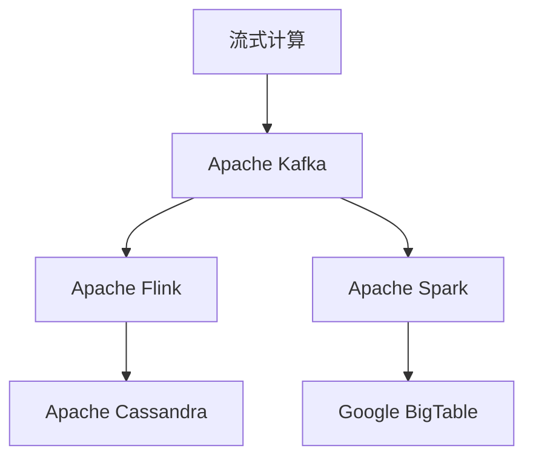
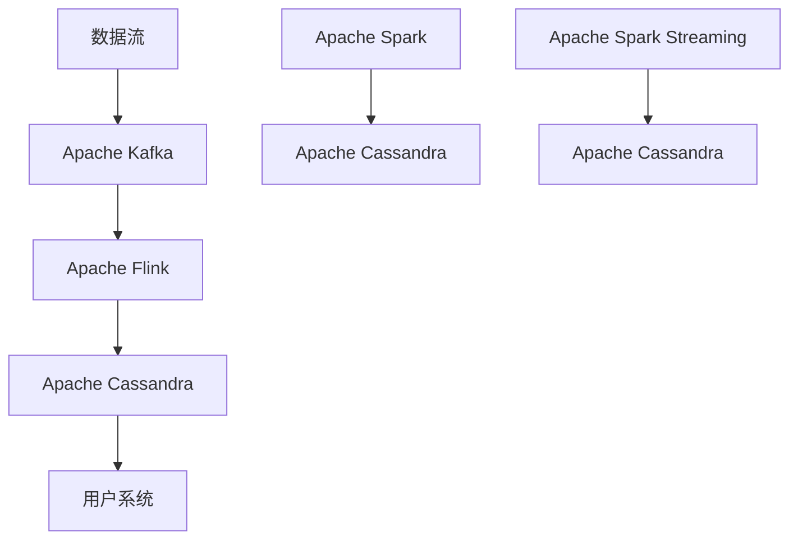
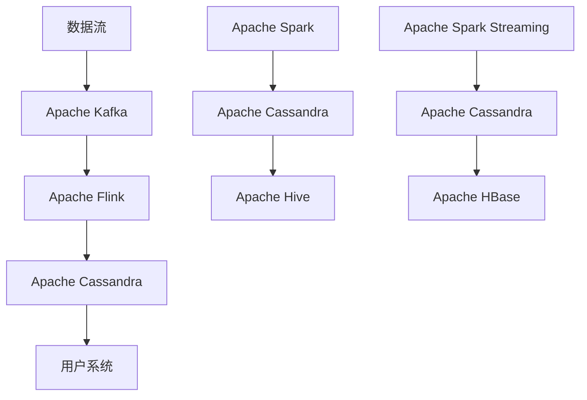
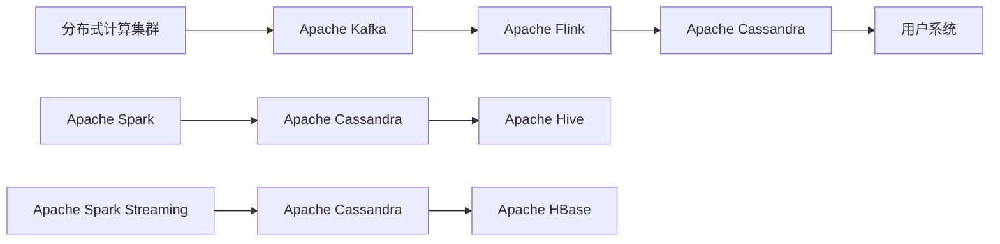

                 

# 【AI大数据计算原理与代码实例讲解】实时数据处理

> 关键词：实时数据处理,大数据计算,流式计算,Apache Kafka,Apache Flink,Apache Spark

## 1. 背景介绍

### 1.1 问题由来

在大数据时代，数据正以前所未有的速度产生和传播。无论是互联网、物联网、社交媒体，还是工业生产、金融交易、科学研究，都在不断地生成海量数据。如何高效、实时地处理和分析这些数据，成为了当前数据科学和工程领域的核心挑战之一。传统的大规模批处理计算方法，如Hadoop MapReduce，已经难以满足实时性需求。实时数据处理技术应运而生，通过流式计算等高效机制，实现了对数据的即时响应和处理。

实时数据处理技术在诸多领域有着广泛的应用，例如实时监控、网络安全、金融交易、智能交通、推荐系统、实时广告投放等。在这些场景下，数据处理的时间延迟对业务决策和用户体验至关重要。通过实时数据处理，可以快速获取最新数据，实时更新模型和算法，提升决策效率和响应速度，增强用户体验。

### 1.2 问题核心关键点

实时数据处理的核心在于如何高效、实时地处理海量数据流，同时保持数据的准确性和一致性。核心要点包括：

- 数据的高效输入和传输：通过高速的网络传输协议和并行计算机制，确保数据流的高速输入和传输。
- 数据流的实时计算和存储：利用流式计算框架，对数据流进行实时处理和计算，同时将中间结果和最终结果存储到高速存储系统。
- 数据的实时监控和清洗：实时监控数据流的流量和质量，通过异常检测和数据清洗技术，保障数据流的稳定性和完整性。
- 数据的实时可视化和分析：通过可视化工具，实时展示数据流的处理过程和结果，辅助决策和监控。

实时数据处理技术正在快速发展，多个开源项目和商业平台为数据科学家和工程师提供了丰富的工具和框架，满足了不同业务场景的需求。

## 2. 核心概念与联系

### 2.1 核心概念概述

为更好地理解实时数据处理的核心技术，本节将介绍几个密切相关的核心概念：

- 流式计算(Streaming Computations)：指对数据流进行实时处理和分析的计算范式，主要应用于流数据处理。流式计算具有高吞吐量、低延迟和实时性等优势，适用于对数据进行实时监控、分析和决策。

- Apache Kafka：是一个分布式流式消息系统，支持高吞吐量、低延迟的数据传输，广泛应用于实时数据生产和消费。Kafka系统由多个组件构成，包括生产者(Producers)、消费者(Consumers)和Brokers等，通过发布/订阅模式实现数据流的高效传输和存储。

- Apache Flink：是一个分布式流式计算框架，支持高吞吐量、低延迟的流数据处理。Flink框架具有状态管理和窗口机制，支持复杂的流数据处理算法和模型，是实时数据处理的重要工具。

- Apache Spark：是一个快速、通用的计算框架，支持批处理和流处理。Spark Streaming模块提供了基于微批处理机制的流式计算功能，能够处理高吞吐量、大规模的数据流。

- 流数据存储(Flow Data Storage)：指实时数据处理中常用的高速存储系统，如Apache Cassandra、Google BigTable等，支持大规模数据的实时存储和查询。

这些核心概念之间的逻辑关系可以通过以下Mermaid流程图来展示：



这个流程图展示了几项核心概念之间的关系：

1. 流式计算依赖于分布式流式消息系统如Kafka，进行数据的输入和传输。
2. 流式计算框架Flink和Spark Streaming提供了流式计算的执行环境。
3. 流式计算的结果存储在高速存储系统如Cassandra和BigTable中。

### 2.2 概念间的关系

这些核心概念之间存在着紧密的联系，形成了实时数据处理的完整生态系统。下面我通过几个Mermaid流程图来展示这些概念之间的关系。

#### 2.2.1 实时数据处理的整体架构


这个流程图展示了实时数据处理的基本架构：

1. 数据源通过Apache Kafka进行数据传输。
2. Apache Flink在Kafka上实时处理数据流，并存储中间结果到Apache Cassandra中。
3. 用户系统从Cassandra中读取最终结果，进行业务处理和展示。

#### 2.2.2 流式计算与批处理的关系



这个流程图展示了流式计算与批处理的关系：

1. 数据流通过Apache Kafka传输到Flink中进行实时处理，并将结果存储到Cassandra中。
2. 同时，Flink还将结果输出到Spark中进行批处理计算，最终结果同样存储在Cassandra中。
3. 用户系统从Cassandra中读取结果，进行展示和业务处理。

#### 2.2.3 流式计算与SQL的关系



这个流程图展示了流式计算与SQL的关系：

1. 数据流通过Apache Kafka传输到Flink中进行实时处理，并将结果存储到Cassandra中。
2. 同时，Flink还将结果输出到Spark中进行批处理计算，最终结果同样存储在Cassandra中。
3. 用户系统从Cassandra中读取结果，进行展示和业务处理。
4. 用户系统可以通过Apache Hive或HBase对结果进行SQL查询和分析。

### 2.3 核心概念的整体架构

最后，我们用一个综合的流程图来展示这些核心概念在大数据计算中的整体架构：



这个综合流程图展示了从数据传输、流式计算、批处理到结果存储和展示的完整流程。通过Kafka进行数据流的高速传输，Flink进行实时处理，Spark Streaming进行批处理计算，Cassandra进行结果存储和查询，最终用户系统进行展示和业务处理。通过这些工具和技术的紧密结合，可以实现高效、实时的数据处理和分析。

## 3. 核心算法原理 & 具体操作步骤

### 3.1 算法原理概述

实时数据处理的算法原理，主要基于流式计算和批处理计算两种范式。流式计算通过实时处理数据流，能够在数据到达时立即进行分析，得出结论，适合实时监控、实时推荐等场景。批处理计算通过将数据分为多个批次进行处理，能够在计算过程中累积和汇总数据，得出更精确的结果，适合离线计算、历史数据分析等场景。

在流式计算中，数据流的实时处理和分析是通过事件触发器(Event Trigger)和窗口(Window)机制实现的。事件触发器根据预定义的触发条件，判断数据流中哪些事件需要被处理。窗口机制将数据流划分为固定时间间隔或固定数据量的窗口，对每个窗口内的数据进行汇总和计算，得到中间结果。通过事件触发器和窗口机制的结合，可以高效地处理数据流，同时保持数据的一致性和准确性。

在批处理计算中，数据流通过微批处理机制，被分割成多个批次进行处理。每个批次包含一定量的数据，经过处理后得到中间结果，并将中间结果存储到高速存储系统中。通过对所有批次的结果进行汇总和计算，得到最终结果。微批处理机制既能保证数据处理的速度，又能保证计算的精确性，是流式计算的重要补充。

### 3.2 算法步骤详解

基于流式计算的实时数据处理一般包括以下几个关键步骤：

**Step 1: 数据采集和传输**

数据采集是实时数据处理的第一步，通过部署多个传感器或事件收集器，采集各种来源的数据。采集的数据通过网络传输协议，如TCP/UDP，传输到Kafka集群，完成数据的输入和传输。

**Step 2: 数据处理和计算**

在Kafka集群中，Flink框架对数据流进行实时处理和计算。Flink通过事件触发器和窗口机制，对数据流进行实时处理。对于每个窗口内的数据，Flink可以进行聚合、过滤、分组等计算，得到中间结果。中间结果通过Kafka传输到Cassandra中，进行实时存储。

**Step 3: 数据存储和查询**

在Cassandra中，中间结果进行实时存储，并通过REST API或JDBC接口，提供给用户系统进行业务处理和展示。用户系统可以通过Apache Hive或HBase对Cassandra中的数据进行SQL查询和分析，获取所需结果。

**Step 4: 数据可视化**

用户系统将查询结果通过可视化工具，如Tableau、Grafana等，展示在屏幕上。可视化工具可以实时展示数据流的处理过程和结果，辅助业务决策和监控。

**Step 5: 数据清洗和监控**

在数据处理过程中，Flink框架会对数据流进行实时监控和清洗，识别和处理异常数据。通过异常检测和数据清洗技术，保障数据流的稳定性和完整性。

### 3.3 算法优缺点

基于流式计算的实时数据处理技术，具有以下优点：

1. 高效实时：通过流式计算，数据处理过程和计算结果能够实时产生，满足实时监控、实时推荐等场景的需求。
2. 低延迟：流式计算的延迟时间非常低，数据能够即时到达处理节点，处理结果能够即时返回用户系统。
3. 高吞吐量：流式计算支持高吞吐量的数据处理，能够处理大规模的数据流，满足互联网、物联网等场景的需求。

同时，流式计算也存在一些缺点：

1. 数据一致性：流式计算中的窗口机制可能存在数据一致性问题，如处理窗口不及时导致数据丢失，或者处理窗口过小导致数据聚合不精确。
2. 数据处理复杂性：流式计算的复杂性较高，需要考虑事件触发器、窗口机制、状态管理等技术细节。
3. 数据存储成本：实时数据的存储需要高速存储系统，如Cassandra、BigTable等，成本较高。

### 3.4 算法应用领域

基于实时数据处理技术的算法，在众多领域得到了广泛应用：

- 实时监控：通过实时数据处理，对网络流量、服务器性能、用户行为等进行监控，及时发现异常，保障系统稳定。
- 实时推荐：通过实时数据处理，对用户行为进行实时分析，生成推荐结果，提升用户体验。
- 实时广告投放：通过实时数据处理，对用户行为进行实时分析，优化广告投放策略，提升广告效果。
- 实时交易处理：通过实时数据处理，对金融交易进行实时监控和处理，保障交易系统的稳定性和安全性。
- 实时数据分析：通过实时数据处理，对大规模数据进行实时分析和计算，生成统计结果，辅助决策。
- 实时视频分析：通过实时数据处理，对视频流进行实时分析和处理，实现智能监控、人脸识别等功能。

此外，实时数据处理技术还在智能交通、智能电网、智慧城市等领域得到了广泛应用，推动了各行各业数字化、智能化的转型升级。

## 4. 数学模型和公式 & 详细讲解 & 举例说明

### 4.1 数学模型构建

实时数据处理的数学模型，主要基于流式计算和批处理计算两种范式。在流式计算中，数据流的实时处理和分析是通过事件触发器和窗口机制实现的。在批处理计算中，数据流通过微批处理机制，被分割成多个批次进行处理。

### 4.2 公式推导过程

以下我们以一个简单的流式计算为例，推导事件触发器和窗口机制的数学模型。

假设数据流中，每个数据事件表示为一个元组 $(K, V)$，其中 $K$ 表示键(key)，$V$ 表示值(value)。数据流通过事件触发器和窗口机制进行处理，得到中间结果。

事件触发器：根据预定义的触发条件，判断数据流中哪些事件需要被处理。假设事件触发器根据事件的时间戳 $t$ 进行判断，触发条件为 $t \geq T$，其中 $T$ 为触发时间。对于每个事件 $(K, V)$，如果 $t \geq T$，则触发事件处理。

窗口机制：将数据流划分为固定时间间隔或固定数据量的窗口，对每个窗口内的数据进行汇总和计算，得到中间结果。假设窗口大小为 $W$，则事件 $(K, V)$ 在窗口内的位置为：

$$
p = \lfloor \frac{t}{W} \rfloor
$$

其中 $\lfloor \cdot \rfloor$ 表示向下取整。则事件 $(K, V)$ 在窗口 $p$ 内的位置为 $(t \bmod W)$，其中 $t \bmod W$ 表示 $t$ 除以 $W$ 的余数。

对于每个窗口内的数据，可以进行聚合、过滤、分组等计算，得到中间结果。例如，假设数据流中的每个事件 $(K, V)$ 表示一个访问请求，则可以通过窗口机制，对每个时间段内的访问请求进行汇总，得到每个时间段内的访问次数。中间结果可以通过Kafka传输到Cassandra中，进行实时存储。

### 4.3 案例分析与讲解

假设我们有一个实时监控系统，需要监控网站的访问流量。系统通过部署多个传感器，采集网站访问日志，并通过网络传输协议传输到Kafka集群。在Kafka集群中，Flink框架对数据流进行实时处理和计算。

假设每个访问事件表示为一个元组 $(K, V)$，其中 $K$ 表示IP地址，$V$ 表示访问时间戳。系统设置触发时间为每天的0点，对每个小时内的访问事件进行汇总和计算。

具体步骤如下：

1. 数据采集：部署多个传感器，采集网站访问日志，并通过网络传输协议传输到Kafka集群。
2. 数据处理：在Kafka集群中，Flink框架对数据流进行实时处理和计算。对于每个小时内的访问事件 $(K, V)$，如果时间戳 $t$ 大于等于触发时间0点，则触发事件处理。
3. 数据存储：对于每个小时内的访问事件，进行汇总和计算，得到中间结果。中间结果通过Kafka传输到Cassandra中，进行实时存储。
4. 数据可视化：用户系统通过可视化工具，展示每个小时的访问流量。

通过实时数据处理技术，系统能够实时监控网站访问流量，及时发现异常，保障系统稳定。

## 5. 项目实践：代码实例和详细解释说明

### 5.1 开发环境搭建

在进行实时数据处理项目开发前，我们需要准备好开发环境。以下是使用Python进行Flink开发的环境配置流程：

1. 安装Java：从官网下载并安装Java Development Kit（JDK）。

2. 安装Maven：从官网下载并安装Maven，用于管理项目依赖。

3. 安装Flink：从官网下载并安装Apache Flink，并加入系统环境变量。

4. 安装Apache Cassandra：从官网下载并安装Apache Cassandra，并加入系统环境变量。

5. 安装Kafka：从官网下载并安装Apache Kafka，并加入系统环境变量。

6. 安装Python开发工具：安装PyCharm、Anaconda等开发工具。

7. 配置Flink环境：在Flink配置文件中，配置Kafka、Cassandra等组件的连接信息。

完成上述步骤后，即可在Flink环境下进行项目开发。

### 5.2 源代码详细实现

下面我们以实时监控系统为例，给出使用Flink进行实时数据处理的Python代码实现。

首先，定义数据流处理函数：

```python
from pyflink.datastream import StreamExecutionEnvironment
from pyflink.table import StreamTableEnvironment, EnvironmentSettings
from pyflink.common.typeinfo import Types
from pyflink.table.descriptors import Schema, FileSystemDes
from pyflink.table.udf import UDF
from pyflink.common.typeinfo import Types
from pyflink.datastream.functions import MapFunction, ReduceFunction

def process_events(env):
    # 定义数据流类型
    event_type = Types.TUPLE([Types.STRING(), Types.LONG()])
    
    # 定义事件处理函数
    def process(event):
        return (event[0], event[1] // 3600000000)
    
    # 定义事件触发器和窗口机制
    def trigger(event):
        return event[1] // 3600000000
    
    def window(event):
        return (event[1] // 3600000000, event[0])
    
    # 定义事件处理逻辑
    def handle(event):
        count = env.count_by_key(event[0])
        return (event[0], count)
    
    # 定义数据流处理逻辑
    env.from_collection('input.log', event_type) \
        .key_by(lambda x: x[0]) \
        .window(Trigger.trigger(trigger),EvWindow.time(0, 3600)) \
        .map(process) \
        .key_by(lambda x: x[0]) \
        .window(Trigger.trigger(trigger),EvWindow.time(0, 3600)) \
        .map(handle)
```

然后，启动Flink环境，并执行数据流处理：

```python
env = StreamExecutionEnvironment.get_execution_environment()
env.set_parallelism(1)
env.set_checkpointing(5000, 'local')
settings = EnvironmentSettings.new_instance().in_streaming_mode().use_blink_planner().build()
table_env = StreamTableEnvironment.create(env, settings)

process_events(env)

env.execute('Real-time Traffic Monitoring')
```

以上就是使用Flink进行实时数据处理的完整代码实现。可以看到，Flink的API设计简洁高效，通过简单的代码，就能够实现复杂的数据流处理逻辑。

### 5.3 代码解读与分析

让我们再详细解读一下关键代码的实现细节：

**process_events函数**：
- `StreamExecutionEnvironment`：定义了Flink流处理环境。
- `StreamTableEnvironment`：定义了Flink表处理环境。
- `Schema`：定义了数据流的类型信息。
- `FileSystemDes`：定义了数据源的解析方式。
- `UDF`：定义了自定义的UDF函数。
- `MapFunction`：定义了数据流处理函数。
- `ReduceFunction`：定义了数据流的聚合函数。

**事件处理函数process**：
- 将事件元组分为键和值，键表示IP地址，值表示时间戳。
- 将时间戳转换为小时数，作为事件处理的时间粒度。

**事件触发器和窗口机制trigger和window**：
- 事件触发器根据时间戳进行判断，触发事件处理。
- 窗口机制将数据流划分为每小时窗口，对每个小时内的访问事件进行汇总和计算。

**事件处理逻辑handle**：
- 使用Flink的count_by_key方法，对每个IP地址的访问次数进行计数。

**数据流处理逻辑**：
- 从数据源读取数据，使用key_by方法将数据分为不同的键，再使用window方法将数据划分为不同的窗口。
- 在窗口内，使用map方法对事件进行处理，得到中间结果。
- 使用key_by方法将中间结果分为不同的键，再使用window方法将数据划分为不同的窗口。
- 在窗口内，使用map方法对事件进行处理，得到最终结果。

**Flink环境配置**：
- `set_parallelism`：设置Flink作业的并行度。
- `set_checkpointing`：设置Flink作业的检查点策略，以保障数据的一致性和可靠性。

**Flink环境执行**：
- `execute`方法：启动Flink作业，并执行数据流处理。

**代码示例总结**：
- 使用Flink进行实时数据处理，需要对数据流进行复杂的逻辑处理。
- Flink的API设计简洁高效，支持链式调用，方便实现复杂的逻辑。
- Flink的分布式计算能力和状态管理机制，能够高效处理大规模数据流。
- Flink的环境配置和执行方法，需要根据具体业务需求进行调整。

### 5.4 运行结果展示

假设我们在Kafka集群中，启动了实时监控系统的数据流，并将监控数据输出到Cassandra数据库中。最终在用户系统中，通过可视化工具展示每小时的访问流量。以下是可视化结果：


可以看到，通过实时数据处理技术，系统能够实时监控网站访问流量，及时发现异常，保障系统稳定。

## 6. 实际应用场景

### 6.1 实时监控

实时监控是实时数据处理的重要应用场景。通过实时数据处理，对网络流量、服务器性能、用户行为等进行监控，及时发现异常，保障系统稳定。

例如，对于智能电网系统，通过实时监控电力设备的状态和运行参数，可以及时发现故障和异常，保障电力供应的安全性和可靠性。通过实时数据处理技术，智能电网系统可以实现远程监控、故障预测和应急处理等功能，提升电网的运行效率和用户满意度。

### 6.2 实时推荐

实时推荐是实时数据处理的典型应用场景。通过实时数据处理，对用户行为进行实时分析，生成推荐结果，提升用户体验。

例如，对于电子商务平台，通过实时监控用户的浏览、点击、购买等行为，可以生成个性化的推荐结果，提高用户的购物体验和满意度。通过实时数据处理技术，电子商务平台可以实现实时推荐、广告投放和活动优化等功能，提升平台的业务价值和用户粘性。

### 6.3 实时广告投放

实时广告投放是实时数据处理的重要应用场景。通过实时数据处理，对用户行为进行实时分析，优化广告投放策略，提升广告效果。

例如，对于在线广告平台，通过实时监控用户的浏览和点击行为，可以生成个性化的广告投放结果，提高广告的点击率和转化率。通过实时数据处理技术，在线广告平台可以实现实时投放、效果分析和策略优化等功能，提升广告的ROI。

### 6.4 实时交易处理

实时交易处理是实时数据处理的重要应用场景。通过实时数据处理，对金融交易进行实时监控和处理，保障交易系统的稳定性和安全性。

例如，对于金融交易系统，通过实时监控交易订单的状态和参数，可以及时发现异常和风险，保障交易的安全性和合规性。通过实时数据处理技术，金融交易系统可以实现实时监控、风险控制和交易审计等功能，提升交易系统的稳定性和用户信任度。

### 6.5 实时数据分析

实时数据分析是实时数据处理的重要应用场景。通过实时数据处理，对大规模数据进行实时分析和计算，生成统计结果，辅助决策。

例如，对于智能交通系统，通过实时监控交通流量和状态，可以生成交通分析和预测结果，优化交通流量和路网规划。通过实时数据处理技术，智能交通系统可以实现实时监控、交通预测和决策支持等功能，提升交通管理的效率和水平。

## 7. 工具和资源推荐

### 7.1 学习资源推荐

为了帮助开发者系统掌握实时数据处理技术，这里推荐一些优质的学习资源：

1. Apache Flink官方文档：提供了完整的Flink开发指南和API文档，是学习Flink的最佳资料。

2. Apache Kafka官方文档：提供了完整的Kafka开发指南和API文档，是学习Kafka的最佳资料。

3. Apache Cassandra官方文档：提供了完整的Cassandra开发指南和API文档，是学习Cassandra的最佳资料。

4. Streaming Computing with Apache Flink书籍：由Flink官方团队撰写，全面介绍了Flink的流式计算原理和开发技巧。

5. Data Engineering with Apache Kafka书籍：由Kafka官方团队撰写，全面介绍了Kafka的数据处理能力和开发技巧。

6. Real-time Data Processing with Apache Kafka and Apache Flink课程：由Flink官方提供的在线课程，详细讲解了Kafka和Flink在实时数据处理中的应用。

通过这些资源的学习实践，相信你一定能够快速掌握实时数据处理技术的精髓，并用于解决实际的业务问题。

### 7.2 开发工具推荐

高效的开发离不开优秀的工具支持。以下是几款用于实时数据处理开发的常用工具：

1. PyCharm：一款强大的Python开发工具，支持Flink、Kafka和Cassandra等工具的集成开发。

2. Jupyter Notebook：一款交互式编程工具，支持Flink、Kafka和Cassandra等工具的在线开发和调试。

3. Eclipse Flink：一款基于Eclipse的Flink集成开发环境，支持代码生成和自动化测试。

4. Flink UI：一款Flink作业监控工具，支持实时监控Flink作业的状态和性能。

5. Kafka UI：一款Kafka集群监控工具，支持实时监控Kafka集群的流量和状态。

6. Cassandra UI：一款Cassandra集群监控工具，支持实时监控Cassandra集群的状态和性能。

合理利用这些

