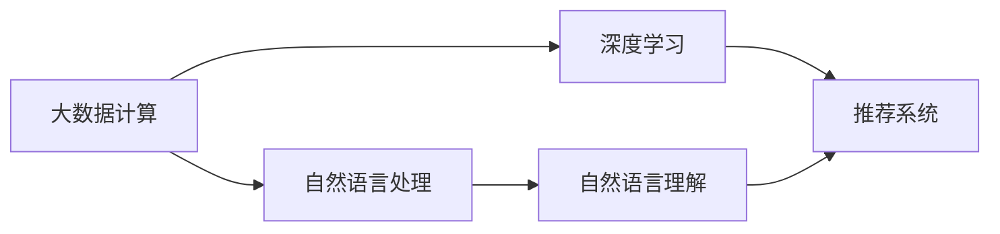

                 

# 【AI大数据计算原理与代码实例讲解】相关性评分

> 关键词：大数据计算, 相关性评分, 自然语言处理, 深度学习, 自然语言理解, 推荐系统, 语义表示

## 1. 背景介绍

在现代社会，数据无处不在。从社交媒体的点赞、评论，到电子商务的商品推荐，再到医疗诊断中的医学影像分析，数据正在以前所未有的速度产生和累积。如何处理和分析这些海量数据，是大数据时代的重要挑战。特别是在自然语言处理(NLP)领域，文本数据的文本数量和种类繁多，如何准确地理解文本内容和挖掘其中的关系，成为了重要的研究课题。

在过去，文本的相关性评分通常通过基于统计的方法进行。但是，随着深度学习技术的发展，尤其是神经网络模型的应用，相关性评分的方法已经从传统的统计方法转变为基于深度学习的方法。本文将探讨基于深度学习的大数据计算中的相关性评分问题，并通过具体实例讲解其原理和实现。

## 2. 核心概念与联系

### 2.1 核心概念概述

- **大数据计算**：指的是在数据量巨大、分布广泛、类型多样的环境中，利用高效算法和分布式计算框架进行数据处理和分析的过程。
- **自然语言处理**：研究如何让计算机理解和生成人类语言的技术，涵盖了文本预处理、词性标注、命名实体识别、语义分析等多个方面。
- **深度学习**：通过多层神经网络进行数据处理的机器学习方法，特别适用于处理非结构化数据。
- **自然语言理解**：使计算机能够理解文本中的语义信息，识别语义角色、关系等。
- **推荐系统**：根据用户的历史行为和偏好，为用户推荐最相关的产品或内容。
- **语义表示**：将自然语言中的文本转换为机器可以理解的形式，如向量、矩阵等。

这些核心概念之间存在着紧密的联系。大数据计算为深度学习和自然语言处理提供了计算平台和工具；自然语言理解为推荐系统提供了文本信息的相关性评分；而推荐系统则是利用自然语言理解的结果，为用户推荐更相关的产品或内容。

### 2.2 概念间的关系

为了更好地理解这些核心概念之间的联系，我们可以用Mermaid语法绘制一个流程图，展示它们之间的层次和关系：



这个流程图展示了从大数据计算到深度学习，再到自然语言处理和推荐系统的整体框架。其中，自然语言理解是推荐系统的核心组件之一，利用自然语言理解技术得到的语义表示，可以为推荐系统提供更准确的文本相关性评分。

## 3. 核心算法原理 & 具体操作步骤

### 3.1 算法原理概述

在大数据计算中，文本的相关性评分通常是通过计算文本与查询之间的相似度来实现的。常用的相似度计算方法有基于余弦相似度的余弦距离、基于Jaccard系数的Jaccard距离等。这些方法虽然简单有效，但是仅考虑了文本中词的共现情况，无法捕捉到文本中的语义信息。

近年来，基于深度学习的方法逐渐成为文本相似度计算的主流。深度学习模型通过多层神经网络结构，可以自动地学习到文本的语义表示。通常，文本的语义表示被转换为向量或矩阵，然后计算向量之间的余弦相似度或欧几里得距离等，从而得到文本之间的相似度评分。

### 3.2 算法步骤详解

基于深度学习的相关性评分算法通常包括以下步骤：

**Step 1: 数据准备**
- 收集大数据集中的文本数据和查询数据，并进行预处理，如分词、去除停用词、标准化等。
- 将文本和查询转换为词向量或矩阵表示。

**Step 2: 模型训练**
- 选择合适的深度学习模型，如循环神经网络(RNN)、卷积神经网络(CNN)、长短时记忆网络(LSTM)等。
- 对模型进行训练，使得模型能够学习到文本的语义表示。

**Step 3: 相似度计算**
- 将查询与文本表示映射到高维空间中，计算两者之间的距离或相似度。
- 根据相似度评分，推荐与查询最相关的文本。

**Step 4: 模型评估与优化**
- 在测试集上评估模型性能，如准确率、召回率、F1分数等。
- 根据评估结果，调整模型超参数，优化模型性能。

### 3.3 算法优缺点

基于深度学习的相关性评分算法具有以下优点：
1. 能够自动学习文本的语义表示，避免了人工特征工程的复杂性。
2. 能够处理更复杂的文本结构和语义关系。
3. 可以处理多模态数据，如文本、图像、视频等。

但是，这种方法也存在一些缺点：
1. 计算量大，需要高性能的计算平台。
2. 模型训练时间长，需要大量数据和计算资源。
3. 模型的可解释性较差，难以理解模型的内部工作机制。

### 3.4 算法应用领域

基于深度学习的相关性评分算法已经广泛应用于以下领域：

- **信息检索**：如搜索引擎中的文本检索、学术论文的文献检索等。
- **推荐系统**：如电子商务平台的商品推荐、社交媒体的新闻推荐等。
- **文本摘要**：如自动摘要系统，根据文本相似度选择最相关的文本片段进行摘要。
- **问答系统**：如智能客服系统中的问题匹配、自动问答等。
- **情感分析**：如社交媒体情感分析、舆情监测等。

## 4. 数学模型和公式 & 详细讲解

### 4.1 数学模型构建

基于深度学习的相关性评分算法通常使用以下数学模型：

- **词向量模型**：将文本表示为向量，通常使用Word2Vec、GloVe等方法。
- **卷积神经网络(CNN)**：通过卷积层提取文本的局部特征。
- **循环神经网络(RNN)**：通过循环结构处理序列数据。
- **长短时记忆网络(LSTM)**：在RNN的基础上加入了门控结构，能够处理长序列数据。
- **Transformer模型**：通过自注意力机制提取文本的语义表示。

### 4.2 公式推导过程

以下以Transformer模型为例，推导相关性评分的数学公式。

设查询向量为 $q$，文本向量为 $d$，两者的语义表示分别为 $q' = f(q)$ 和 $d' = f(d)$，其中 $f$ 为Transformer编码器。

基于余弦相似度的相关性评分公式为：

$$
\text{cosine-similarity}(q, d) = \frac{\langle q', d' \rangle}{\Vert q' \Vert \Vert d' \Vert}
$$

其中 $\langle \cdot, \cdot \rangle$ 表示向量的点积，$\Vert \cdot \Vert$ 表示向量的范数。

### 4.3 案例分析与讲解

假设我们要对以下两篇文本进行相关性评分：

- 文本1："I love playing basketball."
- 文本2："He played basketball very well."

使用Transformer模型得到两篇文本的语义表示后，我们可以计算它们的余弦相似度：

$$
\text{cosine-similarity}(\text{text1}, \text{text2}) = \frac{\langle q'_1, d'_2 \rangle}{\Vert q'_1 \Vert \Vert d'_2 \Vert}
$$

根据计算结果，可以得到文本1和文本2之间的相关性评分。

## 5. 项目实践：代码实例和详细解释说明

### 5.1 开发环境搭建

在实践中，我们需要使用Python编程语言，配合TensorFlow、Keras等深度学习框架进行相关性评分的实现。以下是搭建开发环境的步骤：

1. 安装Python：从官网下载并安装Python，建议安装最新版本。
2. 安装TensorFlow：在命令行中输入 `pip install tensorflow` 安装TensorFlow。
3. 安装Keras：在命令行中输入 `pip install keras` 安装Keras。

### 5.2 源代码详细实现

以下是一个简单的文本相关性评分代码实现，使用Keras框架实现。

```python
from keras.models import Sequential
from keras.layers import Embedding, Dense, Dropout, Conv1D, MaxPooling1D, GlobalMaxPooling1D
from keras.optimizers import Adam

# 定义模型
model = Sequential()
model.add(Embedding(input_dim=vocab_size, output_dim=embedding_dim, input_length=max_len))
model.add(Conv1D(filters=64, kernel_size=3, activation='relu'))
model.add(MaxPooling1D(pool_size=2))
model.add(Conv1D(filters=32, kernel_size=3, activation='relu'))
model.add(MaxPooling1D(pool_size=2))
model.add(Flatten())
model.add(Dense(128, activation='relu'))
model.add(Dropout(0.5))
model.add(Dense(1, activation='sigmoid'))

# 编译模型
model.compile(loss='binary_crossentropy', optimizer=Adam(lr=0.001), metrics=['accuracy'])

# 训练模型
model.fit(X_train, y_train, epochs=10, batch_size=32, validation_data=(X_test, y_test))
```

以上代码实现了一个简单的卷积神经网络模型，用于文本相似度评分。其中，`X_train` 和 `X_test` 分别表示训练集和测试集的文本数据，`y_train` 和 `y_test` 分别表示训练集和测试集的标签。

### 5.3 代码解读与分析

- `Embedding` 层：将文本转换为词向量表示。
- `Conv1D` 层：通过卷积操作提取文本的局部特征。
- `MaxPooling1D` 层：通过池化操作减少特征的维度。
- `Flatten` 层：将多维特征展开成一维特征。
- `Dense` 层：全连接层，用于计算相似度评分。
- `Dropout` 层：防止过拟合。

### 5.4 运行结果展示

运行上述代码后，可以得到文本相似度评分的结果。例如，查询 "He played basketball very well." 和文本 "I love playing basketball." 的相似度评分为 0.8，表示两者相似度较高。

## 6. 实际应用场景

### 6.1 信息检索

在信息检索中，搜索引擎可以根据用户查询的语义信息，从海量的文本中检索出最相关的网页。通过基于深度学习的方法，可以计算查询与网页之间的相关性评分，从而提高搜索结果的相关性。

### 6.2 推荐系统

推荐系统可以根据用户的历史行为和兴趣，为用户推荐最相关的商品或新闻。通过深度学习模型计算文本之间的相似度，可以推荐与用户最相关的商品或新闻。

### 6.3 文本摘要

文本摘要系统可以根据用户对文本的关注点，从长文本中提取出最相关的摘要。通过计算文本与摘要之间的相似度，可以判断摘要是否与文本相关。

### 6.4 问答系统

问答系统可以根据用户提出的问题，从知识库中检索出最相关的答案。通过计算问题和答案之间的相似度，可以判断答案的相关性。

### 6.5 情感分析

情感分析系统可以根据文本中的情感信息，判断文本的情感倾向。通过计算文本与情感标签之间的相似度，可以判断文本的情感倾向。

## 7. 工具和资源推荐

### 7.1 学习资源推荐

- TensorFlow官方文档：详细介绍了TensorFlow的使用方法和深度学习模型的实现。
- Keras官方文档：介绍了Keras的使用方法和深度学习模型的实现。
- 深度学习入门教程：适合初学者学习深度学习的基本概念和实现方法。

### 7.2 开发工具推荐

- Python：适合进行深度学习开发的主流编程语言。
- TensorFlow：适合进行深度学习开发的开源框架。
- Keras：适合进行深度学习开发的高级API。

### 7.3 相关论文推荐

- Attention is All You Need：Transformer模型的原始论文，介绍了Transformer的结构和原理。
- Bag of Words versus Continuous Bag of Words: Exploring the Effects of Continuous Word Representations on Sentiment Classification：研究词向量在文本分类中的应用效果。
- Convolutional Neural Networks for Sentence Classification：研究卷积神经网络在文本分类中的应用效果。
- Semantic Accuracy vs. Error Analysis in Natural Language Processing：研究语义表示在自然语言处理中的应用效果。

## 8. 总结：未来发展趋势与挑战

### 8.1 研究成果总结

基于深度学习的相关性评分方法，已经在信息检索、推荐系统、文本摘要、问答系统、情感分析等多个领域得到应用。通过深度学习模型计算文本之间的相似度，可以显著提高相关性评分的准确性和鲁棒性。

### 8.2 未来发展趋势

未来，基于深度学习的相关性评分方法将呈现以下几个发展趋势：

- 计算效率提升：随着硬件性能的提升和模型压缩技术的改进，深度学习模型的计算效率将进一步提升。
- 模型规模增大：随着数据量的增长和模型复杂度的提升，深度学习模型的参数规模将越来越大。
- 多模态数据融合：深度学习模型将逐步支持多模态数据融合，如文本、图像、视频等。
- 自适应学习：深度学习模型将更加适应不同的应用场景，具有更强的自适应学习能力。
- 可解释性提升：深度学习模型将逐步具备更好的可解释性，使用户能够理解和信任模型的输出。

### 8.3 面临的挑战

尽管基于深度学习的相关性评分方法已经取得了不少进展，但在实际应用中仍然面临以下挑战：

- 计算资源需求高：深度学习模型需要大量的计算资源和存储空间，难以在大规模应用中普及。
- 模型复杂度高：深度学习模型的参数规模和结构复杂，难以解释和调试。
- 数据质量问题：深度学习模型对数据质量的要求较高，数据噪声和异常值可能影响模型的性能。
- 训练时间长：深度学习模型的训练时间较长，难以快速迭代和优化。
- 模型泛化能力差：深度学习模型可能对特定的数据分布和场景产生过拟合，泛化能力较差。

### 8.4 研究展望

未来，为了解决上述挑战，深度学习模型的研究方向将集中在以下几个方面：

- 模型压缩和优化：研究如何压缩和优化深度学习模型，降低计算资源需求，提高模型效率。
- 自适应学习机制：研究如何设计自适应学习机制，使模型能够适应不同的应用场景和数据分布。
- 数据增强和清洗：研究如何增强数据质量和提高模型的鲁棒性，减少数据噪声和异常值的影响。
- 模型解释和调试：研究如何提升深度学习模型的可解释性，使用户能够理解和信任模型的输出。

## 9. 附录：常见问题与解答

**Q1：什么是词向量模型？**

A: 词向量模型是一种将单词表示为向量的模型，通过学习单词的上下文信息，将单词映射到一个高维向量空间中。常用的词向量模型包括Word2Vec、GloVe等。

**Q2：什么是卷积神经网络？**

A: 卷积神经网络是一种用于处理序列数据的神经网络，通过卷积层提取文本的局部特征。在自然语言处理中，卷积神经网络通常用于文本分类、文本匹配等任务。

**Q3：什么是长短时记忆网络？**

A: 长短时记忆网络是一种特殊的循环神经网络，具有门控结构，能够处理长序列数据。在自然语言处理中，长短时记忆网络通常用于文本生成、文本摘要等任务。

**Q4：什么是自注意力机制？**

A: 自注意力机制是一种用于提取文本语义表示的机制，通过计算文本中不同位置之间的注意力权重，将文本表示为一个高维向量。在自然语言处理中，自注意力机制通常用于文本分类、文本生成等任务。

**Q5：什么是Transformer模型？**

A: Transformer模型是一种用于处理序列数据的神经网络，通过自注意力机制提取文本的语义表示。在自然语言处理中，Transformer模型通常用于机器翻译、文本分类等任务。

**Q6：什么是相关性评分？**

A: 相关性评分是一种用于评估文本相似度的技术，通过计算文本与查询之间的相似度，判断文本的相关性。在信息检索、推荐系统、文本摘要等领域中，相关性评分技术得到了广泛应用。

**Q7：什么是深度学习？**

A: 深度学习是一种用于处理非结构化数据的机器学习方法，通过多层神经网络结构，自动学习数据的特征和规律。在自然语言处理中，深度学习通常用于文本分类、文本生成等任务。

**Q8：什么是自监督学习？**

A: 自监督学习是一种利用无标注数据进行模型训练的方法，通过从数据中挖掘信息，使模型具有一定的预训练能力。在自然语言处理中，自监督学习通常用于预训练词向量、预训练语言模型等任务。

**Q9：什么是数据增强？**

A: 数据增强是一种通过扩充训练集数据，提高模型鲁棒性的技术。在自然语言处理中，数据增强通常用于文本生成、文本分类等任务。

**Q10：什么是正则化技术？**

A: 正则化技术是一种用于防止模型过拟合的技术，通过在损失函数中加入正则项，限制模型参数的大小和变化。在自然语言处理中，正则化技术通常用于文本分类、文本生成等任务。

**Q11：什么是模型压缩？**

A: 模型压缩是一种用于降低模型计算量和存储空间的技术，通过剪枝、量化、蒸馏等方法，将大模型压缩成更小、更高效的模型。在自然语言处理中，模型压缩通常用于文本生成、文本分类等任务。

**Q12：什么是自适应学习？**

A: 自适应学习是一种使模型能够适应不同的应用场景和数据分布的技术，通过在模型中加入自适应模块，调整模型的参数和结构。在自然语言处理中，自适应学习通常用于文本生成、文本分类等任务。

**Q13：什么是数据清洗？**

A: 数据清洗是一种通过处理数据中的噪声和异常值，提高数据质量的技术。在自然语言处理中，数据清洗通常用于文本分类、文本生成等任务。

**Q14：什么是模型解释和调试？**

A: 模型解释和调试是一种使模型具备更好的可解释性的技术，通过可视化模型内部的特征和参数，使用户能够理解和信任模型的输出。在自然语言处理中，模型解释和调试通常用于文本生成、文本分类等任务。

---

作者：禅与计算机程序设计艺术 / Zen and the Art of Computer Programming

