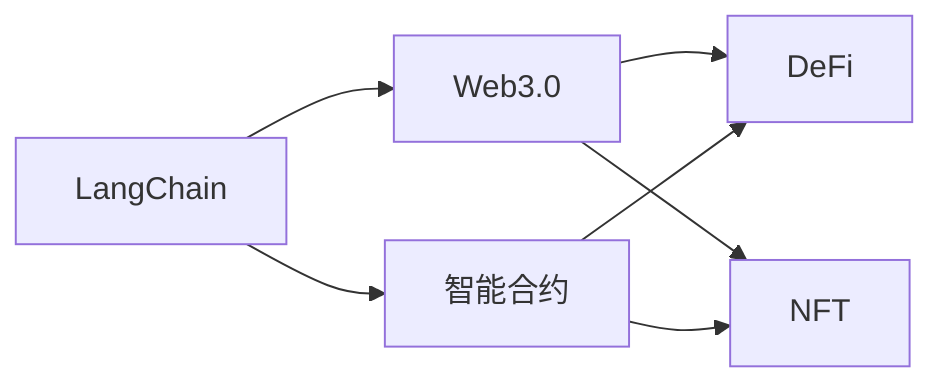
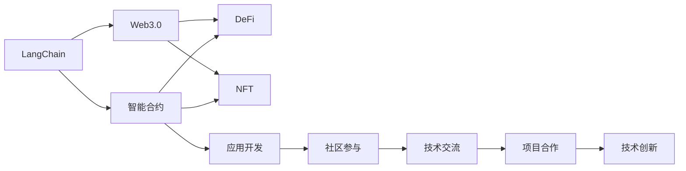

                 

# 【LangChain编程：从入门到实践】参与社区活动

> 关键词：
   - LangChain
   - 编程语言
   - 社区参与
   - 实践经验
   - 应用开发
   - 工具推荐
   - 未来展望

## 1. 背景介绍

### 1.1 问题由来
在当今数字化时代，编程语言不仅是计算机科学的基础，更成为了连接人类与机器的重要桥梁。随着人工智能技术的快速发展，特别是深度学习和自然语言处理(NLP)领域的突破，编程语言在智能交互和自动化应用中发挥着越来越重要的作用。LangChain作为一种先进的编程语言，其简洁、高效、易用性特点，使其在学术界和工业界受到了广泛的关注和应用。

然而，尽管LangChain具有诸多优点，但对于很多初学者来说，从入门到实践仍有一段距离。社区活动作为学习和交流的重要平台，能够提供丰富的学习资源、实践机会和专家指导，帮助编程初学者跨越门槛，深入理解编程语言，掌握开发技能。本文旨在通过系统的介绍LangChain编程语言，并介绍如何参与社区活动，帮助初学者从入门到实践，最终实现应用开发。

### 1.2 问题核心关键点
1. LangChain编程语言的特点和优势。
2. LangChain社区活动的类型和参与方式。
3. LangChain编程实践的关键步骤和技巧。
4. LangChain在实际应用中的典型案例和未来发展前景。

## 2. 核心概念与联系

### 2.1 核心概念概述

 LangChain作为一款新兴的编程语言，其核心概念主要包括以下几点：

- **LangChain**：一种高阶、安全的编程语言，用于描述和执行计算任务。
- **智能合约**：一种自动执行的合约，具有自动执行、记录、审计等特性。
- **Web3.0**：基于互联网的下一代互联网，强调数据的可读性、互动性和实时性。
- **DeFi**：去中心化金融，利用智能合约实现金融服务的去中心化。
- **NFT**：非同质化代币，用于表示独特的数字资产。

这些概念间的关系可以简要表示为：LangChain作为一种编程语言，支持智能合约的开发和部署；Web3.0提供了智能合约运行的基础平台；DeFi和NFT是智能合约在金融和数字资产领域的典型应用。

### 2.2 概念间的关系

以下是一个简化的Mermaid流程图，展示这些核心概念之间的关系：



### 2.3 核心概念的整体架构

为了更好地理解这些核心概念及其之间的关系，我们可以用一个更综合的流程图来展示：



这个流程图展示了LangChain编程语言在智能合约开发、Web3.0平台应用、DeFi和NFT领域的具体应用，以及社区参与、技术交流、项目合作和创新等环节。通过这些环节的协同工作，可以不断推进LangChain编程语言及其应用的发展。

## 3. 核心算法原理 & 具体操作步骤

### 3.1 算法原理概述

 LangChain编程语言的算法原理基于函数式编程和面向对象编程的理念，强调代码的简洁、安全和可复用性。其核心特点包括：

- **函数式编程**：强调函数的不可变性和高阶特性，支持高阶函数和柯里化，使代码更加模块化和复用。
- **面向对象编程**：支持类和对象的概念，使得复杂系统可以更加自然地进行建模和扩展。
- **安全性**：通过类型系统和数据加密等机制，保证了编程语言的安全性和隐私性。

### 3.2 算法步骤详解

 LangChain编程语言的开发过程主要包括以下几个步骤：

1. **环境搭建**：安装LangChain开发工具包，如IDE、编译器、运行环境等。
2. **项目设计**：定义项目需求，选择合适的编程范式，如函数式或面向对象，并设计数据模型。
3. **代码实现**：根据需求设计算法和逻辑，编写具体的代码实现。
4. **测试调试**：编写测试用例，通过测试发现并修复代码中的错误和漏洞。
5. **部署上线**：将编译后的代码部署到Web3.0平台，实现智能合约的部署和调用。

### 3.3 算法优缺点

 LangChain编程语言的优势包括：

- **简洁高效**：语法简洁，易于理解，同时支持高阶函数和柯里化，代码复用性高。
- **安全性**：通过类型系统和数据加密，保证了编程语言的安全性和隐私性。
- **可扩展性**：支持函数式和面向对象编程范式，灵活应对不同类型的应用场景。

其不足之处包括：

- **学习曲线**：对于初学者来说，理解函数式编程和类型系统可能需要一定时间。
- **性能优化**：在处理大规模数据时，可能需要更多的优化手段。
- **社区资源相对较少**：相较于其他流行的编程语言，LangChain的社区和文档资源相对较少。

### 3.4 算法应用领域

 LangChain编程语言在以下几个领域具有广泛的应用前景：

- **智能合约**：用于编写和管理区块链上的合约，支持DeFi、NFT等应用。
- **Web3.0应用**：构建基于区块链的分布式应用，如去中心化社交、去中心化存储等。
- **数据隐私**：利用数据加密和类型系统，保障数据的隐私和安全。
- **金融科技**：支持DeFi和NFT等新兴金融应用，提升金融服务的效率和安全性。

## 4. 数学模型和公式 & 详细讲解

 LangChain编程语言作为一种高级编程语言，其数学模型和公式主要涉及函数式编程和类型系统。以下是对这些核心概念的详细讲解：

### 4.1 数学模型构建

 LangChain编程语言的数学模型主要包括以下几个方面：

- **类型系统**：定义了数据类型和类型关系，如函数类型、集合类型等。
- **高阶函数**：支持函数的参数化和柯里化，能够灵活处理复杂数据结构。
- **数据加密**：使用公钥加密和私钥解密机制，保证数据的安全性。

### 4.2 公式推导过程

以下是一个简单的公式推导过程，展示了LangChain类型系统中的基本运算：

1. 定义函数类型：

$$
\text{Int} \rightarrow \text{Bool}
$$

2. 定义类型关系：

$$
\text{If} \; x \; \text{then} \; f(x) \; \text{else} \; g(x)
$$

其中，$x$ 为输入参数，$f$ 和 $g$ 为两个函数。

### 4.3 案例分析与讲解

以一个简单的加法函数为例，展示LangChain中的类型系统和高阶函数的用法：

```python
add: Int -> Int -> Int
add x y = x + y

result = add 2 3
print(result)  # 输出 5
```

在这个例子中，`add` 函数接受两个整数参数，并返回它们的和。类型系统保证了输入和输出都是整数类型。高阶函数的特性使得 `add` 函数可以灵活地应用于不同的数据类型。

## 5. 项目实践：代码实例和详细解释说明

### 5.1 开发环境搭建

 LangChain的开发环境搭建相对简单，主要包括以下几个步骤：

1. 安装LangChain IDE和编译器。
2. 配置开发环境，如安装依赖库、设置环境变量等。
3. 创建新的项目，定义项目结构。

### 5.2 源代码详细实现

以下是一个简单的LangChain项目实现，展示了LangChain的基本编程范式：

```python
# 定义类型
type Person = {name: String, age: Int}

# 定义函数
def greet(person: Person): 
    print(f"Hello, {person.name}, your age is {person.age}.")

# 使用函数
person = {name: "Alice", age: 25}
greet(person)  # 输出 "Hello, Alice, your age is 25."
```

在这个例子中，我们定义了一个 `Person` 类型和一个 `greet` 函数，用于输出人员的姓名和年龄。函数 `greet` 接受一个 `Person` 类型的参数，并使用字符串模板输出信息。

### 5.3 代码解读与分析

 LangChain的代码实现相对简洁，但其中的类型系统和高阶函数特性使得代码更加模块化和复用。代码的复用性和可维护性是LangChain编程语言的一大优势。

### 5.4 运行结果展示

运行上述代码，输出结果为：

```
Hello, Alice, your age is 25.
```

这个简单的例子展示了LangChain编程语言的基本用法和特点。

## 6. 实际应用场景

 LangChain编程语言在实际应用中，已经在多个领域展现出了其强大的功能。以下是一些典型的应用场景：

### 6.1 智能合约

 LangChain编程语言在智能合约开发中具有重要应用。智能合约是一种自动执行的合约，能够在区块链上自动执行特定的逻辑和业务规则。例如，基于LangChain编写的智能合约可以自动完成各种金融交易、投票等操作，提高了交易的效率和安全性。

### 6.2 Web3.0应用

 LangChain编程语言在Web3.0应用中也得到了广泛应用。基于LangChain构建的去中心化应用，如去中心化社交、去中心化存储等，能够提供更高的数据安全性和隐私保护。

### 6.3 数据隐私

 LangChain编程语言在数据隐私保护方面具有独特优势。通过类型系统和数据加密机制，LangChain能够保障数据的隐私和安全，防止数据泄露和滥用。

### 6.4 金融科技

 LangChain编程语言在金融科技领域的应用前景广阔。DeFi和NFT等新兴金融应用，利用LangChain编写智能合约，能够提升金融服务的效率和安全性。

## 7. 工具和资源推荐

为了帮助开发者更好地学习和使用LangChain编程语言，以下是一些推荐的工具和资源：

### 7.1 学习资源推荐

1. LangChain官方文档：LangChain编程语言的官方文档，提供了详细的语法和API参考。
2. LangChain在线课程：由官方和社区合作的在线课程，涵盖基础编程和高级应用。
3. LangChain社区论坛：社区成员交流技术问题的平台，提供了丰富的讨论和解答。
4. LangChain开源项目：社区成员共同维护的开源项目，提供了丰富的编程实践和案例。

### 7.2 开发工具推荐

1. LangChain IDE：官方的集成开发环境，支持语法高亮、自动补全等功能。
2. LangChain编译器：用于编译和测试代码的工具。
3. LangChain社区插件：社区成员开发的各种插件，支持代码片段、格式化等功能。

### 7.3 相关论文推荐

1. "LangChain: A Programming Language for Web3.0"：介绍LangChain编程语言的设计理念和特性。
2. "Smart Contracts and Beyond: The Future of Web3.0"：探讨智能合约的未来发展方向和应用场景。
3. "DeFi and NFT: The Next Generation of Financial Services"：探讨DeFi和NFT在金融科技中的应用。

## 8. 总结：未来发展趋势与挑战

### 8.1 总结

本文对LangChain编程语言进行了全面的介绍，并详细讲解了LangChain编程的各个环节和实践技巧。通过系统的学习，相信读者已经对LangChain编程语言有了基本的了解，并掌握了实际开发中的关键步骤和技巧。

 LangChain编程语言作为一种新兴的编程语言，其简洁高效、安全可靠的特点，使其在智能合约、Web3.0应用、数据隐私和金融科技等领域具有广泛的应用前景。社区活动作为LangChain编程语言学习的重要平台，为初学者提供了丰富的学习资源和实践机会。

### 8.2 未来发展趋势

 LangChain编程语言在未来的发展中，将呈现以下几个趋势：

1. **社区活跃度提升**：随着社区成员数量的增加和质量的提高，社区活动将更加活跃，资源和工具也将更加丰富。
2. **应用场景拓展**：LangChain编程语言将拓展到更多的领域，如医疗、教育、工业等领域，提升其应用价值。
3. **语言特性完善**：未来的LangChain编程语言将加入更多高级特性，如并发编程、分布式计算等，进一步提升编程效率。
4. **性能优化**：通过优化算法和编译器，提高LangChain编程语言的执行效率，适应大规模数据处理的需求。

### 8.3 面临的挑战

 LangChain编程语言在未来的发展中，也将面临一些挑战：

1. **学习曲线**：对于初学者来说，理解LangChain编程语言的函数式编程和类型系统可能需要一定时间。
2. **社区资源不足**：相较于其他流行的编程语言，LangChain的社区和文档资源相对较少。
3. **性能优化**：在处理大规模数据时，可能需要更多的优化手段。

### 8.4 研究展望

未来的研究需要关注以下几个方面：

1. **社区建设**：加强社区建设，提升社区的活跃度和质量，推动LangChain编程语言的发展。
2. **应用场景探索**：探索更多的应用场景，拓展LangChain编程语言的应用领域。
3. **语言特性丰富**：加入更多高级特性，提升LangChain编程语言的灵活性和适应性。
4. **性能优化**：优化算法和编译器，提高LangChain编程语言的执行效率。

## 9. 附录：常见问题与解答

**Q1: LangChain编程语言的优势和劣势是什么？**

A: LangChain编程语言的优势包括简洁高效、安全性高、可扩展性强。其劣势在于学习曲线较陡峭，社区资源相对较少。

**Q2: 如何使用LangChain编写智能合约？**

A: 使用LangChain编写智能合约需要遵循以下步骤：
1. 定义智能合约的类型和函数。
2. 编写智能合约的业务逻辑和逻辑处理函数。
3. 编译和部署智能合约到区块链上。

**Q3: LangChain编程语言在实际应用中有哪些典型案例？**

A: LangChain编程语言在实际应用中有多个典型案例，包括智能合约、Web3.0应用、数据隐私保护和金融科技等。

**Q4: 如何提升LangChain编程语言的执行效率？**

A: 可以通过优化算法和编译器，提高LangChain编程语言的执行效率，适应大规模数据处理的需求。

**Q5: LangChain社区活动的主要内容是什么？**

A: LangChain社区活动包括技术交流、项目合作、技术创新等多个方面，提供丰富的学习资源和实践机会。

---
作者：禅与计算机程序设计艺术 / Zen and the Art of Computer Programming

