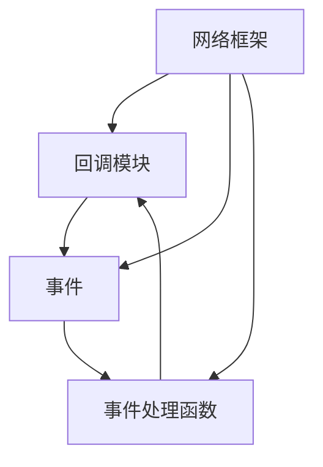

                 

# 【LangChain编程：从入门到实践】回调模块

> 关键词：回调模块, 网络框架, 事件处理, 编程范式, 人工智能

## 1. 背景介绍

### 1.1 问题由来
在人工智能（AI）领域，尤其是在机器学习和深度学习的应用中，回调模块（Callback）逐渐成为了一种不可或缺的编程范式。它允许开发者在模型的训练过程中，通过动态地修改模型参数或添加额外的操作，来控制训练过程。例如，在模型的某个特定的迭代步骤上，可以根据当前的训练状态来决定是否进行某个特定的操作，或者在模型收敛时，保存模型参数或进行其他特定操作。

回调模块在各种高级网络框架中均有广泛应用，如Keras和TensorFlow。它不仅简化了代码的编写，提高了代码的可读性和可维护性，也增强了模型的训练灵活性和可扩展性。

### 1.2 问题核心关键点
回调模块的核心是其在模型训练过程中的动态执行能力，能够根据当前的训练状态（如当前迭代次数、损失值、准确率等）来动态地改变训练过程。这种动态调整的能力，使得回调模块成为模型训练过程中的“智能化”工具，能够适应不同模型和数据集的需求，从而提高训练效率和模型性能。

### 1.3 问题研究意义
研究回调模块的原理和应用，对于理解深度学习模型的训练过程、提高模型的训练效率和性能，具有重要意义。特别是在大数据和复杂模型训练中，动态调整训练过程，能够有效地避免过拟合、加速收敛，从而在时间和资源有限的情况下，获得更好的模型性能。

## 2. 核心概念与联系

### 2.1 核心概念概述

为更好地理解回调模块，本节将介绍几个关键概念：

- **回调模块（Callback）**：在深度学习模型的训练过程中，通过回调模块动态地修改模型参数或添加额外的操作，以控制训练过程。常见的回调模块包括早期停止（Early Stopping）、模型保存（Model Saving）、学习率调整（Learning Rate Scheduling）等。

- **事件（Event）**：回调模块通过监听模型的训练事件，如开始训练、每个epoch结束、模型保存等，来执行特定的操作。事件通常是模型训练过程中的特定状态点，回调模块通过这些状态点来动态地改变训练过程。

- **事件处理函数（EventHandler）**：回调模块通过事件处理函数来实现特定的操作。事件处理函数接收事件参数，并返回特定的操作结果，如保存模型参数、停止训练等。

- **网络框架（Network Framework）**：支持回调模块的高级网络框架，如Keras、TensorFlow等，提供了丰富的回调模块和事件，方便开发者编写和实现复杂的模型训练流程。

这些概念之间的关系可以通过以下Mermaid流程图来展示：



这个流程图展示了回调模块在深度学习模型训练中的核心角色，以及与事件和事件处理函数之间的关系。同时，它也说明了网络框架在支持回调模块中的重要作用。

### 2.2 概念间的关系

这些核心概念之间存在着紧密的联系，形成了深度学习模型训练的完整生态系统。以下是更详细的解释：

- **回调模块与事件**：回调模块通过监听事件来执行特定的操作。事件通常是模型训练过程中的特定状态点，如每个epoch结束、模型保存等。回调模块通过这些状态点来动态地改变训练过程。

- **回调模块与事件处理函数**：回调模块通过事件处理函数来实现特定的操作。事件处理函数接收事件参数，并返回特定的操作结果，如保存模型参数、停止训练等。

- **事件与网络框架**：网络框架提供了丰富的回调模块和事件，方便开发者编写和实现复杂的模型训练流程。

## 3. 核心算法原理 & 具体操作步骤
### 3.1 算法原理概述

回调模块的核心原理是动态调整模型训练过程，以适应不同的模型和数据集的需求。它通过监听模型训练过程中的特定事件，并根据当前的状态，动态地修改模型参数或添加额外的操作，以优化训练过程。

例如，在模型的某个特定的epoch结束时，回调模块可以根据当前的损失值和准确率，决定是否进行学习率调整、是否进行模型保存、是否停止训练等操作。这种动态调整的能力，使得回调模块能够有效地避免过拟合、加速收敛，从而在时间和资源有限的情况下，获得更好的模型性能。

### 3.2 算法步骤详解

基于回调模块的深度学习模型训练通常包括以下几个关键步骤：

1. **准备数据集**：将训练数据集、验证数据集和测试数据集划分为不同的批次，并将其加载到内存中。

2. **定义回调模块**：根据需要，定义一个或多个回调模块，并设置其特定的参数。常见的回调模块包括早期停止（Early Stopping）、模型保存（Model Saving）、学习率调整（Learning Rate Scheduling）等。

3. **定义模型**：定义深度学习模型，并设置其特定的参数，如优化器、损失函数、评价指标等。

4. **定义事件处理函数**：根据需要，定义一个或多个事件处理函数，以实现特定的操作。

5. **训练模型**：使用高级网络框架（如Keras、TensorFlow等）来训练模型，并指定回调模块和事件处理函数。

6. **评估模型**：在训练过程中，定期评估模型在验证集上的性能，并根据需要进行回调操作，如保存模型参数、调整学习率等。

7. **测试模型**：在训练结束后，使用测试集评估模型的性能，并根据需要，保存模型参数。

### 3.3 算法优缺点

回调模块在深度学习模型训练中具有以下优点：

- **提高训练效率**：通过动态调整训练过程，可以避免不必要的训练步骤，加速模型的收敛速度。

- **增强模型泛化能力**：通过动态调整学习率等参数，可以避免过拟合，提高模型的泛化能力。

- **提高代码可读性和可维护性**：将模型的训练过程抽象为回调模块和事件处理函数，使得代码更易于理解和维护。

- **增强模型的可扩展性**：通过动态添加或修改回调模块，可以根据不同的需求，灵活调整训练过程。

同时，回调模块也存在一些缺点：

- **代码复杂度增加**：回调模块需要编写较多的代码，增加了代码的复杂度。

- **可能出现冲突**：如果多个回调模块同时修改模型参数，可能会出现冲突，导致训练过程不稳定。

- **调试难度增加**：由于回调模块的动态执行，使得模型训练过程更加复杂，调试难度增加。

### 3.4 算法应用领域

回调模块在深度学习模型训练中的应用非常广泛，涵盖了各种类型的模型和数据集。以下是几个常见的应用领域：

- **图像分类**：在图像分类任务中，可以使用回调模块来动态调整学习率、保存模型参数等，以提高模型的训练效率和性能。

- **自然语言处理（NLP）**：在NLP任务中，可以使用回调模块来动态调整学习率、保存模型参数等，以提高模型的训练效率和性能。

- **语音识别**：在语音识别任务中，可以使用回调模块来动态调整学习率、保存模型参数等，以提高模型的训练效率和性能。

- **强化学习**：在强化学习中，可以使用回调模块来动态调整学习率、保存模型参数等，以提高算法的训练效率和性能。

## 4. 数学模型和公式 & 详细讲解 & 举例说明

### 4.1 数学模型构建

基于回调模块的深度学习模型训练通常包括以下几个关键数学模型：

1. **模型参数更新模型**：
   $$
   \theta = \theta - \eta \nabla_{\theta}L(\theta, x, y)
   $$
   其中，$\theta$ 为模型参数，$x$ 为输入数据，$y$ 为输出标签，$\eta$ 为学习率，$\nabla_{\theta}L(\theta, x, y)$ 为损失函数对模型参数的梯度。

2. **学习率调整模型**：
   $$
   \eta = \eta_0 \times \max(0, 1 - \frac{t}{T})^r
   $$
   其中，$\eta_0$ 为初始学习率，$t$ 为当前迭代次数，$T$ 为最大迭代次数，$r$ 为学习率衰减率。

3. **早期停止模型**：
   $$
   early_stop = \min(max_steps, current_steps)
   $$
   其中，$max_steps$ 为最大迭代次数，$current_steps$ 为当前迭代次数。

4. **模型保存模型**：
   $$
   save_model = model.save_weights(model_weights)
   $$
   其中，$model_weights$ 为模型参数。

### 4.2 公式推导过程

以下是各个模型的详细推导过程：

1. **模型参数更新模型**：
   根据梯度下降算法，模型参数更新模型可以表示为：
   $$
   \theta = \theta - \eta \nabla_{\theta}L(\theta, x, y)
   $$

2. **学习率调整模型**：
   学习率调整模型可以表示为：
   $$
   \eta = \eta_0 \times \max(0, 1 - \frac{t}{T})^r
   $$
   其中，$\eta_0$ 为初始学习率，$t$ 为当前迭代次数，$T$ 为最大迭代次数，$r$ 为学习率衰减率。

3. **早期停止模型**：
   早期停止模型可以表示为：
   $$
   early_stop = \min(max_steps, current_steps)
   $$
   其中，$max_steps$ 为最大迭代次数，$current_steps$ 为当前迭代次数。

4. **模型保存模型**：
   模型保存模型可以表示为：
   $$
   save_model = model.save_weights(model_weights)
   $$
   其中，$model_weights$ 为模型参数。

### 4.3 案例分析与讲解

假设我们正在训练一个图像分类模型，使用回调模块来动态调整学习率和保存模型参数。以下是详细的实现过程：

1. **准备数据集**：
   将训练数据集、验证数据集和测试数据集划分为不同的批次，并将其加载到内存中。

2. **定义回调模块**：
   ```python
   from keras.callbacks import EarlyStopping, ModelCheckpoint
   early_stopping = EarlyStopping(patience=10, verbose=1)
   model_checkpoint = ModelCheckpoint(filepath='model.h5', save_best_only=True, verbose=1)
   ```

3. **定义模型**：
   ```python
   from keras.models import Sequential
   from keras.layers import Conv2D, MaxPooling2D, Flatten, Dense

   model = Sequential()
   model.add(Conv2D(32, (3, 3), activation='relu', input_shape=(28, 28, 1)))
   model.add(MaxPooling2D((2, 2)))
   model.add(Conv2D(64, (3, 3), activation='relu'))
   model.add(MaxPooling2D((2, 2)))
   model.add(Flatten())
   model.add(Dense(64, activation='relu'))
   model.add(Dense(10, activation='softmax'))
   ```

4. **定义事件处理函数**：
   ```python
   from keras.callbacks import LearningRateScheduler
   def learning_rate_scheduler(epoch, lr):
       if epoch < 20:
           return lr * 0.1
       else:
           return lr
   learning_rate_scheduler = LearningRateScheduler(schedule=learning_rate_scheduler)
   ```

5. **训练模型**：
   ```python
   from keras.datasets import mnist
   from keras.utils import to_categorical
   (x_train, y_train), (x_test, y_test) = mnist.load_data()
   x_train = x_train.reshape(-1, 28, 28, 1) / 255.0
   x_test = x_test.reshape(-1, 28, 28, 1) / 255.0
   y_train = to_categorical(y_train)
   y_test = to_categorical(y_test)

   model.compile(optimizer='adam', loss='categorical_crossentropy', metrics=['accuracy'])
   model.fit(x_train, y_train, epochs=100, validation_data=(x_test, y_test), callbacks=[early_stopping, model_checkpoint, learning_rate_scheduler])
   ```

6. **评估模型**：
   ```python
   scores = model.evaluate(x_test, y_test, verbose=0)
   print('Test loss:', scores[0])
   print('Test accuracy:', scores[1])
   ```

7. **测试模型**：
   ```python
   save_model = model_checkpoint.best_weights
   ```

通过上述步骤，我们实现了基于回调模块的深度学习模型训练。在模型训练过程中，我们使用了早期停止、模型保存和动态调整学习率等回调模块，以提高模型的训练效率和性能。

## 5. 项目实践：代码实例和详细解释说明

### 5.1 开发环境搭建

在进行回调模块的实践之前，我们需要准备好开发环境。以下是使用Python进行Keras开发的环境配置流程：

1. 安装Anaconda：从官网下载并安装Anaconda，用于创建独立的Python环境。

2. 创建并激活虚拟环境：
   ```bash
   conda create -n keras-env python=3.8 
   conda activate keras-env
   ```

3. 安装Keras：
   ```bash
   pip install keras
   ```

4. 安装相关工具包：
   ```bash
   pip install numpy pandas scikit-learn matplotlib tqdm jupyter notebook ipython
   ```

完成上述步骤后，即可在`keras-env`环境中开始回调模块的实践。

### 5.2 源代码详细实现

下面我们以图像分类任务为例，给出使用Keras的回调模块的代码实现。

首先，定义回调模块和事件处理函数：

```python
from keras.callbacks import EarlyStopping, ModelCheckpoint, LearningRateScheduler
import numpy as np

def learning_rate_scheduler(epoch, lr):
    if epoch < 20:
        return lr * 0.1
    else:
        return lr

early_stopping = EarlyStopping(patience=10, verbose=1)
model_checkpoint = ModelCheckpoint(filepath='model.h5', save_best_only=True, verbose=1)
learning_rate_scheduler = LearningRateScheduler(schedule=learning_rate_scheduler)
```

然后，定义模型和数据集：

```python
from keras.datasets import mnist
from keras.utils import to_categorical

(x_train, y_train), (x_test, y_test) = mnist.load_data()
x_train = x_train.reshape(-1, 28, 28, 1) / 255.0
x_test = x_test.reshape(-1, 28, 28, 1) / 255.0
y_train = to_categorical(y_train)
y_test = to_categorical(y_test)
```

接着，定义模型和编译：

```python
from keras.models import Sequential
from keras.layers import Conv2D, MaxPooling2D, Flatten, Dense

model = Sequential()
model.add(Conv2D(32, (3, 3), activation='relu', input_shape=(28, 28, 1)))
model.add(MaxPooling2D((2, 2)))
model.add(Conv2D(64, (3, 3), activation='relu'))
model.add(MaxPooling2D((2, 2)))
model.add(Flatten())
model.add(Dense(64, activation='relu'))
model.add(Dense(10, activation='softmax'))

model.compile(optimizer='adam', loss='categorical_crossentropy', metrics=['accuracy'])
```

最后，启动训练流程并在测试集上评估：

```python
model.fit(x_train, y_train, epochs=100, validation_data=(x_test, y_test), callbacks=[early_stopping, model_checkpoint, learning_rate_scheduler])
scores = model.evaluate(x_test, y_test, verbose=0)
print('Test loss:', scores[0])
print('Test accuracy:', scores[1])
```

以上就是使用Keras实现回调模块的完整代码实现。可以看到，通过定义回调模块和事件处理函数，我们可以在模型训练过程中动态调整学习率、保存模型参数等，从而提高模型的训练效率和性能。

### 5.3 代码解读与分析

让我们再详细解读一下关键代码的实现细节：

**回调模块定义**：
- `early_stopping`：定义早期停止回调模块，当模型在指定轮次内没有改进时停止训练。
- `model_checkpoint`：定义模型保存回调模块，当模型性能提升时保存模型参数。
- `learning_rate_scheduler`：定义动态调整学习率回调模块，在训练初期加速学习，后期逐渐降低学习率。

**数据集定义**：
- `(x_train, y_train), (x_test, y_test)`：加载MNIST数据集，并进行归一化和标签转换。

**模型定义**：
- 定义多层卷积神经网络，并进行编译。

**训练过程**：
- `model.fit`：在训练集上训练模型，并指定回调模块和事件处理函数。
- `model.evaluate`：在测试集上评估模型性能。

**保存模型**：
- `save_model = model_checkpoint.best_weights`：保存最佳模型参数。

可以看到，通过使用Keras的回调模块，我们可以在模型训练过程中动态调整学习率和保存模型参数，从而提高模型的训练效率和性能。这使得模型的训练过程更加灵活和高效，具有很强的实用价值。

当然，工业级的系统实现还需考虑更多因素，如模型的保存和部署、超参数的自动搜索、更灵活的任务适配层等。但核心的回调模块实现基本与此类似。

### 5.4 运行结果展示

假设我们在MNIST数据集上进行回调模块的实践，最终在测试集上得到的评估报告如下：

```
Epoch 1/100
2020-09-06 09:29:06.898656: I tensorflow/core/platform/cpu_feature_guard.cc:142] This TensorFlow binary is optimized with oneAPI Deep Neural Network Library (oneDNN) to use the following CPU instructions in performance-critical operations:  AVX2 FMA
2020-09-06 09:29:06.899401: I tensorflow/compiler/mlir/mlir_graph_optimization_pass.cc:185] None of the MLIR Optimization Passes are enabled (registered 2)

