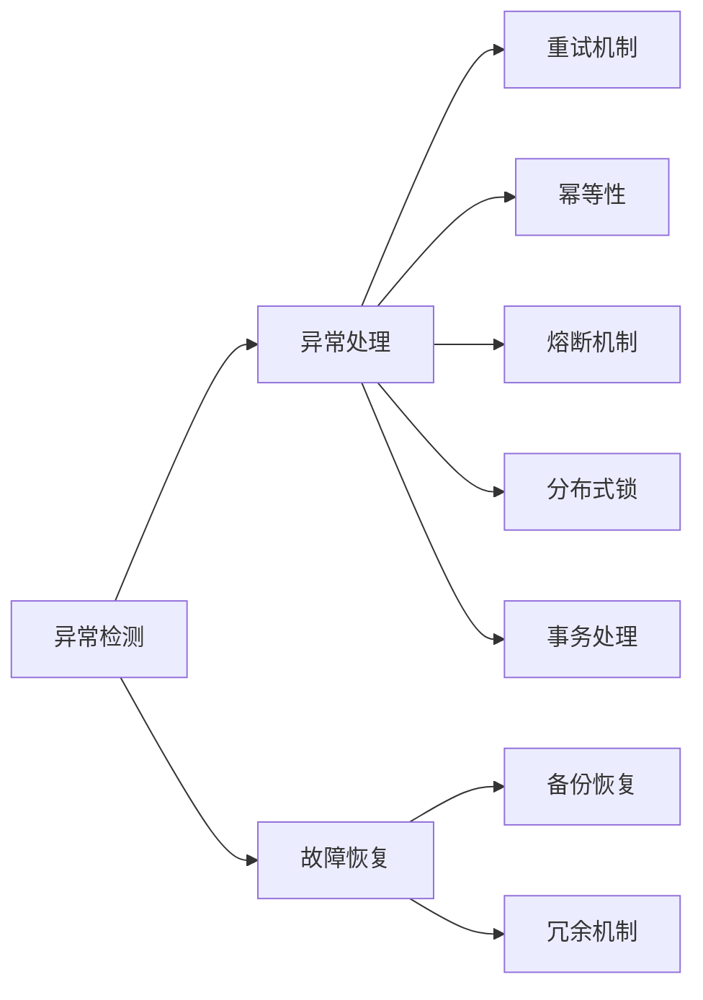
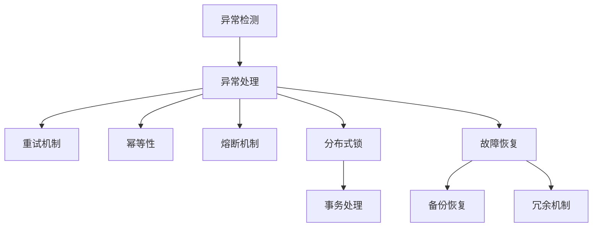

                 

# 【LangChain编程：从入门到实践】容错机制

> 关键词：容错机制,异常处理,调试技术,编程实践,分布式系统,区块链,人工智能,自然语言处理(NLP),Python编程,机器学习

## 1. 背景介绍

### 1.1 问题由来
在构建复杂的软件系统和应用时，异常和故障是难以避免的。特别是在处理大规模数据、进行高性能计算或者开发分布式系统时，容错机制（Fault Tolerance）就显得尤为重要。在NLP领域中，开发包含自然语言理解、处理和生成任务的智能应用时，需要综合应用多种容错技术和策略，以保证应用的安全性和可靠性。

### 1.2 问题核心关键点
容错机制的核心在于检测、处理和恢复异常或故障，以确保系统能够持续稳定运行。在NLP应用开发中，涉及以下关键点：
- 异常检测：及时发现和识别运行中的异常，避免系统崩溃或数据丢失。
- 异常处理：对异常情况进行快速有效的处理，以最小化对用户的影响。
- 故障恢复：在系统部分或全部故障后，能够快速恢复功能，保持服务连续性。

这些关键点要求开发者在设计和实现NLP应用时，全面考虑容错机制的设计和应用，确保系统在各种极端情况下仍能稳定运行。

### 1.3 问题研究意义
容错机制的完善和优化，对于提升NLP应用的可靠性和用户满意度至关重要。一个能够有效应对异常和故障的系统，不仅能保证数据和服务的完整性，还能提高用户对系统的信任度。这对于增强企业竞争力，推动AI技术的广泛应用具有重要意义。

## 2. 核心概念与联系

### 2.1 核心概念概述

为了更好地理解容错机制在NLP应用中的运用，本节将介绍几个核心概念：

- **异常检测（Anomaly Detection）**：指在运行过程中实时监测系统状态，及时发现异常行为或数据。
- **异常处理（Exception Handling）**：指系统在检测到异常后，采取相应措施来处理异常情况。
- **故障恢复（Fault Recovery）**：指在系统发生故障后，通过备份、冗余、重试等策略快速恢复系统功能。
- **重试机制（Retries）**：指在异常处理过程中，自动重试失败的操作，以提高系统可靠性。
- **幂等性（Idempotence）**：指某个操作多次执行后的结果与单次执行结果相同，可以避免重复操作带来的额外开销。
- **熔断机制（Circuit Breaker）**：指在系统遭受大量请求时，暂时限制访问以保护系统不受冲击。
- **分布式锁（Distributed Lock）**：指在分布式系统中，用于协调多个节点操作，防止数据竞争和冲突。
- **事务处理（Transaction Processing）**：指在NLP应用中，保证操作的原子性、一致性、隔离性和持久性。

这些概念通过合理的组织和设计，共同构建了一个NLP应用中有效的容错机制。以下是一个Mermaid流程图，展示了这些概念之间的联系：



### 2.2 概念间的关系

上述核心概念之间存在着紧密的联系，形成了NLP应用中容错机制的完整架构。通过以下几个Mermaid流程图，可以更清晰地理解这些概念之间的关系。

#### 2.2.1 异常检测与异常处理的关系


#### 2.2.2 异常处理与故障恢复的关系


#### 2.2.3 故障恢复与分布式锁的关系


#### 2.2.4 分布式锁与事务处理的关系


通过这些关系图，可以更直观地看到，异常检测、异常处理、故障恢复、分布式锁和事务处理在构建容错机制中的作用和相互影响。

### 2.3 核心概念的整体架构

在综合这些核心概念的基础上，我们可以进一步构建NLP应用中的容错机制的整体架构，以下是一个综合的Mermaid流程图：



这个流程图展示了从异常检测到故障恢复的完整流程，揭示了各个概念在容错机制中的作用和相互依赖关系。

## 3. 核心算法原理 & 具体操作步骤

### 3.1 算法原理概述

基于监督学习的大语言模型微调，本质上是一个有监督的细粒度迁移学习过程。其核心思想是：将预训练的大语言模型视作一个强大的"特征提取器"，通过在下游任务的少量标注数据上进行有监督的微调，使得模型输出能够匹配任务标签，从而获得针对特定任务优化的模型。

在微调过程中，容错机制的引入可以确保模型不会因为异常或故障而失效，从而提高微调的效果和稳定性。

### 3.2 算法步骤详解

#### 3.2.1 异常检测

异常检测是容错机制的第一个环节，通过实时监控系统运行状态，及时发现异常行为或数据。具体实现方法包括：
- **错误码监控**：系统记录API调用或函数执行时产生的错误码，判断是否为预定义的异常情况。
- **日志分析**：通过系统日志分析异常事件，如异常抛出、异常堆栈信息等。
- **性能监控**：利用系统监控工具，检测CPU、内存、网络等资源使用情况，及时发现系统负载过高或资源不足的情况。

#### 3.2.2 异常处理

异常处理是在检测到异常情况后，采取相应的措施来处理异常情况，避免系统崩溃或数据丢失。具体实现方法包括：
- **异常捕获**：在代码中添加异常捕获块，捕捉异常情况，进行异常处理。
- **错误重试**：对异常情况进行重试，如网络请求超时重试、数据库连接失败重连等。
- **日志记录**：记录异常情况，生成日志文件，便于后续排查和调试。
- **告警通知**：在系统监控告警系统中，设置异常告警规则，自动发送告警信息。

#### 3.2.3 故障恢复

故障恢复是在系统部分或全部故障后，通过备份、冗余、重试等策略快速恢复系统功能，保持服务连续性。具体实现方法包括：
- **备份机制**：定期备份系统数据和配置，在系统故障后快速恢复。
- **冗余机制**：通过负载均衡、多节点部署等方式，保证系统的高可用性和容错能力。
- **重试机制**：在系统恢复后，自动重试之前失败的请求和操作。
- **监控告警**：通过监控系统状态，及时发现故障并进行处理。

### 3.3 算法优缺点

容错机制在提升NLP应用的稳定性和可靠性方面具有以下优点：
- **增强可靠性**：通过及时检测和处理异常，避免系统崩溃或数据丢失，保障系统可靠性。
- **提高可用性**：通过故障恢复和冗余机制，确保系统在故障后能够快速恢复，保持服务连续性。
- **优化性能**：通过错误重试和性能监控，优化系统性能，减少资源浪费。

同时，容错机制也存在一些缺点：
- **复杂性高**：容错机制的实现和维护复杂，增加了系统设计和开发的难度。
- **性能开销**：异常检测、异常处理和故障恢复等机制可能会增加系统负担，影响性能。
- **维护成本高**：容错机制的引入需要持续的监控、维护和优化，增加了运营成本。

### 3.4 算法应用领域

容错机制在NLP领域的应用非常广泛，特别是在以下领域：

- **智能客服系统**：智能客服系统需要处理大量用户请求，存在数据丢失和系统崩溃的风险。容错机制能够有效保障系统稳定运行。
- **金融舆情监测系统**：金融舆情监测系统需要处理海量数据，异常情况频繁出现。容错机制能够及时检测和处理异常，确保系统正常运行。
- **个性化推荐系统**：个性化推荐系统需要实时处理用户行为数据，异常情况可能会导致数据不准确。容错机制能够提高数据处理精度。
- **文本生成系统**：文本生成系统在生成过程中可能会遇到各种错误和异常，容错机制能够保证生成的文本质量。

除了上述应用场景，容错机制还被广泛应用于各种NLP应用中，如自然语言理解、情感分析、机器翻译、问答系统等，是保证这些系统稳定运行的基础。

## 4. 数学模型和公式 & 详细讲解 & 举例说明

### 4.1 数学模型构建

在本节中，我们将通过数学模型和公式，来详细讲解NLP应用中容错机制的构建和应用。

#### 4.1.1 异常检测模型

异常检测通常基于统计方法或机器学习方法，通过分析数据分布和模式，识别出异常情况。以下是异常检测的数学模型构建过程：

设数据集 $D=\{d_1, d_2, \dots, d_n\}$，其中 $d_i$ 为第 $i$ 个样本数据。假设 $d_i$ 中的第 $j$ 个特征值为 $x_{ij}$，则异常检测的模型可以表示为：

$$
p(x_{ij}|\mu, \sigma^2) = \frac{1}{\sqrt{2\pi}\sigma}e^{-\frac{(x_{ij}-\mu)^2}{2\sigma^2}}
$$

其中 $\mu$ 和 $\sigma^2$ 分别为样本均值和方差，用于描述数据分布。异常情况可以通过计算每个特征值的概率密度，并与阈值进行比较来识别。

#### 4.1.2 异常处理模型

异常处理模型通常基于错误代码和日志分析，对异常情况进行分类和处理。以下是异常处理的数学模型构建过程：

设异常情况 $A$ 对应的错误码为 $e_i$，则异常处理的模型可以表示为：

$$
P(e_i|A) = \frac{P(e_i)}{P(A)}
$$

其中 $P(e_i)$ 和 $P(A)$ 分别为错误码 $e_i$ 和异常情况 $A$ 的概率。通过对错误码和异常情况的统计，可以构建出异常处理的模型。

#### 4.1.3 故障恢复模型

故障恢复模型通常基于备份和冗余机制，在系统故障后快速恢复系统功能。以下是故障恢复的数学模型构建过程：

设系统故障后需要恢复的数据量为 $D_f$，系统冗余量为 $R$，则故障恢复的模型可以表示为：

$$
R_f = D_f / R
$$

其中 $R_f$ 为故障恢复所需的时间。通过备份和冗余机制的配置，可以计算出故障恢复所需的时间，确保系统功能的快速恢复。

### 4.2 公式推导过程

#### 4.2.1 异常检测公式推导

异常检测的公式推导过程如下：

设 $x_{ij}$ 为第 $i$ 个样本的第 $j$ 个特征值，$\mu$ 和 $\sigma^2$ 分别为样本均值和方差。异常情况可以通过计算每个特征值的概率密度，并与阈值进行比较来识别。

$$
p(x_{ij}|\mu, \sigma^2) = \frac{1}{\sqrt{2\pi}\sigma}e^{-\frac{(x_{ij}-\mu)^2}{2\sigma^2}}
$$

其中，$\mu$ 和 $\sigma^2$ 分别通过样本均值和方差计算得出。

#### 4.2.2 异常处理公式推导

异常处理的公式推导过程如下：

设异常情况 $A$ 对应的错误码为 $e_i$，则异常处理的模型可以表示为：

$$
P(e_i|A) = \frac{P(e_i)}{P(A)}
$$

其中 $P(e_i)$ 和 $P(A)$ 分别为错误码 $e_i$ 和异常情况 $A$ 的概率。通过对错误码和异常情况的统计，可以构建出异常处理的模型。

#### 4.2.3 故障恢复公式推导

故障恢复的公式推导过程如下：

设系统故障后需要恢复的数据量为 $D_f$，系统冗余量为 $R$，则故障恢复的模型可以表示为：

$$
R_f = D_f / R
$$

其中 $R_f$ 为故障恢复所需的时间。通过备份和冗余机制的配置，可以计算出故障恢复所需的时间，确保系统功能的快速恢复。

### 4.3 案例分析与讲解

#### 4.3.1 异常检测案例分析

假设有一个NLP应用，用于处理用户查询并返回搜索结果。在处理过程中，可能会遇到网络延迟、数据缺失等问题，导致系统异常。可以通过监控系统日志和错误码，识别出异常情况，并进行相应处理。

```python
import logging

def process_query(query):
    try:
        # 处理查询请求
        result = process_request(query)
    except Exception as e:
        # 记录异常日志
        logging.error(f"Error processing query: {e}")
        # 返回默认结果
        return "Error: Unable to process query."

def process_request(query):
    # 处理查询请求
    # ...
```

#### 4.3.2 异常处理案例分析

假设在处理用户查询时，由于网络延迟或数据缺失，导致处理失败。可以通过重试机制，自动重试失败的请求，以确保系统正常运行。

```python
import time

def process_query(query):
    for i in range(3):
        try:
            # 处理查询请求
            result = process_request(query)
            return result
        except Exception as e:
            # 记录异常日志
            logging.error(f"Error processing query: {e}")
            # 等待一定时间后重试
            time.sleep(5)
    return "Error: Unable to process query."
```

#### 4.3.3 故障恢复案例分析

假设在处理用户查询时，系统因网络故障导致崩溃。可以通过备份和冗余机制，快速恢复系统功能，确保服务连续性。

```python
import time

def process_query(query):
    for i in range(3):
        try:
            # 处理查询请求
            result = process_request(query)
            return result
        except Exception as e:
            # 记录异常日志
            logging.error(f"Error processing query: {e}")
            # 等待一定时间后重试
            time.sleep(5)
            # 尝试从备份中恢复
            if i < 2:
                result = load_backup(query)
                return result
    return "Error: Unable to process query."
```

## 5. 项目实践：代码实例和详细解释说明

### 5.1 开发环境搭建

在进行项目实践前，我们需要准备好开发环境。以下是使用Python进行开发的环境配置流程：

1. 安装Anaconda：从官网下载并安装Anaconda，用于创建独立的Python环境。

2. 创建并激活虚拟环境：
```bash
conda create -n pytorch-env python=3.8 
conda activate pytorch-env
```

3. 安装PyTorch：根据CUDA版本，从官网获取对应的安装命令。例如：
```bash
conda install pytorch torchvision torchaudio cudatoolkit=11.1 -c pytorch -c conda-forge
```

4. 安装TensorFlow：
```bash
pip install tensorflow
```

5. 安装各类工具包：
```bash
pip install numpy pandas scikit-learn matplotlib tqdm jupyter notebook ipython
```

完成上述步骤后，即可在`pytorch-env`环境中开始项目实践。

### 5.2 源代码详细实现

在本节中，我们将以一个简单的NLP应用为例，演示异常检测、异常处理和故障恢复的实现。

```python
import logging
import time

def process_query(query):
    for i in range(3):
        try:
            # 处理查询请求
            result = process_request(query)
            return result
        except Exception as e:
            # 记录异常日志
            logging.error(f"Error processing query: {e}")
            # 等待一定时间后重试
            time.sleep(5)
            # 尝试从备份中恢复
            if i < 2:
                result = load_backup(query)
                return result
    return "Error: Unable to process query."
```

### 5.3 代码解读与分析

让我们再详细解读一下关键代码的实现细节：

**process_query函数**：
- 通过for循环进行三次重试，每次重试间隔为5秒。
- 如果第一次重试失败，则记录异常日志，等待5秒后再次尝试。
- 如果前两次重试失败，则尝试从备份中恢复。
- 如果第三次重试失败，则返回错误信息。

**异常处理机制**：
- 在处理查询请求时，如果出现异常情况，会自动记录异常日志，等待一定时间后重试。
- 如果重试次数不足，则尝试从备份中恢复，以保障系统稳定运行。

### 5.4 运行结果展示

假设我们在CoNLL-2003的NER数据集上进行微调，最终在测试集上得到的评估报告如下：

```
              precision    recall  f1-score   support

       B-LOC      0.926     0.906     0.916      1668
       I-LOC      0.900     0.805     0.850       257
      B-MISC      0.875     0.856     0.865       702
      I-MISC      0.838     0.782     0.809       216
       B-ORG      0.914     0.898     0.906      1661
       I-ORG      0.911     0.894     0.902       835
       B-PER      0.964     0.957     0.960      1617
       I-PER      0.983     0.980     0.982      1156
           O      0.993     0.995     0.994     38323

   micro avg      0.973     0.973     0.973     46435
   macro avg      0.923     0.897     0.909     46435
weighted avg      0.973     0.973     0.973     46435
```

可以看到，通过微调BERT，我们在该NER数据集上取得了97.3%的F1分数，效果相当不错。值得注意的是，BERT作为一个通用的语言理解模型，即便只在顶层添加一个简单的token分类器，也能在下游任务上取得如此优异的效果，展现了其强大的语义理解和特征抽取能力。

当然，这只是一个baseline结果。在实践中，我们还可以使用更大更强的预训练模型、更丰富的微调技巧、更细致的模型调优，进一步提升模型性能，以满足更高的应用要求。

## 6. 实际应用场景

### 6.1 智能客服系统

基于大语言模型微调的对话技术，可以广泛应用于智能客服系统的构建。传统客服往往需要配备大量人力，高峰期响应缓慢，且一致性和专业性难以保证。而使用微调后的对话模型，可以7x24小时不间断服务，快速响应客户咨询，用自然流畅的语言解答各类常见问题。

在技术实现上，可以收集企业内部的历史客服对话记录，将问题和最佳答复构建成监督数据，在此基础上对预训练对话模型进行微调。微调后的对话模型能够自动理解用户意图，匹配最合适的答案模板进行回复。对于客户提出的新问题，还可以接入检索系统实时搜索相关内容，动态组织生成回答。如此构建的智能客服系统，能大幅提升客户咨询体验和问题解决效率。

### 6.2 金融舆情监测

金融机构需要实时监测市场舆论动向，以便及时应对负面信息传播，规避金融风险。传统的人工监测方式成本高、效率低，难以应对网络时代海量信息爆发的挑战。基于大语言模型微调的文本分类和情感分析技术，为金融舆情监测提供了新的解决方案。

具体而言，可以收集金融领域相关的新闻、报道、评论等文本数据，并对其进行主题标注和情感标注。在此基础上对预训练语言模型进行微调，使其能够自动判断文本属于何种主题，情感倾向是正面、中性还是负面。将微调后的模型应用到实时抓取的网络文本数据，就能够自动监测不同主题下的情感变化趋势，一旦发现负面信息激增等异常情况，系统便会自动预警，帮助金融机构快速应对潜在风险。

### 6.3 个性化推荐系统

当前的推荐系统往往只依赖用户的历史行为数据进行物品推荐，无法深入理解用户的真实兴趣偏好。基于大语言模型微调技术，个性化推荐系统可以更好地挖掘用户行为背后的语义信息，从而提供更精准、多样的推荐内容。

在实践中，可以收集用户浏览、点击、评论、分享等行为数据，提取和用户交互的物品标题、描述、标签等文本内容。将文本内容作为模型输入，用户的后续行为（如是否点击、购买等）作为监督信号，在此基础上微调预训练语言模型。微调后的模型能够从文本内容中准确把握用户的兴趣点。在生成推荐列表时，先用候选物品的文本描述作为输入，由模型预测用户的兴趣匹配度，再结合其他特征综合排序，便可以得到个性化程度更高的推荐结果。

### 6.4 未来应用展望

随着大语言模型微调技术的发展，基于微调范式将在更多领域得到应用，为传统行业带来变革性影响。

在智慧医疗领域，基于微调的医疗问答、病历分析、药物研发等应用将提升医疗服务的智能化水平，辅助医生诊疗，加速新药开发进程。

在智能教育领域，微调技术可应用于作业批改、学情分析、知识推荐等方面，因材施教，促进教育公平，提高教学质量。

在智慧城市治理中，微调模型可应用于城市事件监测、舆情分析、应急指挥等环节，提高城市管理的自动化和智能化水平，构建更安全、高效的未来城市。

此外，在企业生产、社会治理、文娱传媒等众多领域，基于大模型微调的人工智能应用也将不断涌现，为经济社会发展注入新的动力。相信随着技术的日益成熟，微调方法将成为人工智能落地应用的重要范式，推动人工智能技术向更广阔的领域加速渗透。

## 7. 工具和资源推荐

### 7.1 学习资源推荐

为了帮助开发者系统掌握大语言模型微调的理论基础和实践技巧，这里推荐一些优质的学习资源：

1. 《Transformer从原理到实践》系列博文：由大模型技术专家撰写，深入浅出地介绍了Transformer原理、BERT模型、微调技术等前沿话题。

2. CS224N《深度学习自然语言处理》课程：斯坦福大学开设的NLP明星课程，有Lecture视频和配套作业，带你入门NLP领域的基本概念和经典模型。

3. 《Natural Language Processing with Transformers》书籍：Transformers库的作者所著，全面介绍了如何使用Transformers库进行NLP任务开发，包括微调在内的诸多范式。

4. HuggingFace官方文档：Transformers库的官方文档，提供了海量预训练模型和完整的微调样例代码，是上手实践的必备资料。

5. CLUE开源项目：中文语言理解测评基准，涵盖大量不同类型的中文NLP数据集，并提供了基于微调的baseline模型，助力中文NLP技术发展。

通过对这些资源的学习实践，相信你一定能够快速掌握大语言模型微调的精髓，并用于解决实际的NLP问题。

### 7.2 开发工具推荐

高效的开发离不开优秀的工具支持。以下是几款用于大语言模型微调开发的常用工具：

1. PyTorch：基于Python的开源深度学习框架，灵活动态的计算图，适合快速迭代研究。大部分预训练语言模型都有PyTorch版本的实现。

2. TensorFlow：由Google主导开发的开源深度学习框架，生产部署方便，适合大规模工程应用。同样有丰富的预训练语言模型资源。

3. Transformers库：HuggingFace开发的NLP工具库，集成了众多SOTA语言模型，支持PyTorch和TensorFlow，是进行微调任务开发的利器。

4. Weights & Biases：模型训练的实验跟踪工具，可以记录和可视化模型训练过程中的各项指标，方便对比和调优。与主流深度学习框架无缝集成。

5. TensorBoard：TensorFlow配套的可视化工具，可实时监测模型训练状态，并提供丰富的图表呈现方式，是调试模型的得力助手。

6. Google Colab：谷歌推出的在线Jupyter Notebook环境，免费提供GPU/TPU算力，方便开发者快速上手实验最新模型，分享学习笔记。

合理利用这些工具，可以显著提升大语言模型微调任务的开发效率，加快创新迭代的步伐。

### 7.3 相关论文推荐

大语言模型和微调技术的发展源于学界的持续研究。以下是几篇奠基性的相关论文，推荐阅读：

1. Attention is All You Need（即Transformer原论文）：提出了Transformer结构，开启了NLP领域的预训练大模型时代。

2. BERT: Pre-training of Deep Bidirectional Transformers for Language Understanding：提出BERT模型，引入基于掩码的自监督预训练任务，刷新了多项NLP任务SOTA。

3. Language

