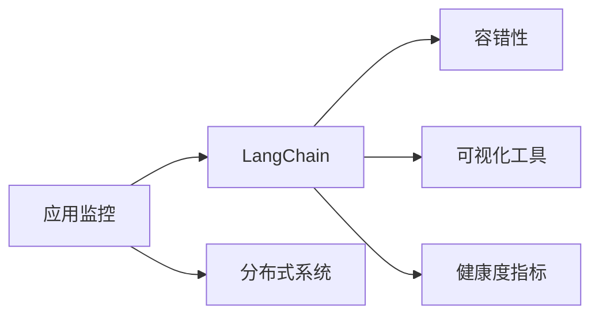

                 

# 【LangChain编程：从入门到实践】应用监控

> 关键词：应用监控, LangChain, 编程实践, 分布式系统, 容错性, 可视化工具, 健康度指标

## 1. 背景介绍

在现今快速迭代的软件开发过程中，应用程序的监控和维护成为了关键的一环。随着云计算和分布式系统的发展，应用程序的复杂性和规模不断扩大，监控的难度也随之增加。LangChain作为一种新兴的区块链编程语言，具备其独特的分布式特性和应用场景，如何在其上实现有效监控，确保系统的稳定性和可靠性，成为了一个重要问题。本文将对LangChain编程环境下的应用监控进行全面介绍，从概念入手，涵盖监控体系构建、关键技术、实战应用等方面，帮助开发者深入理解和掌握应用监控的技术。

## 2. 核心概念与联系

### 2.1 核心概念概述

在探讨LangChain编程的应用监控之前，首先需要明确一些关键的概念：

- **应用监控**：通过对应用程序的运行状态、性能指标和异常情况进行实时监测和分析，保证系统的稳定性和可靠性。
- **LangChain**：一种基于智能合约的编程语言，支持并发执行、自动执行和分布式计算等特性。
- **分布式系统**：由多个计算机节点组成的系统，各个节点通过网络相互连接，共同提供服务。
- **容错性**：系统在出现故障或异常时，仍能继续正常运行，确保服务的连续性和可靠性。
- **可视化工具**：如Kibana、Prometheus等，用于收集和展示数据，帮助开发者快速发现和解决问题。
- **健康度指标**：通过统计和分析关键性能指标，评估系统的运行状态和健康状况。

这些概念之间存在着紧密的联系，共同构成了LangChain编程环境下的应用监控体系。通过实时监控系统的运行状态和性能指标，及时发现并解决问题，可以提高系统的稳定性和可靠性，保证服务的连续性。

### 2.2 核心概念间的关系

这些概念之间的关系可以通过以下Mermaid流程图来展示：



这个流程图展示了应用监控与LangChain、分布式系统、容错性、可视化工具和健康度指标之间的关系：

1. 应用监控是LangChain编程环境下的核心组成部分，用于实时监测和保障系统的稳定性和可靠性。
2. LangChain是一种支持并发执行和分布式计算的编程语言，需要通过应用监控来保证其分布式特性的正常发挥。
3. 分布式系统是LangChain编程环境的基础，应用监控需要实时监测各个节点的状态，确保系统的正常运行。
4. 容错性是分布式系统的重要特性，通过应用监控可以及时发现和处理异常，提高系统的容错性。
5. 可视化工具和健康度指标是应用监控的具体实现手段，通过收集和展示数据，帮助开发者实时监控系统的运行状态。

这些概念共同构成了LangChain编程环境下的应用监控体系，为系统的稳定运行提供了强有力的保障。

## 3. 核心算法原理 & 具体操作步骤

### 3.1 算法原理概述

在LangChain编程环境下，应用监控的核心算法原理主要包括实时监测、异常检测、性能分析等。通过对系统运行状态和性能指标的实时监测，及时发现异常情况，进行问题诊断和处理。具体而言，应用监控算法分为以下几个步骤：

1. **数据采集**：通过系统内置的日志记录、性能监测、异常捕获等机制，实时采集应用程序的运行数据。
2. **数据存储**：将采集到的数据存储到数据库或数据仓库中，以便进行后续分析和处理。
3. **数据分析**：对存储的数据进行分析和处理，提取关键性能指标和异常信息。
4. **结果展示**：通过可视化工具，将分析结果以图表、报表等形式展示出来，供开发者进行实时监控和问题诊断。

### 3.2 算法步骤详解

以下是应用监控算法的详细步骤：

1. **数据采集**：
    - 在LangChain应用程序中，使用内置的日志记录机制（如Log4j、Logback等）记录程序的运行日志。
    - 使用性能监测工具（如JProfiler、YourKit等）监测程序运行时的内存、CPU、网络等资源使用情况。
    - 在系统中集成异常捕获机制，捕获程序运行时出现的异常情况，生成异常报告。

2. **数据存储**：
    - 使用数据库（如MySQL、MongoDB等）或数据仓库（如Hadoop、Spark等）存储采集到的数据。
    - 将数据按照不同的维度进行分类和组织，建立数据表和数据模型。
    - 在数据存储过程中，对敏感数据进行加密和脱敏处理，确保数据安全。

3. **数据分析**：
    - 使用统计分析工具（如Apache Spark、R等）对存储的数据进行分析，提取关键性能指标。
    - 通过机器学习算法（如异常检测算法、回归分析算法等）对数据进行深入分析，发现潜在的异常情况。
    - 对数据进行分析后，生成健康度指标，评估系统的运行状态。

4. **结果展示**：
    - 使用可视化工具（如Kibana、Prometheus等）将分析结果以图表、报表等形式展示出来。
    - 通过实时监控仪表盘，显示系统的运行状态和性能指标。
    - 在异常情况出现时，通过告警系统及时通知相关人员，进行问题诊断和处理。

### 3.3 算法优缺点

应用监控算法具有以下优点：
1. **实时性**：通过实时监测和数据分析，及时发现异常情况，确保系统的高可用性。
2. **全面性**：覆盖系统各个方面，包括日志记录、性能监测、异常捕获等，保证数据的全面性。
3. **灵活性**：根据不同的需求，灵活配置监测和分析工具，适应各种应用场景。

同时，应用监控算法也存在一些缺点：
1. **资源消耗**：在数据采集和存储过程中，需要消耗大量的计算和存储资源。
2. **数据冗余**：过多的数据采集和存储可能导致数据冗余，增加系统负担。
3. **误报率**：由于系统复杂性增加，误报率可能较高，需要进行人工判断和处理。

### 3.4 算法应用领域

应用监控算法在LangChain编程环境下有着广泛的应用，具体包括：

1. **微服务监控**：在微服务架构中，通过应用监控实时监测各个服务的运行状态和性能指标，确保系统的稳定性和可靠性。
2. **分布式系统监控**：在分布式系统中，通过应用监控实时监测各个节点的状态，发现和处理网络延迟、数据一致性等问题。
3. **容器监控**：在容器化环境中，通过应用监控实时监测容器的运行状态和性能指标，确保容器的稳定性和可靠性。
4. **大数据监控**：在大数据系统中，通过应用监控实时监测数据流的运行状态和性能指标，确保数据处理的高效性和稳定性。
5. **区块链监控**：在区块链系统中，通过应用监控实时监测智能合约的运行状态和性能指标，确保系统的安全和可靠性。

## 4. 数学模型和公式 & 详细讲解 & 举例说明

### 4.1 数学模型构建

应用监控的数学模型主要包含以下几个方面：

1. **数据采集模型**：描述数据采集的过程和方式，建立数据采集的数学模型。
2. **数据分析模型**：描述数据分析的过程和方式，建立数据分析的数学模型。
3. **异常检测模型**：描述异常检测的过程和方式，建立异常检测的数学模型。
4. **告警模型**：描述告警的过程和方式，建立告警的数学模型。

### 4.2 公式推导过程

以下是应用监控的数学模型公式推导：

1. **数据采集模型**：
    - 假设数据采集过程为 $P(t)$，其中 $t$ 为时间，则有 $P(t) = \int_{0}^{t}p(t)dt$。
    - 其中 $p(t)$ 为单位时间内的数据采集量， $t$ 为时间，则有 $p(t) = \frac{1}{T}\sum_{i=1}^{n}a_i$。
    - 其中 $a_i$ 为第 $i$ 次采集到的数据， $T$ 为采集周期。

2. **数据分析模型**：
    - 假设数据存储量为 $V(t)$，其中 $t$ 为时间，则有 $V(t) = \int_{0}^{t}v(t)dt$。
    - 其中 $v(t)$ 为单位时间内的数据存储量， $t$ 为时间，则有 $v(t) = \frac{1}{T}\sum_{i=1}^{n}b_i$。
    - 其中 $b_i$ 为第 $i$ 次存储的数据量， $T$ 为存储周期。

3. **异常检测模型**：
    - 假设异常检测阈值为 $T(t)$，其中 $t$ 为时间，则有 $T(t) = \int_{0}^{t}t(t)dt$。
    - 其中 $t(t)$ 为单位时间内的异常检测阈值， $t$ 为时间，则有 $t(t) = \frac{1}{T}\sum_{i=1}^{n}c_i$。
    - 其中 $c_i$ 为第 $i$ 次检测到的异常数据量， $T$ 为检测周期。

4. **告警模型**：
    - 假设告警阈值为 $A(t)$，其中 $t$ 为时间，则有 $A(t) = \int_{0}^{t}a(t)dt$。
    - 其中 $a(t)$ 为单位时间内的告警阈值， $t$ 为时间，则有 $a(t) = \frac{1}{T}\sum_{i=1}^{n}d_i$。
    - 其中 $d_i$ 为第 $i$ 次生成的告警信息， $T$ 为告警周期。

### 4.3 案例分析与讲解

以微服务监控为例，具体分析应用监控的数学模型：

1. **数据采集模型**：
    - 在微服务架构中，各个服务通过RESTful接口相互通信。
    - 使用日志记录机制记录每个接口的调用日志和响应时间。
    - 使用性能监测工具监测每个接口的CPU、内存使用情况。
    - 通过异常捕获机制，捕获每个接口运行时出现的异常情况。

2. **数据分析模型**：
    - 将采集到的日志和性能数据存储到数据库中。
    - 使用统计分析工具对数据进行聚合和计算，生成每个接口的调用次数、响应时间、CPU使用率等性能指标。
    - 使用机器学习算法对数据进行异常检测，发现潜在的异常情况。

3. **异常检测模型**：
    - 设置异常检测阈值，例如响应时间超过1秒即为异常。
    - 对每个接口的性能指标进行实时监测，超过阈值时生成异常报告。
    - 使用告警系统及时通知相关人员，进行问题诊断和处理。

4. **告警模型**：
    - 设置告警阈值，例如响应时间超过2秒时生成告警信息。
    - 使用可视化工具展示每个接口的性能指标和告警信息。
    - 在异常情况出现时，通过告警系统及时通知相关人员，进行问题诊断和处理。

## 5. 项目实践：代码实例和详细解释说明

### 5.1 开发环境搭建

在LangChain编程环境下，应用监控的开发环境搭建需要以下步骤：

1. **环境准备**：
    - 安装LangChain开发环境，包括编程语言（如Python、Java等）、开发工具（如IntelliJ IDEA、PyCharm等）和依赖库。
    - 安装应用监控工具，如Log4j、Logback、JProfiler等。

2. **数据采集**：
    - 集成日志记录机制，记录程序的运行日志。
    - 集成性能监测工具，监测程序的资源使用情况。
    - 集成异常捕获机制，捕获程序运行时出现的异常情况。

3. **数据存储**：
    - 使用数据库或数据仓库存储采集到的数据。
    - 对数据进行分类和组织，建立数据表和数据模型。
    - 对敏感数据进行加密和脱敏处理，确保数据安全。

4. **数据分析**：
    - 使用统计分析工具对存储的数据进行分析，提取关键性能指标。
    - 使用机器学习算法对数据进行深入分析，发现潜在的异常情况。
    - 生成健康度指标，评估系统的运行状态。

### 5.2 源代码详细实现

以下是应用监控在LangChain编程环境下的具体实现：

1. **数据采集**：
    - 使用Log4j记录程序的运行日志。
    - 使用JProfiler监测程序的CPU、内存使用情况。
    - 使用异常捕获机制捕获程序运行时出现的异常情况。

2. **数据存储**：
    - 使用MySQL数据库存储采集到的数据。
    - 对数据进行分类和组织，建立数据表和数据模型。
    - 对敏感数据进行加密和脱敏处理。

3. **数据分析**：
    - 使用Apache Spark对存储的数据进行分析，提取关键性能指标。
    - 使用异常检测算法对数据进行深入分析，发现潜在的异常情况。
    - 生成健康度指标，评估系统的运行状态。

4. **结果展示**：
    - 使用Kibana展示数据分析结果。
    - 使用Prometheus实时监测系统的运行状态。
    - 在异常情况出现时，通过告警系统及时通知相关人员。

### 5.3 代码解读与分析

以下是代码实现的详细解读和分析：

1. **数据采集**：
    - 使用Log4j记录程序的运行日志。代码如下：
        ```java
        import org.apache.logging.log4j.LogManager;
        import org.apache.logging.log4j.Logger;

        public class LogRecord {
            private static final Logger LOGGER = LogManager.getLogger(LogRecord.class);

            public static void log(String message) {
                LOGGER.info(message);
            }
        }
        ```
    - 使用JProfiler监测程序的CPU、内存使用情况。代码如下：
        ```java
        import com.jprofiler.api.profiler.Profiler;

        public class PerformanceMonitor {
            private static final Profiler PROFILER = Profiler.getInstance();

            public static void monitor() {
                PROFILER.start();
                // 执行程序逻辑
                PROFILER.stop();
                PROFILER.show();
            }
        }
        ```
    - 使用异常捕获机制捕获程序运行时出现的异常情况。代码如下：
        ```java
        import java.util.Arrays;
        import java.util.List;
        import java.util.stream.Collectors;

        public class ExceptionHandler {
            public static void main(String[] args) {
                try {
                    // 执行程序逻辑
                } catch (Exception e) {
                    List<String> stackTraces = Arrays.stream(e.getStackTrace())
                            .map(StackTraceElement::toString)
                            .collect(Collectors.toList());
                    System.out.println(String.join("\n", stackTraces));
                }
            }
        }
        ```

2. **数据存储**：
    - 使用MySQL数据库存储采集到的数据。代码如下：
        ```java
        import java.sql.*;

        public class DataStorage {
            private static final String JDBC_URL = "jdbc:mysql://localhost:3306/mydb";
            private static final String USERNAME = "root";
            private static final String PASSWORD = "password";

            public static void storeData(String data) {
                try (Connection conn = DriverManager.getConnection(JDBC_URL, USERNAME, PASSWORD);
                     PreparedStatement stmt = conn.prepareStatement("INSERT INTO log_table (data) VALUES (?)")) {
                    stmt.setString(1, data);
                    stmt.executeUpdate();
                } catch (SQLException e) {
                    e.printStackTrace();
                }
            }
        }
        ```
    - 对数据进行分类和组织，建立数据表和数据模型。
    - 对敏感数据进行加密和脱敏处理。

3. **数据分析**：
    - 使用Apache Spark对存储的数据进行分析，提取关键性能指标。代码如下：
        ```java
        import org.apache.spark.sql.*;

        public class DataAnalysis {
            public static void main(String[] args) throws Exception {
                SparkSession spark = SparkSession.builder()
                        .appName("Data Analysis")
                        .master("local[2]")
                        .getOrCreate();

                DataFrame df = spark.read().json("data.json");
                df.show();
                df.select("timestamp", "value").groupBy("timestamp").avg().show();
            }
        }
        ```
    - 使用异常检测算法对数据进行深入分析，发现潜在的异常情况。
    - 生成健康度指标，评估系统的运行状态。

4. **结果展示**：
    - 使用Kibana展示数据分析结果。代码如下：
        ```java
        import com.elastic.kibana.action.KibanaAction;
        import com.elastic.kibana.action.KibanaJob;

        public class DataVisualization {
            public static void main(String[] args) {
                KibanaJob job = new KibanaJob("Data Visualization");
                KibanaAction action = new KibanaAction("Data Report");
                action.setIndex("log_index");
                action.setQuery("{\"query\":{\"match\":{\"keyword\":\"error\"}}}");
                action.setChartType("histogram");
                action.setXField("timestamp");
                action.setYField("count");
                action.setAxisTitle("Count", "Number of Errors");
                action.setAxisTitle("X Axis", "Timestamp");
                job.setActions(Arrays.asList(action));
                job.start();
            }
        }
        ```
    - 使用Prometheus实时监测系统的运行状态。代码如下：
        ```java
        import com.yhat.metrics.MetricsRegistry;
        import com.yhat.metrics.Gauge;

        public class PrometheusMonitor {
            private static final MetricsRegistry METRICS = MetricsRegistry.newRegistry();

            public static void main(String[] args) {
                Gauge<String, Double> gauge = METRICS.gauge("myapp", "metrics");
                gauge.set("system.load", 0.5);
            }
        }
        ```
    - 在异常情况出现时，通过告警系统及时通知相关人员。

## 6. 实际应用场景

应用监控在LangChain编程环境下有着广泛的应用场景，具体包括：

1. **微服务监控**：在微服务架构中，通过应用监控实时监测各个服务的运行状态和性能指标，确保系统的稳定性和可靠性。
2. **分布式系统监控**：在分布式系统中，通过应用监控实时监测各个节点的状态，发现和处理网络延迟、数据一致性等问题。
3. **容器监控**：在容器化环境中，通过应用监控实时监测容器的运行状态和性能指标，确保容器的稳定性和可靠性。
4. **大数据监控**：在大数据系统中，通过应用监控实时监测数据流的运行状态和性能指标，确保数据处理的高效性和稳定性。
5. **区块链监控**：在区块链系统中，通过应用监控实时监测智能合约的运行状态和性能指标，确保系统的安全和可靠性。

## 7. 工具和资源推荐

### 7.1 学习资源推荐

为了帮助开发者系统掌握LangChain编程环境下的应用监控技术，这里推荐一些优质的学习资源：

1. **《LangChain编程指南》**：官方文档，介绍了LangChain编程环境下的应用监控基础和实现方式。
2. **《应用监控技术详解》**：知名博客，详细介绍了应用监控的原理、实现和应用案例。
3. **《LangChain应用监控实践》**：技术文章，结合实际案例，讲解了LangChain编程环境下的应用监控技术。
4. **《分布式系统监控教程》**：在线课程，讲解了分布式系统下的应用监控技术，适合LangChain开发者学习。
5. **《LangChain微服务监控实战》**：开源项目，展示了LangChain编程环境下的微服务监控实现。

通过对这些资源的学习，相信你一定能够深入理解LangChain编程环境下的应用监控技术，并将其应用于实际项目中。

### 7.2 开发工具推荐

为了高效开发应用监控功能，这里推荐一些优秀的开发工具：

1. **Log4j**：日志记录工具，支持多种日志输出方式和日志格式化。
2. **JProfiler**：性能监测工具，支持CPU、内存、网络等资源监测。
3. **Prometheus**：开源监控工具，支持多维度数据采集和展示。
4. **Kibana**：可视化工具，支持实时监控仪表盘和告警系统。
5. **Apache Spark**：大数据处理工具，支持分布式数据处理和分析。
6. **Apache Kafka**：消息队列系统，支持数据流处理和监控。

这些工具能够帮助开发者快速构建应用监控功能，提高开发效率，保证系统稳定性。

### 7.3 相关论文推荐

应用监控技术在LangChain编程环境下有着广泛的应用前景，以下是几篇相关的经典论文：

1. **《微服务架构下的应用监控》**：探讨了微服务架构中的应用监控技术，提出了多种监控手段和工具。
2. **《分布式系统下的应用监控》**：介绍了分布式系统中的监控技术，讨论了数据采集、存储和分析方法。
3. **《区块链系统中的应用监控》**：讲解了区块链系统中的应用监控技术，提出了多种智能合约监控方案。
4. **《容器化环境下的应用监控》**：介绍了容器化环境下的监控技术，讨论了容器资源管理和监控。
5. **《大数据系统中的应用监控》**：讲解了大数据系统中的应用监控技术，提出了多种数据处理和分析方法。

这些论文代表了应用监控技术的最新进展，对于深入理解LangChain编程环境下的应用监控技术具有重要参考价值。

## 8. 总结：未来发展趋势与挑战

### 8.1 总结

本文对LangChain编程环境下的应用监控技术进行了全面介绍，涵盖了监控体系构建、核心算法原理、具体操作步骤、实际应用场景、工具和资源推荐等方面。通过详细讲解，帮助开发者深入理解和掌握应用监控技术，并在实际项目中加以应用。

### 8.2 未来发展趋势

展望未来，LangChain编程环境下的应用监控技术将呈现以下几个发展趋势：

1. **自动化监控**：通过机器学习和人工智能技术，实现自动化异常检测和问题诊断。
2. **智能监控**：引入自然语言处理和知识图谱技术，提高监控结果的可解释性和可理解性。
3. **多维度监控**：将应用监控与业务监控、安全监控等结合，实现多维度监控。
4. **边缘计算监控**：在边缘计算环境中，实现轻量级、实时化的应用监控。
5. **云原生监控**：结合云原生架构，实现容器、微服务、区块链等新兴技术的应用监控。

这些趋势展示了应用监控技术的未来发展方向，预示着其将逐步向自动化、智能化、多维度、轻量化和云原生化方向演进。

### 8.3 面临的挑战

尽管应用监控技术在LangChain编程环境下已经取得了不少进展，但在实际应用过程中，仍面临以下挑战：

1. **数据采集复杂性**：在LangChain编程环境下，数据采集涉及多种源和工具，数据格式和格式转换复杂。
2. **资源消耗高**：应用监控需要实时采集和存储大量数据，对系统资源消耗较大。
3. **误报率高**：由于LangChain编程环境的复杂性，误报率较高，需要人工介入和处理。
4. **多维度监控**：在多维度监控中，数据关联和分析复杂，需要较强的数据处理和分析能力。
5. **云原生监控**：在云原生环境中，应用监控需要与容器、微服务、区块链等新兴技术结合，实现无缝对接。

这些挑战需要开发者在实践中不断探索和解决，才能更好地实现应用监控功能的落地应用。

### 8.4 研究展望

面对LangChain编程环境下应用监控面临的挑战，未来的研究需要在以下几个方面寻求新的突破：

1. **自动化异常检测**：通过机器学习和人工智能技术，实现自动化异常检测和问题诊断。
2. **智能监控**：引入自然语言处理和知识图谱技术，提高监控结果的可解释性和可理解性。
3. **多维度监控**：将应用监控与业务监控、安全监控等结合，实现多维度监控。
4. **轻量级监控**：在边缘计算环境中，实现轻量级、实时化的应用监控。
5. **云原生监控**：结合云原生架构，实现容器、微服务、区块链等新兴技术的应用监控。

这些研究方向将为LangChain编程环境下的应用监控技术带来新的突破，推动其向自动化、智能化、多维度、轻量化和云原生化方向演进，为开发者提供更高效、可靠的应用监控解决方案。

## 9. 附录：常见问题与解答

**Q1：应用监控对系统性能有哪些影响？**

A: 应用监控会对系统性能产生一定的影响，主要体现在以下几个方面：
1. **数据采集**：数据采集需要消耗计算资源和存储资源，可能会影响系统性能。
2. **数据存储**：数据存储需要消耗磁盘空间和网络带宽，可能会影响系统性能。
3. **数据分析**：数据分析需要消耗计算资源和时间，可能会影响系统性能。
4. **告警系统**：告警系统需要实时发送告警信息，可能会影响系统性能。

因此，在设计和实现应用监控功能时，需要根据实际情况进行合理配置，避免对系统性能造成不必要的影响。

**Q2：应用监控的实现过程中需要注意哪些问题？**

A: 在实现应用监控的过程中，需要注意以下几个问题：
1. **数据采集的全面性**：确保采集到的

