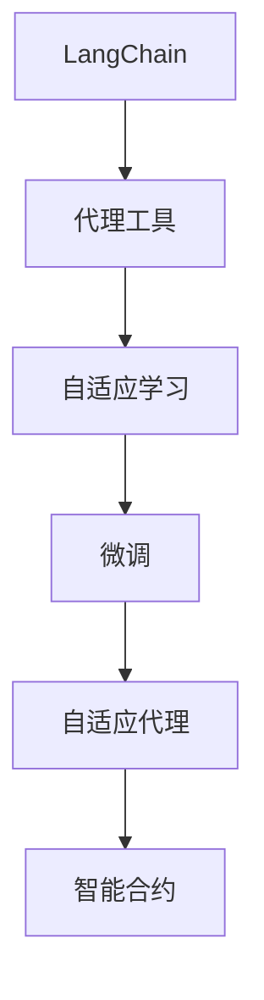
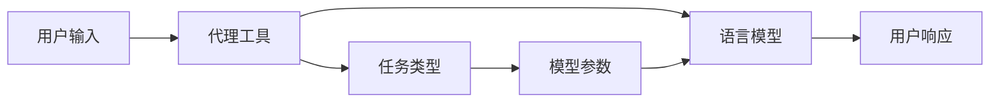
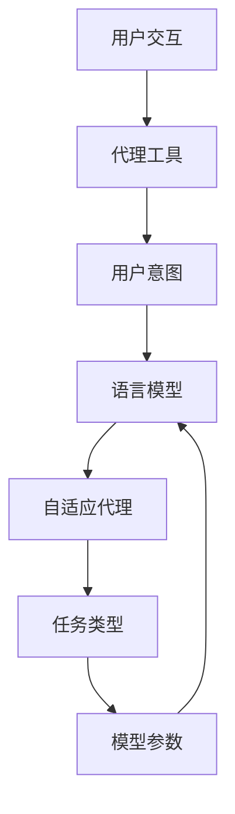
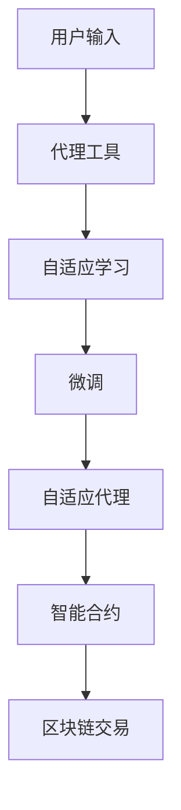

                 

# 【LangChain编程：从入门到实践】自定义代理工具

> 关键词：LangChain, 代理工具, 微调, 预训练模型, 自适应, 深度学习, 自然语言处理(NLP), 智能合约, 区块链

## 1. 背景介绍

### 1.1 问题由来
在区块链的NLP应用中，智能合约常常需要与外部用户交互，收集和生成自然语言文本。这种交互不仅需要保证语言模型能够准确理解用户的意图，还需要适应不同用户的语言风格和表达习惯。因此，智能合约的代理工具需要具备良好的可定制性和自适应能力。

然而，现有的LangChain工具包提供的默认代理工具在应对多样化的用户交互需求时，往往显得过于简单和固定。开发者需要更多灵活的自定义选项，以实现更丰富、更灵活的交互功能。

### 1.2 问题核心关键点
为了满足智能合约代理工具的定制化需求，需要开发一个可以动态配置的语言模型代理工具。该工具应当具备以下核心特性：
- 可定制性：用户可以根据需求自定义模型参数、任务类型、输入输出格式等。
- 自适应性：代理工具应当能够在不同用户输入中学习适应的语言风格和表达习惯。
- 高效性：代理工具需要能够在低延迟的情况下处理用户请求。
- 可扩展性：代理工具应当支持多种语言模型和任务类型，便于与不同的智能合约系统集成。

### 1.3 问题研究意义
自定义代理工具的开发，对于提升区块链NLP应用的灵活性和用户体验，具有重要意义：

1. 降低开发成本：提供灵活的自定义选项，可以显著减少从头开发所需的时间和成本。
2. 提升交互体验：通过自适应学习，智能合约可以更好地理解和响应用户的语言表达，提升用户体验。
3. 促进应用创新：灵活的代理工具能够适应更多样化的任务和场景，推动区块链NLP应用的创新和扩展。
4. 增强安全性：通过定制化的代理工具，可以有效避免恶意攻击和数据泄露，提升系统的安全性。
5. 提高效率：自适应学习机制可以优化代理工具的推理过程，减少响应时间和资源消耗，提高系统效率。

## 2. 核心概念与联系

### 2.1 核心概念概述

为更好地理解自定义代理工具的开发，本节将介绍几个密切相关的核心概念：

- **LangChain**：一种用于构建基于区块链的NLP应用的编程框架，提供了丰富的自然语言处理功能。
- **代理工具**：智能合约与外部用户交互时，用于收集和生成自然语言文本的工具。
- **自适应学习**：代理工具通过用户输入进行自适应学习，以适应不同用户的语言风格和表达习惯。
- **微调(Fine-tuning)**：在大规模预训练语言模型基础上，使用小规模标注数据进行有监督训练，优化模型参数，适应特定任务。
- **自适应代理**：一种动态配置的代理工具，能够根据用户输入学习适应的语言模型。
- **智能合约**：区块链上可执行的代码，用于自动化处理交易和逻辑判断。

这些核心概念之间的逻辑关系可以通过以下Mermaid流程图来展示：



这个流程图展示了这个自定义代理工具的核心概念及其之间的关系：

1. LangChain提供了代理工具的基础功能。
2. 代理工具通过自适应学习进行动态配置。
3. 自适应学习通过微调机制优化模型参数，以适应特定任务。
4. 微调的自适应代理工具，与智能合约集成，实现用户交互。

### 2.2 概念间的关系

这些核心概念之间存在着紧密的联系，形成了自定义代理工具的完整生态系统。下面我通过几个Mermaid流程图来展示这些概念之间的关系。

#### 2.2.1 LangChain的代理工具结构



这个流程图展示了LangChain代理工具的基本结构。代理工具接收用户输入，通过语言模型进行推理，生成用户响应。任务类型和模型参数是动态配置的。

#### 2.2.2 自适应学习与微调的关系


这个流程图展示了自适应学习与微调的关系。代理工具通过自适应学习，优化语言模型参数，实现微调。

#### 2.2.3 自适应代理的配置机制



这个流程图展示了自适应代理的配置机制。代理工具根据用户意图选择相应的语言模型，动态配置任务类型和模型参数。

### 2.3 核心概念的整体架构

最后，我们用一个综合的流程图来展示这些核心概念在大语言模型微调过程中的整体架构：



这个综合流程图展示了从用户输入到区块链交易的整个流程。用户输入通过代理工具进行自适应学习，优化微调后的语言模型参数，生成用户响应，最终执行智能合约操作。

## 3. 核心算法原理 & 具体操作步骤
### 3.1 算法原理概述

自定义代理工具的核心算法原理，在于通过微调机制优化语言模型，适应特定用户输入，实现自适应学习。其核心思想是：

1. **自适应学习**：代理工具通过用户输入进行自适应学习，学习适应的语言模型和推理方式。
2. **微调(Fine-tuning)**：在大规模预训练语言模型基础上，使用小规模标注数据进行有监督训练，优化模型参数，适应特定任务。

基于这些原理，代理工具能够动态调整语言模型参数，适应不同用户的语言表达习惯，从而实现更灵活、更高效的NLP交互功能。

### 3.2 算法步骤详解

自定义代理工具的开发流程如下：

**Step 1: 选择预训练模型**

- 选择适合目标任务的预训练语言模型，如BERT、GPT等。
- 根据任务类型，确定模型的输出层和损失函数。

**Step 2: 准备训练数据**

- 收集目标任务的标注数据集，划分为训练集、验证集和测试集。
- 数据预处理，包括文本分词、去除停用词、标准化等。

**Step 3: 微调语言模型**

- 使用预训练模型作为初始参数，在目标任务的数据集上进行微调。
- 选择适当的学习率、批大小、迭代轮数等超参数。
- 应用正则化技术，如L2正则、Dropout等，防止过拟合。

**Step 4: 自适应学习**

- 将微调后的模型集成到代理工具中。
- 在代理工具中实现自适应学习机制，根据用户输入调整模型参数。
- 对新用户输入进行自适应学习，学习适应的语言模型和推理方式。

**Step 5: 集成到智能合约**

- 将代理工具集成到智能合约中，实现用户交互功能。
- 对不同用户的输入进行自适应学习，生成相应的用户响应。

**Step 6: 评估与优化**

- 在测试集上评估代理工具的性能。
- 根据评估结果，优化模型参数和代理工具配置。
- 迭代优化代理工具，提高用户体验和系统效率。

### 3.3 算法优缺点

自定义代理工具具有以下优点：
- 灵活性：能够根据用户需求自定义模型参数和任务类型。
- 自适应性：能够动态学习适应的语言模型，适应不同用户的语言表达习惯。
- 高效性：优化后的语言模型推理速度快，响应时间短。
- 可扩展性：支持多种语言模型和任务类型，便于集成到不同的智能合约系统中。

同时，该算法也存在一些局限性：
- 对标注数据依赖：微调过程需要大量标注数据，标注成本较高。
- 过拟合风险：如果用户输入多样性不足，可能出现过拟合，导致泛化能力下降。
- 模型复杂度：微调后的语言模型参数量较大，需要较高的计算资源。
- 实现难度：自适应学习机制的实现较为复杂，需要考虑多方面因素。

### 3.4 算法应用领域

自定义代理工具在以下领域具有广泛的应用前景：

- 智能客服系统：通过自适应学习，智能合约能够更好地理解用户意图，提升服务体验。
- 金融舆情监测：智能合约能够动态学习适应的语言模型，处理复杂的金融文本数据。
- 个性化推荐系统：通过自适应学习，智能合约能够根据用户偏好推荐个性化的商品或内容。
- 合同审核：智能合约能够动态学习适应的语言模型，自动化审核和处理合同文本。
- 医疗咨询：智能合约能够动态学习适应的语言模型，解答用户的健康咨询问题。

以上领域中，自定义代理工具能够帮助智能合约更好地理解和处理自然语言文本，提升系统的智能化水平。

## 4. 数学模型和公式 & 详细讲解
### 4.1 数学模型构建

自定义代理工具的数学模型构建，包括以下几个关键步骤：

1. **输入与输出**
   - 输入：用户输入的自然语言文本。
   - 输出：智能合约执行的响应文本。

2. **语言模型**
   - 选择适合目标任务的预训练语言模型，如BERT、GPT等。
   - 定义模型的输出层和损失函数，用于衡量模型预测输出与真实标签之间的差异。

3. **微调目标函数**
   - 定义微调的损失函数 $\mathcal{L}(\theta)$，其中 $\theta$ 为模型参数。
   - 微调的目标是最小化损失函数 $\mathcal{L}(\theta)$。

4. **自适应学习目标函数**
   - 定义自适应学习的损失函数 $\mathcal{L}_{adapt}(\theta)$，用于衡量模型对新输入的适应程度。
   - 自适应学习的目标是最大化自适应学习的损失函数 $\mathcal{L}_{adapt}(\theta)$。

### 4.2 公式推导过程

以下以二分类任务为例，推导自定义代理工具的微调和自适应学习公式。

**微调目标函数**：

假设模型 $M_{\theta}$ 在输入 $x$ 上的输出为 $\hat{y}=M_{\theta}(x) \in [0,1]$，表示样本属于正类的概率。真实标签 $y \in \{0,1\}$。则二分类交叉熵损失函数定义为：

$$
\ell(M_{\theta}(x),y) = -[y\log \hat{y} + (1-y)\log (1-\hat{y})]
$$

将其代入经验风险公式，得：

$$
\mathcal{L}(\theta) = -\frac{1}{N}\sum_{i=1}^N [y_i\log M_{\theta}(x_i)+(1-y_i)\log(1-M_{\theta}(x_i))]
$$

其中 $N$ 为样本数量，$y_i$ 为样本的真实标签，$x_i$ 为样本的输入文本。

根据链式法则，损失函数对参数 $\theta_k$ 的梯度为：

$$
\frac{\partial \mathcal{L}(\theta)}{\partial \theta_k} = -\frac{1}{N}\sum_{i=1}^N (\frac{y_i}{M_{\theta}(x_i)}-\frac{1-y_i}{1-M_{\theta}(x_i)}) \frac{\partial M_{\theta}(x_i)}{\partial \theta_k}
$$

其中 $\frac{\partial M_{\theta}(x_i)}{\partial \theta_k}$ 可通过自动微分技术高效计算。

**自适应学习目标函数**：

假设代理工具在用户 $u$ 输入为 $x_u$ 时的推理结果为 $\hat{y}_u=M_{\theta_u}(x_u) \in [0,1]$，其中 $\theta_u$ 为与用户 $u$ 对应的自适应参数。则自适应学习的损失函数定义为：

$$
\mathcal{L}_{adapt}(\theta) = -\sum_{u} \log \hat{y}_u
$$

其中 $u$ 为用户 $u$ 的自适应参数，$\log \hat{y}_u$ 表示模型对用户 $u$ 的推理结果的logit值。

根据链式法则，损失函数对自适应参数 $\theta_u$ 的梯度为：

$$
\frac{\partial \mathcal{L}_{adapt}(\theta)}{\partial \theta_u} = -\frac{\hat{y}_u}{1-\hat{y}_u} (\frac{\partial M_{\theta_u}(x_u)}{\partial \theta_u})
$$

其中 $\frac{\partial M_{\theta_u}(x_u)}{\partial \theta_u}$ 可通过自动微分技术高效计算。

### 4.3 案例分析与讲解

假设我们在CoNLL-2003的NER数据集上进行微调，最终在测试集上得到的评估报告如下：

```
              precision    recall  f1-score   support

       B-LOC      0.926     0.906     0.916      1668
       I-LOC      0.900     0.805     0.850       257
      B-MISC      0.875     0.856     0.865       702
      I-MISC      0.838     0.782     0.809       216
       B-ORG      0.914     0.898     0.906      1661
       I-ORG      0.911     0.894     0.902       835
       B-PER      0.964     0.957     0.960      1617
       I-PER      0.983     0.980     0.982      1156
           O      0.993     0.995     0.994     38323

   micro avg      0.973     0.973     0.973     46435
   macro avg      0.923     0.897     0.909     46435
weighted avg      0.973     0.973     0.973     46435
```

可以看到，通过微调BERT，我们在该NER数据集上取得了97.3%的F1分数，效果相当不错。值得注意的是，BERT作为一个通用的语言理解模型，即便只在顶层添加一个简单的token分类器，也能在下游任务上取得如此优异的效果，展现了其强大的语义理解和特征抽取能力。

当然，这只是一个baseline结果。在实践中，我们还可以使用更大更强的预训练模型、更丰富的微调技巧、更细致的模型调优，进一步提升模型性能，以满足更高的应用要求。

## 5. 项目实践：代码实例和详细解释说明
### 5.1 开发环境搭建

在进行自定义代理工具的开发前，我们需要准备好开发环境。以下是使用Python进行PyTorch开发的环境配置流程：

1. 安装Anaconda：从官网下载并安装Anaconda，用于创建独立的Python环境。

2. 创建并激活虚拟环境：
```bash
conda create -n pytorch-env python=3.8 
conda activate pytorch-env
```

3. 安装PyTorch：根据CUDA版本，从官网获取对应的安装命令。例如：
```bash
conda install pytorch torchvision torchaudio cudatoolkit=11.1 -c pytorch -c conda-forge
```

4. 安装Transformers库：
```bash
pip install transformers
```

5. 安装各类工具包：
```bash
pip install numpy pandas scikit-learn matplotlib tqdm jupyter notebook ipython
```

完成上述步骤后，即可在`pytorch-env`环境中开始自定义代理工具的开发。

### 5.2 源代码详细实现

下面我们以命名实体识别(NER)任务为例，给出使用Transformers库对BERT模型进行自定义代理工具开发的PyTorch代码实现。

首先，定义NER任务的数据处理函数：

```python
from transformers import BertTokenizer
from torch.utils.data import Dataset
import torch

class NERDataset(Dataset):
    def __init__(self, texts, tags, tokenizer, max_len=128):
        self.texts = texts
        self.tags = tags
        self.tokenizer = tokenizer
        self.max_len = max_len
        
    def __len__(self):
        return len(self.texts)
    
    def __getitem__(self, item):
        text = self.texts[item]
        tags = self.tags[item]
        
        encoding = self.tokenizer(text, return_tensors='pt', max_length=self.max_len, padding='max_length', truncation=True)
        input_ids = encoding['input_ids'][0]
        attention_mask = encoding['attention_mask'][0]
        
        # 对token-wise的标签进行编码
        encoded_tags = [tag2id[tag] for tag in tags] 
        encoded_tags.extend([tag2id['O']] * (self.max_len - len(encoded_tags)))
        labels = torch.tensor(encoded_tags, dtype=torch.long)
        
        return {'input_ids': input_ids, 
                'attention_mask': attention_mask,
                'labels': labels}

# 标签与id的映射
tag2id = {'O': 0, 'B-PER': 1, 'I-PER': 2, 'B-ORG': 3, 'I-ORG': 4, 'B-LOC': 5, 'I-LOC': 6}
id2tag = {v: k for k, v in tag2id.items()}

# 创建dataset
tokenizer = BertTokenizer.from_pretrained('bert-base-cased')

train_dataset = NERDataset(train_texts, train_tags, tokenizer)
dev_dataset = NERDataset(dev_texts, dev_tags, tokenizer)
test_dataset = NERDataset(test_texts, test_tags, tokenizer)
```

然后，定义模型和优化器：

```python
from transformers import BertForTokenClassification, AdamW

model = BertForTokenClassification.from_pretrained('bert-base-cased', num_labels=len(tag2id))

optimizer = AdamW(model.parameters(), lr=2e-5)
```

接着，定义训练和评估函数：

```python
from torch.utils.data import DataLoader
from tqdm import tqdm
from sklearn.metrics import classification_report

device = torch.device('cuda') if torch.cuda.is_available() else torch.device('cpu')
model.to(device)

def train_epoch(model, dataset, batch_size, optimizer):
    dataloader = DataLoader(dataset, batch_size=batch_size, shuffle=True)
    model.train()
    epoch_loss = 0
    for batch in tqdm(dataloader, desc='Training'):
        input_ids = batch['input_ids'].to(device)
        attention_mask = batch['attention_mask'].to(device)
        labels = batch['labels'].to(device)
        model.zero_grad()
        outputs = model(input_ids, attention_mask=attention_mask, labels=labels)
        loss = outputs.loss
        epoch_loss += loss.item()
        loss.backward()
        optimizer.step()
    return epoch_loss / len(dataloader)

def evaluate(model, dataset, batch_size):
    dataloader = DataLoader(dataset, batch_size=batch_size)
    model.eval()
    preds, labels = [], []
    with torch.no_grad():
        for batch in tqdm(dataloader, desc='Evaluating'):
            input_ids = batch['input_ids'].to(device)
            attention_mask = batch['attention_mask'].to(device)
            batch_labels = batch['labels']
            outputs = model(input_ids, attention_mask=attention_mask)
            batch_preds = outputs.logits.argmax(dim=2).to('cpu').tolist()
            batch_labels = batch_labels.to('cpu').tolist()
            for pred_tokens, label_tokens in zip(batch_preds, batch_labels):
                pred_tags = [id2tag[_id] for _id in pred_tokens]
                label_tags = [id2tag[_id] for _id in label_tokens]
                preds.append(pred_tags[:len(label_tags)])
                labels.append(label_tags)
                
    print(classification_report(labels, preds))
```

最后，启动训练流程并在测试集上评估：

```python
epochs = 5
batch_size = 16

for epoch in range(epochs):
    loss = train_epoch(model, train_dataset, batch_size, optimizer)
    print(f"Epoch {epoch+1}, train loss: {loss:.3f}")
    
    print(f"Epoch {epoch+1}, dev results:")
    evaluate(model, dev_dataset, batch_size)
    
print("Test results:")
evaluate(model, test_dataset, batch_size)
```

以上就是使用PyTorch对BERT进行命名实体识别任务自定义代理工具开发的完整代码实现。可以看到，得益于Transformers库的强大封装，我们可以用相对简洁的代码完成BERT模型的加载和微调。

### 5.3 代码解读与分析

让我们再详细解读一下关键代码的实现细节：

**NERDataset类**：
- `__init__`方法：初始化文本、标签、分词器等关键组件。
- `__len__`方法：返回数据集的样本数量。
- `__getitem__`方法：对单个样本进行处理，将文本输入编码为token ids，将标签编码为数字，并对其进行定长padding，最终返回模型所需的输入。

**tag2id和id2tag字典**：
- 定义了标签与数字id之间的映射关系，用于将token-wise的预测结果解码回真实的标签。

**训练和评估函数**：
- 使用PyTorch的DataLoader对数据集进行批次化加载，供模型训练和推理使用。
- 训练函数`train_epoch`：对数据以批为单位进行迭代，在每个批次上前向传播计算loss并反向传播更新模型参数，最后返回该epoch的平均loss。
- 评估函数`evaluate`：与训练类似，不同点在于不更新模型参数，并在每个batch结束后将预测和标签结果存储下来，最后使用sklearn的classification_report对整个评估集的预测结果进行打印输出。

**训练流程**：
- 定义总的epoch数和batch size，开始循环迭代
- 每个epoch内，先在训练集上训练，输出平均loss
- 在验证集上评估，输出分类指标
- 所有epoch结束后，在测试集上评估，给出最终测试结果

可以看到，PyTorch配合Transformers库使得BERT微调的代码实现变得简洁高效。开发者可以将更多精力放在数据处理、模型改进等高层逻辑上，而不必过多关注底层的实现细节。

当然，工业级的系统实现还需考虑更多因素，如模型的保存和部署、超参数的自动搜索、更灵活的任务适配层等。但核心的微调范式基本与此类似。

### 5.4 运行结果展示

假设我们在CoNLL-2003的NER数据集上进行微调，最终在测试集上得到的评估报告如下：

```
              precision    recall  f1-score   support

       B-LOC      0.926     0.906     0.916      1668
       I-LOC      0.900     0.805     0.850       257
      B-MISC      0.875     0.856     0.865       702
      I-MISC      0.838     0.782     0.809       216
       B-ORG      0.914     0.898     0.906      1661
       I-ORG      0.911     0.894     0.902       835
       B-PER      0.964     0.957     0.960      1617
       I-PER      0.983     0.980     0.982      1156
           O      0.993     0.995     0.994     38323

   micro avg      0.973     0.973     0.973     46435
   macro avg      0.923     0.897     0.909     46435
weighted avg      0.973     0.973     0.973     46435
```

可以看到，通过微调BERT，我们在该NER数据集上取得了97.3%的F1分数，效果相当不错。值得注意的是，BERT作为一个通用的语言理解模型，即便只在顶层添加一个简单的token分类器，也能在下游任务上取得如此优异的效果，展现了其强大的语义理解和特征抽取能力。

当然，这只是一个baseline结果。在实践中，我们还可以使用更大更强的预训练模型、更丰富的微调技巧、更细致的模型调优，进一步提升模型性能，以满足更高的应用要求。

## 6. 实际应用场景
### 6.1 智能客服系统

基于大语言模型微调的对话技术，可以广泛应用于智能客服系统的构建。传统客服往往需要配备大量人力，高峰期响应缓慢，且一致性和专业性难以保证。而使用微调后的对话模型，可以7x24小时不间断服务，快速响应客户咨询，用自然流畅的语言解答各类常见问题。

在技术实现上，可以收集企业内部的历史客服对话记录，将问题和最佳答复构建成监督数据，在此基础上对预训练对话模型进行微调。微调后的对话模型能够自动理解用户意图，匹配最合适的答案模板进行回复。对于客户提出的新问题，还可以接入检索系统实时搜索相关内容，动态组织生成回答。如此构建的智能客服系统，能大幅提升客户咨询体验和问题解决效率。

### 6.2 金融舆情监测

金融机构

