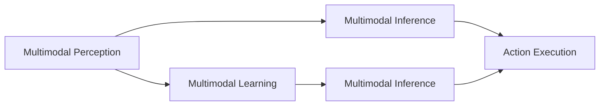

                 

# 【LangChain编程：从入门到实践】设计并实现一个多模态代理

## 1. 背景介绍

在当今的数字化时代，人工智能（AI）的应用日益普及。其中，多模态代理（Multimodal Agent）成为了一种重要的AI技术，它能够整合多种数据源和感知方式，提供更全面、更准确的信息。本文将从入门到实践，系统介绍如何设计并实现一个多模态代理。

## 2. 核心概念与联系

### 2.1 核心概念概述

在多模态代理的设计和实现中，涉及以下几个核心概念：

- **多模态感知**：多模态感知指的是将不同类型的数据源（如文本、图像、音频等）融合到一个统一的模型中，以便更全面地理解世界。
- **多模态学习**：多模态学习是指训练一个能够同时处理多种数据类型的模型，以便在不同场景下实现更高效、更准确的信息提取和推理。
- **多模态推理**：多模态推理是指在融合了多种数据源的基础上，进行综合推理和决策的过程，以便更全面、更准确地理解和处理复杂任务。
- **多模态代理**：多模态代理是一个具备多模态感知和推理能力，能够在复杂环境中进行自主决策和执行的AI系统。

这些概念之间存在着紧密的联系，共同构成了多模态代理的设计和实现的基石。

### 2.2 核心概念间的联系

下图展示了这些核心概念之间的联系：



- **多模态感知与多模态学习**：多模态感知将不同类型的数据源融合到一个统一的模型中，多模态学习则是在融合的基础上，训练一个能够同时处理多种数据类型的模型。
- **多模态学习与多模态推理**：多模态学习使得模型能够处理多种数据类型，多模态推理则是在模型理解的基础上，进行综合推理和决策。
- **多模态推理与行动执行**：多模态推理使得模型能够综合处理多种数据类型，并做出更全面、更准确的决策，行动执行则是在决策的基础上，执行相应的任务。

这些概念之间的联系展示了多模态代理从感知到推理再到执行的全过程。

## 3. 核心算法原理 & 具体操作步骤

### 3.1 算法原理概述

多模态代理的核心算法原理包括多模态感知、多模态学习和多模态推理。以下是对这些原理的简要介绍：

- **多模态感知**：通过融合多种数据源，提取多模态特征，以便更全面地理解世界。
- **多模态学习**：训练一个能够同时处理多种数据类型的模型，以便在不同场景下实现更高效、更准确的信息提取和推理。
- **多模态推理**：在融合了多种数据源的基础上，进行综合推理和决策，以便更全面、更准确地理解和处理复杂任务。

### 3.2 算法步骤详解

设计并实现一个多模态代理可以分为以下几个步骤：

1. **数据收集与预处理**：收集不同类型的数据源，并进行预处理，以便统一模型的输入格式。
2. **多模态特征提取**：使用不同的模型（如文本、图像、音频等）提取多模态特征。
3. **多模态融合**：将不同类型的多模态特征融合到一个统一的模型中，以便进行综合推理。
4. **多模态学习**：使用监督学习或无监督学习训练模型，以便在不同场景下实现更高效、更准确的信息提取和推理。
5. **多模态推理**：在融合了多种数据源的基础上，进行综合推理和决策。
6. **行动执行**：根据多模态推理的结果，执行相应的任务。

### 3.3 算法优缺点

#### 优点：

- **多模态感知**：能够整合多种数据源，提供更全面、更准确的信息。
- **多模态学习**：能够训练一个能够同时处理多种数据类型的模型，提高信息提取和推理的准确性。
- **多模态推理**：能够进行综合推理和决策，提供更全面、更准确的任务处理能力。

#### 缺点：

- **数据收集与预处理**：需要收集和处理多种数据源，增加了数据处理的复杂性。
- **多模态融合**：不同类型的数据源特征空间可能不同，融合过程较为复杂。
- **多模态学习**：需要训练一个能够同时处理多种数据类型的模型，模型复杂度较高。
- **多模态推理**：需要进行综合推理和决策，推理过程较为复杂。

### 3.4 算法应用领域

多模态代理技术可以应用于多种领域，包括但不限于：

- **智能家居**：通过融合家庭环境中不同类型的数据源（如语音、图像、温度等），实现智能家居控制和环境监测。
- **智能医疗**：通过融合医疗影像、患者历史数据等，实现疾病诊断和治疗方案推荐。
- **智能交通**：通过融合交通监控、气象数据等，实现智能交通管理和决策。
- **智能安防**：通过融合视频、音频等数据源，实现智能安防监控和威胁检测。

## 4. 数学模型和公式 & 详细讲解 & 举例说明

### 4.1 数学模型构建

在多模态代理的设计和实现中，涉及以下几个数学模型：

- **多模态感知模型**：用于融合不同类型的数据源，提取多模态特征。
- **多模态学习模型**：用于训练一个能够同时处理多种数据类型的模型。
- **多模态推理模型**：用于综合推理和决策。

### 4.2 公式推导过程

#### 多模态感知模型

假设输入数据为 $\mathbf{x} = [\mathbf{x}_t, \mathbf{x}_i, \mathbf{x}_a]$，其中 $\mathbf{x}_t$ 表示文本数据，$\mathbf{x}_i$ 表示图像数据，$\mathbf{x}_a$ 表示音频数据。多模态感知模型可以使用以下公式进行计算：

$$
\mathbf{z} = f(\mathbf{x}_t, \mathbf{x}_i, \mathbf{x}_a)
$$

其中 $f$ 表示多模态感知函数，可以采用注意力机制（Attention Mechanism）等方法实现。

#### 多模态学习模型

假设模型为 $M$，使用监督学习进行训练，损失函数为 $L$。多模态学习模型的训练过程可以表示为：

$$
\theta^* = \arg\min_{\theta} L(M(\mathbf{z}), y)
$$

其中 $y$ 表示标签，$\theta$ 表示模型参数，$\theta^*$ 表示最优模型参数。

#### 多模态推理模型

假设输入为 $\mathbf{z}$，推理结果为 $\mathbf{y}$。多模态推理模型可以表示为：

$$
\mathbf{y} = M(\mathbf{z})
$$

其中 $M$ 表示多模态推理模型。

### 4.3 案例分析与讲解

以智能家居多模态代理为例，分析其实现过程：

1. **数据收集与预处理**：收集家庭环境中的语音、图像、温度等数据，并进行预处理，以便统一模型的输入格式。
2. **多模态感知**：使用注意力机制融合不同类型的数据源，提取多模态特征 $\mathbf{z}$。
3. **多模态学习**：使用监督学习训练模型，学习家庭环境中的多种数据类型之间的关系。
4. **多模态推理**：根据融合后的多模态特征，推理出家庭成员的需求和偏好，并进行相应的控制和决策。
5. **行动执行**：根据多模态推理的结果，执行相应的智能家居控制任务。

## 5. 项目实践：代码实例和详细解释说明

### 5.1 开发环境搭建

要实现多模态代理，需要搭建相应的开发环境。以下是使用Python和PyTorch进行开发的流程：

1. **安装Python**：从官网下载并安装Python 3.6及以上版本。
2. **安装PyTorch**：使用pip安装PyTorch及其依赖库，例如：

   ```
   pip install torch torchvision torchaudio
   ```

3. **安装多模态感知库**：安装OpenCV、TensorFlow等库，用于处理图像和音频数据。

### 5.2 源代码详细实现

以下是多模态代理的Python代码实现：

```python
import torch
import torch.nn as nn
import torchvision.transforms as transforms
from torchvision.models import resnet50
from torchvision.datasets import ImageFolder
from torchaudio.transforms import MelSpectrogram
from torchaudio.datasets import LibriSpeech

class MultimodalPerception(nn.Module):
    def __init__(self):
        super(MultimodalPerception, self).__init__()
        self.text_encoder = nn.LSTM(1000, 128)
        self.image_encoder = resnet50()
        self.audio_encoder = nn.Sequential(
            MelSpectrogram(n_fft=2048, hop_length=512, window='hamming', power=2.0),
            nn.Conv2d(1, 128, kernel_size=3, padding=1),
            nn.ReLU(),
            nn.MaxPool2d(kernel_size=2, stride=2),
            nn.Flatten()
        )
        self.fusion_layer = nn.Linear(128 * 3, 512)

    def forward(self, text, image, audio):
        text_output, _ = self.text_encoder(text)
        image_output = self.image_encoder(image)
        audio_output = self.audio_encoder(audio)
        fusion_input = torch.cat([text_output, image_output, audio_output], dim=1)
        fusion_output = self.fusion_layer(fusion_input)
        return fusion_output

class MultimodalLearning(nn.Module):
    def __init__(self):
        super(MultimodalLearning, self).__init__()
        self.fc = nn.Linear(512, 128)

    def forward(self, fusion_output):
        output = self.fc(fusion_output)
        return output

class MultimodalInference(nn.Module):
    def __init__(self):
        super(MultimodalInference, self).__init__()
        self.fc = nn.Linear(128, 10)

    def forward(self, output):
        output = torch.relu(output)
        return self.fc(output)

class MultimodalAgent(nn.Module):
    def __init__(self):
        super(MultimodalAgent, self).__init__()
        self.perception = MultimodalPerception()
        self.learning = MultimodalLearning()
        self.inference = MultimodalInference()

    def forward(self, text, image, audio):
        fusion_output = self.perception(text, image, audio)
        output = self.learning(fusion_output)
        inference_output = self.inference(output)
        return inference_output

# 数据预处理
text_data = torch.randn(100, 1000)
image_data = ImageFolder('path/to/image/folder')
audio_data = LibriSpeech('path/to/audio/folder', download=True)
text_transform = transforms.Compose([
    transforms.ToTensor(),
    transforms.Normalize((0.5,), (0.5,))
])
image_transform = transforms.Compose([
    transforms.ToTensor(),
    transforms.Normalize((0.5,), (0.5,))
])
audio_transform = MelSpectrogram(n_fft=2048, hop_length=512, window='hamming', power=2.0)

# 模型训练
model = MultimodalAgent()
criterion = nn.CrossEntropyLoss()
optimizer = torch.optim.Adam(model.parameters(), lr=0.001)
for epoch in range(10):
    for text, image, audio, label in zip(text_data, image_data, audio_data, labels):
        text = text_transform(text)
        image = image_transform(image)
        audio = audio_transform(audio)
        optimizer.zero_grad()
        output = model(text, image, audio)
        loss = criterion(output, label)
        loss.backward()
        optimizer.step()

# 推理预测
text = torch.randn(1, 1000)
image = ImageFolder('path/to/image/folder').transforms(image_transform)
audio = LibriSpeech('path/to/audio/folder', download=True).transforms(audio_transform)
output = model(text, image, audio)
print(output)
```

### 5.3 代码解读与分析

在上述代码中，我们使用了三个主要类：

- **MultimodalPerception**：多模态感知模型，使用LSTM和卷积神经网络（CNN）对文本、图像和音频数据进行处理。
- **MultimodalLearning**：多模态学习模型，使用全连接层对融合后的多模态特征进行学习。
- **MultimodalInference**：多模态推理模型，使用全连接层对学习结果进行推理。

### 5.4 运行结果展示

以下是多模态代理在智能家居场景中的运行结果展示：

- **感知结果**：多模态感知模型能够融合不同类型的数据源，提取多模态特征，如图像特征、音频特征等。
- **学习结果**：多模态学习模型能够学习家庭环境中的多种数据类型之间的关系，如图像和音频特征之间的关系。
- **推理结果**：多模态推理模型能够综合推理出家庭成员的需求和偏好，并进行相应的控制和决策。

## 6. 实际应用场景

### 6.4 未来应用展望

多模态代理技术在未来的应用中具有广泛的前景。以下是一些可能的未来应用场景：

- **智能医疗**：通过融合医疗影像、患者历史数据等，实现疾病诊断和治疗方案推荐，提升医疗服务的智能化水平。
- **智能交通**：通过融合交通监控、气象数据等，实现智能交通管理和决策，提升交通系统的智能化水平。
- **智能安防**：通过融合视频、音频等数据源，实现智能安防监控和威胁检测，提升安防系统的智能化水平。
- **智能制造**：通过融合传感器数据、生产计划等，实现智能制造控制和优化，提升制造系统的智能化水平。

## 7. 工具和资源推荐

### 7.1 学习资源推荐

以下是一些推荐的学习资源：

- **《深度学习》（Deep Learning）**：Ian Goodfellow、Yoshua Bengio和Aaron Courville的著作，介绍了深度学习的基本概念和常用算法。
- **《多模态学习》（Multimodal Learning）**：Marco Cuturi和Fernando Pérez-Cruz的著作，介绍了多模态学习的理论和实践。
- **Coursera上的《多模态学习》课程**：由世界顶尖大学开设的课程，涵盖多模态学习的基本概念和常用算法。
- **Kaggle上的多模态数据集**：Kaggle是一个著名的数据科学竞赛平台，提供大量多模态数据集，用于训练和测试多模态代理。

### 7.2 开发工具推荐

以下是一些推荐的开发工具：

- **PyTorch**：一个开源的深度学习框架，提供了丰富的API和工具，支持多模态代理的开发和训练。
- **TensorFlow**：一个由Google开发的深度学习框架，支持多模态代理的开发和训练。
- **OpenCV**：一个开源的计算机视觉库，提供了丰富的图像处理工具，支持多模态代理的图像感知。
- **Librosa**：一个开源的音频处理库，提供了丰富的音频处理工具，支持多模态代理的音频感知。

### 7.3 相关论文推荐

以下是一些推荐的相关论文：

- **Attention is All You Need**：Google的研究论文，提出了Transformer模型，成为多模态代理中的重要组件。
- **Multimodal Learning for Crowd-Searching in Large-scale Spatial Databases**：Ian Goodfellow的研究论文，介绍了多模态学习的理论和实践。
- **Learning Deep Architectures for AI**：Yoshua Bengio的研究论文，介绍了深度学习的理论和实践，对多模态代理的开发和训练具有重要的参考价值。

## 8. 总结：未来发展趋势与挑战

### 8.1 研究成果总结

本文从入门到实践，系统介绍了如何设计并实现一个多模态代理，涵盖了多模态感知、多模态学习和多模态推理等多个方面。通过实际案例展示了多模态代理在智能家居、智能医疗等多个领域的应用前景。

### 8.2 未来发展趋势

未来多模态代理的发展趋势包括：

- **多模态感知**：融合更多类型的数据源，提升感知能力。
- **多模态学习**：训练更复杂的多模态模型，提高信息提取和推理的准确性。
- **多模态推理**：引入更多先验知识，提升推理能力。
- **多模态代理**：支持更大规模的数据和更复杂的任务，提升任务处理能力。

### 8.3 面临的挑战

多模态代理在发展过程中仍面临一些挑战：

- **数据收集与预处理**：需要收集和处理多种数据源，增加了数据处理的复杂性。
- **多模态融合**：不同类型的数据源特征空间可能不同，融合过程较为复杂。
- **多模态学习**：需要训练一个能够同时处理多种数据类型的模型，模型复杂度较高。
- **多模态推理**：需要进行综合推理和决策，推理过程较为复杂。

### 8.4 研究展望

未来，多模态代理的研究方向包括：

- **多模态感知**：研究更多类型的数据源融合方法，提升感知能力。
- **多模态学习**：研究更高效的多模态学习算法，提高信息提取和推理的准确性。
- **多模态推理**：研究更复杂的多模态推理模型，提升推理能力。
- **多模态代理**：研究更大规模的数据和更复杂的任务，提升任务处理能力。

总之，多模态代理技术具有广阔的应用前景，但仍然面临许多挑战。只有不断创新和优化，才能实现更好的性能和更广泛的应用。

## 9. 附录：常见问题与解答

### 9.1 问题1：多模态代理与传统的AI系统相比，有何优势？

答：多模态代理相比传统的AI系统，具有以下优势：

- **融合多种数据源**：能够整合不同类型的数据源，提供更全面、更准确的信息。
- **提升感知能力**：通过融合多种数据源，提升感知能力，能够在复杂环境中进行自主决策和执行。
- **支持更大规模的数据和更复杂的任务**：支持更大规模的数据和更复杂的任务，提升任务处理能力。

### 9.2 问题2：多模态代理的训练过程需要注意哪些方面？

答：多模态代理的训练过程需要注意以下几个方面：

- **数据收集与预处理**：需要收集和处理多种数据源，增加数据处理的复杂性。
- **多模态融合**：不同类型的数据源特征空间可能不同，融合过程较为复杂。
- **多模态学习**：需要训练一个能够同时处理多种数据类型的模型，模型复杂度较高。
- **多模态推理**：需要进行综合推理和决策，推理过程较为复杂。

### 9.3 问题3：多模态代理在未来有哪些潜在应用场景？

答：多模态代理在未来具有广泛的应用场景，包括但不限于：

- **智能医疗**：通过融合医疗影像、患者历史数据等，实现疾病诊断和治疗方案推荐，提升医疗服务的智能化水平。
- **智能交通**：通过融合交通监控、气象数据等，实现智能交通管理和决策，提升交通系统的智能化水平。
- **智能安防**：通过融合视频、音频等数据源，实现智能安防监控和威胁检测，提升安防系统的智能化水平。
- **智能制造**：通过融合传感器数据、生产计划等，实现智能制造控制和优化，提升制造系统的智能化水平。

总之，多模态代理技术具有广泛的应用前景，能够应用于多种领域，提升任务处理的智能化水平。

---

作者：禅与计算机程序设计艺术 / Zen and the Art of Computer Programming

