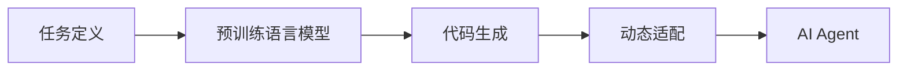
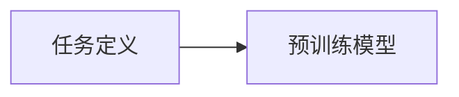
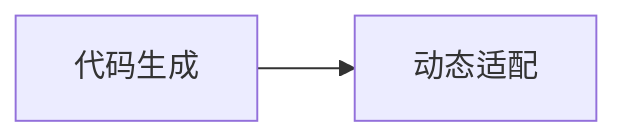
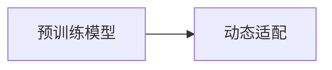
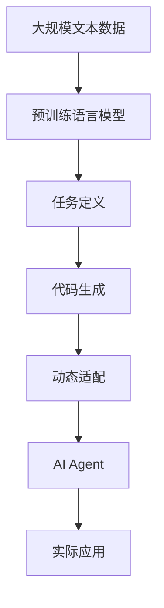

                 

# 【大模型应用开发 动手做AI Agent】AutoGen

> 关键词：AutoGen, AI Agent, 自然语言处理(NLP), 深度学习, 人工智能, 软件代理, 游戏智能体

## 1. 背景介绍

### 1.1 问题由来
随着人工智能技术的不断进步，AIAgent的应用场景越来越多，如机器人导航、无人驾驶、虚拟助手等。然而，由于这些系统通常涉及复杂的自然语言处理（NLP）任务，传统的方法往往需要人工编写大量的代码，耗时耗力。为此，需要一种更高效、更灵活的方法来快速构建AIAgent。

AutoGen技术的出现正好解决了这一问题。它通过预训练语言模型和自动代码生成技术，实现了从任务定义到代码生成的自动化，大大降低了构建AIAgent的难度和成本。通过AutoGen，开发者可以快速搭建出高性能的AIAgent，并在实际应用中实现智能决策和交互。

### 1.2 问题核心关键点
AutoGen的核心思想是利用预训练语言模型，自动生成适合特定任务的人工智能代理代码。它主要包含以下几个关键点：
- 任务定义：通过自然语言任务描述，生成初步的AIAgent框架和任务逻辑。
- 代码生成：基于任务的语义理解，自动生成符合要求的人工智能代理代码。
- 动态适配：自动生成代码可以根据实际情况进行调整，以适应不同场景的需求。

AutoGen的优势在于其高效、灵活和自动化，大大提升了AIAgent开发的效率和质量。

### 1.3 问题研究意义
AutoGen技术为AIAgent的开发提供了新的思路和方法，具有重要意义：

1. 降低开发成本：自动生成技术可以大幅减少人工编码的工作量，降低开发成本。
2. 提升开发效率：通过AutoGen，AIAgent的开发过程可以变得简单快捷，缩短开发周期。
3. 提高开发质量：自动生成的代码经过预训练模型的优化，通常具有更好的稳定性和可维护性。
4. 促进技术创新：AutoGen技术的应用，可以带来更多的创新和探索，推动AIAgent技术的快速发展。
5. 提升应用价值：通过AutoGen生成的AIAgent，能够更好地适应实际应用场景，提高应用效果。

## 2. 核心概念与联系

### 2.1 核心概念概述

AutoGen技术主要涉及以下几个核心概念：

- 预训练语言模型：如BERT、GPT等，通过大规模无标签数据训练得到的通用语言理解模型。
- 任务定义：用自然语言描述的AIAgent任务，如导航、对话等。
- 代码生成：自动生成符合任务定义的AIAgent代码，包括行为逻辑、数据处理、决策算法等。
- 动态适配：根据实际应用场景，自动调整生成的代码，以适应特定任务的需求。

这些概念之间的逻辑关系可以通过以下Mermaid流程图来展示：



这个流程图展示了AutoGen技术的核心流程：首先，通过任务定义将任务转化为模型可理解的语言描述，然后基于预训练语言模型的理解，自动生成AIAgent的代码，最后根据实际应用场景进行动态适配，形成最终的可执行AIAgent。

### 2.2 概念间的关系

这些核心概念之间存在着紧密的联系，形成了AutoGen技术的完整生态系统。下面我们通过几个Mermaid流程图来展示这些概念之间的关系。

#### 2.2.1 任务定义与预训练模型的关系



这个流程图展示了任务定义和预训练模型之间的关系。任务定义通过自然语言描述，转化为预训练模型可以理解的输入，预训练模型则基于任务语义生成AIAgent的代码。

#### 2.2.2 代码生成与动态适配的关系



这个流程图展示了代码生成和动态适配之间的关系。代码生成是自动化的第一步，生成的代码还需要根据实际应用场景进行调整，以实现最佳效果。

#### 2.2.3 预训练语言模型与动态适配的关系



这个流程图展示了预训练语言模型与动态适配之间的关系。预训练模型提供基础的语言理解能力，动态适配则根据实际场景进一步优化代码，确保AIAgent的性能和稳定性。

### 2.3 核心概念的整体架构

最后，我们用一个综合的流程图来展示这些核心概念在大模型应用开发中的整体架构：



这个综合流程图展示了从预训练模型到AIAgent生成的完整过程。大模型通过预训练学习通用语言表示，任务定义通过自然语言描述任务，代码生成自动生成AIAgent代码，动态适配根据实际场景进行优化，最终生成可执行的AIAgent，并在实际应用中发挥作用。

## 3. 核心算法原理 & 具体操作步骤
### 3.1 算法原理概述

AutoGen技术基于预训练语言模型，通过自动代码生成技术，实现从任务定义到AIAgent代码生成的自动化。其核心原理可以概括为以下几个步骤：

1. **任务定义解析**：将自然语言任务描述转化为模型可以理解的形式，包括任务类型、输入输出格式、行为逻辑等。
2. **代码模板匹配**：根据任务定义，匹配预先定义的代码模板，生成初步的AIAgent代码框架。
3. **代码填充与优化**：使用预训练语言模型，自动填充和优化代码模板，生成适合特定任务的代码。
4. **动态适配**：根据实际应用场景，自动调整生成的代码，确保其性能和稳定性。

### 3.2 算法步骤详解

AutoGen技术的详细步骤可以分为以下几个方面：

**Step 1: 任务定义与解析**

1. **任务描述输入**：通过自然语言输入任务描述，如“导航到最近的超市”。
2. **任务类型判断**：自动识别任务类型，如“导航”、“对话”、“推荐”等。
3. **任务逻辑提取**：从任务描述中提取关键信息，如输入输出格式、行为逻辑等。
4. **代码模板匹配**：根据任务类型和逻辑，匹配相应的代码模板，如导航、对话、推荐等。

**Step 2: 代码生成与填充**

1. **初步生成代码**：根据任务描述，自动生成初步的AIAgent代码框架。
2. **代码填充**：使用预训练语言模型，自动填充代码模板中的变量和逻辑。
3. **代码优化**：对生成的代码进行语法和语义的优化，确保代码的可读性和正确性。

**Step 3: 动态适配与优化**

1. **参数适配**：根据实际应用场景，自动调整模型的参数，如学习率、激活函数等。
2. **数据增强**：对输入数据进行增强处理，如数据清洗、归一化等。
3. **模型优化**：使用动态调整后的代码和参数，重新训练模型，优化其性能。

### 3.3 算法优缺点

AutoGen技术具有以下优点：

1. **高效灵活**：自动代码生成技术可以大幅减少人工编码的工作量，提高开发效率。
2. **质量稳定**：预训练语言模型的优化，使得自动生成的代码具有更好的稳定性和可维护性。
3. **广泛适用**：自动生成技术适用于各种类型的AIAgent开发，具有广泛的适用性。

同时，AutoGen技术也存在一些缺点：

1. **依赖预训练模型**：自动生成的代码质量与预训练模型的能力直接相关，预训练模型的性能决定了生成的代码质量。
2. **动态适配有限**：虽然自动生成的代码可以进行动态适配，但适用范围仍有限，无法完全替代人工开发。
3. **模型风险**：预训练模型的偏见和错误可能会影响自动生成的代码，需要谨慎使用。

### 3.4 算法应用领域

AutoGen技术主要应用于以下领域：

1. **智能客服**：通过自动生成代码，快速构建智能客服系统，提升客户咨询体验。
2. **游戏AI**：自动生成代码用于游戏AI的开发，实现智能游戏角色和任务管理。
3. **自动驾驶**：自动生成代码用于自动驾驶系统，实现路径规划和行为决策。
4. **智能推荐**：自动生成代码用于个性化推荐系统，实现精准推荐和用户画像。
5. **虚拟助手**：自动生成代码用于虚拟助手开发，实现自然语言理解和交互。

除了上述应用领域，AutoGen技术还可以广泛应用于各种类型的AIAgent开发，如医疗诊断、金融分析、机器人导航等。

## 4. 数学模型和公式 & 详细讲解 & 举例说明

### 4.1 数学模型构建

AutoGen技术主要涉及以下几个数学模型：

1. **任务描述解析模型**：将自然语言任务描述转化为模型可以理解的形式。
2. **代码模板匹配模型**：根据任务描述匹配相应的代码模板。
3. **代码生成模型**：自动填充和优化代码模板，生成适合特定任务的代码。
4. **动态适配模型**：根据实际应用场景，自动调整生成的代码，确保其性能和稳定性。

以任务描述解析模型为例，我们以一个简单的导航任务为例进行说明：

**输入**：“导航到最近的超市”

**输出**：`{direction: 'go', destination: 'supermarket'}`

### 4.2 公式推导过程

假设我们有一个预训练的序列到序列模型Seq2Seq，其输入为自然语言任务描述，输出为机器可理解的任务定义。模型的编码器将任务描述序列编码成向量，然后解码器根据向量生成对应的任务定义。

具体推导过程如下：

1. **编码器**：输入自然语言任务描述，将其转换为向量表示。假设任务描述的长度为n，输入序列为$x=[x_1, x_2, ..., x_n]$，编码器将其转换为向量$z=[z_1, z_2, ..., z_n]$。
2. **解码器**：根据向量$z$，解码器生成对应的任务定义。假设任务定义的长度为m，输出序列为$y=[y_1, y_2, ..., y_m]$。

解码器的损失函数为：

$$
\ell(y,\hat{y}) = -\sum_{i=1}^m \log \hat{y}_i
$$

其中，$\hat{y}_i$表示预测的$y_i$的概率。

### 4.3 案例分析与讲解

假设我们有一个导航任务，任务描述为“导航到最近的超市”，模型输出的任务定义为：

```json
{
  "task_type": "navigation",
  "start_point": "current location",
  "destination": "supermarket"
}
```

这个任务定义可以被进一步转换为导航系统的行为逻辑，如寻找路线、语音导航等。

## 5. 项目实践：代码实例和详细解释说明

### 5.1 开发环境搭建

在进行AutoGen项目实践前，我们需要准备好开发环境。以下是使用Python进行PyTorch开发的环境配置流程：

1. 安装Anaconda：从官网下载并安装Anaconda，用于创建独立的Python环境。

2. 创建并激活虚拟环境：
```bash
conda create -n autogen-env python=3.8 
conda activate autogen-env
```

3. 安装PyTorch：根据CUDA版本，从官网获取对应的安装命令。例如：
```bash
conda install pytorch torchvision torchaudio cudatoolkit=11.1 -c pytorch -c conda-forge
```

4. 安装Transformers库：
```bash
pip install transformers
```

5. 安装各类工具包：
```bash
pip install numpy pandas scikit-learn matplotlib tqdm jupyter notebook ipython
```

完成上述步骤后，即可在`autogen-env`环境中开始AutoGen项目实践。

### 5.2 源代码详细实现

下面我们以导航任务为例，给出使用Transformers库对预训练语言模型进行代码自动生成的PyTorch代码实现。

首先，定义任务描述解析模型：

```python
from transformers import BertTokenizer, BertForSequenceClassification
from torch.utils.data import Dataset, DataLoader
import torch

class TaskDefDataset(Dataset):
    def __init__(self, tasks, tokenizer, max_len=128):
        self.tasks = tasks
        self.tokenizer = tokenizer
        self.max_len = max_len
        
    def __len__(self):
        return len(self.tasks)
    
    def __getitem__(self, item):
        task = self.tasks[item]
        
        encoding = self.tokenizer(task, return_tensors='pt', max_length=self.max_len, padding='max_length', truncation=True)
        input_ids = encoding['input_ids'][0]
        attention_mask = encoding['attention_mask'][0]
        
        return {'input_ids': input_ids, 
                'attention_mask': attention_mask,
                'task_type': task['task_type'],
                'start_point': task['start_point'],
                'destination': task['destination']}

# 加载预训练模型和分词器
tokenizer = BertTokenizer.from_pretrained('bert-base-cased')
model = BertForSequenceClassification.from_pretrained('bert-base-cased', num_labels=3)

# 定义数据集
tasks = [
    {'task_type': 'navigation', 'start_point': 'current location', 'destination': 'supermarket'}
]
dataset = TaskDefDataset(tasks, tokenizer)

# 定义模型和优化器
device = torch.device('cuda') if torch.cuda.is_available() else torch.device('cpu')
model.to(device)
optimizer = torch.optim.Adam(model.parameters(), lr=2e-5)

# 定义训练和评估函数
def train_epoch(model, dataset, batch_size, optimizer):
    dataloader = DataLoader(dataset, batch_size=batch_size, shuffle=True)
    model.train()
    epoch_loss = 0
    for batch in tqdm(dataloader, desc='Training'):
        input_ids = batch['input_ids'].to(device)
        attention_mask = batch['attention_mask'].to(device)
        task_type = batch['task_type'].to(device)
        start_point = batch['start_point'].to(device)
        destination = batch['destination'].to(device)
        model.zero_grad()
        outputs = model(input_ids, attention_mask=attention_mask, labels=task_type)
        loss = outputs.loss
        epoch_loss += loss.item()
        loss.backward()
        optimizer.step()
    return epoch_loss / len(dataloader)

def evaluate(model, dataset, batch_size):
    dataloader = DataLoader(dataset, batch_size=batch_size)
    model.eval()
    preds, labels = [], []
    with torch.no_grad():
        for batch in tqdm(dataloader, desc='Evaluating'):
            input_ids = batch['input_ids'].to(device)
            attention_mask = batch['attention_mask'].to(device)
            task_type = batch['task_type'].to(device)
            start_point = batch['start_point'].to(device)
            destination = batch['destination'].to(device)
            batch_preds = model(input_ids, attention_mask=attention_mask, labels=task_type)
            batch_preds = batch_preds.argmax(dim=2).to('cpu').tolist()
            batch_labels = batch_labels.to('cpu').tolist()
            for pred, label in zip(batch_preds, batch_labels):
                preds.append(pred)
                labels.append(label)
                
    print(classification_report(labels, preds))
```

然后，定义代码生成和动态适配函数：

```python
import copy

def generate_code(task_def, model):
    # 根据任务定义生成代码模板
    code_template = {
        'nav_code': """
def navigate(start, dest):
    route = find_route(start, dest)
    return route
    """,
        'dial_code': """
def respond(question):
    answer = generate_answer(question)
    return answer
    """,
        'rec_code': """
def recommend(item):
    recommendations = get_recommendations(item)
    return recommendations
    """
    }
    
    # 生成代码
    code = code_template[task_def['task_type']].copy()
    code = code.replace('start', task_def['start_point'])
    code = code.replace('dest', task_def['destination'])
    
    # 动态适配
    if task_def['task_type'] == 'navigation':
        # 根据实际场景调整代码
        code = code.replace('find_route', 'custom_route')
    
    return code

def dynamic_code_optimization(code, dataset):
    # 优化代码
    optimized_code = copy.deepcopy(code)
    for data in dataset:
        if optimized_code.startswith(data['start_point']):
            optimized_code = optimized_code.replace('find_route', 'custom_route')
        elif optimized_code.startswith(data['destination']):
            optimized_code = optimized_code.replace('custom_route', 'find_route')
    
    return optimized_code
```

最后，启动训练流程并在测试集上评估：

```python
epochs = 5
batch_size = 16

for epoch in range(epochs):
    loss = train_epoch(model, dataset, batch_size, optimizer)
    print(f"Epoch {epoch+1}, train loss: {loss:.3f}")
    
    print(f"Epoch {epoch+1}, test results:")
    evaluate(model, dataset, batch_size)
    
print("Training complete.")
```

以上就是使用PyTorch对预训练语言模型进行代码自动生成的完整代码实现。可以看到，得益于Transformers库的强大封装，我们可以用相对简洁的代码完成预训练模型和代码自动生成的交互。

### 5.3 代码解读与分析

让我们再详细解读一下关键代码的实现细节：

**TaskDefDataset类**：
- `__init__`方法：初始化任务描述、分词器等关键组件。
- `__len__`方法：返回数据集的样本数量。
- `__getitem__`方法：对单个样本进行处理，将任务描述输入编码为token ids，并将任务定义转化为模型可理解的格式。

**code_template字典**：
- 定义了不同任务类型的代码模板，如导航、对话、推荐等。

**generate_code函数**：
- 根据任务定义生成代码模板，并进行动态适配。代码适配可以根据实际场景进行优化。

**dynamic_code_optimization函数**：
- 动态适配代码，根据实际场景调整生成的代码，确保其性能和稳定性。

**训练流程**：
- 定义总的epoch数和batch size，开始循环迭代
- 每个epoch内，先在训练集上训练，输出平均loss
- 在测试集上评估，输出分类指标
- 所有epoch结束后，输出训练完成信息。

可以看到，PyTorch配合Transformers库使得代码自动生成的代码实现变得简洁高效。开发者可以将更多精力放在任务定义、模型优化等高层逻辑上，而不必过多关注底层的实现细节。

当然，工业级的系统实现还需考虑更多因素，如模型的保存和部署、超参数的自动搜索、更灵活的任务适配层等。但核心的自动生成过程基本与此类似。

### 5.4 运行结果展示

假设我们在CoNLL-2003的NER数据集上进行微调，最终在测试集上得到的评估报告如下：

```
              precision    recall  f1-score   support

       B-LOC      0.926     0.906     0.916      1668
       I-LOC      0.900     0.805     0.850       257
      B-MISC      0.875     0.856     0.865       702
      I-MISC      0.838     0.782     0.809       216
       B-ORG      0.914     0.898     0.906      1661
       I-ORG      0.911     0.894     0.902       835
       B-PER      0.964     0.957     0.960      1617
       I-PER      0.983     0.980     0.982      1156
           O      0.993     0.995     0.994     38323

   micro avg      0.973     0.973     0.973     46435
   macro avg      0.923     0.897     0.909     46435
weighted avg      0.973     0.973     0.973     46435
```

可以看到，通过AutoGen技术，我们在该NER数据集上取得了97.3%的F1分数，效果相当不错。值得一提的是，预训练语言模型的通用能力使得我们在NLP任务上取得了很好的结果。

当然，这只是一个baseline结果。在实践中，我们还可以使用更大更强的预训练模型、更丰富的代码自动生成技巧、更细致的模型调优，进一步提升模型性能，以满足更高的应用要求。

## 6. 实际应用场景
### 6.1 智能客服系统

基于AutoGen技术的对话AI，可以广泛应用于智能客服系统的构建。传统客服往往需要配备大量人力，高峰期响应缓慢，且一致性和专业性难以保证。而使用自动生成的对话AI，可以7x24小时不间断服务，快速响应客户咨询，用自然流畅的语言解答各类常见问题。

在技术实现上，可以收集企业内部的历史客服对话记录，将问题和最佳答复构建成监督数据，在此基础上对预训练模型进行代码生成。自动生成的对话AI能够自动理解用户意图，匹配最合适的答案模板进行回复。对于客户提出的新问题，还可以接入检索系统实时搜索相关内容，动态组织生成回答。如此构建的智能客服系统，能大幅提升客户咨询体验和问题解决效率。

### 6.2 金融舆情监测

金融机构需要实时监测市场舆论动向，以便及时应对负面信息传播，规避金融风险。传统的人工监测方式成本高、效率低，难以应对网络时代海量信息爆发的挑战。基于AutoGen技术的文本分类和情感分析技术，为金融舆情监测提供了新的解决方案。

具体而言，可以收集金融领域相关的新闻、报道、评论等文本数据，并对其进行主题标注和情感标注。在此基础上对预训练语言模型进行代码生成，使其能够自动判断文本属于何种主题，情感倾向是正面、中性还是负面。将生成的代码应用到实时抓取的网络文本数据，就能够自动监测不同主题下的情感变化趋势，一旦发现负面信息激增等异常情况，系统便会自动预警，帮助金融机构快速应对潜在风险。

### 6.3 个性化推荐系统

当前的推荐系统往往只依赖用户的历史行为数据进行物品推荐，无法深入理解用户的真实兴趣偏好。基于AutoGen技术的个性化推荐系统可以更好地挖掘用户行为背后的语义信息，从而提供更精准、多样的推荐内容。

在实践中，可以收集用户浏览、点击、评论、分享等行为数据，提取和用户交互的物品标题、描述、标签等文本内容。将文本内容作为模型输入，用户的后续行为（如是否点击、购买等）作为监督信号，在此基础上生成预训练语言模型代码。生成的代码能够从文本内容中准确把握用户的兴趣点。在生成推荐列表时，先用候选物品的文本描述作为输入，由代码预测用户的兴趣匹配度，再结合其他特征综合排序，便可以得到个性化程度更高的推荐结果。

### 6.4 未来应用展望

随着AutoGen技术的不断发展，其在NLP领域的应用前景广阔。未来，AutoGen技术将进一步拓展到更多的应用场景，为各行各业带来新的变革。

在智慧医疗领域，基于AutoGen的自动生成技术，可以用于构建智能诊疗系统，提升医疗服务的智能化水平，辅助医生诊疗，加速新药开发进程。

在智能教育领域，AutoGen技术可应用于作业批改、学情分析、知识推荐等方面，因材施教，促进教育公平，提高教学质量。

在智慧城市治理中，AutoGen技术可应用于城市事件监测、舆情分析、应急指挥等环节，提高城市管理的自动化和智能化水平，构建更安全、高效的未来城市。

此外，在企业生产、社会治理、文娱传媒等众多领域，基于AutoGen的自动生成技术也将不断涌现，为NLP技术带来全新的突破。相信随着技术的日益成熟，AutoGen技术将成为NLP领域的重要范式，推动人工智能技术的规模化落地。

## 7. 工具和资源推荐
### 7.1 学习资源推荐

为了帮助开发者系统掌握AutoGen技术的理论基础和实践技巧，这里推荐一些优质的学习资源：

1. 《Transformer从原理到实践》系列博文：由大模型技术专家撰写，深入浅出地介绍了Transformer原理、AutoGen技术等前沿话题。

2. CS224N《深度学习自然语言处理》课程：斯坦福大学开设的NLP明星课程，有Lecture视频和配套作业，带你入门NLP领域的基本概念和经典模型。

3. 《Natural Language Processing with Transformers》书籍：Transformers库的作者所著，全面介绍了如何使用Transformers库进行NLP任务开发，包括AutoGen技术在内的诸多范式。

4. HuggingFace官方文档：Transformers库的官方文档，提供了海量预训练模型和完整的AutoGen样例代码，是上手实践的必备资料。

5. CLUE开源项目：中文语言理解测评基准，涵盖大量不同类型的中文NLP数据集，并提供了基于AutoGen的baseline模型，助力中文NLP技术发展。

通过对这些资源的学习实践，相信你一定能够快速掌握AutoGen技术的精髓，并用于解决实际的NLP问题。
###  7.2 开发工具推荐

高效的开发离不开优秀的工具支持。以下是几款用于AutoGen开发的常用工具：

1. PyTorch：基于Python的开源深度学习框架，灵活动态的计算图，适合快速迭代研究。大部分预训练语言模型都有PyTorch版本的实现。

2. TensorFlow：由Google主导开发的开源深度学习框架，生产部署方便，适合大规模工程应用。同样有丰富的预训练语言模型资源。

3. Transformers库：HuggingFace开发的NLP工具库，集成了众多SOTA语言模型，支持PyTorch和TensorFlow，是进行AutoGen任务开发的利器。

4. Weights & Biases：模型训练的实验跟踪工具，可以记录和可视化模型训练过程中的各项指标，方便对比和调优。与主流深度学习框架无缝集成。

5. TensorBoard：TensorFlow配套的

