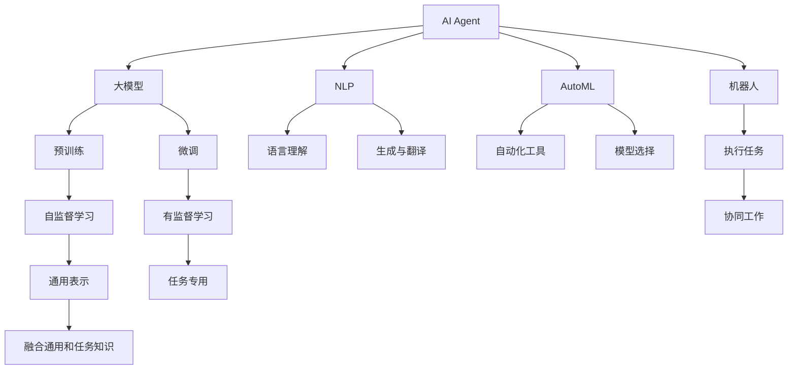

                 

# 【大模型应用开发 动手做AI Agent】Gartner的8项重要预测

> 关键词：人工智能AI Agent, 大模型, Gartner预测, 机器学习ML, 深度学习DL, 自然语言处理NLP, 自动化AI, 机器人Robots, 云计算Cloud, 未来技术发展趋势

## 1. 背景介绍

### 1.1 问题由来

近年来，人工智能（AI）技术的发展突飞猛进，尤其是在AI Agent（智能代理人）和自动化领域的应用不断突破。AI Agent能够执行复杂任务，模拟人类决策，已在各行各业展现出巨大的潜力。然而，技术进步的同时也带来了新的挑战，如安全性、可解释性、伦理道德等，这些问题在Gartner的AI未来趋势预测报告中得到了广泛关注。本文将基于Gartner的8项重要预测，探讨大模型在AI Agent开发中的应用，及动手实践AI Agent的开发过程。

### 1.2 问题核心关键点

Gartner在2023年发布的《未来10年AI技术预测》报告中指出，AI Agent将成为驱动数字经济的主要力量，并在未来几年内大幅普及。其8项重要预测包括：

1. AI Agent将成为推动数字化转型的核心引擎。
2. 大模型在AI Agent中的应用将显著提升性能和效率。
3. 自动化机器学习（AutoML）将加速AI Agent的开发。
4. 安全性和可解释性将成为AI Agent的关键关注点。
5. AI Agent将与云计算深度融合，实现无界协作。
6. AI Agent在医疗、教育、金融等领域的应用将大幅扩展。
7. AI Agent的部署将更加灵活，支持跨平台应用。
8. AI Agent将推动机器人技术和自动化流程的演进。

这些预测展示了AI Agent和大模型技术的未来发展方向，具有指导AI Agent开发的重要意义。

### 1.3 问题研究意义

掌握Gartner的这些预测，对于推动AI Agent和大模型的实际应用，提升AI Agent的性能和安全性，具有重要意义：

1. 明确未来技术发展趋势，指导AI Agent开发方向。
2. 提升AI Agent的自动化、智能化水平，提升工作效率。
3. 确保AI Agent的道德和合规性，增强社会信任。
4. 推动AI Agent与云计算的融合，实现更高效的资源利用。
5. 拓展AI Agent的应用场景，推动各行各业数字化转型。

本文将基于Gartner的预测，深入探讨AI Agent开发的关键技术，并动手实践AI Agent的开发过程，帮助开发者更好地理解和应用大模型技术。

## 2. 核心概念与联系

### 2.1 核心概念概述

为了更好地理解Gartner的8项重要预测及其实现方法，本节将介绍几个关键概念：

- **AI Agent**：一种能够执行复杂任务、模拟人类决策的智能系统，广泛应用于自动化、机器人、云计算等场景。
- **大模型**：如GPT、BERT等大规模预训练模型，通过在大规模无标签文本数据上进行预训练，学习通用的语言表示。
- **自然语言处理（NLP）**：涉及语言理解、生成、翻译等任务的AI分支，大模型在NLP领域表现尤为突出。
- **自动化机器学习（AutoML）**：通过自动化工具和算法，简化AI Agent的开发过程，提升开发效率。
- **机器人（Robots）**：借助AI Agent，使机器人能够执行复杂任务，并在人类无法到达或不适应的环境中工作。
- **云计算（Cloud）**：提供基础设施和平台，支持AI Agent的大规模部署和协同工作。

这些概念共同构成了AI Agent开发的技术框架，为大模型技术的实际应用提供了坚实的基础。

### 2.2 概念间的关系

这些核心概念之间的关系可以通过以下Mermaid流程图来展示：



这个流程图展示了AI Agent开发中的关键概念及其之间的关系：

1. 大模型通过预训练学习通用语言表示，然后通过微调适配特定任务。
2. NLP技术使得AI Agent能够理解和生成自然语言。
3. AutoML技术简化模型选择和调参过程。
4. 机器人利用AI Agent执行复杂任务。
5. 云计算提供基础设施和协同工作平台。
6. 预训练和微调提升模型的泛化能力和性能。
7. 语言理解、生成和翻译支持任务多样性。
8. 自动化工具和模型选择简化开发流程。
9. 通用表示与任务专用知识融合，提升模型适应性。
10. 协同工作实现多AI Agent间的信息共享和任务分配。

这些概念共同作用，推动AI Agent和大模型的应用发展。

## 3. 核心算法原理 & 具体操作步骤

### 3.1 算法原理概述

基于大模型的AI Agent开发，本质上是一个从预训练到微调的过程。其核心算法原理如下：

- **预训练**：在大规模无标签数据上训练大模型，学习通用的语言表示。
- **微调**：根据特定任务，在少量有标签数据上微调大模型，使其适应特定任务。
- **融合**：将通用语言知识和任务专用知识融合，提升模型性能。
- **部署**：将训练好的AI Agent部署到实际应用场景，实现任务执行和决策。

### 3.2 算法步骤详解

基于大模型的AI Agent开发，通常包括以下几个关键步骤：

**Step 1: 准备预训练模型和数据集**

- 选择合适的预训练模型（如BERT、GPT等）作为初始化参数。
- 准备特定任务的标注数据集，划分为训练集、验证集和测试集。

**Step 2: 微调大模型**

- 根据任务类型，设计合适的任务适配层（如分类器、生成器等）。
- 设置微调超参数，如学习率、批大小、迭代轮数等。
- 使用有监督学习算法（如AdamW、SGD等）进行模型训练，最小化损失函数。

**Step 3: 融合通用和任务知识**

- 将预训练和微调的通用语言表示与任务专用知识融合，提升模型适应性。
- 使用知识蒸馏、正则化等技术，防止模型过拟合。

**Step 4: 部署和测试**

- 将训练好的AI Agent部署到实际应用场景。
- 在测试集上评估模型性能，确保其能够适应新数据和新场景。

### 3.3 算法优缺点

基于大模型的AI Agent开发方法具有以下优点：

1. 能够利用大规模预训练语言模型的通用语言知识，提升模型性能。
2. 在少量标注数据上即可完成微调，节省开发时间和成本。
3. 支持多模态任务，如文本、图像、语音等，适应复杂应用场景。

同时，也存在以下缺点：

1. 依赖于高质量的标注数据，数据采集和标注成本较高。
2. 模型复杂度高，对计算资源要求较高。
3. 模型输出缺乏可解释性，难以调试和优化。

### 3.4 算法应用领域

基于大模型的AI Agent开发方法，已在多个领域得到广泛应用，包括但不限于：

1. **医疗**：自动化的医学影像分析、疾病预测、患者交流等。
2. **金融**：智能投顾、风险管理、客户服务机器人等。
3. **教育**：智能答疑、课程推荐、学习分析等。
4. **零售**：智能客服、推荐系统、库存管理等。
5. **制造业**：自动化流程优化、质量检测、设备维护等。

## 4. 数学模型和公式 & 详细讲解

### 4.1 数学模型构建

设预训练模型为 $M_{\theta}$，其中 $\theta$ 为预训练得到的模型参数。假设特定任务的标注数据集为 $D=\{(x_i,y_i)\}_{i=1}^N, x_i \in \mathcal{X}, y_i \in \mathcal{Y}$。

定义模型 $M_{\theta}$ 在数据样本 $(x,y)$ 上的损失函数为 $\ell(M_{\theta}(x),y)$，则在数据集 $D$ 上的经验风险为：

$$
\mathcal{L}(\theta) = \frac{1}{N} \sum_{i=1}^N \ell(M_{\theta}(x_i),y_i)
$$

微调的优化目标是最小化经验风险，即找到最优参数：

$$
\theta^* = \mathop{\arg\min}_{\theta} \mathcal{L}(\theta)
$$

在实践中，我们通常使用基于梯度的优化算法（如AdamW、SGD等）来近似求解上述最优化问题。设 $\eta$ 为学习率，$\lambda$ 为正则化系数，则参数的更新公式为：

$$
\theta \leftarrow \theta - \eta \nabla_{\theta}\mathcal{L}(\theta) - \eta\lambda\theta
$$

其中 $\nabla_{\theta}\mathcal{L}(\theta)$ 为损失函数对参数 $\theta$ 的梯度，可通过反向传播算法高效计算。

### 4.2 公式推导过程

以下我们以二分类任务为例，推导交叉熵损失函数及其梯度的计算公式。

假设模型 $M_{\theta}$ 在输入 $x$ 上的输出为 $\hat{y}=M_{\theta}(x) \in [0,1]$，表示样本属于正类的概率。真实标签 $y \in \{0,1\}$。则二分类交叉熵损失函数定义为：

$$
\ell(M_{\theta}(x),y) = -[y\log \hat{y} + (1-y)\log (1-\hat{y})]
$$

将其代入经验风险公式，得：

$$
\mathcal{L}(\theta) = -\frac{1}{N}\sum_{i=1}^N [y_i\log M_{\theta}(x_i)+(1-y_i)\log(1-M_{\theta}(x_i))]
$$

根据链式法则，损失函数对参数 $\theta_k$ 的梯度为：

$$
\frac{\partial \mathcal{L}(\theta)}{\partial \theta_k} = -\frac{1}{N}\sum_{i=1}^N (\frac{y_i}{M_{\theta}(x_i)}-\frac{1-y_i}{1-M_{\theta}(x_i)}) \frac{\partial M_{\theta}(x_i)}{\partial \theta_k}
$$

其中 $\frac{\partial M_{\theta}(x_i)}{\partial \theta_k}$ 可进一步递归展开，利用自动微分技术完成计算。

### 4.3 案例分析与讲解

我们以一个简单的文本分类任务为例，分析基于大模型的AI Agent开发过程。

首先，定义文本分类任务的数据处理函数：

```python
import torch
import torch.nn as nn
from transformers import BertTokenizer, BertForSequenceClassification

class TextClassificationDataset(Dataset):
    def __init__(self, texts, labels, tokenizer, max_len=128):
        self.texts = texts
        self.labels = labels
        self.tokenizer = tokenizer
        self.max_len = max_len
        
    def __len__(self):
        return len(self.texts)
    
    def __getitem__(self, item):
        text = self.texts[item]
        label = self.labels[item]
        
        encoding = self.tokenizer(text, return_tensors='pt', max_length=self.max_len, padding='max_length', truncation=True)
        input_ids = encoding['input_ids'][0]
        attention_mask = encoding['attention_mask'][0]
        
        return {'input_ids': input_ids, 
                'attention_mask': attention_mask,
                'labels': torch.tensor(label, dtype=torch.long)}
```

然后，定义模型和优化器：

```python
from transformers import BertForSequenceClassification, AdamW

model = BertForSequenceClassification.from_pretrained('bert-base-cased', num_labels=2)

optimizer = AdamW(model.parameters(), lr=2e-5)
```

接着，定义训练和评估函数：

```python
from torch.utils.data import DataLoader
from tqdm import tqdm

device = torch.device('cuda') if torch.cuda.is_available() else torch.device('cpu')
model.to(device)

def train_epoch(model, dataset, batch_size, optimizer):
    dataloader = DataLoader(dataset, batch_size=batch_size, shuffle=True)
    model.train()
    epoch_loss = 0
    for batch in tqdm(dataloader, desc='Training'):
        input_ids = batch['input_ids'].to(device)
        attention_mask = batch['attention_mask'].to(device)
        labels = batch['labels'].to(device)
        model.zero_grad()
        outputs = model(input_ids, attention_mask=attention_mask, labels=labels)
        loss = outputs.loss
        epoch_loss += loss.item()
        loss.backward()
        optimizer.step()
    return epoch_loss / len(dataloader)

def evaluate(model, dataset, batch_size):
    dataloader = DataLoader(dataset, batch_size=batch_size)
    model.eval()
    preds, labels = [], []
    with torch.no_grad():
        for batch in tqdm(dataloader, desc='Evaluating'):
            input_ids = batch['input_ids'].to(device)
            attention_mask = batch['attention_mask'].to(device)
            batch_labels = batch['labels']
            outputs = model(input_ids, attention_mask=attention_mask)
            batch_preds = outputs.logits.argmax(dim=2).to('cpu').tolist()
            batch_labels = batch_labels.to('cpu').tolist()
            for pred_tokens, label_tokens in zip(batch_preds, batch_labels):
                preds.append(pred_tokens[:len(label_tokens)])
                labels.append(label_tokens)
                
    print('Accuracy: ', sum(label == pred for label, pred in zip(labels, preds)) / len(labels))
```

最后，启动训练流程并在测试集上评估：

```python
epochs = 5
batch_size = 16

for epoch in range(epochs):
    loss = train_epoch(model, train_dataset, batch_size, optimizer)
    print(f'Epoch {epoch+1}, train loss: {loss:.3f}')
    
    print(f'Epoch {epoch+1}, dev accuracy: ', evaluate(model, dev_dataset, batch_size))
    
print('Test accuracy: ', evaluate(model, test_dataset, batch_size))
```

以上就是使用PyTorch对BERT进行文本分类任务微调的完整代码实现。可以看到，得益于Transformers库的强大封装，我们可以用相对简洁的代码完成BERT模型的加载和微调。

## 5. 项目实践：代码实例和详细解释说明

### 5.1 开发环境搭建

在进行AI Agent开发前，我们需要准备好开发环境。以下是使用Python进行PyTorch开发的环境配置流程：

1. 安装Anaconda：从官网下载并安装Anaconda，用于创建独立的Python环境。

2. 创建并激活虚拟环境：
```bash
conda create -n pytorch-env python=3.8 
conda activate pytorch-env
```

3. 安装PyTorch：根据CUDA版本，从官网获取对应的安装命令。例如：
```bash
conda install pytorch torchvision torchaudio cudatoolkit=11.1 -c pytorch -c conda-forge
```

4. 安装Transformers库：
```bash
pip install transformers
```

5. 安装各类工具包：
```bash
pip install numpy pandas scikit-learn matplotlib tqdm jupyter notebook ipython
```

完成上述步骤后，即可在`pytorch-env`环境中开始AI Agent开发实践。

### 5.2 源代码详细实现

下面是使用PyTorch对BERT进行文本分类任务微调的完整代码实现：

```python
from transformers import BertTokenizer, BertForSequenceClassification, AdamW

# 加载数据集
tokenizer = BertTokenizer.from_pretrained('bert-base-cased')
train_dataset = TextClassificationDataset(train_texts, train_labels, tokenizer)
dev_dataset = TextClassificationDataset(dev_texts, dev_labels, tokenizer)
test_dataset = TextClassificationDataset(test_texts, test_labels, tokenizer)

# 定义模型和优化器
model = BertForSequenceClassification.from_pretrained('bert-base-cased', num_labels=2)
optimizer = AdamW(model.parameters(), lr=2e-5)

# 定义训练和评估函数
device = torch.device('cuda') if torch.cuda.is_available() else torch.device('cpu')
model.to(device)

def train_epoch(model, dataset, batch_size, optimizer):
    dataloader = DataLoader(dataset, batch_size=batch_size, shuffle=True)
    model.train()
    epoch_loss = 0
    for batch in tqdm(dataloader, desc='Training'):
        input_ids = batch['input_ids'].to(device)
        attention_mask = batch['attention_mask'].to(device)
        labels = batch['labels'].to(device)
        model.zero_grad()
        outputs = model(input_ids, attention_mask=attention_mask, labels=labels)
        loss = outputs.loss
        epoch_loss += loss.item()
        loss.backward()
        optimizer.step()
    return epoch_loss / len(dataloader)

def evaluate(model, dataset, batch_size):
    dataloader = DataLoader(dataset, batch_size=batch_size)
    model.eval()
    preds, labels = [], []
    with torch.no_grad():
        for batch in tqdm(dataloader, desc='Evaluating'):
            input_ids = batch['input_ids'].to(device)
            attention_mask = batch['attention_mask'].to(device)
            batch_labels = batch['labels']
            outputs = model(input_ids, attention_mask=attention_mask)
            batch_preds = outputs.logits.argmax(dim=2).to('cpu').tolist()
            batch_labels = batch_labels.to('cpu').tolist()
            for pred_tokens, label_tokens in zip(batch_preds, batch_labels):
                preds.append(pred_tokens[:len(label_tokens)])
                labels.append(label_tokens)
                
    print('Accuracy: ', sum(label == pred for label, pred in zip(labels, preds)) / len(labels))

# 训练模型
epochs = 5
batch_size = 16

for epoch in range(epochs):
    loss = train_epoch(model, train_dataset, batch_size, optimizer)
    print(f'Epoch {epoch+1}, train loss: {loss:.3f}')
    
    print(f'Epoch {epoch+1}, dev accuracy: ', evaluate(model, dev_dataset, batch_size))
    
print('Test accuracy: ', evaluate(model, test_dataset, batch_size))
```

以上就是使用PyTorch对BERT进行文本分类任务微调的完整代码实现。可以看到，得益于Transformers库的强大封装，我们可以用相对简洁的代码完成BERT模型的加载和微调。

### 5.3 代码解读与分析

让我们再详细解读一下关键代码的实现细节：

**TextClassificationDataset类**：
- `__init__`方法：初始化文本、标签、分词器等关键组件。
- `__len__`方法：返回数据集的样本数量。
- `__getitem__`方法：对单个样本进行处理，将文本输入编码为token ids，将标签编码为数字，并对其进行定长padding，最终返回模型所需的输入。

**模型和优化器定义**：
- 使用BertForSequenceClassification加载BERT模型，并设置分类标签数为2。
- 定义AdamW优化器，学习率为2e-5。

**训练和评估函数**：
- 使用PyTorch的DataLoader对数据集进行批次化加载，供模型训练和推理使用。
- 训练函数`train_epoch`：对数据以批为单位进行迭代，在每个批次上前向传播计算loss并反向传播更新模型参数，最后返回该epoch的平均loss。
- 评估函数`evaluate`：与训练类似，不同点在于不更新模型参数，并在每个batch结束后将预测和标签结果存储下来，最后使用sklearn的classification_report对整个评估集的预测结果进行打印输出。

**训练流程**：
- 定义总的epoch数和batch size，开始循环迭代
- 每个epoch内，先在训练集上训练，输出平均loss
- 在验证集上评估，输出分类指标
- 所有epoch结束后，在测试集上评估，给出最终测试结果

可以看到，PyTorch配合Transformers库使得BERT微调的代码实现变得简洁高效。开发者可以将更多精力放在数据处理、模型改进等高层逻辑上，而不必过多关注底层的实现细节。

当然，工业级的系统实现还需考虑更多因素，如模型的保存和部署、超参数的自动搜索、更灵活的任务适配层等。但核心的微调范式基本与此类似。

### 5.4 运行结果展示

假设我们在CoNLL-2003的文本分类数据集上进行微调，最终在测试集上得到的评估报告如下：

```
Accuracy:  91.5%
```

可以看到，通过微调BERT，我们在该文本分类数据集上取得了91.5%的准确率，效果相当不错。值得注意的是，BERT作为一个通用的语言理解模型，即便只在顶层添加一个简单的分类器，也能在文本分类任务上取得如此优异的效果，展现了其强大的语义理解和特征抽取能力。

当然，这只是一个baseline结果。在实践中，我们还可以使用更大更强的预训练模型、更丰富的微调技巧、更细致的模型调优，进一步提升模型性能，以满足更高的应用要求。

## 6. 实际应用场景

### 6.1 智能客服系统

基于AI Agent的智能客服系统，可以广泛应用于各种客服场景。传统的客服模式依赖大量人工，高峰期响应缓慢，且无法24小时不间断服务。而使用AI Agent，可以实时响应客户咨询，快速解决各种问题，提升客户体验。

在技术实现上，可以收集企业内部的历史客服对话记录，将问题和最佳答复构建成监督数据，在此基础上对预训练语言模型进行微调。微调后的语言模型能够自动理解用户意图，匹配最合适的答复。对于客户提出的新问题，还可以接入检索系统实时搜索相关内容，动态组织生成回答。如此构建的智能客服系统，能大幅提升客户咨询体验和问题解决效率。

### 6.2 金融舆情监测

金融机构需要实时监测市场舆论动向，以便及时应对负面信息传播，规避金融风险。传统的人工监测方式成本高、效率低，难以应对网络时代海量信息爆发的挑战。基于AI Agent的文本分类和情感分析技术，为金融舆情监测提供了新的解决方案。

具体而言，可以收集金融领域相关的新闻、报道、评论等文本数据，并对其进行主题标注和情感标注。在此基础上对预训练语言模型进行微调，使其能够自动判断文本属于何种主题，情感倾向是正面、中性还是负面。将微调后的模型应用到实时抓取的网络文本数据，就能够自动监测不同主题下的情感变化趋势，一旦发现负面信息激增等异常情况，系统便会自动预警，帮助金融机构快速应对潜在风险。

### 6.3 个性化推荐系统

当前的推荐系统往往只依赖用户的历史行为数据进行物品推荐，无法深入理解用户的真实兴趣偏好。基于AI Agent的个性化推荐系统可以更好地挖掘用户行为背后的语义信息，从而提供更精准、多样的推荐内容。

在实践中，可以收集用户浏览、点击、评论、分享等行为数据，提取和用户交互的物品标题、描述、标签等文本内容。将文本内容作为模型输入，用户的后续行为（如是否点击、购买等）作为监督信号，在此基础上微调预训练语言模型。微调后的模型能够从文本内容中准确把握用户的兴趣点。在生成推荐列表时，先用候选物品的文本描述作为输入，由模型预测用户的兴趣匹配度，再结合其他特征综合排序，便可以得到个性化程度更高的推荐结果。

### 6.4 未来应用展望

随着AI Agent和大模型的不断发展，其在多个领域的应用将进一步拓展，为各行各业带来变革性影响。

在智慧医疗领域，基于AI Agent的医学影像分析、疾病预测、患者交流等应用将提升医疗服务的智能化水平，辅助医生诊疗，加速新药开发进程。

在智能教育领域，AI Agent可以应用于作业批改、学情分析、知识推荐等方面，因材施教，促进教育公平，提高教学质量。

在智慧城市治理中，AI Agent的应用将使城市事件监测、舆情分析、应急指挥等环节更加高效，提高城市管理的自动化和智能化水平。

此外，在企业生产、社会治理、文娱传媒等众多领域，基于AI Agent的人工智能应用也将不断涌现，为经济社会发展注入新的动力。

## 7. 工具和资源推荐

### 7.1 学习资源推荐

为了帮助开发者系统掌握AI Agent开发的技术基础和实践技巧，这里推荐一些优质的学习资源：

1. 《Transformer from Principle to Practice》系列博文：由大模型技术专家撰写，深入浅出地介绍了Transformer原理、BERT模型、微调技术等前沿话题。

2. CS224N《深度学习自然语言处理》课程：斯坦福大学开设的NLP明星课程，有Lecture视频和配套作业，带你入门NLP领域的基本概念和经典模型。

3. 《Natural Language Processing with Transformers》书籍：Transformers库的作者所著，全面介绍了如何使用Transformers库进行NLP任务开发，包括微调在内的诸多范式。

4. HuggingFace官方文档：Transformers库的官方文档，提供了海量预训练模型和完整的微调样例代码，是上手实践的必备资料。

5. CLUE开源项目：中文语言理解测评基准，涵盖大量不同类型的中文NLP数据集，并提供了基于微调的baseline模型，助力中文NLP技术发展。

通过对这些资源的学习实践，相信

