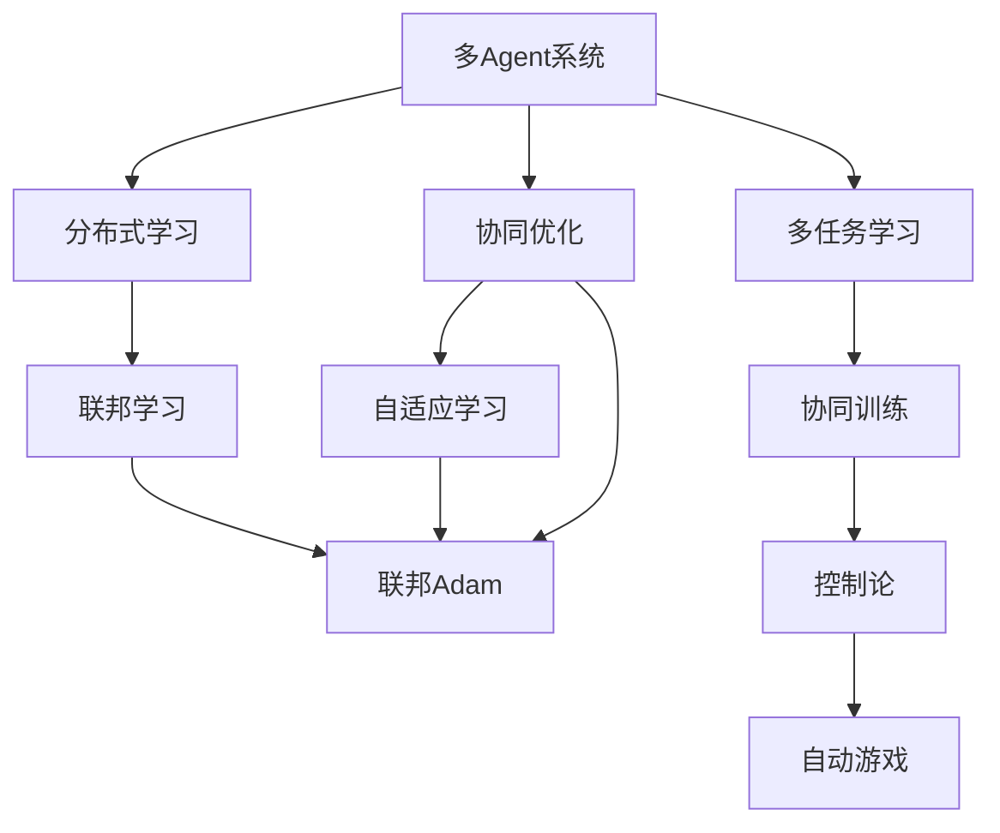
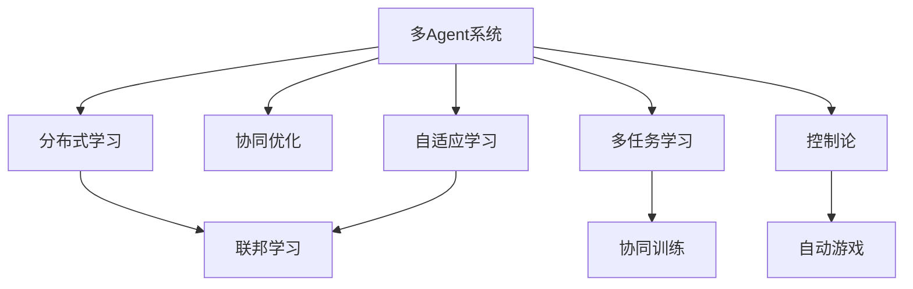
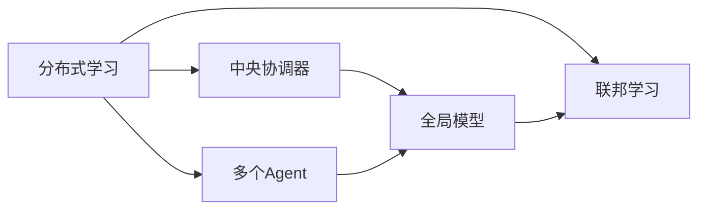
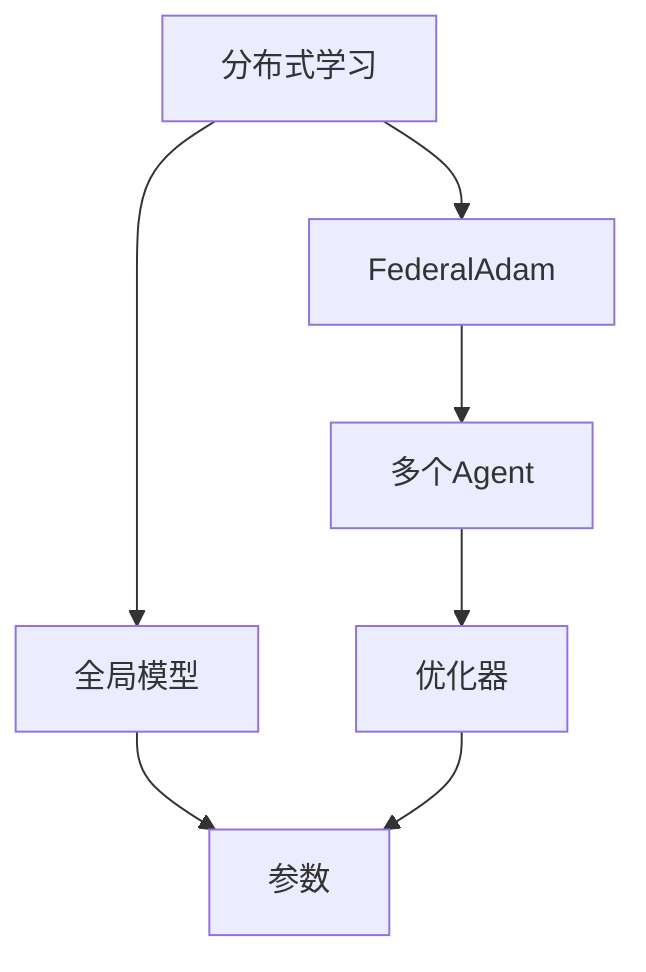
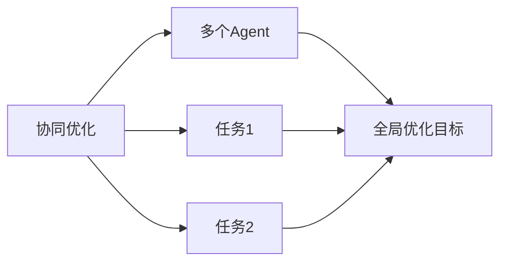
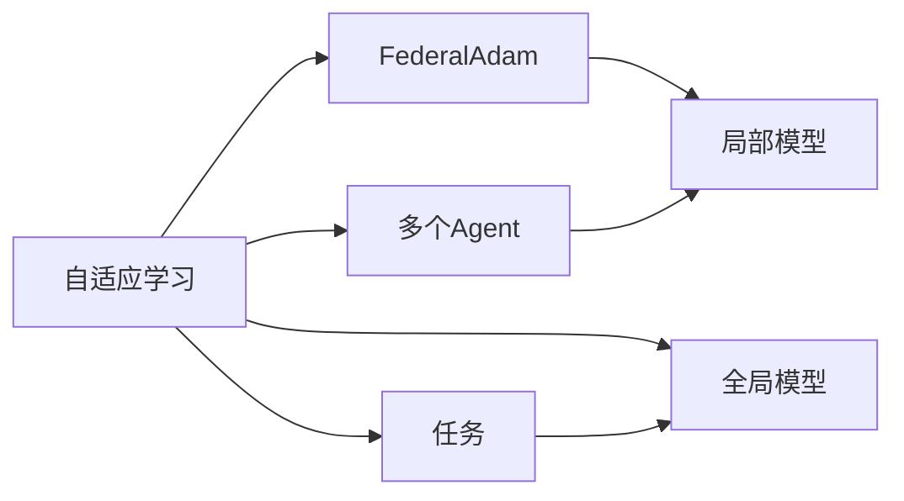
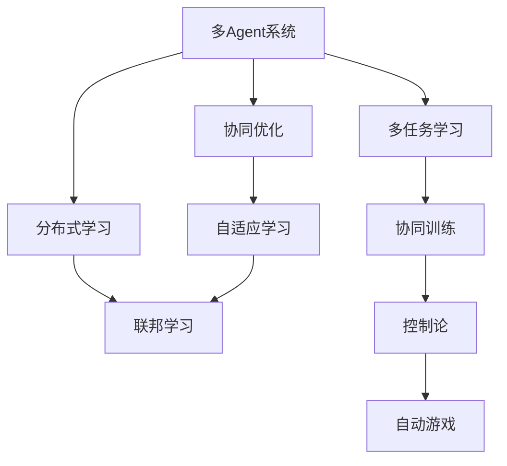

                 

# 【大模型应用开发 动手做AI Agent】从单Agent到多Agent

> 关键词：多Agent, 分布式学习, 协同优化, 联邦学习, 自适应学习, 联邦Adam, 多任务学习, 协同训练, 控制论, 自动游戏

## 1. 背景介绍

在人工智能(AI)领域，多Agent系统(Multi-Agent Systems,MAS)作为分布式智能体的集合，展现了广泛的应用前景，涵盖了智能制造、社交网络、机器人协作、自动驾驶等多个领域。近年来，基于大模型的多Agent系统逐渐成为研究热点，各类开源平台如DALL-E、JAX等使得AI Agent的开发更加高效便捷，吸引了大量研究者和开发者加入。

尽管如此，大模型Agent的开发依旧需要深厚的理论功底和丰富的工程经验，许多优秀的实践代码散落在各处，难以系统学习。因此，本文将系统讲解基于大模型的多Agent系统开发，从单Agent到多Agent的演化路径，以及各个关键环节的实践技巧。

## 2. 核心概念与联系

### 2.1 核心概念概述

为更好地理解基于大模型的多Agent系统，本节将介绍几个密切相关的核心概念：

- 单Agent：指一个单独的智能体，具有独立感知、决策和执行能力。
- 多Agent系统：由多个Agent组成的协作系统，每个Agent可以自主做出决策并影响环境。
- 分布式学习：指多个Agent通过交换信息和模型参数，协同完成学习任务。
- 联邦学习：一种分布式学习范式，多个Agent在不共享本地数据的前提下，协同优化全局模型。
- 自适应学习：指Agent根据环境反馈，动态调整自身策略和参数。
- 协同优化：指多个Agent通过联合优化目标函数，提升系统整体性能。
- 联邦Adam：一种优化算法，结合了联邦学习与Adam优化器的特点，用于分布式多Agent系统。
- 多任务学习：指Agent可以同时学习多个任务，提升泛化能力。
- 协同训练：指多个Agent共同训练一个全局模型，实现知识共享。
- 控制论：研究如何通过模型和算法控制Agent行为，达到系统目标。
- 自动游戏：指Agent在虚拟环境中通过与环境的交互，学习控制策略。

这些概念之间的逻辑关系可以通过以下Mermaid流程图来展示：



这个流程图展示了大模型多Agent系统的核心概念及其之间的关系：

1. 多Agent系统通过分布式学习、协同优化、自适应学习等方式协作学习，提升系统性能。
2. 联邦学习、协同训练和联邦Adam等技术，促进了分布式Agent之间的知识共享和协同优化。
3. 多任务学习使Agent同时具备处理多种任务的能力，提升泛化性能。
4. 控制论为Agent行为建模和系统控制提供理论基础。
5. 自动游戏通过虚拟环境中的交互，使Agent掌握更为复杂的环境适应能力。

通过理解这些核心概念，我们可以更好地把握大模型多Agent系统的学习机理和优化方向。

### 2.2 概念间的关系

这些核心概念之间存在着紧密的联系，形成了大模型多Agent系统的完整生态系统。下面我通过几个Mermaid流程图来展示这些概念之间的关系。

#### 2.2.1 多Agent系统的学习范式



这个流程图展示了多Agent系统的三种主要学习范式：分布式学习、自适应学习、多任务学习。这些范式帮助Agent在复杂多变的环境下高效协作，同时通过协同训练和控制论方法，提升系统整体性能。

#### 2.2.2 分布式学习与联邦学习的关系



这个流程图展示了分布式学习和联邦学习的基本原理，即多个Agent在中央协调器的控制下，协作更新全局模型。在联邦学习中，Agent不共享本地数据，只交换模型参数，从而保障了数据隐私和安全性。

#### 2.2.3 联邦Adam算法



这个流程图展示了联邦Adam算法的原理，即在每个Agent更新局部模型参数时，使用Adam优化器进行优化，同时将梯度向全局模型参数更新，实现全局模型参数的同步更新。

#### 2.2.4 协同优化和多任务学习的关系



这个流程图展示了协同优化和多任务学习的关联，即多个Agent同时处理多个任务，通过协同优化目标函数，提升系统整体性能。

#### 2.2.5 自适应学习与联邦学习的关系



这个流程图展示了自适应学习与联邦学习的关联，即每个Agent通过局部模型参数的更新，同时考虑全局模型的协同优化，动态调整自身策略，从而提升系统性能。

### 2.3 核心概念的整体架构

最后，我们用一个综合的流程图来展示这些核心概念在大模型多Agent系统中整体的架构：



这个综合流程图展示了从预训练到多Agent系统构建的完整过程。多Agent系统首先通过预训练获得基础能力，然后通过分布式学习、协同优化、自适应学习等方式协作学习，提升系统性能。联邦学习和多任务学习等技术促进了分布式Agent之间的知识共享和协同优化。控制论和自动游戏技术为Agent行为建模和系统控制提供理论基础。通过这些流程图，我们可以更清晰地理解大模型多Agent系统的学习机理和优化方向。

## 3. 核心算法原理 & 具体操作步骤
### 3.1 算法原理概述

基于大模型的多Agent系统，本质上是一个分布式学习的过程，其核心思想是：将预训练的大模型视为一个强大的"特征提取器"，通过多个Agent协作，同时处理多个任务，并交换模型参数，最大化全局性能。

形式化地，假设预训练语言模型为 $M_{\theta}$，其中 $\theta$ 为预训练得到的模型参数。假设多个Agent共有的全局模型为 $M_{\Phi}$，其中 $\Phi$ 为全局模型的参数。每个Agent的本地模型为 $M_{\theta_i}$。

在每个时间步 $t$，第 $i$ 个Agent接收当前任务 $T_i$ 和全局模型 $M_{\Phi}$ 的参数。Agent通过本地模型 $M_{\theta_i}$ 预测任务 $T_i$ 的输出 $y_i$，同时根据任务 $T_i$ 的真实标签 $y_{t,i}$ 计算损失函数 $\ell_i$。Agent的目标是最大化其任务 $T_i$ 的性能，同时最小化任务 $T_i$ 与全局模型的差异。

因此，Agent的优化目标可以表示为：

$$
\mathop{\arg\min}_{\theta_i} \sum_{t} \ell_i(y_i, y_{t,i}) + \gamma \mathcal{L}(\theta_i, M_{\Phi})
$$

其中 $\gamma$ 为平衡因子，用于控制局部模型与全局模型的耦合程度。$\mathcal{L}$ 为全局模型的损失函数，可以是交叉熵损失、均方误差损失等。

### 3.2 算法步骤详解

基于大模型的多Agent系统微调一般包括以下几个关键步骤：

**Step 1: 准备预训练模型和数据集**
- 选择合适的预训练语言模型 $M_{\theta}$ 作为初始化参数，如 BERT、GPT等。
- 准备多个Agent共有的全局模型 $M_{\Phi}$ 的参数初始化。
- 准备各Agent的任务数据集 $D_i$，其中每个Agent的任务数据集包含训练集、验证集和测试集。

**Step 2: 设计全局模型和任务适配层**
- 根据任务类型，在预训练模型的基础上设计全局模型 $M_{\Phi}$ 的输出层和损失函数。
- 对于分类任务，通常在全局模型的顶层添加线性分类器和交叉熵损失函数。
- 对于生成任务，通常使用语言模型的解码器输出概率分布，并以负对数似然为损失函数。
- 对于每个Agent的任务 $T_i$，设计相应的本地模型 $M_{\theta_i}$ 和损失函数 $\ell_i$。

**Step 3: 设置微调超参数**
- 选择合适的优化算法及其参数，如 AdamW、SGD 等，设置学习率、批大小、迭代轮数等。
- 设置正则化技术及强度，包括权重衰减、Dropout、Early Stopping 等。
- 确定冻结预训练参数的策略，如仅微调顶层，或全部参数都参与微调。

**Step 4: 执行梯度训练**
- 将各Agent的任务数据集 $D_i$ 分批次输入全局模型和本地模型，前向传播计算损失函数。
- 反向传播计算参数梯度，根据设定的优化算法和学习率更新全局模型 $M_{\Phi}$ 和本地模型 $M_{\theta_i}$ 的参数。
- 周期性在验证集上评估模型性能，根据性能指标决定是否触发 Early Stopping。
- 重复上述步骤直到满足预设的迭代轮数或 Early Stopping 条件。

**Step 5: 测试和部署**
- 在测试集上评估微调后全局模型 $M_{\Phi}$ 和本地模型 $M_{\theta_i}$ 的性能，对比微调前后的精度提升。
- 使用微调后的模型对新样本进行推理预测，集成到实际的应用系统中。
- 持续收集新的数据，定期重新微调全局模型和本地模型，以适应数据分布的变化。

以上是基于大模型的多Agent系统微调的一般流程。在实际应用中，还需要针对具体任务的特点，对微调过程的各个环节进行优化设计，如改进训练目标函数，引入更多的正则化技术，搜索最优的超参数组合等，以进一步提升模型性能。

### 3.3 算法优缺点

基于大模型的多Agent系统微调方法具有以下优点：

1. 高效协作。多个Agent同时处理多个任务，可以充分利用计算资源，加速模型训练和推理。
2. 鲁棒性强。通过分布式学习，多个Agent相互监督，减少了模型过拟合的风险。
3. 灵活可扩展。可以根据需要添加或删除Agent，系统灵活可调。
4. 泛化能力强。多个Agent同时处理多种任务，提升泛化能力和模型性能。
5. 高鲁棒性。通过联邦学习、自适应学习等技术，模型对不同Agent的分布变化具有较强的鲁棒性。

同时，该方法也存在一些局限性：

1. 模型复杂度高。大模型和高维参数空间，增加了系统的复杂性，需要更高的技术门槛。
2. 同步通信开销大。分布式Agent间的通信和同步，增加了系统计算开销。
3. 数据隐私风险高。多个Agent交换模型参数，可能涉及敏感数据，存在数据泄露风险。
4. 本地模型权重更新困难。各Agent的本地模型需要同时更新，可能导致更新冲突。
5. 超参数调优复杂。系统涉及多个Agent和多个任务，超参数调优难度增加。

尽管存在这些局限性，但就目前而言，基于大模型的多Agent系统微调方法仍然是大模型应用的重要范式。未来相关研究的重点在于如何进一步降低复杂性，提升系统的鲁棒性和效率，同时兼顾数据隐私和安全等因素。

### 3.4 算法应用领域

基于大模型的多Agent系统微调方法已经在诸多领域得到应用，例如：

- 多任务学习：多个Agent同时学习多个任务，提升模型泛化能力。
- 分布式计算：多个Agent协作处理大规模数据集，提升计算效率。
- 协同推荐系统：多个Agent协同生成推荐结果，提升推荐效果。
- 自动驾驶：多个Agent协作感知和决策，提升驾驶安全性和稳定性。
- 医疗诊断：多个Agent协同分析医疗数据，提升诊断准确性。
- 游戏AI：多个Agent协作完成游戏任务，提升游戏AI的表现。

除了上述这些经典应用外，多Agent系统还广泛应用于协作制造、机器人协作、智能城市管理等更多场景中，为各行各业带来了新的突破和机遇。

## 4. 数学模型和公式 & 详细讲解  
### 4.1 数学模型构建

本节将使用数学语言对基于大模型的多Agent系统微调过程进行更加严格的刻画。

记预训练语言模型为 $M_{\theta}$，其中 $\theta$ 为预训练得到的模型参数。假设全局模型为 $M_{\Phi}$，其中 $\Phi$ 为全局模型的参数。假设多个Agent的任务数据集为 $D_i$，其中 $i$ 表示第 $i$ 个Agent的任务。

定义全局模型 $M_{\Phi}$ 在数据样本 $(x,y)$ 上的损失函数为 $\ell(M_{\Phi}(x),y)$，则在数据集 $D_i$ 上的经验风险为：

$$
\mathcal{L}_i(\Phi) = \frac{1}{N_i} \sum_{(x,y) \in D_i} \ell(M_{\Phi}(x),y)
$$

定义每个Agent的任务 $T_i$ 的本地模型 $M_{\theta_i}$ 在数据样本 $(x_i,y_i)$ 上的损失函数为 $\ell_i(M_{\theta_i}(x_i),y_i)$，则在数据集 $D_i$ 上的经验风险为：

$$
\mathcal{L}_i(\theta_i) = \frac{1}{N_i} \sum_{(x_i,y_i) \in D_i} \ell_i(M_{\theta_i}(x_i),y_i)
$$

其中 $N_i$ 表示第 $i$ 个Agent的任务数据集 $D_i$ 的样本数。

多个Agent协作学习时，每个Agent的目标是最大化其任务 $T_i$ 的性能，同时最小化全局模型的损失 $\mathcal{L}_i$，因此优化目标可以表示为：

$$
\mathop{\arg\min}_{\theta_i, \Phi} \sum_{i=1}^N \mathcal{L}_i(\theta_i, \Phi)
$$

在实践中，我们通常使用基于梯度的优化算法（如SGD、Adam等）来近似求解上述最优化问题。设 $\eta$ 为学习率，$\lambda$ 为正则化系数，则参数的更新公式为：

$$
\theta_i \leftarrow \theta_i - \eta \nabla_{\theta_i}\mathcal{L}_i(\theta_i, \Phi) - \eta\lambda\theta_i
$$

$$
\Phi \leftarrow \Phi - \eta \nabla_{\Phi}\mathcal{L}_i(\theta_i, \Phi)
$$

其中 $\nabla_{\theta_i}\mathcal{L}_i(\theta_i, \Phi)$ 和 $\nabla_{\Phi}\mathcal{L}_i(\theta_i, \Phi)$ 分别为损失函数对局部模型 $\theta_i$ 和全局模型 $\Phi$ 的梯度，可通过反向传播算法高效计算。

### 4.2 公式推导过程

以下我们以二分类任务为例，推导联邦Adam算法在多Agent系统中的梯度更新公式。

假设全局模型 $M_{\Phi}$ 在输入 $x$ 上的输出为 $\hat{y}=M_{\Phi}(x)$，表示样本属于正类的概率。真实标签 $y \in \{0,1\}$。则二分类交叉熵损失函数定义为：

$$
\ell(M_{\Phi}(x),y) = -[y\log \hat{y} + (1-y)\log (1-\hat{y})]
$$

将其代入经验风险公式，得：

$$
\mathcal{L}_i(\Phi) = -\frac{1}{N_i}\sum_{(x,y) \in D_i} [y_i\log M_{\Phi}(x_i)+(1-y_i)\log(1-M_{\Phi}(x_i))]
$$

根据链式法则，损失函数对全局模型 $\Phi$ 的梯度为：

$$
\nabla_{\Phi}\mathcal{L}_i(\theta_i, \Phi) = -\frac{1}{N_i}\sum_{(x,y) \in D_i} (\frac{y_i}{M_{\Phi}(x_i)}-\frac{1-y_i}{1-M_{\Phi}(x_i)}) \frac{\partial M_{\Phi}(x_i)}{\partial \Phi}
$$

根据联邦Adam算法，每个Agent需要更新本地模型 $M_{\theta_i}$ 和全局模型 $M_{\Phi}$ 的参数。根据梯度下降和Adam优化算法，本地模型的梯度更新公式为：

$$
\theta_i \leftarrow \theta_i - \eta \nabla_{\theta_i}\mathcal{L}_i(\theta_i, \Phi) - \eta\lambda\theta_i
$$

全局模型的梯度更新公式为：

$$
\Phi \leftarrow \Phi - \eta \nabla_{\Phi}\mathcal{L}_i(\theta_i, \Phi)
$$

其中 $\nabla_{\theta_i}\mathcal{L}_i(\theta_i, \Phi)$ 和 $\nabla_{\Phi}\mathcal{L}_i(\theta_i, \Phi)$ 的计算与单Agent系统类似。

在得到损失函数的梯度后，即可带入参数更新公式，完成模型的迭代优化。重复上述过程直至收敛，最终得到适应多个任务和分布的多Agent系统。

## 5. 项目实践：代码实例和详细解释说明
### 5.1 开发环境搭建

在进行多Agent系统开发前，我们需要准备好开发环境。以下是使用Python进行PyTorch开发的环境配置流程：

1. 安装Anaconda：从官网下载并安装Anaconda，用于创建独立的Python环境。

2. 创建并激活虚拟环境：
```bash
conda create -n pytorch-env python=3.8 
conda activate pytorch-env
```

3. 安装PyTorch：根据CUDA版本，从官网获取对应的安装命令。例如：
```bash
conda install pytorch torchvision torchaudio cudatoolkit=11.1 -c pytorch -c conda-forge
```

4. 安装Transformers库：
```bash
pip install transformers
```

5. 安装各类工具包：
```bash
pip install numpy pandas scikit-learn matplotlib tqdm jupyter notebook ipython
```

完成上述步骤后，即可在`pytorch-env`环境中开始多Agent系统开发。

### 5.2 源代码详细实现

这里我们以多任务学习为例，给出使用Transformers库对BERT模型进行多Agent系统微调的PyTorch代码实现。

首先，定义多任务数据处理函数：

```python
from transformers import BertTokenizer
from torch.utils.data import Dataset
import torch

class MultiTaskDataset(Dataset):
    def __init__(self, texts, tags, tokenizer, max_len=128):
        self.texts = texts
        self.tags = tags
        self.tokenizer = tokenizer
        self.max_len = max_len
        
    def __len__(self):
        return len(self.texts)
    
    def __getitem__(self, item):
        text = self.texts[item]
        tags = self.tags[item]
        
        encoding = self.tokenizer(text, return_tensors='pt', max_length=self.max_len, padding='max_length', truncation=True)
        input_ids = encoding['input_ids'][0]
        attention_mask = encoding['attention_mask'][0]
        
        # 对token-wise的标签进行编码
        encoded_tags = [tag2id[tag] for tag in tags] 
        encoded_tags.extend([tag2id['O']] * (self.max_len - len(encoded_tags)))
        labels = torch.tensor(encoded_tags, dtype=torch.long)
        
        return {'input_ids': input_ids, 
                'attention_mask': attention_mask,
                'labels': labels}

# 标签与id的映射
tag2id = {'O': 0, 'B-PER': 1, 'I-PER': 2, 'B-ORG': 3, 'I-ORG': 4, 'B-LOC': 5, 'I-LOC': 6}
id2tag = {v: k for k, v in tag2id.items()}

# 创建dataset
tokenizer = BertTokenizer.from_pretrained('bert-base-cased')

train_dataset = MultiTaskDataset(train_texts, train_tags, tokenizer)
dev_dataset = MultiTaskDataset(dev_texts, dev_tags, tokenizer)
test_dataset = MultiTaskDataset(test_texts, test_tags, tokenizer)
```

然后，定义模型和优化器：

```python
from transformers import BertForTokenClassification, AdamW

model = BertForTokenClassification.from_pretrained('bert-base-cased', num_labels=len(tag2id))

optimizer = AdamW(model.parameters(), lr=2e-5)
```

接着，定义训练和评估函数：

```python
from torch.utils.data import DataLoader
from tqdm import tqdm
from sklearn.metrics import classification_report

device = torch.device('cuda') if torch.cuda.is_available() else torch.device('cpu')
model.to(device)

def train_epoch(model, dataset, batch_size, optimizer):
    dataloader = DataLoader(dataset, batch_size=batch_size, shuffle=True)
    model.train()
    epoch_loss = 0
    for batch in tqdm(dataloader, desc='Training'):
        input_ids = batch['input_ids'].to(device)
        attention_mask = batch['attention_mask'].to(device)
        labels = batch['labels'].to(device)
        model.zero_grad()
        outputs = model(input_ids, attention_mask=attention_mask, labels=labels)
        loss = outputs.loss
        epoch_loss += loss.item()
        loss.backward()
        optimizer.step()
    return epoch_loss / len(dataloader)

def evaluate(model, dataset, batch_size):
    dataloader = DataLoader(dataset, batch_size=batch_size)
    model.eval()
    preds, labels = [], []
    with torch.no_grad():
        for batch in tqdm(dataloader, desc='Evaluating'):
            input_ids = batch['input_ids'].to(device)
            attention_mask = batch['attention_mask'].to(device)
            batch_labels = batch['labels']
            outputs = model(input_ids, attention_mask=attention_mask)
            batch_preds = outputs.logits.argmax(dim=2).to('cpu').tolist()
            batch_labels = batch_labels.to('cpu').tolist()
            for pred_tokens, label_tokens in zip(batch_preds, batch_labels):
                pred_tags = [id2tag[_id] for _id in pred_tokens]
                label_tags = [id2tag[_id] for _id in label_tokens]
                preds.append(pred_tags[:len(label_tokens)])
                labels.append(label_tags)
                
    print(classification_report(labels, preds))
```

最后，启动训练流程并在测试集上评估：

```python
epochs = 5
batch_size = 16

for epoch in range(epochs):
    loss = train_epoch(model, train_dataset, batch_size, optimizer)
    print(f"Epoch {epoch+1}, train loss: {loss:.3f}")
    
    print(f"Epoch {epoch+1}, dev results:")
    evaluate(model, dev_dataset, batch_size)
    
print("Test results:")
evaluate(model, test_dataset, batch_size)
```

以上就是使用PyTorch对BERT模型进行多任务学习任务微调的完整代码实现。可以看到，得益于Transformers库的强大封装，我们可以用相对简洁的代码完成BERT模型的加载和微调。

### 5.3 代码解读与分析

让我们再详细解读一下关键代码的实现细节：

**MultiTaskDataset类**：
- `__init__`方法：初始化文本、标签、分词器等关键组件。
- `__len__`方法：返回数据集的样本数量。
- `__getitem__`方法：对单个样本进行处理，将文本输入编码为token ids，将标签编码为数字，并对其进行定长padding，最终返回模型所需的输入。

**tag2id和id2tag字典**：
- 定义了标签与数字id之间的映射关系，用于将token-wise的预测结果解码回真实的标签。


