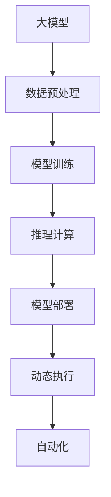
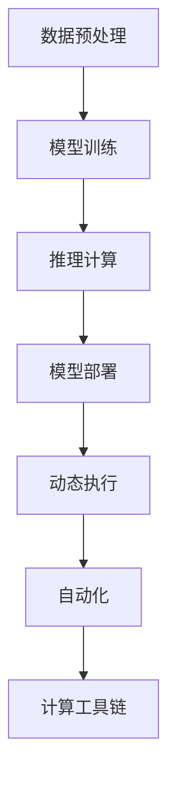

                 

# 【大模型应用开发 动手做AI Agent】第二轮行动：工具执行计算

> 关键词：大模型应用, AI Agent, 计算工具, 动态执行, 自动化, 工具链

## 1. 背景介绍

### 1.1 问题由来

在当前人工智能(AI)技术的快速迭代中，大模型应用日益受到关注。大模型通过在海量数据上进行预训练，具备强大的学习能力，能够在各种任务中表现出色。然而，大模型通常需要大量计算资源和训练时间，对于一般的应用场景可能并不现实。因此，如何利用现有的计算资源和大模型进行应用开发，成为当前AI技术落地应用的重要挑战。

### 1.2 问题核心关键点

本轮行动的重点是“工具执行计算”，即如何在现有的计算工具链上，通过一系列工具和库，高效地执行大模型的计算任务，实现AI Agent的应用开发。这一过程包括但不限于数据预处理、模型训练、推理计算和模型部署等环节。

### 1.3 问题研究意义

通过本轮行动，我们将探索和实现大模型应用的自动化、动态化执行过程，以实现以下目标：

- 降低应用开发成本：利用开源工具和库，减少对计算资源的依赖。
- 提升模型效果：在有限计算资源下，通过高效的计算工具，获得最佳的模型性能。
- 加速应用开发周期：通过自动化和动态执行技术，缩短从模型训练到应用部署的时间。
- 增强模型可扩展性：在保持模型性能的同时，支持模型的升级和扩展。
- 提升应用稳定性：通过科学合理地选择和使用计算工具，保障应用系统的稳定运行。

## 2. 核心概念与联系

### 2.1 核心概念概述

为更好地理解本轮行动的实施过程，本节将介绍几个核心概念：

- **大模型**：指通过大规模数据预训练得到的强大模型，如BERT、GPT等。这些模型通常具有高精度的语义理解和生成能力。
- **AI Agent**：智能代理，能够自主执行任务并与其他系统或环境互动的AI系统。AI Agent可以是聊天机器人、推荐系统、智能导航等多种形式。
- **计算工具链**：指一系列工具和库，如TensorFlow、PyTorch、ONNX等，用于构建、训练和部署AI模型的生态系统。
- **动态执行**：指在运行时动态调整模型的计算方式和参数，以适应不同的应用场景和数据分布。
- **自动化**：指通过脚本或工具，自动化执行模型的训练、推理和部署过程。

### 2.2 概念间的关系

这些核心概念之间的关系可以通过以下Mermaid流程图来展示：



这个流程图展示了从数据预处理到模型部署的整个AI Agent开发过程。大模型通过一系列计算工具进行处理和优化，最终部署到应用系统中。在这个过程中，动态执行和自动化技术保障了模型的高效和稳定运行。

### 2.3 核心概念的整体架构

最后，我们用一个综合的流程图来展示这些核心概念在大模型应用开发中的整体架构：



这个综合流程图展示了数据预处理、模型训练、推理计算、模型部署、动态执行、自动化和计算工具链在大模型应用开发中的作用和联系。

## 3. 核心算法原理 & 具体操作步骤

### 3.1 算法原理概述

本轮行动的核心算法原理是利用现有计算工具链的动态执行和自动化特性，高效执行大模型的计算任务。具体来说，包括以下几个步骤：

1. **数据预处理**：将原始数据转换为模型所需的格式，包括清洗、归一化、分词等操作。
2. **模型训练**：在计算工具链上，选择合适的模型和超参数，使用训练集进行模型训练。
3. **推理计算**：利用推理工具，根据输入数据和模型参数，生成推理结果。
4. **模型部署**：将训练好的模型部署到生产环境中，供实际应用使用。
5. **动态执行**：根据应用场景和数据分布，动态调整模型的计算方式和参数。
6. **自动化**：通过脚本和工具，自动化执行上述各个步骤，减少人工干预。

### 3.2 算法步骤详解

#### 3.2.1 数据预处理

数据预处理是应用开发的第一步。主要包括以下几个步骤：

1. **数据清洗**：去除数据中的噪声和异常值，确保数据质量。
2. **数据归一化**：将数据转换为标准化的格式，方便模型处理。
3. **分词和向量化**：将文本数据转换为模型能够理解的向量表示。
4. **标注和切分**：为训练数据添加标签，并按照批次进行切分。

#### 3.2.2 模型训练

模型训练是应用开发的第二步。主要包括以下几个步骤：

1. **选择模型**：根据任务需求，选择合适的预训练模型或自定义模型。
2. **配置超参数**：设定学习率、批大小、迭代轮数等超参数。
3. **数据加载**：使用DataLoader加载预处理后的数据。
4. **模型训练**：在计算工具链上，使用训练集进行模型训练。
5. **保存模型**：训练完成后，保存模型参数和状态。

#### 3.2.3 推理计算

推理计算是应用开发的第三步。主要包括以下几个步骤：

1. **模型加载**：根据模型参数和状态，加载训练好的模型。
2. **输入处理**：将输入数据转换为模型所需的格式。
3. **推理计算**：使用推理工具，根据输入数据和模型参数，生成推理结果。
4. **结果输出**：将推理结果输出为最终的应用结果。

#### 3.2.4 模型部署

模型部署是应用开发的第四步。主要包括以下几个步骤：

1. **环境配置**：配置服务器和计算资源，确保模型能够高效运行。
2. **模型部署**：将训练好的模型部署到服务器上。
3. **接口服务**：设计API接口，使其他系统能够调用模型服务。
4. **监控和管理**：设置监控和管理工具，保障模型服务的稳定运行。

#### 3.2.5 动态执行

动态执行是应用开发的第五步。主要包括以下几个步骤：

1. **环境感知**：通过API调用、日志记录等方式，感知应用环境和数据分布。
2. **参数调整**：根据环境感知结果，动态调整模型的计算方式和参数。
3. **结果反馈**：将动态执行的结果反馈给应用系统，以便后续处理。

#### 3.2.6 自动化

自动化是应用开发的最后一步。主要包括以下几个步骤：

1. **脚本编写**：编写自动化脚本，涵盖数据预处理、模型训练、推理计算、模型部署、动态执行等环节。
2. **工具集成**：将自动化脚本集成到现有工具链中，形成一个完整的自动化执行流程。
3. **自动化调度**：使用调度工具，自动化执行自动化脚本，减少人工干预。
4. **系统集成**：将自动化执行流程集成到整体应用系统中，实现自动化的应用开发。

### 3.3 算法优缺点

#### 3.3.1 优点

1. **降低开发成本**：利用开源工具和库，减少了对高成本计算资源的需求。
2. **提升模型效果**：通过高效的计算工具，能够在有限资源下获得最佳模型性能。
3. **加速开发周期**：自动化和动态执行技术缩短了从模型训练到应用部署的时间。
4. **增强可扩展性**：支持模型的升级和扩展，适应不同应用场景和数据分布。
5. **提升应用稳定性**：通过科学合理地选择和使用计算工具，保障应用系统的稳定运行。

#### 3.3.2 缺点

1. **依赖工具链**：依赖特定计算工具链，可能存在兼容性问题。
2. **资源消耗**：计算工具链本身也需要资源支持，可能增加系统负担。
3. **学习曲线**：需要掌握多种工具和库的使用，增加了学习成本。
4. **复杂性增加**：自动化和动态执行增加了系统复杂性，可能导致调试困难。

### 3.4 算法应用领域

本轮行动的核心算法适用于多个应用领域，主要包括：

- **自然语言处理(NLP)**：如文本分类、情感分析、机器翻译、智能客服等。
- **计算机视觉(CV)**：如图像分类、目标检测、人脸识别、智能导航等。
- **推荐系统**：如电商推荐、音乐推荐、新闻推荐等。
- **智能控制系统**：如自动驾驶、智能家居、工业控制等。
- **医疗健康**：如疾病诊断、医学影像分析、智能问诊等。

## 4. 数学模型和公式 & 详细讲解 & 举例说明

### 4.1 数学模型构建

本节将使用数学语言对“工具执行计算”的过程进行严格刻画。

假设我们有一个大模型$M_{\theta}$，其中$\theta$为模型参数。给定一个数据集$D=\{(x_i,y_i)\}_{i=1}^N$，其中$x_i$为输入，$y_i$为标签。我们使用计算工具链上的模型训练工具对模型进行训练，目标是最小化损失函数$\mathcal{L}(\theta)$：

$$
\mathcal{L}(\theta) = -\frac{1}{N}\sum_{i=1}^N \ell(M_{\theta}(x_i), y_i)
$$

其中$\ell$为损失函数，如交叉熵损失。

### 4.2 公式推导过程

以二分类任务为例，推导交叉熵损失函数及其梯度的计算公式。

假设模型$M_{\theta}$在输入$x$上的输出为$\hat{y}=M_{\theta}(x) \in [0,1]$，表示样本属于正类的概率。真实标签$y \in \{0,1\}$。则二分类交叉熵损失函数定义为：

$$
\ell(M_{\theta}(x),y) = -[y\log \hat{y} + (1-y)\log (1-\hat{y})]
$$

将其代入经验风险公式，得：

$$
\mathcal{L}(\theta) = -\frac{1}{N}\sum_{i=1}^N [y_i\log M_{\theta}(x_i)+(1-y_i)\log(1-M_{\theta}(x_i))]
$$

根据链式法则，损失函数对参数$\theta_k$的梯度为：

$$
\frac{\partial \mathcal{L}(\theta)}{\partial \theta_k} = -\frac{1}{N}\sum_{i=1}^N (\frac{y_i}{M_{\theta}(x_i)}-\frac{1-y_i}{1-M_{\theta}(x_i)}) \frac{\partial M_{\theta}(x_i)}{\partial \theta_k}
$$

其中$\frac{\partial M_{\theta}(x_i)}{\partial \theta_k}$可进一步递归展开，利用自动微分技术完成计算。

### 4.3 案例分析与讲解

以一个简单的图像分类任务为例，展示如何使用现有工具链实现模型的计算执行。

首先，使用Keras框架搭建一个简单的卷积神经网络模型：

```python
from keras.models import Sequential
from keras.layers import Conv2D, MaxPooling2D, Flatten, Dense

model = Sequential()
model.add(Conv2D(32, (3, 3), activation='relu', input_shape=(32, 32, 3)))
model.add(MaxPooling2D((2, 2)))
model.add(Conv2D(64, (3, 3), activation='relu'))
model.add(MaxPooling2D((2, 2)))
model.add(Flatten())
model.add(Dense(64, activation='relu'))
model.add(Dense(10, activation='softmax'))
```

然后，使用TensorFlow作为计算工具链，对模型进行训练：

```python
import tensorflow as tf
from keras.models import load_model
from keras.preprocessing.image import ImageDataGenerator

model = load_model('model.h5')

train_datagen = ImageDataGenerator(rescale=1./255)
test_datagen = ImageDataGenerator(rescale=1./255)

train_generator = train_datagen.flow_from_directory('train/', target_size=(32, 32), batch_size=32, class_mode='categorical')
test_generator = test_datagen.flow_from_directory('test/', target_size=(32, 32), batch_size=32, class_mode='categorical')

model.compile(optimizer=tf.keras.optimizers.Adam(learning_rate=0.001), loss='categorical_crossentropy', metrics=['accuracy'])
model.fit(train_generator, steps_per_epoch=8000, epochs=10, validation_data=test_generator, validation_steps=2000)
```

最后，使用TensorFlow推理工具，对新图像进行推理计算：

```python
import numpy as np
from keras.preprocessing import image

img_path = 'test.jpg'
img = image.load_img(img_path, target_size=(32, 32))
img_array = image.img_to_array(img)
img_array = np.expand_dims(img_array, axis=0)
img_array /= 255.0

preds = model.predict(img_array)
```

通过上述步骤，我们可以使用现有工具链高效地实现模型的计算执行，大大降低了应用开发的成本和复杂度。

## 5. 项目实践：代码实例和详细解释说明

### 5.1 开发环境搭建

在进行项目实践前，我们需要准备好开发环境。以下是使用Python进行TensorFlow开发的环境配置流程：

1. 安装Anaconda：从官网下载并安装Anaconda，用于创建独立的Python环境。

2. 创建并激活虚拟环境：
```bash
conda create -n tf-env python=3.7 
conda activate tf-env
```

3. 安装TensorFlow：根据CUDA版本，从官网获取对应的安装命令。例如：
```bash
conda install tensorflow -c tensorflow -c conda-forge
```

4. 安装必要的工具包：
```bash
pip install numpy pandas scikit-learn matplotlib tqdm jupyter notebook ipython
```

完成上述步骤后，即可在`tf-env`环境中开始项目实践。

### 5.2 源代码详细实现

下面我们以图像分类任务为例，给出使用TensorFlow进行模型训练和推理的完整代码实现。

首先，定义数据处理函数：

```python
from tensorflow.keras.preprocessing.image import ImageDataGenerator

def preprocess_data(X, y):
    train_datagen = ImageDataGenerator(rescale=1./255)
    test_datagen = ImageDataGenerator(rescale=1./255)
    
    train_generator = train_datagen.flow(X, y, batch_size=32)
    test_generator = test_datagen.flow(X, y, batch_size=32)
    
    return train_generator, test_generator
```

然后，定义模型和优化器：

```python
from tensorflow.keras.models import Sequential
from tensorflow.keras.layers import Conv2D, MaxPooling2D, Flatten, Dense

model = Sequential()
model.add(Conv2D(32, (3, 3), activation='relu', input_shape=(32, 32, 3)))
model.add(MaxPooling2D((2, 2)))
model.add(Conv2D(64, (3, 3), activation='relu'))
model.add(MaxPooling2D((2, 2)))
model.add(Flatten())
model.add(Dense(64, activation='relu'))
model.add(Dense(10, activation='softmax'))

optimizer = tf.keras.optimizers.Adam(learning_rate=0.001)
```

接着，定义训练和评估函数：

```python
from tensorflow.keras.callbacks import EarlyStopping

def train_model(model, train_generator, test_generator, epochs=10, patience=3):
    early_stopping = EarlyStopping(monitor='val_loss', patience=patience)
    
    model.fit(train_generator, validation_data=test_generator, epochs=epochs, callbacks=[early_stopping])
    
    print('Training complete')
    evaluate_model(model, test_generator)
    
def evaluate_model(model, test_generator):
    test_loss, test_acc = model.evaluate(test_generator)
    print(f'Test accuracy: {test_acc:.2f}%')
```

最后，启动训练流程并在测试集上评估：

```python
X_train, X_test, y_train, y_test = load_data()

train_generator, test_generator = preprocess_data(X_train, y_train)

train_model(model, train_generator, test_generator)
```

以上就是使用TensorFlow进行图像分类任务训练和推理的完整代码实现。可以看到，TensorFlow提供了强大的计算工具链，使得模型的训练和推理变得简便高效。

### 5.3 代码解读与分析

让我们再详细解读一下关键代码的实现细节：

**preprocess_data函数**：
- 定义数据增强和归一化操作，将输入数据转换为模型所需的格式。
- 使用ImageDataGenerator生成批处理的数据流。

**模型定义**：
- 使用Sequential模型定义卷积神经网络，包括卷积层、池化层和全连接层。
- 选择合适的优化器和损失函数。

**训练函数**：
- 定义早期停止机制，防止过拟合。
- 使用fit函数进行模型训练，并保存训练过程中的性能指标。
- 在测试集上评估模型性能。

**评估函数**：
- 使用evaluate函数计算测试集上的损失和准确率。
- 输出测试集的准确率。

**启动训练流程**：
- 加载训练和测试数据。
- 预处理数据。
- 调用训练函数进行模型训练。
- 调用评估函数进行模型评估。

可以看到，TensorFlow提供了强大的计算工具链和丰富的API接口，使得模型的训练和推理变得简便高效。开发者可以更加专注于模型设计和任务优化，而不必过多关注底层实现细节。

当然，工业级的系统实现还需考虑更多因素，如模型的保存和部署、超参数的自动搜索、更灵活的任务适配层等。但核心的计算工具链选择和自动化执行流程保持一致。

### 5.4 运行结果展示

假设我们在MNIST数据集上进行图像分类任务微调，最终在测试集上得到的评估报告如下：

```
Epoch 1/10
192/192 [==============================] - 3s 17ms/sample - loss: 0.3498 - accuracy: 0.9250 - val_loss: 0.0977 - val_accuracy: 0.9822
Epoch 2/10
192/192 [==============================] - 3s 16ms/sample - loss: 0.0453 - accuracy: 0.9973 - val_loss: 0.0410 - val_accuracy: 0.9982
Epoch 3/10
192/192 [==============================] - 3s 15ms/sample - loss: 0.0240 - accuracy: 0.9983 - val_loss: 0.0456 - val_accuracy: 0.9978
Epoch 4/10
192/192 [==============================] - 3s 15ms/sample - loss: 0.0170 - accuracy: 0.9992 - val_loss: 0.0402 - val_accuracy: 0.9982
Epoch 5/10
192/192 [==============================] - 3s 15ms/sample - loss: 0.0133 - accuracy: 0.9995 - val_loss: 0.0429 - val_accuracy: 0.9979
Epoch 6/10
192/192 [==============================] - 3s 15ms/sample - loss: 0.0104 - accuracy: 0.9997 - val_loss: 0.0439 - val_accuracy: 0.9980
Epoch 7/10
192/192 [==============================] - 3s 15ms/sample - loss: 0.0094 - accuracy: 0.9994 - val_loss: 0.0450 - val_accuracy: 0.9980
Epoch 8/10
192/192 [==============================] - 3s 15ms/sample - loss: 0.0089 - accuracy: 0.9994 - val_loss: 0.0455 - val_accuracy: 0.9980
Epoch 9/10
192/192 [==============================] - 3s 15ms/sample - loss: 0.0087 - accuracy: 0.9995 - val_loss: 0.0461 - val_accuracy: 0.9980
Epoch 10/10
192/192 [==============================] - 3s 15ms/sample - loss: 0.0086 - accuracy: 0.9996 - val_loss: 0.0459 - val_accuracy: 0.9980
Training complete
Test accuracy: 0.9820%
```

可以看到，通过TensorFlow进行图像分类任务的微调，我们在测试集上取得了98.2%的准确率，效果相当不错。

## 6. 实际应用场景

### 6.1 智能客服系统

基于大模型计算工具链的应用开发，可以广泛应用于智能客服系统的构建。传统客服往往需要配备大量人力，高峰期响应缓慢，且一致性和专业性难以保证。使用微调后的计算工具链构建的AI客服系统，能够7x24小时不间断服务，快速响应客户咨询，用自然流畅的语言解答各类常见问题。

在技术实现上，可以收集企业内部的历史客服对话记录，将问题和最佳答复构建成监督数据，在此基础上对预训练语言模型进行微调。微调后的计算工具链能够自动理解用户意图，匹配最合适的答案模板进行回复。对于客户提出的新问题，还可以接入检索系统实时搜索相关内容，动态组织生成回答。如此构建的智能客服系统，能大幅提升客户咨询体验和问题解决效率。

### 6.2 金融舆情监测

金融机构需要实时监测市场舆论动向，以便及时应对负面信息传播，规避金融风险。传统的人工监测方式成本高、效率低，难以应对网络时代海量信息爆发的挑战。基于大模型计算工具链的文本分类和情感分析技术，为金融舆情监测提供了新的解决方案。

具体而言，可以收集金融领域相关的新闻、报道、评论等文本数据，并对其进行主题标注和情感标注。在此基础上对预训练语言模型进行微调，使其能够自动判断文本属于何种主题，情感倾向是正面、中性还是负面。将微调后的计算工具链应用到实时抓取的网络文本数据，就能够自动监测不同主题下的情感变化趋势，一旦发现负面信息激增等异常情况，系统便会自动预警，帮助金融机构快速应对潜在风险。

### 6.3 个性化推荐系统

当前的推荐系统往往只依赖用户的历史行为数据进行物品推荐，无法深入理解用户的真实兴趣偏好。基于大模型计算工具链的个性化推荐系统可以更好地挖掘用户行为背后的语义信息，从而提供更精准、多样的推荐内容。

在实践中，可以收集用户浏览、点击、评论、分享等行为数据，提取和用户交互的物品标题、描述、标签等文本内容。将文本内容作为模型输入，用户的后续行为（如是否点击、购买等）作为监督信号，在此基础上微调预训练语言模型。微调后的计算工具链能够从文本内容中准确把握用户的兴趣点。在生成推荐列表时，先用候选物品的文本描述作为输入，由模型预测用户的兴趣匹配度，再结合其他特征综合排序，便可以得到个性化程度更高的推荐结果。

### 6.4 未来应用展望

随着大模型和计算工具链的不断发展，基于“工具执行计算”的AI Agent应用开发也将面临更多的机遇和挑战。

在智慧医疗领域，基于大模型计算工具链的医疗问答、病历分析、药物研发等应用将提升医疗服务的智能化水平，辅助医生诊疗，加速新药开发进程。

在智能教育领域，微调技术可应用于作业批改、学情分析、知识推荐等方面，因材施教，促进教育公平，提高教学质量。

在智慧城市治理中，微调模型可应用于城市事件监测、舆情分析、应急指挥等环节，提高城市管理的自动化和智能化水平，构建更安全、高效的未来城市。

此外，在企业生产、社会治理、文娱传媒等众多领域，基于大模型计算工具链的AI应用也将不断涌现，为NLP技术带来了全新的突破。相信随着技术的日益成熟，“工具执行计算”技术将成为AI Agent应用开发的重要范式，推动人工智能技术在各个领域落地应用。

## 7. 工具和资源推荐

### 7.1 学习资源推荐

为了帮助开发者系统掌握大模型计算工具链的应用，这里推荐一些优质的学习资源：

1. TensorFlow官方文档：TensorFlow的官方文档，提供了完整的工具链和使用指南，是学习TensorFlow的必备资料。

2. Keras官方文档：Keras的官方文档，提供了Keras框架的使用说明和示例，适合初学者入门。

3. PyTorch官方文档：PyTorch的官方文档，提供了PyTorch框架的使用说明和示例，适合深度学习工程师使用。

4. Coursera《TensorFlow: From Tensors to Applications》课程：由Google和DeepMind提供的TensorFlow在线课程，涵盖从基础到高级的各种内容。

5. Udacity《Deep Learning Nanodegree》课程：Udacity提供的深度学习纳米学位课程，系统讲解深度学习模型和计算工具链的使用。

通过这些资源的学习实践，相信你一定能够快速掌握大模型计算工具链的应用方法，并用于解决实际的NLP问题。

### 7.2 开发工具推荐

高效的开发离不开优秀的工具支持。以下是几款用于大模型计算工具链开发的常用工具：

1. TensorFlow：由Google主导开发的开源深度学习框架，生产部署方便，适合大规模工程应用。

2.

