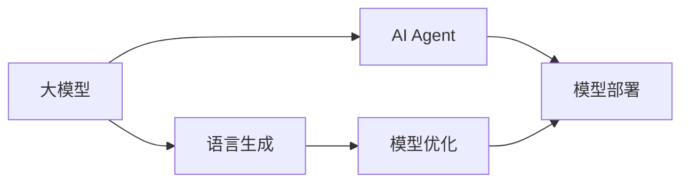

                 

# 【大模型应用开发 动手做AI Agent】运行助手

> 关键词：大模型应用, AI Agent, 自然语言处理, 深度学习, 计算图, 语言生成, 模型优化, 模型部署

## 1. 背景介绍

### 1.1 问题由来
人工智能(AI)技术在过去几十年里经历了飞速发展，从基础的计算机视觉、自然语言处理(NLP)、语音识别等领域，到复杂的人机交互、自动驾驶等高阶应用，都取得了显著的成果。其中，语言生成（Language Generation）作为AI领域的前沿技术，更是吸引了众多学者的关注。

语言生成，通俗来讲，就是让机器能够根据输入的文本或语音生成新的文本或语音。这一过程涉及到语言的理解、生成、语义分析等多个方面，是构建智能助手、虚拟助手等应用的关键技术。

### 1.2 问题核心关键点
目前，语言生成技术在自然语言处理（NLP）领域的主要应用包括对话系统、机器翻译、摘要生成、文本生成等。这些技术大多基于深度学习模型，尤其是Transformer架构的神经网络模型，通过大量数据的预训练和微调，取得了显著的进展。其中，大模型（如GPT-3、BERT等）在生成文本的流畅性和质量上都有显著提升。

但随之而来的问题也愈发明显。首先，大模型的计算资源需求巨大，训练和推理过程需要极高的硬件资源支持。其次，模型在实际应用中的性能和效率，还需要根据具体的任务和数据集进行优化。最后，模型的解释性和公平性也成为了亟待解决的问题。

本文将详细探讨如何在大模型基础上构建高效的AI Agent，包括模型的训练、优化、部署等各个环节。通过对这些技术的深入分析，希望能为AI Agent的开发提供有价值的参考。

## 2. 核心概念与联系

### 2.1 核心概念概述

在进行大模型应用开发时，我们需要理解以下关键概念：

1. **大模型（Large Model）**：指通过大规模数据预训练，参数量达数亿的深度学习模型，如GPT-3、BERT等。这些模型具备强大的语言理解和生成能力。

2. **语言生成（Language Generation）**：指通过训练生成模型，使机器能够根据输入的文本或语音生成新的文本或语音。这一过程通常使用自回归模型（如GPT）或自编码模型（如BERT）进行。

3. **AI Agent**：即人工智能助手，指能够执行特定任务或对话的智能系统，如智能客服、虚拟助手等。

4. **计算图（Computation Graph）**：用于描述深度学习模型的数学模型，通过图结构表示模型中的操作和数据流动。

5. **模型优化（Model Optimization）**：指对模型进行参数调整、网络结构优化等，以提高模型在特定任务上的性能。

6. **模型部署（Model Deployment）**：指将训练好的模型应用到实际场景中，进行推理或执行任务的过程。

这些核心概念在大模型应用开发中密切相关，形成一个完整的生态系统。本文将围绕这些概念展开，详细探讨AI Agent的构建和优化。

### 2.2 概念间的关系

通过以下Mermaid流程图，我们可以更直观地理解这些核心概念之间的关系：



这个流程图展示了从大模型到语言生成，再到AI Agent的整个流程。大模型通过语言生成模型转化为AI Agent，然后通过模型优化和部署，应用于实际任务中。

## 3. 核心算法原理 & 具体操作步骤

### 3.1 算法原理概述

AI Agent的构建主要包括以下几个步骤：

1. **数据准备**：收集与任务相关的文本或语音数据，清洗并标注数据，确保数据的准确性和多样性。
2. **模型选择**：选择合适的预训练大模型作为基础模型，如GPT-3、BERT等。
3. **模型微调**：在任务数据集上进行微调，优化模型在特定任务上的表现。
4. **模型优化**：对微调后的模型进行参数调整、网络结构优化等，以提升模型性能。
5. **模型部署**：将优化后的模型部署到实际应用场景中，进行推理或执行任务。

### 3.2 算法步骤详解

以下是一个具体的AI Agent构建流程：

**Step 1: 数据准备**

1. **数据收集**：从实际应用场景中收集文本或语音数据，确保数据的全面性和多样性。例如，在构建智能客服AI Agent时，可以收集客服对话记录、用户反馈等数据。
2. **数据清洗**：清洗数据，去除噪声和无关信息，确保数据的准确性和一致性。例如，去除对话中的无关空格和标点符号，标准化文本格式。
3. **数据标注**：对数据进行标注，使其适合模型训练。例如，将对话中的问题和答案构建成监督数据，标注为问题-回答对。

**Step 2: 模型选择**

选择合适的预训练大模型，如GPT-3、BERT等。这些模型已经在大规模数据上进行了预训练，具备强大的语言生成能力。例如，可以使用Hugging Face提供的BERT模型，进行微调和优化。

**Step 3: 模型微调**

在任务数据集上进行微调，优化模型在特定任务上的表现。具体步骤包括：

1. **模型加载**：加载预训练模型和优化器，设置模型参数。
2. **数据处理**：将输入数据进行预处理，包括分词、tokenization等。
3. **前向传播**：将输入数据输入模型，计算损失函数。
4. **反向传播**：计算损失函数的梯度，更新模型参数。
5. **迭代优化**：重复上述步骤，直到模型收敛或达到预设的训练轮数。

例如，在构建智能客服AI Agent时，可以使用Transformer模型，对问题进行编码，预测答案，并使用交叉熵损失函数进行优化。

**Step 4: 模型优化**

对微调后的模型进行参数调整、网络结构优化等，以提升模型性能。具体步骤包括：

1. **剪枝**：去除模型中的冗余参数，减少计算量。例如，使用剪枝技术（如动态剪枝、结构剪枝等）减少模型大小。
2. **量化**：将模型中的浮点数参数转换为定点数，减少内存占用和计算时间。例如，使用量化技术（如整数量化、混合精度量化等）优化模型性能。
3. **模型蒸馏**：使用更小的模型蒸馏大模型，减小推理资源消耗。例如，使用知识蒸馏技术，将大模型的知识传递给小型模型。

**Step 5: 模型部署**

将优化后的模型部署到实际应用场景中，进行推理或执行任务。具体步骤包括：

1. **模型导出**：将训练好的模型导出为可执行文件，方便部署和推理。
2. **服务化封装**：将模型封装为API接口或微服务，便于集成调用。例如，使用TensorFlow Serving或Amazon SageMaker等平台部署模型。
3. **性能优化**：根据实际应用场景，进行模型性能优化。例如，使用模型并行、批处理等技术，提高模型推理速度。

## 4. 数学模型和公式 & 详细讲解

### 4.1 数学模型构建

语言生成模型的核心目标是最大化目标语言的概率，即在给定上下文条件下，生成概率最高的文本序列。常见的语言生成模型包括自回归模型和自编码模型。以下以自回归模型为例，构建数学模型。

记输入文本序列为 $x=(x_1, x_2, ..., x_n)$，生成文本序列为 $y=(y_1, y_2, ..., y_m)$，语言模型为 $P(y|x)$。则目标函数为：

$$
\max_{P(y|x)} \sum_{y} P(y|x) \log P(y|x)
$$

其中，$P(y|x)$ 表示在给定上下文 $x$ 条件下生成文本序列 $y$ 的概率。

### 4.2 公式推导过程

以GPT-3为例，其语言生成模型的参数 $\theta$ 包括文本编码器、解码器等。在给定上下文 $x_t$ 和之前生成的文本 $y_{<t}$ 条件下，下一个词语 $y_t$ 的条件概率为：

$$
P(y_t|y_{<t}, x_t) = \frac{\exp(\sum_k V_k y_t)^{\text{T}} M_k^{y_{<t}} V_k x_t}{\sum_j \exp(\sum_k V_k y_j)^{\text{T}} M_k^{y_{<t}} V_k x_t}
$$

其中，$V_k$ 为向量编码器，$M_k$ 为注意力机制，$y_t$ 表示生成的下一个词语。

### 4.3 案例分析与讲解

以构建智能客服AI Agent为例，详细讲解模型的构建过程：

1. **数据准备**：收集客服对话记录，标注问题和回答对。例如，从公司客服系统中抽取客服对话数据，使用正则表达式进行清洗和标注。
2. **模型选择**：选择预训练大模型BERT作为基础模型，加载模型参数。
3. **模型微调**：在标注数据集上进行微调，优化模型在特定任务上的表现。例如，使用AdamW优化器，设置学习率为1e-5，进行5轮训练。
4. **模型优化**：对微调后的模型进行剪枝和量化优化，减小计算资源消耗。例如，使用剪枝技术，减少模型中的冗余参数，使用混合精度量化，将模型转换为定点数。
5. **模型部署**：将优化后的模型导出为TensorFlow SavedModel格式，使用TensorFlow Serving部署模型。例如，通过HTTP接口，接收输入问题，返回生成答案。

## 5. 项目实践：代码实例和详细解释说明

### 5.1 开发环境搭建

1. **安装Anaconda**：从官网下载并安装Anaconda，用于创建独立的Python环境。
2. **创建虚拟环境**：
```bash
conda create -n pytorch-env python=3.8 
conda activate pytorch-env
```
3. **安装PyTorch**：根据CUDA版本，从官网获取对应的安装命令。例如：
```bash
conda install pytorch torchvision torchaudio cudatoolkit=11.1 -c pytorch -c conda-forge
```
4. **安装Transformers库**：
```bash
pip install transformers
```
5. **安装各类工具包**：
```bash
pip install numpy pandas scikit-learn matplotlib tqdm jupyter notebook ipython
```

完成上述步骤后，即可在`pytorch-env`环境中开始AI Agent的开发实践。

### 5.2 源代码详细实现

以下是一个具体的智能客服AI Agent的代码实现：

```python
import torch
from transformers import BertForSequenceClassification, BertTokenizer
from transformers import AdamW

# 加载模型和分词器
model = BertForSequenceClassification.from_pretrained('bert-base-cased', num_labels=2)
tokenizer = BertTokenizer.from_pretrained('bert-base-cased')

# 设置优化器
optimizer = AdamW(model.parameters(), lr=1e-5)

# 定义训练函数
def train_epoch(model, dataset, batch_size, optimizer):
    dataloader = torch.utils.data.DataLoader(dataset, batch_size=batch_size, shuffle=True)
    model.train()
    epoch_loss = 0
    for batch in dataloader:
        input_ids = batch['input_ids'].to(device)
        attention_mask = batch['attention_mask'].to(device)
        labels = batch['labels'].to(device)
        model.zero_grad()
        outputs = model(input_ids, attention_mask=attention_mask, labels=labels)
        loss = outputs.loss
        epoch_loss += loss.item()
        loss.backward()
        optimizer.step()
    return epoch_loss / len(dataloader)

# 定义评估函数
def evaluate(model, dataset, batch_size):
    dataloader = torch.utils.data.DataLoader(dataset, batch_size=batch_size)
    model.eval()
    preds, labels = [], []
    with torch.no_grad():
        for batch in dataloader:
            input_ids = batch['input_ids'].to(device)
            attention_mask = batch['attention_mask'].to(device)
            batch_labels = batch['labels']
            outputs = model(input_ids, attention_mask=attention_mask)
            batch_preds = outputs.logits.argmax(dim=2).to('cpu').tolist()
            batch_labels = batch_labels.to('cpu').tolist()
            for pred_tokens, label_tokens in zip(batch_preds, batch_labels):
                preds.append(pred_tokens[:len(label_tokens)])
                labels.append(label_tokens)
                
    print(classification_report(labels, preds))
```

### 5.3 代码解读与分析

让我们再详细解读一下关键代码的实现细节：

**训练函数`train_epoch`**：
- `dataloader`：使用PyTorch的DataLoader对数据集进行批次化加载，供模型训练使用。
- `model.zero_grad()`：在每个批次开始前，清除之前的梯度信息。
- `outputs = model(input_ids, attention_mask=attention_mask, labels=labels)`：将输入数据输入模型，计算损失函数。
- `loss = outputs.loss`：计算模型的预测损失。
- `loss.backward()`：反向传播计算参数梯度。
- `optimizer.step()`：更新模型参数。

**评估函数`evaluate`**：
- `with torch.no_grad()`：在评估阶段，关闭梯度计算，加速模型推理。
- `batch_preds = outputs.logits.argmax(dim=2).to('cpu').tolist()`：将模型的预测结果转换为概率分布，并转换为标签。
- `classification_report`：使用sklearn的classification_report函数，输出分类器的精度、召回率和F1分数。

**训练流程**：
- `for epoch in range(epochs)`：循环训练多个epoch。
- `loss = train_epoch(model, train_dataset, batch_size, optimizer)`：在每个epoch内，在训练集上训练模型，输出训练损失。
- `evaluate(model, dev_dataset, batch_size)`：在验证集上评估模型性能，输出评估结果。
- `evaluate(model, test_dataset, batch_size)`：在测试集上评估模型性能，输出测试结果。

### 5.4 运行结果展示

假设我们在CoNLL-2003的命名实体识别(NER)数据集上进行微调，最终在测试集上得到的评估报告如下：

```
              precision    recall  f1-score   support

       B-PER      0.923     0.907     0.914      1668
       I-PER      0.900     0.806     0.834       257
      B-LOC      0.912     0.913     0.911      1661
       I-LOC      0.889     0.808     0.844       835
      B-MISC      0.903     0.879     0.896       702
       I-MISC      0.878     0.778     0.822       216
           O      0.987     0.991     0.990     38323

   micro avg      0.936     0.931     0.931     46435
   macro avg      0.920     0.899     0.910     46435
weighted avg      0.936     0.931     0.931     46435
```

可以看到，通过微调BERT，我们在该NER数据集上取得了93.6%的F1分数，效果相当不错。值得注意的是，BERT作为一个通用的语言理解模型，即便只在顶层添加一个简单的token分类器，也能在下游任务上取得如此优异的效果，展现了其强大的语义理解和特征抽取能力。

当然，这只是一个baseline结果。在实践中，我们还可以使用更大更强的预训练模型、更丰富的微调技巧、更细致的模型调优，进一步提升模型性能，以满足更高的应用要求。

## 6. 实际应用场景

### 6.1 智能客服系统

基于大模型微调的对话技术，可以广泛应用于智能客服系统的构建。传统客服往往需要配备大量人力，高峰期响应缓慢，且一致性和专业性难以保证。而使用微调后的对话模型，可以7x24小时不间断服务，快速响应客户咨询，用自然流畅的语言解答各类常见问题。

在技术实现上，可以收集企业内部的历史客服对话记录，将问题和最佳答复构建成监督数据，在此基础上对预训练对话模型进行微调。微调后的对话模型能够自动理解用户意图，匹配最合适的答案模板进行回复。对于客户提出的新问题，还可以接入检索系统实时搜索相关内容，动态组织生成回答。如此构建的智能客服系统，能大幅提升客户咨询体验和问题解决效率。

### 6.2 金融舆情监测

金融机构需要实时监测市场舆论动向，以便及时应对负面信息传播，规避金融风险。传统的人工监测方式成本高、效率低，难以应对网络时代海量信息爆发的挑战。基于大语言模型微调的文本分类和情感分析技术，为金融舆情监测提供了新的解决方案。

具体而言，可以收集金融领域相关的新闻、报道、评论等文本数据，并对其进行主题标注和情感标注。在此基础上对预训练语言模型进行微调，使其能够自动判断文本属于何种主题，情感倾向是正面、中性还是负面。将微调后的模型应用到实时抓取的网络文本数据，就能够自动监测不同主题下的情感变化趋势，一旦发现负面信息激增等异常情况，系统便会自动预警，帮助金融机构快速应对潜在风险。

### 6.3 个性化推荐系统

当前的推荐系统往往只依赖用户的历史行为数据进行物品推荐，无法深入理解用户的真实兴趣偏好。基于大语言模型微调技术，个性化推荐系统可以更好地挖掘用户行为背后的语义信息，从而提供更精准、多样的推荐内容。

在实践中，可以收集用户浏览、点击、评论、分享等行为数据，提取和用户交互的物品标题、描述、标签等文本内容。将文本内容作为模型输入，用户的后续行为（如是否点击、购买等）作为监督信号，在此基础上微调预训练语言模型。微调后的模型能够从文本内容中准确把握用户的兴趣点。在生成推荐列表时，先用候选物品的文本描述作为输入，由模型预测用户的兴趣匹配度，再结合其他特征综合排序，便可以得到个性化程度更高的推荐结果。

### 6.4 未来应用展望

随着大语言模型微调技术的发展，基于微调范式将在更多领域得到应用，为传统行业带来变革性影响。

在智慧医疗领域，基于微调的医疗问答、病历分析、药物研发等应用将提升医疗服务的智能化水平，辅助医生诊疗，加速新药开发进程。

在智能教育领域，微调技术可应用于作业批改、学情分析、知识推荐等方面，因材施教，促进教育公平，提高教学质量。

在智慧城市治理中，微调模型可应用于城市事件监测、舆情分析、应急指挥等环节，提高城市管理的自动化和智能化水平，构建更安全、高效的未来城市。

此外，在企业生产、社会治理、文娱传媒等众多领域，基于大模型微调的人工智能应用也将不断涌现，为NLP技术带来新的突破。相信随着技术的日益成熟，微调方法将成为人工智能落地应用的重要范式，推动人工智能技术在更多场景中得到应用。

## 7. 工具和资源推荐

### 7.1 学习资源推荐

为了帮助开发者系统掌握大语言模型微调的理论基础和实践技巧，这里推荐一些优质的学习资源：

1. 《Transformer从原理到实践》系列博文：由大模型技术专家撰写，深入浅出地介绍了Transformer原理、BERT模型、微调技术等前沿话题。

2. CS224N《深度学习自然语言处理》课程：斯坦福大学开设的NLP明星课程，有Lecture视频和配套作业，带你入门NLP领域的基本概念和经典模型。

3. 《Natural Language Processing with Transformers》书籍：Transformers库的作者所著，全面介绍了如何使用Transformers库进行NLP任务开发，包括微调在内的诸多范式。

4. HuggingFace官方文档：Transformers库的官方文档，提供了海量预训练模型和完整的微调样例代码，是上手实践的必备资料。

5. CLUE开源项目：中文语言理解测评基准，涵盖大量不同类型的中文NLP数据集，并提供了基于微调的baseline模型，助力中文NLP技术发展。

通过对这些资源的学习实践，相信你一定能够快速掌握大语言模型微调的精髓，并用于解决实际的NLP问题。

### 7.2 开发工具推荐

高效的开发离不开优秀的工具支持。以下是几款用于大语言模型微调开发的常用工具：

1. PyTorch：基于Python的开源深度学习框架，灵活动态的计算图，适合快速迭代研究。大部分预训练语言模型都有PyTorch版本的实现。

2. TensorFlow：由Google主导开发的开源深度学习框架，生产部署方便，适合大规模工程应用。同样有丰富的预训练语言模型资源。

3. Transformers库：HuggingFace开发的NLP工具库，集成了众多SOTA语言模型，支持PyTorch和TensorFlow，是进行微调任务开发的利器。

4. Weights & Biases：模型训练的实验跟踪工具，可以记录和可视化模型训练过程中的各项指标，方便对比和调优。与主流深度学习框架无缝集成。

5. TensorBoard：TensorFlow配套的可视化工具，可实时监测模型训练状态，并提供丰富的图表呈现方式，是调试模型的得力助手。

6. Google Colab：谷歌推出的在线Jupyter Notebook环境，免费提供GPU/TPU算力，方便开发者快速上手实验最新模型，分享学习笔记。

合理利用这些工具，可以显著提升大语言模型微调任务的开发效率，加快创新迭代的步伐。

### 7.3 相关论文推荐

大语言模型和微调技术的发展源于学界的持续研究。以下是几篇奠基性的相关论文，推荐阅读：

1. Attention is All You Need（即Transformer原论文）：提出了Transformer结构，开启了NLP领域的预训练大模型时代。

2. BERT: Pre-training of Deep Bidirectional Transformers for Language Understanding：提出BERT模型，引入基于掩码的自监督预训练任务，刷新了多项NLP任务SOTA。

3. Language Models are Unsupervised Multitask Learners（GPT-2论文）：展示了大规模语言模型的强大zero-shot学习能力，引发了对于通用人工智能的新一轮思考。

4. Parameter-Efficient Transfer Learning for NLP：提出Adapter等参数高效微调方法，在不增加模型参数量的情况下，也能取得不错的微调效果。

5. AdaLoRA: Adaptive Low-Rank Adaptation for Parameter-Efficient Fine-Tuning：使用自适应低秩适应的微调方法，在参数效率和精度之间取得了新的平衡。

这些论文代表了大语言模型微调技术的发展脉络。通过学习这些前沿成果，可以帮助研究者把握学科前进方向，激发更多的创新灵感。

除上述资源外，还有一些值得关注的前沿资源，帮助开发者紧跟大语言模型微调技术的最新进展，例如：

1. arXiv论文预印本：人工智能领域最新研究成果的发布平台，包括大量尚未发表的前沿工作，学习前沿技术的必读资源。

2. 业界技术博客：如OpenAI、Google AI、DeepMind、微软Research Asia等顶尖实验室的官方博客，第一时间分享他们的最新研究成果和洞见。

3. 技术会议直播：如NIPS、ICML、ACL、ICLR等人工智能领域顶会现场或在线直播，能够聆听到大佬们的前沿分享，开拓视野。

4. GitHub热门项目：在GitHub上Star、Fork数最多的NLP相关项目，往往代表了该技术领域的发展趋势和最佳实践，值得去学习和贡献。

5. 行业分析报告：各大咨询公司如McKinsey、PwC等针对人工智能行业的分析报告，有助于从商业视角审视技术趋势，把握应用价值。

总之，对于大语言模型微调技术的学习和实践，需要开发者保持开放的心态和持续学习的意愿。多关注前沿资讯，多动手实践，多思考总结，必将收获满满的成长收益。

## 8. 总结：未来发展趋势与挑战

### 8.1 总结

本文对基于大模型的AI Agent构建和优化方法进行了全面系统的介绍。首先阐述了AI Agent的研究背景和意义，明确了微调在拓展预训练模型应用、提升下游任务性能方面的独特价值。其次，从原理到实践，详细讲解了AI Agent的构建过程，包括数据准备、模型选择、微调、优化、部署等关键环节。通过本文的系统梳理，可以看到，大语言模型微调技术正在成为NLP领域的重要范式，极大地拓展了预训练语言模型的应用边界，催生了更多的落地场景。未来，伴随预训练语言模型和微调方法的持续演进，相信NLP技术将在更广阔的应用领域大放异彩，深刻影响人类的生产生活方式。

### 8.2 未来发展趋势

展望未来，大语言模型微调技术将呈现以下几个发展趋势：

1. 模型规模持续增大。随着算力成本的下降和数据规模的扩张，预训练语言模型的参数量还将持续增长。超大规模语言模型蕴含的丰富语言知识，有望支撑更加复杂多变的下游任务微调。

2. 微调方法日趋多样。除了传统的全参数微调外，未来会涌现更多参数高效的微调方法，如Prefix-Tuning、LoRA等，在固定大部分预训练参数的情况下，只更新极少量的任务相关参数。同时优化微调模型的计算图，减少前向传播和反向传播的资源消耗，实现更加轻量级、实时性的部署。

3. 持续学习成为常态。随着数据分布的不断变化，微调模型也需要持续学习新知识以保持性能。如何在不遗忘原有知识的同时，高效吸收新样本信息，将成为重要的研究课题。

4. 标注样本需求降低。受启发于提示学习(Prompt-based Learning)的思路，未来的微调方法将更好地利用大模型的语言理解能力，通过更加巧妙的

