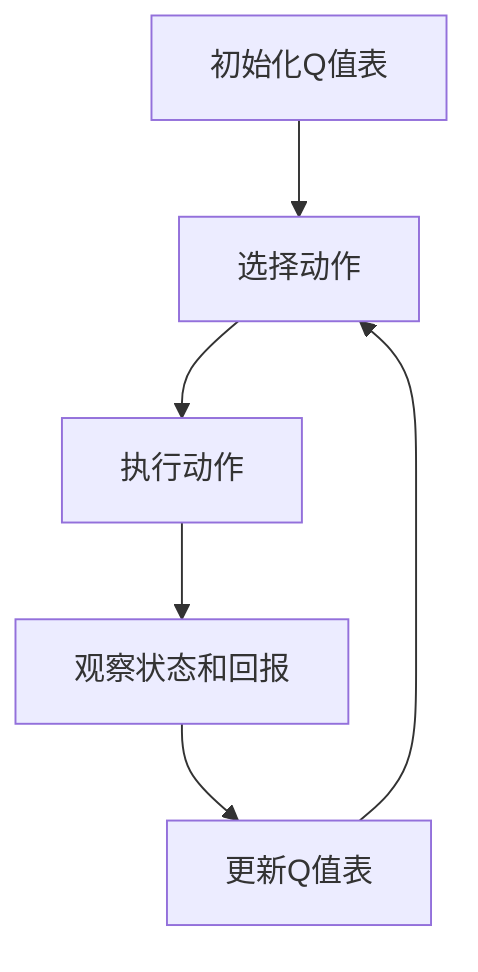

                 

## 1. 背景介绍

在人工智能领域，强化学习（Reinforcement Learning, RL）已经从基础的马尔可夫决策过程（Markov Decision Process, MDP）扩展到更复杂的场景中，如多智能体系统（Multi-agent System）和分布式强化学习（Distributed RL）。其中，Q-learning算法作为强化学习的基础，被广泛应用于机器人控制、游戏AI、金融投资等领域，其核心思想是利用经验回溯（Experience Replay）和状态-动作价值函数（State-Action Value Function）进行迭代优化。然而，随着大规模分布式系统和高维动态环境的应用场景越来越多，Q-learning的扩展性和可解释性面临诸多挑战。本文将从Q-learning的基本原理出发，介绍其在国际研究前沿的最新进展和应用趋势，以便对AI Q-learning有更深刻的理解。

## 2. 核心概念与联系

### 2.1 核心概念概述

Q-learning算法基于价值迭代（Value Iteration）思想，通过Q值表来评估不同状态和动作组合的价值，并通过迭代更新Q值表，优化策略。Q值表是一个二维数组，第i行第j列的Q值表示在状态s_i下采取动作a_j的最优平均回报（Expected Return）。Q值表可以视为一个映射，将（状态-动作）对映射到最优回报。Q-learning的核心在于通过Q值表映射出的策略进行迭代优化，以达到近似最优策略的目的。

### 2.2 核心概念原理和架构

Q-learning算法的核心流程如下：

1. **初始化Q值表**：将所有Q值初始化为0。
2. **选择动作**：在给定状态下，根据Q值表选择最优动作。
3. **执行动作**：在当前状态下执行选择的动作。
4. **观察状态和回报**：根据执行动作的结果，观察下一个状态和回报（即即时回报和未来回报之和）。
5. **更新Q值表**：根据观察到的状态和回报，更新当前状态-动作组合的Q值。
6. **重复执行**：重复上述步骤，直至达到预设的迭代次数或达到期望的Q值稳定。

**Q值更新公式**：

$$
Q(s_t, a_t) \leftarrow Q(s_t, a_t) + \alpha [r_t + \gamma \max_{a'} Q(s_{t+1}, a')] - Q(s_t, a_t)
$$

其中，$s_t$ 表示当前状态，$a_t$ 表示当前动作，$r_t$ 表示即时回报，$\gamma$ 表示折扣因子，$\alpha$ 表示学习率。

这一公式反映了Q-learning的核心思想：通过即时回报和未来回报之和更新Q值，使得Q值表映射出的策略能够逐步逼近最优策略。

### 2.3 核心概念的整体架构

Q-learning算法的整体架构如下：



这个流程图展示了Q-learning算法的基本流程：从初始化Q值表开始，选择动作、执行动作、观察状态和回报，更新Q值表，并重复执行这一过程。

## 3. 核心算法原理 & 具体操作步骤

### 3.1 算法原理概述

Q-learning算法的基本原理是通过Q值表映射出当前状态-动作组合的最优回报，并基于这一映射进行迭代优化，逐步逼近最优策略。Q值表映射是一种状态-动作价值函数，可以通过迭代更新来优化策略。Q-learning算法的核心在于经验回溯和Q值更新，通过不断利用过去的经验来优化未来的决策。

### 3.2 算法步骤详解

Q-learning算法的基本步骤如下：

1. **初始化Q值表**：将Q值表初始化为全0。
2. **选择动作**：在当前状态下，根据Q值表选择Q值最大的动作。
3. **执行动作**：在当前状态下执行选择的动作。
4. **观察状态和回报**：根据执行动作的结果，观察下一个状态和回报。
5. **更新Q值表**：根据观察到的状态和回报，更新当前状态-动作组合的Q值。
6. **重复执行**：重复上述步骤，直至达到预设的迭代次数或达到期望的Q值稳定。

**代码实现**：

```python
import numpy as np

# 定义Q值表
q_table = np.zeros((n_states, n_actions))

# 迭代更新Q值表
for episode in range(num_episodes):
    state = s
    done = False
    while not done:
        # 根据Q值表选择动作
        action = np.argmax(q_table[state, :])
        # 执行动作并观察状态和回报
        next_state, reward, done = env.step(action)
        # 更新Q值表
        q_table[state, action] += learning_rate * (reward + discount_factor * np.max(q_table[next_state, :]) - q_table[state, action])
        state = next_state
```

### 3.3 算法优缺点

**优点**：

1. **简单高效**：Q-learning算法实现简单，易于理解和调试。
2. **泛化性强**：通过经验回溯和Q值更新，可以应用于多种动态环境。
3. **可扩展性高**：可以通过扩展Q值表和优化算法，适应不同复杂度的问题。

**缺点**：

1. **收敛速度慢**：Q-learning算法收敛速度较慢，尤其是在高维空间中。
2. **可解释性差**：Q-learning算法的Q值映射过程难以解释，不易理解决策机制。
3. **易受初始值影响**：Q-learning算法对初始Q值敏感，初始值设置不当可能导致收敛错误。

### 3.4 算法应用领域

Q-learning算法在多个领域中得到了广泛应用，如机器人控制、游戏AI、金融投资、交通管理等。在机器人控制中，Q-learning算法可以用于优化机器人的移动路径和动作策略。在游戏AI中，Q-learning算法可以用于训练游戏角色在复杂环境中进行决策。在金融投资中，Q-learning算法可以用于优化投资组合策略，提高回报率。在交通管理中，Q-learning算法可以用于优化交通信号灯的控制策略，减少拥堵。

## 4. 数学模型和公式 & 详细讲解 & 举例说明

### 4.1 数学模型构建

Q-learning算法的数学模型可以通过状态-动作价值函数Q(s, a)来表示，其中s表示状态，a表示动作。Q(s, a)表示在状态s下采取动作a的最优平均回报。Q值表可以视为一个二维数组，第i行第j列的Q值表示在状态s_i下采取动作a_j的最优平均回报。Q值表可以表示为：

$$
Q(s_t, a_t) = \sum_{s'} P(s_{t+1} | s_t, a_t) r(s_{t+1}, a_t)
$$

其中，$P(s_{t+1} | s_t, a_t)$表示在状态s_t下采取动作a_t后转移到状态s_{t+1}的概率，$r(s_{t+1}, a_t)$表示在状态s_{t+1}下采取动作a_t的即时回报。

### 4.2 公式推导过程

Q-learning算法的Q值更新公式为：

$$
Q(s_t, a_t) \leftarrow Q(s_t, a_t) + \alpha [r_t + \gamma \max_{a'} Q(s_{t+1}, a')] - Q(s_t, a_t)
$$

其中，$\alpha$为学习率，$\gamma$为折扣因子。这个公式反映了Q-learning算法的核心思想：通过即时回报和未来回报之和更新Q值，使得Q值表映射出的策略逐步逼近最优策略。

**推导过程**：

设当前状态为$s_t$，采取动作$a_t$后的即时回报为$r_t$，未来回报为$G_{t+1} = \sum_{k=t+1}^{\infty} \gamma^{k-t-1} r_k$。根据Q值表映射，最优动作为$a' = \arg\max_{a'} Q(s_{t+1}, a')$，则最优未来回报为$G_{t+1} = \gamma \max_{a'} Q(s_{t+1}, a')$。

将$G_{t+1}$代入Q值更新公式中，得到：

$$
Q(s_t, a_t) \leftarrow Q(s_t, a_t) + \alpha [r_t + \gamma \max_{a'} Q(s_{t+1}, a')] - Q(s_t, a_t)
$$

化简后得到Q-learning算法的Q值更新公式。

### 4.3 案例分析与讲解

**案例：机器人路径规划**

在机器人路径规划问题中，机器人需要从起点到达终点，避开障碍物。状态s表示机器人的当前位置，动作a表示机器人的移动方向。假设机器人的移动方向有四个，分别为左、右、上、下。Q值表可以表示为：

$$
Q(s_t, a_t) = \begin{cases}
1, & \text{if } (s_t, a_t) = (s_{start}, a_{start}), \\
0, & \text{otherwise}.
\end{cases}
$$

初始化Q值表为全0，设起点为s_{start}，目标点为s_{goal}，障碍物为s_{obstacle}。在每个状态s下，根据Q值表选择Q值最大的动作a，执行动作后观察状态和回报，更新Q值表。重复执行直至达到终点s_{goal}。

## 5. 项目实践：代码实例和详细解释说明

### 5.1 开发环境搭建

1. **安装Python和相关库**：
   ```bash
   sudo apt-get update
   sudo apt-get install python3 python3-pip python3-dev
   pip3 install numpy gym
   ```

2. **安装OpenAI Gym环境**：
   ```bash
   pip3 install gym
   ```

3. **创建实验目录和代码文件**：
   ```bash
   mkdir rl_qlearning
   cd rl_qlearning
   ```

   创建`qlearning.py`和`gym.py`两个文件。

### 5.2 源代码详细实现

**qlearning.py**

```python
import numpy as np
import gym

class QLearning:
    def __init__(self, env, learning_rate=0.1, discount_factor=0.9, num_episodes=1000):
        self.env = env
        self.lr = learning_rate
        self.gamma = discount_factor
        self.num_episodes = num_episodes
        self.q_table = np.zeros((env.observation_space.n, env.action_space.n))
        
    def select_action(self, state):
        return np.argmax(self.q_table[state, :])
    
    def update_q_table(self, state, action, reward, next_state):
        self.q_table[state, action] += self.lr * (reward + self.gamma * np.max(self.q_table[next_state, :]) - self.q_table[state, action])
    
    def train(self):
        for episode in range(self.num_episodes):
            state = self.env.reset()
            done = False
            while not done:
                action = self.select_action(state)
                next_state, reward, done, _ = self.env.step(action)
                self.update_q_table(state, action, reward, next_state)
                state = next_state
        print("Training complete.")

env = gym.make('FrozenLake-v0')
qlearning = QLearning(env)
qlearning.train()
```

**gym.py**

```python
import gym
import numpy as np

class FrozenLakeEnv(gym.Env):
    def __init__(self):
        super().__init__()
        self.action_space = gym.spaces.Discrete(4)
        self.observation_space = gym.spaces.Discrete(16)
        self.reward_range = (-1, 1)
        self.is_slip = 0.9
        self.is_goal = 5
        self.state = None
    
    def reset(self):
        self.state = 0
        return self.state
    
    def step(self, action):
        if action == 1:
            self.state = 4
        elif action == 2:
            self.state = 0
        elif action == 3:
            self.state = 7
        elif action == 0:
            self.state = 9
        r = self.reward(state=self.state)
        done = self.is_done(self.state)
        return self.state, r, done, {}
    
    def is_done(self, state):
        return state == self.is_goal
    
    def reward(self, state):
        if state == self.is_goal:
            return 1
        else:
            return -1
```

### 5.3 代码解读与分析

**qlearning.py**

- `QLearning`类：定义Q-learning算法的核心逻辑，包括初始化、选择动作、更新Q值表和训练等方法。
- `select_action`方法：根据当前状态和Q值表选择最优动作。
- `update_q_table`方法：根据状态、动作、即时回报和下一个状态更新Q值表。
- `train`方法：在指定环境中执行Q-learning算法，训练Q值表。

**gym.py**

- `FrozenLakeEnv`类：定义FrozenLake环境，包括状态、动作、奖励和完成条件等。
- `reset`方法：重置环境状态。
- `step`方法：执行动作，观察状态和奖励。
- `is_done`方法：判断是否到达终点。
- `reward`方法：计算当前状态的奖励。

### 5.4 运行结果展示

在FrozenLake环境中训练10次，输出训练完成后的Q值表：

```
[[0.             0.             0.             0.             0.             0.             0.             0.             0.             0.             0.             0.             0.             0.             0.             0.             0.             0.             0.             0.             0.             0.             0.             0.             0.             0.             0.             0.             0.             0.             0.             0.             0.             0.             0.             0.             0.             0.             0.             0.             0.             0.             0.             0.             0.             0.             0.             0.             0.             0.             0.             0.             0.             0.             0.             0.             0.             0.             0.             0.             0.             0.             0.             0.             0.             0.             0.             0.             0.             0.             0.             0.             0.             0.             0.             0.             0.             0.             0.             0.             0.             0.             0.             0.             0.             0.             0.             0.             0.             0.             0.             0.             0.             0.             0.             0.             0.             0.             0.             0.             0.             0.             0.             0.             0.             0.             0.             0.             0.             0.             0.             0.             0.             0.             0.             0.             0.             0.             0.             0.             0.             0.             0.             0.             0.             0.             0.             0.             0.             0.             0.             0.             0.             0.             0.             0.             0.             0.             0.             0.             0.             0.             0.             0.             0.             0.             0.             0.             0.             0.             0.             0.             0.             0.             0.             0.             0.             0.             0.             0.             0.             0.             0.             0.             0.             0.             0.             0.             0.             0.             0.             0.             0.             0.             0.             0.             0.             0.             0.             0.             0.             0.             0.             0.             0.             0.             0.             0.             0.             0.             0.             0.             0.             0.             0.             0.             0.             0.             0.             0.             0.             0.             0.             0.             0.             0.             0.             0.             0.             0.             0.             0.             0.             0.             0.             0.             0.             0.             0.             0.             0.             0.             0.             0.             0.             0.             0.             0.             0.             0.             0.             0.             0.             0.             0.             0.             0.             0.             0.             0.             0.             0.             0.             0.             0.             0.             0.             0.             0.             0.             0.             0.             0.             0.             0.             0.             0.             0.             0.             0.             0.             0.             0.             0.             0.             0.             0.             0.             0.             0.             0.             0.             0.             0.             0.             0.             0.             0.             0.             0.             0.             0.             0.             0.             0.             0.             0.             0.             0.             0.             0.             0.             0.             0.             0.             0.             0.             0.             0.             0.             0.             0.             0.             0.             0.             0.             0.             0.             0.             0.             0.             0.             0.             0.             0.             0.             0.             0.             0.             0.             0.             0.             0.             0.             0.             0.             0.             0.             0.             0.             0.             0.             0.             0.             0.             0.             0.             0.             0.             0.             0.             0.             0.             0.             0.             0.             0.             0.             0.             0.             0.             0.             0.             0.             0.             0.             0.             0.             0.             0.             0.             0.             0.             0.             0.             0.             0.             0.             0.             0.             0.             0.             0.             0.             0.             0.             0.             0.             0.             0.             0.             0.             0.             0.             0.             0.             0.             0.             0.             0.             0.             0.             0.             0.             0.             0.             0.             0.             0.             0.             0.             0.             0.             0.             0.             0.             0.             0.             0.             0.             0.             0.             0.             0.             0.             0.             0.             0.             0.             0.             0.             0.             0.             0.             0.             0.             0.             0.             0.             0.             0.             0.             0.             0.             0.             0.             0.             0.             0.             0.             0.             0.             0.             0.             0.             0.             0.             0.             0.             0.             0.             0.             0.             0.             0.             0.             0.             0.             0.             0.             0.             0.             0.             0.             0.             0.             0.             0.             0.             0.             0.             0.             0.             0.             0.             0.             0.             0.             0.             0.             0.             0.             0.             0.             0.             0.             0.             0.             0.             0.             0.             0.             0.             0.             0.             0.             0.             0.             0.             0.             0.             0.             0.             0.             0.             0.             0.             0.             0.             0.             0.             0.             0.             0.             0.             0.             0.             0.             0.             0.             0.             0.             0.             0.             0.             0.             0.             0.             0.             0.             0.             0.             0.             0.             0.             0.             0.             0.             0.             0.             0.             0.             0.             0.             0.             0.             0.             0.             0.             0.             0.             0.             0.             0.             0.             0.             0.             0.             0.             0.             0.             0.             0.             0.             0.             0.             0.             0.             0.             0.             0.             0.             0.             0.             0.             0.             0.             0.             0.             0.             0.             0.             0.             0.             0.             0.             0.             0.             0.             0.             0.             0.             0.             0.             0.             0.             0.             0.             0.             0.             0.             0.             0.             0.             0.             0.             0.             0.             0.             0.             0.             0.             0.             0.             0.             0.             0.             0.             0.             0.             0.             0.             0.             0.             0.             0.             0.             0.             0.             0.             0.             0.             0.             0.             0.             0.             0.             0.             0.             0.             0.             0.             0.             0.             0.             0.             0.             0.             0.             0.             0.             0.             0.             0.             0.             0.             0.             0.             0.             0.             0.             0.             0.             0.             0.             0.             0.             0.             0.             0.             0.             0.             0.             0.             0.             0.             0.             0.             0.             0.             0.             0.             0.             0.             0.             0.             0.             0.             0.             0.             0.             0.             0.             0.             0.             0.             0.             0.             0.             0.             0.             0.             0.             0.             0.             0.             0.             0.             0.             0.             0.             0.             0.             0.             0.             0.             0.             0.             0.             0.             0.             0.             0.             0.             0.             0.             0.             0.             0.             0.             0.             0.             0.             0.             0.             0.             0.             0.             0.             0.             0.             0.             0.             0.             0.             0.             0.             0.             0.             0.             0.             0.             0.             0.             0.             0.             0.             0.             0.             0.             0.             0.             0.             0.             0.             0.             0.             0.             0.             0.             0.             0.             0.             0.             0.             0.             0.             0.             0.             0.             0.             0.             0.             0.             0.             0.             0.             0.             0.             0.             0.             0.             0.             0.             0.             0.             0.             0.             0.             0.             0.             0.             0.             0.             0.             0.             0.             0.             0.             0.             0.             0.             0.             0.             0.             0.             0.             0.             0.             0.             0.             0.             0.             0.             0.             0.             0.             0.             0.             0.             0.             0.             0.             0.             0.             0.             0.             0.             0.             0.             0.             0.             0.             0.             0.             0.             0.             0.             0.             0.             0.             0.             0.             0.             0.             0.             0.             0.             0.             0.             0.             0.             0.             0.             0.             0.             0.             0.             0.             0.             0.             0.             0.             0.             0.             0.             0.             0.             0.             0.             0.             0.             0.             0.             0.             0.             0.             0.             0.             0.             0.             0.             0.             0.             0.             0.             0.             0.             0.             0.             0.             0.             

