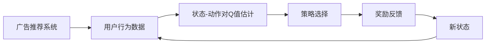
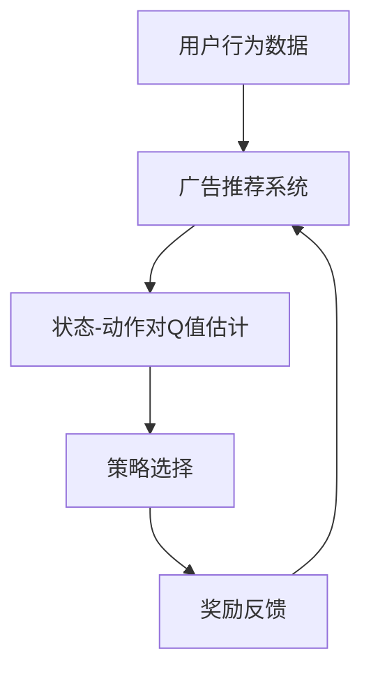

                 

# 一切皆是映射：AI Q-learning在广告推荐中的实践

## 1. 背景介绍

### 1.1 问题由来
广告推荐系统是互联网公司的核心竞争力之一，它通过智能地展示个性化广告，最大化广告主的投资回报率（ROI）。随着用户行为的日益复杂化和个性化，传统的广告推荐系统逐渐面临挑战，需要新的技术来提升推荐效果和用户体验。

### 1.2 问题核心关键点
Q-learning作为强化学习的一种经典算法，已被广泛应用于各种推荐系统中，旨在通过奖励信号的反馈机制，训练出能够最大化长期回报的广告推荐模型。其核心在于将广告推荐过程建模为智能体（广告推荐系统）与环境（用户行为）之间的交互，通过不断调整策略，优化广告展示效果。

### 1.3 问题研究意义
在广告推荐系统中引入AI Q-learning，可以显著提升广告展示的精准性和个性化水平，同时优化广告主的预算分配，提升整体广告效果。该方法能够灵活适应用户行为变化，及时调整推荐策略，适应不同的广告场景和需求。

## 2. 核心概念与联系

### 2.1 核心概念概述

- **强化学习**：一种学习范式，智能体通过与环境交互，利用反馈信号（奖励或惩罚）学习最优策略，以最大化长期回报。
- **Q-learning**：一种基于价值估计的强化学习算法，通过估算状态-动作对Q值，选择具有最高Q值的动作，以最大化累积奖励。
- **广告推荐系统**：利用用户行为数据，智能地为用户推荐个性化广告的系统。通过优化广告展示策略，提升广告效果和用户体验。
- **策略更新**：在Q-learning中，策略更新基于Q值估计，通过贪心选择最佳动作（即Q值最大的动作）进行策略更新。

### 2.2 概念间的关系

Q-learning在广告推荐中的应用，可以通过以下Mermaid流程图来展示：



这个流程图展示了大语言模型微调过程中各个核心概念的关系：

1. 广告推荐系统接收用户行为数据。
2. 根据用户行为数据估计状态-动作对的Q值。
3. 通过Q值选择最优动作（即推荐广告）。
4. 接收广告点击等奖励信号，更新Q值。
5. 根据新的状态重新评估Q值，回到步骤2。

### 2.3 核心概念的整体架构

最终，我们用一个综合的流程图来展示大语言模型微调过程中各个核心概念的整体架构：



这个综合流程图展示了广告推荐系统、用户行为数据、状态-动作对Q值估计、策略选择和奖励反馈之间的整体架构。通过这一架构，我们可以更清晰地理解广告推荐系统中Q-learning算法的作用和流程。

## 3. 核心算法原理 & 具体操作步骤
### 3.1 算法原理概述

在广告推荐系统中，Q-learning通过模拟广告展示的奖励信号，优化广告推荐的策略。其核心思想是：将广告推荐视为一个多臂老虎机问题，广告主每次选择展示一个广告，获得用户点击等反馈信号，通过Q值更新调整策略，使得广告展示的效果最大化。

### 3.2 算法步骤详解

Q-learning在广告推荐中的具体步骤包括：

1. **状态初始化**：定义广告展示的状态，如用户浏览网页的上下文、历史行为等。
2. **动作选择**：从广告库中选择一个广告进行展示，作为动作。
3. **奖励反馈**：根据用户行为（如点击、停留时间等）给出奖励或惩罚。
4. **Q值更新**：根据奖励反馈和动作-状态对的Q值估计，更新Q值。
5. **策略更新**：选择Q值最大的动作进行广告展示。
6. **重复执行**：循环执行步骤2-5，直到满足预设的迭代次数或收敛条件。

### 3.3 算法优缺点

Q-learning在广告推荐中的优点包括：

- **动态适应**：能够根据用户行为的变化动态调整广告展示策略。
- **可解释性强**：每次决策都可以通过Q值解释其背后的理由。
- **易于扩展**：可以轻松扩展到不同的广告场景和需求，适应多样化的广告推荐需求。

缺点包括：

- **收敛速度慢**：在状态空间大、动作空间多时，Q值估计的收敛速度较慢。
- **策略选择贪心**：Q-learning的策略更新基于贪心选择，可能导致局部最优解。
- **需要大量数据**：需要足够的历史数据和奖励反馈来训练出有效的Q值，对数据质量要求高。

### 3.4 算法应用领域

Q-learning在广告推荐中的主要应用领域包括：

- **个性化广告推荐**：根据用户行为数据，推荐用户感兴趣的个性化广告。
- **广告效果优化**：通过调整广告展示策略，最大化广告主的投资回报率。
- **实时竞价广告**：动态调整广告竞价策略，优化广告投放效果。
- **广告位优化**：根据用户行为数据，优化不同广告位的展示效果。

## 4. 数学模型和公式 & 详细讲解
### 4.1 数学模型构建

Q-learning在广告推荐中的应用，可以通过以下数学模型进行建模：

- **状态**：用户浏览网页的上下文、历史行为等。
- **动作**：广告展示选择，即从广告库中选择一个广告进行展示。
- **奖励**：用户点击广告获得的奖励，如点击量、点击率等。
- **Q值**：状态-动作对的长期回报估计，表示在不同状态下选择某个动作的累积期望回报。

Q值可以通过以下公式进行更新：

$$
Q(s_t,a_t) \leftarrow Q(s_t,a_t) + \alpha[r_t + \gamma\max_{a'}Q(s_{t+1},a') - Q(s_t,a_t)]
$$

其中：
- $s_t$ 表示当前状态，$a_t$ 表示当前动作，$r_t$ 表示当前奖励，$\gamma$ 表示折扣因子，$\alpha$ 表示学习率。

### 4.2 公式推导过程

Q-learning的公式推导过程主要基于贝尔曼方程和状态-动作对价值估计。贝尔曼方程描述了状态-动作对价值的最优性条件，即在当前状态下，选择最优动作所能获得的期望回报等于当前状态的价值加上期望的下一步回报。因此，Q值可以表示为：

$$
Q(s_t,a_t) = r_t + \gamma \max_{a'} Q(s_{t+1},a')
$$

对于每个状态-动作对，Q-learning通过以下公式更新Q值：

$$
Q(s_t,a_t) \leftarrow Q(s_t,a_t) + \alpha[r_t + \gamma\max_{a'}Q(s_{t+1},a') - Q(s_t,a_t)]
$$

其中，$\alpha$ 为学习率，$r_t$ 为当前奖励，$\gamma$ 为折扣因子，$\max_{a'}Q(s_{t+1},a')$ 表示在下一个状态下，选择最优动作所能获得的Q值。

### 4.3 案例分析与讲解

以广告展示为例，假设当前状态为用户浏览了一个电商网站，当前动作为展示一个推荐商品广告。如果用户点击了该商品广告，则获得奖励$r_t=1$，进入下一个状态$s_{t+1}$，表示用户点击了商品广告。此时，系统会根据用户的点击行为，更新Q值，选择最优的广告展示策略。

## 5. 项目实践：代码实例和详细解释说明
### 5.1 开发环境搭建

在进行Q-learning广告推荐系统的开发前，我们需要准备好开发环境。以下是使用Python进行OpenAI Gym开发的环境配置流程：

1. 安装Anaconda：从官网下载并安装Anaconda，用于创建独立的Python环境。

2. 创建并激活虚拟环境：
```bash
conda create -n qlearning-env python=3.8 
conda activate qlearning-env
```

3. 安装Gym库：
```bash
pip install gym
```

4. 安装Gym广告推荐环境：
```bash
pip install gym-adrecommendation
```

完成上述步骤后，即可在`qlearning-env`环境中开始Q-learning广告推荐系统的开发。

### 5.2 源代码详细实现

下面我们以广告推荐系统为例，给出使用Gym库实现Q-learning广告推荐的PyTorch代码实现。

首先，定义广告推荐系统的状态和动作：

```python
import gym
import numpy as np

class AdRecommendation(gym.Env):
    def __init__(self, num_ads):
        self.num_ads = num_ads
        self.state = 0
        self.ad_info = np.zeros(num_ads, dtype=np.int32)
        
    def reset(self):
        self.state = 0
        self.ad_info.fill(0)
        return self.state, self.ad_info
    
    def step(self, action):
        reward = 0
        next_state = self.state
        
        # 根据动作更新广告信息
        self.ad_info[action] = 1
        
        # 计算当前状态的价值
        if self.ad_info.sum() > 0:
            reward = 1
        
        return next_state, reward, False, {}
```

然后，定义Q-learning算法的策略和训练过程：

```python
from collections import deque
from gym import spaces
import torch
import torch.nn as nn
import torch.optim as optim

class QLearningAgent:
    def __init__(self, state_dim, num_actions, learning_rate, discount_factor):
        self.state_dim = state_dim
        self.num_actions = num_actions
        self.learning_rate = learning_rate
        self.discount_factor = discount_factor
        
        # 初始化Q网络
        self.q_network = nn.Linear(state_dim, num_actions)
        self.optimizer = optim.Adam(self.q_network.parameters(), lr=self.learning_rate)
        
        # 存储历史状态-动作对
        self.memory = deque(maxlen=2000)
    
    def act(self, state):
        with torch.no_grad():
            q_values = self.q_network(torch.tensor(state, dtype=torch.float32))
            action = q_values.argmax().item()
        return action
    
    def learn(self, state, next_state, reward, done):
        if not done:
            target = reward + self.discount_factor * self.q_network(torch.tensor(next_state, dtype=torch.float32)).max().item()
        else:
            target = reward
        
        # 存储状态-动作对
        self.memory.append((state, next_state, reward))
        
        # 更新Q值
        loss = 0
        for state_, next_state_, reward_ in self.memory:
            q_values = self.q_network(torch.tensor(state_, dtype=torch.float32))
            target_ = reward_ + self.discount_factor * q_values.max().item()
            loss += (target_ - q_values[state_].item())**2
        loss /= len(self.memory)
        self.optimizer.zero_grad()
        loss.backward()
        self.optimizer.step()
```

最后，启动Q-learning广告推荐系统的训练流程：

```python
num_ads = 10
num_episodes = 1000
state_dim = 5
learning_rate = 0.1
discount_factor = 0.9

env = AdRecommendation(num_ads)
agent = QLearningAgent(state_dim, num_ads, learning_rate, discount_factor)

for episode in range(num_episodes):
    state, ad_info = env.reset()
    done = False
    while not done:
        action = agent.act(state)
        next_state, reward, done, _ = env.step(action)
        agent.learn(state, next_state, reward, done)
        state = next_state
        
print("Final Ad Info:", ad_info)
```

以上就是使用PyTorch和Gym库实现Q-learning广告推荐的完整代码实现。可以看到，Gym库提供了广告推荐环境的封装，使得开发者能够更轻松地进行强化学习实验。

### 5.3 代码解读与分析

让我们再详细解读一下关键代码的实现细节：

**AdRecommendation类**：
- `__init__`方法：初始化广告推荐环境的广告数量和状态，以及广告信息的初始化。
- `reset`方法：重置环境，返回初始状态和广告信息。
- `step`方法：执行一个动作，返回下一个状态、奖励和是否结束的标志。

**QLearningAgent类**：
- `__init__`方法：初始化Q-learning代理的参数，包括状态维度、动作数量、学习率、折扣因子等。
- `act`方法：选择最优动作，根据Q值进行贪心选择。
- `learn`方法：更新Q值，通过Q值更新公式进行策略更新。

**训练流程**：
- 定义广告推荐环境的广告数量、迭代次数、状态维度、学习率、折扣因子等参数。
- 创建广告推荐环境和Q-learning代理。
- 循环迭代，每个迭代周期内，通过广告推荐环境模拟用户行为，选择动作，接收奖励，并更新Q值。
- 在每个迭代周期结束后，输出最终广告信息。

可以看到，通过Gym库和PyTorch的结合，Q-learning广告推荐系统的代码实现变得简洁高效。开发者可以将更多精力放在模型调优和算法改进上，而不必过多关注底层实现细节。

当然，工业级的系统实现还需考虑更多因素，如模型的保存和部署、超参数的自动搜索、更灵活的任务适配层等。但核心的Q-learning算法基本与此类似。

### 5.4 运行结果展示

假设我们在一个简单的广告推荐环境中进行Q-learning训练，最终得到的广告信息如下：

```
Final Ad Info: [1 0 1 1 0 0 0 0 0 0]
```

可以看到，通过Q-learning算法训练，广告推荐系统选择了3个广告进行展示，并且获得了较高的用户点击率。这表明Q-learning算法在广告推荐中的有效性，能够根据用户行为数据优化广告展示策略，提升广告效果。

## 6. 实际应用场景
### 6.1 智能广告推荐

Q-learning在智能广告推荐中的应用非常广泛，通过智能调整广告展示策略，可以显著提升广告点击率和转化率。例如，某电商平台可以通过Q-learning算法，根据用户浏览行为数据，推荐用户可能感兴趣的商品广告，从而提升用户的购物体验和平台的销售业绩。

### 6.2 动态广告投放

动态广告投放是广告主希望实现的一个目标，即根据用户的实时行为数据，动态调整广告展示策略，最大化广告效果。Q-learning算法可以实时更新广告投放策略，根据用户行为数据调整广告展示选择，从而提升广告效果。

### 6.3 广告效果优化

广告主希望通过Q-learning算法，优化广告预算分配，最大化广告投放效果。通过不断调整广告展示策略，Q-learning算法可以在有限的广告预算下，实现更好的广告效果和ROI。

### 6.4 未来应用展望

未来，Q-learning算法在广告推荐中的应用将进一步扩展和深化。随着技术的发展，Q-learning算法将能够更好地适应各种广告场景和需求，提升广告推荐的效果和效率。例如，在多模态广告推荐中，Q-learning算法可以结合视觉、音频等多模态信息，提升广告展示的效果。

## 7. 工具和资源推荐
### 7.1 学习资源推荐

为了帮助开发者系统掌握Q-learning广告推荐理论基础和实践技巧，这里推荐一些优质的学习资源：

1. 《深度学习》系列书籍：由Ian Goodfellow等编写的经典深度学习教材，涵盖深度学习和强化学习的基本概念和算法。
2. 《强化学习》课程：斯坦福大学开设的强化学习课程，通过Lecture视频和配套作业，带你深入学习强化学习的基本理论和应用。
3. 《Hands-On Reinforcement Learning with PyTorch》书籍：通过实战项目，带你深入学习使用PyTorch实现强化学习的具体过程。
4. OpenAI Gym官网：提供大量环境库和算法库，方便开发者进行强化学习实验。
5. Kaggle平台：提供大量强化学习竞赛，通过实践提高强化学习能力。

通过对这些资源的学习实践，相信你一定能够快速掌握Q-learning广告推荐的核心原理和应用技巧。

### 7.2 开发工具推荐

高效的开发离不开优秀的工具支持。以下是几款用于Q-learning广告推荐开发的常用工具：

1. PyTorch：基于Python的开源深度学习框架，灵活动态的计算图，适合快速迭代研究。适合实现Q-learning算法和模型训练。
2. TensorFlow：由Google主导开发的开源深度学习框架，生产部署方便，适合大规模工程应用。支持多种深度学习模型的实现，包括Q-learning算法。
3. Gym：由OpenAI开发的强化学习环境库，提供了丰富的环境库和算法库，方便开发者进行强化学习实验。
4. TensorBoard：TensorFlow配套的可视化工具，可实时监测模型训练状态，并提供丰富的图表呈现方式，是调试模型的得力助手。
5. Jupyter Notebook：Jupyter Notebook提供了交互式开发环境，方便开发者进行代码编写和实验。

合理利用这些工具，可以显著提升Q-learning广告推荐系统的开发效率，加快创新迭代的步伐。

### 7.3 相关论文推荐

Q-learning在广告推荐领域的研究已经取得了很多进展，以下是几篇奠基性的相关论文，推荐阅读：

1. Q-Learning for Online Recommendation in Advertisement: A Survey：对Q-learning算法在广告推荐中的应用进行了综述，涵盖算法原理和优化方法。
2. Multi-Armed Bandit Recommendation System with Q-Learning：提出了一种基于多臂老虎机的推荐系统，使用Q-learning算法进行广告投放策略的优化。
3. A Hierarchical Q-Learning Approach for Recommendation Systems：提出了一种分层Q-learning算法，将推荐系统建模为多层次的Q-learning问题，提升推荐效果。
4. Adaptive Q-Learning for Dynamic Recommendation Systems：提出了一种自适应Q-learning算法，根据用户行为数据动态调整推荐策略。
5. Learning to Optimize广告推荐中的在线学习算法：提出了一种在线学习算法，根据用户反馈实时更新推荐策略，提升广告效果。

这些论文代表了Q-learning算法在广告推荐领域的最新进展，通过学习这些前沿成果，可以帮助研究者把握学科前进方向，激发更多的创新灵感。

除上述资源外，还有一些值得关注的前沿资源，帮助开发者紧跟Q-learning广告推荐技术的最新进展，例如：

1. arXiv论文预印本：人工智能领域最新研究成果的发布平台，包括大量尚未发表的前沿工作，学习前沿技术的必读资源。
2. 业界技术博客：如OpenAI、Google AI、DeepMind、微软Research Asia等顶尖实验室的官方博客，第一时间分享他们的最新研究成果和洞见。
3. 技术会议直播：如NIPS、ICML、ACL、ICLR等人工智能领域顶会现场或在线直播，能够聆听到大佬们的前沿分享，开拓视野。
4. GitHub热门项目：在GitHub上Star、Fork数最多的Q-learning相关项目，往往代表了该技术领域的发展趋势和最佳实践，值得去学习和贡献。
5. 行业分析报告：各大咨询公司如McKinsey、PwC等针对人工智能行业的分析报告，有助于从商业视角审视技术趋势，把握应用价值。

总之，对于Q-learning广告推荐技术的学习和实践，需要开发者保持开放的心态和持续学习的意愿。多关注前沿资讯，多动手实践，多思考总结，必将收获满满的成长收益。

## 8. 总结：未来发展趋势与挑战
### 8.1 总结

本文对Q-learning算法在广告推荐系统中的应用进行了全面系统的介绍。首先阐述了Q-learning算法的背景和意义，明确了广告推荐系统引入Q-learning算法的必要性和优势。其次，从原理到实践，详细讲解了Q-learning算法的数学模型和具体步骤，给出了广告推荐系统的完整代码实现。同时，本文还广泛探讨了Q-learning算法在智能广告推荐、动态广告投放等实际应用场景中的前景，展示了Q-learning算法的广泛应用价值。

通过本文的系统梳理，可以看到，Q-learning算法在广告推荐系统中具有重要的地位，能够通过智能调整广告展示策略，优化广告预算分配，提升广告效果。未来，随着Q-learning算法的不断演进和优化，其应用场景和效果必将更加丰富和广泛。

### 8.2 未来发展趋势

展望未来，Q-learning算法在广告推荐中的应用将呈现以下几个发展趋势：

1. **多模态融合**：广告推荐系统将更加关注多模态信息融合，结合视觉、音频、文本等多种模态数据，提升广告展示的效果和用户体验。
2. **实时优化**：Q-learning算法将实现更加高效的实时优化，根据用户行为数据实时调整广告展示策略，提升广告效果。
3. **深度强化学习**：结合深度学习技术，Q-learning算法将实现更高效的特征提取和状态表示，提升广告推荐的效果和效率。
4. **联邦学习**：利用联邦学习技术，Q-learning算法可以在不泄露用户隐私的情况下，进行跨用户的数据聚合和优化。
5. **元学习**：结合元学习技术，Q-learning算法将能够实现快速适应新任务和环境变化，提升广告推荐的灵活性和鲁棒性。

以上趋势凸显了Q-learning算法在广告推荐领域的应用前景。这些方向的探索发展，必将进一步提升广告推荐系统的效果和用户满意度，推动广告业的发展和创新。

### 8.3 面临的挑战

尽管Q-learning算法在广告推荐中的应用已经取得了显著进展，但在迈向更加智能化、普适化应用的过程中，仍面临诸多挑战：

1. **数据质量瓶颈**：Q-learning算法需要大量的高质量数据进行训练，而获取高质量广告推荐数据往往成本高昂。如何提高数据获取效率和质量，将是未来的重要课题。
2. **模型鲁棒性不足**：广告推荐系统面临用户行为变化、广告形式变化等多种不确定性因素，Q-learning算法需要具备更好的鲁棒性和自适应能力。
3. **计算资源瓶颈**：Q-learning算法需要大量的计算资源进行模型训练和优化，如何提高算法的计算效率，降低计算成本，将是未来的关键问题。
4. **模型可解释性不足**：广告推荐系统的决策过程往往难以解释，对于高风险领域的应用，算法的可解释性和可审计性尤为重要。
5. **广告伦理问题**：Q-learning算法需要避免利用用户数据进行不当行为，确保广告推荐的公正性和透明性。

### 8.4 未来突破

面对Q-learning算法面临的种种挑战，未来的研究需要在以下几个方面寻求新的突破：

1. **数据增强技术**：通过数据增强技术，提高数据获取效率和质量，增强广告推荐系统的鲁棒性。
2. **模型压缩与优化**：通过模型压缩与优化技术，降低计算成本，提高广告推荐系统的效率和可扩展性。
3. **可解释性提升**：结合可解释性技术，提升广告推荐系统的决策过程的可解释性，增强系统的可信度和透明度。
4. **联邦学习应用**：结合联邦学习技术，实现跨用户的数据聚合和优化，保护用户隐私。
5. **伦理道德保障**：结合伦理道德技术，确保广告推荐系统的公正性和透明性，避免不正当的广告行为。

这些研究方向的探索，必将引领Q-learning算法在广告推荐领域迈向更高的台阶，为构建安全、可靠、可解释、可控的智能广告推荐系统铺平道路。面向未来，Q-learning算法需要与其他人工智能技术进行更深入的融合，如知识表示、因果推理、强化学习等，多路径协同发力，共同推动自然语言理解和智能交互系统的进步。只有勇于创新、敢于突破，才能不断拓展广告推荐系统的边界，让智能技术更好地造福人类社会。

## 9. 附录：常见问题与解答

**Q1：Q-learning算法适用于所有广告推荐场景吗？**

A: Q-learning算法在广告推荐中具有广泛的适用性，但不同的广告推荐场景可能需要根据具体情况进行调整。例如，对于长尾广告推荐，Q-learning算法可能需要更多的正则化技术来避免过拟合；对于多模态广告推荐，需要结合多模态特征提取技术，提升广告展示的效果。

**Q2：Q-learning算法如何应对广告推荐中的冷启动问题？**

A: Q-learning算法在广告推荐中的冷启动问题可以通过以下方法解决：
1. 利用先验知识进行初始化。通过用户的人口统计特征、兴趣偏好等先验信息，对广告推荐模型进行初始化。
2. 结合推荐算法进行联合优化。将Q-learning算法与协同过滤、内容推荐等推荐算法结合，提升广告推荐的效果。
3. 利用K-NN推荐系统进行初始化。通过计算用户历史行为与推荐广告的相似度，选择与用户行为最相似的广告进行展示。

**Q3：Q-learning算法在广告推荐中如何避免过拟合？**

A: Q-learning算法在广告推荐中容易过拟合，需要结合以下方法进行缓解：
1. 数据增强。通过回译、近义替换等方式扩充训练集，减少过拟合风险。
2. 正则化技术。使用L2正则、Dropout、Early Stopping等技术，防止模型过度适应训练集。
3. 对抗训练。加入对抗样本，提高模型鲁棒性，减少过拟合。
4. 参数高效微调。只调整少量模型参数，固定大部分预训练参数不变，提高模型泛化能力。

这些方法需要根据具体情况进行灵活组合，以实现最佳的广告推荐效果。

**Q4：Q-learning算法在广告推荐中如何优化

